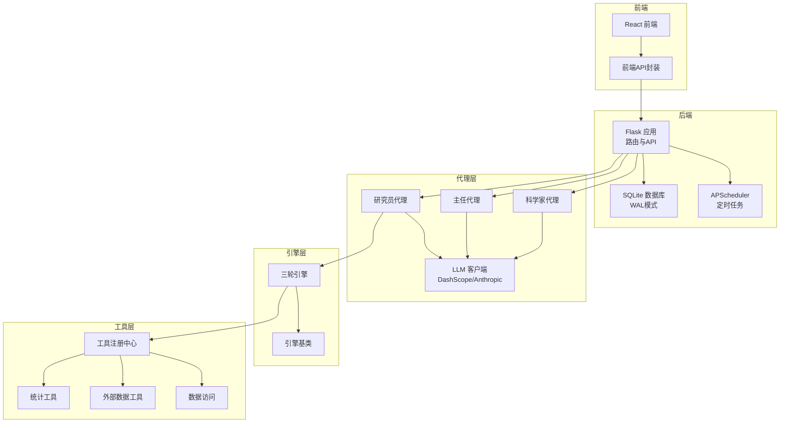
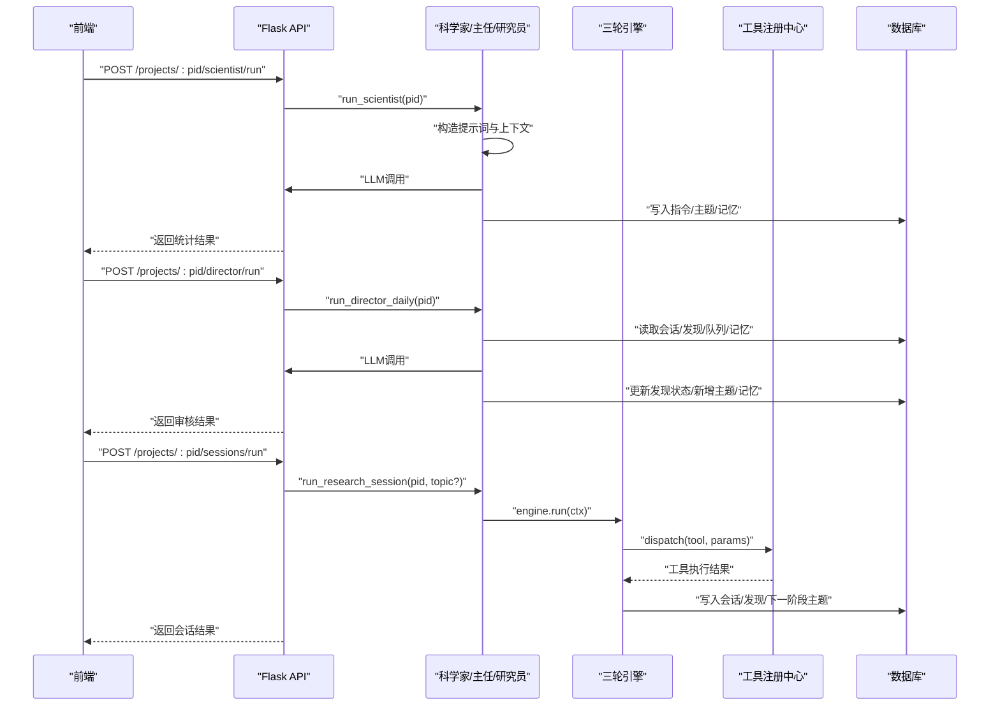
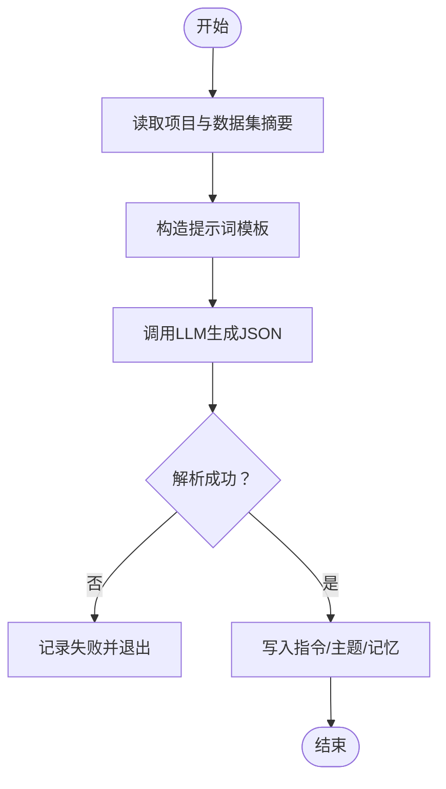
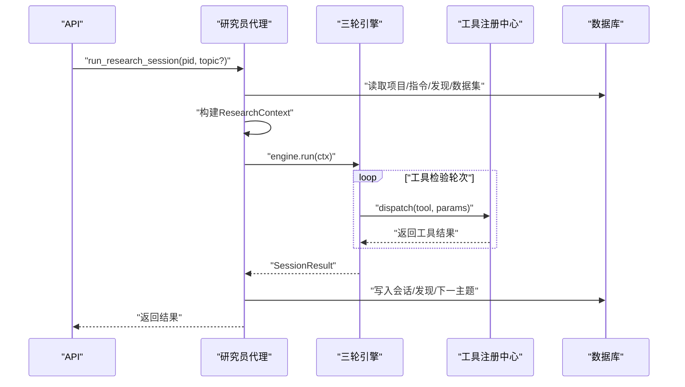
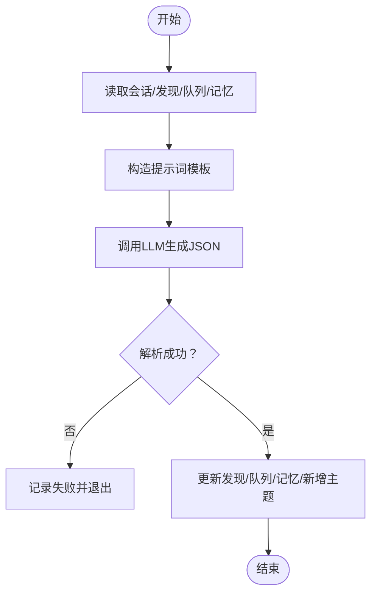
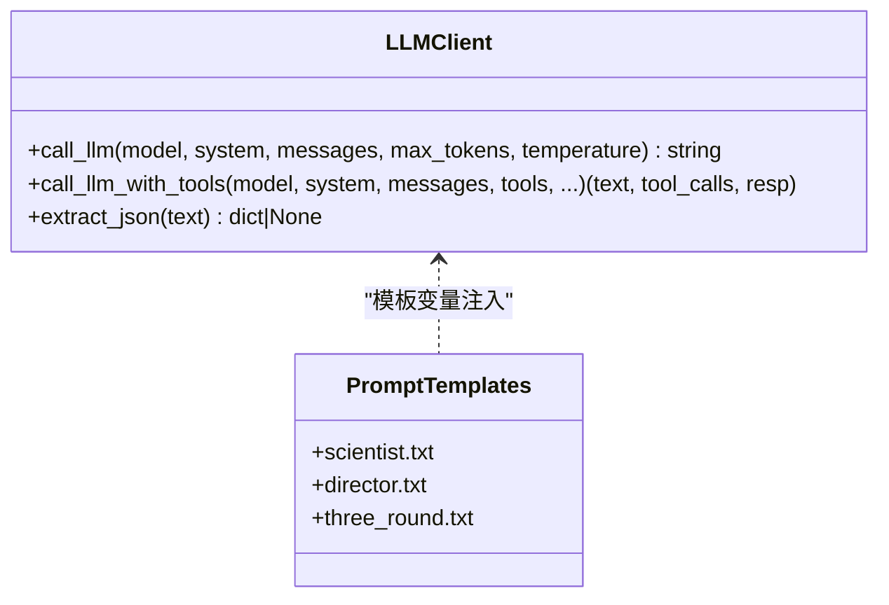
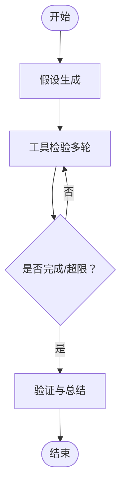
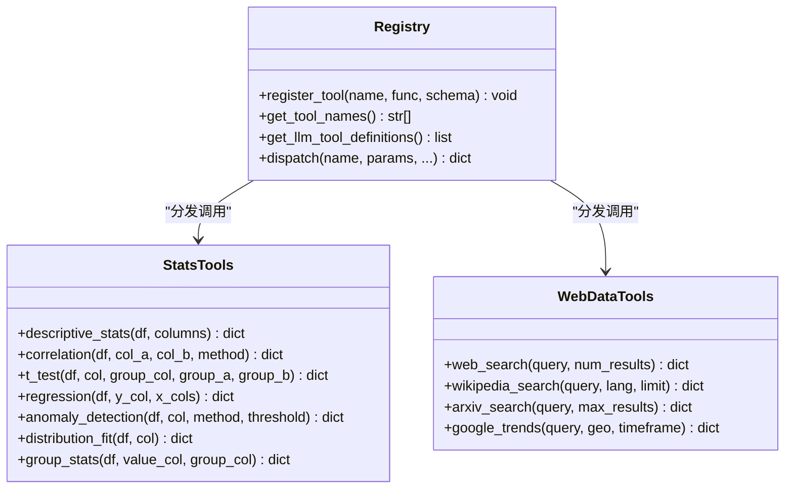
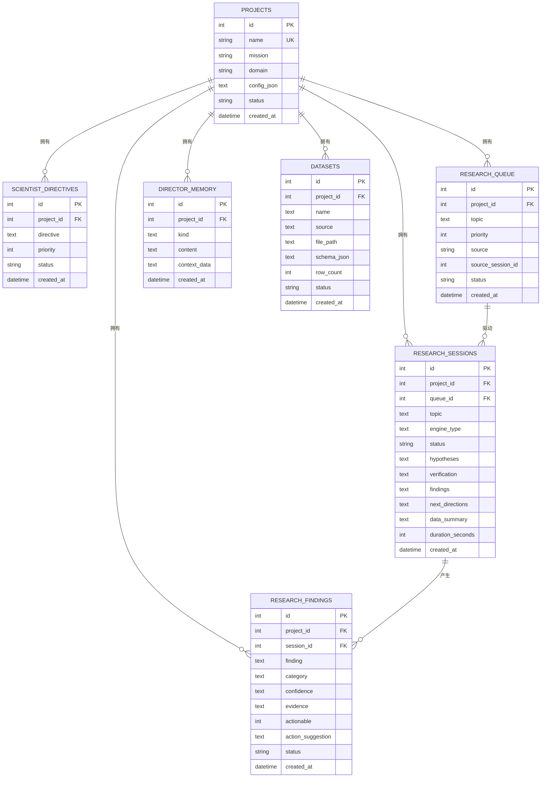
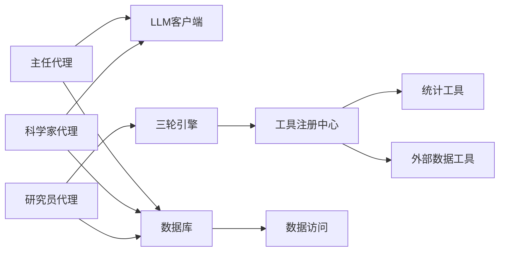

# AI代理系统

<cite>
**本文引用的文件**
- [README.md](file://README.md)
- [app.py](file://app.py)
- [config.py](file://config.py)
- [database.py](file://database.py)
- [agents/scientist.py](file://agents/scientist.py)
- [agents/director.py](file://agents/director.py)
- [agents/researcher.py](file://agents/researcher.py)
- [agents/llm_client.py](file://agents/llm_client.py)
- [engines/base.py](file://engines/base.py)
- [engines/three_round.py](file://engines/three_round.py)
- [tools/registry.py](file://tools/registry.py)
- [tools/stats.py](file://tools/stats.py)
- [tools/web_data.py](file://tools/web_data.py)
- [tools/data_access.py](file://tools/data_access.py)
- [prompts/scientist.txt](file://prompts/scientist.txt)
- [prompts/director.txt](file://prompts/director.txt)
</cite>

## 目录
1. [简介](#简介)
2. [项目结构](#项目结构)
3. [核心组件](#核心组件)
4. [架构总览](#架构总览)
5. [详细组件分析](#详细组件分析)
6. [依赖关系分析](#依赖关系分析)
7. [性能考虑](#性能考虑)
8. [故障排查指南](#故障排查指南)
9. [结论](#结论)
10. [附录](#附录)

## 简介
本项目是一个通用的AI深度研究平台，采用“三级AI团队”协作机制：科学家负责项目创建与战略制定，研究员负责基于三轮引擎的数据分析执行，主任负责质量审核与监督。系统支持7种统计工具与多种外部数据源，具备自动化调度能力，并通过提示词模板与LLM客户端实现可扩展的提示词系统。

## 项目结构
后端采用Flask + Gunicorn + SQLite + APScheduler，前端为React + Vite + TypeScript。核心目录组织如下：
- agents：科学家、主任、研究员代理与LLM客户端
- engines：研究引擎基类与三轮引擎实现
- tools：工具注册中心、统计工具、数据访问、外部数据工具
- prompts：各代理的提示词模板
- frontend：前端页面与API封装
- docs：设计/运维/测试文档
- 根目录：应用入口、配置、数据库层

图表来源
- [app.py:1-182](file://app.py#L1-L182)
- [agents/scientist.py:1-75](file://agents/scientist.py#L1-L75)
- [agents/director.py:1-124](file://agents/director.py#L1-L124)
- [agents/researcher.py:1-114](file://agents/researcher.py#L1-L114)
- [engines/base.py:1-49](file://engines/base.py#L1-L49)
- [engines/three_round.py:1-179](file://engines/three_round.py#L1-L179)
- [tools/registry.py:1-181](file://tools/registry.py#L1-L181)
- [tools/stats.py:1-120](file://tools/stats.py#L1-L120)
- [tools/web_data.py:1-164](file://tools/web_data.py#L1-L164)
- [tools/data_access.py:1-43](file://tools/data_access.py#L1-L43)

章节来源
- [README.md:71-124](file://README.md#L71-L124)
- [app.py:1-182](file://app.py#L1-L182)

## 核心组件
- 科学家代理：根据项目使命与领域，结合可用数据，生成战略指令、初始研究主题与发现分类，并沉淀到主任记忆中。
- 研究员代理：从队列中选取主题，驱动三轮引擎进行假设生成、工具检验与验证总结，持久化会话结果与发现。
- 主任代理：每日审查最近会话、开放发现、队列与主任记忆，进行验证/拒绝、队列调整、新增主题与记忆沉淀。
- LLM客户端：统一管理DashScope（兼容Anthropic协议）API调用，支持普通对话与工具调用，内置JSON提取器。
- 三轮引擎：假设生成 → 工具检验 → 验证总结，支持多轮工具调用与错误恢复。
- 工具注册中心：集中注册统计与外部数据工具，提供LLM工具定义与分发执行。
- 数据库层：以SQLite WAL模式存储项目、指令、队列、会话、发现、记忆与数据集元信息。

章节来源
- [agents/scientist.py:14-75](file://agents/scientist.py#L14-L75)
- [agents/researcher.py:14-114](file://agents/researcher.py#L14-L114)
- [agents/director.py:14-124](file://agents/director.py#L14-L124)
- [agents/llm_client.py:24-114](file://agents/llm_client.py#L24-L114)
- [engines/three_round.py:22-179](file://engines/three_round.py#L22-L179)
- [tools/registry.py:24-181](file://tools/registry.py#L24-L181)
- [database.py:100-344](file://database.py#L100-L344)

## 架构总览
系统采用“代理-引擎-工具-数据”的分层架构。Flask提供REST API，调度器触发周期性任务，代理通过LLM客户端与提示词模板交互，引擎驱动工具执行数据分析，结果回写数据库并反馈给前端。

图表来源
- [app.py:95-177](file://app.py#L95-L177)
- [agents/scientist.py:14-75](file://agents/scientist.py#L14-L75)
- [agents/director.py:14-124](file://agents/director.py#L14-L124)
- [agents/researcher.py:14-114](file://agents/researcher.py#L14-L114)
- [engines/three_round.py:28-179](file://engines/three_round.py#L28-L179)
- [tools/registry.py:24-43](file://tools/registry.py#L24-L43)
- [database.py:171-344](file://database.py#L171-L344)

## 详细组件分析

### 科学家代理（职责边界与工作流）
- 职责边界
  - 仅负责战略层面：分解使命为指令、播种初始主题、定义发现分类。
  - 不直接执行数据分析，不参与队列与会话管理。
- 工作流
  - 读取项目信息与数据集摘要，构造提示词，调用LLM生成JSON结构，入库指令、主题与记忆。
- 决策逻辑
  - 指令优先级1-10，主题需可验证且与现有数据匹配，分类需贴合领域。

图表来源
- [agents/scientist.py:14-75](file://agents/scientist.py#L14-L75)
- [prompts/scientist.txt:1-32](file://prompts/scientist.txt#L1-L32)

章节来源
- [agents/scientist.py:14-75](file://agents/scientist.py#L14-L75)
- [prompts/scientist.txt:1-32](file://prompts/scientist.txt#L1-L32)

### 研究员代理（职责边界与工作流）
- 职责边界
  - 仅负责执行研究：从队列取主题、创建会话、驱动引擎、持久化结果。
  - 不制定战略，不审核发现。
- 工作流
  - 选择主题（手动或自动），构建上下文（指令、近期发现、数据集摘要），创建会话，运行三轮引擎，写入发现与下一阶段主题。
- 决策逻辑
  - 若引擎失败，记录失败状态并更新队列项；若解析JSON失败，标记部分完成。

图表来源
- [agents/researcher.py:14-114](file://agents/researcher.py#L14-L114)
- [engines/three_round.py:28-179](file://engines/three_round.py#L28-L179)
- [tools/registry.py:24-43](file://tools/registry.py#L24-L43)
- [database.py:230-344](file://database.py#L230-L344)

章节来源
- [agents/researcher.py:14-114](file://agents/researcher.py#L14-L114)
- [engines/three_round.py:28-179](file://engines/three_round.py#L28-L179)

### 主任代理（职责边界与工作流）
- 职责边界
  - 仅负责质量监督与管理：审核发现、调整队列、新增主题、沉淀记忆、撰写日报。
  - 不直接产生新发现，不执行数据分析。
- 工作流
  - 读取最近会话、开放发现、队列与记忆，构造提示词，调用LLM生成JSON，更新数据库。
- 决策逻辑
  - 低置信度发现拒绝，强证据发现验证，跨会话寻找关联，记忆沉淀非显而易见模式。

图表来源
- [agents/director.py:14-124](file://agents/director.py#L14-L124)
- [prompts/director.txt:1-43](file://prompts/director.txt#L1-L43)

章节来源
- [agents/director.py:14-124](file://agents/director.py#L14-L124)
- [prompts/director.txt:1-43](file://prompts/director.txt#L1-L43)

### LLM客户端与提示词系统
- LLM客户端
  - 使用DashScope（兼容Anthropic协议）作为默认模型服务，支持普通对话与工具调用两种模式。
  - 提供JSON提取器，增强对LLM输出中夹杂文本或Markdown围栏的鲁棒性。
- 提示词系统
  - 采用模板变量注入（mission、domain、datasets_summary等）的方式，确保不同项目上下文下的定制化。
  - 三轮引擎在每一轮明确角色定位与输出约束，减少幻觉与格式偏差。
- 扩展机制
  - 新增代理只需准备对应提示词模板与调用逻辑，即可无缝接入。
  - 工具注册中心支持动态注册新工具，LLM侧自动获得工具定义。

图表来源
- [agents/llm_client.py:24-114](file://agents/llm_client.py#L24-L114)
- [prompts/scientist.txt:1-32](file://prompts/scientist.txt#L1-L32)
- [prompts/director.txt:1-43](file://prompts/director.txt#L1-L43)

章节来源
- [agents/llm_client.py:24-114](file://agents/llm_client.py#L24-L114)
- [prompts/scientist.txt:1-32](file://prompts/scientist.txt#L1-L32)
- [prompts/director.txt:1-43](file://prompts/director.txt#L1-L43)

### 三轮引擎（Processing Logic）
- 第一轮：假设生成
  - 基于指令与近期发现，生成可测试的假设及测试计划。
- 第二轮：工具检验
  - 逐个假设调用统计工具，收集证据；限制最大轮次避免无限循环。
- 第三轮：验证与总结
  - 基于证据对假设进行判定，提炼发现、建议下一步方向，并汇总数据特征。

图表来源
- [engines/three_round.py:28-179](file://engines/three_round.py#L28-L179)

章节来源
- [engines/three_round.py:28-179](file://engines/three_round.py#L28-L179)

### 工具注册中心与统计工具
- 注册中心
  - 统一注册工具名称、函数与输入Schema，向LLM暴露工具定义，支持按名称分发执行。
- 统计工具
  - 包含描述性统计、相关性、t检验、回归、异常检测、分布拟合、分组统计等，均面向DataFrame操作。
- 外部数据工具
  - 支持网络搜索、Wikipedia、arXiv、Google Trends等，提供结构化结果。

图表来源
- [tools/registry.py:24-181](file://tools/registry.py#L24-L181)
- [tools/stats.py:10-120](file://tools/stats.py#L10-L120)
- [tools/web_data.py:13-164](file://tools/web_data.py#L13-L164)

章节来源
- [tools/registry.py:24-181](file://tools/registry.py#L24-L181)
- [tools/stats.py:10-120](file://tools/stats.py#L10-L120)
- [tools/web_data.py:13-164](file://tools/web_data.py#L13-L164)

### 数据访问与数据库层
- 数据访问
  - 加载指定项目的数据集文件，支持CSV/JSON/XLSX等；生成数据集摘要供LLM上下文使用。
- 数据库层
  - 采用SQLite WAL模式提升并发写入性能；定义项目、指令、队列、会话、发现、记忆、数据集等表结构与索引。
  - 提供CRUD与聚合查询接口，支撑前端展示与代理逻辑。

图表来源
- [database.py:100-344](file://database.py#L100-L344)

章节来源
- [tools/data_access.py:10-43](file://tools/data_access.py#L10-L43)
- [database.py:100-344](file://database.py#L100-L344)

## 依赖关系分析
- 组件耦合
  - 代理层依赖LLM客户端与提示词模板；研究员代理进一步依赖引擎与工具注册中心。
  - 引擎依赖工具注册中心与数据访问；工具依赖pandas/numpy/scipy等库。
  - 数据库层被所有模块读写，提供统一的数据契约。
- 外部依赖
  - DashScope（Anthropic协议）作为LLM服务；SQLite用于本地存储；前端React/Vite提供可视化界面。
- 潜在环路
  - 代理-引擎-工具-数据形成单向依赖链，无循环依赖风险。

图表来源
- [agents/scientist.py:1-75](file://agents/scientist.py#L1-L75)
- [agents/director.py:1-124](file://agents/director.py#L1-L124)
- [agents/researcher.py:1-114](file://agents/researcher.py#L1-L114)
- [engines/three_round.py:1-179](file://engines/three_round.py#L1-L179)
- [tools/registry.py:1-181](file://tools/registry.py#L1-L181)
- [tools/stats.py:1-120](file://tools/stats.py#L1-L120)
- [tools/web_data.py:1-164](file://tools/web_data.py#L1-L164)
- [database.py:100-344](file://database.py#L100-L344)

章节来源
- [agents/scientist.py:1-75](file://agents/scientist.py#L1-L75)
- [agents/director.py:1-124](file://agents/director.py#L1-L124)
- [agents/researcher.py:1-114](file://agents/researcher.py#L1-L114)
- [engines/three_round.py:1-179](file://engines/three_round.py#L1-L179)
- [tools/registry.py:1-181](file://tools/registry.py#L1-L181)
- [database.py:100-344](file://database.py#L100-L344)

## 性能考虑
- 数据库
  - 使用SQLite WAL模式提升写入吞吐；为高频查询字段建立索引（队列、会话、发现、记忆、数据集）。
- 引擎与工具
  - 限制工具检验轮次上限，避免长耗时；统计工具尽量利用向量化计算；对外部API设置合理超时。
- LLM调用
  - 控制system与messages长度，合理设置max_tokens与temperature；对输出进行JSON提取，减少后处理成本。
- 前后端
  - 前端按需加载与分页展示；后端API增加限流与缓存策略（可选）。

## 故障排查指南
- LLM调用失败
  - 检查API密钥与基础URL配置；查看日志中的错误堆栈；确认模型名称正确。
- JSON解析失败
  - 检查提示词模板是否强制输出JSON；确认LLM输出包含JSON围栏或纯JSON。
- 工具执行异常
  - 检查数据集是否存在、列名是否匹配；确认工具参数完整；查看工具内部异常日志。
- 数据库连接问题
  - 确认DB路径存在且可写；检查WAL模式与外键约束；查看事务回滚日志。
- 前端无法访问
  - 确认静态资源路径与Nginx反代配置；检查Flask路由与CORS设置。

章节来源
- [agents/llm_client.py:42-44](file://agents/llm_client.py#L42-L44)
- [engines/three_round.py:105-115](file://engines/three_round.py#L105-L115)
- [tools/registry.py:40-42](file://tools/registry.py#L40-L42)
- [database.py:113-122](file://database.py#L113-L122)
- [app.py:24-38](file://app.py#L24-L38)

## 结论
该系统通过“科学家-主任-研究员”的三级协作与三轮引擎的标准化流程，实现了从战略制定到数据驱动验证的闭环。提示词模板与工具注册中心提供了良好的扩展性，LLM客户端与数据库层保证了稳定性与可维护性。建议在生产环境中完善监控与告警、引入缓存与异步任务队列，并持续迭代提示词与工具集以适配更多领域。

## 附录
- 配置项
  - 数据库路径、数据集根目录、DashScope API密钥与基础URL、模型名称（科研/科学家/主任）。
- API一览（节选）
  - 项目：GET/POST /ainstein/api/projects
  - 队列：GET/POST /ainstein/api/projects/:pid/queue
  - 会话：GET /ainstein/api/projects/:pid/sessions, POST /ainstein/api/projects/:pid/sessions/run
  - 发现：GET /ainstein/api/projects/:pid/findings
  - 数据集：GET /ainstein/api/projects/:pid/datasets, POST /ainstein/api/projects/:pid/datasets/upload
  - 科学家/主任：POST /ainstein/api/projects/:pid/scientist/run, POST /ainstein/api/projects/:pid/director/run

章节来源
- [config.py:4-10](file://config.py#L4-L10)
- [app.py:50-177](file://app.py#L50-L177)