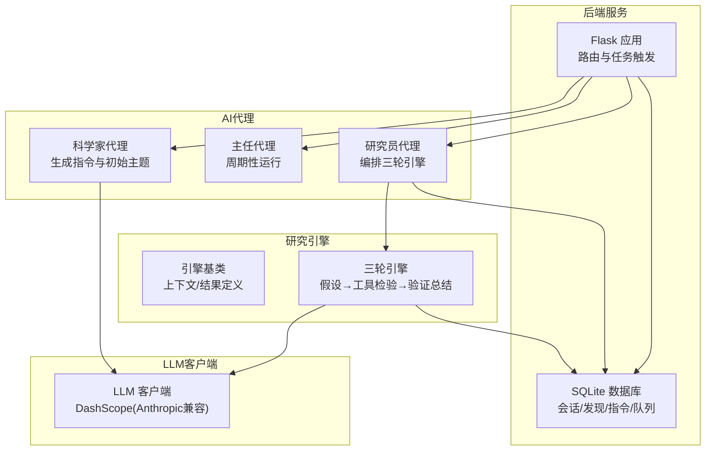
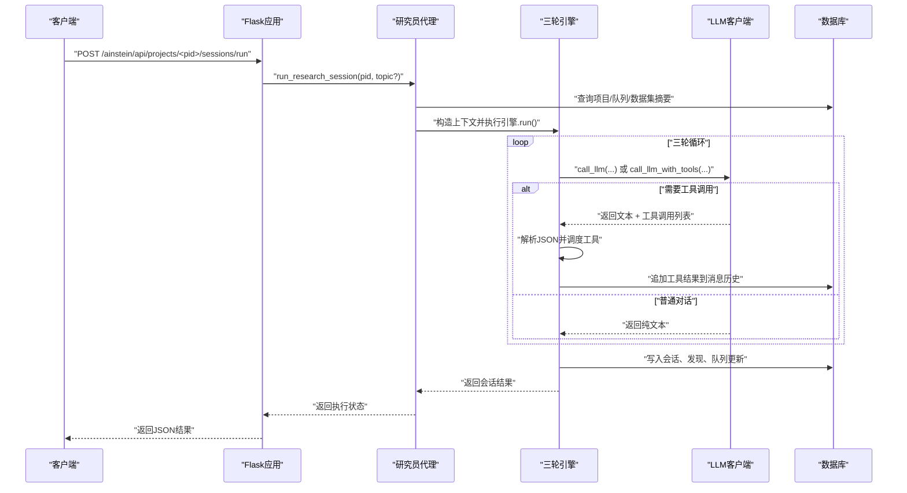
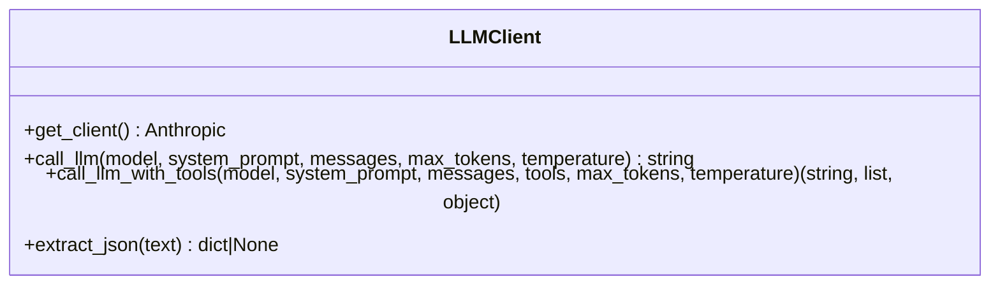
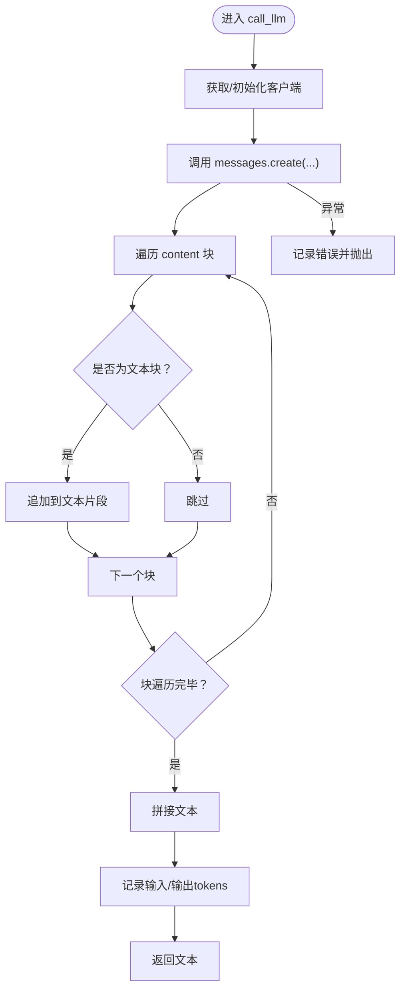
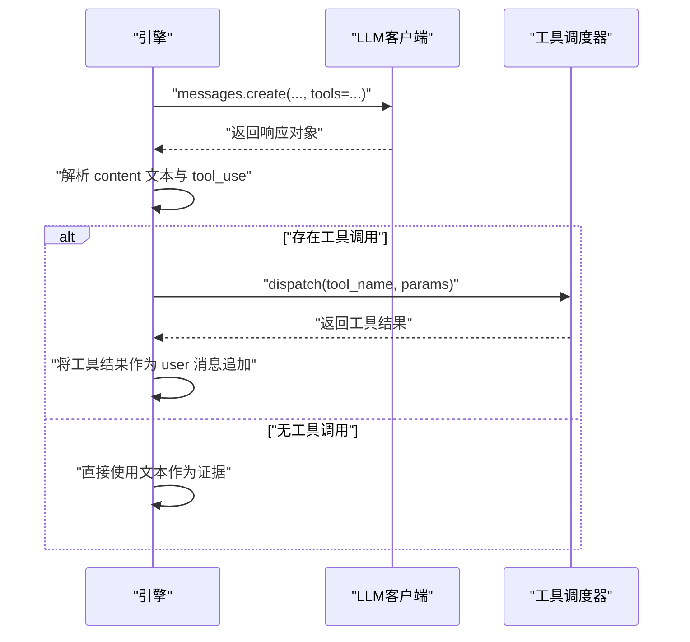
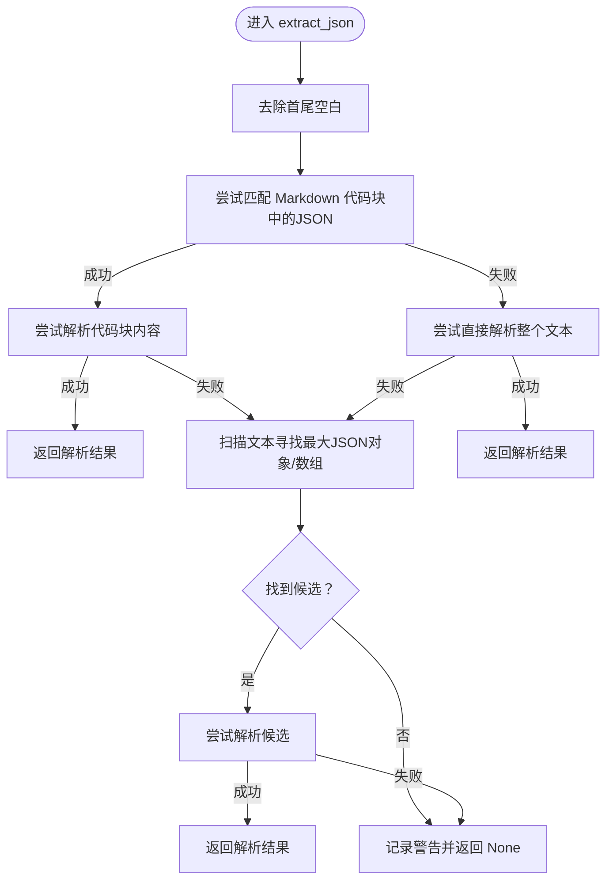
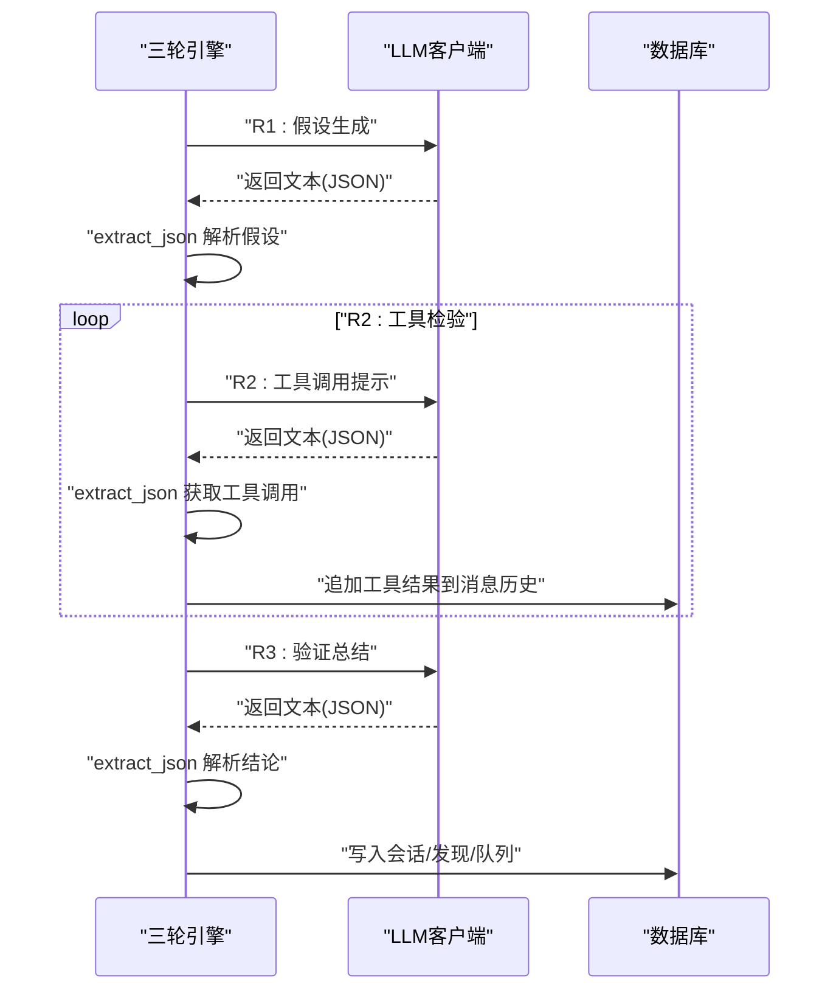
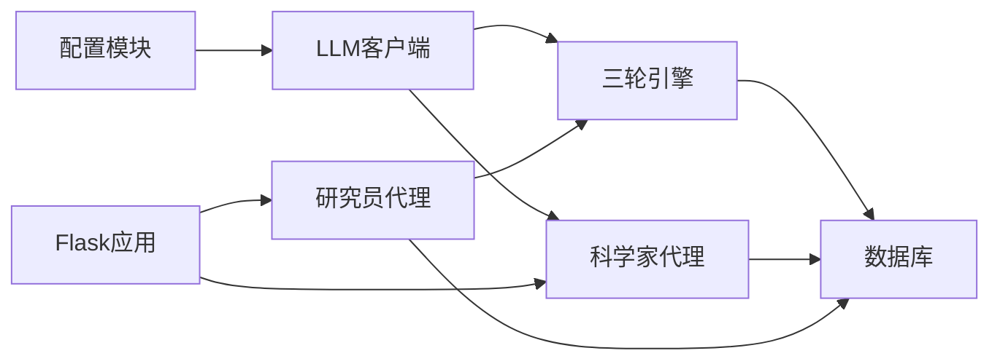

# LLM客户端

<cite>
**本文引用的文件**
- [agents/llm_client.py](file://agents/llm_client.py)
- [config.py](file://config.py)
- [engines/base.py](file://engines/base.py)
- [engines/three_round.py](file://engines/three_round.py)
- [agents/scientist.py](file://agents/scientist.py)
- [agents/researcher.py](file://agents/researcher.py)
- [database.py](file://database.py)
- [app.py](file://app.py)
- [README.md](file://README.md)
</cite>

## 目录
1. [简介](#简介)
2. [项目结构](#项目结构)
3. [核心组件](#核心组件)
4. [架构总览](#架构总览)
5. [详细组件分析](#详细组件分析)
6. [依赖关系分析](#依赖关系分析)
7. [性能考虑](#性能考虑)
8. [故障排查指南](#故障排查指南)
9. [结论](#结论)
10. [附录](#附录)

## 简介
本文件为“LLM客户端”的综合技术文档，聚焦于统一的大语言模型接口设计与实现，重点覆盖以下方面：
- DashScope（兼容 Anthropic 协议）的集成方式与配置
- 请求参数配置与响应处理机制
- call_llm 与带工具调用的 call_llm_with_tools 的实现细节
- extract_json 的 JSON 提取与验证逻辑
- 错误处理、重试策略建议与性能优化方案
- API 密钥管理、模型参数调优与调试技巧
- 使用示例与集成指南

## 项目结构
该工程采用“后端服务 + 三层AI代理 + 研究引擎 + 数据库层”的分层组织方式。LLM 客户端位于 agents/llm_client.py，负责统一调用 DashScope（通过 Anthropic 兼容客户端），并为上层代理与引擎提供一致的接口。

图表来源
- [app.py:1-182](file://app.py#L1-L182)
- [agents/scientist.py:1-75](file://agents/scientist.py#L1-L75)
- [agents/researcher.py:1-114](file://agents/researcher.py#L1-L114)
- [engines/base.py:1-49](file://engines/base.py#L1-L49)
- [engines/three_round.py:1-179](file://engines/three_round.py#L1-L179)
- [agents/llm_client.py:1-114](file://agents/llm_client.py#L1-L114)
- [database.py:1-344](file://database.py#L1-L344)

章节来源
- [README.md:1-146](file://README.md#L1-L146)
- [app.py:1-182](file://app.py#L1-L182)

## 核心组件
- LLM 客户端：封装 DashScope API（通过 Anthropic 兼容客户端），提供统一的文本对话与工具调用接口，并内置 JSON 提取与校验能力。
- 配置模块：集中管理 API Key、基础URL、模型名称等环境变量。
- 引擎基类：定义研究上下文与会话结果的数据结构，约束引擎实现。
- 三轮引擎：实现“假设生成 → 工具检验 → 验证总结”的闭环流程，调用 LLM 客户端进行多轮对话与工具调用。
- 科学家代理：基于 LLM 生成研究指令与初始主题，写入数据库。
- 研究员代理：从队列中选取主题，驱动三轮引擎执行，持久化结果。
- 数据库层：提供项目、会话、发现、指令、队列、记忆、数据集等表结构与CRUD操作。

章节来源
- [agents/llm_client.py:1-114](file://agents/llm_client.py#L1-L114)
- [config.py:1-11](file://config.py#L1-L11)
- [engines/base.py:1-49](file://engines/base.py#L1-L49)
- [engines/three_round.py:1-179](file://engines/three_round.py#L1-L179)
- [agents/scientist.py:1-75](file://agents/scientist.py#L1-L75)
- [agents/researcher.py:1-114](file://agents/researcher.py#L1-L114)
- [database.py:1-344](file://database.py#L1-L344)

## 架构总览
下图展示从HTTP请求到LLM调用、工具调用与结果持久化的整体流程。

图表来源
- [app.py:95-104](file://app.py#L95-L104)
- [agents/researcher.py:14-114](file://agents/researcher.py#L14-L114)
- [engines/three_round.py:28-179](file://engines/three_round.py#L28-L179)
- [agents/llm_client.py:24-71](file://agents/llm_client.py#L24-L71)
- [database.py:232-344](file://database.py#L232-L344)

## 详细组件分析

### LLM 客户端（DashScope Anthropic兼容）
- 单例客户端初始化：通过全局变量缓存 Anthropic 客户端实例，避免重复创建。
- 统一接口：
  - 文本对话：call_llm(model, system_prompt, messages, max_tokens, temperature)
  - 工具调用：call_llm_with_tools(model, system_prompt, messages, tools, max_tokens, temperature)
- 响应处理：
  - 文本对话：聚合 content 中的文本块，记录输入/输出 token 使用量。
  - 工具调用：同时解析文本与 tool_use 块，返回文本、工具调用列表与原始响应对象。
- 错误处理：捕获异常并记录日志，随后重新抛出，便于上层控制流处理。

图表来源
- [agents/llm_client.py:14-114](file://agents/llm_client.py#L14-L114)

章节来源
- [agents/llm_client.py:14-114](file://agents/llm_client.py#L14-L114)

### call_llm 实现细节
- 模型选择：通过参数传入，支持不同模型名称（如 kimi-k2.6）。
- 系统提示词：system 参数承载角色与上下文约束。
- 消息传递协议：messages 为列表，每项含 role 与 content；引擎在工具调用阶段会将工具结果作为 user 角色消息追加至历史。
- 输出解析：遍历响应内容块，拼接文本；记录 token 使用量；异常时记录错误并向上抛出。

图表来源
- [agents/llm_client.py:24-44](file://agents/llm_client.py#L24-L44)

章节来源
- [agents/llm_client.py:24-44](file://agents/llm_client.py#L24-L44)

### call_llm_with_tools 实现细节
- 工具定义：tools 参数用于声明可用工具，引擎在第二轮中引导 LLM 以约定格式输出工具调用。
- 输出解析：同时收集文本与 tool_use 块，返回文本、工具调用列表与原始响应对象，便于后续消息历史扩展与结果持久化。

图表来源
- [agents/llm_client.py:47-71](file://agents/llm_client.py#L47-L71)
- [engines/three_round.py:105-135](file://engines/three_round.py#L105-L135)

章节来源
- [agents/llm_client.py:47-71](file://agents/llm_client.py#L47-L71)
- [engines/three_round.py:105-135](file://engines/three_round.py#L105-L135)

### extract_json 的JSON提取与验证逻辑
- 支持多种输入形态：
  - Markdown 代码块（含可选 json 语言标记）优先匹配。
  - 直接 JSON 字符串尝试解析。
  - 在未被上述两种方式命中时，扫描文本中的最大合法 JSON 对象/数组。
- 行为特征：
  - 成功解析返回字典或列表；失败返回 None 并记录警告日志。
  - 保证在混合文本场景下尽可能提取有效 JSON 结构。

图表来源
- [agents/llm_client.py:73-114](file://agents/llm_client.py#L73-L114)

章节来源
- [agents/llm_client.py:73-114](file://agents/llm_client.py#L73-L114)

### 配置与模型参数
- API 密钥与基础URL：通过环境变量注入，便于在不同部署环境中灵活切换。
- 模型名称：分别针对科学家、主任、研究员设置默认模型名，可通过环境变量覆盖。
- 参数建议：
  - 温度（temperature）：在假设生成阶段保持较高温度以提升创造性；在工具调用与验证阶段降低温度以增强确定性。
  - 最大令牌数（max_tokens）：根据任务复杂度调整，避免截断关键信息。

章节来源
- [config.py:1-11](file://config.py#L1-L11)

### 三轮引擎与消息历史
- 第一轮：生成可检验的假设，返回 JSON。
- 第二轮：引导 LLM 以固定 JSON 格式输出工具调用，调度工具并把结果作为新消息追加到历史，最多轮次受控。
- 第三轮：基于工具结果与假设生成最终验证结论、发现与后续方向，返回 JSON。

图表来源
- [engines/three_round.py:28-179](file://engines/three_round.py#L28-L179)
- [agents/llm_client.py:24-71](file://agents/llm_client.py#L24-L71)

章节来源
- [engines/three_round.py:28-179](file://engines/three_round.py#L28-L179)

### 科学家代理与指令生成
- 读取项目信息与数据集摘要，拼装系统提示词与用户消息。
- 调用 LLM 生成结构化指令与初始主题，写入数据库并记录策略要点。

章节来源
- [agents/scientist.py:14-75](file://agents/scientist.py#L14-L75)

### 研究员代理与会话编排
- 从数据库获取项目、队列、数据集摘要与近期发现、指令，构造研究上下文。
- 创建会话记录，执行引擎，持久化结果，更新队列状态。

章节来源
- [agents/researcher.py:14-114](file://agents/researcher.py#L14-L114)

## 依赖关系分析
- LLM 客户端依赖配置模块提供的 API Key 与基础URL。
- 三轮引擎依赖 LLM 客户端与工具注册表，同时与数据库交互以读写会话与发现。
- 科学家代理与研究员代理分别依赖 LLM 客户端与数据库。
- Flask 应用提供 HTTP 入口，触发代理与引擎执行。

图表来源
- [config.py:1-11](file://config.py#L1-L11)
- [agents/llm_client.py:1-114](file://agents/llm_client.py#L1-L114)
- [engines/three_round.py:1-179](file://engines/three_round.py#L1-L179)
- [agents/scientist.py:1-75](file://agents/scientist.py#L1-L75)
- [agents/researcher.py:1-114](file://agents/researcher.py#L1-L114)
- [database.py:1-344](file://database.py#L1-L344)
- [app.py:1-182](file://app.py#L1-L182)

章节来源
- [app.py:1-182](file://app.py#L1-L182)
- [engines/base.py:1-49](file://engines/base.py#L1-L49)

## 性能考虑
- 客户端复用：通过单例客户端减少连接与初始化开销。
- 日志与指标：记录输入/输出 tokens，便于成本与性能评估。
- 温度与令牌数：在不同阶段合理设置 temperature 与 max_tokens，平衡质量与效率。
- 工具调用轮次限制：在引擎中设置最大轮次，防止无限循环与超时。
- 数据库事务：使用上下文管理器确保事务一致性，避免部分写入。

章节来源
- [agents/llm_client.py:14-44](file://agents/llm_client.py#L14-L44)
- [engines/three_round.py:103-135](file://engines/three_round.py#L103-L135)
- [database.py:109-123](file://database.py#L109-L123)

## 故障排查指南
- API密钥与URL问题：检查环境变量是否正确设置，确认 DashScope 基础URL与模型名称可用。
- JSON解析失败：查看 extract_json 的警告日志，确认 LLM 输出是否符合预期格式；必要时提高 max_tokens 或调整提示词。
- 工具调用异常：检查工具名称与参数是否匹配；关注引擎中工具调用轮次上限与消息历史追加逻辑。
- 会话状态异常：核对数据库中会话状态字段与队列状态更新逻辑，确保异常时正确回滚或标记失败。
- 超时与重试：当前实现未内置重试机制，可在调用侧增加指数退避重试策略，注意幂等性与去重。

章节来源
- [agents/llm_client.py:73-114](file://agents/llm_client.py#L73-L114)
- [engines/three_round.py:105-135](file://engines/three_round.py#L105-L135)
- [database.py:240-249](file://database.py#L240-L249)

## 结论
本LLM客户端以 DashScope（Anthropic兼容）为基础，提供了统一的文本对话与工具调用接口，并内置稳健的JSON提取与验证逻辑。结合三轮引擎与数据库层，形成从指令生成到发现沉淀的完整闭环。通过合理的参数配置与性能优化，可在保证质量的同时提升吞吐与稳定性。

## 附录

### API密钥管理与模型参数调优
- API密钥与基础URL：通过环境变量注入，便于CI/CD与多环境部署。
- 模型参数：
  - 温度（temperature）：创造性任务可适度提高；工具调用与结论阶段建议降低。
  - 最大令牌数（max_tokens）：根据提示词长度与期望输出规模动态调整。
  - 工具调用轮次：限制最大轮次，避免长链路阻塞。

章节来源
- [config.py:1-11](file://config.py#L1-L11)
- [engines/three_round.py:103-135](file://engines/three_round.py#L103-L135)

### 调试技巧
- 启用详细日志：观察 LLM 调用的 tokens 使用情况与工具调用次数。
- 分阶段验证：先验证第一轮假设生成，再逐步推进到工具调用与结论。
- 输出规范化：在提示词中明确要求固定JSON格式，减少解析歧义。

章节来源
- [agents/llm_client.py:24-71](file://agents/llm_client.py#L24-L71)
- [engines/three_round.py:80-91](file://engines/three_round.py#L80-L91)

### 使用示例与集成指南
- 启动后端服务：参考项目自述文件中的本地开发步骤，准备Python与Node环境，配置.env并初始化数据库。
- 集成LLM客户端：
  - 在代理或引擎中导入 LLM 客户端函数，按需传入模型名、系统提示词与消息历史。
  - 使用 extract_json 确保结构化输出的可靠性。
- 集成数据库：
  - 使用数据库层提供的CRUD方法维护项目、会话、发现、指令与队列状态。

章节来源
- [README.md:17-70](file://README.md#L17-L70)
- [app.py:179-182](file://app.py#L179-L182)
- [database.py:127-344](file://database.py#L127-L344)