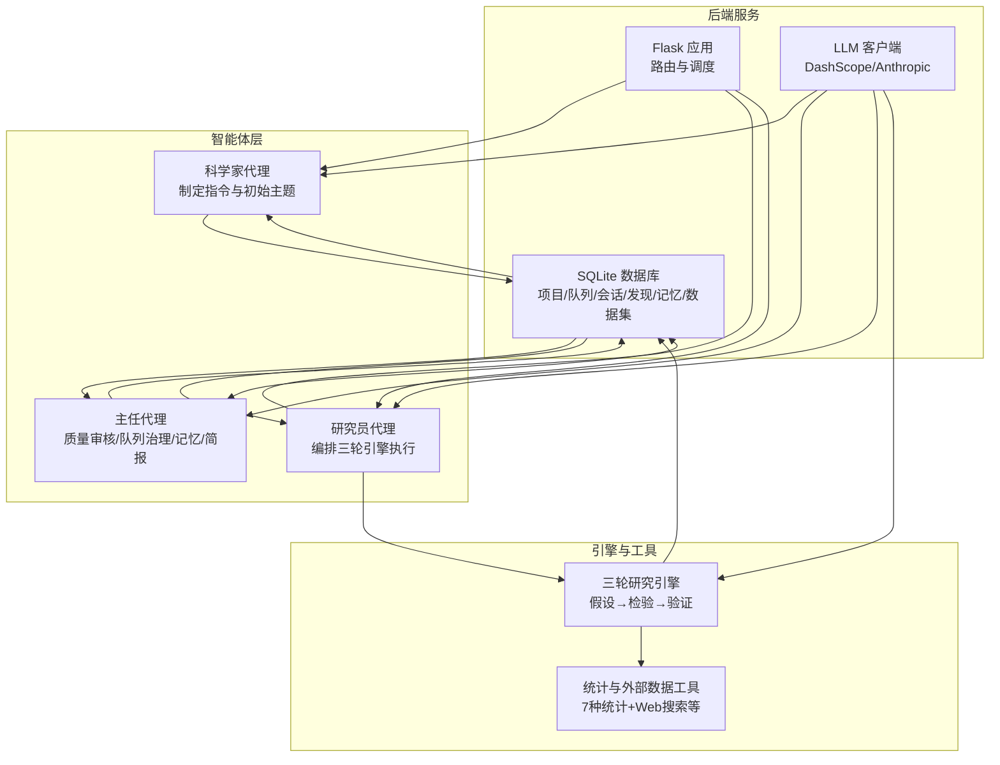
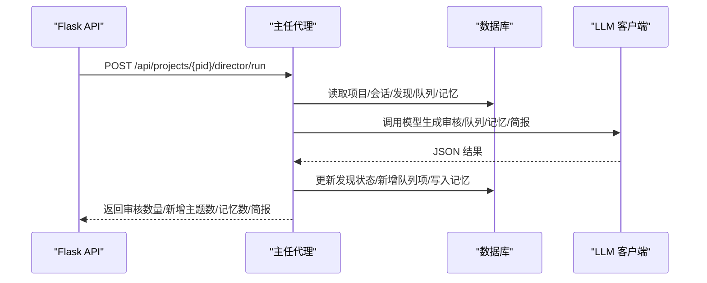
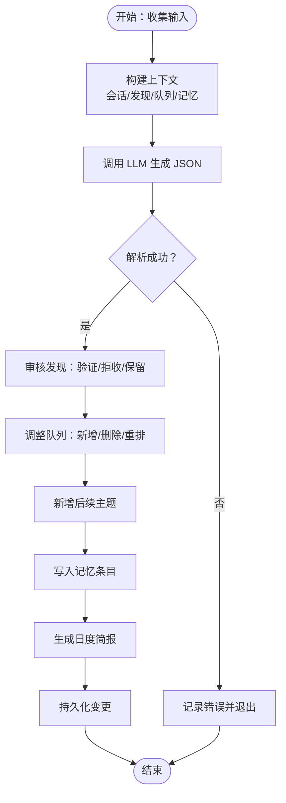
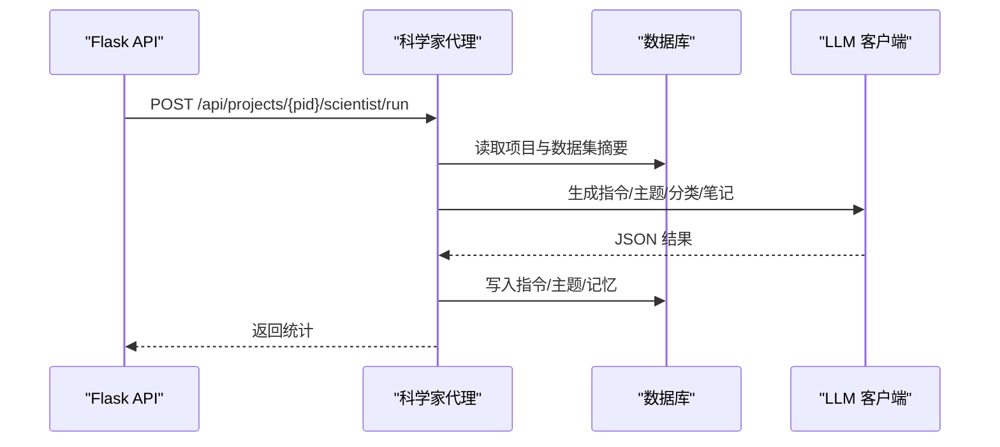
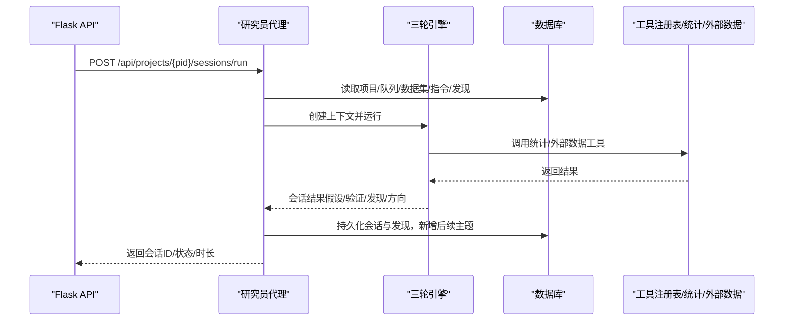
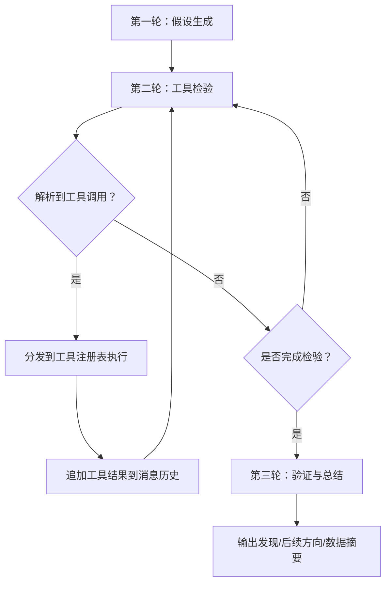
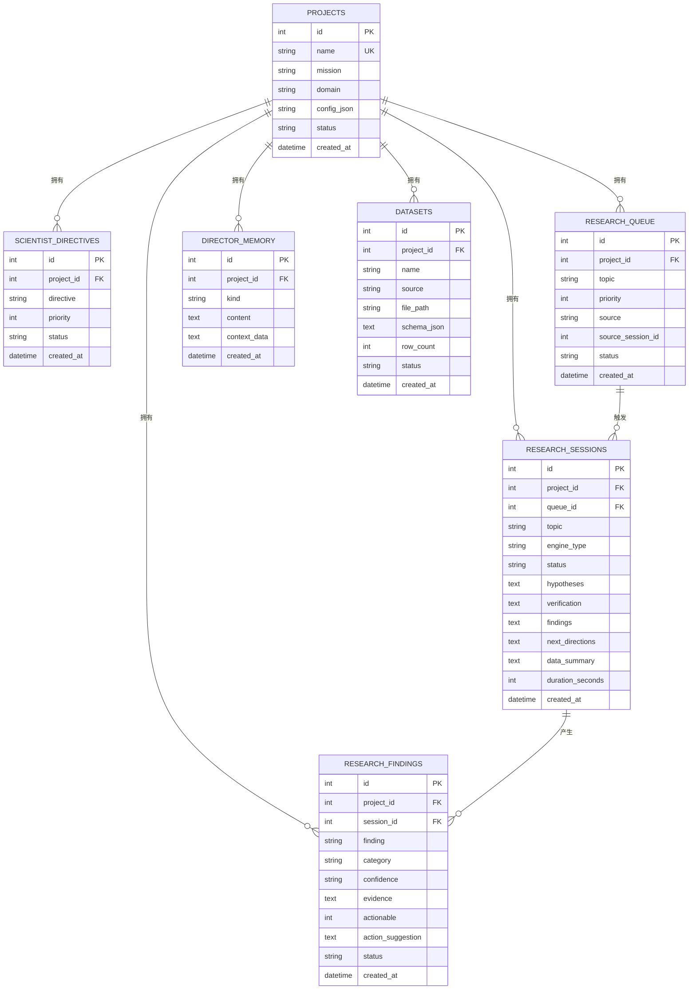
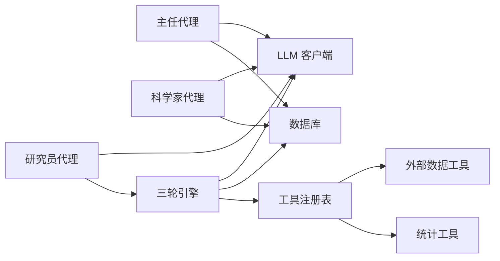

# 主任代理

<cite>
**本文引用的文件**
- [agents/director.py](file://agents/director.py)
- [agents/scientist.py](file://agents/scientist.py)
- [agents/researcher.py](file://agents/researcher.py)
- [engines/base.py](file://engines/base.py)
- [engines/three_round.py](file://engines/three_round.py)
- [tools/registry.py](file://tools/registry.py)
- [tools/stats.py](file://tools/stats.py)
- [tools/web_data.py](file://tools/web_data.py)
- [database.py](file://database.py)
- [config.py](file://config.py)
- [prompts/director.txt](file://prompts/director.txt)
- [prompts/scientist.txt](file://prompts/scientist.txt)
- [prompts/researcher.txt](file://prompts/researcher.txt)
- [prompts/three_round.txt](file://prompts/three_round.txt)
- [app.py](file://app.py)
- [README.md](file://README.md)
</cite>

## 目录
1. [简介](#简介)
2. [项目结构](#项目结构)
3. [核心组件](#核心组件)
4. [架构总览](#架构总览)
5. [详细组件分析](#详细组件分析)
6. [依赖关系分析](#依赖关系分析)
7. [性能考量](#性能考量)
8. [故障排查指南](#故障排查指南)
9. [结论](#结论)
10. [附录](#附录)

## 简介
本文件围绕“主任代理”的质量控制与监督职能展开，系统阐述其在项目生命周期中的职责边界、工作流与决策逻辑。主任代理负责：
- 日常质量审核：对研究员产出的发现进行验证与拒收，确保高质量成果沉淀
- 队列治理：淘汰无效/过时课题，基于发现动态新增后续研究主题，调整优先级
- 指令更新：标记已完成或过时的战略指令
- 记忆积累：沉淀关键洞察，形成可复用的知识资产
- 撰写简报：向项目所有者提供日度进展与建议

同时，本文解释主任代理如何与科学家代理协作（前者监督后者制定的战略与初始主题），并给出配置参数、评估标准与最佳实践。

## 项目结构
系统采用三层 AI 团队（科学家→主任→研究员）+ 三轮研究引擎的架构。数据持久化由 SQLite 提供，前后端通过 Flask API 暴露管理与可视化能力。

图表来源
- [app.py:1-182](file://app.py#L1-L182)
- [agents/scientist.py:14-75](file://agents/scientist.py#L14-L75)
- [agents/director.py:14-124](file://agents/director.py#L14-L124)
- [agents/researcher.py:14-114](file://agents/researcher.py#L14-L114)
- [engines/three_round.py:22-179](file://engines/three_round.py#L22-L179)
- [tools/registry.py:24-43](file://tools/registry.py#L24-L43)
- [database.py:100-344](file://database.py#L100-L344)

章节来源
- [README.md:71-124](file://README.md#L71-L124)
- [app.py:155-177](file://app.py#L155-L177)

## 核心组件
- 主任代理（Director Agent）
  - 角色定位：项目日常质量监督者与知识管理者
  - 输入：项目使命、领域、最近会话摘要、开放发现列表、研究队列、主任记忆
  - 输出：发现审核动作、队列变更、新增主题、记忆条目、日度简报
  - 关键实现：[agents/director.py:14-124](file://agents/director.py#L14-L124)，Prompt：[prompts/director.txt:1-43](file://prompts/director.txt#L1-43)

- 科学家代理（Scientist Agent）
  - 角色定位：战略制定者，播种初始指令与主题
  - 输入：项目使命、领域、可用数据集摘要
  - 输出：战略指令、初始主题、发现分类、策略笔记
  - 关键实现：[agents/scientist.py:14-75](file://agents/scientist.py#L14-L75)，Prompt：[prompts/scientist.txt:1-32](file://prompts/scientist.txt#L1-32)

- 研究员代理（Researcher Agent）
  - 角色定位：执行者，编排引擎进行三轮研究
  - 输入：项目上下文、队列选题、近期发现、指令
  - 输出：会话结果（假设、验证、发现、后续方向）、持久化
  - 关键实现：[agents/researcher.py:14-114](file://agents/researcher.py#L14-L114)

- 三轮研究引擎（Three-Round Engine）
  - 角色定位：标准化研究流程（假设生成→工具检验→验证总结）
  - 输入：任务主题、指令、近期发现、数据集摘要
  - 输出：假设、工具调用结果、验证结论、发现与后续方向
  - 关键实现：[engines/three_round.py:22-179](file://engines/three_round.py#L22-L179)，Prompt：[prompts/three_round.txt:1-15](file://prompts/three_round.txt#L1-15)

- 工具与注册表
  - 统计工具：描述性统计、相关性、t 检验、回归、异常检测、分布拟合、分组统计
  - 外部数据工具：Web 搜索、Wikipedia、arXiv、Google Trends
  - 注册与分发：[tools/registry.py:24-43](file://tools/registry.py#L24-L43)，[tools/stats.py:10-120](file://tools/stats.py#L10-L120)，[tools/web_data.py:13-164](file://tools/web_data.py#L13-L164)

- 数据库与状态机
  - 表：projects、scientist_directives、research_queue、research_sessions、research_findings、director_memory、datasets
  - 关键接口：增删改查、索引、统计聚合
  - 关键实现：[database.py:100-344](file://database.py#L100-L344)

章节来源
- [agents/director.py:14-124](file://agents/director.py#L14-L124)
- [agents/scientist.py:14-75](file://agents/scientist.py#L14-L75)
- [agents/researcher.py:14-114](file://agents/researcher.py#L14-L114)
- [engines/three_round.py:22-179](file://engines/three_round.py#L22-L179)
- [tools/registry.py:24-43](file://tools/registry.py#L24-L43)
- [tools/stats.py:10-120](file://tools/stats.py#L10-L120)
- [tools/web_data.py:13-164](file://tools/web_data.py#L13-L164)
- [database.py:100-344](file://database.py#L100-L344)

## 架构总览
主任代理位于科学家与研究员之间，承担“监督—治理—沉淀”的闭环职责。其工作流如下：

图表来源
- [app.py:172-177](file://app.py#L172-L177)
- [agents/director.py:14-124](file://agents/director.py#L14-L124)
- [database.py:277-319](file://database.py#L277-L319)

## 详细组件分析

### 主任代理：质量控制与监督
- 输入整合
  - 项目信息：使命、领域
  - 最近会话：主题、状态、时长、发现摘要
  - 开放发现：ID、发现文本、置信度、类别、证据
  - 研究队列：主题、优先级、状态、来源
  - 主任记忆：历史洞察与决策
- 决策与动作
  - 发现审核：validate（验证）、reject（拒收）、keep_open（保留）
  - 队列治理：add/remove/reprioritize
  - 新增主题：基于发现生成后续研究问题
  - 记忆积累：insight/pattern/warning/decision 等类型
  - 日度简报：面向项目所有者的总结
- 输出与持久化
  - 更新发现状态（validated/rejected/open）
  - 新增队列项（优先级、来源）
  - 写入记忆（含上下文数据）
  - 记录简报到记忆

图表来源
- [agents/director.py:62-124](file://agents/director.py#L62-L124)
- [database.py:292-319](file://database.py#L292-L319)

章节来源
- [agents/director.py:14-124](file://agents/director.py#L14-L124)
- [prompts/director.txt:19-43](file://prompts/director.txt#L19-L43)
- [database.py:277-319](file://database.py#L277-L319)

### 科学家代理：战略监督与种子播种
- 产出
  - 战略指令（directives）：宏观方向与优先级
  - 初始主题（initial_topics）：具体可验证问题
  - 发现分类（finding_categories）：领域相关类别体系
  - 策略笔记（strategic_notes）：整体策略说明
- 与主任代理协作
  - 主任代理根据科学家制定的指令与主题，结合发现与队列进行监督与治理
  - 主任代理可标记过时指令、淘汰无效主题、新增后续主题

图表来源
- [app.py:161-166](file://app.py#L161-L166)
- [agents/scientist.py:14-75](file://agents/scientist.py#L14-L75)
- [database.py:173-187](file://database.py#L173-L187)
- [database.py:192-228](file://database.py#L192-L228)
- [database.py:299-319](file://database.py#L299-L319)

章节来源
- [agents/scientist.py:14-75](file://agents/scientist.py#L14-L75)
- [prompts/scientist.txt:13-32](file://prompts/scientist.txt#L13-L32)
- [database.py:173-187](file://database.py#L173-L187)
- [database.py:192-228](file://database.py#L192-L228)
- [database.py:299-319](file://database.py#L299-L319)

### 研究员代理：执行与编排
- 选题与上下文
  - 若未指定主题，则从队列中挑选下一个待处理项
  - 收集数据集摘要、近期发现、指令作为上下文
- 会话执行
  - 创建会话记录，运行三轮引擎
  - 持久化假设、验证、发现、后续方向
  - 将后续方向加入队列
  - 更新队列项状态为 completed 或 failed

图表来源
- [app.py:95-104](file://app.py#L95-L104)
- [agents/researcher.py:14-114](file://agents/researcher.py#L14-L114)
- [engines/three_round.py:22-179](file://engines/three_round.py#L22-L179)
- [tools/registry.py:24-43](file://tools/registry.py#L24-L43)
- [database.py:232-295](file://database.py#L232-L295)

章节来源
- [agents/researcher.py:14-114](file://agents/researcher.py#L14-L114)
- [engines/three_round.py:22-179](file://engines/three_round.py#L22-L179)
- [tools/registry.py:24-43](file://tools/registry.py#L24-L43)
- [database.py:232-295](file://database.py#L232-L295)

### 三轮引擎：标准化研究流程
- 第一轮：假设生成（Hypothesis Generation）
  - 基于主题与上下文生成可检验假设
- 第二轮：工具检验（Tool-based Testing）
  - 使用注册表中的统计/外部数据工具进行实证检验
  - 严格约束 LLM 输出格式，确保工具调用可解析
- 第三轮：验证与总结（Verification & Conclusions）
  - 基于证据对假设进行支持/反驳/不确定判定
  - 产出关键发现、置信度、证据、可行动建议与后续方向

图表来源
- [engines/three_round.py:51-179](file://engines/three_round.py#L51-L179)
- [tools/registry.py:24-43](file://tools/registry.py#L24-L43)

章节来源
- [engines/three_round.py:22-179](file://engines/three_round.py#L22-L179)
- [prompts/three_round.txt:1-15](file://prompts/three_round.txt#L1-L15)
- [tools/registry.py:57-181](file://tools/registry.py#L57-L181)
- [tools/stats.py:10-120](file://tools/stats.py#L10-L120)
- [tools/web_data.py:13-164](file://tools/web_data.py#L13-L164)

### 数据模型与状态机
- 实体关系
  - 项目（projects）关联指令、队列、会话、发现、记忆、数据集
  - 会话（research_sessions）关联队列与发现
  - 发现（research_findings）关联会话
  - 主任记忆（director_memory）独立存储

图表来源
- [database.py:10-98](file://database.py#L10-L98)

章节来源
- [database.py:100-344](file://database.py#L100-L344)

## 依赖关系分析
- 组件耦合
  - 主任代理依赖数据库读取/写入（发现、队列、记忆）
  - 科学家代理依赖数据库写入指令与记忆
  - 研究员代理依赖引擎与工具注册表
  - 引擎依赖工具注册表与数据访问
- 外部依赖
  - LLM 客户端（DashScope/Anthropic 协议）
  - 统计与外部数据工具
- 潜在循环依赖
  - 无直接循环；通过数据库与 API 形成清晰单向数据流

图表来源
- [agents/director.py:14-124](file://agents/director.py#L14-L124)
- [agents/scientist.py:14-75](file://agents/scientist.py#L14-L75)
- [agents/researcher.py:14-114](file://agents/researcher.py#L14-L114)
- [engines/three_round.py:22-179](file://engines/three_round.py#L22-L179)
- [tools/registry.py:24-43](file://tools/registry.py#L24-L43)
- [database.py:100-344](file://database.py#L100-L344)

章节来源
- [agents/director.py:14-124](file://agents/director.py#L14-L124)
- [agents/scientist.py:14-75](file://agents/scientist.py#L14-L75)
- [agents/researcher.py:14-114](file://agents/researcher.py#L14-L114)
- [engines/three_round.py:22-179](file://engines/three_round.py#L22-L179)
- [tools/registry.py:24-43](file://tools/registry.py#L24-L43)
- [database.py:100-344](file://database.py#L100-L344)

## 性能考量
- LLM 调用成本控制
  - 控制消息长度与 max_tokens，避免超限
  - 使用温度参数平衡创造性与稳定性
- 数据库写入批量化
  - 批量插入/更新可减少事务开销
- 工具调用幂等与缓存
  - 对外部数据工具结果进行缓存，避免重复请求
- 并发与异步
  - 会话执行采用线程异步启动，避免阻塞 API

## 故障排查指南
- 主任代理返回空结果
  - 检查 LLM 是否返回有效 JSON；查看日志错误
  - 确认项目存在且输入数据完整
- 发现状态未更新
  - 核对 JSON 中 action 字段是否为 validate/reject/keep_open
  - 检查数据库连接与事务提交
- 队列项未新增/更新
  - 确认 new_topics 与 queue_changes 的 JSON 结构正确
  - 检查数据库索引与外键约束
- 引擎执行失败
  - 查看会话状态与异常日志
  - 确认工具调用参数与数据集存在

章节来源
- [agents/director.py:80-83](file://agents/director.py#L80-L83)
- [agents/director.py:93-101](file://agents/director.py#L93-L101)
- [database.py:292-295](file://database.py#L292-L295)
- [agents/researcher.py:62-70](file://agents/researcher.py#L62-L70)

## 结论
主任代理通过“审核—治理—沉淀—简报”闭环，确保研究质量与效率双提升。其与科学家代理的战略监督与与研究员代理的执行监督形成清晰的三层协同：科学家定方向、主任管质量、研究员抓执行。依托标准化的三轮引擎与工具注册表，系统实现了可复用、可扩展的研究范式。

## 附录

### 配置参数与环境变量
- 数据库路径：AINSTEIN_DB
- 数据目录：/opt/ainstein/data/datasets
- LLM API Key：DASHSCOPE_API_KEY
- LLM Base URL：DASHSCOPE_BASE_URL
- 研究模型：RESEARCH_MODEL
- 科学家模型：SCIENTIST_MODEL
- 主任模型：DIRECTOR_MODEL

章节来源
- [config.py:4-11](file://config.py#L4-L11)

### 评估标准与判断逻辑
- 发现质量评估
  - 置信度：high/medium/low
  - 证据强度：p 值、效应量、样本量
  - 可行动性：是否具备可执行建议
- 队列治理
  - 低产出主题降权或移除
  - 基于发现新增后续主题
- 记忆积累
  - insight/pattern/warning/decision 分类
  - 上下文数据用于未来检索与复用

章节来源
- [prompts/director.txt:36-42](file://prompts/director.txt#L36-L42)
- [engines/three_round.py:152-157](file://engines/three_round.py#L152-L157)

### 最佳实践指南
- 明确使命与领域：确保 Prompt 与上下文准确
- 严格控制 JSON 输出：避免非结构化文本导致解析失败
- 优先级设计：初始主题与指令优先级应与项目目标一致
- 记忆复用：定期回顾主任记忆，提炼模式与决策依据
- 工具选择：根据假设类型选择合适统计/外部数据工具

### 实际监督场景与案例分析
- 场景一：发现验证
  - 输入：低置信度发现（疑似噪声）
  - 动作：拒收（reject），理由说明
  - 结果：减少噪音，提高后续主题质量
- 场景二：队列治理
  - 输入：长期无产出的主题
  - 动作：移除或降权，新增基于发现的后续主题
  - 结果：优化资源分配，提升整体产出
- 场景三：记忆沉淀
  - 输入：跨会话发现间的关联模式
  - 动作：写入 pattern 类型记忆
  - 结果：为后续会话提供线索与上下文

章节来源
- [agents/director.py:84-111](file://agents/director.py#L84-L111)
- [prompts/director.txt:36-42](file://prompts/director.txt#L36-L42)