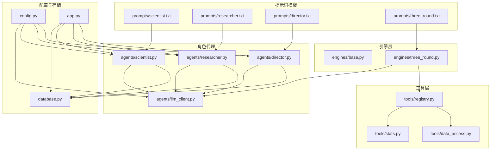
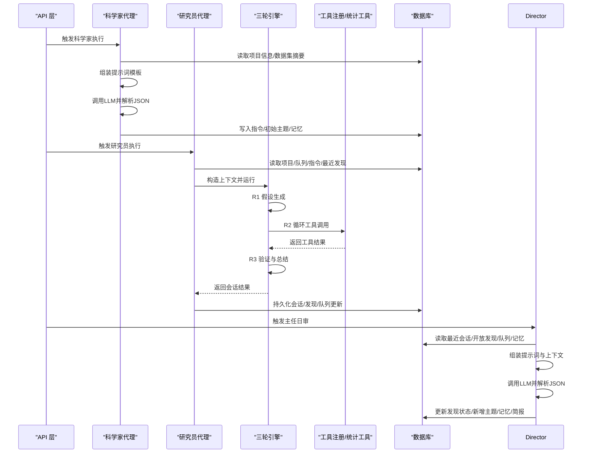
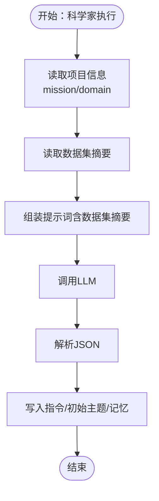
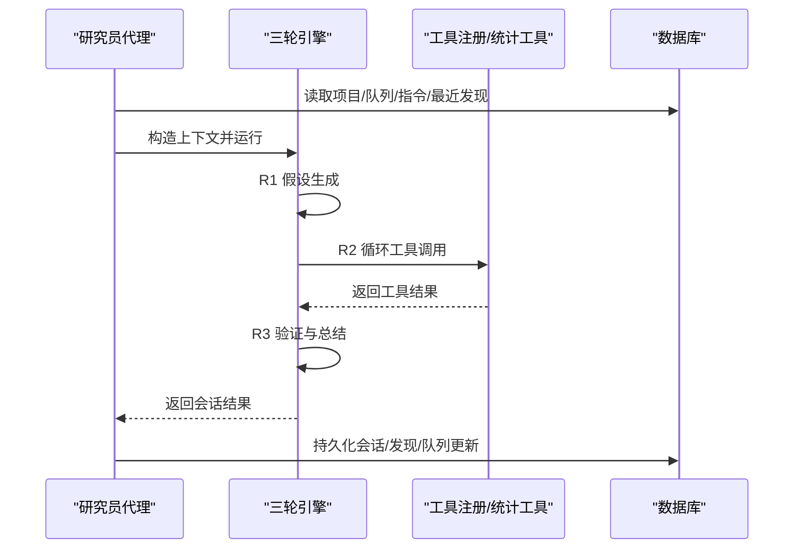
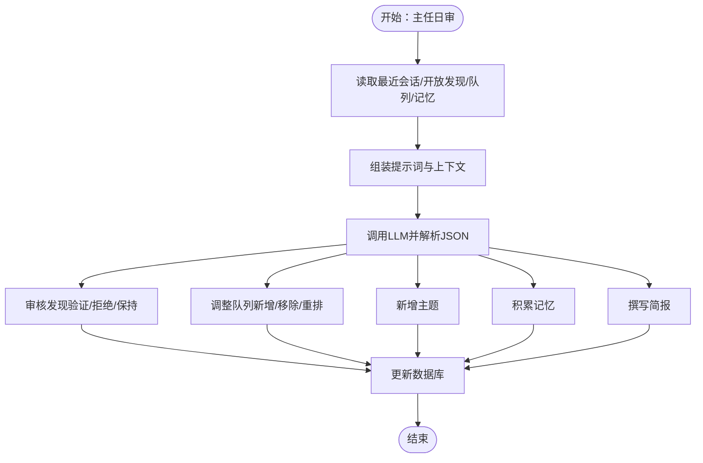
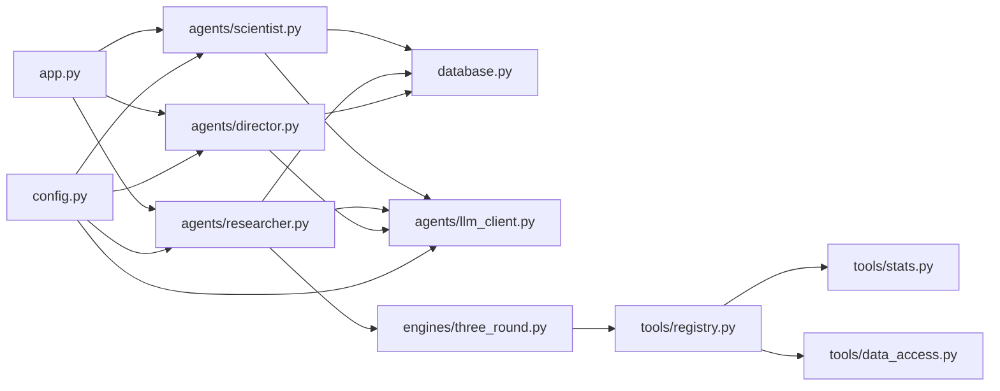

# 提示词系统

<cite>
**本文引用的文件**
- [README.md](file://README.md)
- [config.py](file://config.py)
- [app.py](file://app.py)
- [database.py](file://database.py)
- [agents/llm_client.py](file://agents/llm_client.py)
- [agents/scientist.py](file://agents/scientist.py)
- [agents/researcher.py](file://agents/researcher.py)
- [agents/director.py](file://agents/director.py)
- [engines/base.py](file://engines/base.py)
- [engines/three_round.py](file://engines/three_round.py)
- [tools/registry.py](file://tools/registry.py)
- [tools/stats.py](file://tools/stats.py)
- [tools/data_access.py](file://tools/data_access.py)
- [prompts/director.txt](file://prompts/director.txt)
- [prompts/researcher.txt](file://prompts/researcher.txt)
- [prompts/three_round.txt](file://prompts/three_round.txt)
</cite>

## 目录
1. [简介](#简介)
2. [项目结构](#项目结构)
3. [核心组件](#核心组件)
4. [架构总览](#架构总览)
5. [详细组件分析](#详细组件分析)
6. [依赖分析](#依赖分析)
7. [性能考虑](#性能考虑)
8. [故障排查指南](#故障排查指南)
9. [结论](#结论)
10. [附录](#附录)

## 简介
本提示词系统是“爱因斯坦”（AInstein）研究平台的核心组成部分，围绕科学家、研究员与主任三个角色设计了对应的提示词模板与执行流程。系统通过提示词模板注入项目使命、领域、数据集摘要与工具列表等上下文，结合三轮研究引擎（假设生成 → 工具检验 → 验证总结），实现数据驱动的自动化研究闭环。提示词系统支持变量替换、上下文注入与JSON结构化输出，确保各角色职责清晰、流程可控、结果可追踪。

## 项目结构
提示词系统主要由以下部分组成：
- 提示词模板：位于 prompts/ 目录，包含科学家、研究员、主任与三轮引擎的提示词文件
- 角色代理：agents/ 下的 scientist.py、researcher.py、director.py 分别承载三类角色的逻辑
- 引擎层：engines/ 下的 three_round.py 实现三轮研究流程；base.py 定义上下文与结果数据结构
- 工具层：tools/ 下的 registry.py、stats.py、data_access.py 提供工具注册、统计工具与数据访问能力
- 配置与持久化：config.py、database.py 提供配置与SQLite数据模型
- API入口：app.py 提供REST接口，触发角色执行与查询状态

图表来源
- [prompts/director.txt:1-43](file://prompts/director.txt#L1-L43)
- [prompts/researcher.txt:1-14](file://prompts/researcher.txt#L1-L14)
- [prompts/three_round.txt:1-15](file://prompts/three_round.txt#L1-L15)
- [agents/scientist.py:1-75](file://agents/scientist.py#L1-L75)
- [agents/researcher.py:1-114](file://agents/researcher.py#L1-L114)
- [agents/director.py:1-124](file://agents/director.py#L1-L124)
- [agents/llm_client.py:1-114](file://agents/llm_client.py#L1-L114)
- [engines/base.py:1-49](file://engines/base.py#L1-L49)
- [engines/three_round.py:1-179](file://engines/three_round.py#L1-L179)
- [tools/registry.py:1-181](file://tools/registry.py#L1-L181)
- [tools/stats.py:1-120](file://tools/stats.py#L1-L120)
- [tools/data_access.py:1-43](file://tools/data_access.py#L1-L43)
- [config.py:1-11](file://config.py#L1-L11)
- [database.py:1-344](file://database.py#L1-L344)
- [app.py:1-182](file://app.py#L1-L182)

章节来源
- [README.md:1-146](file://README.md#L1-L146)
- [app.py:1-182](file://app.py#L1-L182)

## 核心组件
- 提示词模板
  - 科学家提示词：用于战略制定，包含项目使命、领域、数据集摘要等上下文，引导生成“指令”和“初始主题”
  - 研究员提示词：聚焦单次研究会话，强调三轮流程（假设生成 → 工具检验 → 验证总结）
  - 主任提示词：用于质量评估与队列管理，要求输出JSON结构，包含发现审核、队列变更、新增主题、记忆条目与简报
  - 三轮引擎提示词：为研究员提供工具调用规范与数据引用约束
- 角色代理
  - 科学家代理：组装上下文，调用LLM，解析JSON，写入数据库（指令、初始主题、记忆）
  - 研究员代理：从队列取主题，构造上下文，调用三轮引擎，持久化会话与发现
  - 主任代理：汇总最近会话、开放发现、队列与记忆，调用LLM进行日审，更新数据库
- 引擎层
  - 基类定义上下文与结果数据结构
  - 三轮引擎实现三阶段流程：假设生成、工具检验（循环工具调用）、验证总结
- 工具层
  - 注册7种统计工具与若干外部数据工具，提供LLM工具定义与分发
  - 统计工具基于pandas与scipy实现
  - 数据访问封装不同格式文件的读取与Schema提取
- 配置与持久化
  - 配置集中于config.py，读取环境变量控制模型与API
  - database.py定义项目、指令、队列、会话、发现、记忆、数据集等表结构与CRUD

章节来源
- [prompts/director.txt:1-43](file://prompts/director.txt#L1-L43)
- [prompts/researcher.txt:1-14](file://prompts/researcher.txt#L1-L14)
- [prompts/three_round.txt:1-15](file://prompts/three_round.txt#L1-L15)
- [agents/scientist.py:1-75](file://agents/scientist.py#L1-L75)
- [agents/researcher.py:1-114](file://agents/researcher.py#L1-L114)
- [agents/director.py:1-124](file://agents/director.py#L1-L124)
- [engines/base.py:1-49](file://engines/base.py#L1-L49)
- [engines/three_round.py:1-179](file://engines/three_round.py#L1-L179)
- [tools/registry.py:1-181](file://tools/registry.py#L1-L181)
- [tools/stats.py:1-120](file://tools/stats.py#L1-L120)
- [tools/data_access.py:1-43](file://tools/data_access.py#L1-L43)
- [config.py:1-11](file://config.py#L1-L11)
- [database.py:1-344](file://database.py#L1-L344)

## 架构总览
提示词系统在“科学家 → 研究员 → 主任”的三级协作下，形成闭环研究流程。科学家负责战略规划，研究员负责实证分析，主任负责质量把关与知识沉淀。三轮引擎贯穿研究员的单次会话，确保研究过程可重复、可验证。

图表来源
- [agents/scientist.py:14-75](file://agents/scientist.py#L14-L75)
- [agents/researcher.py:14-114](file://agents/researcher.py#L14-L114)
- [agents/director.py:14-124](file://agents/director.py#L14-L124)
- [engines/three_round.py:28-179](file://engines/three_round.py#L28-L179)
- [tools/registry.py:24-43](file://tools/registry.py#L24-L43)
- [database.py:171-320](file://database.py#L171-L320)
- [app.py:95-177](file://app.py#L95-L177)

## 详细组件分析

### 提示词模板与变量替换机制
- 变量注入点
  - 科学家：mission、domain、datasets_summary
  - 研究员：mission、domain
  - 主任：mission、domain
  - 三轮引擎：mission、domain、datasets_summary、tool_names
- 上下文注入方式
  - 科学家与主任直接读取模板并使用字符串格式化
  - 三轮引擎在运行时动态拼接“最近发现”“指令上下文”，并在R2/R3阶段追加消息
- 输出约束
  - 主任与三轮引擎均要求返回JSON结构，便于程序化解析与数据库写入
- 格式规范
  - 统一使用中文输出
  - 三轮引擎在R2阶段要求“每次回复只输出一个纯JSON对象”，以利于工具调用解析

章节来源
- [prompts/director.txt:1-43](file://prompts/director.txt#L1-L43)
- [prompts/researcher.txt:1-14](file://prompts/researcher.txt#L1-L14)
- [prompts/three_round.txt:1-15](file://prompts/three_round.txt#L1-L15)
- [agents/scientist.py:28-34](file://agents/scientist.py#L28-L34)
- [agents/director.py:62-72](file://agents/director.py#L62-L72)
- [engines/three_round.py:32-91](file://engines/three_round.py#L32-L91)
- [engines/three_round.py:140-158](file://engines/three_round.py#L140-L158)

### 科学家提示词策略与用途
- 目标：为项目生成“研究指令”和“初始研究主题”，奠定后续研究方向
- 关键点
  - 明确项目使命与领域
  - 结合数据集摘要，提出可执行的指令与主题
  - 输出结构化JSON，包含指令列表、初始主题与战略备注
- 数据流
  - 读取项目信息与数据集摘要
  - 组装提示词并调用LLM
  - 解析JSON并写入数据库（指令、初始主题、记忆）

图表来源
- [agents/scientist.py:14-75](file://agents/scientist.py#L14-L75)
- [prompts/scientist.txt:1-200](file://prompts/scientist.txt#L1-L200)

章节来源
- [agents/scientist.py:14-75](file://agents/scientist.py#L14-L75)

### 研究员提示词策略与用途
- 目标：执行聚焦的研究会话，遵循三轮流程，产出可验证的发现与后续方向
- 关键点
  - 严格的数据引用：报告具体数值、p值、效应量
  - 区分相关性与因果性，标注样本量不足时的结论局限
  - 使用项目领域术语，以对研究使命有意义的方式表述发现
- 数据流
  - 从队列取主题或接收指定主题
  - 构造上下文（最近发现、指令、数据集摘要）
  - 三轮引擎执行：假设生成 → 工具检验（循环）→ 验证总结
  - 持久化会话、发现与队列更新

图表来源
- [agents/researcher.py:14-114](file://agents/researcher.py#L14-L114)
- [engines/three_round.py:28-179](file://engines/three_round.py#L28-L179)
- [tools/registry.py:24-43](file://tools/registry.py#L24-L43)

章节来源
- [agents/researcher.py:14-114](file://agents/researcher.py#L14-L114)
- [engines/three_round.py:28-179](file://engines/three_round.py#L28-L179)

### 主任提示词策略与用途
- 目标：每日审查研究会话与发现，调整队列，积累记忆，撰写简报
- 关键点
  - 审核发现：验证、拒绝、保持开放
  - 调整队列：新增、移除、重排优先级
  - 新增主题：基于发现生成后续研究问题
  - 累积记忆：记录洞察、模式、警告与决策
  - 撰写简报：面向项目所有者的2-3段总结
- 数据流
  - 汇总最近会话、开放发现、队列与记忆
  - 组装提示词与上下文
  - 调用LLM并解析JSON
  - 更新发现状态、新增主题与记忆

图表来源
- [agents/director.py:14-124](file://agents/director.py#L14-L124)
- [prompts/director.txt:1-43](file://prompts/director.txt#L1-L43)

章节来源
- [agents/director.py:14-124](file://agents/director.py#L14-L124)

### 三轮引擎与工具链集成
- 三轮流程
  - R1：生成可检验的假设（含测试计划与预期列）
  - R2：使用统计工具检验假设，循环工具调用，直至完成
  - R3：验证与总结，输出发现、建议方向与数据摘要
- 工具注册与调用
  - 注册7种统计工具与若干外部数据工具
  - 在R2阶段，引擎根据LLM输出的工具调用JSON执行工具，并将结果回传给LLM
- 上下文注入
  - 动态拼接“最近发现”“活跃指令”作为上下文，提升推理连贯性

章节来源
- [engines/three_round.py:28-179](file://engines/three_round.py#L28-L179)
- [tools/registry.py:24-43](file://tools/registry.py#L24-L43)
- [tools/stats.py:1-120](file://tools/stats.py#L1-L120)

### 数据模型与持久化
- 表结构要点
  - 项目：name、mission、domain、config_json
  - 指令：directive、priority、status
  - 队列：topic、priority、source、status
  - 会话：topic、engine_type、status、findings、next_directions、duration_seconds
  - 发现：finding、category、confidence、evidence、actionable、status
  - 记忆：kind、content、context_data
  - 数据集：name、source、file_path、schema_json、row_count
- 关键索引
  - 队列、会话、发现、记忆、数据集按项目与时间建立索引，保障查询效率

章节来源
- [database.py:10-98](file://database.py#L10-L98)
- [database.py:171-320](file://database.py#L171-L320)

## 依赖分析
- 组件耦合
  - 角色代理依赖提示词模板与LLM客户端，同时依赖数据库进行状态读写
  - 三轮引擎依赖工具注册中心与统计工具，间接依赖数据访问模块
  - API层作为统一入口，协调角色代理与数据库交互
- 外部依赖
  - LLM服务（DashScope兼容Anthropic协议）
  - SQLite数据库（WAL模式）
  - pandas、numpy、scipy用于统计计算
- 潜在循环依赖
  - 未发现直接循环依赖；角色代理与引擎通过函数调用解耦

图表来源
- [app.py:95-177](file://app.py#L95-L177)
- [agents/scientist.py:1-75](file://agents/scientist.py#L1-L75)
- [agents/researcher.py:1-114](file://agents/researcher.py#L1-L114)
- [agents/director.py:1-124](file://agents/director.py#L1-L124)
- [agents/llm_client.py:1-114](file://agents/llm_client.py#L1-L114)
- [engines/three_round.py:1-179](file://engines/three_round.py#L1-L179)
- [tools/registry.py:1-181](file://tools/registry.py#L1-L181)
- [tools/stats.py:1-120](file://tools/stats.py#L1-L120)
- [tools/data_access.py:1-43](file://tools/data_access.py#L1-L43)
- [config.py:1-11](file://config.py#L1-L11)
- [database.py:1-344](file://database.py#L1-L344)

章节来源
- [app.py:95-177](file://app.py#L95-L177)
- [agents/llm_client.py:1-114](file://agents/llm_client.py#L1-L114)
- [engines/three_round.py:1-179](file://engines/three_round.py#L1-L179)
- [tools/registry.py:1-181](file://tools/registry.py#L1-L181)
- [database.py:1-344](file://database.py#L1-L344)

## 性能考虑
- LLM调用成本控制
  - 通过温度与max_tokens参数平衡探索性与稳定性
  - R1/R3使用较高温度以促进创造性，R2使用较低温度以稳定工具调用
- 工具调用效率
  - R2阶段限制最大工具轮次，避免无限循环
  - 工具调用返回结果直接回传给LLM，减少中间文本处理
- 数据库写入
  - 采用事务与WAL模式，提升并发写入性能
  - 批量写入与索引优化，降低查询延迟

## 故障排查指南
- LLM响应解析失败
  - 症状：提示词要求JSON但LLM输出非结构化文本
  - 处理：检查提示词中JSON约束与示例；确认extract_json的容错逻辑是否生效
- 工具调用错误
  - 症状：R2阶段无法识别工具调用或工具返回错误
  - 处理：核对工具名称与参数schema；检查数据集路径与列名
- 数据集加载失败
  - 症状：提示找不到数据文件或不支持的文件类型
  - 处理：确认数据文件扩展名与路径；检查数据目录权限
- 数据库异常
  - 症状：插入/更新失败或查询超时
  - 处理：检查外键约束、索引是否存在；查看WAL模式下的锁竞争

章节来源
- [agents/llm_client.py:73-114](file://agents/llm_client.py#L73-L114)
- [engines/three_round.py:105-135](file://engines/three_round.py#L105-L135)
- [tools/data_access.py:10-25](file://tools/data_access.py#L10-L25)
- [database.py:101-123](file://database.py#L101-L123)

## 结论
提示词系统通过角色化的模板设计与严格的上下文注入机制，实现了从战略到执行再到质量评估的完整闭环。三轮引擎与工具链的深度融合，确保研究过程可重复、可验证且可追踪。建议在实际部署中关注提示词的版本管理与迭代优化，结合效果评估指标（如发现数量、验证率、队列周转时间）持续改进提示词与流程。

## 附录

### 提示词模板格式规范与变量清单
- 变量清单
  - mission：项目使命
  - domain：研究领域
  - datasets_summary：数据集摘要（列名、行数、字段类型）
  - tool_names：可用工具名称列表
- 输出要求
  - JSON结构化输出（主任、三轮引擎）
  - 中文输出（所有角色）
  - R2阶段仅输出纯JSON对象（三轮引擎）

章节来源
- [prompts/director.txt:1-43](file://prompts/director.txt#L1-L43)
- [prompts/researcher.txt:1-14](file://prompts/researcher.txt#L1-L14)
- [prompts/three_round.txt:1-15](file://prompts/three_round.txt#L1-L15)
- [engines/three_round.py:80-91](file://engines/three_round.py#L80-L91)

### 版本管理、迭代优化与效果评估
- 版本管理
  - 将提示词文件纳入版本控制，记录每次变更的意图与影响范围
- 迭代优化
  - 基于会话结果与发现质量，逐步调整提示词结构与约束
  - 引入A/B测试对比不同提示词版本的效果差异
- 效果评估
  - 关键指标：会话成功率、发现数量、验证率、队列平均等待时间、记忆条目质量
  - 建议定期导出统计数据，评估提示词优化带来的收益

### 自定义提示词开发指南与最佳实践
- 开发步骤
  - 明确角色职责与目标输出（JSON/文本）
  - 设计上下文注入点（mission、domain、datasets_summary、tool_names、recent_ctx、directive_ctx）
  - 编写示例输出（JSON Schema），确保LLM可稳定解析
  - 在小规模数据集上验证提示词有效性
- 最佳实践
  - 保持中文输出一致性
  - 在R2阶段严格限定输出格式，避免混杂文本
  - 为每个角色设定明确的“停止条件”（如无假设生成则终止）
- 调试技巧
  - 使用最小上下文快速定位问题（去除recent_ctx/directive_ctx）
  - 逐步增加复杂度，观察LLM行为变化
  - 利用日志与数据库状态交叉验证

### 完整提示词示例与修改建议
- 示例位置
  - 科学家提示词：[prompts/scientist.txt](file://prompts/scientist.txt)
  - 研究员提示词：[prompts/researcher.txt](file://prompts/researcher.txt)
  - 主任提示词：[prompts/director.txt](file://prompts/director.txt)
  - 三轮引擎提示词：[prompts/three_round.txt](file://prompts/three_round.txt)
- 修改建议
  - 若发现LLM忽略工具调用约束，可在R2阶段强化“仅输出纯JSON对象”的指令
  - 若发现审核误判，可在主任提示词中加入更细粒度的判断规则与示例
  - 若假设生成质量不稳定，可增加“先描述再量化”的引导语句