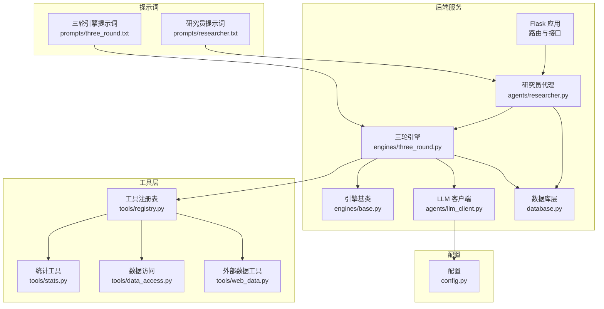
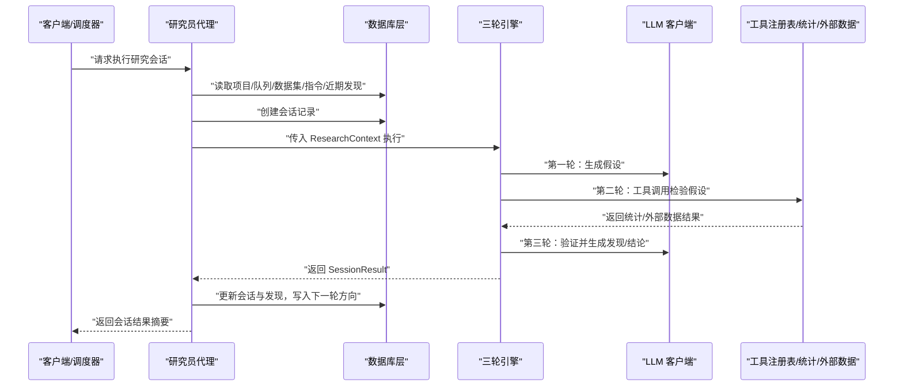
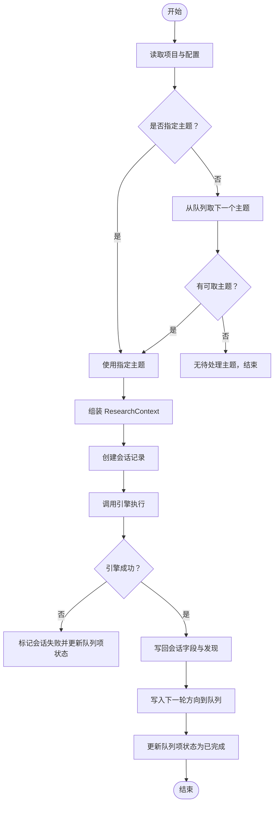
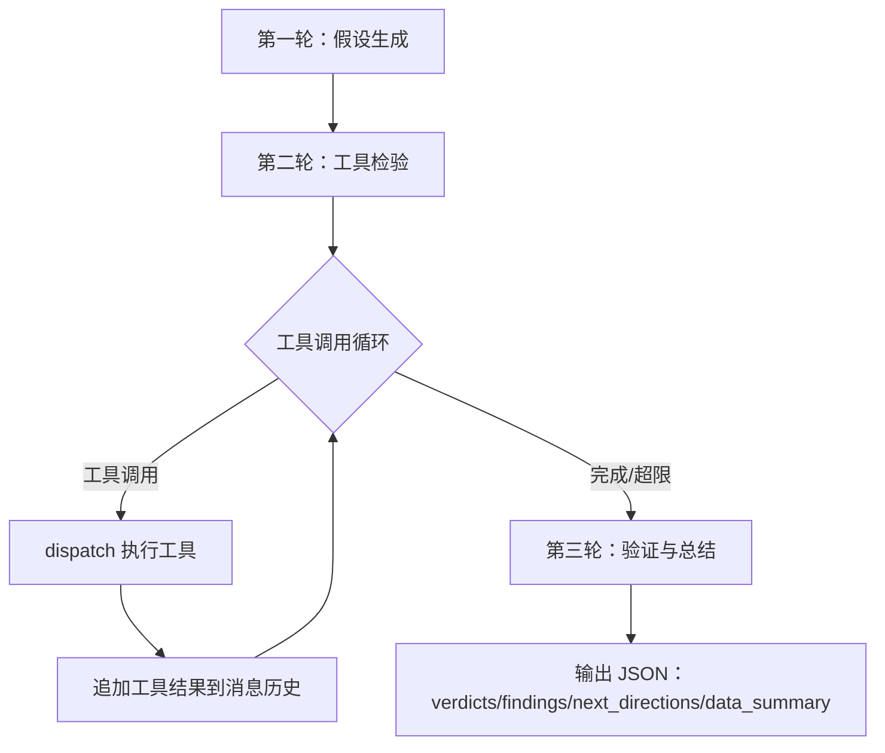
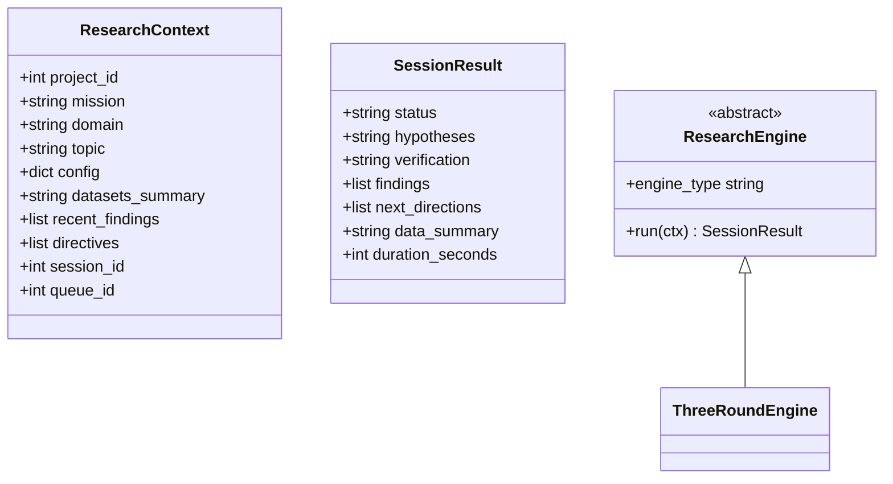
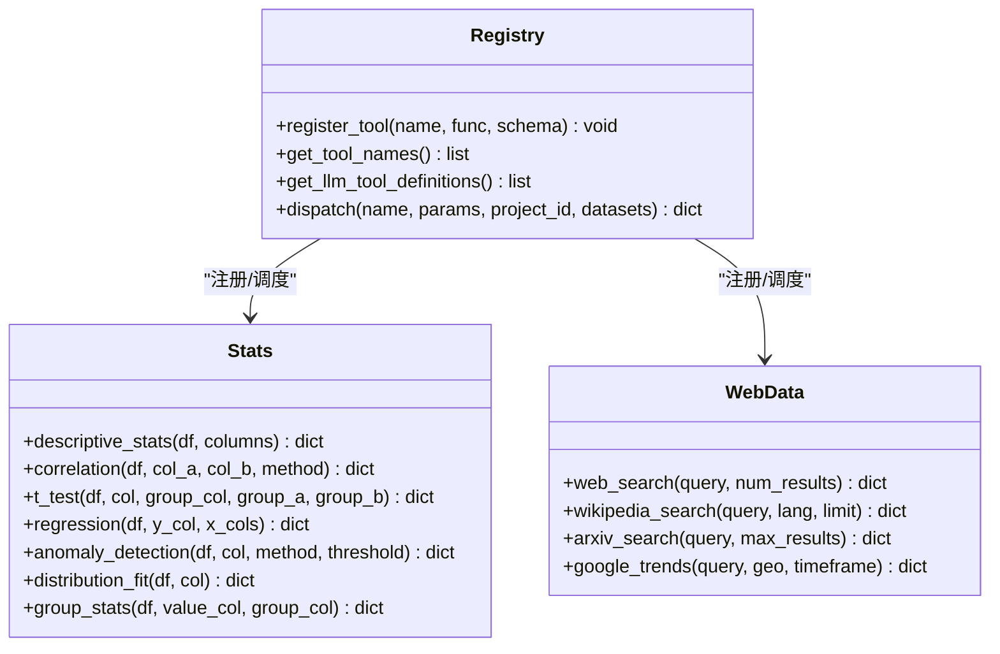
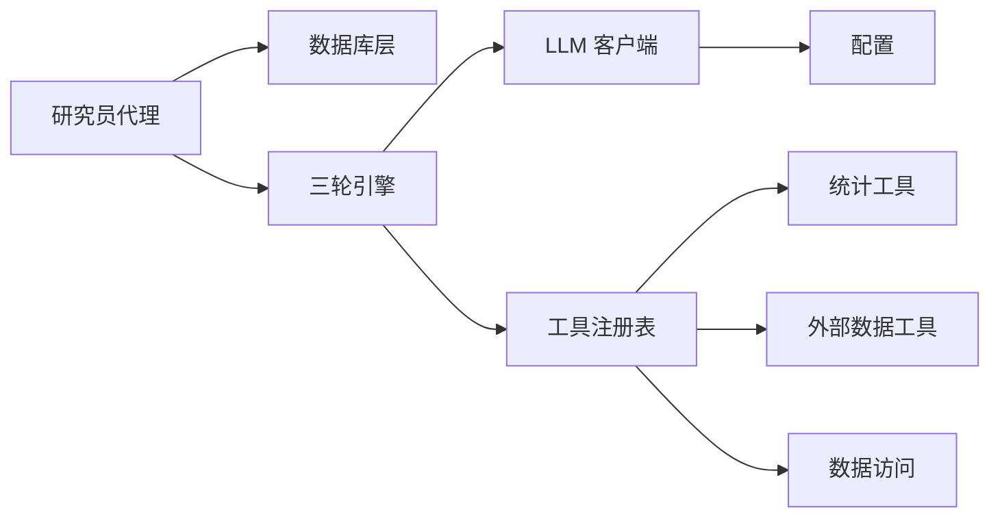

# 研究员代理

<cite>
**本文引用的文件**
- [agents/researcher.py](file://agents/researcher.py)
- [engines/three_round.py](file://engines/three_round.py)
- [engines/base.py](file://engines/base.py)
- [tools/registry.py](file://tools/registry.py)
- [tools/stats.py](file://tools/stats.py)
- [tools/data_access.py](file://tools/data_access.py)
- [tools/web_data.py](file://tools/web_data.py)
- [agents/llm_client.py](file://agents/llm_client.py)
- [database.py](file://database.py)
- [prompts/researcher.txt](file://prompts/researcher.txt)
- [prompts/three_round.txt](file://prompts/three_round.txt)
- [config.py](file://config.py)
- [app.py](file://app.py)
- [README.md](file://README.md)
</cite>

## 目录
1. [简介](#简介)
2. [项目结构](#项目结构)
3. [核心组件](#核心组件)
4. [架构总览](#架构总览)
5. [详细组件分析](#详细组件分析)
6. [依赖关系分析](#依赖关系分析)
7. [性能考量](#性能考量)
8. [故障排查指南](#故障排查指南)
9. [结论](#结论)
10. [附录](#附录)

## 简介
本文件面向“研究员代理”的使用者与维护者，系统化阐述其在数据探索、分析执行、发现生成与报告撰写方面的任务执行能力；详解其如何从队列中取出研究主题，执行三轮研究流程（假设生成、工具检验、验证总结），并把结果持久化到数据库；深入解析提示词系统在研究员代理中的应用，包括分析策略、数据解读与结果验证；说明研究员代理与数据库的交互方式（数据读取、结果存储、状态更新）；提供配置项、性能调优与故障诊断建议，并给出实际应用场景与代码路径参考。

## 项目结构
- 后端采用 Flask + Gunicorn + SQLite + APScheduler 的组合，前端为 React/Vite。
- 研究员代理位于 agents/researcher.py，负责从数据库取队列主题、组装上下文、调用三轮引擎、写回结果与下一轮方向。
- 引擎层位于 engines/，其中 three_round.py 实现三轮研究流程，base.py 定义上下文与结果数据结构。
- 工具层位于 tools/，包含统计工具、数据访问与外部数据抓取，以及工具注册表。
- 数据库层 database.py 提供完整的 CRUD 与索引，支撑项目、队列、会话、发现、指令等实体。
- 提示词位于 prompts/，分别定义研究员角色与三轮引擎的系统提示。
- 配置位于 config.py，集中管理数据库路径、数据目录、模型与 API 基础地址等。

图表来源
- [agents/researcher.py:14-114](file://agents/researcher.py#L14-L114)
- [engines/three_round.py:22-179](file://engines/three_round.py#L22-L179)
- [engines/base.py:11-49](file://engines/base.py#L11-L49)
- [tools/registry.py:24-181](file://tools/registry.py#L24-L181)
- [tools/stats.py:10-120](file://tools/stats.py#L10-L120)
- [tools/data_access.py:10-43](file://tools/data_access.py#L10-L43)
- [tools/web_data.py:13-164](file://tools/web_data.py#L13-L164)
- [agents/llm_client.py:24-114](file://agents/llm_client.py#L24-L114)
- [database.py:101-344](file://database.py#L101-L344)
- [prompts/researcher.txt:1-14](file://prompts/researcher.txt#L1-L14)
- [prompts/three_round.txt:1-15](file://prompts/three_round.txt#L1-L15)
- [config.py:1-11](file://config.py#L1-L11)

章节来源
- [README.md:71-124](file://README.md#L71-L124)
- [app.py:11-182](file://app.py#L11-L182)

## 核心组件
- 研究员代理 run_research_session：从数据库取项目信息与队列主题，组装 ResearchContext，创建会话，调用三轮引擎，回写会话结果与发现，补充下一轮研究方向到队列。
- 三轮引擎 ThreeRoundEngine：按回合组织研究流程，第一轮生成可检验假设，第二轮用工具进行实证检验，第三轮汇总验证并产出发现与结论。
- 引擎基类与结果：ResearchContext 与 SessionResult 定义了上下文与结果的数据结构，便于跨引擎复用。
- 工具注册表与统计工具：注册内置统计与外部数据工具，统一调度与参数校验。
- 数据访问与外部数据：支持 CSV/JSON/XLSX 加载与 schema 概览，提供 Web/Wiki/arXiv/Trends 等外部数据检索。
- LLM 客户端：封装 DashScope/Anthropic 兼容 API，支持工具调用与 JSON 提取。
- 数据库层：提供项目、队列、会话、发现、指令、数据集等表及 CRUD、索引与统计查询。

章节来源
- [agents/researcher.py:14-114](file://agents/researcher.py#L14-L114)
- [engines/three_round.py:22-179](file://engines/three_round.py#L22-L179)
- [engines/base.py:11-49](file://engines/base.py#L11-L49)
- [tools/registry.py:24-181](file://tools/registry.py#L24-L181)
- [tools/stats.py:10-120](file://tools/stats.py#L10-L120)
- [tools/data_access.py:10-43](file://tools/data_access.py#L10-L43)
- [tools/web_data.py:13-164](file://tools/web_data.py#L13-L164)
- [agents/llm_client.py:24-114](file://agents/llm_client.py#L24-L114)
- [database.py:101-344](file://database.py#L101-L344)

## 架构总览
研究员代理的执行链路如下：
- 输入：项目 ID 或指定主题
- 上下文准备：项目配置、使命、领域、数据集概览、近期发现、指令
- 会话创建：记录主题、引擎类型、队列关联
- 引擎执行：三轮流程（假设→检验→验证）
- 结果落盘：会话状态、假设、验证、发现、下一轮方向
- 下游：将下一轮方向写入队列，供后续会话消费

图表来源
- [agents/researcher.py:14-114](file://agents/researcher.py#L14-L114)
- [engines/three_round.py:28-179](file://engines/three_round.py#L28-L179)
- [agents/llm_client.py:24-114](file://agents/llm_client.py#L24-L114)
- [tools/registry.py:24-181](file://tools/registry.py#L24-L181)
- [database.py:232-295](file://database.py#L232-L295)

## 详细组件分析

### 研究员代理：run_research_session
职责与流程要点：
- 读取项目信息与配置，决定是按队列取主题还是直接执行指定主题。
- 组装 ResearchContext：包含 mission、domain、topic、config、datasets_summary、recent_findings、directives。
- 创建会话记录，记录引擎类型与队列关联。
- 调用引擎执行，捕获异常并更新会话状态为失败。
- 将引擎返回的 hypotheses、verification、findings、next_directions、data_summary、duration_seconds 写回会话。
- 将每条发现写入 research_findings 表，并将下一轮方向写入 research_queue。
- 更新队列项状态为 completed（若来自队列）。

图表来源
- [agents/researcher.py:14-114](file://agents/researcher.py#L14-L114)

章节来源
- [agents/researcher.py:14-114](file://agents/researcher.py#L14-L114)

### 三轮引擎：ThreeRoundEngine
三轮流程与关键点：
- 第一轮：基于系统提示与上下文生成 2–4 个可检验假设，返回 JSON。
- 第二轮：循环调用工具进行假设检验，最多限制轮次；工具调用需严格遵循输入 schema，返回 JSON。
- 第三轮：根据假设与检验结果，生成验证结论、发现、下一轮方向与数据摘要，返回 JSON。
- 温度与令牌数：不同轮次采用不同温度与最大令牌数，平衡创造性与稳定性。
- 工具调度：通过工具注册表 dispatch，自动加载数据集并执行统计/外部数据工具。

图表来源
- [engines/three_round.py:28-179](file://engines/three_round.py#L28-L179)
- [tools/registry.py:24-181](file://tools/registry.py#L24-L181)

章节来源
- [engines/three_round.py:22-179](file://engines/three_round.py#L22-L179)

### 引擎基类与结果：ResearchContext 与 SessionResult
- ResearchContext：承载项目级上下文（mission/domain/config）、会话级上下文（topic/datasets_summary/recent_findings/directives）与会话/队列 ID。
- SessionResult：标准化返回结构，包含状态、假设、验证、发现、下一轮方向、数据摘要与耗时。

图表来源
- [engines/base.py:11-49](file://engines/base.py#L11-L49)
- [engines/three_round.py:22-27](file://engines/three_round.py#L22-L27)

章节来源
- [engines/base.py:11-49](file://engines/base.py#L11-L49)

### 工具注册表与统计/外部数据工具
- 注册表：将工具名映射到实现函数与 JSON Schema，统一对外暴露工具定义与调用入口。
- 统计工具：描述性统计、相关性（Pearson/Spearman）、独立样本 t 检验、多元线性回归、异常检测（Z-score/IQR）、分布拟合（Shapiro-Wilk）、分组统计。
- 外部数据工具：Web 搜索、Wikipedia 搜索、arXiv 搜索、Google Trends。
- 数据访问：支持 CSV/JSON/XLSX 加载，生成列名与类型概览。

图表来源
- [tools/registry.py:24-181](file://tools/registry.py#L24-L181)
- [tools/stats.py:10-120](file://tools/stats.py#L10-L120)
- [tools/web_data.py:13-164](file://tools/web_data.py#L13-L164)
- [tools/data_access.py:10-43](file://tools/data_access.py#L10-L43)

章节来源
- [tools/registry.py:24-181](file://tools/registry.py#L24-L181)
- [tools/stats.py:10-120](file://tools/stats.py#L10-L120)
- [tools/web_data.py:13-164](file://tools/web_data.py#L13-L164)
- [tools/data_access.py:10-43](file://tools/data_access.py#L10-L43)

### 提示词系统：研究员与三轮引擎
- 研究员提示词：强调严谨性、引用具体数字、承认局限、明确置信水平，限定为中文输出。
- 三轮引擎提示词：强调以数据为依据、区分相关性与因果性、样本量不足时标注不可靠、使用领域术语并围绕使命表达发现。

章节来源
- [prompts/researcher.txt:1-14](file://prompts/researcher.txt#L1-L14)
- [prompts/three_round.txt:1-15](file://prompts/three_round.txt#L1-L15)

### 数据库交互：读取、存储与状态更新
- 项目与队列：读取项目配置、指令、队列项；取队列项时更新状态为 picked，完成后更新为 completed。
- 会话：创建会话记录，更新状态、假设、验证、发现、下一轮方向、数据摘要与耗时。
- 发现：逐条写入发现，包含类别、置信度、证据、可操作性与行动建议。
- 数据集：上传文件后解析 schema 与行数，写入数据集元信息。

章节来源
- [database.py:190-228](file://database.py#L190-L228)
- [database.py:232-262](file://database.py#L232-L262)
- [database.py:266-295](file://database.py#L266-L295)
- [database.py:324-344](file://database.py#L324-L344)

### LLM 客户端：调用与 JSON 提取
- 支持普通消息与工具调用两种模式；记录输入/输出 token 数量用于成本与性能监控。
- JSON 提取：优先匹配 Markdown 代码块，其次尝试直接解析，最后尝试提取文本中最长的 JSON 片段。

章节来源
- [agents/llm_client.py:24-114](file://agents/llm_client.py#L24-L114)

## 依赖关系分析
- 研究员代理依赖数据库层读取项目/队列/指令/数据集，依赖三轮引擎执行研究，依赖 LLM 客户端与工具注册表。
- 三轮引擎依赖 LLM 客户端与工具注册表，工具注册表依赖统计与外部数据工具模块。
- 数据库层被多处组件共享，承担强耦合的持久化职责。
- 配置集中于 config.py，影响模型选择、API 基础地址与数据目录。

图表来源
- [agents/researcher.py:14-114](file://agents/researcher.py#L14-L114)
- [engines/three_round.py:22-179](file://engines/three_round.py#L22-L179)
- [tools/registry.py:24-181](file://tools/registry.py#L24-L181)
- [agents/llm_client.py:24-114](file://agents/llm_client.py#L24-L114)
- [config.py:1-11](file://config.py#L1-L11)

## 性能考量
- 引擎轮次上限：第二轮工具调用设置最大轮次，避免无限循环与资源耗尽。
- 温度与令牌：不同轮次采用不同温度与最大令牌数，平衡创造性与稳定性，减少无效输出。
- 数据加载：仅在需要时加载数据集，避免重复 IO；数据概览用于 LLM 上下文控制。
- 数据库 WAL 模式：启用 WAL 提升并发写入性能；外键约束保证一致性。
- 并发与异步：会话执行在后台线程触发，避免阻塞 API 请求。

章节来源
- [engines/three_round.py:103-135](file://engines/three_round.py#L103-L135)
- [database.py:113-122](file://database.py#L113-L122)
- [app.py:97-104](file://app.py#L97-L104)

## 故障排查指南
- LLM 调用失败：检查 API Key 与基础地址配置，确认网络可达；查看日志中的错误堆栈。
- JSON 解析失败：LLM 输出可能夹杂非 JSON 文本，使用 JSON 提取逻辑增强健壮性；必要时调整提示词引导更严格的 JSON 输出。
- 工具调用失败：确认工具名存在且参数符合 Schema；检查数据集文件是否存在与格式正确；查看工具内部异常日志。
- 数据集加载失败：确认文件扩展名受支持（CSV/JSON/JSONL/XLSX/XLS），路径与权限正确。
- 队列状态异常：检查 pick_next_topic 是否正确更新状态为 picked，完成后更新为 completed。
- 会话状态异常：若引擎抛出异常，会话状态应标记为 failed；检查数据库事务与回滚逻辑。

章节来源
- [agents/llm_client.py:47-71](file://agents/llm_client.py#L47-L71)
- [tools/registry.py:24-43](file://tools/registry.py#L24-L43)
- [tools/data_access.py:10-25](file://tools/data_access.py#L10-L25)
- [database.py:214-228](file://database.py#L214-L228)
- [database.py:240-249](file://database.py#L240-L249)

## 结论
研究员代理通过“队列驱动 + 三轮引擎 + 工具调度 + 数据库持久化”的闭环，实现了从主题到发现再到下一轮方向的自动化研究流水线。提示词系统确保输出规范与严谨性，工具注册表统一了统计与外部数据的调用方式，数据库层提供了可靠的状态与知识沉淀。通过合理的配置与性能调优，可在多领域场景中稳定地开展数据驱动的深度研究。

## 附录

### 实际应用场景
- 自动化主题研究：将用户或科学家提出的主题加入队列，研究员代理按优先级自动执行。
- 数据驱动洞察：结合描述性统计、相关性与回归分析，形成可操作的发现与建议。
- 外部知识补充：通过 Web/Wiki/arXiv/Trends 获取背景信息，辅助验证与结论生成。
- 知识积累：将发现与记忆写入数据库，支持后续检索与复用。

### 代码路径参考（不含具体代码内容）
- 研究员代理主流程：[agents/researcher.py:14-114](file://agents/researcher.py#L14-L114)
- 三轮引擎实现：[engines/three_round.py:22-179](file://engines/three_round.py#L22-L179)
- 引擎基类与结果：[engines/base.py:11-49](file://engines/base.py#L11-L49)
- 工具注册与统计工具：[tools/registry.py:24-181](file://tools/registry.py#L24-L181), [tools/stats.py:10-120](file://tools/stats.py#L10-L120)
- 外部数据工具：[tools/web_data.py:13-164](file://tools/web_data.py#L13-L164)
- 数据访问与概览：[tools/data_access.py:10-43](file://tools/data_access.py#L10-L43)
- LLM 客户端与 JSON 提取：[agents/llm_client.py:24-114](file://agents/llm_client.py#L24-L114)
- 数据库层 CRUD 与索引：[database.py:101-344](file://database.py#L101-L344)
- 提示词系统：[prompts/researcher.txt:1-14](file://prompts/researcher.txt#L1-L14), [prompts/three_round.txt:1-15](file://prompts/three_round.txt#L1-L15)
- 配置项：[config.py:1-11](file://config.py#L1-L11)
- API 路由与会话触发：[app.py:95-104](file://app.py#L95-L104)