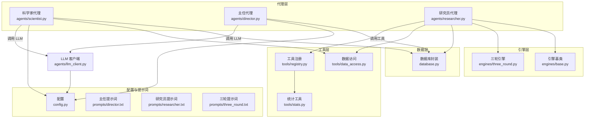
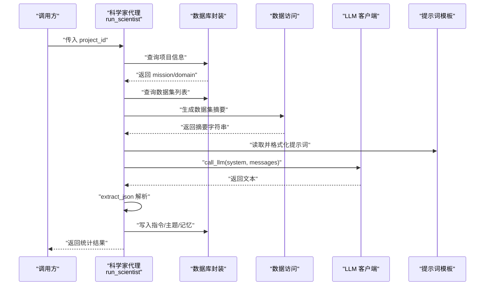
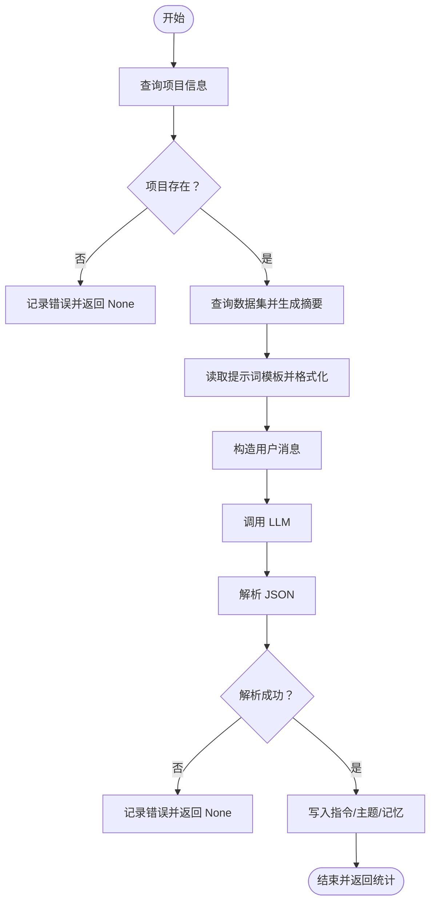
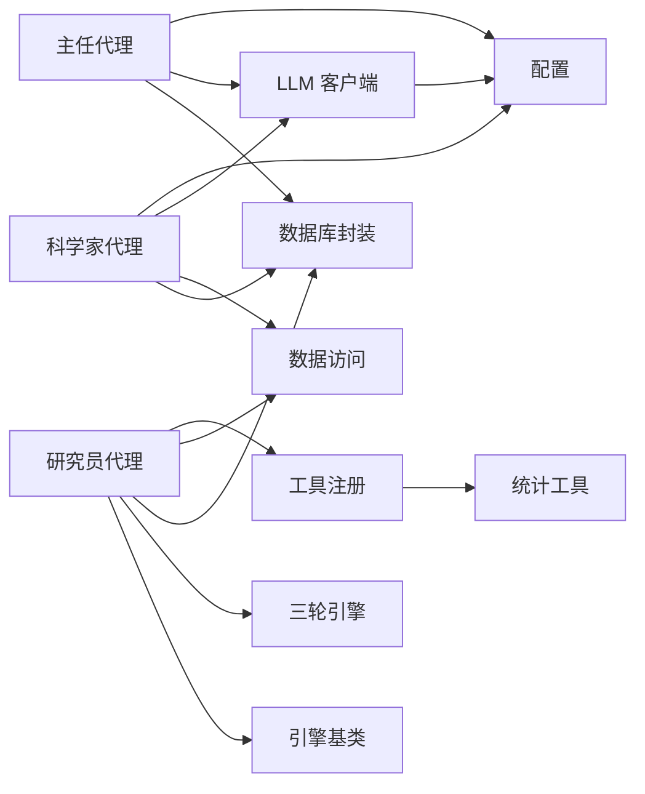

# 科学家代理

<cite>
**本文引用的文件**
- [agents/scientist.py](file://agents/scientist.py)
- [agents/director.py](file://agents/director.py)
- [agents/researcher.py](file://agents/researcher.py)
- [agents/llm_client.py](file://agents/llm_client.py)
- [engines/base.py](file://engines/base.py)
- [engines/three_round.py](file://engines/three_round.py)
- [tools/data_access.py](file://tools/data_access.py)
- [tools/registry.py](file://tools/registry.py)
- [tools/stats.py](file://tools/stats.py)
- [database.py](file://database.py)
- [config.py](file://config.py)
- [prompts/director.txt](file://prompts/director.txt)
- [prompts/researcher.txt](file://prompts/researcher.txt)
- [prompts/three_round.txt](file://prompts/three_round.txt)
- [README.md](file://README.md)
</cite>

## 目录
1. [简介](#简介)
2. [项目结构](#项目结构)
3. [核心组件](#核心组件)
4. [架构总览](#架构总览)
5. [详细组件分析](#详细组件分析)
6. [依赖关系分析](#依赖关系分析)
7. [性能考虑](#性能考虑)
8. [故障排除指南](#故障排除指南)
9. [结论](#结论)
10. [附录](#附录)

## 简介
科学家代理是三级 AI 团队的第一环，负责在项目创建后生成“战略指令”和“初始主题”，为后续研究员的执行与主任的质量把关奠定基础。其核心职责包括：
- 项目分析：从项目使命与领域中抽取关键上下文
- 数据集摘要：汇总可用数据的基本信息，形成 LLM 上下文
- 战略制定：基于任务目标与数据特征生成可执行的研究指令与优先级主题
- 结果持久化：将指令与主题写入数据库，供后续流程消费

## 项目结构
围绕科学家代理的关键文件与模块如下：
- 代理层：科学家代理、主任代理、研究员代理
- 引擎层：研究引擎基类与三轮引擎
- 工具层：数据访问、工具注册与内置统计工具
- 数据层：SQLite 数据库封装与表结构
- 配置层：模型与 API 配置
- 提示词层：各代理与引擎对应的提示词模板

图表来源
- [agents/scientist.py:14-75](file://agents/scientist.py#L14-L75)
- [agents/director.py:14-124](file://agents/director.py#L14-L124)
- [agents/researcher.py:14-114](file://agents/researcher.py#L14-L114)
- [engines/base.py:11-49](file://engines/base.py#L11-L49)
- [engines/three_round.py:22-179](file://engines/three_round.py#L22-L179)
- [tools/data_access.py:27-43](file://tools/data_access.py#L27-L43)
- [tools/registry.py:24-43](file://tools/registry.py#L24-L43)
- [tools/stats.py:10-120](file://tools/stats.py#L10-L120)
- [database.py:101-344](file://database.py#L101-L344)
- [config.py:1-11](file://config.py#L1-L11)
- [prompts/director.txt:1-43](file://prompts/director.txt#L1-L43)
- [prompts/researcher.txt:1-14](file://prompts/researcher.txt#L1-L14)
- [prompts/three_round.txt:1-15](file://prompts/three_round.txt#L1-L15)

章节来源
- [README.md:71-124](file://README.md#L71-L124)

## 核心组件
- 科学家代理：负责生成指令与初始主题，调用 LLM 并解析 JSON，将结果写入数据库
- LLM 客户端：统一的 LLM 调用接口，支持普通对话与工具调用，具备 JSON 提取能力
- 数据访问工具：汇总数据集元信息，用于构建 LLM 上下文
- 数据库封装：提供项目、指令、队列、会话、发现、记忆等表的 CRUD 封装
- 配置：集中管理数据库路径、数据目录、API Key、模型名称等

章节来源
- [agents/scientist.py:14-75](file://agents/scientist.py#L14-L75)
- [agents/llm_client.py:24-114](file://agents/llm_client.py#L24-L114)
- [tools/data_access.py:27-43](file://tools/data_access.py#L27-L43)
- [database.py:101-344](file://database.py#L101-L344)
- [config.py:1-11](file://config.py#L1-L11)

## 架构总览
科学家代理在执行时，串联以下步骤：
- 获取项目信息与领域
- 汇总数据集摘要
- 加载提示词模板并格式化
- 调用 LLM 生成文本
- 解析 JSON，提取指令与主题
- 写入数据库并记录记忆

图表来源
- [agents/scientist.py:14-75](file://agents/scientist.py#L14-L75)
- [agents/llm_client.py:24-114](file://agents/llm_client.py#L24-L114)
- [tools/data_access.py:27-43](file://tools/data_access.py#L27-L43)
- [database.py:171-344](file://database.py#L171-L344)

## 详细组件分析

### 科学家代理：run_scientist 执行流程
- 输入：project_id
- 步骤：
  1) 查询项目信息（mission、domain）
  2) 查询数据集并生成摘要
  3) 读取提示词模板并注入 mission、domain、datasets_summary
  4) 构造用户消息，包含项目名称、使命、领域、数据摘要与任务
  5) 调用 LLM，设置 max_tokens 与 temperature
  6) 解析 JSON，提取 directives、initial_topics、finding_categories、strategic_notes
  7) 将指令与主题写入数据库；若存在 notes，则写入主任记忆
  8) 返回统计结果（指令数、主题数、分类、备注）

图表来源
- [agents/scientist.py:14-75](file://agents/scientist.py#L14-L75)

章节来源
- [agents/scientist.py:14-75](file://agents/scientist.py#L14-L75)

### LLM 客户端与 JSON 解析
- 支持普通对话与带工具定义的对话
- 提供统一的 JSON 提取逻辑，兼容多种输出格式（含 Markdown 代码块）
- 记录输入/输出 token 数量，便于成本与性能监控

章节来源
- [agents/llm_client.py:24-114](file://agents/llm_client.py#L24-L114)

### 数据访问与工具链
- 数据访问：根据项目 ID 与文件名加载 CSV/JSON/XLSX 等格式数据
- 数据集摘要：将 schema 与行数转为人类可读的文本，作为 LLM 上下文
- 工具注册：内置统计工具（描述性统计、相关性、t 检验、回归、异常检测、分布拟合、分组统计）与外部数据工具（Web Search、Wikipedia、arXiv、Google Trends）
- 统计工具：基于 pandas 与 scipy 实现，提供稳健的数值计算与错误处理

章节来源
- [tools/data_access.py:10-43](file://tools/data_access.py#L10-L43)
- [tools/registry.py:24-181](file://tools/registry.py#L24-L181)
- [tools/stats.py:10-120](file://tools/stats.py#L10-L120)

### 数据库封装与表结构
- 项目表：存储项目基本信息与状态
- 科学家指令表：存储指令与优先级
- 研究队列表：存储待执行主题与来源
- 研究会话表：存储单次研究会话的结果
- 研究发现表：存储发现、类别、置信度、证据等
- 主任记忆表：存储关键洞察与上下文
- 数据集表：存储数据文件与 schema

章节来源
- [database.py:101-344](file://database.py#L101-L344)

### 与研究员/主任的协作
- 科学家生成的指令与主题会被研究员拉取执行；研究员产出的发现与后续方向又反馈给主任进行审核与记忆积累
- 主任的每日回顾会结合最新发现、队列与记忆，进一步调整策略

章节来源
- [agents/researcher.py:14-114](file://agents/researcher.py#L14-L114)
- [agents/director.py:14-124](file://agents/director.py#L14-L124)

## 依赖关系分析
- 科学家代理依赖数据库、数据访问与 LLM 客户端
- 研究员代理依赖引擎基类与三轮引擎，同时依赖工具注册与统计工具
- 主任代理依赖数据库与 LLM 客户端
- 所有代理均依赖提示词模板与配置

图表来源
- [agents/scientist.py:14-75](file://agents/scientist.py#L14-L75)
- [agents/researcher.py:14-114](file://agents/researcher.py#L14-L114)
- [agents/director.py:14-124](file://agents/director.py#L14-L124)
- [engines/base.py:11-49](file://engines/base.py#L11-L49)
- [engines/three_round.py:22-179](file://engines/three_round.py#L22-L179)
- [tools/registry.py:24-181](file://tools/registry.py#L24-L181)
- [tools/stats.py:10-120](file://tools/stats.py#L10-L120)
- [database.py:101-344](file://database.py#L101-L344)
- [config.py:1-11](file://config.py#L1-L11)

## 性能考虑
- LLM 调用参数
  - max_tokens：控制输出长度，避免超限与高成本
  - temperature：平衡创造性与稳定性，科学家场景建议适中
- 数据集摘要
  - 控制摘要长度，避免上下文过长导致截断
- JSON 解析
  - 采用多策略提取，提升鲁棒性
- 数据库写入
  - 使用事务与索引优化，减少锁竞争
- 工具调用
  - 限制最大轮次，避免无限循环
  - 合理选择统计工具与参数，减少无效调用

## 故障排除指南
- 项目不存在
  - 现象：日志记录错误并返回 None
  - 处理：确认 project_id 是否正确
- LLM 调用失败
  - 现象：异常被记录并抛出
  - 处理：检查 API Key、网络连通性与模型可用性
- JSON 解析失败
  - 现象：日志警告并返回 None
  - 处理：检查提示词是否强制返回 JSON，确保模型遵循格式
- 数据集加载失败
  - 现象：找不到文件或类型不支持
  - 处理：确认数据文件路径与扩展名
- 工具调用异常
  - 现象：工具返回错误信息
  - 处理：检查参数合法性与数据列名

章节来源
- [agents/scientist.py:17-52](file://agents/scientist.py#L17-L52)
- [agents/llm_client.py:42-44](file://agents/llm_client.py#L42-L44)
- [tools/data_access.py:14-24](file://tools/data_access.py#L14-L24)
- [tools/registry.py:40-42](file://tools/registry.py#L40-L42)

## 结论
科学家代理通过结构化的提示词与 LLM 能力，将项目使命与数据资源转化为可执行的指令与主题，为后续研究员与主任的工作建立坚实基础。其设计强调：
- 明确的职责边界：科学家专注战略，研究员专注执行，主任专注质量
- 可观测与可回溯：完整的数据库记录与日志
- 可扩展与可维护：模块化设计与统一的工具/配置抽象

## 附录

### 配置参数说明
- 数据库路径：AINSTEIN_DB
- 数据目录：DATA_DIR
- API Key：DASHSCOPE_API_KEY
- 基础 URL：DASHSCOPE_BASE_URL
- 研究模型：RESEARCH_MODEL
- 科学家模型：SCIENTIST_MODEL
- 主任模型：DIRECTOR_MODEL

章节来源
- [config.py:4-11](file://config.py#L4-L11)

### 提示词模板要点
- 科学家提示词：强调从 mission 与 domain 中提炼关键信息，结合数据摘要生成指令与主题
- 研究员提示词：聚焦三轮流程：假设生成、工具检验、验证总结
- 三轮引擎提示词：强调以数据为依据、区分相关性与因果性、使用专业术语

章节来源
- [prompts/three_round.txt:1-15](file://prompts/three_round.txt#L1-L15)
- [prompts/researcher.txt:1-14](file://prompts/researcher.txt#L1-L14)

### 实际使用示例与最佳实践
- 示例
  - 在项目创建后调用科学家代理，生成初始指令与主题
  - 研究员从队列中挑选主题执行，产出发现与后续方向
  - 主任每日回顾，验证发现、调整队列与积累记忆
- 最佳实践
  - 为提示词模板预留足够的上下文空间，避免截断
  - 控制数据集摘要长度，突出关键字段
  - 为 LLM 输出强制 JSON 格式，提升解析成功率
  - 使用索引与事务优化数据库写入性能
  - 对工具调用进行参数校验与异常捕获

章节来源
- [agents/scientist.py:14-75](file://agents/scientist.py#L14-L75)
- [agents/researcher.py:14-114](file://agents/researcher.py#L14-L114)
- [agents/director.py:14-124](file://agents/director.py#L14-L124)
- [database.py:92-97](file://database.py#L92-L97)