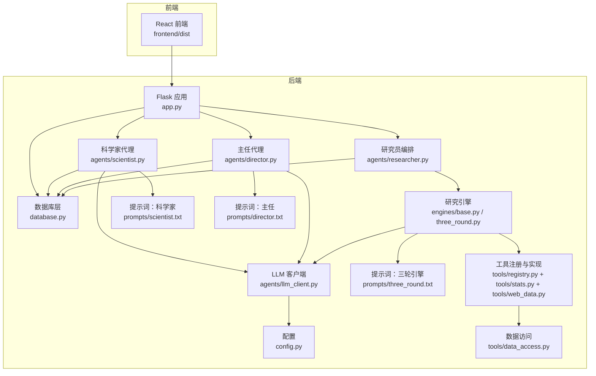
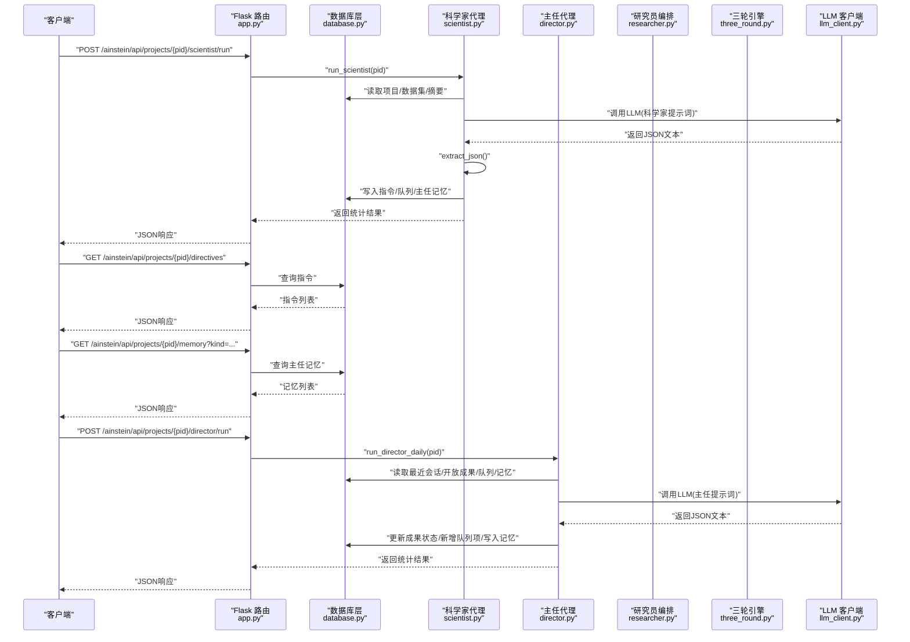
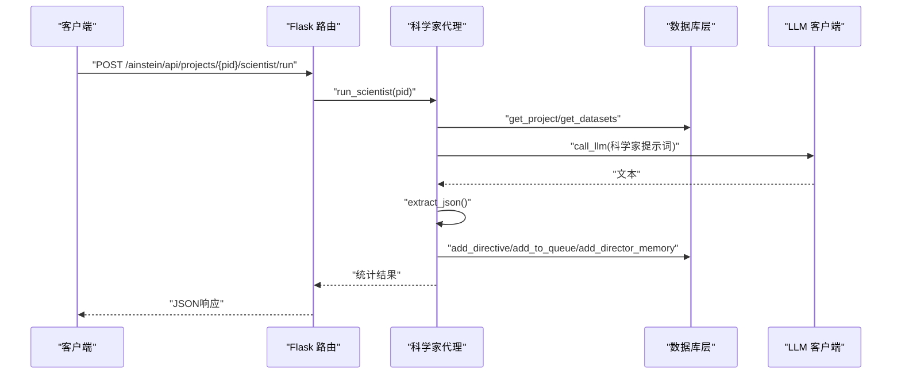
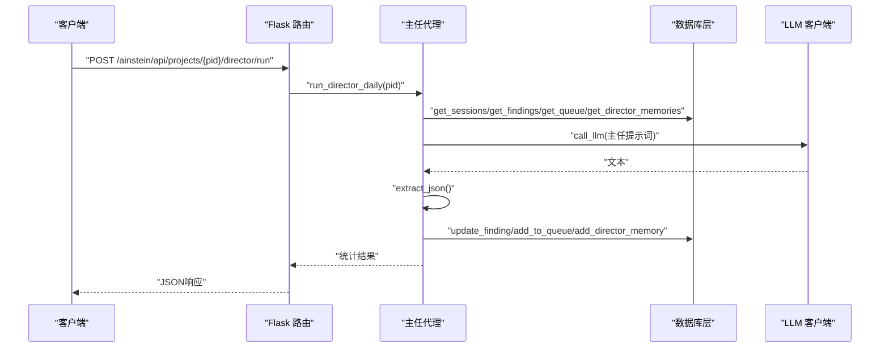
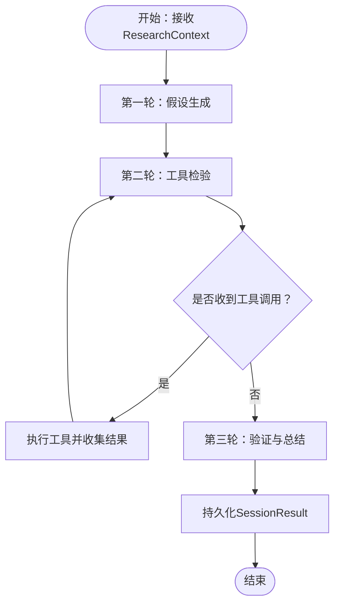
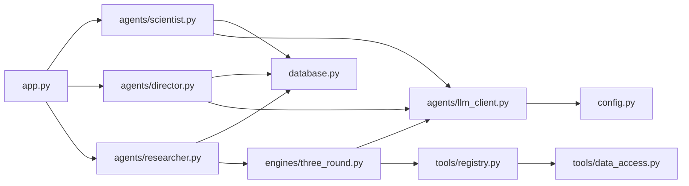

# AI代理管理API

<cite>
**本文引用的文件**
- [app.py](file://app.py)
- [database.py](file://database.py)
- [scientist.py](file://agents/scientist.py)
- [director.py](file://agents/director.py)
- [researcher.py](file://agents/researcher.py)
- [base.py](file://engines/base.py)
- [three_round.py](file://engines/three_round.py)
- [llm_client.py](file://agents/llm_client.py)
- [data_access.py](file://tools/data_access.py)
- [registry.py](file://tools/registry.py)
- [config.py](file://config.py)
- [scientist.txt](file://prompts/scientist.txt)
- [director.txt](file://prompts/director.txt)
- [three_round.txt](file://prompts/three_round.txt)
- [README.md](file://README.md)
</cite>

## 目录
1. [简介](#简介)
2. [项目结构](#项目结构)
3. [核心组件](#核心组件)
4. [架构总览](#架构总览)
5. [详细组件分析](#详细组件分析)
6. [依赖分析](#依赖分析)
7. [性能考虑](#性能考虑)
8. [故障排除指南](#故障排除指南)
9. [结论](#结论)
10. [附录](#附录)

## 简介
本文件面向AI代理管理API，聚焦以下代理相关接口：
- 获取指令列表：GET /ainstein/api/projects/<int:pid>/directives
- 科学家运行：POST /ainstein/api/projects/<int:pid>/scientist/run
- 内存查询：GET /ainstein/api/projects/<int:pid>/memory
- 主管运行：POST /ainstein/api/projects/<int:pid>/director/run

文档将系统阐述AI代理工作流与数据交换机制，给出从触发科学家分析到主管监督的完整执行示例，说明代理记忆存储与指令管理功能，并覆盖代理协作模式与错误处理策略。

## 项目结构
后端采用Flask应用，路由集中在app.py中定义；业务逻辑按职责拆分在agents、engines、tools、prompts等目录；数据库层封装于database.py，统一提供CRUD与索引；配置集中于config.py；提示词位于prompts目录；LLM客户端位于agents/llm_client.py。

图表来源
- [app.py:1-182](file://app.py#L1-L182)
- [database.py:1-344](file://database.py#L1-L344)
- [scientist.py:1-75](file://agents/scientist.py#L1-L75)
- [director.py:1-124](file://agents/director.py#L1-L124)
- [researcher.py:1-114](file://agents/researcher.py#L1-L114)
- [base.py:1-49](file://engines/base.py#L1-L49)
- [three_round.py:1-179](file://engines/three_round.py#L1-L179)
- [llm_client.py:1-114](file://agents/llm_client.py#L1-L114)
- [data_access.py:1-43](file://tools/data_access.py#L1-L43)
- [registry.py:1-181](file://tools/registry.py#L1-L181)
- [config.py:1-11](file://config.py#L1-L11)
- [scientist.txt:1-32](file://prompts/scientist.txt#L1-L32)
- [director.txt:1-43](file://prompts/director.txt#L1-L43)
- [three_round.txt:1-15](file://prompts/three_round.txt#L1-L15)

章节来源
- [README.md:71-124](file://README.md#L71-L124)
- [app.py:1-182](file://app.py#L1-L182)

## 核心组件
- 路由与入口
  - 健康检查：GET /ainstein/api/health
  - 项目管理：GET/POST /ainstein/api/projects，GET /ainstein/api/projects/<int:pid>
  - 队列管理：GET/POST /ainstein/api/projects/<int:pid>/queue
  - 会话管理：GET /ainstein/api/projects/<int:pid>/sessions，GET /ainstein/api/projects/<int:pid>/sessions/<int:sid>，POST /ainstein/api/projects/<int:pid>/sessions/run
  - 成果管理：GET /ainstein/api/projects/<int:pid>/findings
  - 数据集管理：GET /ainstein/api/projects/<int:pid>/datasets，POST /ainstein/api/projects/<int:pid>/datasets/upload
  - 代理相关接口（本文重点）
    - GET /ainstein/api/projects/<int:pid>/directives
    - POST /ainstein/api/projects/<int:pid>/scientist/run
    - GET /ainstein/api/projects/<int:pid>/memory
    - POST /ainstein/api/projects/<int:pid>/director/run
- 数据库层
  - 项目表、指令表、队列表、会话表、成果表、主任记忆表、数据集表，配套索引与统计函数
- 代理层
  - 科学家：生成指令与初始主题，写入队列与主任记忆
  - 主管：每日复盘，评审成果，调整队列，新增主题与记忆
  - 研究员：从队列取主题，驱动引擎执行，持久化结果
- 引擎层
  - 三轮引擎：假设生成 → 工具检验 → 验证总结
- 工具层
  - 统计工具与外部数据工具注册，支持LLM工具调用
- LLM客户端
  - DashScope兼容客户端，支持工具调用与JSON提取

章节来源
- [app.py:43-177](file://app.py#L43-L177)
- [database.py:101-344](file://database.py#L101-L344)

## 架构总览
下图展示代理相关接口的端到端调用链路与数据交换：

图表来源
- [app.py:157-177](file://app.py#L157-L177)
- [scientist.py:14-75](file://agents/scientist.py#L14-L75)
- [director.py:14-124](file://agents/director.py#L14-L124)
- [database.py:171-344](file://database.py#L171-L344)
- [llm_client.py:24-114](file://agents/llm_client.py#L24-L114)

## 详细组件分析

### 接口：获取指令列表 GET /ainstein/api/projects/<int:pid>/directives
- 功能：返回项目当前有效的研究指令列表（按优先级降序）
- 实现要点
  - 路由：app.py中定义
  - 查询：database.py中按项目ID与状态查询，返回JSON数组
- 响应字段
  - id：指令ID
  - project_id：所属项目
  - directive：指令内容
  - priority：优先级（数值越小越高）
  - status：状态（如active）
  - created_at：创建时间
- 使用场景
  - 主管复盘时作为上下文输入
  - 研究员执行时作为约束条件

章节来源
- [app.py:157-159](file://app.py#L157-L159)
- [database.py:171-188](file://database.py#L171-L188)

### 接口：科学家运行 POST /ainstein/api/projects/<int:pid>/scientist/run
- 功能：触发科学家代理，生成指令与初始主题，并写入数据库
- 请求体：无（或空JSON）
- 响应字段
  - directives：新增指令数量
  - topics：新增队列主题数量
  - categories：发现分类列表
  - notes：战略备注（写入主任记忆）
- 执行流程
  1) 读取项目信息与数据集摘要
  2) 加载科学家提示词，构造消息
  3) 调用LLM生成JSON
  4) 解析并写入指令表、队列表、主任记忆表
- 错误处理
  - 项目不存在：返回None（上层返回“无结果”）
  - LLM解析失败：记录错误并返回None
- 性能建议
  - 控制提示词长度，避免超限
  - 合理设置温度与最大token数

图表来源
- [app.py:161-166](file://app.py#L161-L166)
- [scientist.py:14-75](file://agents/scientist.py#L14-L75)
- [database.py:171-228](file://database.py#L171-L228)
- [llm_client.py:24-114](file://agents/llm_client.py#L24-L114)
- [scientist.txt:1-32](file://prompts/scientist.txt#L1-L32)

章节来源
- [app.py:161-166](file://app.py#L161-L166)
- [scientist.py:14-75](file://agents/scientist.py#L14-L75)
- [database.py:171-228](file://database.py#L171-L228)

### 接口：内存查询 GET /ainstein/api/projects/<int:pid>/memory
- 功能：查询主任记忆（可按kind过滤），用于主管复盘与历史洞察
- 查询参数
  - kind：记忆类型（如briefing、insight等）
- 响应字段
  - id、project_id、kind、content、context_data、created_at
- 使用场景
  - 主管每日复盘时作为上下文输入
  - 项目回顾与知识沉淀

章节来源
- [app.py:167-170](file://app.py#L167-L170)
- [database.py:297-320](file://database.py#L297-L320)

### 接口：主管运行 POST /ainstein/api/projects/<int:pid>/director/run
- 功能：触发主任代理，进行每日复盘、评审成果、调整队列、新增记忆与生成简报
- 请求体：无（或空JSON）
- 响应字段
  - findings_reviewed：评审成果数量
  - new_topics：新增队列主题数量
  - memories：新增记忆数量
  - briefing：简报内容
- 执行流程
  1) 读取最近会话、开放成果、队列与记忆
  2) 加载主任提示词，构造消息
  3) 调用LLM生成JSON
  4) 解析并更新成果状态、新增队列项、写入主任记忆
- 错误处理
  - 项目不存在：返回None
  - LLM解析失败：记录错误并返回None

图表来源
- [app.py:172-176](file://app.py#L172-L176)
- [director.py:14-124](file://agents/director.py#L14-L124)
- [database.py:230-320](file://database.py#L230-L320)
- [llm_client.py:24-114](file://agents/llm_client.py#L24-L114)
- [director.txt:1-43](file://prompts/director.txt#L1-L43)

章节来源
- [app.py:172-176](file://app.py#L172-L176)
- [director.py:14-124](file://agents/director.py#L14-L124)
- [database.py:230-320](file://database.py#L230-L320)

### 研究员执行（补充说明）
- 触发方式
  - 通过会话运行接口：POST /ainstein/api/projects/<int:pid>/sessions/run
  - 该接口会异步启动研究员会话，从队列取主题并执行引擎
- 关键点
  - 研究员从队列挑选下一个主题（优先级与创建时间）
  - 使用三轮引擎执行假设生成、工具检验与验证总结
  - 结果持久化至会话表与成果表，并向队列追加下一阶段方向

章节来源
- [app.py:95-104](file://app.py#L95-L104)
- [researcher.py:14-114](file://agents/researcher.py#L14-L114)
- [three_round.py:22-179](file://engines/three_round.py#L22-L179)

### 三轮引擎（数据交换机制）
- 输入上下文（ResearchContext）
  - project_id、mission、domain、topic、config
  - datasets_summary、recent_findings、directives
  - session_id、queue_id
- 输出结果（SessionResult）
  - status、hypotheses、verification、findings、next_directions、data_summary、duration_seconds
- 数据交换流程
  1) 假设生成：根据指令与近期发现生成可检验假设
  2) 工具检验：LLM发出工具调用请求，工具执行并返回结果
  3) 验证总结：基于证据生成发现、建议与数据摘要

图表来源
- [base.py:11-49](file://engines/base.py#L11-L49)
- [three_round.py:28-179](file://engines/three_round.py#L28-L179)

章节来源
- [base.py:11-49](file://engines/base.py#L11-L49)
- [three_round.py:28-179](file://engines/three_round.py#L28-L179)

### 提示词与模型配置
- 提示词模板
  - 科学家：定义指令与初始主题、发现分类与战略备注
  - 主管：评审发现、调整队列、新增主题与记忆、撰写简报
  - 三轮引擎：领域背景、可用工具与数据集、严谨表述要求
- 模型配置
  - RESEARCH_MODEL、SCIENTIST_MODEL、DIRECTOR_MODEL
  - DashScope API密钥与基础URL

章节来源
- [scientist.txt:1-32](file://prompts/scientist.txt#L1-L32)
- [director.txt:1-43](file://prompts/director.txt#L1-L43)
- [three_round.txt:1-15](file://prompts/three_round.txt#L1-L15)
- [config.py:1-11](file://config.py#L1-L11)

## 依赖分析
- 组件耦合
  - 路由层仅负责参数校验与调用代理层，职责清晰
  - 代理层依赖数据库层与LLM客户端，形成稳定的分层
  - 引擎层与工具层解耦，便于扩展新工具
- 外部依赖
  - LLM服务（DashScope兼容）
  - SQLite数据库（WAL模式）
  - 文件系统（数据集上传）

图表来源
- [app.py:157-177](file://app.py#L157-L177)
- [scientist.py:1-75](file://agents/scientist.py#L1-L75)
- [director.py:1-124](file://agents/director.py#L1-L124)
- [researcher.py:1-114](file://agents/researcher.py#L1-L114)
- [three_round.py:1-179](file://engines/three_round.py#L1-L179)
- [database.py:1-344](file://database.py#L1-L344)
- [llm_client.py:1-114](file://agents/llm_client.py#L1-L114)
- [registry.py:1-181](file://tools/registry.py#L1-L181)
- [data_access.py:1-43](file://tools/data_access.py#L1-L43)
- [config.py:1-11](file://config.py#L1-L11)

## 性能考虑
- LLM调用
  - 控制提示词长度与max_tokens，避免超限
  - 合理设置temperature，平衡创造性与稳定性
- 数据库
  - 使用WAL模式提升并发写入性能
  - 索引覆盖常用查询（项目、队列、会话、成果、记忆）
- 引擎执行
  - 工具调用限制轮次，防止无限循环
  - 结果序列化前进行大小控制

## 故障排除指南
- 项目不存在
  - 现象：科学家/主任运行返回“无结果”
  - 处理：确认项目ID有效
- LLM解析失败
  - 现象：日志出现“Failed to parse JSON from LLM response”
  - 处理：检查提示词格式与模型输出稳定性
- 工具调用异常
  - 现象：工具返回error或抛出异常
  - 处理：核对数据集名称与列名，确保工具参数正确
- 数据库异常
  - 现象：事务回滚或索引缺失导致查询缓慢
  - 处理：初始化数据库、检查索引存在性

章节来源
- [scientist.py:17-52](file://agents/scientist.py#L17-L52)
- [director.py:17-82](file://agents/director.py#L17-L82)
- [llm_client.py:73-114](file://agents/llm_client.py#L73-L114)
- [database.py:101-123](file://database.py#L101-L123)

## 结论
本文档梳理了AI代理管理API的核心接口与代理协作流程，明确了科学家生成指令与主题、主任进行质量监督与记忆积累、研究员执行三轮引擎的闭环机制。通过数据库层的结构化存储与提示词模板的标准化输出，系统实现了可解释、可追踪、可持续的知识积累。建议在生产环境中关注LLM稳定性、工具调用健壮性与数据库性能优化。

## 附录

### 完整执行示例：科学家分析与主管监督
- 步骤1：创建项目并上传数据集（略）
- 步骤2：触发科学家运行
  - 请求：POST /ainstein/api/projects/{pid}/scientist/run
  - 效果：生成指令、初始主题、发现分类与战略备注
- 步骤3：查看指令与记忆
  - 请求：GET /ainstein/api/projects/{pid}/directives
  - 请求：GET /ainstein/api/projects/{pid}/memory?kind=scientist_strategy
- 步骤4：主管每日运行
  - 请求：POST /ainstein/api/projects/{pid}/director/run
  - 效果：评审成果、调整队列、新增主题与记忆、生成简报
- 步骤5：研究员执行
  - 请求：POST /ainstein/api/projects/{pid}/sessions/run
  - 效果：从队列取主题，三轮引擎执行，结果持久化

章节来源
- [app.py:157-177](file://app.py#L157-L177)
- [scientist.py:14-75](file://agents/scientist.py#L14-L75)
- [director.py:14-124](file://agents/director.py#L14-L124)
- [researcher.py:14-114](file://agents/researcher.py#L14-L114)