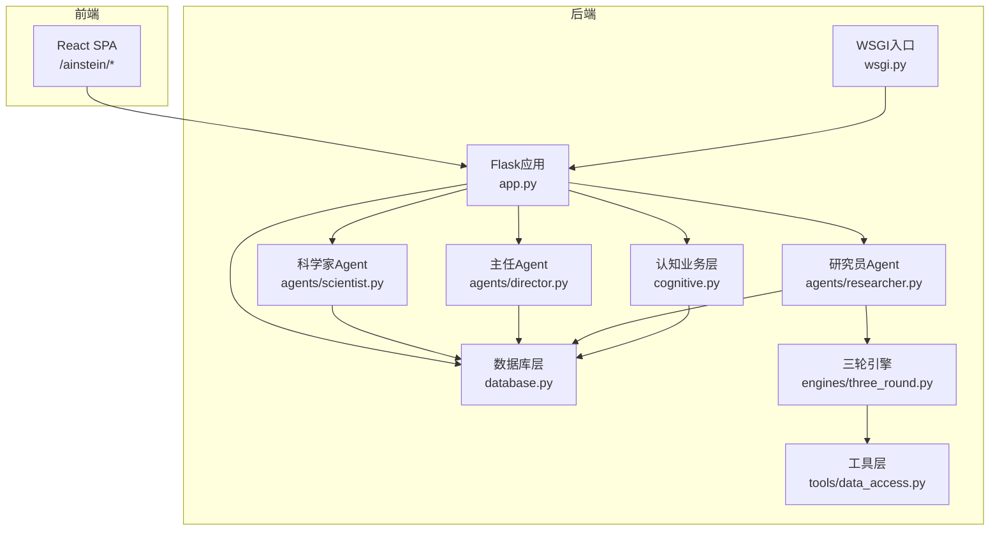
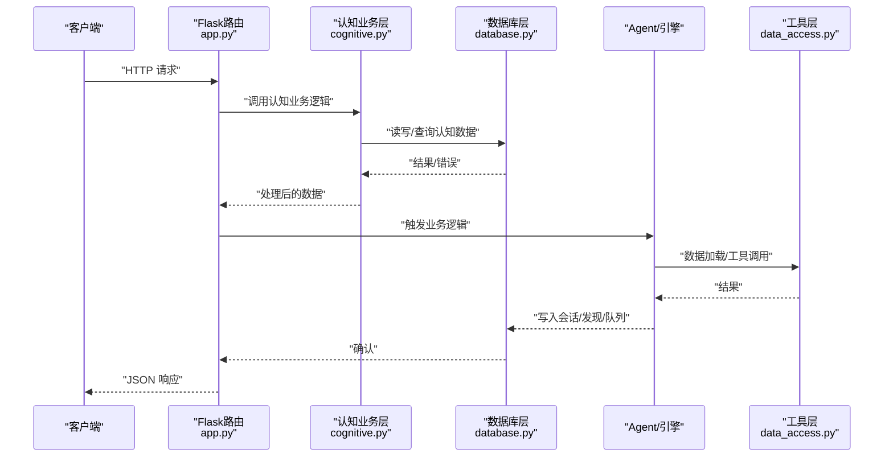
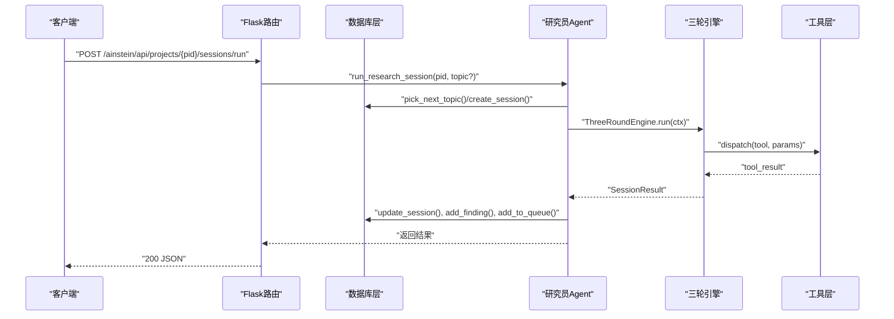
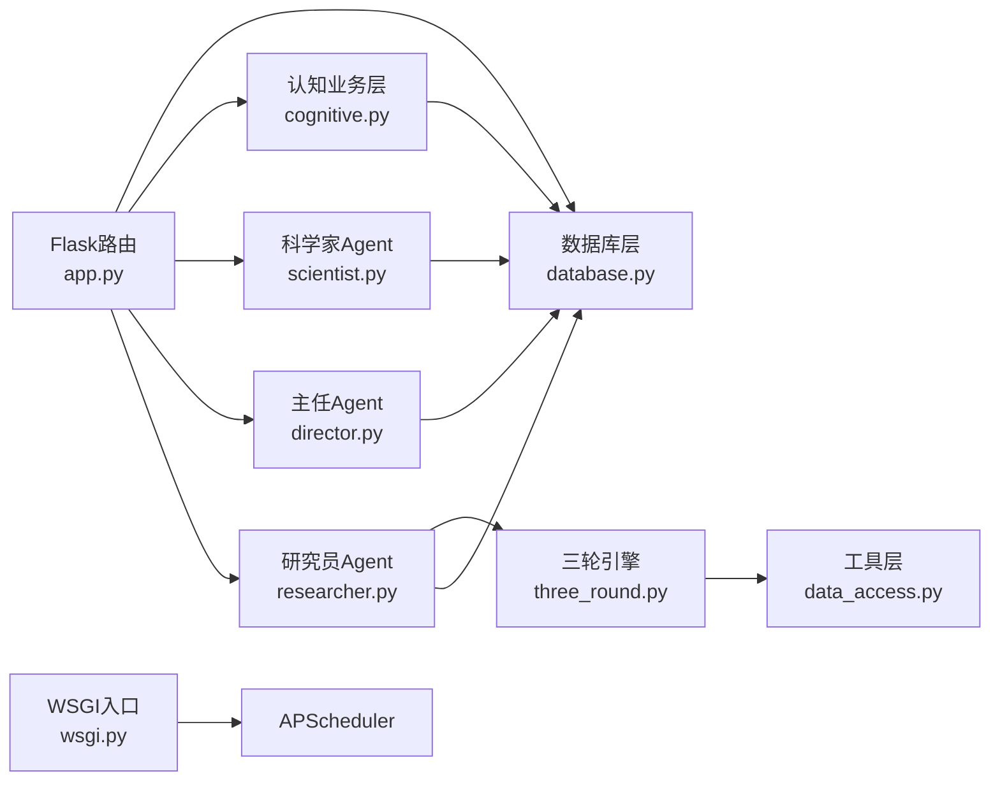

# API参考文档

<cite>
**本文档引用的文件**
- [app.py](file://app.py)
- [database.py](file://database.py)
- [wsgi.py](file://wsgi.py)
- [config.py](file://config.py)
- [researcher.py](file://agents/researcher.py)
- [scientist.py](file://agents/scientist.py)
- [director.py](file://agents/director.py)
- [three_round.py](file://engines/three_round.py)
- [data_access.py](file://tools/data_access.py)
- [cognitive.py](file://cognitive.py)
- [api.ts](file://frontend/src/api.ts)
- [README.md](file://README.md)
</cite>

## 目录
1. [简介](#简介)
2. [项目结构](#项目结构)
3. [核心组件](#核心组件)
4. [架构总览](#架构总览)
5. [详细组件分析](#详细组件分析)
6. [依赖关系分析](#依赖关系分析)
7. [性能考量](#性能考量)
8. [故障排除指南](#故障排除指南)
9. [结论](#结论)
10. [附录](#附录)

## 简介
本API参考文档面向开发者与集成方，系统化梳理AInstein平台的RESTful接口，覆盖项目管理、队列管理、会话管理、发现管理、数据集管理、科学家/主任/研究员调度接口，以及新增的**脑管理API**。新增的8个脑管理API端点支持认知元素的CRUD操作、关系管理、知识图谱检索和认知边界获取，为构建智能体的认知基础设施提供完整能力。文档提供每个接口的HTTP方法、URL模式、请求参数、响应格式、状态码说明，并补充认证机制、安全考虑、版本管理与向后兼容策略、错误处理与调试建议，以及常见使用场景的请求/响应示例路径。

## 项目结构
后端采用Flask应用，提供统一的前缀路径/ainstein/api，前端通过/ainstein/提供SPA静态资源。WSGI入口负责调度器初始化与锁控制，数据库层封装SQLite Schema与CRUD操作，Agent层负责业务编排，引擎层提供研究流程实现，工具层提供数据访问与统计工具。**新增的脑管理模块**通过cognitive.py提供认知元素、关系和知识图谱的核心业务逻辑。

**图表来源**
- [app.py:1-182](file://app.py#L1-L182)
- [wsgi.py:1-83](file://wsgi.py#L1-L83)
- [database.py:1-344](file://database.py#L1-L344)
- [cognitive.py:1-359](file://cognitive.py#L1-L359)
- [researcher.py:1-114](file://agents/researcher.py#L1-L114)
- [scientist.py:1-75](file://agents/scientist.py#L1-L75)
- [director.py:1-124](file://agents/director.py#L1-L124)
- [three_round.py:1-179](file://engines/three_round.py#L1-L179)
- [data_access.py:1-43](file://tools/data_access.py#L1-L43)

**章节来源**
- [app.py:11-38](file://app.py#L11-L38)
- [README.md:71-124](file://README.md#L71-L124)

## 核心组件
- 路由与入口
  - 前端静态资源路由：/ainstein/ 与 /ainstein/assets/*
  - 健康检查：/ainstein/api/health
- 数据库层
  - 提供项目、队列、会话、发现、数据集、指令、记忆等表的CRUD与查询
  - **新增认知数据库表**：cognitive_elements、cognitive_relations
- 认知业务层
  - **新增**：认知元素CRUD、关系管理、知识图谱聚合、认知边界计算
- Agent与引擎
  - 科学家：生成指令与初始主题
  - 主任：每日复盘、队列治理、记忆积累
  - 研究员：三轮引擎执行研究、持久化结果
- 工具层
  - 数据集加载与摘要生成

**章节来源**
- [app.py:43-177](file://app.py#L43-L177)
- [database.py:101-344](file://database.py#L101-L344)
- [cognitive.py:1-359](file://cognitive.py#L1-L359)
- [researcher.py:14-114](file://agents/researcher.py#L14-L114)
- [scientist.py:14-75](file://agents/scientist.py#L14-L75)
- [director.py:14-124](file://agents/director.py#L14-L124)
- [three_round.py:22-179](file://engines/three_round.py#L22-L179)
- [data_access.py:10-43](file://tools/data_access.py#L10-L43)

## 架构总览
下图展示API到数据库与Agent/引擎的交互关系，以及新增的脑管理模块如何与现有系统集成。

**图表来源**
- [app.py:43-177](file://app.py#L43-L177)
- [cognitive.py:1-359](file://cognitive.py#L1-L359)
- [database.py:101-344](file://database.py#L101-L344)
- [researcher.py:14-114](file://agents/researcher.py#L14-L114)
- [scientist.py:14-75](file://agents/scientist.py#L14-L75)
- [director.py:14-124](file://agents/director.py#L14-L124)
- [three_round.py:22-179](file://engines/three_round.py#L22-L179)
- [data_access.py:10-43](file://tools/data_access.py#L10-L43)

## 详细组件分析

### 健康检查
- 方法与路径
  - GET /ainstein/api/health
- 请求
  - 无请求体
- 响应
  - 成功：{"status":"ok"}
- 状态码
  - 200 OK
- 使用场景
  - 健康探针、部署验证

**章节来源**
- [app.py:43-46](file://app.py#L43-L46)

### 项目管理
- 列出项目
  - 方法与路径：GET /ainstein/api/projects
  - 查询参数：无
  - 响应：数组，元素为项目对象
  - 状态码：200 OK
- 创建项目
  - 方法与路径：POST /ainstein/api/projects
  - 请求体字段：name, mission, domain, config?(可选)
  - 响应：{"id": projectId}
  - 状态码：201 Created；400 Bad Request（如缺少必要字段）
- 获取项目详情
  - 方法与路径：GET /ainstein/api/projects/{pid}
  - 路径参数：pid
  - 响应：项目对象 + stats
  - 状态码：200 OK；404 Not Found（不存在）

请求示例（创建项目）
- 方法：POST
- 路径：/ainstein/api/projects
- 请求头：Content-Type: application/json
- 请求体：{"name":"示例项目","mission":"探索AI对教育的影响","domain":"教育科技","config":{"key":"value"}}
- 响应：{"id":1}

响应示例（获取项目）
- 响应体：{"id":1,"name":"示例项目","mission":"探索AI对教育的影响","domain":"教育科技","config_json":"{\"key\":\"value\"}","status":"active","created_at":"YYYY-MM-DD HH:MM:SS","stats":{"sessions_total":0,...}}

**章节来源**
- [app.py:50-66](file://app.py#L50-L66)
- [database.py:127-168](file://database.py#L127-L168)

### 队列管理
- 列出队列
  - 方法与路径：GET /ainstein/api/projects/{pid}/queue
  - 路径参数：pid
  - 响应：数组，元素为队列项
  - 状态码：200 OK
- 添加队列项
  - 方法与路径：POST /ainstein/api/projects/{pid}/queue
  - 请求体字段：topic, priority?(默认5), source?(默认"user")
  - 响应：{"id": queueId}
  - 状态码：201 Created；400 Bad Request

请求示例（添加队列项）
- 方法：POST
- 路径：/ainstein/api/projects/1/queue
- 请求体：{"topic":"分析用户行为模式","priority":7,"source":"user"}

**章节来源**
- [app.py:71-79](file://app.py#L71-L79)
- [database.py:192-224](file://database.py#L192-L224)

### 会话管理
- 列出会话
  - 方法与路径：GET /ainstein/api/projects/{pid}/sessions
  - 路径参数：pid
  - 响应：数组，元素为会话对象
  - 状态码：200 OK
- 获取会话
  - 方法与路径：GET /ainstein/api/projects/{pid}/sessions/{sid}
  - 路径参数：pid, sid
  - 响应：会话对象
  - 状态码：200 OK；404 Not Found
- 启动会话
  - 方法与路径：POST /ainstein/api/projects/{pid}/sessions/run
  - 请求体字段：topic?(可选，若不提供则从队列取下一个)
  - 响应：{"status":"started"}
  - 状态码：200 OK

请求示例（启动会话）
- 方法：POST
- 路径：/ainstein/api/projects/1/sessions/run
- 请求体：{"topic":"基于数据的验证"}

会话生命周期（序列）

**图表来源**
- [app.py:95-104](file://app.py#L95-L104)
- [researcher.py:14-114](file://agents/researcher.py#L14-L114)
- [three_round.py:28-179](file://engines/three_round.py#L28-L179)
- [database.py:232-262](file://database.py#L232-L262)

**章节来源**
- [app.py:84-104](file://app.py#L84-L104)
- [database.py:232-262](file://database.py#L232-L262)
- [researcher.py:14-114](file://agents/researcher.py#L14-L114)
- [three_round.py:28-179](file://engines/three_round.py#L28-L179)

### 发现管理
- 列出发现
  - 方法与路径：GET /ainstein/api/projects/{pid}/findings
  - 查询参数：status?, category?, limit?(默认50)
  - 响应：数组，元素为发现对象（含会话主题）
  - 状态码：200 OK

请求示例（列出发现）
- 方法：GET
- 路径：/ainstein/api/projects/1/findings?status=open&category=general&limit=50

**章节来源**
- [app.py:109-114](file://app.py#L109-L114)
- [database.py:277-291](file://database.py#L277-L291)

### 数据集管理
- 列出数据集
  - 方法与路径：GET /ainstein/api/projects/{pid}/datasets
  - 路径参数：pid
  - 响应：数组，元素为数据集对象
  - 状态码：200 OK
- 上传数据集
  - 方法与路径：POST /ainstein/api/projects/{pid}/datasets/upload
  - 表单字段：file
  - 响应：{"id": datasetId,"schema":[...],"row_count":N}
  - 状态码：201 Created；400 Bad Request（无文件）

请求示例（上传数据集）
- 方法：POST
- 路径：/ainstein/api/projects/1/datasets/upload
- 表单：file=选择CSV/JSON文件
- 响应：{"id":1,"schema":[{"name":"列名","dtype":"类型"}],"row_count":1000}

**章节来源**
- [app.py:119-152](file://app.py#L119-L152)
- [database.py:324-339](file://database.py#L324-L339)
- [data_access.py:10-43](file://tools/data_access.py#L10-L43)

### 科学家/主任/指令与记忆
- 列出指令
  - 方法与路径：GET /ainstein/api/projects/{pid}/directives
  - 响应：数组，元素为指令对象
  - 状态码：200 OK
- 运行科学家
  - 方法与路径：POST /ainstein/api/projects/{pid}/scientist/run
  - 响应：执行结果或{"status":"no result"}
  - 状态码：200 OK
- 列出记忆
  - 方法与路径：GET /ainstein/api/projects/{pid}/memory
  - 查询参数：kind?
  - 响应：数组，元素为记忆对象
  - 状态码：200 OK
- 运行主任
  - 方法与路径：POST /ainstein/api/projects/{pid}/director/run
  - 响应：执行结果或{"status":"no result"}
  - 状态码：200 OK

请求示例（运行科学家）
- 方法：POST
- 路径：/ainstein/api/projects/1/scientist/run

请求示例（列出记忆）
- 方法：GET
- 路径：/ainstein/api/projects/1/memory?kind=scientist_strategy

**章节来源**
- [app.py:157-177](file://app.py#L157-L177)
- [database.py:173-188](file://database.py#L173-L188)
- [database.py:299-319](file://database.py#L299-L319)
- [scientist.py:14-75](file://agents/scientist.py#L14-L75)
- [director.py:14-124](file://agents/director.py#L14-L124)

### 脑管理API（新增）

#### 认知元素管理
- 列出认知元素
  - 方法与路径：GET /ainstein/api/brains/{brain_id}/cognitive-elements
  - 路径参数：brain_id
  - 查询参数：type, min_confidence, limit, offset
  - 响应：{"items":[...], "limit":N, "offset":M}
  - 状态码：200 OK；400 Bad Request（参数错误）；404 Not Found（大脑不存在）
- 创建认知元素
  - 方法与路径：POST /ainstein/api/brains/{brain_id}/cognitive-elements
  - 路径参数：brain_id
  - 请求体字段：type, content, payload_json?, confidence?, status?, version?
  - 响应：认知元素对象
  - 状态码：201 Created；400 Bad Request；404 Not Found
- 获取认知元素
  - 方法与路径：GET /ainstein/api/brains/{brain_id}/cognitive-elements/{ce_id}
  - 路径参数：brain_id, ce_id
  - 响应：认知元素对象
  - 状态码：200 OK；404 Not Found
- 更新认知元素
  - 方法与路径：PATCH /ainstein/api/brains/{brain_id}/cognitive-elements/{ce_id}
  - 路径参数：brain_id, ce_id
  - 请求体字段：content, payload_json, confidence, confidence_method, status, version, superseded_by, domain_tags
  - 响应：更新后的认知元素对象
  - 状态码：200 OK；400 Bad Request；404 Not Found
- 删除认知元素
  - 方法与路径：DELETE /ainstein/api/brains/{brain_id}/cognitive-elements/{ce_id}
  - 路径参数：brain_id, ce_id
  - 响应：{"status":"deleted"}
  - 状态码：200 OK；404 Not Found

请求示例（创建认知元素）
- 方法：POST
- 路径：/ainstein/api/brains/1/cognitive-elements
- 请求体：{"type":"hypothesis","content":"AI在教育中的应用可能改变传统教学模式","confidence":0.8,"status":"active"}

响应示例（列出认知元素）
- 响应体：{"items":[{"id":1,"brain_id":1,"type":"hypothesis","content":"AI在教育中的应用可能改变传统教学模式","confidence":0.8,"status":"active","version":1,"created_at":"YYYY-MM-DD HH:MM:SS"}],"limit":50,"offset":0}

#### 认知关系管理
- 列出认知关系
  - 方法与路径：GET /ainstein/api/brains/{brain_id}/cognitive-relations
  - 路径参数：brain_id
  - 查询参数：element_id, direction, src_id, dst_id, relation
  - 响应：{"items":[...]}
  - 状态码：200 OK；400 Bad Request；404 Not Found
- 创建认知关系
  - 方法与路径：POST /ainstein/api/brains/{brain_id}/cognitive-relations
  - 路径参数：brain_id
  - 请求体字段：source_id, target_id, relation_type, weight, created_by_agent_id
  - 响应：关系对象
  - 状态码：201 Created；400 Bad Request；404 Not Found

请求示例（创建认知关系）
- 方法：POST
- 路径：/ainstein/api/brains/1/cognitive-relations
- 请求体：{"source_id":1,"target_id":2,"relation_type":"supports","weight":0.9,"created_by_agent_id":101}

#### 知识图谱检索
- 获取知识图谱
  - 方法与路径：GET /ainstein/api/brains/{brain_id}/knowledge-graph
  - 路径参数：brain_id
  - 查询参数：types, limit
  - 响应：{"nodes":[...],"edges":[...]}
  - 状态码：200 OK；400 Bad Request；404 Not Found

请求示例（获取知识图谱）
- 方法：GET
- 路径：/ainstein/api/brains/1/knowledge-graph?types=hypothesis,fact&limit=200

#### 认知边界获取
- 获取认知边界
  - 方法与路径：GET /ainstein/api/brains/{brain_id}/frontier
  - 路径参数：brain_id
  - 查询参数：limit, confidence_ceiling
  - 响应：认知元素数组
  - 状态码：200 OK；400 Bad Request；404 Not Found

请求示例（获取认知边界）
- 方法：GET
- 路径：/ainstein/api/brains/1/frontier?limit=50&confidence_ceiling=0.7

**章节来源**
- [app.py:183-364](file://app.py#L183-L364)
- [cognitive.py:1-359](file://cognitive.py#L1-L359)
- [database.py:603-699](file://database.py#L603-L699)

## 依赖关系分析
- 组件耦合
  - Flask路由依赖数据库层进行数据持久化
  - **新增认知业务层**通过cognitive.py封装复杂的认知元素和关系逻辑
  - Agent层依赖数据库与工具层，引擎层作为执行器
- 外部依赖
  - LLM服务（DashScope/Anthropic兼容），通过环境变量配置
  - 文件系统用于数据集存储
- 调度器
  - WSGI入口负责APScheduler初始化与互斥锁，避免多实例重复调度

**图表来源**
- [app.py:43-177](file://app.py#L43-L177)
- [cognitive.py:1-359](file://cognitive.py#L1-L359)
- [database.py:101-344](file://database.py#L101-L344)
- [wsgi.py:27-71](file://wsgi.py#L27-L71)
- [researcher.py:14-114](file://agents/researcher.py#L14-L114)
- [scientist.py:14-75](file://agents/scientist.py#L14-L75)
- [director.py:14-124](file://agents/director.py#L14-L124)
- [three_round.py:22-179](file://engines/three_round.py#L22-L179)
- [data_access.py:10-43](file://tools/data_access.py#L10-L43)

**章节来源**
- [wsgi.py:1-83](file://wsgi.py#L1-L83)
- [config.py:1-11](file://config.py#L1-L11)

## 性能考量
- 数据库
  - WAL模式与外键开启提升并发与一致性
  - 为关键查询建立索引（队列、会话、发现、记忆、数据集、指令、**认知元素、认知关系**）
  - **新增索引优化**：cognitive_elements(brain_id,type,status,created_at)、cognitive_relations(src_id,dst_id,relation)
- 引擎与工具
  - 三轮引擎限制工具调用轮次，避免LLM对话过长
  - 工具调用按需进行，减少不必要的计算
- 并发与异步
  - 会话启动采用线程异步执行，避免阻塞主请求
- 前端
  - 前端API封装统一错误处理，便于调试

**章节来源**
- [database.py:113-122](file://database.py#L113-L122)
- [database.py:92-98](file://database.py#L92-L98)
- [app.py:97-104](file://app.py#L97-L104)
- [three_round.py:105-135](file://engines/three_round.py#L105-L135)
- [api.ts:3-7](file://frontend/src/api.ts#L3-L7)

## 故障排除指南
- 常见错误与原因
  - 404 未找到：项目/会话/大脑不存在或路径错误
  - 400 参数错误：缺少文件、请求体格式不正确或参数非法
  - 500 内部错误：引擎执行失败或数据库事务回滚
  - **新增**：认知元素类型非法、关系跨脑创建、置信度过高或过低
- 调试步骤
  - 使用健康检查确认服务可用
  - 检查数据库初始化与Schema是否正确
  - 查看Agent日志定位引擎执行问题
  - 确认LLM API Key与Base URL配置
  - **新增**：验证认知元素类型列表、检查关系源目标是否属于同一大脑
- 错误处理
  - 前端统一捕获非OK响应并抛出错误
  - 后端在路由中返回标准JSON错误体

**章节来源**
- [app.py:63-65](file://app.py#L63-L65)
- [app.py:91-93](file://app.py#L91-L93)
- [app.py:129-131](file://app.py#L129-L131)
- [cognitive.py:254-283](file://cognitive.py#L254-L283)
- [api.ts:3-7](file://frontend/src/api.ts#L3-L7)

## 结论
本API参考文档提供了AInstein平台各模块的完整接口规范与使用指南，**新增的脑管理API模块**为构建智能体的认知基础设施提供了完整的CRUD、关系管理和知识图谱检索能力。通过明确的HTTP方法、URL模式、请求参数、响应格式与状态码，结合调度器、Agent与引擎的协作机制，开发者可以快速集成与扩展平台能力。建议在生产环境中关注数据库索引、LLM配置与文件存储路径的安全性与可靠性，同时注意新增认知数据的类型约束和关系完整性。

## 附录

### 认证机制与安全
- 当前实现
  - 未内置鉴权中间件，所有接口均为开放访问
- 安全建议
  - 在反向代理层启用认证与访问控制
  - 限制/ainstein/api的暴露范围，仅允许可信网络访问
  - 为敏感环境变量（如API Key）设置最小权限与轮换策略
  - **新增**：对认知元素和关系的创建操作增加权限验证，防止跨大脑数据访问

**章节来源**
- [config.py:6-11](file://config.py#L6-L11)
- [README.md:71-93](file://README.md#L71-L93)

### API版本管理与向后兼容
- 版本策略
  - 当前路径以/ainstein/api为前缀，暂未引入版本号
- 向后兼容
  - 新增字段以可选方式提供，避免破坏既有客户端
  - 保持现有字段语义不变，新增枚举值时在文档中标注
  - **新增**：脑管理API采用独立的/brains路径，不影响现有接口兼容性
- 建议
  - 引入/v1前缀并在未来演进中逐步迁移
  - 为重大变更提供弃用时间表与迁移指南

**章节来源**
- [app.py:43-177](file://app.py#L43-L177)

### 常见使用场景
- 场景A：创建项目并上传数据集
  - 步骤：POST /ainstein/api/projects -> POST /ainstein/api/projects/{pid}/datasets/upload
  - 示例路径：[创建项目:54-58](file://app.py#L54-L58)、[上传数据集:123-152](file://app.py#L123-L152)
- 场景B：启动一次研究会话
  - 步骤：POST /ainstein/api/projects/{pid}/sessions/run
  - 示例路径：[启动会话:95-104](file://app.py#L95-L104)
- 场景C：查看发现与队列
  - 步骤：GET /ainstein/api/projects/{pid}/findings -> GET /ainstein/api/projects/{pid}/queue
  - 示例路径：[列出发现:109-114](file://app.py#L109-L114)、[列出队列:71-73](file://app.py#L71-L73)
- **新增场景D：构建认知图谱**
  - 步骤：POST /ainstein/api/brains/{brain_id}/cognitive-elements -> POST /ainstein/api/brains/{brain_id}/cognitive-relations -> GET /ainstein/api/brains/{brain_id}/knowledge-graph
  - 示例路径：[创建认知元素:216-239](file://app.py#L216-L239)、[创建认知关系:301-323](file://app.py#L301-L323)、[获取知识图谱:326-345](file://app.py#L326-L345)
- **新增场景E：分析认知边界**
  - 步骤：GET /ainstein/api/brains/{brain_id}/frontier
  - 示例路径：[获取认知边界:348-359](file://app.py#L348-L359)

**章节来源**
- [app.py:54-58](file://app.py#L54-L58)
- [app.py:123-152](file://app.py#L123-L152)
- [app.py:95-104](file://app.py#L95-L104)
- [app.py:109-114](file://app.py#L109-L114)
- [app.py:71-73](file://app.py#L71-L73)
- [app.py:216-239](file://app.py#L216-L239)
- [app.py:301-323](file://app.py#L301-L323)
- [app.py:326-345](file://app.py#L326-L345)
- [app.py:348-359](file://app.py#L348-L359)