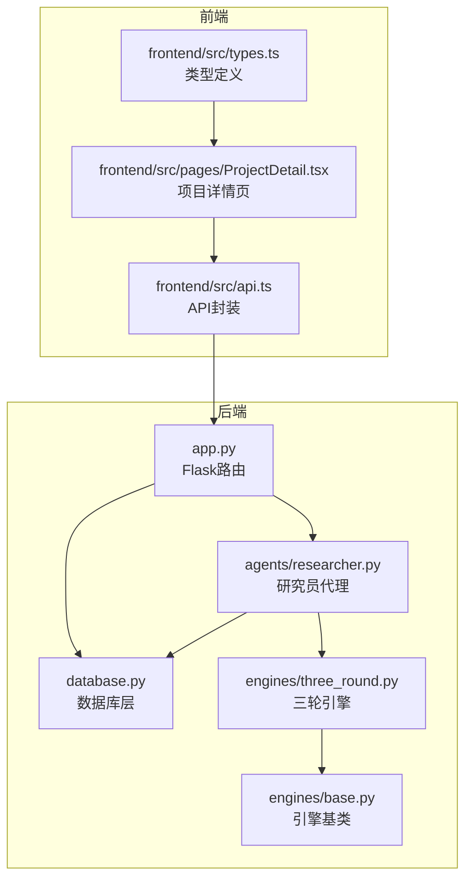
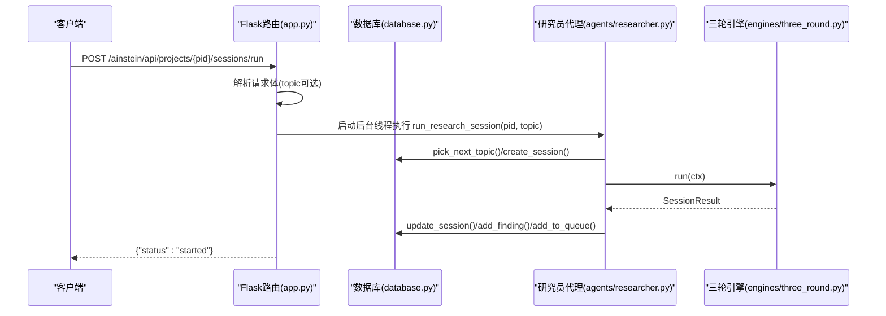
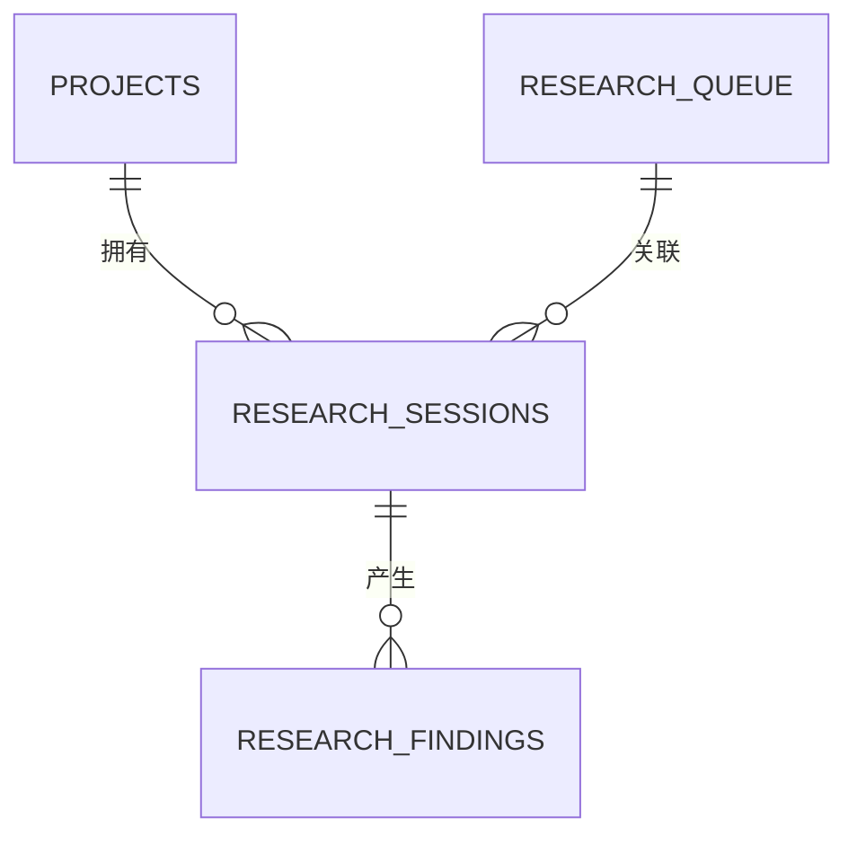
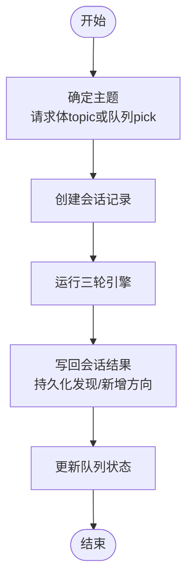
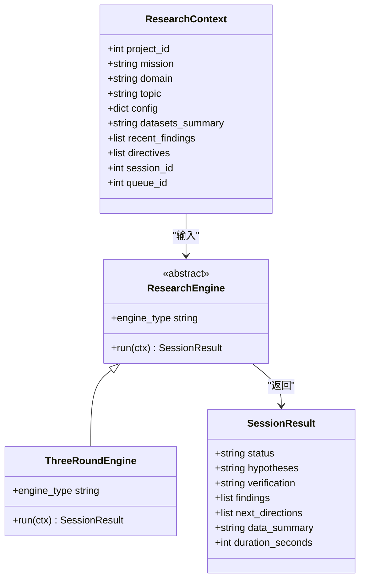
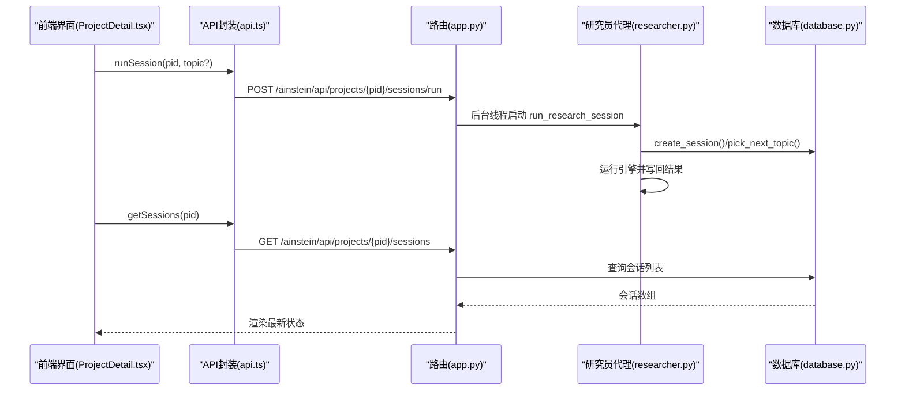
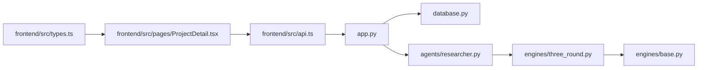

# 会话管理API

<cite>
**本文档引用的文件**
- [app.py](file://app.py)
- [database.py](file://database.py)
- [agents/researcher.py](file://agents/researcher.py)
- [engines/three_round.py](file://engines/three_round.py)
- [engines/base.py](file://engines/base.py)
- [frontend/src/api.ts](file://frontend/src/api.ts)
- [frontend/src/types.ts](file://frontend/src/types.ts)
- [frontend/src/pages/ProjectDetail.tsx](file://frontend/src/pages/ProjectDetail.tsx)
- [README.md](file://README.md)
</cite>

## 目录
1. [简介](#简介)
2. [项目结构](#项目结构)
3. [核心组件](#核心组件)
4. [架构总览](#架构总览)
5. [详细组件分析](#详细组件分析)
6. [依赖关系分析](#依赖关系分析)
7. [性能考虑](#性能考虑)
8. [故障排除指南](#故障排除指南)
9. [结论](#结论)

## 简介
本文件为会话管理API的详细技术文档，涵盖以下内容：
- 会话操作接口：获取会话列表、获取单个会话、运行会话
- 会话数据模型与运行机制
- 会话生命周期管理（异步执行与状态监控）
- 会话与研究流程的关系，以及如何通过API触发研究执行

该系统基于Flask后端、SQLite数据库、React前端，采用三级AI协作（科学家→主任→研究员）与三轮研究引擎（假设生成→工具检验→验证总结）实现数据驱动的深度研究。

## 项目结构
后端路由集中在应用入口文件中，数据库层负责数据持久化，AI代理与引擎位于独立模块，前端通过API封装与后端交互。

**图表来源**
- [app.py:1-182](file://app.py#L1-L182)
- [database.py:1-344](file://database.py#L1-L344)
- [agents/researcher.py:1-114](file://agents/researcher.py#L1-L114)
- [engines/three_round.py:1-179](file://engines/three_round.py#L1-L179)
- [engines/base.py:1-49](file://engines/base.py#L1-L49)
- [frontend/src/api.ts:1-45](file://frontend/src/api.ts#L1-L45)
- [frontend/src/types.ts:1-89](file://frontend/src/types.ts#L1-L89)
- [frontend/src/pages/ProjectDetail.tsx:113-167](file://frontend/src/pages/ProjectDetail.tsx#L113-L167)

**章节来源**
- [app.py:1-182](file://app.py#L1-L182)
- [database.py:1-344](file://database.py#L1-L344)
- [README.md:1-146](file://README.md#L1-L146)

## 核心组件
- 会话管理API：提供会话列表查询、单个会话查询、异步运行会话
- 数据库层：维护项目、队列、会话、发现、记忆、数据集等表结构与CRUD
- 研究员代理：从队列挑选主题、创建会话、运行引擎、写回结果
- 三轮引擎：按阶段生成假设、工具检验、验证总结
- 前端API封装：统一REST调用、参数拼装与错误处理

**章节来源**
- [app.py:82-105](file://app.py#L82-L105)
- [database.py:41-98](file://database.py#L41-L98)
- [agents/researcher.py:14-114](file://agents/researcher.py#L14-L114)
- [engines/three_round.py:22-179](file://engines/three_round.py#L22-L179)
- [frontend/src/api.ts:9-21](file://frontend/src/api.ts#L9-L21)

## 架构总览
会话管理API在Flask中以REST风格暴露，请求进入后端路由，经数据库层读写，研究员代理触发异步研究流程，引擎执行三轮研究并将结果持久化到数据库。

**图表来源**
- [app.py:95-104](file://app.py#L95-L104)
- [agents/researcher.py:14-114](file://agents/researcher.py#L14-L114)
- [engines/three_round.py:28-179](file://engines/three_round.py#L28-L179)
- [database.py:214-261](file://database.py#L214-L261)

## 详细组件分析

### 会话管理API接口定义
- 获取会话列表
  - 方法与路径：GET /ainstein/api/projects/<int:pid>/sessions
  - 功能：返回指定项目最近的若干会话
  - 参数：pid（路径参数）
  - 返回：会话数组（JSON）
- 获取单个会话
  - 方法与路径：GET /ainstein/api/projects/<int:pid>/sessions/<int:sid>
  - 功能：返回指定会话详情，并校验项目归属
  - 参数：pid（路径参数）、sid（路径参数）
  - 返回：会话对象（JSON），若不存在返回错误码
- 运行会话
  - 方法与路径：POST /ainstein/api/projects/<int:pid>/sessions/run
  - 功能：异步启动一次研究会话；可选传入topic
  - 参数：pid（路径参数），请求体包含topic（字符串，可选）
  - 返回：{"status":"started"}

前端调用示例（通过API封装）：
- 列表：api.getSessions(pid)
- 详情：api.getSession(pid, sid)
- 运行：api.runSession(pid, topic?)

**章节来源**
- [app.py:84-104](file://app.py#L84-L104)
- [frontend/src/api.ts:18-21](file://frontend/src/api.ts#L18-L21)
- [frontend/src/pages/ProjectDetail.tsx:118-123](file://frontend/src/pages/ProjectDetail.tsx#L118-L123)

### 会话数据模型
会话实体字段（来自数据库表）：
- id：自增主键
- project_id：所属项目
- queue_id：关联队列项（可空）
- topic：研究主题
- engine_type：引擎类型，默认"three_round"
- status：会话状态，默认"running"
- hypotheses：假设（JSON字符串）
- verification：验证过程与结果（JSON字符串）
- findings：发现（JSON数组）
- next_directions：建议方向（JSON数组）
- data_summary：数据摘要
- duration_seconds：耗时（秒）
- created_at：创建时间

前端类型定义（TypeScript）：
- Session接口包含上述字段，便于前端强类型使用

**图表来源**
- [database.py:41-69](file://database.py#L41-L69)
- [database.py:232-261](file://database.py#L232-L261)

**章节来源**
- [database.py:41-55](file://database.py#L41-L55)
- [frontend/src/types.ts:31-44](file://frontend/src/types.ts#L31-L44)

### 会话运行机制
- 异步执行：POST /sessions/run通过后台线程启动研究员代理，避免阻塞HTTP请求
- 主题来源：优先使用请求体中的topic；否则从队列中挑选下一个待处理主题
- 生命周期：
  - 创建会话：记录项目、主题、引擎类型、队列关联
  - 执行引擎：三轮研究（假设→检验→验证）
  - 写回结果：更新会话状态与字段，持久化发现，向队列添加新方向
  - 更新队列：将被消费的主题标记为完成或失败

**图表来源**
- [agents/researcher.py:25-106](file://agents/researcher.py#L25-L106)
- [engines/three_round.py:28-179](file://engines/three_round.py#L28-L179)
- [database.py:232-261](file://database.py#L232-L261)

**章节来源**
- [app.py:95-104](file://app.py#L95-L104)
- [agents/researcher.py:14-114](file://agents/researcher.py#L14-L114)
- [database.py:214-261](file://database.py#L214-L261)

### 会话状态与生命周期
- 默认状态：running（创建时）
- 可能状态：running、completed、failed、partial（引擎解析失败时）
- 状态变更：
  - 成功：completed（引擎正常完成）
  - 失败：failed（引擎异常或无假设）
  - 部分：partial（第三轮JSON解析失败）

前端展示映射：
- completed：已完成
- failed：失败
- running：进行中
- partial：部分完成

**章节来源**
- [database.py:47-47](file://database.py#L47-L47)
- [engines/three_round.py:73-75](file://engines/three_round.py#L73-L75)
- [engines/three_round.py:173-175](file://engines/three_round.py#L173-L175)
- [frontend/src/pages/ProjectDetail.tsx:147-148](file://frontend/src/pages/ProjectDetail.tsx#L147-L148)

### 与研究流程的关系
- 队列驱动：会话通常由队列中的待处理主题触发
- 发现闭环：会话产生的发现与建议方向会被纳入后续研究
- 引擎抽象：引擎基类定义了上下文与结果的数据结构，三轮引擎实现具体流程

**图表来源**
- [engines/base.py:11-49](file://engines/base.py#L11-L49)
- [engines/three_round.py:22-179](file://engines/three_round.py#L22-L179)

**章节来源**
- [engines/base.py:11-49](file://engines/base.py#L11-L49)
- [engines/three_round.py:22-179](file://engines/three_round.py#L22-L179)

### 通过API触发研究执行
- 前端按钮触发：点击“启动研究会话”调用 runSession(pid, topic?)
- 后端路由：接收请求，启动后台线程执行 run_research_session
- 研究员代理：创建会话、运行引擎、写回结果
- 结果查询：通过 GET /sessions 或 GET /sessions/{id} 查看最新状态

**图表来源**
- [frontend/src/pages/ProjectDetail.tsx:119-123](file://frontend/src/pages/ProjectDetail.tsx#L119-L123)
- [frontend/src/api.ts:20-21](file://frontend/src/api.ts#L20-L21)
- [app.py:95-104](file://app.py#L95-L104)
- [agents/researcher.py:52-106](file://agents/researcher.py#L52-L106)
- [database.py:250-261](file://database.py#L250-L261)

**章节来源**
- [frontend/src/pages/ProjectDetail.tsx:113-159](file://frontend/src/pages/ProjectDetail.tsx#L113-L159)
- [frontend/src/api.ts:9-21](file://frontend/src/api.ts#L9-L21)
- [app.py:84-104](file://app.py#L84-L104)
- [agents/researcher.py:14-114](file://agents/researcher.py#L14-L114)
- [database.py:232-261](file://database.py#L232-L261)

## 依赖关系分析
- 路由依赖：会话API依赖数据库层进行CRUD
- 代理依赖：研究员代理依赖引擎与数据库
- 引擎依赖：三轮引擎依赖LLM客户端与工具注册表
- 前端依赖：API封装统一REST调用，类型定义保证前后端契约一致

**图表来源**
- [app.py:1-182](file://app.py#L1-L182)
- [database.py:1-344](file://database.py#L1-L344)
- [agents/researcher.py:1-114](file://agents/researcher.py#L1-L114)
- [engines/three_round.py:1-179](file://engines/three_round.py#L1-L179)
- [engines/base.py:1-49](file://engines/base.py#L1-L49)
- [frontend/src/api.ts:1-45](file://frontend/src/api.ts#L1-L45)
- [frontend/src/pages/ProjectDetail.tsx:1-167](file://frontend/src/pages/ProjectDetail.tsx#L1-L167)
- [frontend/src/types.ts:1-89](file://frontend/src/types.ts#L1-L89)

**章节来源**
- [app.py:1-182](file://app.py#L1-L182)
- [database.py:1-344](file://database.py#L1-L344)
- [agents/researcher.py:1-114](file://agents/researcher.py#L1-L114)
- [engines/three_round.py:1-179](file://engines/three_round.py#L1-L179)
- [engines/base.py:1-49](file://engines/base.py#L1-L49)
- [frontend/src/api.ts:1-45](file://frontend/src/api.ts#L1-L45)
- [frontend/src/pages/ProjectDetail.tsx:1-167](file://frontend/src/pages/ProjectDetail.tsx#L1-L167)
- [frontend/src/types.ts:1-89](file://frontend/src/types.ts#L1-L89)

## 性能考虑
- 异步执行：会话运行通过后台线程启动，避免阻塞主线程
- 数据库事务：使用上下文管理器确保提交/回滚一致性
- 索引优化：针对项目维度与时间排序建立索引，提升查询效率
- 引擎超时与重试：三轮引擎内部对工具调用有最大轮次限制，防止无限循环
- 前端刷新策略：运行后延迟刷新会话列表，减少频繁轮询

[本节为通用性能建议，不直接分析具体文件]

## 故障排除指南
- 404未找到：访问单个会话时若项目不匹配或不存在，返回错误信息
- 无待处理主题：当队列为空且未提供topic时，会话运行可能提前结束
- 引擎失败：若引擎抛出异常或未生成假设，会话状态标记为failed
- JSON解析失败：第三轮无法解析JSON时，状态标记为partial
- 前端错误处理：API封装对非2xx响应抛出异常，需在调用处捕获

**章节来源**
- [app.py:89-93](file://app.py#L89-L93)
- [agents/researcher.py:64-69](file://agents/researcher.py#L64-L69)
- [engines/three_round.py:71-75](file://engines/three_round.py#L71-L75)
- [engines/three_round.py:173-175](file://engines/three_round.py#L173-L175)
- [frontend/src/api.ts:3-7](file://frontend/src/api.ts#L3-L7)

## 结论
会话管理API提供了完整的会话生命周期管理能力：从队列驱动的异步研究执行，到多阶段结果持久化与状态跟踪。结合前端的直观展示与API封装，用户可以高效地发起研究、监控进度并查看结果。通过清晰的数据库模型与抽象引擎架构，系统具备良好的扩展性与可维护性。