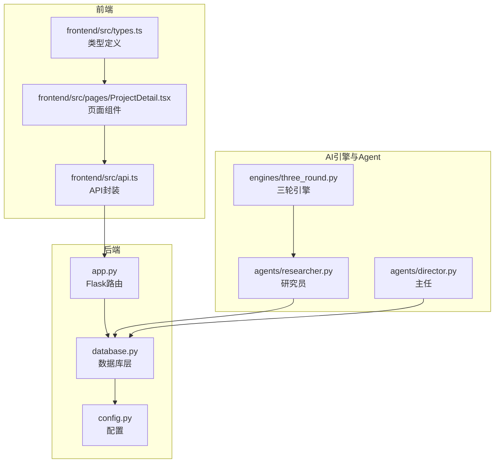
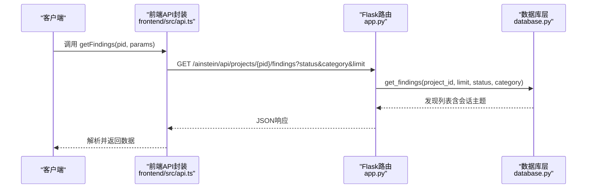
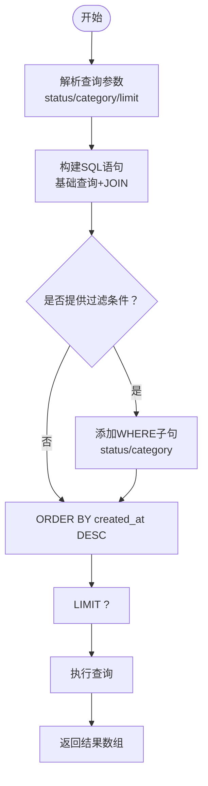
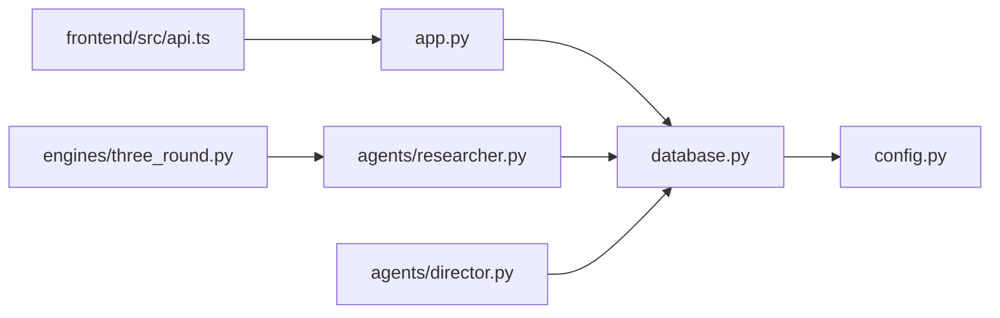
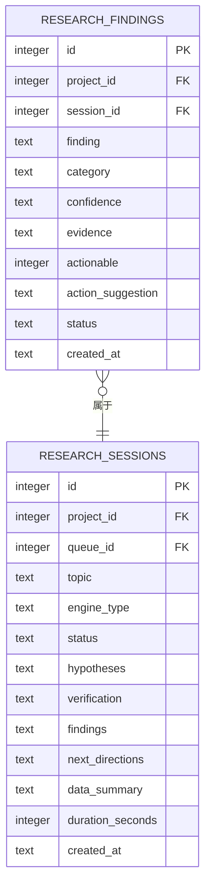

# 发现管理API

<cite>
**本文引用的文件**
- [app.py](file://app.py)
- [database.py](file://database.py)
- [frontend/src/api.ts](file://frontend/src/api.ts)
- [frontend/src/types.ts](file://frontend/src/types.ts)
- [frontend/src/pages/ProjectDetail.tsx](file://frontend/src/pages/ProjectDetail.tsx)
- [engines/three_round.py](file://engines/three_round.py)
- [agents/researcher.py](file://agents/researcher.py)
- [agents/director.py](file://agents/director.py)
- [config.py](file://config.py)
- [README.md](file://README.md)
</cite>

## 目录
1. [简介](#简介)
2. [项目结构](#项目结构)
3. [核心组件](#核心组件)
4. [架构总览](#架构总览)
5. [详细组件分析](#详细组件分析)
6. [依赖关系分析](#依赖关系分析)
7. [性能考虑](#性能考虑)
8. [故障排除指南](#故障排除指南)
9. [结论](#结论)
10. [附录](#附录)

## 简介
本文件为“发现管理API”的权威技术文档，聚焦于查询研究发现的后端接口与数据模型，详细说明查询参数、状态管理与分类体系，并提供分页查询与性能优化建议。该API用于按项目维度检索研究发现，支持按状态与分类过滤，并以时间倒序返回最新结果。

## 项目结构
后端采用Flask应用，路由集中在主应用文件；数据库层封装在独立模块中；前端通过TypeScript API模块调用后端接口；AI引擎与Agent负责生成发现并写入数据库。

图表来源
- [app.py:107-115](file://app.py#L107-L115)
- [database.py:277-290](file://database.py#L277-L290)
- [frontend/src/api.ts:22-28](file://frontend/src/api.ts#L22-L28)
- [engines/three_round.py:136-178](file://engines/three_round.py#L136-L178)
- [agents/researcher.py:82-113](file://agents/researcher.py#L82-L113)
- [agents/director.py:80-123](file://agents/director.py#L80-L123)

章节来源
- [app.py:107-115](file://app.py#L107-L115)
- [database.py:277-290](file://database.py#L277-L290)
- [frontend/src/api.ts:22-28](file://frontend/src/api.ts#L22-L28)
- [engines/three_round.py:136-178](file://engines/three_round.py#L136-L178)
- [agents/researcher.py:82-113](file://agents/researcher.py#L82-L113)
- [agents/director.py:80-123](file://agents/director.py#L80-L123)

## 核心组件
- 发现查询接口：GET /ainstein/api/projects/{pid}/findings
- 查询参数：
  - status：按状态过滤（可选）
  - category：按分类过滤（可选）
  - limit：返回条数限制（默认50）
- 返回字段：包含发现详情及所属会话主题
- 状态管理：open（待审核）、validated（已验证）、rejected（已拒绝）
- 分类体系：字符串类别（如 general），由AI引擎生成
- 性能要点：基于时间倒序与索引优化

章节来源
- [app.py:109-114](file://app.py#L109-L114)
- [database.py:277-290](file://database.py#L277-L290)
- [frontend/src/api.ts:22-28](file://frontend/src/api.ts#L22-L28)
- [frontend/src/types.ts:46-59](file://frontend/src/types.ts#L46-L59)

## 架构总览
发现查询从HTTP请求进入Flask路由，经数据库层查询，返回JSON响应。前端通过API封装统一发起请求，页面组件渲染过滤与展示逻辑。

图表来源
- [frontend/src/api.ts:22-28](file://frontend/src/api.ts#L22-L28)
- [app.py:109-114](file://app.py#L109-L114)
- [database.py:277-290](file://database.py#L277-L290)

## 详细组件分析

### 发现查询接口
- 路径：GET /ainstein/api/projects/{pid}/findings
- 请求参数：
  - status：字符串，过滤状态（如 open、validated、rejected）
  - category：字符串，过滤分类（如 general）
  - limit：整数，默认50，最大返回条数
- 响应：数组，每项包含发现详情与所属会话主题
- 排序：按创建时间倒序
- 实现要点：
  - 路由解析参数并调用数据库查询
  - 数据库拼接SQL，支持动态WHERE条件
  - 返回时附加会话主题字段

章节来源
- [app.py:109-114](file://app.py#L109-L114)
- [database.py:277-290](file://database.py#L277-L290)

### 数据模型与状态管理
- 表结构：research_findings
  - 字段概览：id、project_id、session_id、finding、category、confidence、evidence、actionable、action_suggestion、status、created_at
  - 关键约束：外键关联项目与会话
- 状态值：
  - open：待审核（默认）
  - validated：已验证
  - rejected：已拒绝
- 分类值：
  - 字符串类别（如 general），由AI引擎生成
- 置信度：
  - 字符串（如 high、medium、low），由AI引擎生成
- 行动性：
  - 整数（0/1），表示是否可采取行动

章节来源
- [database.py:57-69](file://database.py#L57-L69)
- [database.py:277-290](file://database.py#L277-L290)
- [engines/three_round.py:153-154](file://engines/three_round.py#L153-L154)
- [agents/researcher.py:82-92](file://agents/researcher.py#L82-L92)
- [agents/director.py:88-91](file://agents/director.py#L88-L91)

### 查询流程与算法
- SQL构建：
  - 基础查询：从 research_findings JOIN research_sessions 获取会话主题
  - 动态过滤：根据 status 与 category 添加 WHERE 条件
  - 排序与限制：按 created_at 倒序，LIMIT 指定数量
- 参数处理：
  - status 与 category 为空则忽略对应过滤
  - limit 默认50，确保安全上限

图表来源
- [database.py:277-290](file://database.py#L277-L290)

### 前端集成与示例
- 前端API封装：
  - getFindings(pid, params?)：组装查询字符串并发起请求
  - 默认limit=50，可传入status与category进行过滤
- 页面组件：
  - 支持状态按钮切换（全部/待审核/已验证/已拒绝）
  - 渲染置信度徽章、分类标签、会话主题等信息

章节来源
- [frontend/src/api.ts:22-28](file://frontend/src/api.ts#L22-L28)
- [frontend/src/pages/ProjectDetail.tsx:63-105](file://frontend/src/pages/ProjectDetail.tsx#L63-L105)
- [frontend/src/types.ts:46-59](file://frontend/src/types.ts#L46-L59)

### 状态变更与工作流
- AI生成阶段：
  - 三轮引擎输出 findings，研究员写入数据库（默认状态 open）
- 审核阶段：
  - 主任对 open 的发现进行验证/拒绝，更新状态为 validated 或 rejected
- 统计指标：
  - 项目统计包含 findings_validated（已验证数量）

章节来源
- [engines/three_round.py:153-154](file://engines/three_round.py#L153-L154)
- [agents/researcher.py:82-92](file://agents/researcher.py#L82-L92)
- [agents/director.py:88-91](file://agents/director.py#L88-L91)
- [database.py:153-156](file://database.py#L153-L156)

## 依赖关系分析
- 路由依赖数据库层：查询接口直接调用数据库查询函数
- 数据库依赖配置：DB_PATH来自环境变量
- 前端依赖后端接口：API封装统一调用
- AI引擎与Agent依赖数据库：写入发现与更新状态

图表来源
- [app.py:109-114](file://app.py#L109-L114)
- [database.py:277-290](file://database.py#L277-L290)
- [config.py:4](file://config.py#L4)
- [frontend/src/api.ts:22-28](file://frontend/src/api.ts#L22-L28)
- [agents/researcher.py:82-92](file://agents/researcher.py#L82-L92)
- [agents/director.py:88-91](file://agents/director.py#L88-L91)
- [engines/three_round.py:153-154](file://engines/three_round.py#L153-L154)

## 性能考虑
- 索引优化：
  - research_findings 表按 project_id 与 created_at 建有索引，有利于按项目与时间排序查询
- 查询优化：
  - 使用 LIMIT 控制返回量，避免一次性拉取过多数据
  - 动态WHERE仅在提供参数时生效，减少不必要的过滤
- 前端分页建议：
  - 结合 limit 与客户端滚动加载策略，提升交互体验
- 数据库配置：
  - WAL模式与外键开启，保证并发与一致性

章节来源
- [database.py:94](file://database.py#L94)
- [database.py:277-290](file://database.py#L277-L290)
- [config.py:4](file://config.py#L4)

## 故障排除指南
- 常见错误与处理：
  - 参数非法：检查 status 与 category 是否符合预期枚举值
  - 项目不存在：确认 pid 是否有效
  - 数据库连接失败：检查 DB_PATH 环境变量与文件权限
- 日志定位：
  - 后端日志记录初始化与请求处理过程
  - 前端请求封装会在非OK状态抛出错误，便于捕获与提示

章节来源
- [app.py:15-19](file://app.py#L15-L19)
- [frontend/src/api.ts:3-7](file://frontend/src/api.ts#L3-L7)

## 结论
发现管理API提供了按项目维度查询研究发现的能力，具备灵活的状态与分类过滤、时间倒序与数量限制等特性。结合数据库索引与前端分页策略，可在大数据量场景下保持良好性能。状态与分类体系由AI引擎生成并在主任审核环节完善，形成闭环的质量管理流程。

## 附录

### API定义
- 方法与路径
  - GET /ainstein/api/projects/{pid}/findings
- 查询参数
  - status：字符串，可选
  - category：字符串，可选
  - limit：整数，默认50，可选
- 响应字段
  - 包含发现详情与会话主题（session_topic）
- 示例
  - 获取最新50条发现：GET /ainstein/api/projects/1/findings?limit=50
  - 按状态过滤：GET /ainstein/api/projects/1/findings?status=open&limit=50
  - 按分类过滤：GET /ainstein/api/projects/1/findings?category=general&limit=50
  - 组合过滤：GET /ainstein/api/projects/1/findings?status=validated&category=general&limit=50

章节来源
- [app.py:109-114](file://app.py#L109-L114)
- [database.py:277-290](file://database.py#L277-L290)
- [frontend/src/api.ts:22-28](file://frontend/src/api.ts#L22-L28)

### 数据模型图

图表来源
- [database.py:57-69](file://database.py#L57-L69)
- [database.py:41-55](file://database.py#L41-L55)