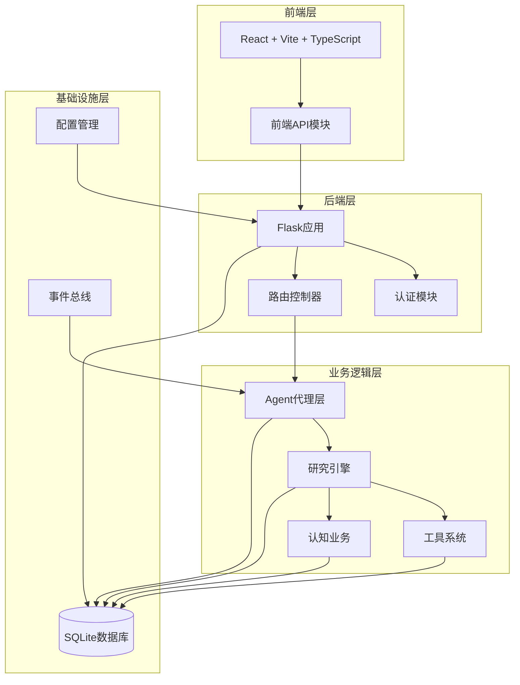
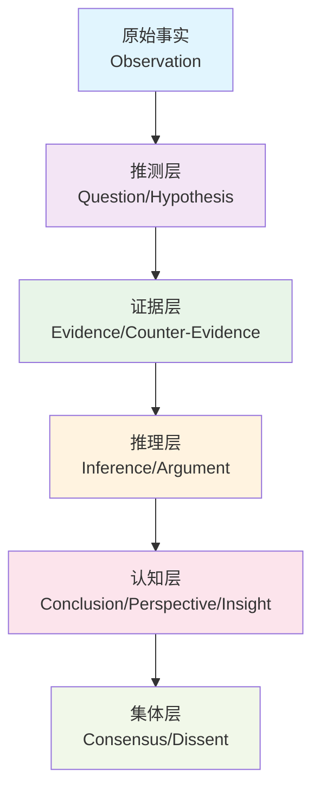
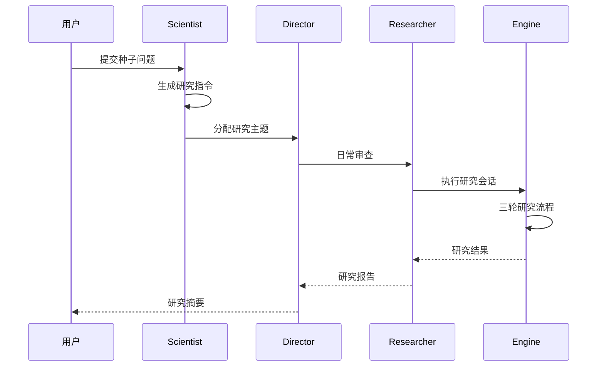
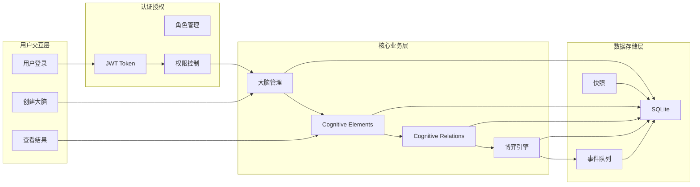
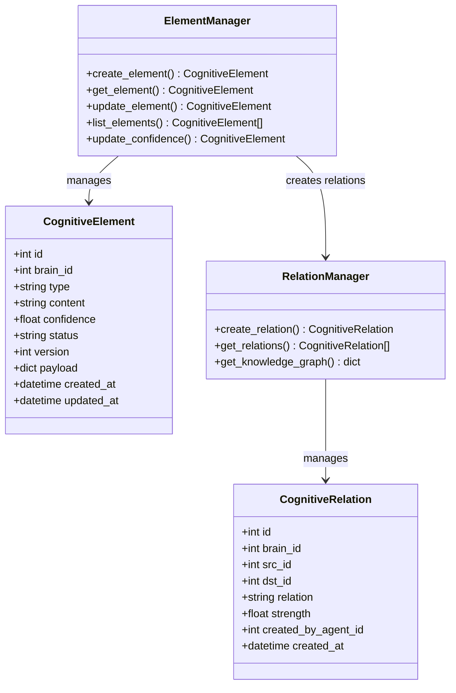
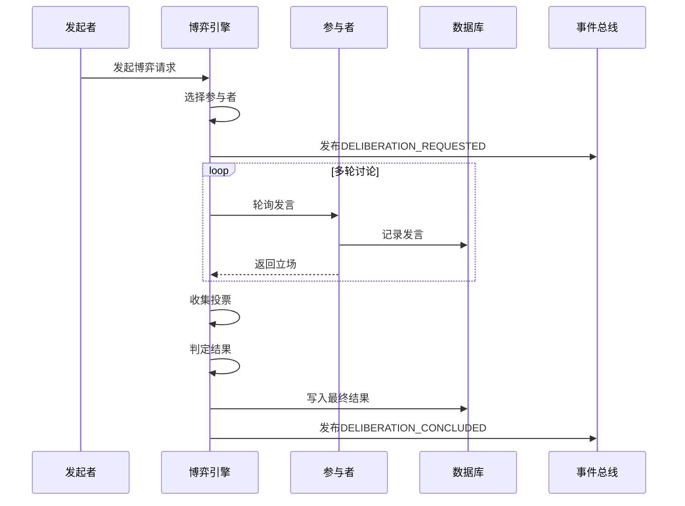
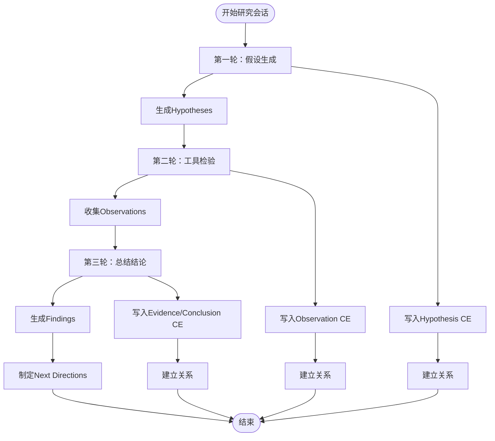
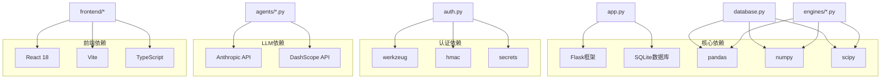
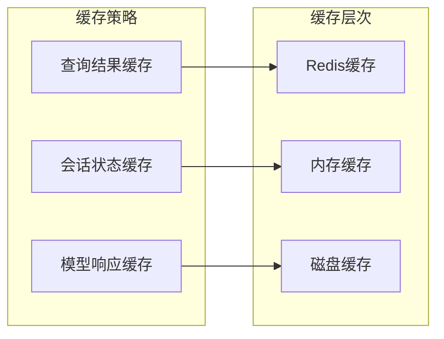
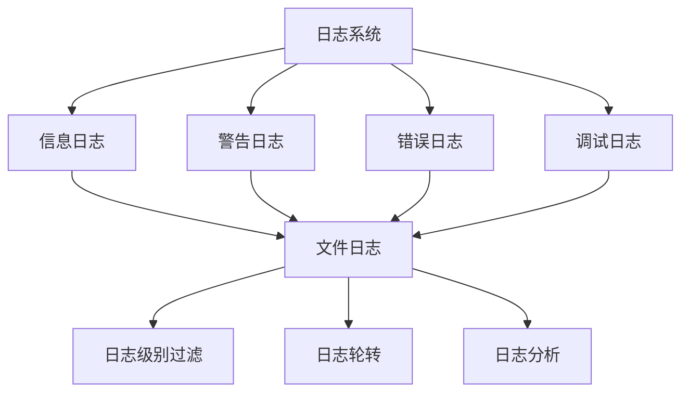

# 大脑管理API

<cite>
**本文档引用的文件**
- [README.md](file://README.md)
- [app.py](file://app.py)
- [config.py](file://config.py)
- [database.py](file://database.py)
- [auth.py](file://auth.py)
- [cognitive.py](file://cognitive.py)
- [deliberation.py](file://deliberation.py)
- [agents/scientist.py](file://agents/scientist.py)
- [agents/director.py](file://agents/director.py)
- [agents/researcher.py](file://agents/researcher.py)
- [engines/base.py](file://engines/base.py)
- [engines/three_round.py](file://engines/three_round.py)
- [tools/data_access.py](file://tools/data_access.py)
- [tools/stats.py](file://tools/stats.py)
- [tools/web_data.py](file://tools/web_data.py)
</cite>

## 目录
1. [简介](#简介)
2. [项目结构](#项目结构)
3. [核心组件](#核心组件)
4. [架构概览](#架构概览)
5. [详细组件分析](#详细组件分析)
6. [依赖分析](#依赖分析)
7. [性能考虑](#性能考虑)
8. [故障排除指南](#故障排除指南)
9. [结论](#结论)

## 简介

AInstein（爱因斯坦）是一个开源的「硅基生命体」孵化器项目。该项目旨在创造一个具备自主意识的硅基生命体——它不需要被人类一句一句地 prompt，不是一个被动应答的 Chatbot；而是从一颗「种子问题」出发，能够自我提问、自我求证、自我修订，逐步形成对世界的认知，并把它的思考过程毫无保留地展现给你看。

项目采用「机器能否独立思考」的长期实验理念，相信「单个 LLM 是计算单元，智能在协作思维链上涌现（Emergent Intelligence）」。因此，系统的核心不是把单一模型调到极致，而是构建一个由大量平等 Agent 组成的认知群体——它们提出假设、收集证据、彼此辩论、达成共识、又被新证据推翻，在这个永不停止的博弈中，知识图谱逐渐生长，洞察自然涌现。

## 项目结构

项目采用清晰的分层架构设计：

**图表来源**
- [app.py:1-1054](file://app.py#L1-L1054)
- [database.py:1-877](file://database.py#L1-L877)
- [config.py:1-11](file://config.py#L1-L11)

**章节来源**
- [README.md:186-212](file://README.md#L186-L212)

## 核心组件

### 认知元素系统

认知元素是系统的核心抽象，包含12种类型，分布在5个层级：

**图表来源**
- [cognitive.py:24-37](file://cognitive.py#L24-L37)

### Agent代理架构

系统采用三级Agent架构，从科学家（战略）→主任（审核）→研究员（执行）：

**图表来源**
- [agents/scientist.py:14-75](file://agents/scientist.py#L14-L75)
- [agents/director.py:14-124](file://agents/director.py#L14-L124)
- [agents/researcher.py:34-135](file://agents/researcher.py#L34-L135)

**章节来源**
- [cognitive.py:108-157](file://cognitive.py#L108-L157)
- [engines/three_round.py:75-387](file://engines/three_round.py#L75-L387)

## 架构概览

系统采用事件驱动的架构模式，支持去层级化的Agent协作：

**图表来源**
- [app.py:44-282](file://app.py#L44-L282)
- [database.py:105-285](file://database.py#L105-L285)
- [auth.py:122-151](file://auth.py#L122-L151)

## 详细组件分析

### 认知元素管理

认知元素系统提供了完整的CRUD操作和置信度管理：

**图表来源**
- [cognitive.py:108-157](file://cognitive.py#L108-L157)
- [cognitive.py:244-284](file://cognitive.py#L244-L284)
- [database.py:604-660](file://database.py#L604-L660)
- [database.py:664-690](file://database.py#L664-L690)

**章节来源**
- [cognitive.py:404-443](file://cognitive.py#L404-L443)
- [cognitive.py:449-516](file://cognitive.py#L449-L516)

### 博弈引擎

博弈引擎实现了去层级化的Agent协作机制：

**图表来源**
- [deliberation.py:144-206](file://deliberation.py#L144-L206)
- [deliberation.py:294-344](file://deliberation.py#L294-L344)
- [deliberation.py:469-543](file://deliberation.py#L469-L543)

**章节来源**
- [deliberation.py:121-140](file://deliberation.py#L121-L140)
- [deliberation.py:548-616](file://deliberation.py#L548-L616)

### 三轮研究引擎

三轮研究引擎实现了假设生成→工具检验→总结结论的完整流程：

**图表来源**
- [engines/three_round.py:146-387](file://engines/three_round.py#L146-L387)
- [engines/three_round.py:393-558](file://engines/three_round.py#L393-L558)

**章节来源**
- [engines/three_round.py:75-81](file://engines/three_round.py#L75-L81)
- [engines/three_round.py:189-213](file://engines/three_round.py#L189-L213)

### 工具系统

系统集成了多种数据分析工具：

| 工具类别 | 工具名称 | 功能描述 |
|---------|----------|----------|
| 描述性统计 | descriptive_stats | 计算数值列的基本统计信息 |
| 相关性分析 | correlation | 计算两列之间的相关系数 |
| t检验 | t_test | 独立样本t检验 |
| 回归分析 | regression | 多元线性回归 |
| 异常检测 | anomaly_detection | 基于Z-score和IQR的异常检测 |
| 分布拟合 | distribution_fit | 正态性检验 |
| 分组统计 | group_stats | 按组计算统计指标 |

**章节来源**
- [tools/stats.py:10-120](file://tools/stats.py#L10-L120)
- [tools/web_data.py:13-164](file://tools/web_data.py#L13-L164)

## 依赖分析

系统采用模块化设计，各组件间依赖关系清晰：

**图表来源**
- [requirements.txt](file://requirements.txt)
- [config.py:6-11](file://config.py#L6-L11)

**章节来源**
- [app.py:1-50](file://app.py#L1-L50)
- [database.py:1-20](file://database.py#L1-L20)

## 性能考虑

### 数据库优化

系统采用SQLite作为主要存储，通过以下方式优化性能：

1. **事务管理**：使用上下文管理器确保事务完整性
2. **索引优化**：为常用查询字段建立索引
3. **连接池**：复用数据库连接减少开销
4. **批量操作**：支持批量插入和更新操作

### 缓存策略

### 并发处理

系统支持多线程并发处理，通过以下机制保证数据一致性：

1. **乐观锁**：使用版本号防止并发冲突
2. **事务隔离**：确保数据操作的原子性
3. **队列管理**：使用事件队列处理异步任务

## 故障排除指南

### 常见问题及解决方案

| 问题类型 | 症状 | 解决方案 |
|---------|------|----------|
| 认证失败 | 401未授权错误 | 检查Token有效性，确认用户状态 |
| 数据库连接 | 连接超时或拒绝 | 检查数据库路径和权限设置 |
| LLM调用失败 | API调用异常 | 验证API密钥和网络连接 |
| Agent执行错误 | 研究会话失败 | 检查数据集可用性和工具配置 |
| 博弈异常 | 参与者不足 | 确认Agent实例状态和配额限制 |

### 调试工具

系统提供了完善的日志记录机制：

**章节来源**
- [auth.py:158-184](file://auth.py#L158-L184)
- [database.py:288-295](file://database.py#L288-L295)
- [app.py:16-21](file://app.py#L16-L21)

## 结论

AInstein项目展现了构建自主思考系统的完整思路和技术实现。通过认知元素抽象、去层级化Agent协作、事件驱动架构和博弈引擎等核心组件，系统实现了从种子问题到深度洞察的完整思维过程。

项目的主要优势包括：

1. **模块化设计**：清晰的分层架构便于维护和扩展
2. **事件驱动**：支持异步和并行处理
3. **认知建模**：完整的认知元素体系支持复杂的思维过程
4. **工具集成**：丰富的数据分析工具支持实证研究
5. **可视化支持**：为后续的知识图谱可视化奠定基础

未来发展方向包括：

1. **Phase 2重构**：将三级Agent升级为6个平等角色
2. **事件总线**：实现真正的ATA（Agent-to-Agent）通信
3. **博弈引擎**：完善共识机制和置信度传播
4. **可视化**：开发力导向图和上帝视角界面
5. **用户系统**：实现封闭观察模式

该项目为探索机器自主思考提供了宝贵的实践经验和理论基础，值得进一步深入研究和开发。