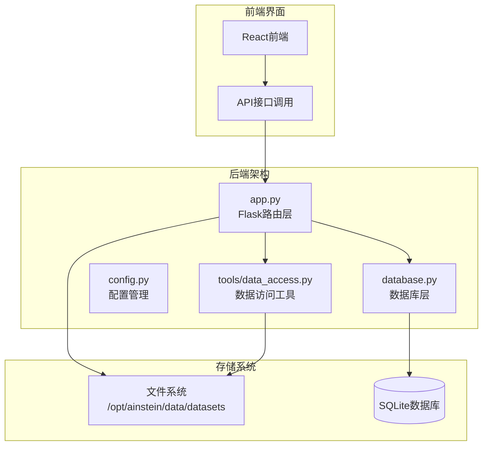
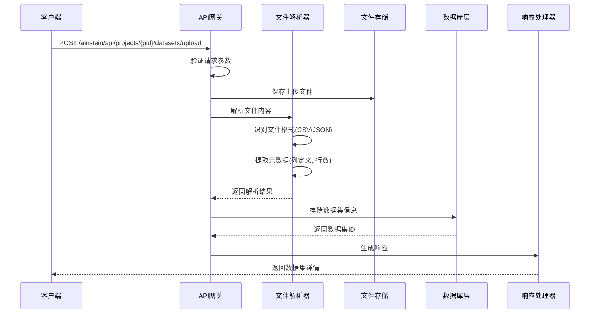
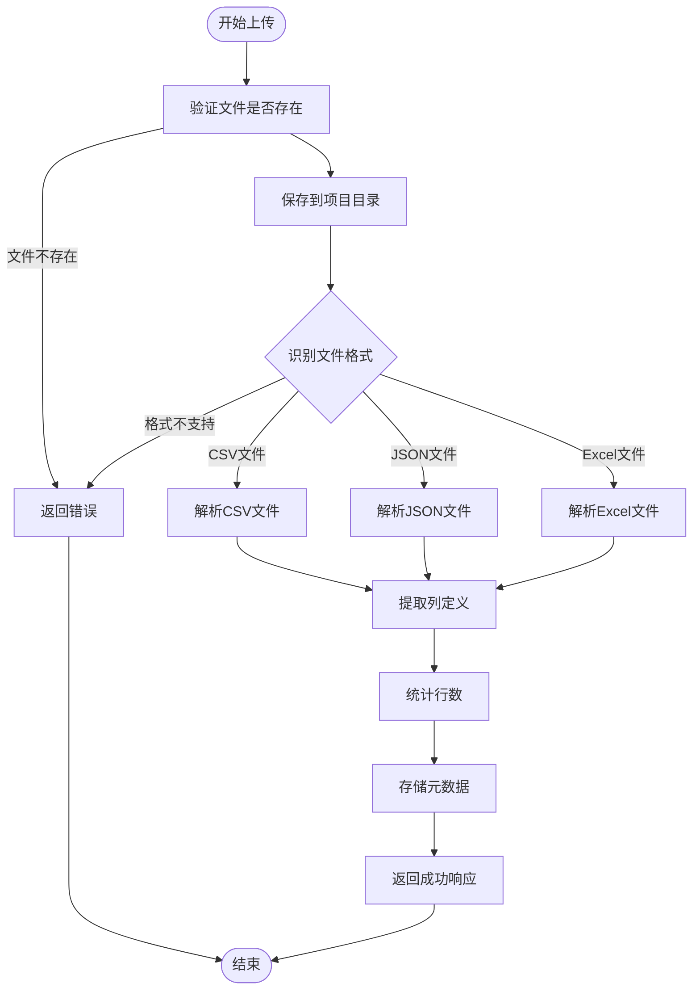
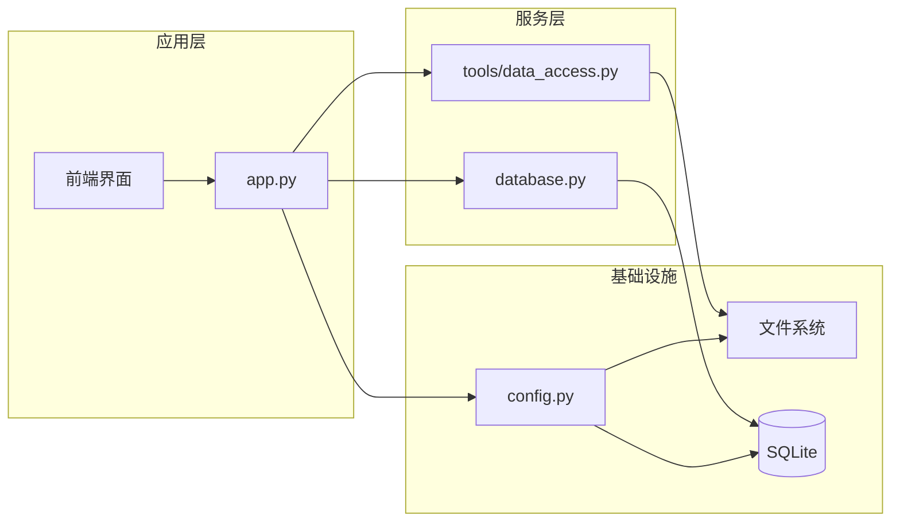

# 数据集管理API

<cite>
**本文档引用的文件**
- [app.py](file://app.py)
- [database.py](file://database.py)
- [config.py](file://config.py)
- [tools/data_access.py](file://tools/data_access.py)
- [README.md](file://README.md)
</cite>

## 目录
1. [简介](#简介)
2. [项目结构](#项目结构)
3. [核心组件](#核心组件)
4. [架构概览](#架构概览)
5. [详细组件分析](#详细组件分析)
6. [依赖关系分析](#依赖关系分析)
7. [性能考虑](#性能考虑)
8. [故障排除指南](#故障排除指南)
9. [结论](#结论)

## 简介

数据集管理API是AInstein平台的核心功能模块，负责管理项目中的数据集资源。该API提供了完整的数据集生命周期管理能力，包括数据集列表查询、文件上传、元数据解析和存储管理等功能。系统支持CSV和JSON格式的数据文件，能够自动解析文件结构并提取元数据信息。

AInstein是一个通用AI深度研究平台，通过三级AI团队（科学家→主任→研究员）实现数据驱动的深度研究，支持7种统计工具和外部数据源集成。

## 项目结构

AInstein项目采用模块化架构设计，数据集管理功能主要分布在以下核心文件中：

**图表来源**
- [app.py:1-182](file://app.py#L1-L182)
- [database.py:1-344](file://database.py#L1-L344)
- [config.py:1-11](file://config.py#L1-L11)

**章节来源**
- [README.md:94-124](file://README.md#L94-L124)
- [app.py:1-182](file://app.py#L1-L182)

## 核心组件

### 数据集表结构

数据集信息存储在SQLite数据库的`datasets`表中，包含以下核心字段：

| 字段名 | 类型 | 描述 | 约束 |
|--------|------|------|------|
| id | INTEGER | 数据集唯一标识符 | 主键, 自增 |
| project_id | INTEGER | 所属项目ID | 外键, NOT NULL |
| name | TEXT | 文件名称 | NOT NULL |
| source | TEXT | 数据源类型 | NOT NULL |
| file_path | TEXT | 文件存储路径 | |
| schema_json | TEXT | 列定义元数据 | |
| row_count | INTEGER | 行数统计 | 默认0 |
| status | TEXT | 状态标记 | 默认'ready' |
| created_at | TEXT | 创建时间 | 默认当前时间 |

### 配置管理

系统通过环境变量进行配置管理，主要配置项包括：

- `AINSTEIN_DB`: SQLite数据库文件路径，默认`/opt/ainstein/data/ainstein.db`
- `DATA_DIR`: 数据文件存储根目录，默认`/opt/ainstein/data/datasets`
- `DASHSCOPE_API_KEY`: LLM API密钥
- `DASHSCOPE_BASE_URL`: LLM基础URL

**章节来源**
- [database.py:80-98](file://database.py#L80-L98)
- [config.py:4-11](file://config.py#L4-L11)

## 架构概览

数据集管理API采用分层架构设计，实现了清晰的关注点分离：

**图表来源**
- [app.py:119-152](file://app.py#L119-L152)
- [database.py:324-330](file://database.py#L324-L330)

## 详细组件分析

### 数据集列表查询接口

#### 接口定义
- **方法**: GET
- **路径**: `/ainstein/api/projects/{pid}/datasets`
- **功能**: 获取指定项目的所有数据集列表

#### 请求参数
- `pid` (路径参数): 项目ID，整数类型

#### 响应格式
成功时返回JSON数组，每个元素包含：
- `id`: 数据集ID
- `name`: 文件名称
- `source`: 数据源类型
- `file_path`: 文件存储路径
- `schema_json`: 列定义元数据(JSON字符串)
- `row_count`: 行数统计
- `status`: 状态标记
- `created_at`: 创建时间

#### 错误处理
- 404: 项目不存在
- 500: 数据库查询失败

**章节来源**
- [app.py:119-121](file://app.py#L119-L121)
- [database.py:332-338](file://database.py#L332-L338)

### 数据集上传接口

#### 接口定义
- **方法**: POST
- **路径**: `/ainstein/api/projects/{pid}/datasets/upload`
- **功能**: 上传数据文件并解析元数据

#### 请求参数
- `pid` (路径参数): 项目ID，整数类型
- `file` (表单字段): 上传的文件对象

#### 支持的文件格式
- **CSV**: 标准逗号分隔值文件
- **JSON**: 结构化JSON数据文件
- **Excel**: `.xlsx` 和 `.xls` 格式文件

#### 上传流程

**图表来源**
- [app.py:123-152](file://app.py#L123-L152)
- [tools/data_access.py:10-24](file://tools/data_access.py#L10-L24)

#### 响应格式
成功时返回JSON对象：
- `id`: 新创建的数据集ID
- `schema`: 列定义数组，每个元素包含`name`和`dtype`
- `row_count`: 文件行数

#### 错误处理机制
- **400错误**: 未提供文件参数
- **404错误**: 项目不存在
- **500错误**: 文件保存或解析失败
- **警告日志**: 解析失败时记录警告信息

**章节来源**
- [app.py:123-152](file://app.py#L123-L152)
- [tools/data_access.py:10-24](file://tools/data_access.py#L10-L24)

### 数据验证与安全措施

#### 文件安全验证
- **路径验证**: 使用`os.path.join`构建安全的文件路径
- **目录隔离**: 每个项目拥有独立的存储目录
- **文件存在性检查**: 在数据访问时验证文件路径有效性

#### 数据完整性保证
- **事务处理**: 数据库操作使用SQLite事务确保一致性
- **回滚机制**: 异常情况下自动回滚数据库更改
- **WAL模式**: 启用写前日志模式提高并发性能

#### 性能优化策略
- **延迟加载**: 数据访问工具按需加载文件
- **格式检测**: 自动识别文件类型避免不必要的解析
- **缓存友好**: 元数据存储在数据库中便于快速查询

**章节来源**
- [database.py:109-122](file://database.py#L109-L122)
- [tools/data_access.py:10-24](file://tools/data_access.py#L10-L24)

## 依赖关系分析

### 组件依赖图

**图表来源**
- [app.py:1-182](file://app.py#L1-L182)
- [database.py:1-344](file://database.py#L1-L344)
- [config.py:1-11](file://config.py#L1-L11)

### 外部依赖

系统依赖以下关键库：

| 库名称 | 版本要求 | 用途 |
|--------|----------|------|
| Flask | 最新版本 | Web框架 |
| pandas | 最新版本 | 数据处理 |
| sqlite3 | Python标准库 | 数据持久化 |
| gunicorn | 生产部署 | WSGI服务器 |
| anthropic | LLM集成 | AI推理 |

**章节来源**
- [README.md:38-38](file://README.md#L38)
- [app.py:1-10](file://app.py#L1-L10)

## 性能考虑

### 存储性能优化

1. **目录结构优化**
   - 每个项目独立目录结构：`/opt/ainstein/data/datasets/{pid}/`
   - 避免大量文件在同一目录造成性能问题

2. **数据库索引策略**
   - 对`datasets.project_id`建立索引加速查询
   - 使用复合索引优化多条件查询

3. **文件访问优化**
   - 按需加载：仅在需要时解析文件内容
   - 缓存元数据：schema和row_count存储在数据库中

### 并发处理

- **线程安全**: SQLite WAL模式支持并发读取
- **异步处理**: 文件解析在后台线程执行
- **连接池**: 数据库连接自动管理

## 故障排除指南

### 常见问题及解决方案

#### 1. 文件上传失败
**症状**: 上传接口返回400错误
**原因**: 未正确设置Content-Type或缺少文件参数
**解决**: 确保使用FormData格式上传，文件字段名为`file`

#### 2. 数据库连接问题
**症状**: 查询接口返回500错误
**原因**: 数据库文件权限不足或路径配置错误
**解决**: 检查`AINSTEIN_DB`环境变量和文件权限

#### 3. 文件解析错误
**症状**: 上传成功但schema为空
**原因**: 文件格式不支持或文件损坏
**解决**: 验证文件格式和内容完整性

#### 4. 权限问题
**症状**: 文件无法保存到存储目录
**原因**: 目录权限不足
**解决**: 确保运行用户对`DATA_DIR`有写权限

### 日志诊断

系统提供详细的日志输出：
- **INFO级别**: 应用启动和基本操作日志
- **WARNING级别**: 文件解析失败等警告信息
- **ERROR级别**: 数据库连接和文件操作错误

**章节来源**
- [app.py:146-149](file://app.py#L146-L149)
- [database.py:101-106](file://database.py#L101-L106)

## 结论

数据集管理API为AInstein平台提供了完整、可靠的数据集生命周期管理能力。通过清晰的接口设计、完善的错误处理机制和安全的文件管理策略，系统能够有效支持各种数据分析场景。

主要优势包括：
- **简洁的API设计**: 清晰的RESTful接口规范
- **强大的文件处理**: 支持多种数据格式自动解析
- **安全的存储管理**: 项目隔离和权限控制
- **高性能的架构**: 优化的数据库设计和文件系统结构

未来可以考虑的功能增强：
- 文件大小限制和批量上传支持
- 数据集版本管理和历史追踪
- 更丰富的数据验证规则
- 文件压缩和归档功能