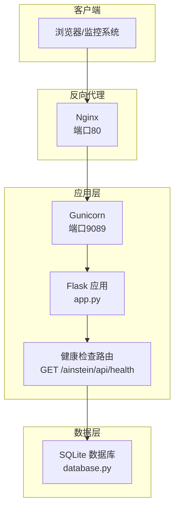
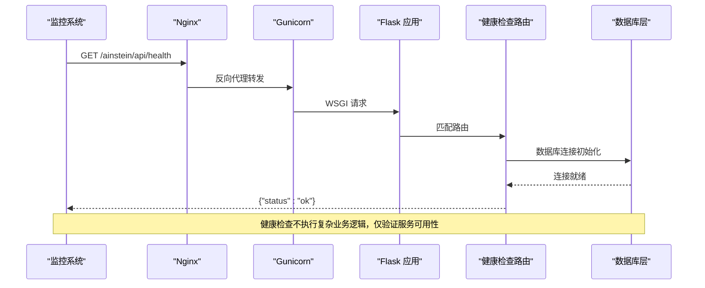
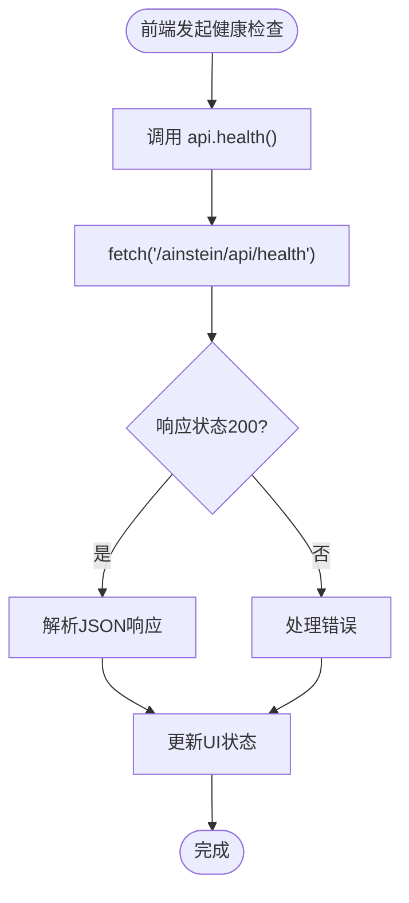
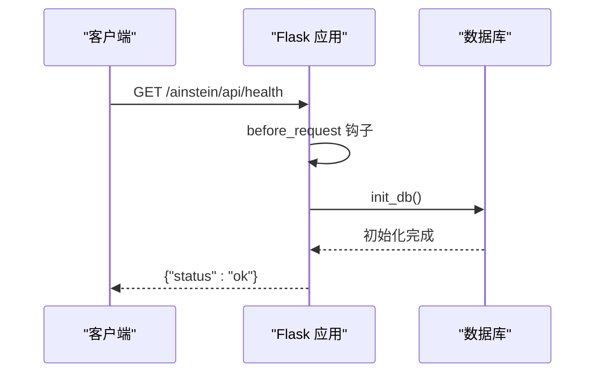
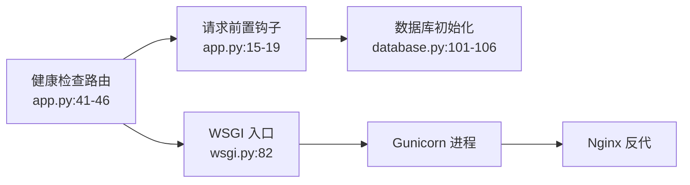

# 系统健康检查API

<cite>
**本文档引用的文件**
- [app.py](file://app.py)
- [wsgi.py](file://wsgi.py)
- [config.py](file://config.py)
- [database.py](file://database.py)
- [README.md](file://README.md)
- [docs/ops-manual.md](file://docs/ops-manual.md)
- [docs/testing.md](file://docs/testing.md)
- [frontend/src/api.ts](file://frontend/src/api.ts)
</cite>

## 目录
1. [简介](#简介)
2. [项目结构](#项目结构)
3. [核心组件](#核心组件)
4. [架构概览](#架构概览)
5. [详细组件分析](#详细组件分析)
6. [依赖关系分析](#依赖关系分析)
7. [性能考虑](#性能考虑)
8. [故障排查指南](#故障排查指南)
9. [结论](#结论)
10. [附录](#附录)

## 简介
本文件详细记录系统健康检查API（GET /ainstein/api/health）的设计与实现，包括接口用途、响应格式、最佳实践、监控集成方案以及生产环境中的可用性监控策略。该接口用于快速验证应用服务的可用性和基本运行状态，是基础设施监控与运维自动化的重要入口。

## 项目结构
AInstein采用Flask作为Web框架，通过Gunicorn进行生产部署，前端静态资源由Nginx提供。健康检查接口位于Flask应用路由中，路径为/ainstein/api/health，返回标准JSON格式的健康状态。

**图表来源**
- [app.py:41-46](file://app.py#L41-L46)
- [wsgi.py:74-83](file://wsgi.py#L74-L83)
- [docs/ops-manual.md:37-47](file://docs/ops-manual.md#L37-L47)

**章节来源**
- [README.md:71-83](file://README.md#L71-L83)
- [docs/ops-manual.md:37-47](file://docs/ops-manual.md#L37-L47)

## 核心组件
- 健康检查路由：定义于Flask应用中，处理GET请求，返回固定JSON对象{"status":"ok"}。
- 前端集成：前端API模块提供health方法，便于在UI中调用健康检查。
- 部署链路：Nginx反代至Gunicorn，再转发到Flask应用，确保健康检查可被外部监控系统访问。

**章节来源**
- [app.py:41-46](file://app.py#L41-L46)
- [frontend/src/api.ts:10](file://frontend/src/api.ts#L10)
- [docs/ops-manual.md:37-47](file://docs/ops-manual.md#L37-L47)

## 架构概览
健康检查在整个系统架构中的位置如下：

**图表来源**
- [app.py:15-19](file://app.py#L15-L19)
- [app.py:41-46](file://app.py#L41-L46)
- [database.py:101-106](file://database.py#L101-L106)

## 详细组件分析

### 健康检查接口定义
- 路径：/ainstein/api/health
- 方法：GET
- 功能：返回服务基本可用状态
- 响应体：{"status":"ok"}
- 状态码：200 OK
- 响应头：Content-Type: application/json

该接口在应用启动时自动初始化数据库连接，确保监控系统能够通过一次HTTP请求验证服务与数据库的基本连通性。

**章节来源**
- [app.py:41-46](file://app.py#L41-L46)
- [docs/testing.md:417-424](file://docs/testing.md#L417-L424)

### 前端集成方式
前端通过统一的API模块封装了健康检查调用，便于在Dashboard等页面中进行周期性探测。

**图表来源**
- [frontend/src/api.ts:10](file://frontend/src/api.ts#L10)
- [frontend/src/api.ts:3-7](file://frontend/src/api.ts#L3-L7)

**章节来源**
- [frontend/src/api.ts:10](file://frontend/src/api.ts#L10)
- [frontend/src/api.ts:3-7](file://frontend/src/api.ts#L3-L7)

### 数据库初始化与健康检查的关系
健康检查路由在请求到达前，通过before_request钩子确保数据库已初始化。这使得健康检查不仅验证Web服务，还间接验证了数据库连接的可用性。

**图表来源**
- [app.py:15-19](file://app.py#L15-L19)
- [app.py:41-46](file://app.py#L41-L46)
- [database.py:101-106](file://database.py#L101-L106)

**章节来源**
- [app.py:15-19](file://app.py#L15-L19)
- [database.py:101-106](file://database.py#L101-L106)

## 依赖关系分析
健康检查接口的依赖关系相对简单，主要涉及Flask路由、数据库初始化和WSGI部署。

**图表来源**
- [app.py:15-19](file://app.py#L15-L19)
- [app.py:41-46](file://app.py#L41-L46)
- [database.py:101-106](file://database.py#L101-L106)
- [wsgi.py:74-83](file://wsgi.py#L74-L83)

**章节来源**
- [app.py:15-19](file://app.py#L15-L19)
- [app.py:41-46](file://app.py#L41-L46)
- [database.py:101-106](file://database.py#L101-L106)
- [wsgi.py:74-83](file://wsgi.py#L74-L83)

## 性能考虑
- 响应时间：根据测试文档，健康检查的平均响应时间为约5ms，属于极轻量级操作。
- 资源消耗：仅进行数据库连接初始化，不涉及复杂业务逻辑，对CPU和内存影响极小。
- 并发处理：由于接口无状态且轻量，可承受高频探测请求。

**章节来源**
- [docs/testing.md:555](file://docs/testing.md#L555)

## 故障排查指南

### 常见失败场景
1. **服务不可达**
   - 症状：监控系统返回超时或连接拒绝
   - 排查：检查Nginx和Gunicorn进程状态，确认端口监听情况
   
2. **数据库连接失败**
   - 症状：健康检查返回非200状态码
   - 排查：检查数据库文件权限、路径配置和SQLite连接参数

3. **进程锁问题**
   - 症状：调度器相关功能异常，健康检查可能间接受影响
   - 排查：检查调度器锁文件状态和进程存在性

### 诊断方法
- 使用curl直接调用健康检查接口进行验证
- 查看系统日志定位具体错误原因
- 检查文件权限和网络连通性
- 验证环境变量配置的正确性

**章节来源**
- [docs/ops-manual.md:249-367](file://docs/ops-manual.md#L249-L367)
- [docs/testing.md:417-424](file://docs/testing.md#L417-L424)

## 结论
健康检查API作为系统可用性的基础探针，具有实现简单、响应迅速、资源占用极少的特点。它不仅满足了基本的健康监测需求，还通过数据库初始化验证了应用的核心依赖。结合运维手册中的监控建议和故障排查流程，可以在生产环境中建立可靠的可用性监控体系。

## 附录

### 生产环境监控集成示例
- **Prometheus**: 配置HTTP探测任务，定期抓取/ainstein/api/health端点
- **Zabbix**: 创建HTTP检查项，设置阈值和告警规则
- **Grafana**: 结合日志或指标数据，创建服务可用性仪表板
- **Kubernetes**: 使用livenessProbe和readinessProbe集成健康检查

### 最佳实践
- 设置合理的探测间隔（建议≥30秒）
- 配置多节点探测，避免单点误报
- 结合业务指标进行综合评估
- 建立分级告警机制
- 定期验证监控链路的有效性