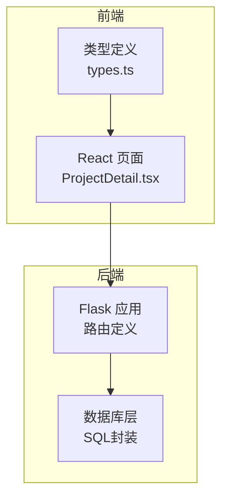
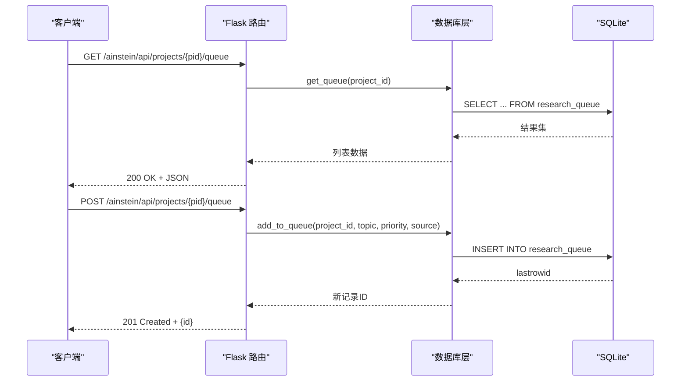
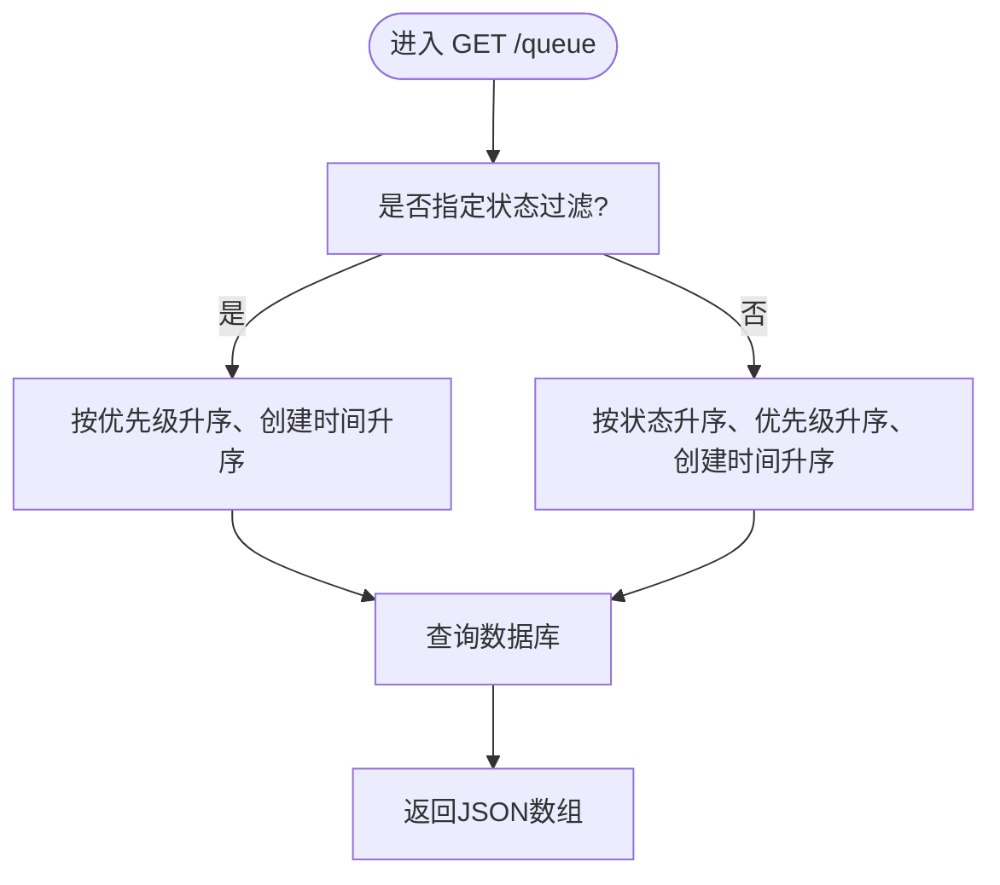
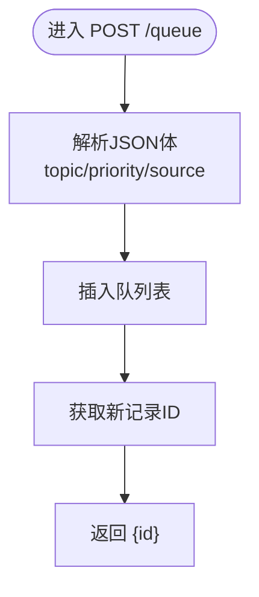
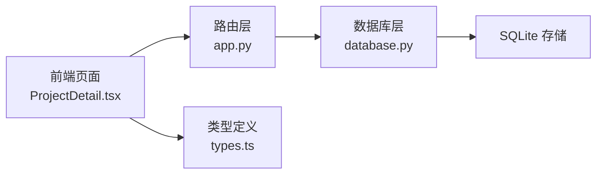

# 队列管理API

<cite>
**本文档引用的文件**
- [app.py](file://app.py)
- [database.py](file://database.py)
- [ProjectDetail.tsx](file://frontend/src/pages/ProjectDetail.tsx)
- [types.ts](file://frontend/src/types.ts)
</cite>

## 目录
1. [简介](#简介)
2. [项目结构](#项目结构)
3. [核心组件](#核心组件)
4. [架构总览](#架构总览)
5. [详细组件分析](#详细组件分析)
6. [依赖关系分析](#依赖关系分析)
7. [性能考虑](#性能考虑)
8. [故障排除指南](#故障排除指南)
9. [结论](#结论)

## 简介
本文件面向队列管理API的使用者与维护者，系统性说明“研究队列”的REST接口设计与实现细节。重点包括：
- 获取队列列表（GET /ainstein/api/projects/{pid}/queue）
- 添加队列项（POST /ainstein/api/projects/{pid}/queue）
- 队列项数据结构（topic、priority、source 字段）
- 请求与响应示例
- 排序规则与最佳实践
- 错误处理与并发访问注意事项

## 项目结构
后端采用Flask框架，路由集中在应用入口文件；数据库层封装在独立模块中；前端React页面通过类型定义与API交互。

图表来源
- [app.py:1-182](file://app.py#L1-L182)
- [database.py:1-344](file://database.py#L1-L344)
- [ProjectDetail.tsx:1-385](file://frontend/src/pages/ProjectDetail.tsx#L1-L385)
- [types.ts:1-89](file://frontend/src/types.ts#L1-L89)

章节来源
- [app.py:1-182](file://app.py#L1-L182)
- [database.py:1-344](file://database.py#L1-L344)
- [ProjectDetail.tsx:1-385](file://frontend/src/pages/ProjectDetail.tsx#L1-L385)
- [types.ts:1-89](file://frontend/src/types.ts#L1-L89)

## 核心组件
- 路由层（Flask）：提供HTTP端点，解析请求参数与JSON体，调用数据库层执行业务逻辑，并返回JSON响应。
- 数据库层（SQLite）：封装队列表的增删改查、索引与事务控制。
- 前端类型与页面：定义队列项结构，展示队列列表与交互控件。

章节来源
- [app.py:69-80](file://app.py#L69-L80)
- [database.py:190-228](file://database.py#L190-L228)
- [types.ts:21-29](file://frontend/src/types.ts#L21-L29)

## 架构总览
队列管理API遵循“路由 → 服务 → 数据库 → 存储”的分层架构，使用SQLite作为持久化存储，WAL模式提升并发读写性能。

图表来源
- [app.py:71-79](file://app.py#L71-L79)
- [database.py:192-198](file://database.py#L192-L198)
- [database.py:200-212](file://database.py#L200-L212)

## 详细组件分析

### 接口定义与行为
- 获取队列列表
  - 方法与路径：GET /ainstein/api/projects/{pid}/queue
  - 功能：返回指定项目的所有队列项，按状态、优先级、创建时间排序
  - 响应：数组，元素为队列项对象
- 添加队列项
  - 方法与路径：POST /ainstein/api/projects/{pid}/queue
  - 请求体字段：
    - topic（必填）：研究主题文本
    - priority（可选，默认5）：整数优先级，数值越小优先级越高
    - source（可选，默认"user"）：来源标识，如"user"、"scientist"、"director"、"ai_generated"
  - 响应：新建项的ID

章节来源
- [app.py:71-79](file://app.py#L71-L79)
- [database.py:192-198](file://database.py#L192-L198)
- [database.py:200-212](file://database.py#L200-L212)

### 队列项数据结构
- 字段说明
  - id：自增主键
  - project_id：所属项目ID
  - topic：研究主题
  - priority：优先级（数字越小越靠前）
  - source：来源（字符串）
  - status：状态（默认"pending"）
  - created_at：创建时间
- 类型定义（前端）
  - 参考类型定义文件中的QueueItem接口

章节来源
- [database.py:30-39](file://database.py#L30-L39)
- [types.ts:21-29](file://frontend/src/types.ts#L21-L29)

### 排序规则
- 获取队列时的排序策略
  - 若按状态过滤：优先级升序 → 创建时间升序
  - 默认排序：状态升序 → 优先级升序 → 创建时间升序
- 下一个可执行主题的选择
  - 从“待处理”状态中选择优先级最低且最早创建的项，并将其状态更新为“进行中”

章节来源
- [database.py:200-212](file://database.py#L200-L212)
- [database.py:214-223](file://database.py#L214-L223)

### 请求与响应示例
- 获取队列列表
  - 请求
    - 方法：GET
    - 路径：/ainstein/api/projects/{pid}/queue
    - 示例：GET /ainstein/api/projects/123/queue
  - 响应
    - 状态码：200
    - 示例：[{"id":1,"project_id":123,"topic":"主题A","priority":5,"source":"user","status":"pending","created_at":"2025-01-01T00:00:00"}]
- 添加队列项
  - 请求
    - 方法：POST
    - 路径：/ainstein/api/projects/{pid}/queue
    - 头部：Content-Type: application/json
    - 示例体：
      - {"topic":"机器学习在金融风控中的应用"}
      - {"topic":"基于图神经网络的推荐算法研究","priority":3,"source":"scientist"}
  - 响应
    - 状态码：201
    - 示例：{"id":456}

章节来源
- [app.py:71-79](file://app.py#L71-L79)
- [database.py:192-198](file://database.py#L192-L198)

### 前端集成要点
- 前端页面提供队列标签页，支持输入主题与选择优先级，提交后刷新列表
- 前端类型定义确保与后端字段一致

章节来源
- [ProjectDetail.tsx:211-259](file://frontend/src/pages/ProjectDetail.tsx#L211-L259)
- [types.ts:21-29](file://frontend/src/types.ts#L21-L29)

### 关键流程图：获取队列与添加队列

#### 获取队列流程

图表来源
- [database.py:200-212](file://database.py#L200-L212)

#### 添加队列流程

图表来源
- [app.py:75-79](file://app.py#L75-L79)
- [database.py:192-198](file://database.py#L192-L198)

## 依赖关系分析
- 路由依赖数据库层函数
- 数据库层依赖SQLite连接与索引
- 前端类型与页面依赖后端接口契约

图表来源
- [app.py:69-80](file://app.py#L69-L80)
- [database.py:190-228](file://database.py#L190-L228)
- [ProjectDetail.tsx:1-385](file://frontend/src/pages/ProjectDetail.tsx#L1-L385)
- [types.ts:1-89](file://frontend/src/types.ts#L1-L89)

章节来源
- [app.py:69-80](file://app.py#L69-L80)
- [database.py:190-228](file://database.py#L190-L228)
- [ProjectDetail.tsx:1-385](file://frontend/src/pages/ProjectDetail.tsx#L1-L385)
- [types.ts:1-89](file://frontend/src/types.ts#L1-L89)

## 性能考虑
- 数据库索引
  - 队列表存在复合索引以优化按项目与状态的查询
- 排序成本
  - 排序涉及多列（状态、优先级、创建时间），建议在高并发场景下限制单次查询数量
- 并发读写
  - 使用WAL模式与外键开启，提升并发读取能力；写入操作自动事务化
- 建议
  - 在前端分页或限制列表长度
  - 合理设置优先级范围（如1-10），避免过多极值导致排序不均衡

章节来源
- [database.py:92-97](file://database.py#L92-L97)
- [database.py:113-114](file://database.py#L113-L114)

## 故障排除指南
- 常见错误与处理
  - 缺少必要字段：POST请求缺少topic时，数据库层将抛出约束异常；建议在调用前校验
  - 无效项目ID：若项目不存在，其他端点可能返回“not found”，需先确认项目存在
  - 数据库异常：数据库层对异常进行回滚并重新抛出，确保一致性
- 并发访问注意事项
  - 多线程/多进程同时写入队列时，建议使用幂等策略或在上层做去重判断
  - 读写分离：大量读取场景下，可考虑缓存最近队列快照并在写入后异步刷新
- 前端调试
  - 检查请求头Content-Type是否为application/json
  - 确认pid有效且与当前用户权限匹配

章节来源
- [app.py:63-66](file://app.py#L63-L66)
- [database.py:118-121](file://database.py#L118-L121)

## 结论
队列管理API以简洁的REST接口实现了研究主题的收集与调度，配合明确的排序规则与状态机，能够支撑从人工输入到AI生成的多种来源。建议在生产环境中结合索引、分页与并发控制，确保高可用与高性能。