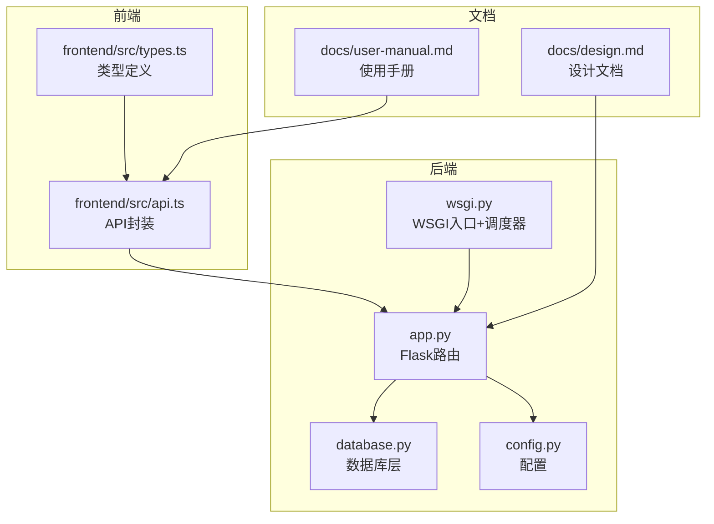
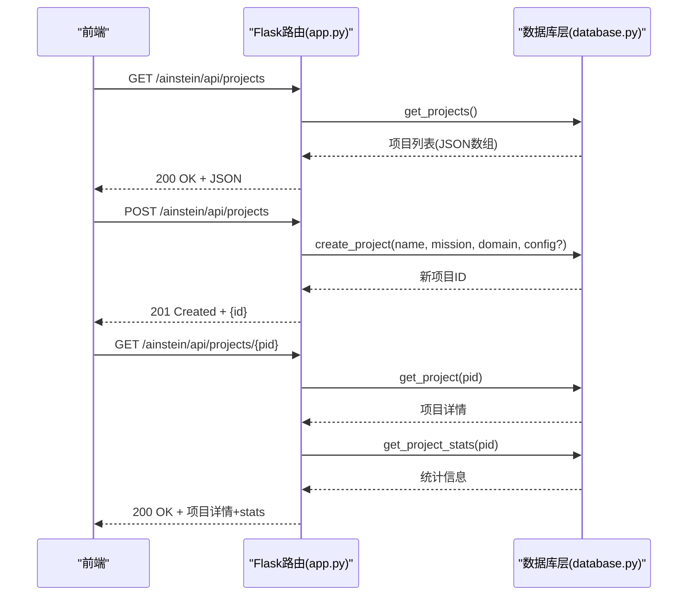
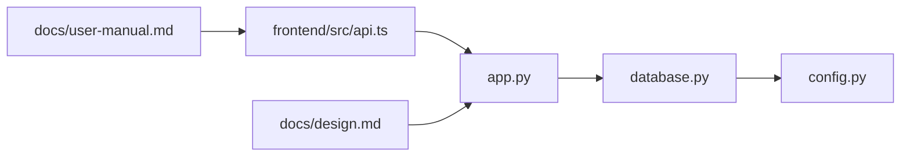

# 项目管理API

<cite>
**本文引用的文件**
- [app.py](file://app.py)
- [database.py](file://database.py)
- [config.py](file://config.py)
- [wsgi.py](file://wsgi.py)
- [frontend/src/api.ts](file://frontend/src/api.ts)
- [frontend/src/types.ts](file://frontend/src/types.ts)
- [docs/design.md](file://docs/design.md)
- [docs/user-manual.md](file://docs/user-manual.md)
</cite>

## 目录
1. [简介](#简介)
2. [项目结构](#项目结构)
3. [核心组件](#核心组件)
4. [架构总览](#架构总览)
5. [详细组件分析](#详细组件分析)
6. [依赖关系分析](#依赖关系分析)
7. [性能考量](#性能考量)
8. [故障排查指南](#故障排查指南)
9. [结论](#结论)
10. [附录](#附录)

## 简介
本文件面向项目管理API，聚焦于项目CRUD操作的完整接口说明，包括：
- 获取项目列表：GET /ainstein/api/projects
- 创建项目：POST /ainstein/api/projects
- 获取单个项目：GET /ainstein/api/projects/<int:pid>

文档涵盖请求参数、响应格式、状态码含义、数据模型字段说明、典型请求/响应示例、错误处理机制与常见问题解决方案，并结合前端API封装与数据库层实现进行深入解析。

## 项目结构
后端采用Flask应用，路由集中在app.py；数据库层在database.py中定义；配置在config.py中；WSGI入口与调度器在wsgi.py中；前端API封装位于frontend/src/api.ts，类型定义在frontend/src/types.ts；设计与使用手册在docs目录中。

图表来源
- [app.py:1-182](file://app.py#L1-L182)
- [database.py:1-344](file://database.py#L1-L344)
- [config.py:1-11](file://config.py#L1-L11)
- [wsgi.py:1-83](file://wsgi.py#L1-L83)
- [frontend/src/api.ts:1-45](file://frontend/src/api.ts#L1-L45)
- [frontend/src/types.ts:1-89](file://frontend/src/types.ts#L1-L89)
- [docs/design.md:1-369](file://docs/design.md#L1-L369)
- [docs/user-manual.md:1-310](file://docs/user-manual.md#L1-L310)

章节来源
- [app.py:1-182](file://app.py#L1-L182)
- [database.py:1-344](file://database.py#L1-L344)
- [config.py:1-11](file://config.py#L1-L11)
- [wsgi.py:1-83](file://wsgi.py#L1-L83)
- [frontend/src/api.ts:1-45](file://frontend/src/api.ts#L1-L45)
- [frontend/src/types.ts:1-89](file://frontend/src/types.ts#L1-L89)
- [docs/design.md:1-369](file://docs/design.md#L1-L369)
- [docs/user-manual.md:1-310](file://docs/user-manual.md#L1-L310)

## 核心组件
- Flask路由层：负责HTTP请求处理、参数解析、响应返回与错误码设置。
- 数据库层：负责项目CRUD、统计聚合、队列与会话关联等数据访问。
- 配置层：集中管理数据库路径、数据目录、模型与API密钥等。
- 前端API封装：统一BASE路径与请求方法，便于前端调用。

章节来源
- [app.py:48-67](file://app.py#L48-L67)
- [database.py:125-168](file://database.py#L125-L168)
- [config.py:1-11](file://config.py#L1-L11)
- [frontend/src/api.ts:1-45](file://frontend/src/api.ts#L1-L45)

## 架构总览
项目管理API的调用链路如下：
- 前端通过/api/projects发起请求
- Flask路由接收请求，调用数据库层执行CRUD
- 数据库层返回结构化数据，Flask封装为JSON响应
- 前端根据响应状态码与内容进行UI更新

图表来源
- [app.py:50-66](file://app.py#L50-L66)
- [database.py:135-168](file://database.py#L135-L168)

## 详细组件分析

### 项目数据模型与字段说明
- projects表字段（部分关键字段）
  - id：自增主键
  - name：项目名称（唯一）
  - mission：研究使命
  - domain：领域标签
  - config_json：项目配置（JSON字符串，默认空对象）
  - status：状态（默认active）
  - created_at：创建时间

- 统计信息字段（由get_project_stats聚合）
  - sessions_total：会话总数
  - sessions_completed：已完成会话数
  - findings_total：发现总数
  - findings_actionable：可执行发现数
  - findings_validated：已验证发现数
  - queue_pending：待研究队列数

章节来源
- [database.py:10-98](file://database.py#L10-L98)
- [database.py:147-168](file://database.py#L147-L168)
- [docs/design.md:91-103](file://docs/design.md#L91-L103)

### 接口定义与行为

#### 获取项目列表
- 方法与路径
  - GET /ainstein/api/projects
- 请求参数
  - 无查询参数
- 响应
  - 200 OK：返回项目数组，每项包含基础字段与统计信息
- 示例
  - 请求：GET /ainstein/api/projects
  - 响应：200 OK，数组元素形如
    - {id, name, mission, domain, config_json, status, created_at, stats?}
- 状态码
  - 200：成功
- 错误处理
  - 无显式错误返回；若数据库异常，Flask默认返回5xx

章节来源
- [app.py:50-52](file://app.py#L50-L52)
- [database.py:135-140](file://database.py#L135-L140)

#### 创建项目
- 方法与路径
  - POST /ainstein/api/projects
- 请求体
  - Content-Type: application/json
  - 字段
    - name：字符串，必填
    - mission：字符串，必填
    - domain：字符串，必填
    - config：对象，可选（将序列化为JSON字符串存储）
- 响应
  - 201 Created：返回{id}
  - 400 Bad Request：当请求体缺失必要字段或JSON无效时
- 示例
  - 请求体：
    - {"name":"项目A","mission":"发现驱动短期回报的核心因子","domain":"量化金融","config":{"enabled_tools":["correlation","regression"]}}
  - 响应：201 Created，{"id":123}
- 状态码
  - 201：创建成功
  - 400：请求体无效或缺少字段
- 错误处理
  - 若请求体非JSON或字段缺失，Flask会返回400
  - 数据库约束冲突（如name重复）将导致400/500

章节来源
- [app.py:54-58](file://app.py#L54-L58)
- [database.py:127-133](file://database.py#L127-L133)

#### 获取单个项目
- 方法与路径
  - GET /ainstein/api/projects/<int:pid>
- 路径参数
  - pid：项目ID（整数）
- 响应
  - 200 OK：返回项目详情，并附加stats统计信息
  - 404 Not Found：当项目不存在
- 示例
  - 请求：GET /ainstein/api/projects/123
  - 响应：200 OK，包含基础字段与stats
    - {id, name, mission, domain, config_json, status, created_at, stats:{sessions_total, sessions_completed, findings_total, findings_actionable, findings_validated, queue_pending}}
  - 请求：GET /ainstein/api/projects/999
  - 响应：404 Not Found，{"error":"not found"}
- 状态码
  - 200：成功
  - 404：项目不存在
- 错误处理
  - 当get_project返回None时，返回404

章节来源
- [app.py:60-66](file://app.py#L60-L66)
- [database.py:142-145](file://database.py#L142-L145)
- [database.py:147-168](file://database.py#L147-L168)

### 前端API封装与类型定义
- 前端API封装
  - BASE路径：/ainstein/api
  - 封装方法：listProjects、createProject、getProject等
  - 错误处理：resp.ok为false时抛出错误
- 类型定义
  - Project接口包含基础字段与可选stats
  - ProjectStats包含会话与发现统计

章节来源
- [frontend/src/api.ts:1-45](file://frontend/src/api.ts#L1-L45)
- [frontend/src/types.ts:1-89](file://frontend/src/types.ts#L1-L89)

### 数据库层实现要点
- create_project
  - 将config序列化为JSON字符串存储
  - 返回最后插入ID
- get_projects
  - 按status过滤（默认active），按created_at倒序
- get_project
  - 按id查询，返回字典
- get_project_stats
  - 聚合计数与计数条件，返回结构化统计

章节来源
- [database.py:127-133](file://database.py#L127-L133)
- [database.py:135-140](file://database.py#L135-L140)
- [database.py:142-145](file://database.py#L142-L145)
- [database.py:147-168](file://database.py#L147-L168)

## 依赖关系分析
- app.py依赖database.py进行数据访问
- database.py依赖config.py中的DB_PATH
- 前端API封装依赖后端路由约定的BASE路径
- 设计文档与使用手册为API行为提供规范依据

图表来源
- [app.py:1-10](file://app.py#L1-L10)
- [database.py:1-10](file://database.py#L1-L10)
- [config.py:1-11](file://config.py#L1-L11)
- [frontend/src/api.ts:1-7](file://frontend/src/api.ts#L1-L7)
- [docs/design.md:1-10](file://docs/design.md#L1-L10)
- [docs/user-manual.md:1-10](file://docs/user-manual.md#L1-L10)

章节来源
- [app.py:1-10](file://app.py#L1-L10)
- [database.py:1-10](file://database.py#L1-L10)
- [config.py:1-11](file://config.py#L1-L11)
- [frontend/src/api.ts:1-7](file://frontend/src/api.ts#L1-L7)
- [docs/design.md:1-10](file://docs/design.md#L1-L10)
- [docs/user-manual.md:1-10](file://docs/user-manual.md#L1-L10)

## 性能考量
- 数据库连接
  - 使用上下文管理器确保事务提交/回滚与连接关闭
  - WAL模式提升并发读写性能
- 查询索引
  - 为队列、会话、发现、记忆、数据集建立索引，加速按项目ID查询
- 前端批量请求
  - 前端在仪表盘加载时会并行获取项目列表与详情，注意后端响应延迟与限流

章节来源
- [database.py:109-123](file://database.py#L109-L123)
- [database.py:92-97](file://database.py#L92-L97)
- [frontend/src/pages/Dashboard.tsx:16-20](file://frontend/src/pages/Dashboard.tsx#L16-L20)

## 故障排查指南
- 404 Not Found
  - 现象：访问不存在的项目ID
  - 排查：确认pid是否正确；检查数据库中是否存在对应记录
- 400 Bad Request
  - 现象：POST创建项目时请求体无效或字段缺失
  - 排查：检查Content-Type与JSON格式；确保name、mission、domain存在
- 5xx Internal Server Error
  - 现象：数据库异常或路由异常
  - 排查：查看后端日志；检查数据库初始化与连接配置
- 前端错误
  - 现象：fetch返回非OK状态抛出异常
  - 排查：捕获异常并提示用户；检查BASE路径与网络连通性

章节来源
- [app.py:63-64](file://app.py#L63-L64)
- [frontend/src/api.ts:3-7](file://frontend/src/api.ts#L3-L7)

## 结论
项目管理API提供了简洁明确的CRUD能力，结合数据库层的统计聚合与前端封装，能够满足项目创建、浏览与详情查询的典型场景。建议在生产环境中增加鉴权与速率限制，并完善字段校验与错误提示，以提升安全性与用户体验。

## 附录

### 请求/响应示例（基于接口定义）

- 获取项目列表
  - 请求：GET /ainstein/api/projects
  - 响应：200 OK，数组元素包含基础字段与可选stats
- 创建项目
  - 请求：POST /ainstein/api/projects
  - 请求体：{"name":"项目A","mission":"使命","domain":"领域","config":{"key":"value"}}
  - 响应：201 Created，{"id":123}
- 获取单个项目
  - 请求：GET /ainstein/api/projects/123
  - 响应：200 OK，包含基础字段与stats
  - 请求：GET /ainstein/api/projects/999
  - 响应：404 Not Found，{"error":"not found"}

章节来源
- [app.py:50-66](file://app.py#L50-L66)
- [database.py:135-168](file://database.py#L135-L168)