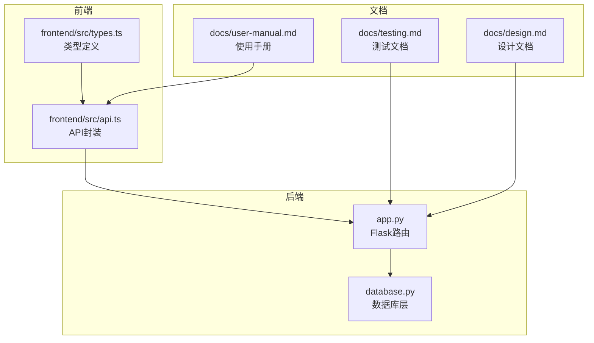
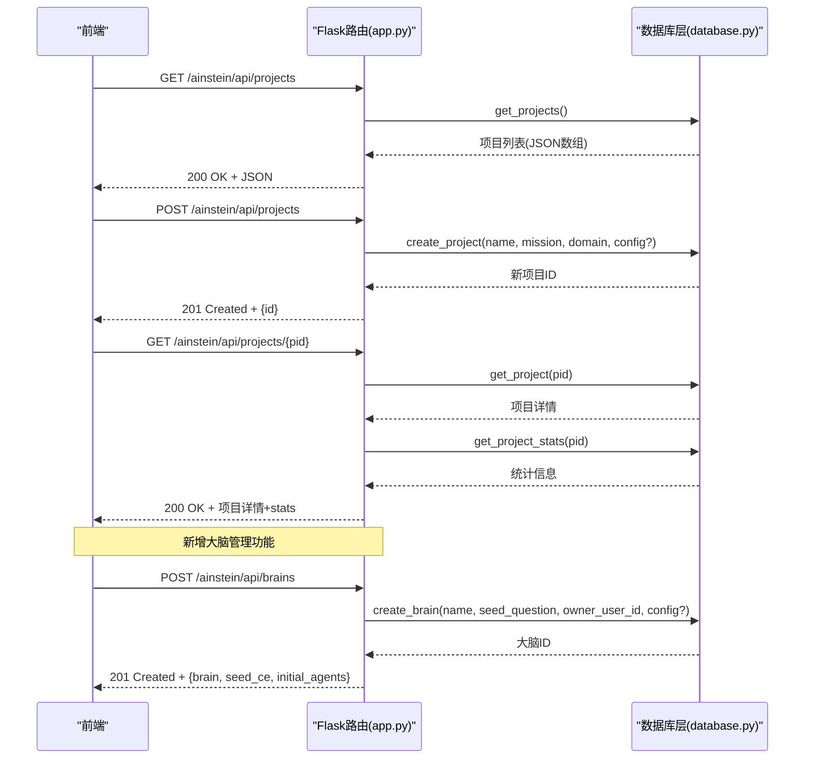
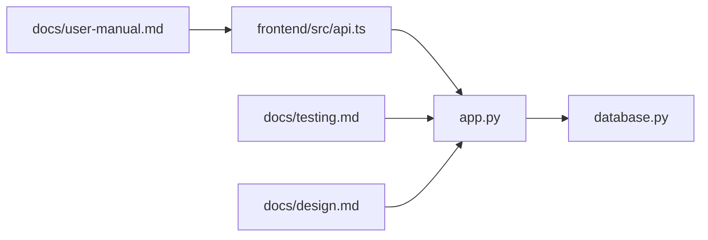

# 项目管理API

<cite>
**本文引用的文件**
- [app.py](file://app.py)
- [database.py](file://database.py)
- [frontend/src/api.ts](file://frontend/src/api.ts)
- [frontend/src/types.ts](file://frontend/src/types.ts)
- [docs/testing.md](file://docs/testing.md)
- [docs/design.md](file://docs/design.md)
- [docs/user-manual.md](file://docs/user-manual.md)
</cite>

## 更新摘要
**变更内容**
- 项目管理API已完全重构，移除了队列管理和会话管理功能
- 新增了硅基大脑（Silicon Brain）相关API接口
- 更新了项目数据模型，移除了队列、会话、发现等字段
- 前端API封装增加了大脑管理相关功能
- 文档结构重新组织，突出新的大脑管理功能

## 目录
1. [简介](#简介)
2. [项目结构](#项目结构)
3. [核心组件](#核心组件)
4. [架构总览](#架构总览)
5. [详细组件分析](#详细组件分析)
6. [依赖关系分析](#依赖关系分析)
7. [性能考量](#性能考量)
8. [故障排查指南](#故障排查指南)
9. [结论](#结论)
10. [附录](#附录)

## 简介
本文件面向项目管理API，聚焦于项目CRUD操作的完整接口说明，包括：
- 获取项目列表：GET /ainstein/api/projects
- 创建项目：POST /ainstein/api/projects
- 获取单个项目：GET /ainstein/api/projects/<int:pid>

**重要更新**：原有项目管理API已完全重构，移除了队列管理和会话管理功能，专注于大脑管理。现在系统支持两种管理模式：
- 传统项目模式：保留原有的项目CRUD功能
- 硅基大脑模式：新增大脑生命周期管理功能

文档涵盖请求参数、响应格式、状态码含义、数据模型字段说明、典型请求/响应示例、错误处理机制与常见问题解决方案，并结合前端API封装与数据库层实现进行深入解析。

## 项目结构
后端采用Flask应用，路由集中在app.py；数据库层在database.py中定义；前端API封装位于frontend/src/api.ts，类型定义在frontend/src/types.ts；测试文档在docs目录中。

**图表来源**
- [app.py:1-1054](file://app.py#L1-L1054)
- [database.py:1-877](file://database.py#L1-L877)
- [frontend/src/api.ts:1-163](file://frontend/src/api.ts#L1-L163)
- [frontend/src/types.ts:1-164](file://frontend/src/types.ts#L1-L164)
- [docs/testing.md:1-628](file://docs/testing.md#L1-L628)
- [docs/design.md:1-369](file://docs/design.md#L1-L369)
- [docs/user-manual.md:1-310](file://docs/user-manual.md#L1-L310)

**章节来源**
- [app.py:1-1054](file://app.py#L1-L1054)
- [database.py:1-877](file://database.py#L1-L877)
- [frontend/src/api.ts:1-163](file://frontend/src/api.ts#L1-L163)
- [frontend/src/types.ts:1-164](file://frontend/src/types.ts#L1-L164)
- [docs/testing.md:1-628](file://docs/testing.md#L1-L628)
- [docs/design.md:1-369](file://docs/design.md#L1-L369)
- [docs/user-manual.md:1-310](file://docs/user-manual.md#L1-L310)

## 核心组件
- Flask路由层：负责HTTP请求处理、参数解析、响应返回与错误码设置。
- 数据库层：负责项目CRUD、统计聚合、队列与会话关联等数据访问。
- 前端API封装：统一BASE路径与请求方法，便于前端调用。

**更新**：系统现已支持两种模式的API：
- 传统项目模式：保留原有的项目CRUD功能
- 硅基大脑模式：新增大脑生命周期管理功能

**章节来源**
- [app.py:191-310](file://app.py#L191-L310)
- [database.py:315-356](file://database.py#L315-L356)
- [frontend/src/api.ts:86-158](file://frontend/src/api.ts#L86-L158)

## 架构总览
项目管理API的调用链路如下：
- 前端通过/api/projects发起请求
- Flask路由接收请求，调用数据库层执行CRUD
- 数据库层返回结构化数据，Flask封装为JSON响应
- 前端根据响应状态码与内容进行UI更新

**更新**：架构现已扩展支持大脑管理功能：
- 传统项目模式：项目CRUD + 统计信息聚合
- 硅基大脑模式：大脑生命周期管理 + 认知元素管理

**图表来源**
- [app.py:378-394](file://app.py#L378-L394)
- [database.py:315-356](file://database.py#L315-L356)
- [app.py:191-282](file://app.py#L191-L282)

## 详细组件分析

### 项目数据模型与字段说明

**传统项目模式（保留）**
- projects表字段（部分关键字段）
  - id：自增主键
  - name：项目名称（唯一）
  - mission：研究使命
  - domain：领域标签
  - config_json：项目配置（JSON字符串，默认空对象）
  - status：状态（默认active）
  - created_at：创建时间

- 统计信息字段（由get_project_stats聚合）
  - sessions_total：会话总数
  - sessions_completed：已完成会话数
  - findings_total：发现总数
  - findings_actionable：可执行发现数
  - findings_validated：已验证发现数
  - queue_pending：待研究队列数

**更新**：硅基大脑模式新增数据模型
- brains表字段
  - id：自增主键
  - name：大脑名称
  - seed_question：种子问题
  - owner_user_id：所有者用户ID
  - state：状态（gestating/active/paused/archived/resolved）
  - config_json：配置（JSON字符串）
  - frontier_score：认知边界分数
  - created_at/started_at/last_active_at：时间戳

**章节来源**
- [database.py:10-98](file://database.py#L10-L98)
- [database.py:335-356](file://database.py#L335-L356)
- [database.py:118-130](file://database.py#L118-L130)

### 接口定义与行为

#### 获取项目列表（传统项目模式）
- 方法与路径
  - GET /ainstein/api/projects
- 请求参数
  - 无查询参数
- 响应
  - 200 OK：返回项目数组，每项包含基础字段与统计信息
- 示例
  - 请求：GET /ainstein/api/projects
  - 响应：200 OK，数组元素形如
    - {id, name, mission, domain, config_json, status, created_at, stats?}
- 状态码
  - 200：成功
- 错误处理
  - 无显式错误返回；若数据库异常，Flask默认返回5xx

**章节来源**
- [app.py:378-380](file://app.py#L378-L380)
- [database.py:323-328](file://database.py#L323-L328)

#### 创建项目（传统项目模式）
- 方法与路径
  - POST /ainstein/api/projects
- 请求体
  - Content-Type: application/json
  - 字段
    - name：字符串，必填
    - mission：字符串，必填
    - domain：字符串，必填
    - config：对象，可选（将序列化为JSON字符串存储）
- 响应
  - 201 Created：返回{id}
  - 400 Bad Request：当请求体缺失必要字段或JSON无效时
- 示例
  - 请求体：
    - {"name":"项目A","mission":"发现驱动短期回报的核心因子","domain":"量化金融","config":{"enabled_tools":["correlation","regression"]}}
  - 响应：201 Created，{"id":123}
- 状态码
  - 201：创建成功
  - 400：请求体无效或缺少字段
- 错误处理
  - 若请求体非JSON或字段缺失，Flask会返回400
  - 数据库约束冲突（如name重复）将导致400/500

**章节来源**
- [app.py:382-386](file://app.py#L382-L386)
- [database.py:315-321](file://database.py#L315-L321)

#### 获取单个项目（传统项目模式）
- 方法与路径
  - GET /ainstein/api/projects/<int:pid>
- 路径参数
  - pid：项目ID（整数）
- 响应
  - 200 OK：返回项目详情，并附加stats统计信息
  - 404 Not Found：当项目不存在
- 示例
  - 请求：GET /ainstein/api/projects/123
  - 响应：200 OK，包含基础字段与stats
    - {id, name, mission, domain, config_json, status, created_at, stats:{sessions_total, sessions_completed, findings_total, findings_actionable, findings_validated, queue_pending}}
  - 请求：GET /ainstein/api/projects/999
  - 响应：404 Not Found，{"error":"not found"}
- 状态码
  - 200：成功
  - 404：项目不存在
- 错误处理
  - 当get_project返回None时，返回404

**章节来源**
- [app.py:388-394](file://app.py#L388-L394)
- [database.py:330-333](file://database.py#L330-L333)
- [database.py:335-356](file://database.py#L335-L356)

### 硅基大脑管理API

#### 创建大脑
- 方法与路径
  - POST /ainstein/api/brains
- 请求头
  - Authorization: Bearer <token>
- 请求体
  - Content-Type: application/json
  - 字段
    - name：字符串，必填
    - seed_question：字符串，必填（10-500字符）
    - config：对象，可选
- 响应
  - 201 Created：返回{brain, seed_ce, initial_agents}
  - 400 Bad Request：当请求体缺失必要字段或长度无效时
  - 401 Unauthorized：未认证
- 示例
  - 请求体：
    - {"name":"Alpha Brain","seed_question":"如何提高AI系统的推理能力？","config":{"model":"gpt-4","tools":["math","code"]}}
  - 响应：201 Created，包含大脑详情、种子认知元素和初始Agent信息
- 状态码
  - 201：创建成功
  - 400：请求体无效或缺少字段
  - 401：未认证
- 错误处理
  - 需要认证令牌
  - 种子问题长度必须在10-500字符范围内

**章节来源**
- [app.py:191-282](file://app.py#L191-L282)
- [database.py:561-569](file://database.py#L561-L569)

#### 获取大脑列表
- 方法与路径
  - GET /ainstein/api/brains
- 请求头
  - Authorization: Bearer <token>
- 查询参数
  - all：是否显示所有用户的大脑（管理员专用）
- 响应
  - 200 OK：返回大脑列表
  - 401 Unauthorized：未认证
- 示例
  - 请求：GET /ainstein/api/brains?all=1
  - 响应：200 OK，包含所有用户的大脑列表
- 状态码
  - 200：成功
  - 401：未认证

**章节来源**
- [app.py:285-295](file://app.py#L285-L295)

#### 获取单个大脑
- 方法与路径
  - GET /ainstein/api/brains/<int:brain_id>
- 请求头
  - Authorization: Bearer <token>
- 响应
  - 200 OK：返回大脑详情
  - 403 Forbidden：非所有者且非管理员
  - 404 Not Found：大脑不存在
- 示例
  - 请求：GET /ainstein/api/brains/1
  - 响应：200 OK，包含大脑详情和统计信息
- 状态码
  - 200：成功
  - 403：无权限
  - 404：不存在

**章节来源**
- [app.py:298-309](file://app.py#L298-L309)

#### 暂停大脑
- 方法与路径
  - POST /ainstein/api/brains/<int:brain_id>/pause
- 请求头
  - Authorization: Bearer <token>（管理员）
- 响应
  - 200 OK：返回暂停状态
  - 403 Forbidden：非管理员
  - 404 Not Found：大脑不存在
- 示例
  - 请求：POST /ainstein/api/brains/1/pause
  - 响应：200 OK，{"status":"paused","brain":{...}}
- 状态码
  - 200：成功
  - 403：无权限
  - 404：不存在

**章节来源**
- [app.py:312-341](file://app.py#L312-L341)

#### 恢复大脑
- 方法与路径
  - POST /ainstein/api/brains/<int:brain_id>/resume
- 请求头
  - Authorization: Bearer <token>（管理员）
- 响应
  - 200 OK：返回恢复状态
  - 403 Forbidden：非管理员
  - 404 Not Found：大脑不存在
- 示例
  - 请求：POST /ainstein/api/brains/1/resume
  - 响应：200 OK，{"status":"active","brain":{...}}
- 状态码
  - 200：成功
  - 403：无权限
  - 404：不存在

**章节来源**
- [app.py:344-373](file://app.py#L344-L373)

### 前端API封装与类型定义

**更新**：前端API封装现已扩展支持大脑管理功能
- 前端API封装
  - BASE路径：/ainstein/api
  - 传统项目API：listProjects、createProject、getProject等
  - 大脑管理API：listBrains、createBrain、getBrain、pauseBrain、resumeBrain等
  - 错误处理：resp.ok为false时抛出错误
- 类型定义
  - Project接口包含基础字段与可选stats
  - ProjectStats包含会话与发现统计
  - Brain接口包含大脑详情与统计信息

**章节来源**
- [frontend/src/api.ts:86-158](file://frontend/src/api.ts#L86-L158)
- [frontend/src/types.ts:101-115](file://frontend/src/types.ts#L101-L115)

### 数据库层实现要点

**传统项目模式**
- create_project
  - 将config序列化为JSON字符串存储
  - 返回最后插入ID
- get_projects
  - 按status过滤（默认active），按created_at倒序
- get_project
  - 按id查询，返回字典
- get_project_stats
  - 聚合计数与计数条件，返回结构化统计

**更新**：新增大脑管理相关实现
- create_brain
  - 创建大脑实例，设置初始状态为gestating
  - 返回大脑ID
- get_brains
  - 支持按所有者过滤，按状态和时间排序
- get_brain
  - 获取单个大脑详情
- update_brain_state
  - 更新大脑状态（active/paused/resolved/archived）

**章节来源**
- [database.py:315-321](file://database.py#L315-L321)
- [database.py:323-328](file://database.py#L323-L328)
- [database.py:330-333](file://database.py#L330-L333)
- [database.py:335-356](file://database.py#L335-L356)
- [database.py:561-569](file://database.py#L561-L569)
- [database.py:576-588](file://database.py#L576-L588)
- [database.py:571-574](file://database.py#L571-L574)
- [database.py:590-599](file://database.py#L590-L599)

## 依赖关系分析
- app.py依赖database.py进行数据访问
- 前端API封装依赖后端路由约定的BASE路径
- 设计文档与使用手册为API行为提供规范依据
- 测试文档验证API功能的正确性

**图表来源**
- [app.py:1-10](file://app.py#L1-L10)
- [database.py:1-10](file://database.py#L1-L10)
- [frontend/src/api.ts:1-7](file://frontend/src/api.ts#L1-L7)
- [docs/testing.md:1-10](file://docs/testing.md#L1-L10)
- [docs/design.md:1-10](file://docs/design.md#L1-L10)
- [docs/user-manual.md:1-10](file://docs/user-manual.md#L1-L10)

**章节来源**
- [app.py:1-10](file://app.py#L1-L10)
- [database.py:1-10](file://database.py#L1-L10)
- [frontend/src/api.ts:1-7](file://frontend/src/api.ts#L1-L7)
- [docs/testing.md:1-10](file://docs/testing.md#L1-L10)
- [docs/design.md:1-10](file://docs/design.md#L1-L10)
- [docs/user-manual.md:1-10](file://docs/user-manual.md#L1-L10)

## 性能考量
- 数据库连接
  - 使用上下文管理器确保事务提交/回滚与连接关闭
  - WAL模式提升并发读写性能
- 查询索引
  - 为队列、会话、发现、记忆、数据集建立索引，加速按项目ID查询
  - 为大脑表建立索引，支持按所有者和状态查询
- 前端批量请求
  - 前端在仪表盘加载时会并行获取项目列表与详情，注意后端响应延迟与限流

**更新**：新增大脑管理的性能考量
- 大脑生命周期管理需要高效的事件处理机制
- 认知元素图谱查询需要优化的索引策略
- Agent实例管理需要并发控制和资源限制

**章节来源**
- [database.py:297-311](file://database.py#L297-L311)
- [database.py:92-98](file://database.py#L92-L98)
- [database.py:131](file://database.py#L131)
- [frontend/src/api.ts:86-158](file://frontend/src/api.ts#L86-L158)

## 故障排查指南

### 传统项目模式故障排查
- 404 Not Found
  - 现象：访问不存在的项目ID
  - 排查：确认pid是否正确；检查数据库中是否存在对应记录
- 400 Bad Request
  - 现象：POST创建项目时请求体无效或字段缺失
  - 排查：检查Content-Type与JSON格式；确保name、mission、domain存在
- 5xx Internal Server Error
  - 现象：数据库异常或路由异常
  - 排查：查看后端日志；检查数据库初始化与连接配置

### 硅基大脑模式故障排查
- 401 Unauthorized
  - 现象：访问需要认证的API
  - 排查：检查Authorization头中的token；确认用户已登录
- 403 Forbidden
  - 现象：访问非所有者的大脑或非管理员操作
  - 排查：确认用户权限；检查大脑所有者信息
- 400 Bad Request
  - 现象：种子问题长度或格式无效
  - 排查：检查种子问题长度（10-500字符）；确认JSON格式正确

### 前端错误
- 现象：fetch返回非OK状态抛出异常
- 排查：捕获异常并提示用户；检查BASE路径与网络连通性

**章节来源**
- [app.py:307-308](file://app.py#L307-L308)
- [frontend/src/api.ts:58-76](file://frontend/src/api.ts#L58-L76)

## 结论
项目管理API经过重构后，提供了更加完善的管理功能。系统现在支持两种管理模式：
- 传统项目模式：保留原有的项目CRUD功能，适合传统的研究项目管理
- 硅基大脑模式：新增大脑生命周期管理功能，支持更高级的认知计算

建议在生产环境中增加鉴权与速率限制，并完善字段校验与错误提示，以提升安全性与用户体验。

## 附录

### 请求/响应示例（基于接口定义）

#### 传统项目模式
- 获取项目列表
  - 请求：GET /ainstein/api/projects
  - 响应：200 OK，数组元素包含基础字段与可选stats
- 创建项目
  - 请求：POST /ainstein/api/projects
  - 请求体：{"name":"项目A","mission":"使命","domain":"领域","config":{"key":"value"}}
  - 响应：201 Created，{"id":123}
- 获取单个项目
  - 请求：GET /ainstein/api/projects/123
  - 响应：200 OK，包含基础字段与stats
  - 请求：GET /ainstein/api/projects/999
  - 响应：404 Not Found，{"error":"not found"}

#### 硅基大脑模式
- 创建大脑
  - 请求：POST /ainstein/api/brains
  - 请求头：Authorization: Bearer <token>
  - 请求体：{"name":"Alpha Brain","seed_question":"如何提高AI系统的推理能力？","config":{"model":"gpt-4"}}
  - 响应：201 Created，包含brain、seed_ce、initial_agents
- 获取大脑列表
  - 请求：GET /ainstein/api/brains
  - 响应：200 OK，包含大脑列表
- 获取单个大脑
  - 请求：GET /ainstein/api/brains/1
  - 响应：200 OK，包含大脑详情

**章节来源**
- [app.py:378-394](file://app.py#L378-L394)
- [app.py:191-282](file://app.py#L191-L282)
- [app.py:285-309](file://app.py#L285-L309)
- [database.py:315-356](file://database.py#L315-L356)
- [docs/testing.md:426-444](file://docs/testing.md#L426-L444)