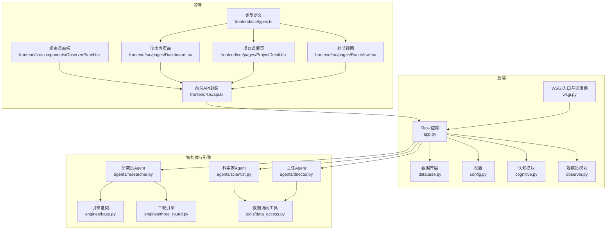
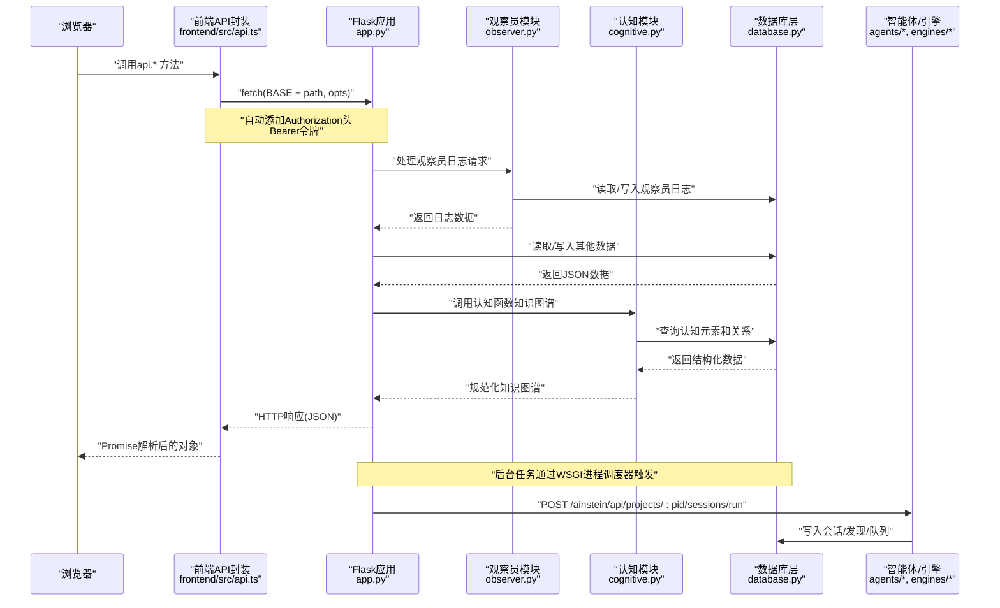
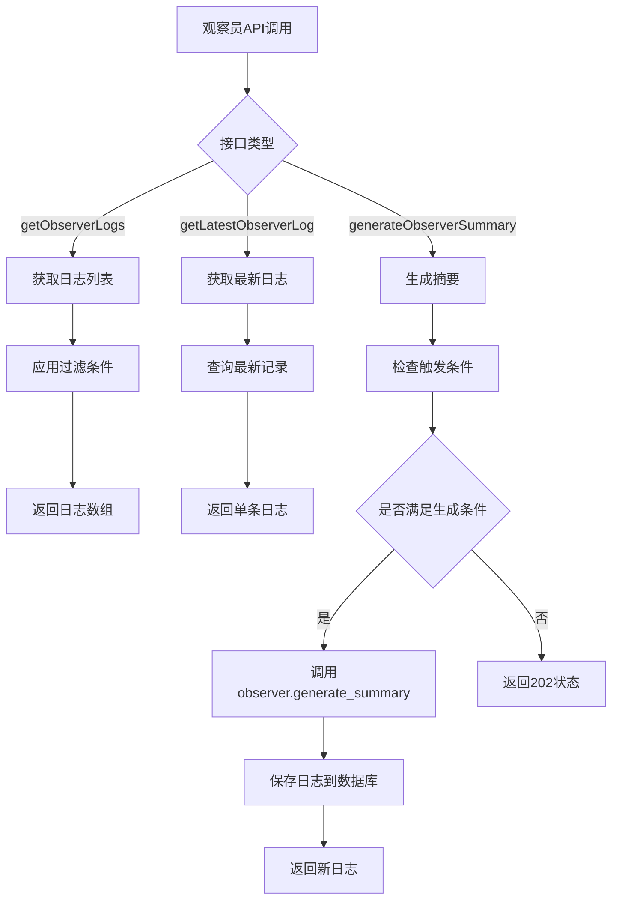
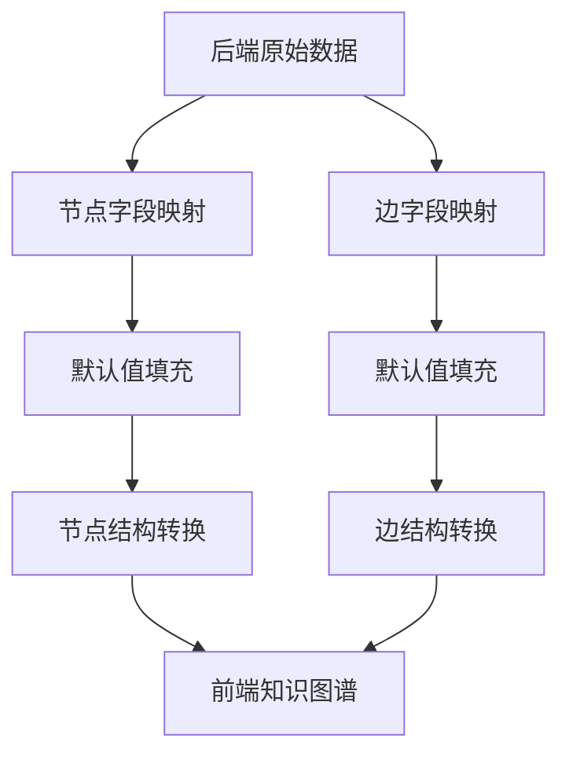
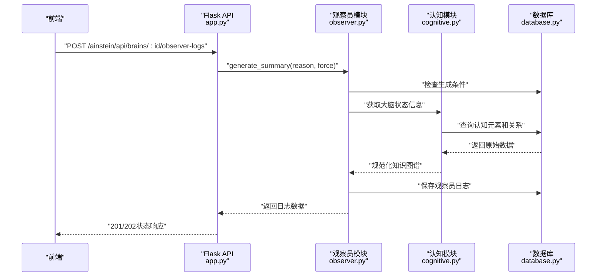
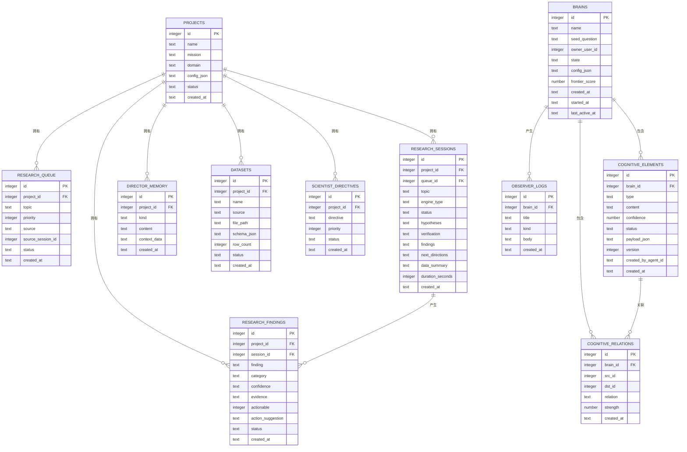
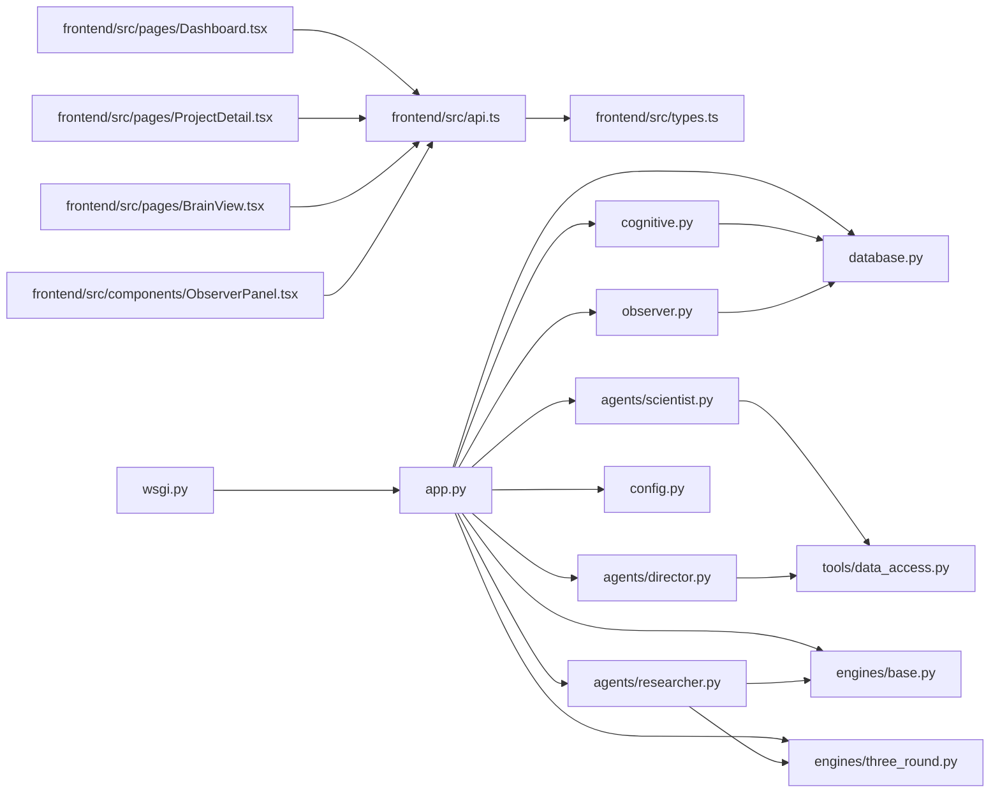

# API集成

<cite>
**本文档引用的文件**
- [frontend/src/api.ts](file://frontend/src/api.ts)
- [frontend/src/types.ts](file://frontend/src/types.ts)
- [frontend/src/pages/Dashboard.tsx](file://frontend/src/pages/Dashboard.tsx)
- [frontend/src/pages/ProjectDetail.tsx](file://frontend/src/pages/ProjectDetail.tsx)
- [frontend/src/pages/BrainView.tsx](file://frontend/src/pages/BrainView.tsx)
- [frontend/src/components/ObserverPanel.tsx](file://frontend/src/components/ObserverPanel.tsx)
- [app.py](file://app.py)
- [wsgi.py](file://wsgi.py)
- [database.py](file://database.py)
- [config.py](file://config.py)
- [engines/base.py](file://engines/base.py)
- [engines/three_round.py](file://engines/three_round.py)
- [agents/researcher.py](file://agents/researcher.py)
- [agents/scientist.py](file://agents/scientist.py)
- [agents/director.py](file://agents/director.py)
- [observer.py](file://observer.py)
- [tools/data_access.py](file://tools/data_access.py)
- [cognitive.py](file://cognitive.py)
- [prompts/director.txt](file://prompts/director.txt)
- [prompts/scientist.txt](file://prompts/scientist.txt)
- [prompts/three_round.txt](file://prompts/three_round.txt)
</cite>

## 更新摘要
**所做更改**
- 新增观察员API端点章节，详细介绍getObserverLogs、getLatestObserverLog和generateObserverSummary接口
- 更新前端ObserverPanel组件集成说明，包括轮询机制和手动触发功能
- 新增观察员日志数据结构和类型定义
- 更新后端observer.py模块说明，涵盖日志生成和管理功能
- 增强实时更新和手动触发机制说明

## 目录
1. [简介](#简介)
2. [项目结构](#项目结构)
3. [核心组件](#核心组件)
4. [架构总览](#架构总览)
5. [组件详解](#组件详解)
6. [依赖关系分析](#依赖关系分析)
7. [性能考量](#性能考量)
8. [故障排查指南](#故障排查指南)
9. [结论](#结论)
10. [附录](#附录)

## 简介
本文件面向前端与后端Flask API的集成，系统化阐述API调用封装、错误处理、响应解析与最佳实践。文档覆盖以下主题：
- 前端API封装与调用模式：统一请求函数、路径拼接、参数构造与JSON解析
- 后端Flask路由设计与数据访问层：REST风格接口、数据库事务与索引优化
- 错误处理与异常管理：状态码映射、错误消息传递与前端消费
- 认证与安全：内置令牌管理、本地存储和401自动清理
- 数据缓存与离线：前端无持久化缓存，建议在应用层引入轻量缓存
- 版本管理与兼容：通过URL前缀隔离版本，保持向后兼容
- 网络错误与重试：建议在前端增加指数退避重试与节流
- 用户体验优化：加载态、并发请求与错误提示
- **新增** 观察员API端点：支持观察员日志获取、实时更新和手动生成
- **新增** 知识图谱响应规范化：字段映射、默认值处理和类型转换

## 项目结构
该工程采用前后端同源部署：前端打包产物由Flask静态资源服务，API统一前缀"/ainstein/api"。后端通过SQLite存储业务数据，调度器在WSGI进程中启动。

**图表来源**
- [frontend/src/api.ts:1-183](file://frontend/src/api.ts#L1-L183)
- [frontend/src/types.ts:1-164](file://frontend/src/types.ts#L1-L164)
- [frontend/src/pages/Dashboard.tsx:1-140](file://frontend/src/pages/Dashboard.tsx#L1-L140)
- [frontend/src/pages/ProjectDetail.tsx:1-385](file://frontend/src/pages/ProjectDetail.tsx#L1-L385)
- [frontend/src/pages/BrainView.tsx:1-200](file://frontend/src/pages/BrainView.tsx#L1-L200)
- [frontend/src/components/ObserverPanel.tsx:1-770](file://frontend/src/components/ObserverPanel.tsx#L1-L770)
- [app.py:1-1054](file://app.py#L1-L1054)
- [wsgi.py:1-83](file://wsgi.py#L1-L83)
- [database.py:1-344](file://database.py#L1-L344)
- [config.py:1-11](file://config.py#L1-L11)
- [cognitive.py:1-516](file://cognitive.py#L1-L516)
- [observer.py:1-1005](file://observer.py#L1-L1005)

## 核心组件
- 前端API封装
  - 统一基础路径"/ainstein/api"，封装request函数，自动检查响应状态并解析JSON
  - **增强** 认证支持：自动添加Bearer令牌头，401状态自动清理本地存储
  - 暴露方法覆盖健康检查、项目、队列、会话、发现、数据集、指令、内存、科学家/主任执行
  - **新增** 观察员API：getObserverLogs、getLatestObserverLog、generateObserverSummary
  - **新增** 硅基大脑功能：知识图谱获取、脑部前沿数据、认证注册登录
  - 支持查询参数拼装、FormData上传
- 后端Flask路由
  - 提供SPA路由与静态资源服务，API路由集中在"/ainstein/api"
  - 健康检查、项目增删查改、队列、会话、发现、数据集、指令、内存、科学家/主任执行
  - **新增** 观察员路由：`/brains/<brain_id>/observer-logs`、`/brains/<brain_id>/observer-logs/latest`、`/brains/<brain_id>/observer-logs/<log_id>`
  - **新增** 硅基大脑路由：知识图谱获取、脑部前沿数据、认证接口
- 数据库层
  - SQLite + WAL + 外键开启，提供项目、队列、会话、发现、数据集、指令、记忆、观察员日志等表
  - 索引覆盖常用查询字段，保证检索效率
- 调度器
  - WSGI进程内启动APScheduler，按UTC时间触发科学家/主任/研究员任务
- 类型定义
  - TypeScript接口覆盖项目、队列、会话、发现、数据集、指令、记忆等实体
  - **新增** 观察员日志类型：ObserverLog、ObserverLogBody及其相关结构
  - **新增** 硅基大脑类型：认知节点、认知边、知识图谱、脑部前沿

**章节来源**
- [frontend/src/api.ts:14-183](file://frontend/src/api.ts#L14-L183)
- [app.py:926-991](file://app.py#L926-L991)
- [app.py:43-176](file://app.py#L43-L176)
- [database.py:101-344](file://database.py#L101-L344)
- [wsgi.py:27-71](file://wsgi.py#L27-L71)
- [frontend/src/types.ts:90-164](file://frontend/src/types.ts#L90-L164)

## 架构总览
下图展示从浏览器到后端API再到数据库与智能体的完整链路，包括新增的观察员功能。

**图表来源**
- [frontend/src/api.ts:51-76](file://frontend/src/api.ts#L51-L76)
- [app.py:926-991](file://app.py#L926-L991)
- [app.py:654-687](file://app.py#L654-L687)
- [observer.py:954-1005](file://observer.py#L954-L1005)
- [cognitive.py:327-397](file://cognitive.py#L327-L397)
- [database.py:232-261](file://database.py#L232-L261)
- [wsgi.py:27-71](file://wsgi.py#L27-L71)

## 组件详解

### 前端API封装与最佳实践
- 请求封装
  - 统一前缀"/ainstein/api"，内部使用fetch，非2xx状态抛出错误并附带响应文本
  - **增强** 自动认证：从localStorage获取令牌，添加Authorization头
  - **增强** 401处理：自动清理失效令牌和用户信息
  - GET参数通过URLSearchParams构建，POST/PUT使用JSON或FormData
- 错误处理
  - 建议在调用处捕获异常，区分网络错误与业务错误（如404/400），并给出用户提示
  - **新增** 认证错误处理：401状态自动清理本地存储
  - **新增** 观察员API错误处理：404状态处理和重试机制
- 响应解析
  - 默认期望后端返回JSON；对于二进制上传/下载，确保Content-Type正确
  - **新增** 知识图谱规范化：字段映射和默认值处理
  - **新增** 观察员日志解析：支持结构化body和原始body两种格式
- 并发与节流
  - 使用Promise.all合并多个请求，避免重复加载
  - 对高频操作（如搜索）加入防抖/节流
- 缓存与离线
  - 建议引入内存缓存（弱一致性）或Service Worker离线缓存
  - **新增** 观察员日志缓存：短期缓存最新日志以提升用户体验
- 重试与超时
  - 对幂等GET建议指数退避重试；对非幂等POST谨慎重试
  - 设置合理超时，避免UI长时间挂起
  - **新增** 观察员生成重试：202状态下的条件重试机制

**章节来源**
- [frontend/src/api.ts:51-183](file://frontend/src/api.ts#L51-L183)
- [frontend/src/pages/Dashboard.tsx:16-28](file://frontend/src/pages/Dashboard.tsx#L16-L28)
- [frontend/src/pages/ProjectDetail.tsx:117-123](file://frontend/src/pages/ProjectDetail.tsx#L117-L123)

### 观察员API端点详解
**新增** 本节详细介绍观察员API端点的设计与实现，包括日志获取、实时更新和手动生成功能。

#### 观察员日志获取接口
- getObserverLogs
  - 路径：`GET /ainstein/api/brains/{brain_id}/observer-logs`
  - 查询参数：
    - `kind`: 日志类型（summary/alert/milestone），可选
    - `limit`: 返回条数，默认50
  - 响应结构：包含items数组和查询参数
  - 用途：批量获取观察员日志，支持类型过滤和数量限制

- getLatestObserverLog
  - 路径：`GET /ainstein/api/brains/{brain_id}/observer-logs/latest`
  - 响应：最新的一条观察员日志
  - 404状态：当没有观察员日志时返回错误信息
  - 用途：获取最新的观察员总结，用于实时展示

- getObserverLog
  - 路径：`GET /ainstein/api/brains/{brain_id}/observer-logs/{log_id}`
  - 响应：指定ID的观察员日志详情
  - 安全检查：验证日志所属的大脑ID
  - 用途：获取特定观察员日志的详细信息

#### 观察员摘要生成接口
- generateObserverSummary
  - 路径：`POST /ainstein/api/brains/{brain_id}/observer-logs`
  - 请求体参数：
    - `reason`: 触发原因（如'manual'），默认'manual'
    - `force`: 是否强制生成，布尔值，默认True
  - 响应状态：
    - 201: 成功生成新的观察员日志
    - 202: 跳过生成（限流或持久化失败）
  - 用途：手动触发观察员摘要生成，支持强制模式

**图表来源**
- [app.py:926-991](file://app.py#L926-L991)
- [observer.py:954-1005](file://observer.py#L954-L1005)

**章节来源**
- [app.py:926-991](file://app.py#L926-L991)
- [observer.py:954-1005](file://observer.py#L954-L1005)

### 观察员面板组件集成
**新增** 本节说明前端ObserverPanel组件如何集成观察员API，包括轮询机制、手动触发和数据展示。

#### 轮询机制
- 默认轮询间隔：30秒
- 自动加载最新观察员日志
- 组件卸载时自动清理定时器
- 支持自定义轮询间隔

#### 手动触发功能
- 用户点击"请求新观察"按钮
- 调用generateObserverSummary接口
- 支持强制生成模式
- 生成成功后立即刷新显示

#### 数据展示与解析
- 支持结构化body和原始body两种格式
- 自动解析JSON格式的body
- 高重要性日志的视觉突出显示
- 历史记录的展开/折叠显示

#### 错误处理
- 加载失败的错误提示
- 生成失败的错误处理
- 空状态的友好提示
- 实时同步的时间戳显示

**章节来源**
- [frontend/src/components/ObserverPanel.tsx:20-97](file://frontend/src/components/ObserverPanel.tsx#L20-L97)
- [frontend/src/components/ObserverPanel.tsx:100-110](file://frontend/src/components/ObserverPanel.tsx#L100-L110)

### 知识图谱响应规范化处理
**新增** 本节详细介绍前端如何处理后端返回的知识图谱数据，包括字段映射和默认值处理逻辑。

- 字段映射策略
  - 节点类型映射：优先使用`ce_type`，回退到`type`，最终默认为'question'
  - 节点标题映射：优先使用`title`，回退到`label`，最后使用`content`前30字符
  - 边关系类型映射：优先使用`relation_type`，回退到`relation`，默认'relates_to'
  - 边权重映射：优先使用`weight`，回退到`strength`，默认0.5
- 默认值处理
  - 置信度：空值时默认0.5，确保数值类型
  - 状态：空值时默认'open'
  - 创建时间：空值时默认空字符串
  - 元数据：空值时默认空字符串
  - 边源目标ID：空值时回退到`source`/`target`字段
- 数据结构转换
  - 将后端的扁平化字段转换为前端期望的CognitiveNode/CognitiveEdge结构
  - 保持数组完整性，空数组时提供默认空数组

**图表来源**
- [frontend/src/api.ts:144-170](file://frontend/src/api.ts#L144-L170)
- [cognitive.py:335-397](file://cognitive.py#L335-L397)

**章节来源**
- [frontend/src/api.ts:144-170](file://frontend/src/api.ts#L144-L170)
- [cognitive.py:327-397](file://cognitive.py#L327-L397)

### 后端Flask路由与数据访问
- 路由组织
  - SPA路由与静态资源服务位于"/ainstein/..."前缀下
  - API路由集中于"/ainstein/api/..."，便于版本化与反向代理转发
- 健康检查
  - "/ainstein/api/health"返回状态
- 项目管理
  - 列表、创建、详情、统计聚合
- 队列、会话、发现、数据集、指令、内存、科学家/主任执行
  - 均通过REST风格接口提供，POST异步任务通过线程/调度器执行
- **新增** 观察员功能路由
  - 日志列表：`/brains/{brain_id}/observer-logs`，支持类型过滤和限制数量
  - 最新日志：`/brains/{brain_id}/observer-logs/latest`，404状态处理
  - 单条日志：`/brains/{brain_id}/observer-logs/{log_id}`，安全验证
  - 摘要生成：`/brains/{brain_id}/observer-logs`，支持强制生成
- **新增** 硅基大脑功能
  - 知识图谱：`/brains/{brain_id}/knowledge-graph`，支持类型过滤和限制数量
  - 脑部前沿：`/brains/{brain_id}/frontier`，支持限制数量和置信度阈值
  - 认证接口：注册、登录、用户信息获取
- 数据库事务
  - 使用上下文管理器，自动提交/回滚，外键约束启用
  - 索引覆盖常见查询字段，提升读性能

**章节来源**
- [app.py:24-38](file://app.py#L24-L38)
- [app.py:43-176](file://app.py#L43-L176)
- [app.py:926-991](file://app.py#L926-L991)
- [app.py:654-687](file://app.py#L654-L687)
- [database.py:101-344](file://database.py#L101-L344)

### 智能体与引擎协作
- 研究员（Researcher）
  - 从队列挑选主题，调用三轮引擎，持久化会话与发现，补充后续方向
- 科学家（Scientist）
  - 生成战略指令与初始主题，写入指令与队列，沉淀主任记忆
- 主任（Director）
  - 日常回顾，审核发现、调整队列、积累记忆、生成简报
- 观察员（Observer）
  - **新增** 监控大脑演化过程，生成观察员日志
  - 支持自动和手动触发模式
  - 生成结构化的观察报告，包含重要性和发展方向
- 引擎（Three-Round）
  - 假设生成→工具检验→结论验证，输出结构化结果

**图表来源**
- [app.py:970-980](file://app.py#L970-L980)
- [observer.py:929-935](file://observer.py#L929-L935)
- [cognitive.py:327-397](file://cognitive.py#L327-L397)
- [database.py:232-295](file://database.py#L232-L295)

### 类型模型与数据结构
- 项目、队列、会话、发现、数据集、指令、记忆等实体均在TypeScript中定义
- 后端数据库表与接口返回结构一一对应，便于前后端契约稳定
- **新增** 观察员日志类型结构
  - ObserverLog：包含ID、大脑ID、标题、类型、body、创建时间等字段
  - ObserverLogBody：结构化日志内容，包含叙述、主要方向、关键发展等
  - 支持body_struct和原始body两种格式
- **新增** 硅基大脑类型结构
  - 认知节点：包含ID、类型、标题、内容、置信度、状态、创建时间和元数据
  - 认知边：包含ID、源节点ID、目标节点ID、关系类型和权重
  - 知识图谱：节点和边的数组结构
  - 脑部前沿：包含最近、低置信度和未被支撑三类元素

**图表来源**
- [database.py:11-98](file://database.py#L11-L98)
- [frontend/src/types.ts:1-164](file://frontend/src/types.ts#L1-L164)
- [observer.py:954-1005](file://observer.py#L954-L1005)

## 依赖关系分析
- 前端依赖
  - api.ts依赖fetch与URLSearchParams/FormData，依赖localStorage进行认证
  - 页面组件依赖api.ts与types.ts，特别是BrainView使用知识图谱功能
  - **新增** ObserverPanel组件依赖api.ts进行观察员日志管理
- 后端依赖
  - app.py依赖database.py、agents/*、engines/*、tools/*、cognitive.py、observer.py
  - wsgi.py依赖apscheduler与app.py
- 配置
  - config.py提供数据库路径、数据目录、模型与API密钥等环境变量

**图表来源**
- [frontend/src/api.ts:1-183](file://frontend/src/api.ts#L1-L183)
- [frontend/src/types.ts:1-164](file://frontend/src/types.ts#L1-L164)
- [frontend/src/pages/Dashboard.tsx:1-140](file://frontend/src/pages/Dashboard.tsx#L1-L140)
- [frontend/src/pages/ProjectDetail.tsx:1-385](file://frontend/src/pages/ProjectDetail.tsx#L1-L385)
- [frontend/src/pages/BrainView.tsx:1-200](file://frontend/src/pages/BrainView.tsx#L1-L200)
- [frontend/src/components/ObserverPanel.tsx:1-770](file://frontend/src/components/ObserverPanel.tsx#L1-L770)
- [app.py:1-1054](file://app.py#L1-L1054)
- [wsgi.py:1-83](file://wsgi.py#L1-L83)
- [database.py:1-344](file://database.py#L1-L344)
- [config.py:1-11](file://config.py#L1-L11)
- [cognitive.py:1-516](file://cognitive.py#L1-L516)
- [observer.py:1-1005](file://observer.py#L1-L1005)

## 性能考量
- 数据库
  - WAL模式与外键开启，减少锁竞争；为高频查询字段建立索引
- 接口
  - 分页/限制数量（如发现列表默认limit=50），避免一次性传输大量数据
  - **新增** 观察员日志限制：默认限制50条，支持类型过滤减少数据量
  - **新增** 知识图谱限制：默认限制200个节点，支持类型过滤减少数据量
- 引擎
  - 三轮引擎包含工具调用循环，建议控制最大轮次与日志级别
- 前端
  - 合理使用并发请求与缓存，避免重复渲染与重复请求
  - **新增** 观察员日志缓存：对最新日志进行短期缓存，提升轮询性能
  - **新增** 知识图谱缓存：对热点脑部知识图谱数据进行短期缓存
- **新增** 观察员性能优化
  - 限流机制：避免频繁生成观察员日志
  - 条件生成：基于阈值判断是否需要生成新日志
  - 异步处理：生成过程可能较慢，使用202状态表示处理中

**章节来源**
- [database.py:113-122](file://database.py#L113-L122)
- [app.py:113-114](file://app.py#L113-L114)
- [app.py:666-668](file://app.py#L666-L668)
- [app.py:934-941](file://app.py#L934-L941)
- [engines/three_round.py:105-135](file://engines/three_round.py#L105-L135)

## 故障排查指南
- 常见错误与定位
  - 404：路径不匹配或静态资源不存在；检查SPA路由与静态目录
  - 400：缺少文件或参数错误；检查上传文件与JSON结构
  - 401：认证失败；检查令牌有效性，确认自动清理机制正常工作
  - 500：数据库异常或引擎执行失败；查看后端日志
  - **新增** 404：观察员日志不存在；检查大脑ID和日志ID
  - **新增** 202：观察员摘要生成被跳过；检查限流条件和持久化状态
- 前端错误处理
  - 在调用api.*处捕获异常，区分网络错误与业务错误，提示用户并记录日志
  - **新增** 认证错误处理：401状态自动清理本地存储并重定向登录
  - **新增** 观察员错误处理：404状态的优雅降级和202状态的条件重试
- 后端日志
  - 健全的日志记录有助于定位问题；注意敏感信息脱敏
  - **新增** 观察员日志：监控生成频率和成功率
  - **新增** 知识图谱查询日志：监控查询性能和数据质量
- 调度器
  - 文件锁确保单实例调度；若未启动，检查锁文件与进程

**章节来源**
- [app.py:16-19](file://app.py#L16-L19)
- [app.py:129-131](file://app.py#L129-L131)
- [app.py:952-955](file://app.py#L952-L955)
- [app.py:975-980](file://app.py#L975-L980)
- [frontend/src/api.ts:58-62](file://frontend/src/api.ts#L58-L62)
- [wsgi.py:13-24](file://wsgi.py#L13-L24)

## 结论
本项目提供了清晰的前后端分离架构：前端通过统一API封装与类型定义对接后端Flask路由，后端以SQLite为数据存储，配合智能体与引擎完成自动化研究流程。当前实现内置了认证令牌管理和知识图谱响应规范化处理，**新增** 的观察员功能进一步增强了系统的监控和分析能力。建议在生产部署时通过反向代理或WAF增强安全；同时可在前端引入缓存与重试策略以提升稳定性与用户体验。

## 附录

### API清单与调用示例（路径与方法）
- 健康检查
  - GET /ainstein/api/health
- 项目
  - GET /ainstein/api/projects
  - POST /ainstein/api/projects
  - GET /ainstein/api/projects/:id
- 队列
  - GET /ainstein/api/projects/:id/queue
  - POST /ainstein/api/projects/:id/queue
- 会话
  - GET /ainstein/api/projects/:id/sessions
  - GET /ainstein/api/projects/:id/sessions/:sid
  - POST /ainstein/api/projects/:id/sessions/run
- 发现
  - GET /ainstein/api/projects/:id/findings?status=&category=&limit=
- 数据集
  - GET /ainstein/api/projects/:id/datasets
  - POST /ainstein/api/projects/:id/datasets/upload
- 指令与记忆
  - GET /ainstein/api/projects/:id/directives
  - GET /ainstein/api/projects/:id/memory?kind=
- AI团队
  - POST /ainstein/api/projects/:id/scientist/run
  - POST /ainstein/api/projects/:id/director/run
- **新增** 观察员API
  - GET /ainstein/api/brains/:id/observer-logs?kind=&limit=
  - GET /ainstein/api/brains/:id/observer-logs/latest
  - GET /ainstein/api/brains/:id/observer-logs/:log_id
  - POST /ainstein/api/brains/:id/observer-logs
- **新增** 硅基大脑
  - GET /ainstein/api/brains
  - POST /ainstein/api/brains
  - GET /ainstein/api/brains/:id
  - POST /ainstein/api/brains/:id/pause
  - POST /ainstein/api/brains/:id/resume
  - GET /ainstein/api/brains/:id/knowledge-graph?types=&limit=
  - GET /ainstein/api/brains/:id/frontier?limit=&confidence_ceiling=
  - POST /ainstein/api/auth/register
  - POST /ainstein/api/auth/login
  - GET /ainstein/api/auth/me

**章节来源**
- [frontend/src/api.ts:86-183](file://frontend/src/api.ts#L86-L183)
- [app.py:43-176](file://app.py#L43-L176)
- [app.py:926-991](file://app.py#L926-L991)
- [app.py:654-687](file://app.py#L654-L687)

### 认证与安全
- 当前实现
  - **增强** 内置认证支持：令牌存储在localStorage，自动添加Authorization头
  - 401状态自动清理令牌和用户信息，防止无效状态
- 生产建议
  - 使用反向代理（Nginx/Caddy）启用TLS与Basic/Digest认证
  - 在网关层接入JWT/OAuth2，或在Flask中间件中实现
  - 对敏感环境变量（如API密钥）严格管控
  - **新增** 观察员API安全：日志ID的安全验证和访问控制
  - **新增** 令牌刷新机制：考虑实现令牌刷新和自动续期

**章节来源**
- [frontend/src/api.ts:14-49](file://frontend/src/api.ts#L14-L49)
- [config.py:6-10](file://config.py#L6-L10)
- [app.py:1-10](file://app.py#L1-L10)

### 版本管理与向后兼容
- 版本策略
  - 通过URL前缀区分版本（如"/ainstein/api/v1/..."），保持现有接口不变
- 兼容性
  - 新增字段采用可选；变更字段保留旧格式一段时间
  - **新增** 知识图谱字段映射：向后兼容旧字段名称
  - **新增** 观察员日志结构：支持结构化和原始两种body格式
  - 文档化变更日志，逐步迁移

**章节来源**
- [app.py:1-11](file://app.py#L1-L11)

### 网络错误处理与重试
- 建议
  - GET请求：指数退避重试（上限次数与抖动）
  - POST请求：仅在明确幂等场景重试，避免重复副作用
  - **新增** 认证重试：401错误时重新登录并重试
  - **新增** 观察员重试：202状态下的条件重试机制
  - 超时设置：根据接口耗时设定合理超时
  - UI反馈：加载指示、错误提示与手动重试按钮

**章节来源**
- [frontend/src/api.ts:58-76](file://frontend/src/api.ts#L58-L76)

### 数据缓存与离线
- 内存缓存
  - 对热点数据（如项目列表）做短期缓存，设置TTL
  - **新增** 观察员日志缓存：对最新日志进行短期缓存，提升轮询性能
  - **新增** 知识图谱缓存：对频繁访问的脑部知识图谱进行缓存
- Service Worker
  - 缓存静态资源与关键API响应，支持离线浏览
- 注意
  - 缓存一致性与失效策略需与后端状态同步
  - **新增** 认证状态缓存：令牌和用户信息的本地存储
  - **新增** 观察员缓存策略：根据重要性和时效性制定不同的缓存策略

**章节来源**
- [frontend/src/pages/Dashboard.tsx:16-20](file://frontend/src/pages/Dashboard.tsx#L16-L20)
- [frontend/src/pages/ProjectDetail.tsx:67-71](file://frontend/src/pages/ProjectDetail.tsx#L67-L71)
- [frontend/src/api.ts:14-49](file://frontend/src/api.ts#L14-L49)
- [frontend/src/components/ObserverPanel.tsx:20-54](file://frontend/src/components/ObserverPanel.tsx#L20-L54)

### 观察员日志数据结构定义
**新增** 本节详细说明观察员日志的数据结构和类型定义。

- ObserverLog接口
  - id: number - 日志唯一标识
  - brain_id: number - 所属大脑ID
  - title: string - 日志标题
  - kind: 'summary' | 'alert' | 'milestone' - 日志类型
  - body: string - 日志内容（原始格式）
  - body_struct: ObserverLogBody - 结构化日志内容
  - created_at: string - 创建时间

- ObserverLogBody接口
  - importance: number - 重要性评分（0-1）
  - narrative: string - 叙事描述
  - main_directions: string[] - 主要发展方向
  - key_developments: KeyDevelopment[] - 关键发展
  - deliberation_dynamics: string - 博弈动态
  - frontier_movement: string - 边界移动
  - health_assessment: string - 健康评估

- KeyDevelopment接口
  - summary: string - 发展摘要
  - cited_ce_ids: number[] - 引用的认知元素ID数组

**章节来源**
- [frontend/src/types.ts:1-164](file://frontend/src/types.ts#L1-L164)
- [observer.py:954-1005](file://observer.py#L954-L1005)