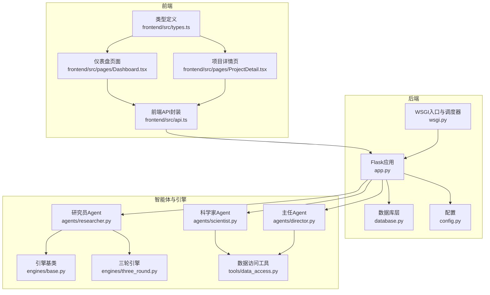
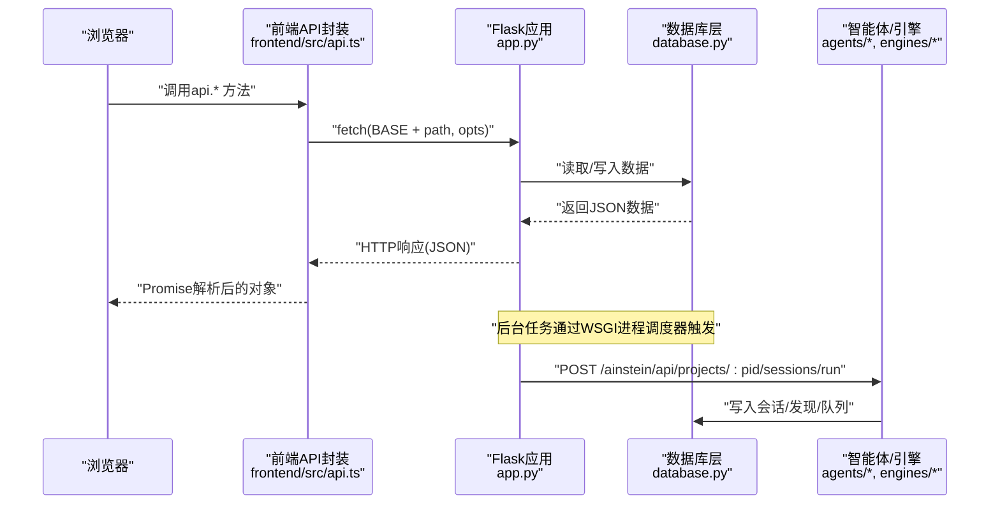
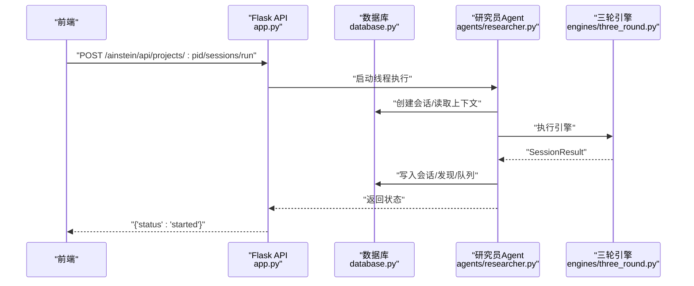
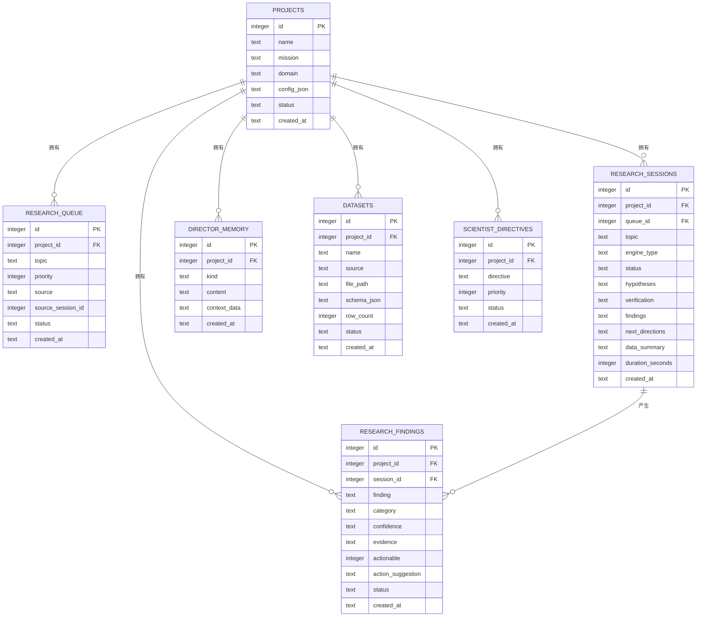
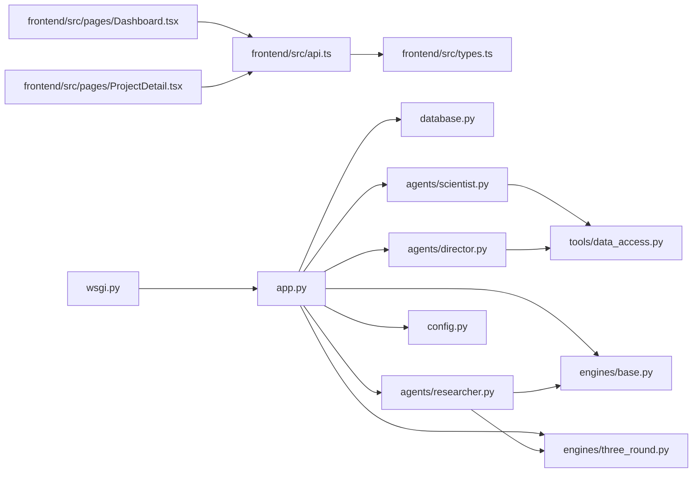

# API集成

<cite>
**本文档引用的文件**
- [frontend/src/api.ts](file://frontend/src/api.ts)
- [frontend/src/types.ts](file://frontend/src/types.ts)
- [frontend/src/pages/Dashboard.tsx](file://frontend/src/pages/Dashboard.tsx)
- [frontend/src/pages/ProjectDetail.tsx](file://frontend/src/pages/ProjectDetail.tsx)
- [app.py](file://app.py)
- [wsgi.py](file://wsgi.py)
- [database.py](file://database.py)
- [config.py](file://config.py)
- [engines/base.py](file://engines/base.py)
- [engines/three_round.py](file://engines/three_round.py)
- [agents/researcher.py](file://agents/researcher.py)
- [agents/scientist.py](file://agents/scientist.py)
- [agents/director.py](file://agents/director.py)
- [tools/data_access.py](file://tools/data_access.py)
- [prompts/director.txt](file://prompts/director.txt)
- [prompts/scientist.txt](file://prompts/scientist.txt)
- [prompts/three_round.txt](file://prompts/three_round.txt)
</cite>

## 目录
1. [简介](#简介)
2. [项目结构](#项目结构)
3. [核心组件](#核心组件)
4. [架构总览](#架构总览)
5. [组件详解](#组件详解)
6. [依赖关系分析](#依赖关系分析)
7. [性能考量](#性能考量)
8. [故障排查指南](#故障排查指南)
9. [结论](#结论)
10. [附录](#附录)

## 简介
本文件面向前端与后端Flask API的集成，系统化阐述API调用封装、错误处理、响应解析与最佳实践。文档覆盖以下主题：
- 前端API封装与调用模式：统一请求函数、路径拼接、参数构造与JSON解析
- 后端Flask路由设计与数据访问层：REST风格接口、数据库事务与索引优化
- 错误处理与异常管理：状态码映射、错误消息传递与前端消费
- 认证与安全：当前实现未内置认证，部署时需结合反向代理或WAF
- 数据缓存与离线：前端无持久化缓存，建议在应用层引入轻量缓存
- 版本管理与兼容：通过URL前缀隔离版本，保持向后兼容
- 网络错误与重试：建议在前端增加指数退避重试与节流
- 用户体验优化：加载态、并发请求与错误提示

## 项目结构
该工程采用前后端同源部署：前端打包产物由Flask静态资源服务，API统一前缀“/ainstein/api”。后端通过SQLite存储业务数据，调度器在WSGI进程中启动。

图表来源
- [frontend/src/api.ts:1-45](file://frontend/src/api.ts#L1-L45)
- [frontend/src/types.ts:1-89](file://frontend/src/types.ts#L1-L89)
- [frontend/src/pages/Dashboard.tsx:1-140](file://frontend/src/pages/Dashboard.tsx#L1-L140)
- [frontend/src/pages/ProjectDetail.tsx:1-385](file://frontend/src/pages/ProjectDetail.tsx#L1-L385)
- [app.py:1-182](file://app.py#L1-L182)
- [wsgi.py:1-83](file://wsgi.py#L1-L83)
- [database.py:1-344](file://database.py#L1-L344)
- [config.py:1-11](file://config.py#L1-L11)
- [engines/base.py:1-49](file://engines/base.py#L1-L49)
- [engines/three_round.py:1-179](file://engines/three_round.py#L1-L179)
- [agents/researcher.py:1-114](file://agents/researcher.py#L1-L114)
- [agents/scientist.py:1-75](file://agents/scientist.py#L1-L75)
- [agents/director.py:1-124](file://agents/director.py#L1-L124)
- [tools/data_access.py:1-43](file://tools/data_access.py#L1-L43)

章节来源
- [app.py:11-38](file://app.py#L11-L38)
- [frontend/src/api.ts:1-45](file://frontend/src/api.ts#L1-L45)

## 核心组件
- 前端API封装
  - 统一基础路径“/ainstein/api”，封装request函数，自动检查响应状态并解析JSON
  - 暴露方法覆盖健康检查、项目、队列、会话、发现、数据集、指令、内存、科学家/主任执行等
  - 支持查询参数拼装、FormData上传
- 后端Flask路由
  - 提供SPA路由与静态资源服务，API路由集中在“/ainstein/api”
  - 健康检查、项目增删查改、队列、会话、发现、数据集、指令、内存、科学家/主任执行
- 数据库层
  - SQLite + WAL + 外键开启，提供项目、队列、会话、发现、数据集、指令、记忆等表
  - 索引覆盖常用查询字段，保证检索效率
- 调度器
  - WSGI进程内启动APScheduler，按UTC时间触发科学家/主任/研究员任务
- 类型定义
  - TypeScript接口覆盖项目、队列、会话、发现、数据集、指令、记忆等实体

章节来源
- [frontend/src/api.ts:3-44](file://frontend/src/api.ts#L3-L44)
- [app.py:43-176](file://app.py#L43-L176)
- [database.py:101-344](file://database.py#L101-L344)
- [wsgi.py:27-71](file://wsgi.py#L27-L71)
- [frontend/src/types.ts:1-89](file://frontend/src/types.ts#L1-L89)

## 架构总览
下图展示从浏览器到后端API再到数据库与智能体的完整链路。

图表来源
- [frontend/src/api.ts:3-44](file://frontend/src/api.ts#L3-L44)
- [app.py:95-104](file://app.py#L95-L104)
- [database.py:232-261](file://database.py#L232-L261)
- [wsgi.py:27-71](file://wsgi.py#L27-L71)

## 组件详解

### 前端API封装与最佳实践
- 请求封装
  - 统一前缀“/ainstein/api”，内部使用fetch，非2xx状态抛出错误并附带响应文本
  - GET参数通过URLSearchParams构建，POST/PUT使用JSON或FormData
- 错误处理
  - 建议在调用处捕获异常，区分网络错误与业务错误（如404/400），并给出用户提示
- 响应解析
  - 默认期望后端返回JSON；对于二进制上传/下载，确保Content-Type正确
- 并发与节流
  - 使用Promise.all合并多个请求，避免重复加载
  - 对高频操作（如搜索）加入防抖/节流
- 缓存与离线
  - 建议引入内存缓存（弱一致性）或Service Worker离线缓存
- 重试与超时
  - 对幂等GET建议指数退避重试；对非幂等POST谨慎重试
  - 设置合理超时，避免UI长时间挂起

章节来源
- [frontend/src/api.ts:3-44](file://frontend/src/api.ts#L3-L44)
- [frontend/src/pages/Dashboard.tsx:16-28](file://frontend/src/pages/Dashboard.tsx#L16-L28)
- [frontend/src/pages/ProjectDetail.tsx:117-123](file://frontend/src/pages/ProjectDetail.tsx#L117-L123)

### 后端Flask路由与数据访问
- 路由组织
  - SPA路由与静态资源服务位于“/ainstein/...”前缀下
  - API路由集中于“/ainstein/api/...”，便于版本化与反向代理转发
- 健康检查
  - “/ainstein/api/health”返回状态
- 项目管理
  - 列表、创建、详情、统计聚合
- 队列、会话、发现、数据集、指令、内存、科学家/主任执行
  - 均通过REST风格接口提供，POST异步任务通过线程/调度器执行
- 数据库事务
  - 使用上下文管理器，自动提交/回滚，外键约束启用
  - 索引覆盖常见查询字段，提升读性能

章节来源
- [app.py:24-38](file://app.py#L24-L38)
- [app.py:43-176](file://app.py#L43-L176)
- [database.py:101-344](file://database.py#L101-L344)

### 智能体与引擎协作
- 研究员（Researcher）
  - 从队列挑选主题，调用三轮引擎，持久化会话与发现，补充后续方向
- 科学家（Scientist）
  - 生成战略指令与初始主题，写入指令与队列，沉淀主任记忆
- 主任（Director）
  - 日常回顾，审核发现、调整队列、积累记忆、生成简报
- 引擎（Three-Round）
  - 假设生成→工具检验→结论验证，输出结构化结果

图表来源
- [app.py:95-104](file://app.py#L95-L104)
- [agents/researcher.py:14-114](file://agents/researcher.py#L14-L114)
- [engines/three_round.py:28-179](file://engines/three_round.py#L28-L179)
- [database.py:232-295](file://database.py#L232-L295)

### 类型模型与数据结构
- 项目、队列、会话、发现、数据集、指令、记忆等实体均在TypeScript中定义
- 后端数据库表与接口返回结构一一对应，便于前后端契约稳定

图表来源
- [database.py:11-98](file://database.py#L11-L98)
- [frontend/src/types.ts:1-89](file://frontend/src/types.ts#L1-L89)

## 依赖关系分析
- 前端依赖
  - api.ts依赖fetch与URLSearchParams/FormData
  - 页面组件依赖api.ts与types.ts
- 后端依赖
  - app.py依赖database.py、agents/*、engines/*、tools/*
  - wsgi.py依赖apscheduler与app.py
- 配置
  - config.py提供数据库路径、数据目录、模型与API密钥等环境变量

图表来源
- [frontend/src/api.ts:1-45](file://frontend/src/api.ts#L1-L45)
- [frontend/src/types.ts:1-89](file://frontend/src/types.ts#L1-L89)
- [frontend/src/pages/Dashboard.tsx:1-140](file://frontend/src/pages/Dashboard.tsx#L1-L140)
- [frontend/src/pages/ProjectDetail.tsx:1-385](file://frontend/src/pages/ProjectDetail.tsx#L1-L385)
- [app.py:1-182](file://app.py#L1-L182)
- [wsgi.py:1-83](file://wsgi.py#L1-L83)
- [database.py:1-344](file://database.py#L1-L344)
- [config.py:1-11](file://config.py#L1-L11)
- [engines/base.py:1-49](file://engines/base.py#L1-L49)
- [engines/three_round.py:1-179](file://engines/three_round.py#L1-L179)
- [agents/scientist.py:1-75](file://agents/scientist.py#L1-L75)
- [agents/director.py:1-124](file://agents/director.py#L1-L124)
- [agents/researcher.py:1-114](file://agents/researcher.py#L1-L114)
- [tools/data_access.py:1-43](file://tools/data_access.py#L1-L43)

## 性能考量
- 数据库
  - WAL模式与外键开启，减少锁竞争；为高频查询字段建立索引
- 接口
  - 分页/限制数量（如发现列表默认limit=50），避免一次性传输大量数据
- 引擎
  - 三轮引擎包含工具调用循环，建议控制最大轮次与日志级别
- 前端
  - 合理使用并发请求与缓存，避免重复渲染与重复请求

章节来源
- [database.py:113-122](file://database.py#L113-L122)
- [app.py:113-114](file://app.py#L113-L114)
- [engines/three_round.py:105-135](file://engines/three_round.py#L105-L135)

## 故障排查指南
- 常见错误与定位
  - 404：路径不匹配或静态资源不存在；检查SPA路由与静态目录
  - 400：缺少文件或参数错误；检查上传文件与JSON结构
  - 500：数据库异常或引擎执行失败；查看后端日志
- 前端错误处理
  - 在调用api.*处捕获异常，区分网络错误与业务错误，提示用户并记录日志
- 后端日志
  - 健全的日志记录有助于定位问题；注意敏感信息脱敏
- 调度器
  - 文件锁确保单实例调度；若未启动，检查锁文件与进程

章节来源
- [app.py:16-19](file://app.py#L16-L19)
- [app.py:129-131](file://app.py#L129-L131)
- [wsgi.py:13-24](file://wsgi.py#L13-L24)

## 结论
本项目提供了清晰的前后端分离架构：前端通过统一API封装与类型定义对接后端Flask路由，后端以SQLite为数据存储，配合智能体与引擎完成自动化研究流程。当前实现未内置认证与鉴权，建议在生产部署时通过反向代理或WAF增强安全；同时可在前端引入缓存与重试策略以提升稳定性与用户体验。

## 附录

### API清单与调用示例（路径与方法）
- 健康检查
  - GET /ainstein/api/health
- 项目
  - GET /ainstein/api/projects
  - POST /ainstein/api/projects
  - GET /ainstein/api/projects/:id
- 队列
  - GET /ainstein/api/projects/:id/queue
  - POST /ainstein/api/projects/:id/queue
- 会话
  - GET /ainstein/api/projects/:id/sessions
  - GET /ainstein/api/projects/:id/sessions/:sid
  - POST /ainstein/api/projects/:id/sessions/run
- 发现
  - GET /ainstein/api/projects/:id/findings?status=&category=&limit=
- 数据集
  - GET /ainstein/api/projects/:id/datasets
  - POST /ainstein/api/projects/:id/datasets/upload
- 指令与记忆
  - GET /ainstein/api/projects/:id/directives
  - GET /ainstein/api/projects/:id/memory?kind=
- AI团队
  - POST /ainstein/api/projects/:id/scientist/run
  - POST /ainstein/api/projects/:id/director/run

章节来源
- [frontend/src/api.ts:9-44](file://frontend/src/api.ts#L9-L44)
- [app.py:43-176](file://app.py#L43-L176)

### 认证与安全
- 当前实现
  - 未内置认证与授权；所有API均为明文访问
- 生产建议
  - 使用反向代理（Nginx/Caddy）启用TLS与Basic/Digest认证
  - 在网关层接入JWT/OAuth2，或在Flask中间件中实现
  - 对敏感环境变量（如API密钥）严格管控

章节来源
- [config.py:6-10](file://config.py#L6-L10)
- [app.py:1-10](file://app.py#L1-L10)

### 版本管理与向后兼容
- 版本策略
  - 通过URL前缀区分版本（如“/ainstein/api/v1/...”），保持现有接口不变
- 兼容性
  - 新增字段采用可选；变更字段保留旧格式一段时间
  - 文档化变更日志，逐步迁移

章节来源
- [app.py:1-11](file://app.py#L1-L11)

### 网络错误处理与重试
- 建议
  - GET请求：指数退避重试（上限次数与抖动）
  - POST请求：仅在明确幂等场景重试，避免重复副作用
  - 超时设置：根据接口耗时设定合理超时
  - UI反馈：加载指示、错误提示与手动重试按钮

章节来源
- [frontend/src/api.ts:3-7](file://frontend/src/api.ts#L3-L7)

### 数据缓存与离线
- 内存缓存
  - 对热点数据（如项目列表）做短期缓存，设置TTL
- Service Worker
  - 缓存静态资源与关键API响应，支持离线浏览
- 注意
  - 缓存一致性与失效策略需与后端状态同步

章节来源
- [frontend/src/pages/Dashboard.tsx:16-20](file://frontend/src/pages/Dashboard.tsx#L16-L20)
- [frontend/src/pages/ProjectDetail.tsx:67-71](file://frontend/src/pages/ProjectDetail.tsx#L67-L71)