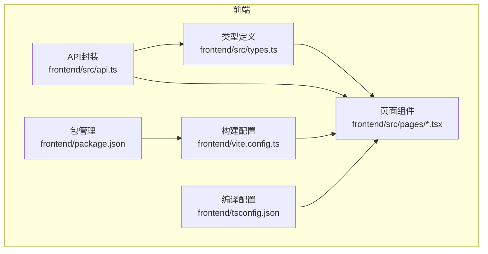
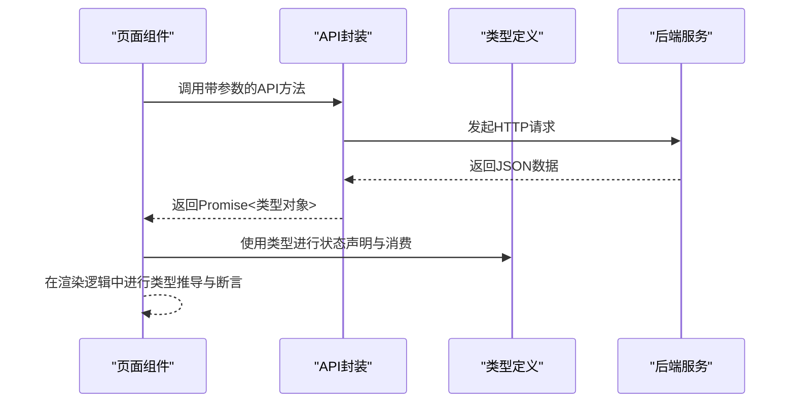
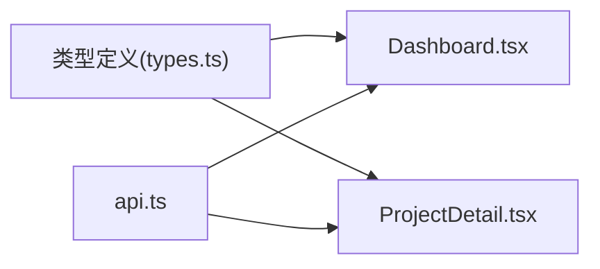

# TypeScript类型定义

<cite>
**本文引用的文件**
- [frontend/src/types.ts](file://frontend/src/types.ts)
- [frontend/src/api.ts](file://frontend/src/api.ts)
- [frontend/src/pages/Dashboard.tsx](file://frontend/src/pages/Dashboard.tsx)
- [frontend/src/pages/ProjectDetail.tsx](file://frontend/src/pages/ProjectDetail.tsx)
- [frontend/src/App.tsx](file://frontend/src/App.tsx)
- [frontend/tsconfig.json](file://frontend/tsconfig.json)
- [frontend/package.json](file://frontend/package.json)
- [frontend/vite.config.ts](file://frontend/vite.config.ts)
</cite>

## 目录
1. [简介](#简介)
2. [项目结构](#项目结构)
3. [核心组件](#核心组件)
4. [架构总览](#架构总览)
5. [详细组件分析](#详细组件分析)
6. [依赖关系分析](#依赖关系分析)
7. [性能考量](#性能考量)
8. [故障排查指南](#故障排查指南)
9. [结论](#结论)
10. [附录](#附录)

## 简介
本文件聚焦于前端应用的TypeScript类型系统设计与类型安全策略，围绕核心业务实体（如项目、研究会话、研究发现等）展开，系统阐述接口设计原则、类型约束规则、泛型使用场景与实现方式、类型推导与断言的最佳实践、类型扩展与模块化组织方式，以及类型检查配置与编译时错误处理策略。文档同时给出与源码一一对应的“章节来源”和“图表来源”，便于读者对照定位到具体实现。

## 项目结构
前端采用Vite + React + TypeScript技术栈，类型定义集中于统一的类型模块，页面组件通过导入类型进行强类型约束；API层负责与后端交互，并在调用处对返回值进行类型化消费。

图表来源
- [frontend/src/types.ts:1-89](file://frontend/src/types.ts#L1-L89)
- [frontend/src/api.ts:1-45](file://frontend/src/api.ts#L1-L45)
- [frontend/src/pages/Dashboard.tsx:1-140](file://frontend/src/pages/Dashboard.tsx#L1-L140)
- [frontend/src/pages/ProjectDetail.tsx:1-385](file://frontend/src/pages/ProjectDetail.tsx#L1-L385)
- [frontend/vite.config.ts:1-12](file://frontend/vite.config.ts#L1-L12)
- [frontend/tsconfig.json:1-20](file://frontend/tsconfig.json#L1-L20)
- [frontend/package.json:1-24](file://frontend/package.json#L1-L24)

章节来源
- [frontend/src/types.ts:1-89](file://frontend/src/types.ts#L1-L89)
- [frontend/src/api.ts:1-45](file://frontend/src/api.ts#L1-L45)
- [frontend/src/pages/Dashboard.tsx:1-140](file://frontend/src/pages/Dashboard.tsx#L1-L140)
- [frontend/src/pages/ProjectDetail.tsx:1-385](file://frontend/src/pages/ProjectDetail.tsx#L1-L385)
- [frontend/vite.config.ts:1-12](file://frontend/vite.config.ts#L1-L12)
- [frontend/tsconfig.json:1-20](file://frontend/tsconfig.json#L1-L20)
- [frontend/package.json:1-24](file://frontend/package.json#L1-L24)

## 核心组件
本节从类型系统角度梳理核心实体类型与使用场景，强调可选字段、字面量联合类型、Record映射类型等的设计意图与约束效果。

- 项目（Project）
  - 关键字段：标识、名称、使命、领域、配置JSON、状态、创建时间；可选统计信息对象。
  - 设计要点：使用可选字段承载可延迟或按需加载的统计数据，避免强制同步拉取。
  - 使用场景：仪表盘聚合统计、详情页展示与导航。

- 项目统计（ProjectStats）
  - 关键字段：会话总数、已完成会话数、发现总数、可执行发现数、已验证发现数、待研究队列数。
  - 设计要点：以数值聚合指标为主，便于UI快速渲染与计算。

- 队列项（QueueItem）
  - 关键字段：标识、所属项目、主题、优先级、来源、状态、创建时间。
  - 设计要点：来源与状态为枚举化字符串，配合Record映射在UI中呈现标签样式与文案。

- 会话（Session）
  - 关键字段：标识、所属项目、主题、引擎类型、状态、研究假设、验证结果、发现、后续方向、数据摘要、耗时、创建时间。
  - 设计要点：多段文本内容以字符串形式存储，解析由组件内部JSON.parse处理，类型层面保持字符串兼容性。

- 研究发现（Finding）
  - 关键字段：标识、所属项目、所属会话、会话主题、发现内容、类别、置信度、证据、是否可执行、行动建议、状态、创建时间。
  - 设计要点：置信度与状态为字符串枚举，UI侧通过Record映射转换为标签颜色与文案。

- 数据集（Dataset）
  - 关键字段：标识、所属项目、名称、来源、模式JSON、行数、状态、创建时间。
  - 设计要点：模式JSON用于动态展示字段名与类型，解析在组件内进行。

- 指令（Directive）
  - 关键字段：标识、所属项目、指令内容、优先级、状态、创建时间。
  - 设计要点：优先级为数值，便于排序与筛选。

- 记忆条目（MemoryEntry）
  - 关键字段：标识、所属项目、类型、内容、上下文数据、创建时间。
  - 设计要点：类型为字符串枚举，UI侧通过Record映射呈现不同语义标签。

章节来源
- [frontend/src/types.ts:1-89](file://frontend/src/types.ts#L1-L89)
- [frontend/src/pages/Dashboard.tsx:1-140](file://frontend/src/pages/Dashboard.tsx#L1-L140)
- [frontend/src/pages/ProjectDetail.tsx:1-385](file://frontend/src/pages/ProjectDetail.tsx#L1-L385)

## 架构总览
类型系统在前端中的作用是贯穿“数据获取—类型消费—UI渲染”的全链路保障。API层返回的数据经由类型模块约束，页面组件在useState/useEffect/useParams等Hook中以强类型方式消费，确保编译期与运行期的一致性。

图表来源
- [frontend/src/api.ts:1-45](file://frontend/src/api.ts#L1-L45)
- [frontend/src/types.ts:1-89](file://frontend/src/types.ts#L1-L89)
- [frontend/src/pages/Dashboard.tsx:1-140](file://frontend/src/pages/Dashboard.tsx#L1-L140)
- [frontend/src/pages/ProjectDetail.tsx:1-385](file://frontend/src/pages/ProjectDetail.tsx#L1-L385)

## 详细组件分析

### 类型定义与接口设计
- 接口设计原则
  - 明确字段职责：每个接口仅包含与业务含义直接相关的字段，避免过度宽泛。
  - 可选字段与必填字段分离：通过可选字段承载可延迟或条件性数据，减少强制依赖。
  - 字符串枚举与Record映射：对状态、来源、类型等有限集合使用字符串枚举，并在UI层以Record映射为标签颜色与文案。
  - JSON字段的类型约束：对于以字符串存储的JSON字段（如配置、模式、多段文本），在类型层面保持字符串兼容，在组件内部进行JSON.parse解析。

- 类型约束规则
  - 数值字段：如优先级、行数、耗时等，明确为数字类型，便于排序与计算。
  - 时间字段：统一为字符串格式，便于跨组件传递与显示。
  - 复合字段：如统计对象、会话内的多段文本数组，通过接口嵌套表达层次关系。

章节来源
- [frontend/src/types.ts:1-89](file://frontend/src/types.ts#L1-L89)

### 泛型类型使用场景与实现
- 当前代码未显式使用泛型类型（如<T>、Array<T>等）。若需要扩展：
  - 对API返回的通用集合进行泛型约束，例如将“列表查询”抽象为泛型函数，统一处理分页与过滤参数。
  - 对UI组件的props进行泛型约束，提升组件复用性与类型安全性。
- 实践建议
  - 将常用查询参数抽象为泛型接口，结合URLSearchParams实现类型安全的查询串拼接。
  - 对异步数据加载的状态机进行泛型建模，区分loading、success、error三态。

章节来源
- [frontend/src/api.ts:22-28](file://frontend/src/api.ts#L22-L28)

### 类型推导与类型断言最佳实践
- 类型推导
  - useState与useEffect：通过导入类型，让React状态自动推导为强类型，避免隐式any。
  - useParams：在路由参数解析后，通过Number()转换为数字类型，再以类型断言确保后续逻辑安全。
- 类型断言
  - 在UI层对JSON.parse结果进行类型断言（如any[]），并在try/catch中保证异常分支的安全性。
  - 在数组映射中对元素进行类型断言，确保渲染逻辑的健壮性。
- 最佳实践
  - 优先使用类型守卫（如Array.isArray、Object.prototype.hasOwnProperty）替代断言。
  - 对外部输入（如后端返回、用户输入）始终进行类型校验与边界检查。

章节来源
- [frontend/src/pages/Dashboard.tsx:16-20](file://frontend/src/pages/Dashboard.tsx#L16-L20)
- [frontend/src/pages/ProjectDetail.tsx:107-111](file://frontend/src/pages/ProjectDetail.tsx#L107-L111)
- [frontend/src/pages/ProjectDetail.tsx:113-159](file://frontend/src/pages/ProjectDetail.tsx#L113-L159)
- [frontend/src/pages/ProjectDetail.tsx:161-209](file://frontend/src/pages/ProjectDetail.tsx#L161-L209)
- [frontend/src/pages/ProjectDetail.tsx:211-259](file://frontend/src/pages/ProjectDetail.tsx#L211-L259)
- [frontend/src/pages/ProjectDetail.tsx:261-306](file://frontend/src/pages/ProjectDetail.tsx#L261-L306)
- [frontend/src/pages/ProjectDetail.tsx:308-375](file://frontend/src/pages/ProjectDetail.tsx#L308-L375)

### 类型扩展与模块化组织
- 模块化组织
  - 将所有业务实体类型集中于单一模块（types.ts），便于跨页面共享与维护。
  - 页面组件通过import type引入类型，避免引入实际实现，降低打包体积。
- 扩展策略
  - 新增实体类型时，遵循现有命名与字段风格，保持一致性。
  - 对于可选字段，优先考虑是否应纳入主接口或拆分为独立统计接口。
  - 对于枚举字段，统一在类型层定义常量或Record映射，避免魔法字符串散落各处。

章节来源
- [frontend/src/types.ts:1-89](file://frontend/src/types.ts#L1-L89)
- [frontend/src/pages/Dashboard.tsx:4](file://frontend/src/pages/Dashboard.tsx#L4)
- [frontend/src/pages/ProjectDetail.tsx:4](file://frontend/src/pages/ProjectDetail.tsx#L4)

### 类型检查配置与编译时错误处理
- 编译配置（tsconfig.json）
  - 严格模式开启（strict: true），确保更严格的类型检查。
  - 禁用未使用局部变量与参数检查（noUnusedLocals/noUnusedParameters），平衡严格性与开发效率。
  - 模块解析采用bundler，与Vite集成良好。
- 构建脚本（package.json）
  - dev/build脚本分别对应开发与生产构建流程，确保类型检查在构建阶段生效。
- 错误处理
  - API层对非OK响应抛出错误，页面组件在调用处进行try/catch，避免未捕获异常导致崩溃。
  - 对JSON解析异常进行容错处理，防止解析失败影响整体渲染。

章节来源
- [frontend/tsconfig.json:1-20](file://frontend/tsconfig.json#L1-L20)
- [frontend/package.json:6-10](file://frontend/package.json#L6-L10)
- [frontend/src/api.ts:3-7](file://frontend/src/api.ts#L3-L7)
- [frontend/src/pages/ProjectDetail.tsx:319-336](file://frontend/src/pages/ProjectDetail.tsx#L319-L336)

### 具体类型定义与使用场景
- 项目（Project）
  - 定义位置：[frontend/src/types.ts:1-10](file://frontend/src/types.ts#L1-L10)
  - 使用位置：仪表盘加载与渲染、项目详情页展示。
  - 示例路径：[frontend/src/pages/Dashboard.tsx:16-20](file://frontend/src/pages/Dashboard.tsx#L16-L20)，[frontend/src/pages/ProjectDetail.tsx:15-17](file://frontend/src/pages/ProjectDetail.tsx#L15-L17)

- 研究发现（Finding）
  - 定义位置：[frontend/src/types.ts:46-59](file://frontend/src/types.ts#L46-L59)
  - 使用位置：发现标签页筛选与展示、置信度标签映射。
  - 示例路径：[frontend/src/pages/ProjectDetail.tsx:63-105](file://frontend/src/pages/ProjectDetail.tsx#L63-L105)，[frontend/src/pages/ProjectDetail.tsx:107-111](file://frontend/src/pages/ProjectDetail.tsx#L107-L111)

- 会话（Session）
  - 定义位置：[frontend/src/types.ts:31-44](file://frontend/src/types.ts#L31-L44)
  - 使用位置：会话列表与详情展示、JSON字段解析。
  - 示例路径：[frontend/src/pages/ProjectDetail.tsx:113-159](file://frontend/src/pages/ProjectDetail.tsx#L113-L159)，[frontend/src/pages/ProjectDetail.tsx:161-209](file://frontend/src/pages/ProjectDetail.tsx#L161-L209)

- 队列项（QueueItem）
  - 定义位置：[frontend/src/types.ts:21-29](file://frontend/src/types.ts#L21-L29)
  - 使用位置：队列管理表格与新增。
  - 示例路径：[frontend/src/pages/ProjectDetail.tsx:211-259](file://frontend/src/pages/ProjectDetail.tsx#L211-L259)

- 数据集（Dataset）
  - 定义位置：[frontend/src/types.ts:61-70](file://frontend/src/types.ts#L61-L70)
  - 使用位置：数据集上传与模式展示。
  - 示例路径：[frontend/src/pages/ProjectDetail.tsx:261-306](file://frontend/src/pages/ProjectDetail.tsx#L261-L306)

- 指令（Directive）
  - 定义位置：[frontend/src/types.ts:72-79](file://frontend/src/types.ts#L72-L79)
  - 使用位置：AI团队指令展示。
  - 示例路径：[frontend/src/pages/ProjectDetail.tsx:308-375](file://frontend/src/pages/ProjectDetail.tsx#L308-L375)

- 记忆条目（MemoryEntry）
  - 定义位置：[frontend/src/types.ts:81-88](file://frontend/src/types.ts#L81-L88)
  - 使用位置：AI团队记忆展示。
  - 示例路径：[frontend/src/pages/ProjectDetail.tsx:308-375](file://frontend/src/pages/ProjectDetail.tsx#L308-L375)

## 依赖关系分析
类型系统与页面组件、API封装之间的依赖关系如下：

图表来源
- [frontend/src/types.ts:1-89](file://frontend/src/types.ts#L1-L89)
- [frontend/src/pages/Dashboard.tsx:1-140](file://frontend/src/pages/Dashboard.tsx#L1-L140)
- [frontend/src/pages/ProjectDetail.tsx:1-385](file://frontend/src/pages/ProjectDetail.tsx#L1-L385)
- [frontend/src/api.ts:1-45](file://frontend/src/api.ts#L1-L45)

章节来源
- [frontend/src/types.ts:1-89](file://frontend/src/types.ts#L1-L89)
- [frontend/src/pages/Dashboard.tsx:1-140](file://frontend/src/pages/Dashboard.tsx#L1-L140)
- [frontend/src/pages/ProjectDetail.tsx:1-385](file://frontend/src/pages/ProjectDetail.tsx#L1-L385)
- [frontend/src/api.ts:1-45](file://frontend/src/api.ts#L1-L45)

## 性能考量
- 类型检查成本
  - 严格模式下类型检查更严格，但不会影响运行时性能；可通过合理拆分类型与模块化降低编译时间。
- 运行时性能
  - JSON解析仅在必要时进行，且在组件内部进行容错处理，避免影响整体渲染性能。
  - 使用Record映射进行状态/来源到UI样式的映射，避免重复判断逻辑，提升渲染效率。

## 故障排查指南
- 常见问题
  - 后端返回字段与类型不一致：检查类型定义与后端接口文档，必要时增加类型守卫或默认值。
  - JSON解析失败：在组件内部对JSON.parse进行try/catch，并提供默认空数组/空对象。
  - 路由参数类型错误：在useParams后进行Number()转换，并在后续逻辑中进行类型断言或守卫。
- 错误处理策略
  - API层统一抛错，页面组件在调用处进行try/catch与错误提示。
  - 对可选字段进行空值检查，避免访问undefined属性。

章节来源
- [frontend/src/api.ts:3-7](file://frontend/src/api.ts#L3-L7)
- [frontend/src/pages/ProjectDetail.tsx:161-209](file://frontend/src/pages/ProjectDetail.tsx#L161-L209)
- [frontend/src/pages/ProjectDetail.tsx:319-336](file://frontend/src/pages/ProjectDetail.tsx#L319-L336)

## 结论
该前端类型系统以“集中定义、模块化导入、严格检查、运行时容错”为核心策略，既保证了编译期类型安全，又兼顾了运行时的健壮性。通过清晰的接口设计与合理的类型断言/守卫实践，有效降低了跨组件协作与API交互中的错误率。建议在未来扩展中引入泛型与更细粒度的类型抽象，进一步提升代码复用性与可维护性。

## 附录
- 类型定义清单
  - Project、ProjectStats、QueueItem、Session、Finding、Dataset、Directive、MemoryEntry
- 关键使用点
  - Dashboard.tsx：项目列表加载与统计聚合
  - ProjectDetail.tsx：发现、会话、队列、数据集、团队模块的完整类型消费
  - api.ts：类型驱动的API参数与返回值约束