# 前端应用

<cite>
**本文档引用的文件**
- [App.tsx](file://frontend/src/App.tsx)
- [Dashboard.tsx](file://frontend/src/pages/Dashboard.tsx)
- [ProjectDetail.tsx](file://frontend/src/pages/ProjectDetail.tsx)
- [api.ts](file://frontend/src/api.ts)
- [types.ts](file://frontend/src/types.ts)
- [main.tsx](file://frontend/src/main.tsx)
- [package.json](file://frontend/package.json)
- [vite.config.ts](file://frontend/vite.config.ts)
- [tsconfig.json](file://frontend/tsconfig.json)
- [README.md](file://README.md)
</cite>

## 目录
1. [简介](#简介)
2. [项目结构](#项目结构)
3. [核心组件](#核心组件)
4. [架构总览](#架构总览)
5. [详细组件分析](#详细组件分析)
6. [依赖关系分析](#依赖关系分析)
7. [性能考虑](#性能考虑)
8. [故障排除指南](#故障排除指南)
9. [结论](#结论)
10. [附录](#附录)

## 简介

AInstein 是一个基于 React 的单页应用（SPA），为用户提供 AI 深度研究平台的前端界面。该应用采用现代前端技术栈，包括 React 18、TypeScript、Vite 构建工具和 React Router 进行页面导航。应用的核心功能是管理研究项目，支持三级 AI 团队协作（科学家、主任、研究员）进行数据驱动的研究工作流。

应用的主要特点包括：
- 响应式设计和现代化 UI
- 类型安全的 TypeScript 实现
- 基于 RESTful API 的数据交互
- 支持多种研究功能：项目管理、研究会话、发现追踪、数据集管理等
- 内置主题系统和状态管理

## 项目结构

前端项目采用标准的 React 应用结构，主要目录组织如下：

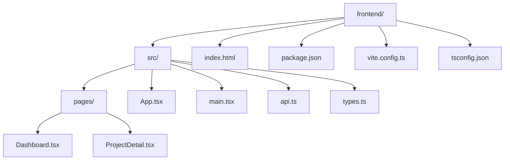

**图表来源**
- [package.json:1-24](file://frontend/package.json#L1-L24)
- [vite.config.ts:1-12](file://frontend/vite.config.ts#L1-L12)

**章节来源**
- [package.json:1-24](file://frontend/package.json#L1-L24)
- [vite.config.ts:1-12](file://frontend/vite.config.ts#L1-L12)
- [tsconfig.json:1-20](file://frontend/tsconfig.json#L1-L20)

## 核心组件

### 应用入口点

应用的入口点位于 `main.tsx`，负责设置路由基础路径和渲染根组件：

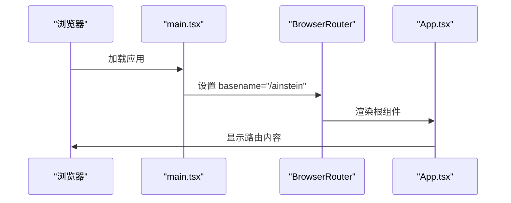

**图表来源**
- [main.tsx:6-12](file://frontend/src/main.tsx#L6-L12)
- [App.tsx:5-12](file://frontend/src/App.tsx#L5-L12)

### 路由配置

应用使用 React Router 进行页面导航，配置了两个主要路由：
- 根路径 `/` 显示 Dashboard 页面
- 项目详情路径 `/project/:id` 显示 ProjectDetail 页面

**章节来源**
- [App.tsx:1-13](file://frontend/src/App.tsx#L1-L13)
- [main.tsx:3-12](file://frontend/src/main.tsx#L3-L12)

## 架构总览

应用采用典型的前端 SPA 架构，分为以下几个层次：

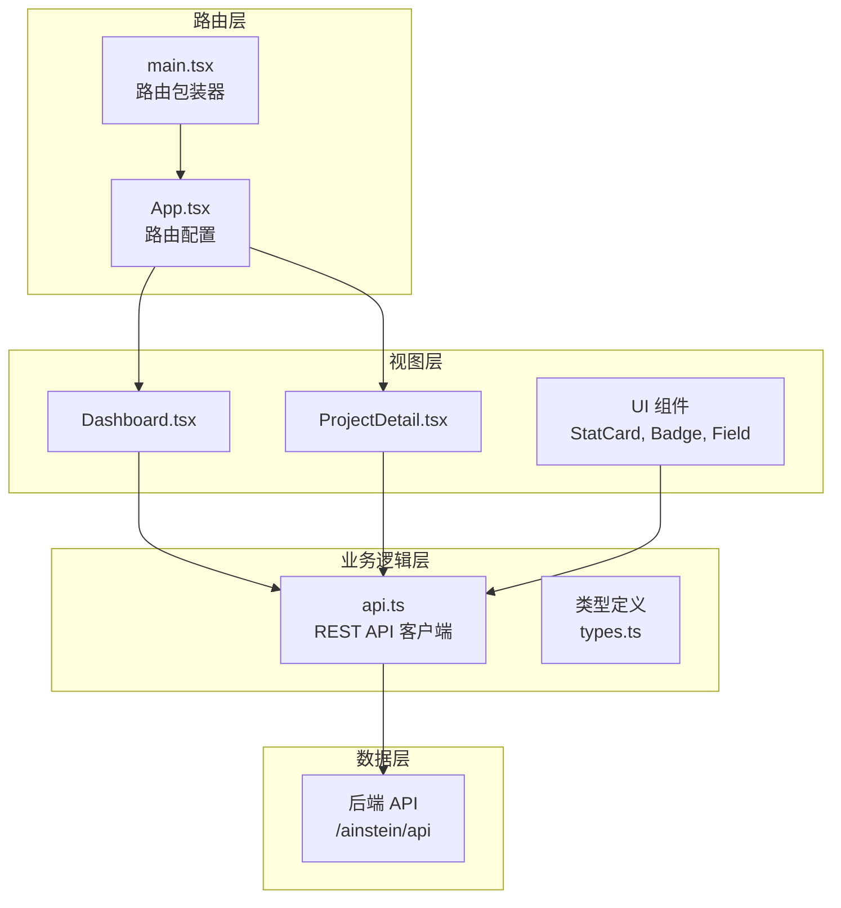

**图表来源**
- [App.tsx:1-13](file://frontend/src/App.tsx#L1-L13)
- [api.ts:9-44](file://frontend/src/api.ts#L9-L44)
- [types.ts:1-89](file://frontend/src/types.ts#L1-L89)

## 详细组件分析

### Dashboard 页面

Dashboard 页面是应用的主界面，负责展示所有研究项目的概览信息。

#### 组件结构

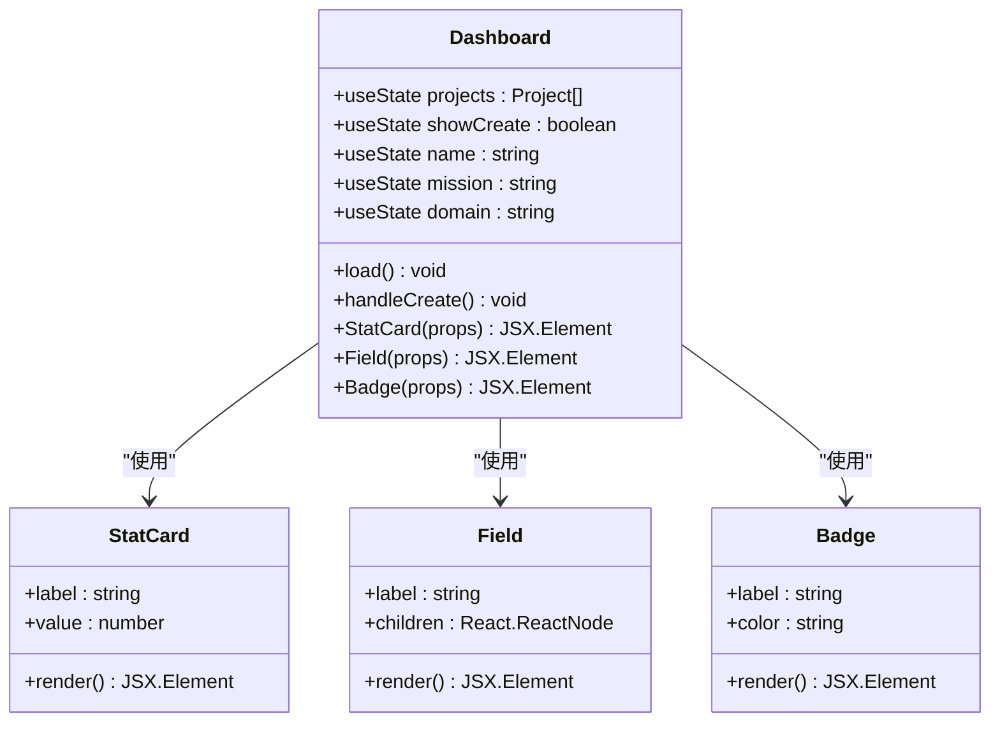

**图表来源**
- [Dashboard.tsx:6-140](file://frontend/src/pages/Dashboard.tsx#L6-L140)

#### 核心功能实现

Dashboard 页面实现了以下核心功能：

1. **项目列表加载**：通过 `api.listProjects()` 获取项目列表，然后为每个项目调用 `api.getProject()` 获取详细信息
2. **统计数据计算**：聚合所有项目的统计信息，包括研究项目总数、已完成会话数、研究发现数
3. **项目卡片展示**：使用网格布局展示项目卡片，点击卡片导航到项目详情页面
4. **项目创建表单**：提供模态框用于创建新项目

#### 用户交互流程

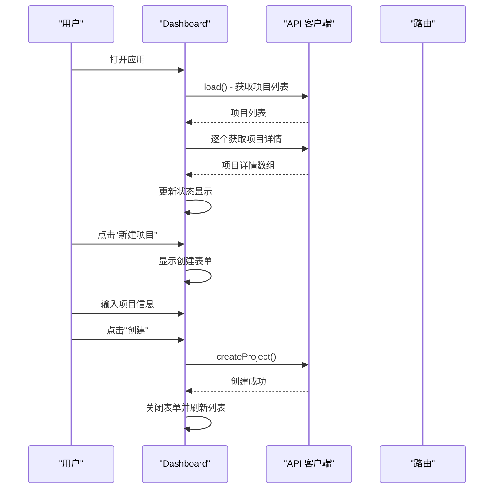

**图表来源**
- [Dashboard.tsx:14-28](file://frontend/src/pages/Dashboard.tsx#L14-L28)

**章节来源**
- [Dashboard.tsx:1-140](file://frontend/src/pages/Dashboard.tsx#L1-L140)

### ProjectDetail 页面

ProjectDetail 页面提供单个项目的所有详细信息和操作功能。

#### 页面结构

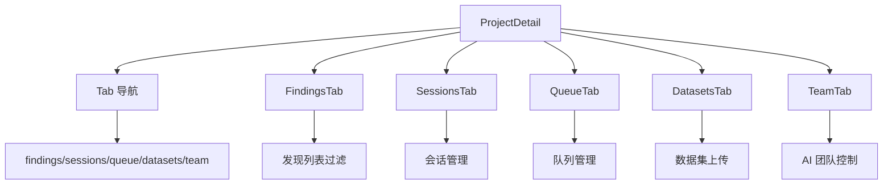

**图表来源**
- [ProjectDetail.tsx:8-61](file://frontend/src/pages/ProjectDetail.tsx#L8-L61)

#### 功能模块详解

##### 发现管理 (FindingsTab)

发现管理功能允许用户查看、筛选和管理研究发现：

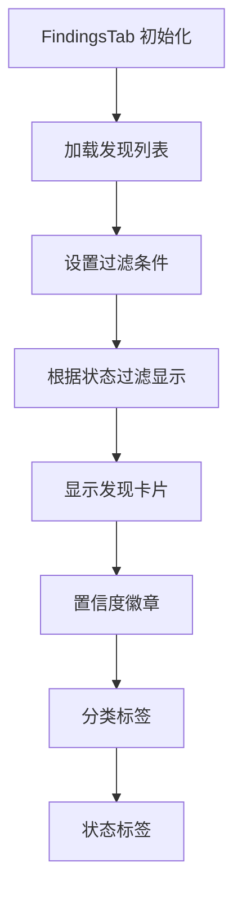

**图表来源**
- [ProjectDetail.tsx:63-105](file://frontend/src/pages/ProjectDetail.tsx#L63-L105)

##### 会话管理 (SessionsTab)

会话管理功能提供研究会话的启动、查看和详情展示：

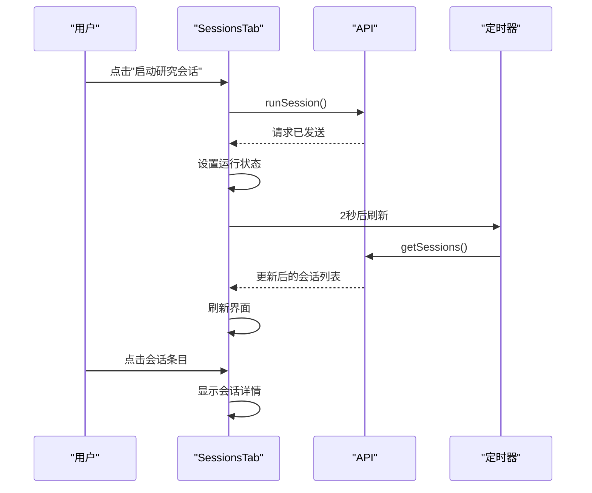

**图表来源**
- [ProjectDetail.tsx:113-159](file://frontend/src/pages/ProjectDetail.tsx#L113-L159)

##### 队列管理 (QueueTab)

队列管理功能允许用户添加新的研究课题到队列中：

```mermaid
flowchart TD
A[QueueTab 初始化] --> B[加载队列项目]
B --> C[用户输入课题]
C --> D[选择优先级]
D --> E[点击"添加"按钮]
E --> F[调用 addQueueItem API]
F --> G[清空输入框]
G --> H[重新加载队列]
```

**图表来源**
- [ProjectDetail.tsx:211-259](file://frontend/src/pages/ProjectDetail.tsx#L211-L259)

##### 数据集管理 (DatasetsTab)

数据集管理功能支持 CSV、JSON 和 Excel 文件的上传和管理：

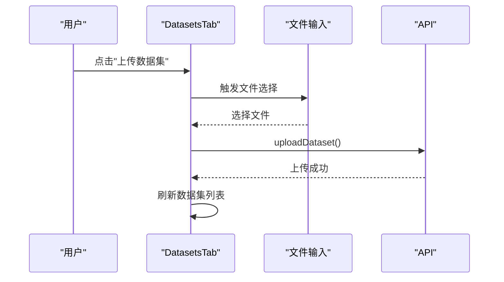

**图表来源**
- [ProjectDetail.tsx:261-306](file://frontend/src/pages/ProjectDetail.tsx#L261-L306)

##### AI 团队管理 (TeamTab)

AI 团队管理功能提供科学家和主任的运行控制：

```mermaid
flowchart TD
A[TeamTab 初始化] --> B[加载指令和记忆]
B --> C[用户点击"运行科学家"]
C --> D[调用 runScientist API]
D --> E[更新消息状态]
E --> F[重新加载数据]
B --> G[用户点击"运行主任"]
G --> H[调用 runDirector API]
H --> E
```

**图表来源**
- [ProjectDetail.tsx:308-375](file://frontend/src/pages/ProjectDetail.tsx#L308-L375)

**章节来源**
- [ProjectDetail.tsx:1-385](file://frontend/src/pages/ProjectDetail.tsx#L1-L385)

### API 集成

应用通过统一的 API 客户端与后端服务进行通信，所有 API 调用都通过 `api.ts` 文件中的函数进行封装。

#### API 客户端设计

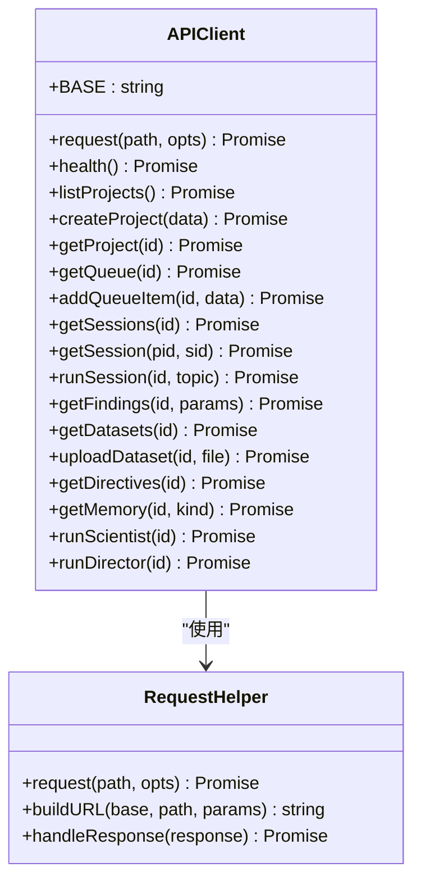

**图表来源**
- [api.ts:3-7](file://frontend/src/api.ts#L3-L7)
- [api.ts:9-44](file://frontend/src/api.ts#L9-L44)

#### API 调用流程

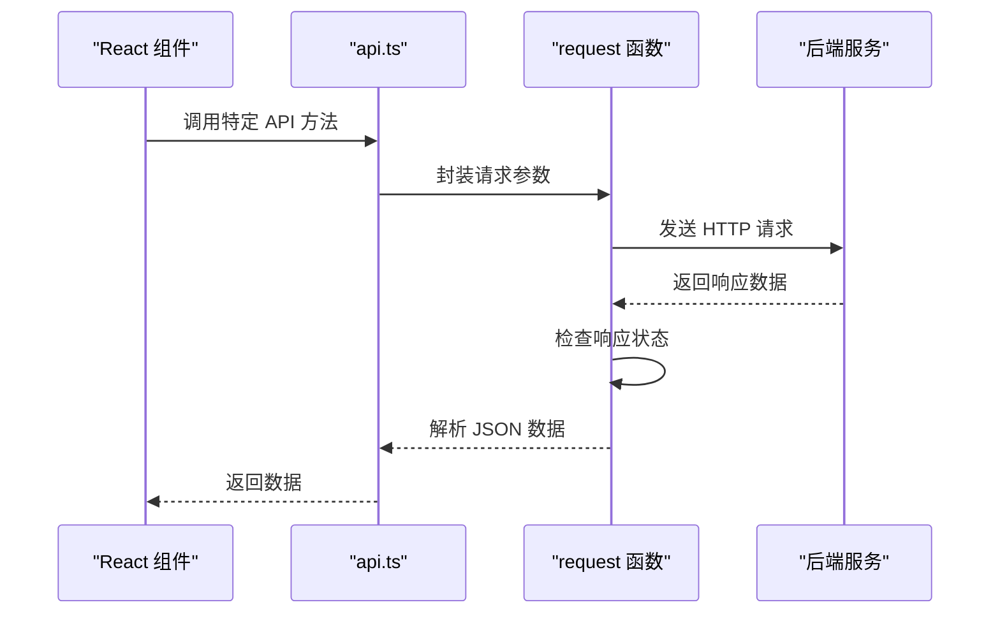

**图表来源**
- [api.ts:3-7](file://frontend/src/api.ts#L3-L7)

**章节来源**
- [api.ts:1-45](file://frontend/src/api.ts#L1-L45)

### TypeScript 类型定义

应用使用严格的 TypeScript 类型系统确保类型安全，主要的数据模型定义如下：

#### 核心数据模型

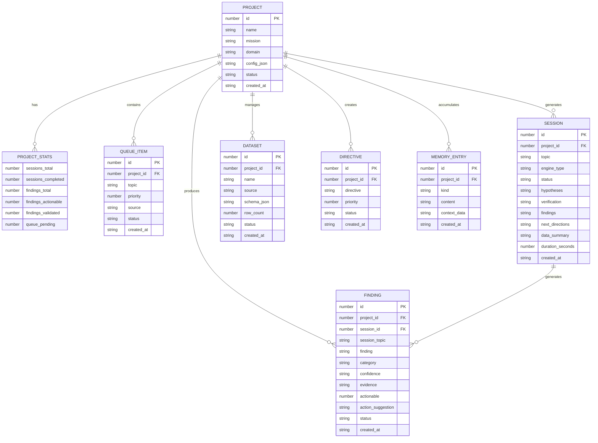

**图表来源**
- [types.ts:1-89](file://frontend/src/types.ts#L1-L89)

**章节来源**
- [types.ts:1-89](file://frontend/src/types.ts#L1-L89)

## 依赖关系分析

### 外部依赖

应用使用以下主要依赖包：

```mermaid
graph TD
A[React 应用] --> B[react@^18.3.1]
A --> C[react-dom@^18.3.1]
A --> D[react-router-dom@^6.23.1]
E[开发依赖] --> F[@types/react@^18.3.3]
E --> G[@types/react-dom@^18.3.0]
E --> H[@vitejs/plugin-react@^4.3.0]
E --> I[typescript@^5.4.5]
E --> J[vite@^5.2.12]
```

**图表来源**
- [package.json:11-22](file://frontend/package.json#L11-L22)

### 内部模块依赖

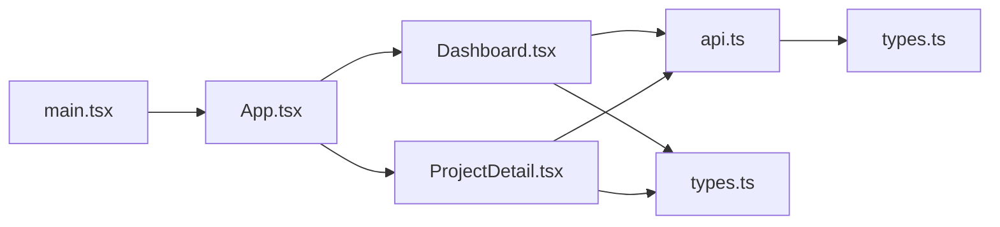

**图表来源**
- [main.tsx:1-13](file://frontend/src/main.tsx#L1-L13)
- [App.tsx:1-13](file://frontend/src/App.tsx#L1-L13)

**章节来源**
- [package.json:1-24](file://frontend/package.json#L1-L24)

## 性能考虑

### 构建优化

应用使用 Vite 作为构建工具，具有以下性能优势：

1. **快速冷启动**：Vite 使用 ES Modules，启动速度极快
2. **热重载**：开发时提供即时的热重载体验
3. **按需编译**：只编译当前使用的模块

### 运行时优化

1. **状态管理**：使用 React 内置的状态管理，避免额外的性能开销
2. **组件拆分**：将 UI 组件拆分为独立的可复用组件
3. **样式内联**：使用内联样式减少 CSS 文件大小

### API 调用优化

1. **批量请求**：在 Dashboard 中使用 `Promise.all` 并行获取项目详情
2. **条件加载**：仅在需要时加载特定页面的数据
3. **错误处理**：统一的错误处理机制避免应用崩溃

## 故障排除指南

### 常见问题及解决方案

#### API 连接问题

**症状**：页面显示加载失败或空白

**可能原因**：
1. 后端服务未启动
2. 网络连接问题
3. CORS 配置错误

**解决步骤**：
1. 确认后端服务正在监听端口
2. 检查网络连接状态
3. 验证 API 基础路径 `/ainstein/api`

#### 类型错误

**症状**：TypeScript 编译报错

**常见原因**：
1. API 返回数据格式变化
2. 类型定义不匹配
3. 缺少必要的类型导入

**解决方法**：
1. 更新类型定义以匹配后端 API
2. 检查 API 返回的数据结构
3. 添加适当的类型断言或默认值

#### 路由问题

**症状**：页面无法正确导航

**解决步骤**：
1. 检查路由配置是否正确
2. 验证 `basename` 设置
3. 确认路由参数传递

**章节来源**
- [api.ts:3-7](file://frontend/src/api.ts#L3-L7)

## 结论

AInstein 前端应用展现了现代 React 开发的最佳实践，具有以下特点：

1. **清晰的架构设计**：采用分层架构，职责分离明确
2. **类型安全**：完整的 TypeScript 类型定义确保代码质量
3. **良好的用户体验**：响应式设计和直观的用户界面
4. **可维护性**：模块化设计便于代码维护和扩展
5. **性能优化**：合理的状态管理和 API 调用策略

该应用为 AI 深度研究平台提供了完整且易用的前端界面，支持复杂的研究工作流和数据分析需求。

## 附录

### 开发环境设置

1. **前置要求**：Node.js 18+
2. **安装依赖**：`npm install`
3. **启动开发服务器**：`npm run dev`
4. **访问地址**：`http://localhost:5173/ainstein/`

### 构建和部署

1. **生产构建**：`npm run build`
2. **预览构建**：`npm run preview`
3. **部署位置**：构建产物位于 `frontend/dist/` 目录

### API 接口规范

应用通过统一的 API 客户端与后端交互，所有 API 调用都遵循 RESTful 设计原则，支持标准的 HTTP 方法和状态码。