# 前端应用

<cite>
**本文档引用的文件**
- [App.tsx](file://frontend/src/App.tsx)
- [BrainList.tsx](file://frontend/src/pages/BrainList.tsx)
- [BrainView.tsx](file://frontend/src/pages/BrainView.tsx)
- [CreateBrain.tsx](file://frontend/src/pages/CreateBrain.tsx)
- [Login.tsx](file://frontend/src/pages/Login.tsx)
- [ProjectDetail.tsx](file://frontend/src/pages/ProjectDetail.tsx)
- [Dashboard.tsx](file://frontend/src/pages/Dashboard.tsx)
- [api.ts](file://frontend/src/api.ts)
- [types.ts](file://frontend/src/types.ts)
- [main.tsx](file://frontend/src/main.tsx)
- [package.json](file://frontend/package.json)
- [vite.config.ts](file://frontend/vite.config.ts)
- [tsconfig.json](file://frontend/tsconfig.json)
- [README.md](file://README.md)
</cite>

## 目录
1. [简介](#简介)
2. [项目结构](#项目结构)
3. [核心组件](#核心组件)
4. [架构总览](#架构总览)
5. [详细组件分析](#详细组件分析)
6. [依赖关系分析](#依赖关系分析)
7. [性能考虑](#性能考虑)
8. [故障排除指南](#故障排除指南)
9. [结论](#结论)
10. [附录](#附录)

## 简介

AInstein 是一个基于 React 的单页应用（SPA），为用户提供 AI 深度研究平台的前端界面。该应用采用现代前端技术栈，包括 React 18、TypeScript、Vite 构建工具和 React Router 进行页面导航。应用的核心功能是管理研究项目，支持三级 AI 团队协作（科学家、主任、研究员）进行数据驱动的研究工作流。

应用的主要特点包括：
- 响应式设计和现代化 UI
- 类型安全的 TypeScript 实现
- 基于 RESTful API 的数据交互
- 支持多种研究功能：项目管理、研究会话、发现追踪、数据集管理等
- 内置主题系统和状态管理

## 项目结构

前端项目采用标准的 React 应用结构，主要目录组织如下：

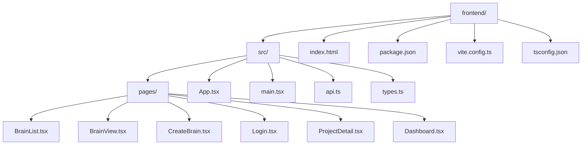

**图表来源**
- [package.json:1-24](file://frontend/package.json#L1-L24)
- [vite.config.ts:1-12](file://frontend/vite.config.ts#L1-L12)

**章节来源**
- [package.json:1-24](file://frontend/package.json#L1-L24)
- [vite.config.ts:1-12](file://frontend/vite.config.ts#L1-L12)
- [tsconfig.json:1-20](file://frontend/tsconfig.json#L1-L20)

## 核心组件

### 应用入口点

应用的入口点位于 `main.tsx`，负责设置路由基础路径和渲染根组件：

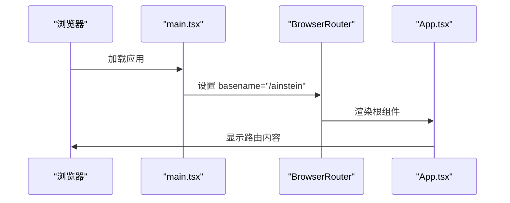

**图表来源**
- [main.tsx:6-12](file://frontend/src/main.tsx#L6-L12)
- [App.tsx:5-12](file://frontend/src/App.tsx#L5-L12)

### 路由配置

应用使用 React Router 进行页面导航，配置了多个路由：
- 根路径 `/` 根据认证状态重定向到 `/brains` 或 `/login`
- 认证页面 `/login` 显示登录/注册表单
- 大脑管理页面 `/brains` 显示大脑列表
- 创建大脑页面 `/brains/new` 提供大脑创建功能
- 大脑视图页面 `/brain/:brainId` 展示知识图谱可视化
- 保留的旧版路由 `/dashboard` 和 `/project/:id` 用于兼容

**章节来源**
- [App.tsx:1-56](file://frontend/src/App.tsx#L1-L56)
- [main.tsx:3-12](file://frontend/src/main.tsx#L3-L12)

## 架构总览

应用采用典型的前端 SPA 架构，分为以下几个层次：

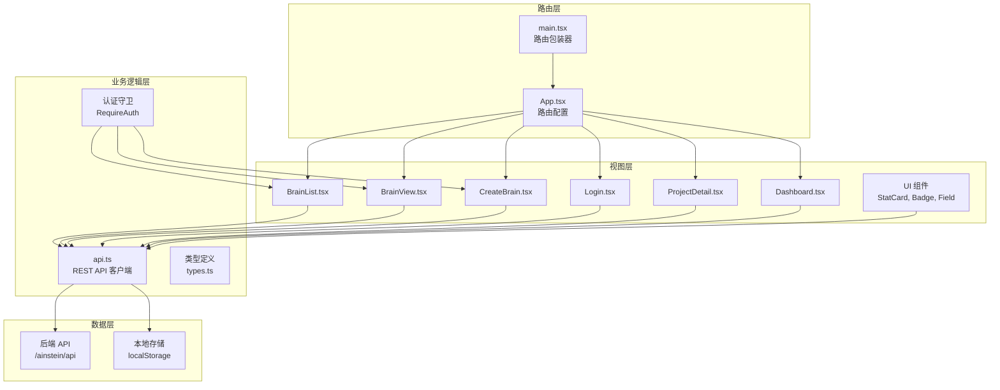

**图表来源**
- [App.tsx:1-56](file://frontend/src/App.tsx#L1-L56)
- [api.ts:9-44](file://frontend/src/api.ts#L9-L44)
- [types.ts:1-89](file://frontend/src/types.ts#L1-L89)

## 详细组件分析

### 认证页面

Login 页面提供用户身份验证功能，支持登录和注册两种模式。

#### 组件结构

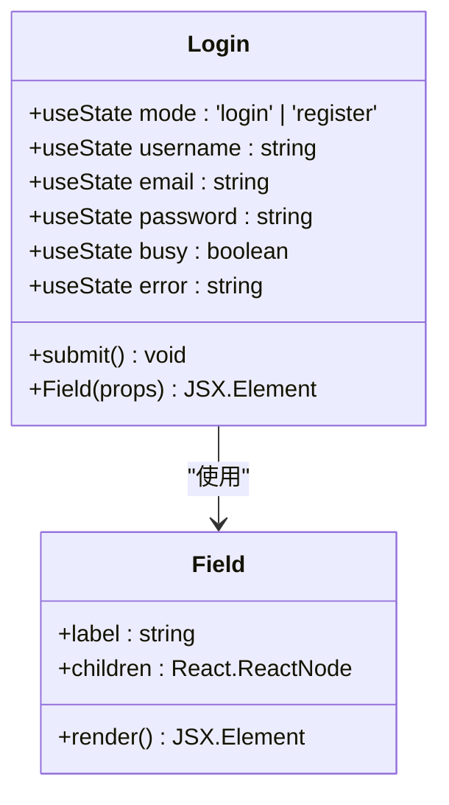

**图表来源**
- [Login.tsx:1-262](file://frontend/src/pages/Login.tsx#L1-L262)

#### 核心功能实现

Login 页面实现了以下核心功能：

1. **双模式切换**：通过 `mode` 状态在登录和注册之间切换
2. **表单验证**：验证用户名和密码格式，防止空值提交
3. **API 调用**：调用 `api.login()` 或 `api.register()` 进行身份验证
4. **状态管理**：使用 `setToken()` 和 `setStoredUser()` 管理认证状态
5. **导航控制**：根据认证状态自动跳转到相应页面

#### 用户交互流程

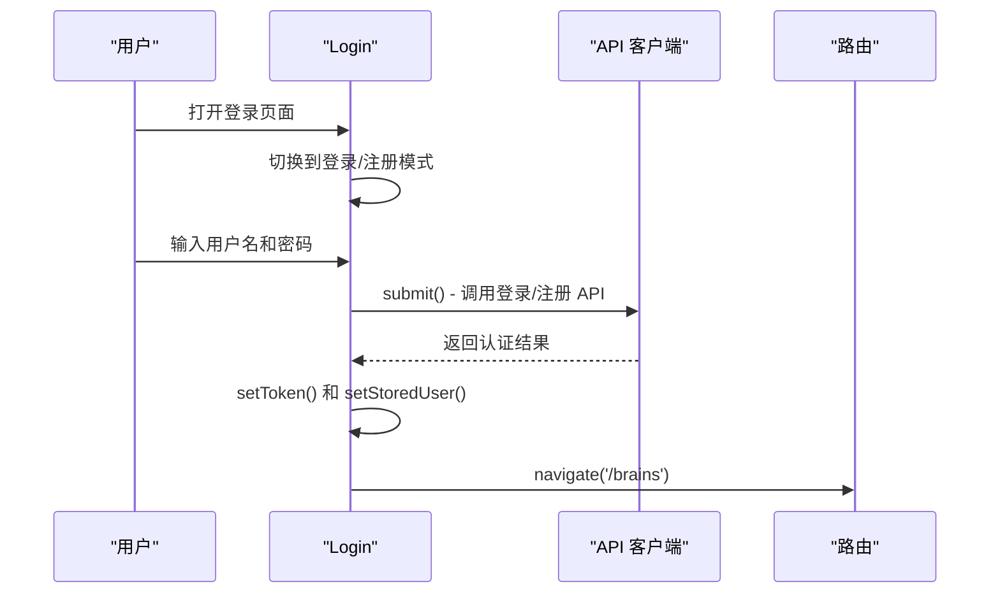

**图表来源**
- [Login.tsx:22-48](file://frontend/src/pages/Login.tsx#L22-L48)

**章节来源**
- [Login.tsx:1-262](file://frontend/src/pages/Login.tsx#L1-L262)

### 大脑管理界面

BrainList 页面是应用的核心界面，负责展示和管理所有大脑实例。

#### 组件结构

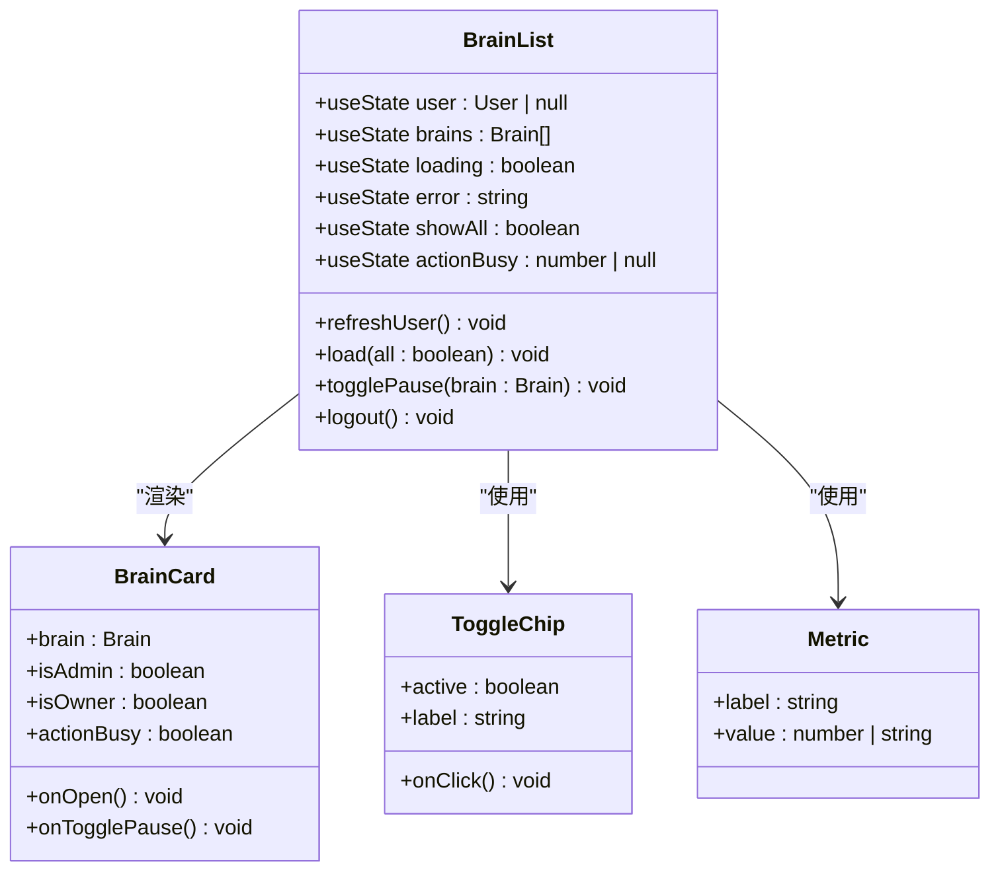

**图表来源**
- [BrainList.tsx:26-363](file://frontend/src/pages/BrainList.tsx#L26-L363)

#### 核心功能实现

BrainList 页面实现了以下核心功能：

1. **用户认证**：通过 `api.me()` 获取当前用户信息，支持管理员视图
2. **大脑列表加载**：通过 `api.listBrains()` 获取大脑列表，支持管理员查看所有大脑
3. **状态管理**：管理大脑的暂停/恢复状态，支持管理员操作
4. **导航功能**：点击大脑卡片跳转到对应的 `BrainView` 页面
5. **用户管理**：提供登出功能，清除认证状态

#### 用户交互流程

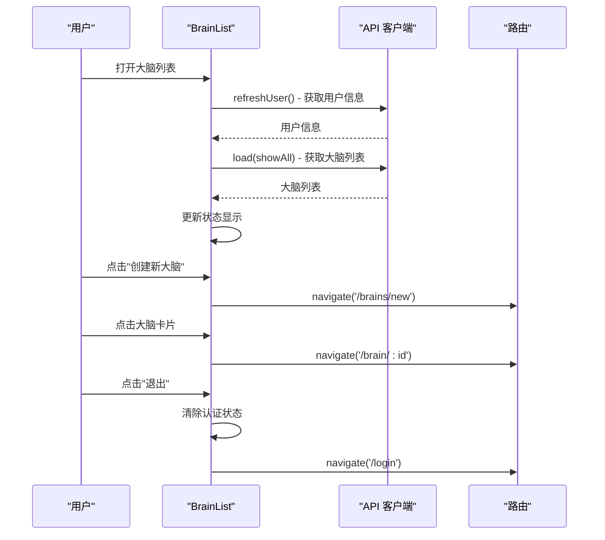

**图表来源**
- [BrainList.tsx:37-90](file://frontend/src/pages/BrainList.tsx#L37-L90)

**章节来源**
- [BrainList.tsx:1-363](file://frontend/src/pages/BrainList.tsx#L1-L363)

### 大脑创建页面

CreateBrain 页面提供创建新大脑的功能，支持种子问题输入和自定义大脑名称。

#### 组件结构

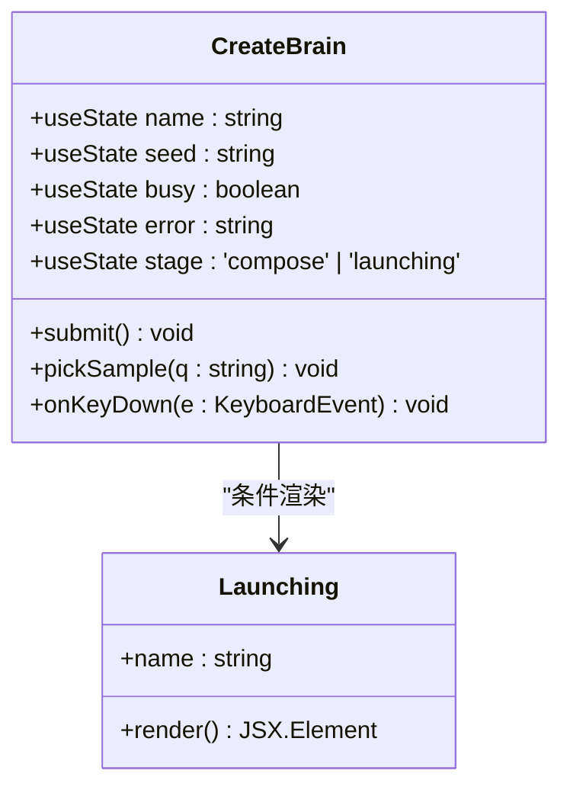

**图表来源**
- [CreateBrain.tsx:12-340](file://frontend/src/pages/CreateBrain.tsx#L12-L340)

#### 核心功能实现

CreateBrain 页面实现了以下核心功能：

1. **种子问题输入**：提供文本区域让用户输入种子问题，支持键盘快捷键
2. **样本问题**：提供预设的问题样本，用户可一键选择
3. **创建流程**：调用 `api.createBrain()` 创建大脑实例
4. **进度反馈**：显示"点燃"动画效果，模拟大脑创建过程
5. **自动跳转**：创建完成后自动跳转到项目详情页面

#### 用户交互流程

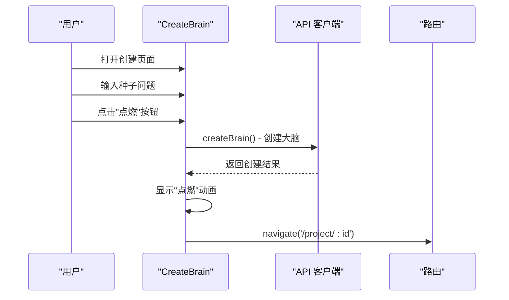

**图表来源**
- [CreateBrain.tsx:29-54](file://frontend/src/pages/CreateBrain.tsx#L29-L54)

**章节来源**
- [CreateBrain.tsx:1-340](file://frontend/src/pages/CreateBrain.tsx#L1-L340)

### 大脑知识图谱视图

BrainView 页面提供大脑内部认知图谱的可视化展示，使用 D3.js 实现动态图形渲染。

#### 组件结构

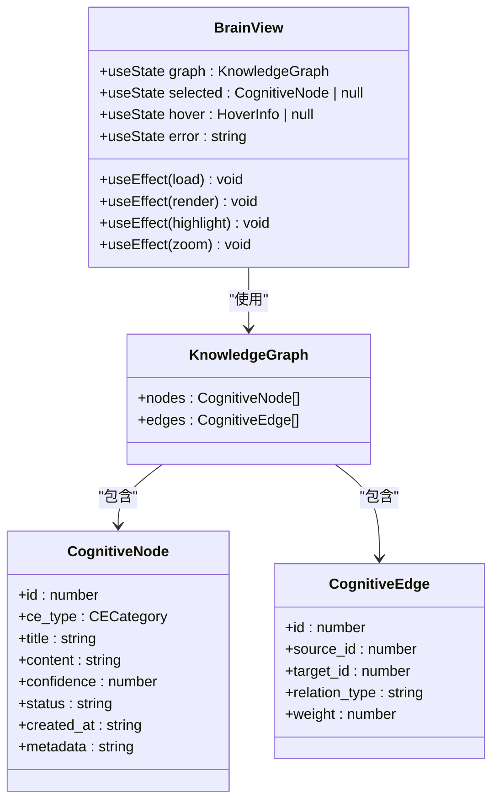

**图表来源**
- [BrainView.tsx:70-724](file://frontend/src/pages/BrainView.tsx#L70-L724)

#### 核心功能实现

BrainView 页面实现了以下核心功能：

1. **实时数据加载**：每10秒轮询一次知识图谱数据，保持界面实时更新
2. **D3.js 图形渲染**：使用力导向图算法渲染认知节点和关系边
3. **交互功能**：支持节点悬停、点击选择、拖拽移动、缩放平移
4. **节点高亮**：选中节点时高亮显示相关联的节点和边
5. **信息面板**：显示选中节点的详细信息和元数据

#### 用户交互流程

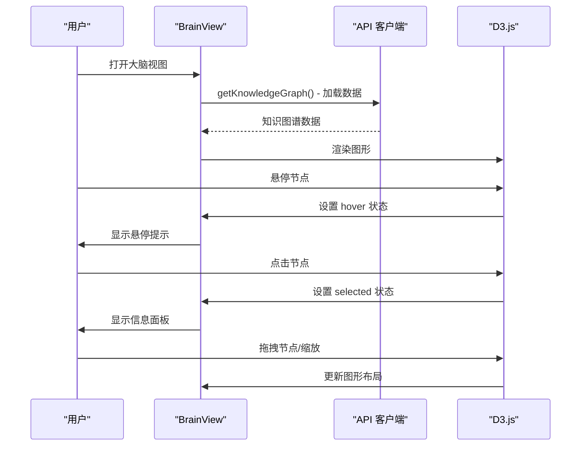

**图表来源**
- [BrainView.tsx:86-104](file://frontend/src/pages/BrainView.tsx#L86-L104)

**章节来源**
- [BrainView.tsx:1-724](file://frontend/src/pages/BrainView.tsx#L1-L724)

### 项目详情页面

ProjectDetail 页面提供单个项目的所有详细信息和操作功能。

#### 页面结构

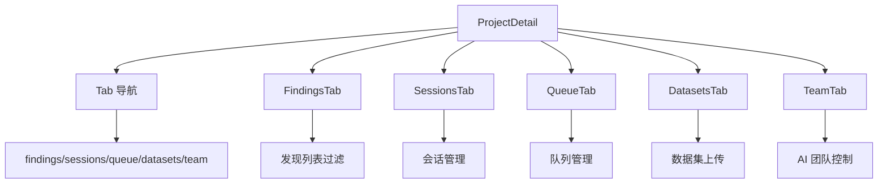

**图表来源**
- [ProjectDetail.tsx:8-61](file://frontend/src/pages/ProjectDetail.tsx#L8-L61)

#### 功能模块详解

##### 发现管理 (FindingsTab)

发现管理功能允许用户查看、筛选和管理研究发现：

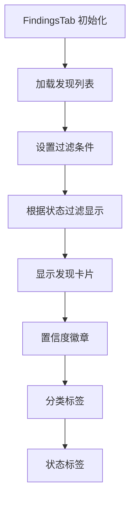

**图表来源**
- [ProjectDetail.tsx:63-105](file://frontend/src/pages/ProjectDetail.tsx#L63-L105)

##### 会话管理 (SessionsTab)

会话管理功能提供研究会话的启动、查看和详情展示：

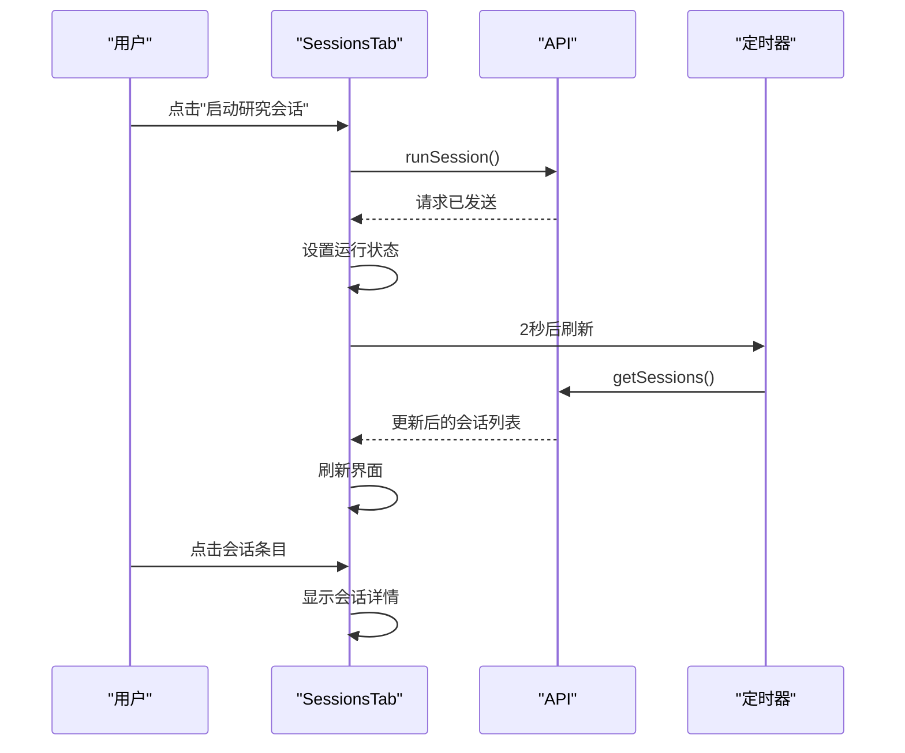

**图表来源**
- [ProjectDetail.tsx:113-159](file://frontend/src/pages/ProjectDetail.tsx#L113-L159)

##### 队列管理 (QueueTab)

队列管理功能允许用户添加新的研究课题到队列中：

```mermaid
flowchart TD
A[QueueTab 初始化] --> B[加载队列项目]
B --> C[用户输入课题]
C --> D[选择优先级]
D --> E[点击"添加"按钮]
E --> F[调用 addQueueItem API]
F --> G[清空输入框]
G --> H[重新加载队列]
```

**图表来源**
- [ProjectDetail.tsx:211-259](file://frontend/src/pages/ProjectDetail.tsx#L211-L259)

##### 数据集管理 (DatasetsTab)

数据集管理功能支持 CSV、JSON 和 Excel 文件的上传和管理：

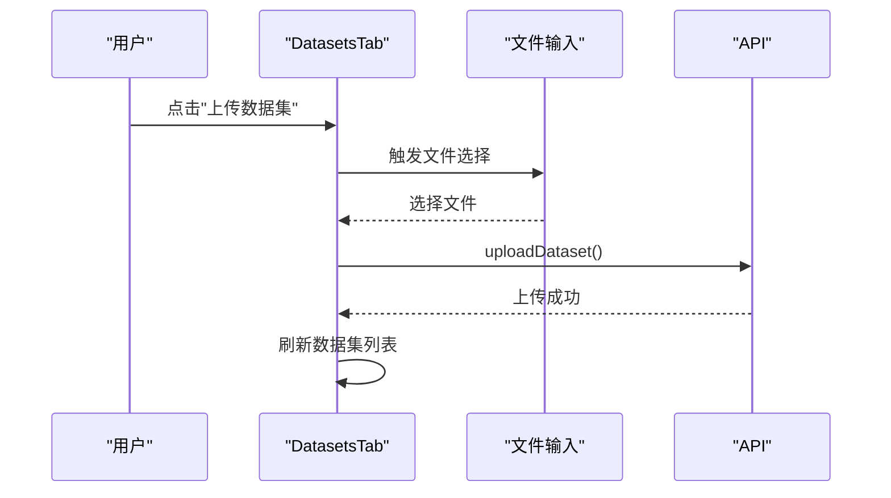

**图表来源**
- [ProjectDetail.tsx:261-306](file://frontend/src/pages/ProjectDetail.tsx#L261-L306)

##### AI 团队管理 (TeamTab)

AI 团队管理功能提供科学家和主任的运行控制：

```mermaid
flowchart TD
A[TeamTab 初始化] --> B[加载指令和记忆]
B --> C[用户点击"运行科学家"]
C --> D[调用 runScientist API]
D --> E[更新消息状态]
E --> F[重新加载数据]
B --> G[用户点击"运行主任"]
G --> H[调用 runDirector API]
H --> E
```

**图表来源**
- [ProjectDetail.tsx:308-375](file://frontend/src/pages/ProjectDetail.tsx#L308-L375)

**章节来源**
- [ProjectDetail.tsx:1-385](file://frontend/src/pages/ProjectDetail.tsx#L1-L385)

### API 集成

应用通过统一的 API 客户端与后端服务进行通信，所有 API 调用都通过 `api.ts` 文件中的函数进行封装。

#### API 客户端设计

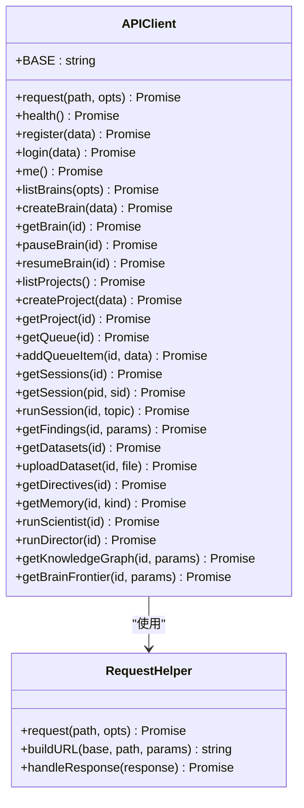

**图表来源**
- [api.ts:3-7](file://frontend/src/api.ts#L3-L7)
- [api.ts:9-44](file://frontend/src/api.ts#L9-L44)

#### API 调用流程

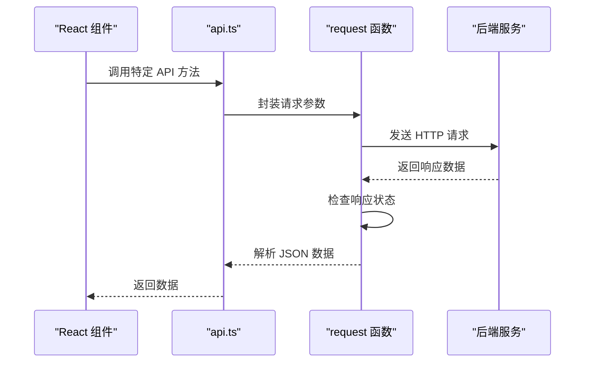

**图表来源**
- [api.ts:3-7](file://frontend/src/api.ts#L3-L7)

**章节来源**
- [api.ts:1-163](file://frontend/src/api.ts#L1-L163)

### TypeScript 类型定义

应用使用严格的 TypeScript 类型系统确保类型安全，主要的数据模型定义如下：

#### 核心数据模型

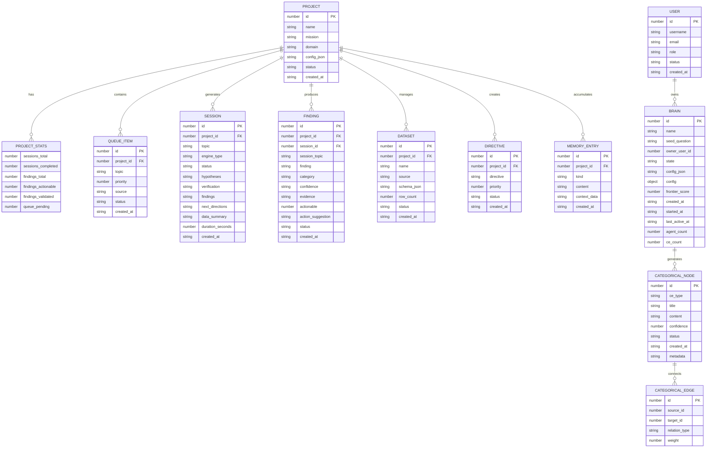

**图表来源**
- [types.ts:1-164](file://frontend/src/types.ts#L1-L164)

**章节来源**
- [types.ts:1-164](file://frontend/src/types.ts#L1-L164)

## 依赖关系分析

### 外部依赖

应用使用以下主要依赖包：

```mermaid
graph TD
A[React 应用] --> B[react@^18.3.1]
A --> C[react-dom@^18.3.1]
A --> D[react-router-dom@^6.23.1]
E[开发依赖] --> F[@types/react@^18.3.3]
E --> G[@types/react-dom@^18.3.0]
E --> H[@vitejs/plugin-react@^4.3.0]
E --> I[typescript@^5.4.5]
E --> J[vite@^5.2.12]
```

**图表来源**
- [package.json:11-22](file://frontend/package.json#L11-L22)

### 内部模块依赖

```mermaid
graph LR
A[main.tsx] --> B[App.tsx]
B --> C[BrainList.tsx]
B --> D[BrainView.tsx]
B --> E[CreateBrain.tsx]
B --> F[Login.tsx]
B --> G[ProjectDetail.tsx]
C --> H[api.ts]
D --> H
E --> H
F --> H
G --> H
C --> I[types.ts]
D --> I
E --> I
F --> I
G --> I
H --> I
```

**图表来源**
- [main.tsx:1-13](file://frontend/src/main.tsx#L1-L13)
- [App.tsx:1-56](file://frontend/src/App.tsx#L1-L56)

**章节来源**
- [package.json:1-24](file://frontend/package.json#L1-L24)

## 性能考虑

### 构建优化

应用使用 Vite 作为构建工具，具有以下性能优势：

1. **快速冷启动**：Vite 使用 ES Modules，启动速度极快
2. **热重载**：开发时提供即时的热重载体验
3. **按需编译**：只编译当前使用的模块

### 运行时优化

1. **状态管理**：使用 React 内置的状态管理，避免额外的性能开销
2. **组件拆分**：将 UI 组件拆分为独立的可复用组件
3. **样式内联**：使用内联样式减少 CSS 文件大小
4. **D3.js 优化**：在 BrainView 中使用高效的图形渲染和更新策略

### API 调用优化

1. **批量请求**：在 Dashboard 中使用 `Promise.all` 并行获取项目详情
2. **条件加载**：仅在需要时加载特定页面的数据
3. **错误处理**：统一的错误处理机制避免应用崩溃
4. **轮询优化**：BrainView 使用 10 秒间隔轮询，平衡实时性和性能

## 故障排除指南

### 常见问题及解决方案

#### API 连接问题

**症状**：页面显示加载失败或空白

**可能原因**：
1. 后端服务未启动
2. 网络连接问题
3. CORS 配置错误

**解决步骤**：
1. 确认后端服务正在监听端口
2. 检查网络连接状态
3. 验证 API 基础路径 `/ainstein/api`

#### 类型错误

**症状**：TypeScript 编译报错

**常见原因**：
1. API 返回数据格式变化
2. 类型定义不匹配
3. 缺少必要的类型导入

**解决方法**：
1. 更新类型定义以匹配后端 API
2. 检查 API 返回的数据结构
3. 添加适当的类型断言或默认值

#### 路由问题

**症状**：页面无法正确导航

**解决步骤**：
1. 检查路由配置是否正确
2. 验证 `basename` 设置
3. 确认路由参数传递

#### 认证问题

**症状**：登录后无法访问受保护页面

**解决步骤**：
1. 检查 `getToken()` 是否正确返回令牌
2. 验证 `RequireAuth` 组件逻辑
3. 确认 `localStorage` 中的认证状态

**章节来源**
- [api.ts:3-7](file://frontend/src/api.ts#L3-L7)

## 结论

AInstein 前端应用展现了现代 React 开发的最佳实践，具有以下特点：

1. **清晰的架构设计**：采用分层架构，职责分离明确
2. **类型安全**：完整的 TypeScript 类型定义确保代码质量
3. **良好的用户体验**：响应式设计和直观的用户界面
4. **可维护性**：模块化设计便于代码维护和扩展
5. **性能优化**：合理的状态管理和 API 调用策略
6. **丰富的功能**：从认证到大脑管理再到知识图谱可视化的完整功能链

该应用为 AI 深度研究平台提供了完整且易用的前端界面，支持复杂的大脑管理和研究工作流需求。

## 附录

### 开发环境设置

1. **前置要求**：Node.js 18+
2. **安装依赖**：`npm install`
3. **启动开发服务器**：`npm run dev`
4. **访问地址**：`http://localhost:5173/ainstein/`

### 构建和部署

1. **生产构建**：`npm run build`
2. **预览构建**：`npm run preview`
3. **部署位置**：构建产物位于 `frontend/dist/` 目录

### API 接口规范

应用通过统一的 API 客户端与后端交互，所有 API 调用都遵循 RESTful 设计原则，支持标准的 HTTP 方法和状态码。

### 新架构变更说明

本次前端架构重构引入了以下重要变更：

1. **移除旧版 Dashboard**：原有的项目管理界面被大脑管理界面替代
2. **新增认证系统**：完整的登录/注册功能，支持用户身份验证
3. **大脑管理界面**：全新的大脑生命周期管理功能
4. **知识图谱可视化**：强大的 D3.js 图形渲染能力
5. **保留兼容路由**：旧版 `/dashboard` 和 `/project/:id` 路由用于向后兼容

这些变更使应用从传统的项目管理转向了更先进的人工智能大脑管理平台。