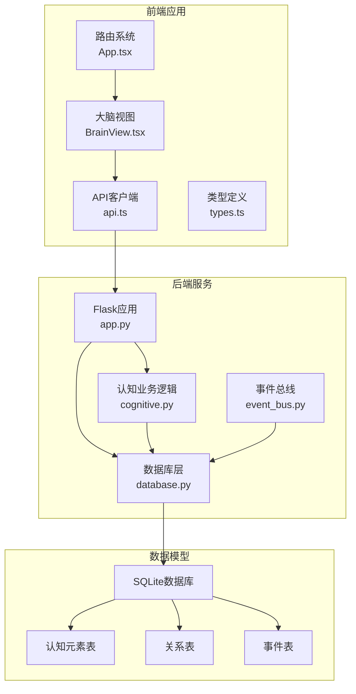
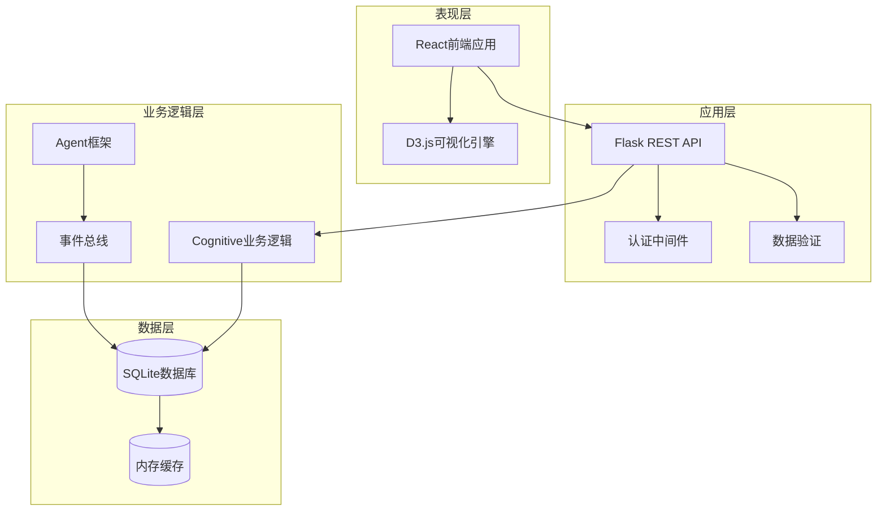
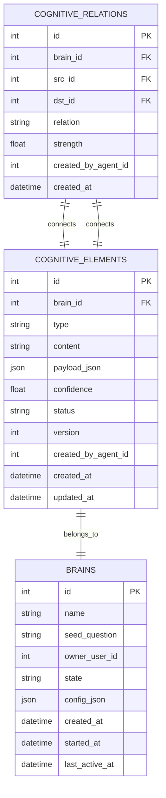
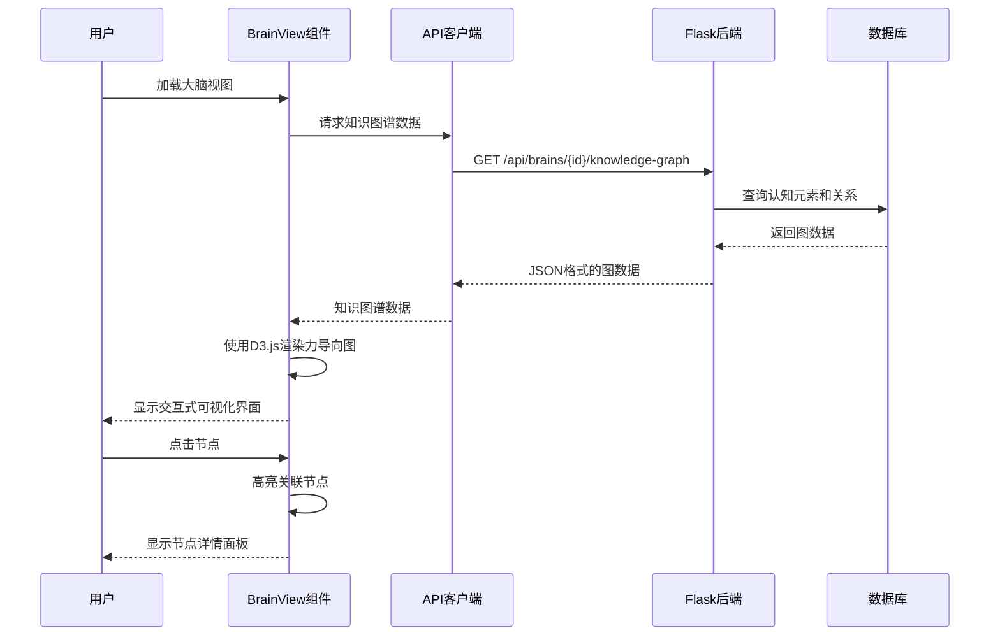
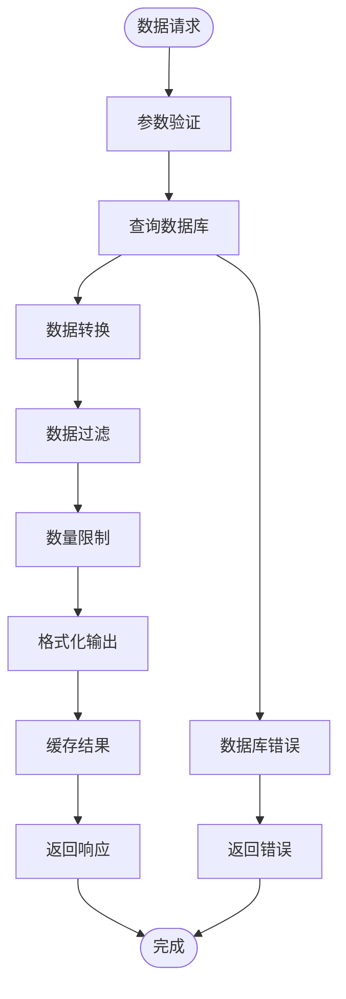
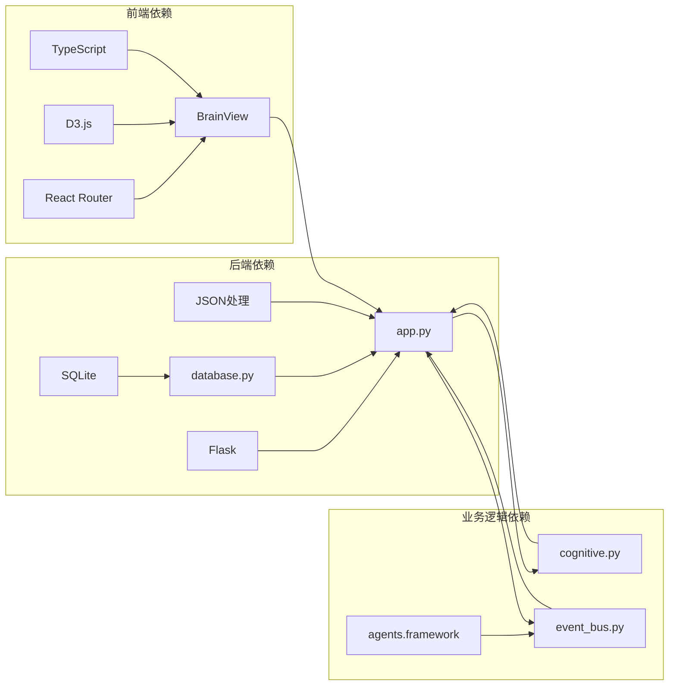

# 知识图谱可视化

<cite>
**本文档引用的文件**
- [README.md](file://README.md)
- [app.py](file://app.py)
- [cognitive.py](file://cognitive.py)
- [database.py](file://database.py)
- [frontend/src/App.tsx](file://frontend/src/App.tsx)
- [frontend/src/pages/BrainView.tsx](file://frontend/src/pages/BrainView.tsx)
- [frontend/src/types.ts](file://frontend/src/types.ts)
- [frontend/src/api.ts](file://frontend/src/api.ts)
</cite>

## 目录
1. [简介](#简介)
2. [项目结构](#项目结构)
3. [核心组件](#核心组件)
4. [架构概览](#架构概览)
5. [详细组件分析](#详细组件分析)
6. [依赖关系分析](#依赖关系分析)
7. [性能考虑](#性能考虑)
8. [故障排除指南](#故障排除指南)
9. [结论](#结论)

## 简介

AInstein 是一个开源的"硅基生命体"孵化器项目，专注于构建具备自主意识的硅基大脑。该项目的核心创新在于实现了完整的知识图谱可视化系统，通过力导向图展示了AI代理之间的思维网络。

该项目采用前后端分离架构，后端基于Flask提供RESTful API，前端使用React + D3.js实现交互式知识图谱可视化。系统支持实时数据同步、节点高亮、关系标注等功能，为用户提供直观的思维过程观察界面。

## 项目结构

项目采用模块化设计，主要分为以下几个核心部分：

**图表来源**
- [app.py:1-1054](file://app.py#L1-L1054)
- [database.py:1-877](file://database.py#L1-L877)
- [frontend/src/App.tsx:1-56](file://frontend/src/App.tsx#L1-L56)

**章节来源**
- [README.md:186-212](file://README.md#L186-L212)

## 核心组件

### 后端核心组件

#### Flask应用层
后端采用Flask框架提供RESTful API服务，支持用户认证、大脑管理、知识图谱查询等功能。应用层负责路由分发、请求验证和响应格式化。

#### 数据库层
数据库层采用SQLite作为存储引擎，设计了专门的硅基大脑数据模型，包括认知元素、关系、事件等核心表结构。支持ACID事务和外键约束，确保数据一致性。

#### 认知业务逻辑层
认知业务逻辑层封装了知识图谱的核心算法，包括节点和边的查询、置信度更新、认知边界计算等功能。为前端提供标准化的数据接口。

### 前端核心组件

#### React应用层
前端采用React 18 + TypeScript构建，使用React Router实现SPA路由管理。应用层负责页面导航、状态管理和组件协调。

#### D3.js可视化层
基于D3.js实现力导向图可视化，支持节点拖拽、缩放、高亮等交互功能。通过物理模拟算法实现节点间的动态布局。

#### API客户端层
提供统一的API访问接口，封装HTTP请求、认证令牌管理和错误处理逻辑。

**章节来源**
- [app.py:520-674](file://app.py#L520-L674)
- [cognitive.py:327-398](file://cognitive.py#L327-L398)
- [frontend/src/pages/BrainView.tsx:70-308](file://frontend/src/pages/BrainView.tsx#L70-L308)

## 架构概览

系统采用经典的三层架构设计，实现了前后端分离和数据持久化：

**图表来源**
- [app.py:12-40](file://app.py#L12-L40)
- [cognitive.py:1-516](file://cognitive.py#L1-L516)
- [frontend/src/App.tsx:16-55](file://frontend/src/App.tsx#L16-L55)

## 详细组件分析

### 知识图谱数据模型

系统设计了完整的认知元素层次体系，包含12种类型的节点和10种关系类型：

**图表来源**
- [database.py:135-168](file://database.py#L135-L168)
- [database.py:118-130](file://database.py#L118-L130)

### 前端可视化组件

前端使用D3.js实现力导向图，支持多种交互功能：

**图表来源**
- [frontend/src/pages/BrainView.tsx:86-104](file://frontend/src/pages/BrainView.tsx#L86-L104)
- [frontend/src/api.ts:144-150](file://frontend/src/api.ts#L144-L150)
- [app.py:654-673](file://app.py#L654-L673)

### 数据流处理

系统实现了完整的数据流处理管道，从数据采集到可视化呈现：

**图表来源**
- [cognitive.py:327-398](file://cognitive.py#L327-L398)
- [database.py:675-689](file://database.py#L675-L689)

**章节来源**
- [cognitive.py:24-51](file://cognitive.py#L24-L51)
- [frontend/src/pages/BrainView.tsx:114-308](file://frontend/src/pages/BrainView.tsx#L114-L308)

## 依赖关系分析

系统各组件之间的依赖关系清晰明确：

**图表来源**
- [frontend/src/App.tsx:1-56](file://frontend/src/App.tsx#L1-L56)
- [app.py:1-11](file://app.py#L1-L11)
- [cognitive.py:14-16](file://cognitive.py#L14-L16)

**章节来源**
- [app.py:16-21](file://app.py#L16-L21)
- [database.py:288-295](file://database.py#L288-L295)

## 性能考虑

系统在设计时充分考虑了性能优化：

### 数据库优化
- 使用SQLite WAL模式提高并发性能
- 为常用查询字段建立索引
- 实现分页查询避免大数据量传输

### 前端性能优化
- D3.js力导向图使用物理模拟算法
- 节点和边的增量更新减少重绘开销
- 实现节点选择性高亮功能

### 缓存策略
- 前端实现数据缓存机制
- 后端使用连接池管理数据库连接
- API响应数据进行压缩传输

## 故障排除指南

### 常见问题及解决方案

#### 数据加载失败
**症状**: 知识图谱页面显示空白或加载错误
**原因**: API请求失败或数据库连接问题
**解决方法**: 
1. 检查后端服务状态
2. 验证数据库连接配置
3. 查看浏览器开发者工具中的网络请求

#### 图表渲染异常
**症状**: D3.js图表显示不正确或出现渲染错误
**原因**: D3.js版本兼容性或DOM元素缺失
**解决方法**:
1. 确认D3.js库正确加载
2. 检查SVG容器元素是否存在
3. 验证数据格式符合预期

#### 认证问题
**症状**: 登录后无法访问受保护资源
**原因**: JWT令牌过期或无效
**解决方法**:
1. 检查本地存储中的令牌
2. 重新登录获取新令牌
3. 验证后端认证服务正常运行

**章节来源**
- [frontend/src/pages/BrainView.tsx:78-99](file://frontend/src/pages/BrainView.tsx#L78-L99)
- [frontend/src/api.ts:51-76](file://frontend/src/api.ts#L51-L76)

## 结论

AInstein项目成功实现了知识图谱可视化的核心功能，通过前后端分离的设计模式，提供了直观、交互式的思维过程观察界面。系统采用模块化架构，具有良好的可扩展性和维护性。

项目的创新之处在于：
1. 完整的知识图谱数据模型设计
2. 基于D3.js的力导向图可视化
3. 实时数据同步和交互功能
4. 清晰的前后端分离架构

未来可以在以下方面进一步改进：
- 增加图数据的动态更新机制
- 优化大规模图数据的渲染性能
- 扩展更多的可视化交互功能
- 增强系统的监控和诊断能力