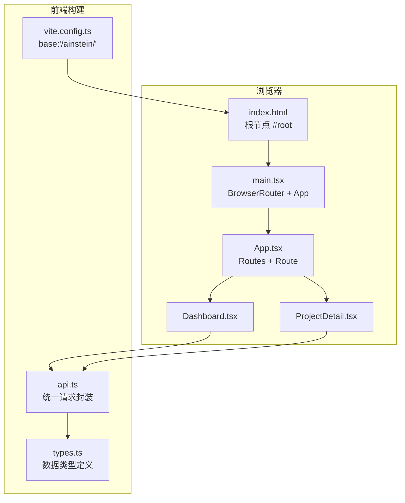
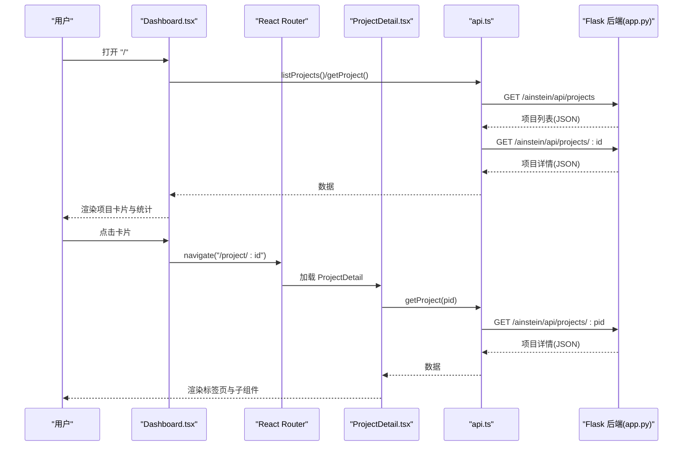
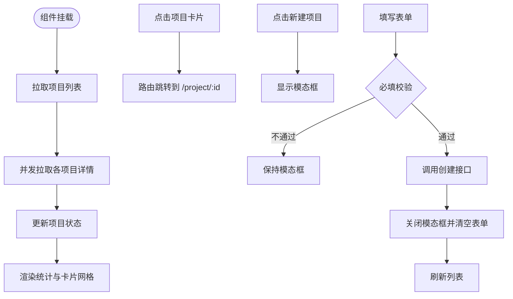
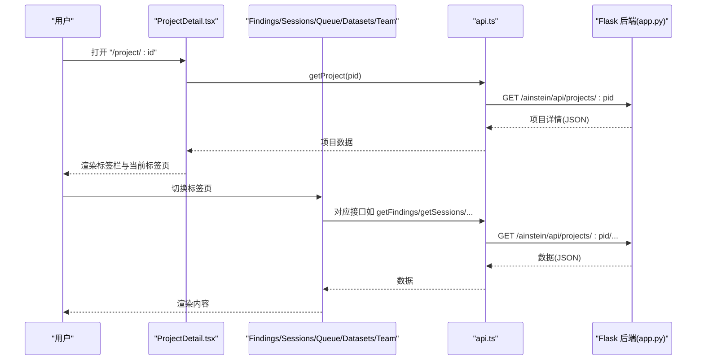
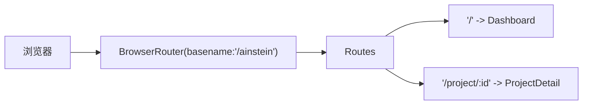
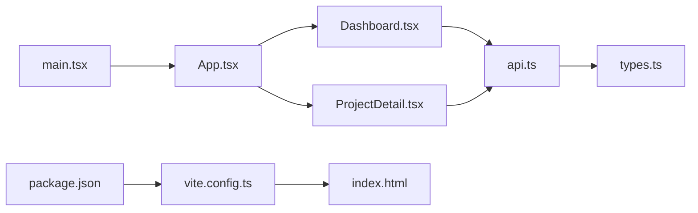

# 页面组件

<cite>
**本文引用的文件**
- [Dashboard.tsx](file://frontend/src/pages/Dashboard.tsx)
- [ProjectDetail.tsx](file://frontend/src/pages/ProjectDetail.tsx)
- [App.tsx](file://frontend/src/App.tsx)
- [main.tsx](file://frontend/src/main.tsx)
- [api.ts](file://frontend/src/api.ts)
- [types.ts](file://frontend/src/types.ts)
- [index.html](file://frontend/index.html)
- [vite.config.ts](file://frontend/vite.config.ts)
- [package.json](file://frontend/package.json)
- [app.py](file://app.py)
- [README.md](file://README.md)
</cite>

## 目录
1. [简介](#简介)
2. [项目结构](#项目结构)
3. [核心组件](#核心组件)
4. [架构总览](#架构总览)
5. [组件详解](#组件详解)
6. [依赖关系分析](#依赖关系分析)
7. [性能与可维护性](#性能与可维护性)
8. [故障排查指南](#故障排查指南)
9. [结论](#结论)
10. [附录](#附录)

## 简介
本文件聚焦于前端页面组件的设计与实现，系统性梳理 Dashboard 页面与 ProjectDetail 页面的功能、技术架构与交互逻辑，并补充路由配置、响应式与移动端适配策略、组件复用与状态管理的最佳实践，以及性能优化建议。读者无需深入后端即可理解页面如何工作、如何扩展与优化。

## 项目结构
前端采用 React + Vite + TypeScript 的现代单页应用（SPA）架构，页面组件位于 frontend/src/pages 下，路由在 App 中集中定义，入口在 main.tsx 中挂载到 DOM 并设置基础路径。样式通过全局 CSS 变量注入，支持深色主题与暗色系配色。

图表来源
- [main.tsx:1-13](file://frontend/src/main.tsx#L1-L13)
- [App.tsx:1-13](file://frontend/src/App.tsx#L1-L13)
- [Dashboard.tsx:1-140](file://frontend/src/pages/Dashboard.tsx#L1-L140)
- [ProjectDetail.tsx:1-385](file://frontend/src/pages/ProjectDetail.tsx#L1-L385)
- [api.ts:1-45](file://frontend/src/api.ts#L1-L45)
- [types.ts:1-89](file://frontend/src/types.ts#L1-L89)
- [vite.config.ts:1-12](file://frontend/vite.config.ts#L1-L12)

章节来源
- [main.tsx:1-13](file://frontend/src/main.tsx#L1-L13)
- [App.tsx:1-13](file://frontend/src/App.tsx#L1-L13)
- [vite.config.ts:1-12](file://frontend/vite.config.ts#L1-L12)
- [index.html:1-22](file://frontend/index.html#L1-L22)

## 核心组件
- Dashboard 页面：负责项目列表的拉取、聚合统计、新建项目的弹窗表单与跳转至详情页的卡片列表。
- ProjectDetail 页面：负责项目详情的加载、标签页切换、子标签页内容（研究发现、研究日志、课题队列、数据集、AI 团队）渲染与交互。
- 路由与入口：App.tsx 定义路由，main.tsx 设置 BrowserRouter 与基础路径，确保前后端同源部署时的路径一致性。
- 请求封装：api.ts 将所有后端接口抽象为函数，统一处理错误与查询参数拼接。
- 类型定义：types.ts 明确项目、会话、发现、队列项、数据集、指令与记忆等实体结构，便于组件间契约一致。

章节来源
- [Dashboard.tsx:1-140](file://frontend/src/pages/Dashboard.tsx#L1-L140)
- [ProjectDetail.tsx:1-385](file://frontend/src/pages/ProjectDetail.tsx#L1-L385)
- [App.tsx:1-13](file://frontend/src/App.tsx#L1-L13)
- [main.tsx:1-13](file://frontend/src/main.tsx#L1-L13)
- [api.ts:1-45](file://frontend/src/api.ts#L1-L45)
- [types.ts:1-89](file://frontend/src/types.ts#L1-L89)

## 架构总览
前端与后端通过统一的 API 基础路径通信，Dashboard 与 ProjectDetail 通过 React Router 实现 SPA 导航，组件内部通过 React Hooks 管理状态与副作用，API 层负责参数构造与错误处理。

图表来源
- [Dashboard.tsx:16-20](file://frontend/src/pages/Dashboard.tsx#L16-L20)
- [ProjectDetail.tsx:15-17](file://frontend/src/pages/ProjectDetail.tsx#L15-L17)
- [api.ts:11-14](file://frontend/src/api.ts#L11-L14)
- [app.py:50-66](file://app.py#L50-L66)
- [App.tsx:8-10](file://frontend/src/App.tsx#L8-L10)

## 组件详解

### Dashboard 页面（项目列表与交互）
- 数据加载与聚合
  - 首次挂载触发加载：先获取项目列表，再并发拉取每个项目的详细信息，最后写入状态。
  - 统计计算：基于项目统计字段计算“已完成会话”“研究发现”等聚合值。
- 用户交互
  - 新建项目：点击“新建项目”按钮打开模态框；表单校验必填字段后调用创建接口，成功后关闭模态框并刷新列表。
  - 项目卡片：点击卡片进入对应项目详情页。
- 视觉与布局
  - 使用 CSS 变量控制主题色与边框；卡片网格采用 CSS Grid 自适应列数；统计卡片与徽章用于信息密度展示。

图表来源
- [Dashboard.tsx:14-28](file://frontend/src/pages/Dashboard.tsx#L14-L28)
- [Dashboard.tsx:54-69](file://frontend/src/pages/Dashboard.tsx#L54-L69)
- [Dashboard.tsx:72-91](file://frontend/src/pages/Dashboard.tsx#L72-L91)

章节来源
- [Dashboard.tsx:1-140](file://frontend/src/pages/Dashboard.tsx#L1-L140)

### ProjectDetail 页面（项目详情与操作界面）
- 页面结构
  - 顶部返回与项目基本信息；下方标签栏切换五个子标签页：研究发现、研究日志、课题队列、数据集、AI 团队。
  - 子组件按需渲染，避免不必要的重渲染。
- 研究发现（FindingsTab）
  - 支持按状态筛选（全部/待审核/已验证/已拒绝），默认限制条数，支持动态刷新。
  - 每条发现包含置信度徽章、分类、状态、会话主题、正文、证据与行动建议。
- 研究日志（SessionsTab）
  - 列表展示会话状态与主题；支持一键启动研究会话；点击会话进入详情视图。
  - 会话详情解析并展示假设、发现、后续方向等结构化内容。
- 课题队列（QueueTab）
  - 表单添加新课题（支持优先级选择），表格展示队列项的来源、状态与创建时间。
- 数据集（DatasetsTab）
  - 文件上传（CSV/JSON/XLSX），解析并展示列名与数据类型；展示行数与来源。
- AI 团队（TeamTab）
  - 展示科学家指令与主任记忆；提供一键运行科学家/主任的按钮，展示运行反馈消息。
- 通用组件
  - Section、ConfBadge、Badge、Field 等组件提升复用性与一致性。

图表来源
- [ProjectDetail.tsx:8-61](file://frontend/src/pages/ProjectDetail.tsx#L8-L61)
- [ProjectDetail.tsx:63-105](file://frontend/src/pages/ProjectDetail.tsx#L63-L105)
- [ProjectDetail.tsx:113-209](file://frontend/src/pages/ProjectDetail.tsx#L113-L209)
- [ProjectDetail.tsx:211-259](file://frontend/src/pages/ProjectDetail.tsx#L211-L259)
- [ProjectDetail.tsx:261-306](file://frontend/src/pages/ProjectDetail.tsx#L261-L306)
- [ProjectDetail.tsx:308-375](file://frontend/src/pages/ProjectDetail.tsx#L308-L375)
- [api.ts:15-44](file://frontend/src/api.ts#L15-L44)
- [app.py:60-177](file://app.py#L60-L177)

章节来源
- [ProjectDetail.tsx:1-385](file://frontend/src/pages/ProjectDetail.tsx#L1-L385)

### 路由与导航机制
- 路由定义
  - "/" 对应 Dashboard；"/project/:id" 对应 ProjectDetail。
- 入口与基础路径
  - main.tsx 使用 BrowserRouter 并设置 basename 为 "/ainstein"，确保与后端静态资源路径一致。
  - Vite 配置 base 也为 "/ainstein/"，保证构建产物正确引用。
- 导航行为
  - Dashboard 使用 useNavigate 进行页面内跳转；ProjectDetail 提供返回按钮回到列表页。

图表来源
- [App.tsx:8-10](file://frontend/src/App.tsx#L8-L10)
- [main.tsx:8](file://frontend/src/main.tsx#L8)
- [vite.config.ts:6](file://frontend/vite.config.ts#L6)

章节来源
- [App.tsx:1-13](file://frontend/src/App.tsx#L1-L13)
- [main.tsx:1-13](file://frontend/src/main.tsx#L1-L13)
- [vite.config.ts:1-12](file://frontend/vite.config.ts#L1-L12)

### 响应式设计与移动端适配
- 布局策略
  - Dashboard 使用 CSS Grid 与最小宽度约束，卡片网格在不同屏幕宽度下自适应列数。
  - ProjectDetail 采用最大宽度容器与左右内边距，保证在大屏与小屏均有良好阅读体验。
- 交互适配
  - 表单与按钮尺寸在不同设备上保持可点击区域；模态框宽度使用百分比与最大宽度限制，避免移动端溢出。
- 主题与可读性
  - 通过 CSS 变量统一颜色体系，深色背景与高对比度文本提升可读性；徽章与状态色区分信息层级。

章节来源
- [Dashboard.tsx:54-69](file://frontend/src/pages/Dashboard.tsx#L54-L69)
- [Dashboard.tsx:34-71](file://frontend/src/pages/Dashboard.tsx#L34-L71)
- [ProjectDetail.tsx:22-59](file://frontend/src/pages/ProjectDetail.tsx#L22-L59)
- [index.html:7-15](file://frontend/index.html#L7-L15)

### 组件复用与状态管理最佳实践
- 组件复用
  - StatCard、Field、Badge、ConfBadge、Section 等作为通用 UI 片段，减少重复代码，提升一致性。
- 状态管理
  - Dashboard：本地状态管理项目列表与新建表单；通过一次性并发请求获取完整详情，避免多次网络往返。
  - ProjectDetail：按标签页拆分子组件，仅在当前标签页渲染，降低重渲染成本；子组件内部独立管理自身状态。
  - 通用 Hook：useEffect 用于副作用触发；useState/useRef 管理表单与临时 UI 状态。
- 错误处理
  - API 层统一抛错，组件侧在必要处捕获并提示；避免未处理异常导致页面崩溃。
- 性能优化
  - 并发请求：Dashboard 并发拉取项目详情；TeamTab 并发获取指令与记忆。
  - 按需渲染：标签页切换时仅渲染当前标签页；会话详情懒加载。
  - 事件节流：筛选按钮点击后立即触发加载，避免频繁点击造成重复请求。

章节来源
- [Dashboard.tsx:16-20](file://frontend/src/pages/Dashboard.tsx#L16-L20)
- [ProjectDetail.tsx:314-318](file://frontend/src/pages/ProjectDetail.tsx#L314-L318)
- [ProjectDetail.tsx:53-57](file://frontend/src/pages/ProjectDetail.tsx#L53-L57)

## 依赖关系分析
- 组件依赖
  - Dashboard 依赖 api.ts 与 types.ts；ProjectDetail 依赖 api.ts 与 types.ts。
  - 子标签页组件相互独立，仅依赖 api.ts。
- 路由依赖
  - App.tsx 依赖两个页面组件；main.tsx 依赖 App.tsx 与 BrowserRouter。
- 构建与运行
  - package.json 指定 React、React Router 与 Vite；vite.config.ts 设置 base 与插件；index.html 注入 CSS 变量。

图表来源
- [App.tsx:1-13](file://frontend/src/App.tsx#L1-L13)
- [Dashboard.tsx:1-5](file://frontend/src/pages/Dashboard.tsx#L1-L5)
- [ProjectDetail.tsx:1-5](file://frontend/src/pages/ProjectDetail.tsx#L1-L5)
- [api.ts:1-7](file://frontend/src/api.ts#L1-L7)
- [types.ts:1-89](file://frontend/src/types.ts#L1-L89)
- [main.tsx:1-13](file://frontend/src/main.tsx#L1-L13)
- [vite.config.ts:1-12](file://frontend/vite.config.ts#L1-L12)
- [package.json:1-24](file://frontend/package.json#L1-L24)
- [index.html:1-22](file://frontend/index.html#L1-L22)

章节来源
- [App.tsx:1-13](file://frontend/src/App.tsx#L1-L13)
- [Dashboard.tsx:1-140](file://frontend/src/pages/Dashboard.tsx#L1-L140)
- [ProjectDetail.tsx:1-385](file://frontend/src/pages/ProjectDetail.tsx#L1-L385)
- [api.ts:1-45](file://frontend/src/api.ts#L1-L45)
- [types.ts:1-89](file://frontend/src/types.ts#L1-L89)
- [main.tsx:1-13](file://frontend/src/main.tsx#L1-L13)
- [vite.config.ts:1-12](file://frontend/vite.config.ts#L1-L12)
- [package.json:1-24](file://frontend/package.json#L1-L24)
- [index.html:1-22](file://frontend/index.html#L1-L22)

## 性能与可维护性
- 性能优化
  - 并发请求：Dashboard 并发获取项目详情，减少总等待时间。
  - 懒加载与按需渲染：标签页切换时仅渲染当前标签页，避免一次性渲染过多内容。
  - 事件与状态：使用 useRef 管理 DOM 引用（如文件上传 input），避免无意义重渲染。
  - 查询参数：FindingsTab 使用 URLSearchParams 动态拼接过滤条件，避免无效请求。
- 可维护性
  - 统一的 API 封装：api.ts 将所有接口抽象为函数，便于替换与扩展。
  - 类型安全：types.ts 明确数据结构，TypeScript 在编译期发现潜在问题。
  - 组件职责单一：每个子标签页组件只负责一个领域的展示与交互，便于测试与演进。
- 可靠性
  - 错误处理：API 层统一抛错，组件侧在关键位置捕获并提示。
  - 会话运行与刷新：SessionsTab 在启动会话后延迟刷新，避免 UI 与后端状态不同步。

章节来源
- [Dashboard.tsx:16-20](file://frontend/src/pages/Dashboard.tsx#L16-L20)
- [ProjectDetail.tsx:67-71](file://frontend/src/pages/ProjectDetail.tsx#L67-L71)
- [ProjectDetail.tsx:119-123](file://frontend/src/pages/ProjectDetail.tsx#L119-L123)
- [api.ts:22-28](file://frontend/src/api.ts#L22-L28)

## 故障排查指南
- 页面空白或路由不生效
  - 检查 main.tsx 的 basename 与 vite.config.ts 的 base 是否一致，均应为 "/ainstein"。
  - 确认后端静态资源路径映射是否正确（Flask 的静态目录与路径前缀）。
- 接口 404 或跨域
  - 确认 API 基础路径为 "/ainstein/api"，且后端路由前缀匹配。
  - 若本地联调，请确认后端已启动并监听端口。
- 数据为空或加载缓慢
  - Dashboard 首次加载会并发多个请求，若网络较慢可适当增加超时或提示加载状态。
  - FindingsTab 默认限制条数，可通过调整 limit 参数或分页加载。
- 上传数据集失败
  - 确认文件格式为 CSV/JSON/XLSX；检查后端保存目录权限与磁盘空间。
- 会话运行无响应
  - 确认后端线程池与定时任务正常；查看后端日志定位具体报错。

章节来源
- [main.tsx:8](file://frontend/src/main.tsx#L8)
- [vite.config.ts:6](file://frontend/vite.config.ts#L6)
- [api.ts:1-7](file://frontend/src/api.ts#L1-L7)
- [app.py:24-38](file://app.py#L24-L38)
- [app.py:123-152](file://app.py#L123-L152)
- [app.py:95-104](file://app.py#L95-L104)

## 结论
Dashboard 与 ProjectDetail 页面以清晰的职责划分与统一的 API 封装实现了高效的数据展示与交互。通过并发请求、按需渲染与组件复用，既保证了用户体验，也提升了可维护性。结合路由与基础路径的一致性配置，前端与后端协同良好。后续可在分页、缓存与离线策略方面进一步增强，以应对更大规模数据与更复杂的业务场景。

## 附录
- 数据模型（节选）
  - 项目：包含标识、名称、使命、领域、配置、状态与统计信息。
  - 会话：包含主题、引擎类型、状态、持续时间、创建时间与结构化内容。
  - 发现：包含类别、置信度、证据、是否可行动、状态与创建时间。
  - 队列项：包含主题、优先级、来源、状态与创建时间。
  - 数据集：包含名称、来源、模式、行数与创建时间。
  - 指令与记忆：分别记录科学家指令与主任记忆内容及上下文。

章节来源
- [types.ts:1-89](file://frontend/src/types.ts#L1-L89)