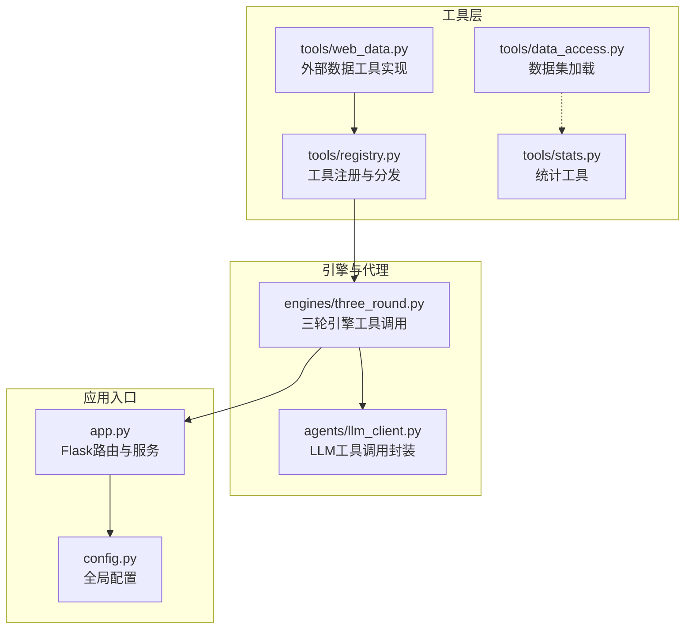
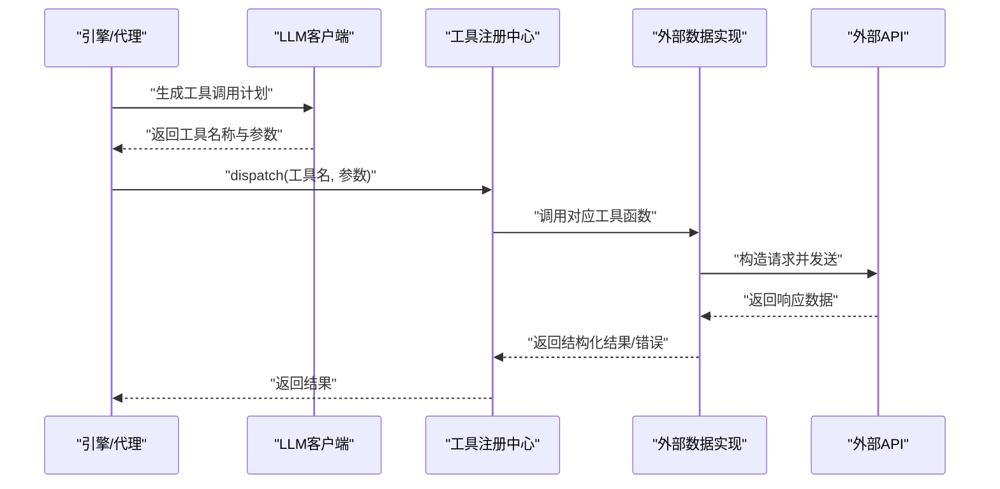
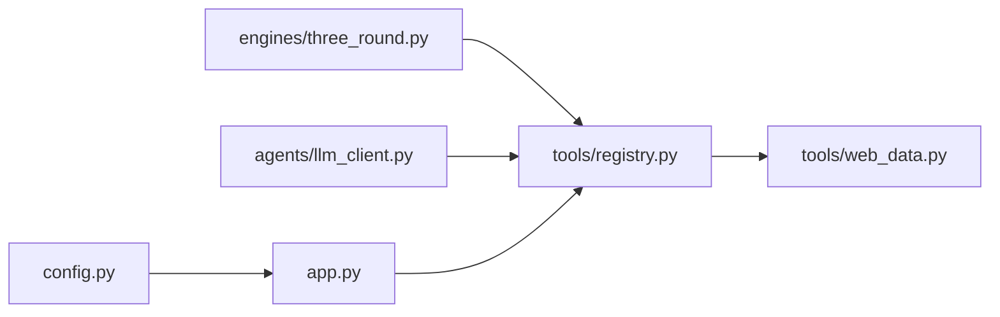
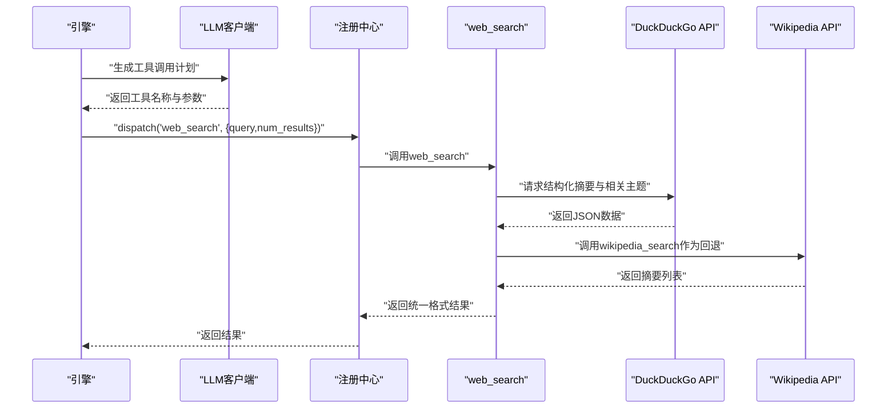

# 外部数据工具

<cite>
**本文引用的文件列表**
- [tools/web_data.py](file://tools/web_data.py)
- [tools/registry.py](file://tools/registry.py)
- [tools/data_access.py](file://tools/data_access.py)
- [tools/stats.py](file://tools/stats.py)
- [config.py](file://config.py)
- [app.py](file://app.py)
- [engines/three_round.py](file://engines/three_round.py)
- [agents/llm_client.py](file://agents/llm_client.py)
- [README.md](file://README.md)
</cite>

## 目录
1. [简介](#简介)
2. [项目结构](#项目结构)
3. [核心组件](#核心组件)
4. [架构总览](#架构总览)
5. [详细组件分析](#详细组件分析)
6. [依赖关系分析](#依赖关系分析)
7. [性能与频率控制](#性能与频率控制)
8. [故障排查指南](#故障排查指南)
9. [结论](#结论)
10. [附录](#附录)

## 简介
本文件面向外部数据工具的使用者与维护者，系统梳理四类外部数据获取能力：Web搜索工具（web_search）、维基百科搜索（wikipedia_search）、arXiv学术搜索（arxiv_search）、Google趋势（google_trends）。内容涵盖API集成方式、数据获取流程、结果格式化、使用限制与频率控制、错误处理机制、数据质量评估与去重策略，并给出典型应用场景与最佳实践建议。

## 项目结构
外部数据工具位于 tools 子模块中，通过统一的工具注册中心对外暴露接口；在研究流程中，由引擎与LLM协作调用这些工具完成信息检索与验证。

图表来源
- [tools/web_data.py:1-164](file://tools/web_data.py#L1-L164)
- [tools/registry.py:1-181](file://tools/registry.py#L1-L181)
- [engines/three_round.py:102-134](file://engines/three_round.py#L102-L134)
- [agents/llm_client.py:47-70](file://agents/llm_client.py#L47-L70)
- [app.py:1-182](file://app.py#L1-L182)
- [config.py:1-11](file://config.py#L1-L11)

章节来源
- [README.md:111-124](file://README.md#L111-L124)
- [tools/registry.py:138-180](file://tools/registry.py#L138-L180)

## 核心组件
- 工具注册中心：负责将工具名映射到实现函数与输入Schema，支持按名称分发调用。
- 外部数据工具集合：封装四个外部API的请求、解析与结果标准化。
- 引擎与LLM：在研究流程中根据上下文决定是否调用外部工具，并接收与传递工具返回结果。
- 数据访问与统计：为已有数据集提供统计分析能力，作为外部数据的补充与交叉验证。

章节来源
- [tools/registry.py:24-42](file://tools/registry.py#L24-L42)
- [tools/web_data.py:13-163](file://tools/web_data.py#L13-L163)
- [engines/three_round.py:102-134](file://engines/three_round.py#L102-L134)
- [tools/data_access.py:10-42](file://tools/data_access.py#L10-L42)
- [tools/stats.py:10-120](file://tools/stats.py#L10-L120)

## 架构总览
外部数据工具的调用链路如下：引擎/代理通过LLM生成工具调用计划，注册中心根据工具名分发到具体实现，工具向外部API发起请求并返回结构化结果；若出现异常则返回错误信息，便于上层进行容错与重试。

图表来源
- [engines/three_round.py:102-134](file://engines/three_round.py#L102-L134)
- [agents/llm_client.py:47-70](file://agents/llm_client.py#L47-L70)
- [tools/registry.py:24-42](file://tools/registry.py#L24-L42)
- [tools/web_data.py:13-163](file://tools/web_data.py#L13-L163)

## 详细组件分析

### Web搜索工具（web_search）
- 功能概述：通过DuckDuckGo Instant Answer API获取结构化摘要与相关主题，同时回退到英文维基百科搜索以补充信息。
- API集成方式：
  - DuckDuckGo：查询参数包含关键词、JSON格式、禁用HTML、跳过消歧义。
  - 维基百科：先按关键词搜索，再按标题获取REST摘要。
- 数据获取流程：
  - 发起DuckDuckGo查询，提取摘要与相关主题条目。
  - 调用维基百科搜索并取前若干条，补充摘要与链接。
  - 合并结果并截断至指定数量。
- 结果格式化：
  - 统一字段：标题、URL、片段、来源（可选）。
  - 包含查询词、结果总数与结果列表。
- 使用限制与频率控制：
  - 请求超时设置（DuckDuckGo约15秒，维基百科摘要约10秒）。
  - 结果数量上限（主流程按需截断）。
- 错误处理机制：
  - 捕获异常并记录日志，返回错误对象。
- 数据质量评估与去重策略：
  - 去重：基于URL字段进行去重（合并阶段可按URL去重）。
  - 质量：优先使用DuckDuckGo的结构化摘要；若无摘要，则回退到维基百科摘要。
- 应用场景与最佳实践：
  - 快速事实核查与背景信息收集。
  - 最佳实践：合理设置num_results，避免过多噪声；结合维基百科摘要提升可信度。

章节来源
- [tools/web_data.py:13-50](file://tools/web_data.py#L13-L50)
- [tools/web_data.py:53-84](file://tools/web_data.py#L53-L84)

### 维基百科搜索（wikipedia_search）
- 功能概述：按关键词搜索维基百科条目，并获取REST摘要。
- API集成方式：
  - 搜索API：按关键词返回候选条目。
  - 摘要API：按条目标题获取摘要文本。
- 数据获取流程：
  - 搜索阶段：限定语言与数量。
  - 摘要阶段：逐条获取摘要，失败时回退到搜索结果中的片段。
- 结果格式化：
  - 字段：标题、摘要、URL。
  - 包含查询词、语言、结果数量与列表。
- 使用限制与频率控制：
  - 请求超时设置（搜索约15秒，摘要约10秒）。
  - 结果数量上限（默认5条）。
- 错误处理机制：
  - 捕获异常并记录日志，返回错误对象。
- 数据质量评估与去重策略：
  - 去重：基于URL字段去重。
  - 质量：摘要优先，回退片段。
- 应用场景与最佳实践：
  - 获取权威、可追溯的百科条目摘要。
  - 最佳实践：选择合适语言参数；对摘要长度进行截断以适配下游处理。

章节来源
- [tools/web_data.py:53-84](file://tools/web_data.py#L53-L84)

### arXiv学术搜索（arxiv_search）
- 功能概述：检索arXiv论文，返回标题、作者、发表日期、摘要与链接。
- API集成方式：
  - 使用arXiv导出API，查询参数包含关键词、起始偏移、最大结果数、排序方式。
  - 解析Atom XML响应，提取条目字段。
- 数据获取流程：
  - 构造查询字符串（空格分词时加引号）。
  - 发送请求并解析XML。
  - 遍历条目，提取必要字段。
- 结果格式化：
  - 字段：标题、作者列表（最多若干）、发表日期、摘要、链接。
  - 包含查询词、结果数量与列表。
- 使用限制与频率控制：
  - 请求超时设置（约20秒）。
  - 结果数量上限（默认10条）。
- 错误处理机制：
  - HTTP状态码非200直接返回错误；异常捕获并记录日志。
- 数据质量评估与去重策略：
  - 去重：基于URL（ID）字段去重。
  - 质量：摘要截断以保证长度可控。
- 应用场景与最佳实践：
  - 学术背景调研与文献检索。
  - 最佳实践：针对长关键词使用引号包裹；关注作者数量上限与摘要长度。

章节来源
- [tools/web_data.py:87-122](file://tools/web_data.py#L87-L122)

### Google趋势（google_trends）
- 功能概述：获取关键词兴趣随时间变化、趋势方向与相关查询。
- API集成方式：
  - 依赖pytrends库，构建payload并查询兴趣曲线与相关查询。
- 数据获取流程：
  - 关键词预处理（字符串转列表，最多5个）。
  - 构建payload并获取兴趣曲线。
  - 计算均值、最大值与趋势方向（上升/下降/稳定）。
  - 尝试获取相关查询Top结果。
- 结果格式化：
  - 字段：查询词、地理范围、时间范围、兴趣汇总、相关查询。
  - 兴趣汇总包含均值、最大值、近期与早期均值及趋势方向。
- 使用限制与频率控制：
  - 依赖pytrends安装；未安装时返回提示。
  - 若兴趣曲线为空，返回“无可用数据”。
- 错误处理机制：
  - 导入失败返回错误提示；其他异常记录日志并返回错误对象。
- 数据质量评估与去重策略：
  - 去重：相关查询已按Top条目返回，无需额外去重。
  - 质量：趋势方向基于前后52周均值比较，避免短期波动干扰。
- 应用场景与最佳实践：
  - 趋势分析与热点追踪。
  - 最佳实践：合理选择地理与时间范围；注意关键词数量限制。

章节来源
- [tools/web_data.py:125-163](file://tools/web_data.py#L125-L163)

## 依赖关系分析
- 工具注册中心将工具名映射到实现函数与Schema，供引擎与LLM调用。
- 引擎在三轮流程中根据LLM输出的工具调用计划，通过注册中心分发到具体实现。
- LLM客户端负责将工具定义注入到模型调用中，实现工具调用的自动化。

图表来源
- [engines/three_round.py:102-134](file://engines/three_round.py#L102-L134)
- [tools/registry.py:24-42](file://tools/registry.py#L24-L42)
- [agents/llm_client.py:47-70](file://agents/llm_client.py#L47-L70)
- [app.py:1-182](file://app.py#L1-L182)
- [config.py:1-11](file://config.py#L1-L11)

章节来源
- [tools/registry.py:12-42](file://tools/registry.py#L12-L42)
- [engines/three_round.py:102-134](file://engines/three_round.py#L102-L134)
- [agents/llm_client.py:47-70](file://agents/llm_client.py#L47-L70)

## 性能与频率控制
- 超时控制：各工具设置了合理的请求超时（DuckDuckGo约15秒、维基百科摘要约10秒、arXiv约20秒），避免阻塞。
- 结果截断：工具内部对结果数量进行限制，防止返回过多数据影响下游处理。
- 并发与重试：当前实现未内置重试逻辑，建议在上游（如代理/引擎）增加指数退避重试与并发限流。
- 资源消耗：Google趋势依赖pytrends，建议在独立环境中安装并隔离依赖，避免影响其他工具。
- 频率控制建议：
  - 在上游引入令牌桶/漏桶限流器，按工具维度控制QPS。
  - 对外部API设置统一的超时与重试策略，避免单点故障放大。
  - 对高频查询进行缓存（如关键词+时间窗口），减少重复请求。

[本节为通用性能讨论，不直接分析特定文件，故无章节来源]

## 故障排查指南
- 常见错误类型：
  - 网络异常：超时、连接失败、HTTP状态码异常。
  - 外部API不可用：返回空数据或错误消息。
  - 依赖缺失：pytrends未安装导致导入异常。
- 定位方法：
  - 查看工具返回的错误对象，确认是网络问题还是外部API问题。
  - 检查日志中记录的错误堆栈，定位具体异常位置。
  - 验证请求参数（如语言、数量、关键词格式）。
- 处理建议：
  - 对网络异常进行重试与降级（如回退到备用来源）。
  - 对外部API返回空数据，记录并提示用户稍后重试。
  - 对依赖缺失，提供安装指引与最小依赖版本说明。

章节来源
- [tools/web_data.py:48-50](file://tools/web_data.py#L48-L50)
- [tools/web_data.py:82-84](file://tools/web_data.py#L82-L84)
- [tools/web_data.py:99-100](file://tools/web_data.py#L99-L100)
- [tools/web_data.py:159-163](file://tools/web_data.py#L159-L163)

## 结论
外部数据工具为研究流程提供了快速、多源的信息获取能力。通过统一的注册中心与标准化的结果格式，这些工具能够被引擎与LLM无缝调用。建议在生产环境中加强频率控制、重试与缓存策略，并对不同工具的特性（如Google趋势的依赖安装）进行明确的运维规范，以确保稳定性与可维护性。

[本节为总结性内容，不直接分析特定文件，故无章节来源]

## 附录

### 工具调用序列（以web_search为例）

图表来源
- [engines/three_round.py:102-134](file://engines/three_round.py#L102-L134)
- [agents/llm_client.py:47-70](file://agents/llm_client.py#L47-L70)
- [tools/registry.py:24-42](file://tools/registry.py#L24-L42)
- [tools/web_data.py:13-50](file://tools/web_data.py#L13-L50)

### 工具Schema与调用约定
- web_search
  - 输入：query（必填）、num_results（可选，默认10）
  - 输出：query、count、results（每个条目含title、url、snippet、source）
- wikipedia_search
  - 输入：query（必填）、lang（可选，默认en）、limit（可选，默认5）
  - 输出：query、lang、count、results（每个条目含title、summary、url）
- arxiv_search
  - 输入：query（必填）、max_results（可选，默认10）
  - 输出：query、count、results（每个条目含title、authors、published、summary、url）
- google_trends
  - 输入：query（必填，字符串或最多5个关键词列表）、geo（可选，默认全球）、timeframe（可选，默认“today 5-y”）
  - 输出：query、timeframe、geo、interest（每个关键词含mean、max、recent_52w_mean、earlier_52w_mean、trend）、related（相关查询Top）

章节来源
- [tools/registry.py:140-180](file://tools/registry.py#L140-L180)