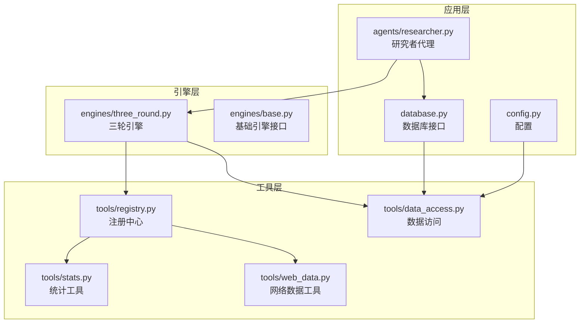
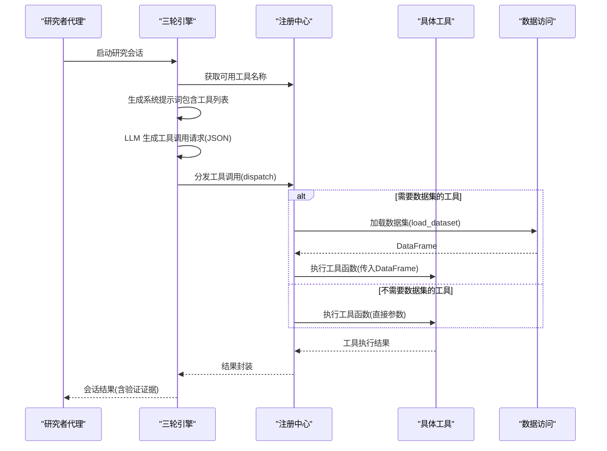
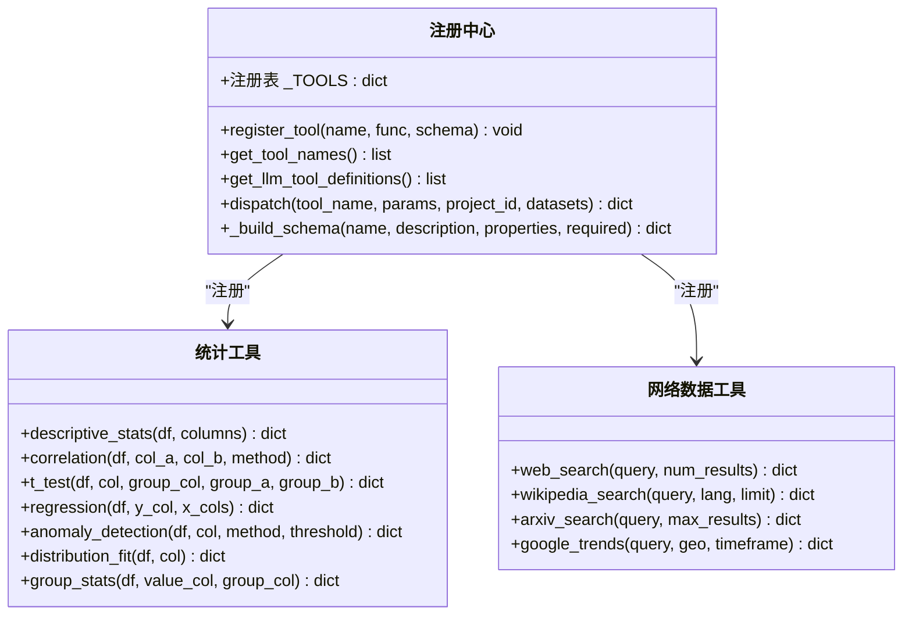
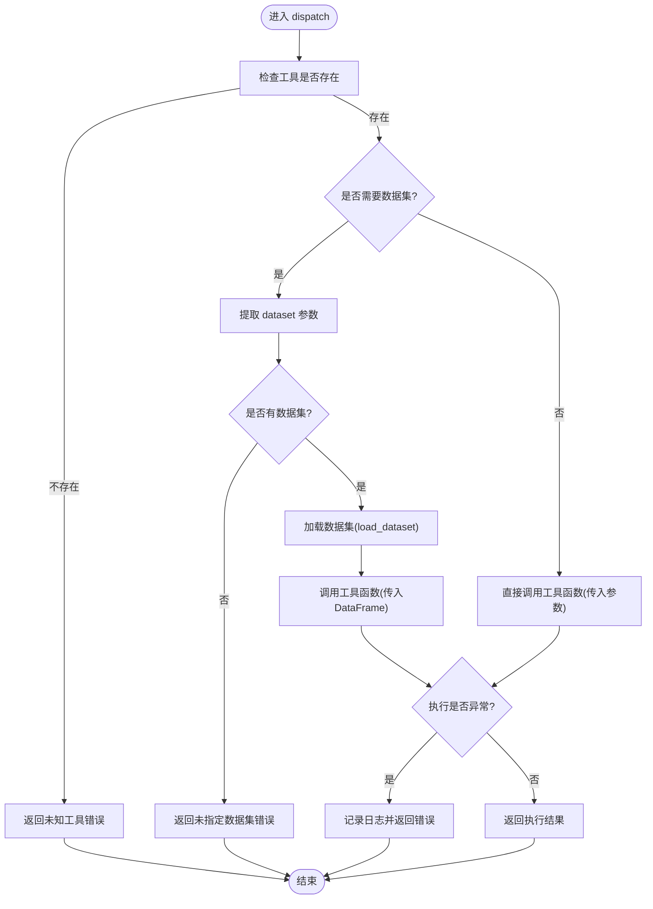
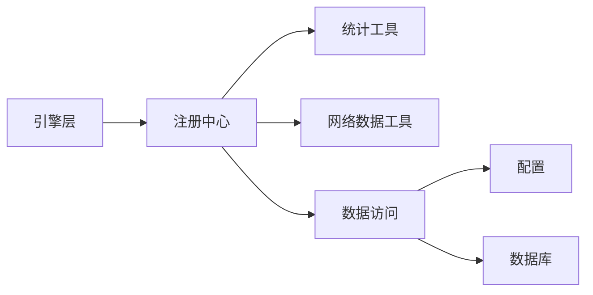

# 工具注册机制

<cite>
**本文档引用的文件**
- [registry.py](file://tools/registry.py)
- [data_access.py](file://tools/data_access.py)
- [stats.py](file://tools/stats.py)
- [web_data.py](file://tools/web_data.py)
- [three_round.py](file://engines/three_round.py)
- [researcher.py](file://agents/researcher.py)
- [database.py](file://database.py)
- [config.py](file://config.py)
</cite>

## 目录
1. [简介](#简介)
2. [项目结构](#项目结构)
3. [核心组件](#核心组件)
4. [架构总览](#架构总览)
5. [详细组件分析](#详细组件分析)
6. [依赖关系分析](#依赖关系分析)
7. [性能考虑](#性能考虑)
8. [故障排除指南](#故障排除指南)
9. [结论](#结论)
10. [附录](#附录)

## 简介
本文件系统性阐述工具注册机制的设计与实现，涵盖以下关键主题：
- 注册核心：register_tool 函数如何建立工具名称到实现与 Schema 的映射
- 查询接口：get_tool_names 与 get_llm_tool_definitions 的作用与使用方式
- 分发执行：dispatch 函数的工具分发流程，包括参数解析、数据集加载、错误处理
- Schema 构建：_build_schema 如何生成符合 JSON Schema 规范的工具定义
- 最佳实践：自定义工具开发流程、接口规范与扩展指南

该机制为研究引擎提供统一的工具调用入口，使 LLM 能够在会话中按需选择并执行统计或外部数据检索类工具。

## 项目结构
工具注册机制主要位于 tools 子模块，并被引擎层调用以驱动研究会话中的数据分析与验证流程。

图表来源
- [registry.py:1-181](file://tools/registry.py#L1-L181)
- [data_access.py:1-43](file://tools/data_access.py#L1-L43)
- [stats.py:1-120](file://tools/stats.py#L1-L120)
- [web_data.py:1-164](file://tools/web_data.py#L1-L164)
- [three_round.py:1-179](file://engines/three_round.py#L1-L179)
- [researcher.py:1-114](file://agents/researcher.py#L1-L114)
- [database.py:1-344](file://database.py#L1-L344)
- [config.py:1-11](file://config.py#L1-L11)

章节来源
- [registry.py:1-181](file://tools/registry.py#L1-L181)
- [three_round.py:1-179](file://engines/three_round.py#L1-L179)
- [researcher.py:1-114](file://agents/researcher.py#L1-L114)
- [database.py:1-344](file://database.py#L1-L344)
- [config.py:1-11](file://config.py#L1-L11)

## 核心组件
- 注册中心（tools/registry.py）
  - 维护全局工具字典，提供注册、查询与分发能力
  - 内置统计工具与网络数据工具的 Schema 定义
- 数据访问（tools/data_access.py）
  - 提供数据集加载与摘要生成能力
- 统计工具（tools/stats.py）
  - 实现描述性统计、相关性分析、t 检验、回归、异常检测、分布拟合、分组统计等
- 网络数据工具（tools/web_data.py）
  - 实现网页搜索、维基百科搜索、arXiv 搜索、Google Trends 获取
- 引擎（engines/three_round.py）
  - 使用注册中心提供的工具列表与分发器执行工具调用
- 研究者代理（agents/researcher.py）
  - 组装上下文并驱动引擎运行，负责会话生命周期管理
- 数据库（database.py）与配置（config.py）
  - 提供数据集元信息与路径配置，支撑数据访问

章节来源
- [registry.py:1-181](file://tools/registry.py#L1-L181)
- [data_access.py:1-43](file://tools/data_access.py#L1-L43)
- [stats.py:1-120](file://tools/stats.py#L1-L120)
- [web_data.py:1-164](file://tools/web_data.py#L1-L164)
- [three_round.py:1-179](file://engines/three_round.py#L1-L179)
- [researcher.py:1-114](file://agents/researcher.py#L1-L114)
- [database.py:1-344](file://database.py#L1-L344)
- [config.py:1-11](file://config.py#L1-L11)

## 架构总览
工具注册机制通过“注册中心 + 工具实现 + Schema 定义”的组合，形成可被引擎层统一调度的工具生态。引擎在第二轮会话中根据可用工具列表与数据集摘要，向 LLM 输出工具调用指令，LLM 返回标准化的工具调用 JSON，引擎通过分发器执行对应工具并收集结果。

图表来源
- [three_round.py:78-136](file://engines/three_round.py#L78-L136)
- [registry.py:24-42](file://tools/registry.py#L24-L42)
- [data_access.py:10-24](file://tools/data_access.py#L10-L24)
- [stats.py:10-120](file://tools/stats.py#L10-L120)
- [web_data.py:13-164](file://tools/web_data.py#L13-L164)

## 详细组件分析

### 注册中心与工具名称映射
- 注册表结构
  - 全局字典维护工具名称到实现与 Schema 的映射
  - register_tool(name, func, schema) 将工具名、函数对象与输入 Schema 绑定
- 名称查询
  - get_tool_names() 返回所有已注册工具的名称列表
  - get_llm_tool_definitions() 返回所有工具的 JSON Schema 定义，用于 LLM 的工具选择提示
- Schema 构建
  - _build_schema(name, description, properties, required) 生成符合 JSON Schema 规范的工具定义对象
  - 输入 Schema 采用对象类型，包含属性定义与必填字段清单

图表来源
- [registry.py:9-54](file://tools/registry.py#L9-L54)
- [stats.py:10-120](file://tools/stats.py#L10-L120)
- [web_data.py:13-164](file://tools/web_data.py#L13-L164)

章节来源
- [registry.py:9-54](file://tools/registry.py#L9-L54)

### 工具分发机制（dispatch）
- 参数解析
  - 从参数中提取 dataset 字段作为数据集标识；若缺失则尝试从 datasets 列表取首个数据集名称
  - 若仍无数据集，返回错误提示
- 数据集加载
  - 对于需要数据集的工具，调用 load_dataset(project_id, dataset_name) 读取文件并返回 DataFrame
  - 支持 CSV、JSON/JSONL、Excel 文件格式，自动识别扩展名并解析
- 错误处理
  - 捕获工具执行异常，记录日志并返回错误信息
  - 对未知工具名返回明确的错误提示
- 工具调用
  - 对需要数据集的工具，将 DataFrame 作为第一个参数传入
  - 对不需要数据集的工具，直接以命名参数形式传递

图表来源
- [registry.py:24-42](file://tools/registry.py#L24-L42)
- [data_access.py:10-24](file://tools/data_access.py#L10-L24)

章节来源
- [registry.py:24-42](file://tools/registry.py#L24-L42)
- [data_access.py:10-24](file://tools/data_access.py#L10-L24)

### 工具 Schema 的构建与规范
- Schema 结构
  - name：工具名称
  - description：工具功能简述
  - input_schema：JSON Schema 对象，包含 type、properties、required
- 属性定义
  - properties 中定义每个输入参数的类型、枚举值与描述
  - required 列出必需参数
- 使用场景
  - get_llm_tool_definitions() 将所有工具的 Schema 返回给引擎，用于 LLM 的工具选择与参数校验
  - 引擎在第二轮会话中将工具列表注入系统提示词，指导 LLM 生成合法的工具调用 JSON

章节来源
- [registry.py:45-54](file://tools/registry.py#L45-L54)
- [registry.py:59-180](file://tools/registry.py#L59-L180)

### 内置工具与调用示例
- 统计工具
  - 描述性统计：计算数值列的均值、标准差、最小值、最大值、四分位数
  - 相关性分析：支持皮尔逊与斯皮尔曼相关系数
  - t 检验：独立样本 t 检验比较两组均值
  - 回归：多元线性回归，输出截距、R² 与各变量系数
  - 异常检测：基于 Z-Score 或 IQR 方法
  - 分布拟合：Shapiro-Wilk 正态性检验与偏度、峰度
  - 分组统计：按分组列计算每组的计数、均值、标准差、中位数
- 网络数据工具
  - 网页搜索：结合 DuckDuckGo 与维基百科返回标题、链接与摘要
  - 维基百科搜索：返回文章摘要与链接
  - arXiv 搜索：返回论文标题、作者、摘要、发布日期与链接
  - Google Trends：返回兴趣趋势、相关查询等（依赖第三方库）

章节来源
- [stats.py:10-120](file://tools/stats.py#L10-L120)
- [web_data.py:13-164](file://tools/web_data.py#L13-L164)
- [registry.py:59-180](file://tools/registry.py#L59-L180)

### 引擎中的工具调用流程
- 第二轮工具测试
  - 引擎在系统提示词中注入可用工具名称与数据集摘要
  - LLM 生成工具调用 JSON，包含 tool 与 params
  - 引擎调用 dispatch 执行工具，将结果附加到对话历史，继续下一轮
- 第三轮验证与总结
  - 基于工具测试结果生成验证结论、关键发现与后续方向

章节来源
- [three_round.py:78-136](file://engines/three_round.py#L78-L136)

## 依赖关系分析
- 模块耦合
  - 引擎层仅依赖注册中心的查询与分发接口，不直接依赖具体工具实现，降低耦合度
  - 注册中心依赖统计与网络工具模块，以及数据访问模块
- 外部依赖
  - pandas/numpy/scipy 用于统计分析
  - requests/pytrends 用于网络数据获取
- 数据流
  - 数据库提供数据集元信息，数据访问模块负责实际文件读取
  - 引擎层通过注册中心统一调度工具，形成清晰的数据-工具-引擎链路

图表来源
- [three_round.py:8-8](file://engines/three_round.py#L8-L8)
- [registry.py:3-5](file://tools/registry.py#L3-L5)
- [data_access.py:5-5](file://tools/data_access.py#L5-L5)
- [database.py:80-90](file://database.py#L80-L90)
- [config.py:5-5](file://config.py#L5-L5)

章节来源
- [three_round.py:1-179](file://engines/three_round.py#L1-L179)
- [registry.py:1-181](file://tools/registry.py#L1-L181)
- [data_access.py:1-43](file://tools/data_access.py#L1-L43)
- [database.py:1-344](file://database.py#L1-L344)
- [config.py:1-11](file://config.py#L1-L11)

## 性能考虑
- 数据集加载
  - 优先使用 CSV/JSON/Excel 的高效解析路径；对大型文件建议在上传阶段进行预处理与 Schema 解析
- 工具执行
  - 统计工具内部对数值列进行类型转换与缺失值处理，避免重复转换可提升性能
- 网络工具
  - 请求超时与异常处理已在工具内实现，建议在调用层设置合理的重试策略
- 并发与会话
  - 研究者代理在启动会话时使用线程异步执行，避免阻塞主进程

## 故障排除指南
- 未知工具名
  - 现象：返回错误提示“未知工具”
  - 排查：确认工具名称拼写与注册是否一致
- 未指定数据集
  - 现象：返回错误提示“未指定数据集”
  - 排查：确保调用参数包含 dataset，或在调用前提供 datasets 列表
- 数据集文件不存在或格式不支持
  - 现象：抛出文件未找到或不支持的错误
  - 排查：确认文件路径与扩展名，支持 CSV/JSON/JSONL/XLS/XLSX
- 工具执行异常
  - 现象：返回错误信息
  - 排查：查看日志输出，检查输入参数合法性与数据质量

章节来源
- [registry.py:26-42](file://tools/registry.py#L26-L42)
- [data_access.py:14-24](file://tools/data_access.py#L14-L24)

## 结论
工具注册机制通过“注册中心 + Schema + 分发器”的设计，实现了工具的统一管理与灵活扩展。它为引擎层提供了稳定的工具调用接口，使 LLM 能够在研究会话中按需选择并执行统计或外部数据检索任务。该机制具备良好的可扩展性与可维护性，适合持续引入新的工具与数据源。

## 附录

### 自定义工具开发流程与接口规范
- 开发步骤
  - 实现工具函数：遵循现有工具的参数与返回约定（通常接收 DataFrame 或命名参数，返回结构化结果）
  - 定义输入 Schema：使用 _build_schema 构建工具定义，明确属性类型、枚举值与必填字段
  - 注册工具：调用 register_tool 完成注册
- 接口规范
  - 工具函数签名：对于需要数据集的工具，第一个参数为 DataFrame；对于不需要数据集的工具，使用命名参数
  - 返回值：统一返回字典，包含结果字段与必要的元信息；遇到异常应返回错误键与错误信息
  - 参数校验：在工具内部进行必要的数据类型转换与长度校验，减少上游错误传播
- 最佳实践
  - 明确工具职责边界，避免单个工具承担过多功能
  - 在 Schema 中提供清晰的描述与默认值说明，便于 LLM 正确调用
  - 对外部依赖（如网络请求）添加超时与异常处理，保证稳定性
  - 对大数据量操作进行性能优化，必要时提供采样或分批处理策略

章节来源
- [registry.py:12-14](file://tools/registry.py#L12-L14)
- [registry.py:45-54](file://tools/registry.py#L45-L54)
- [stats.py:10-120](file://tools/stats.py#L10-L120)
- [web_data.py:13-164](file://tools/web_data.py#L13-L164)