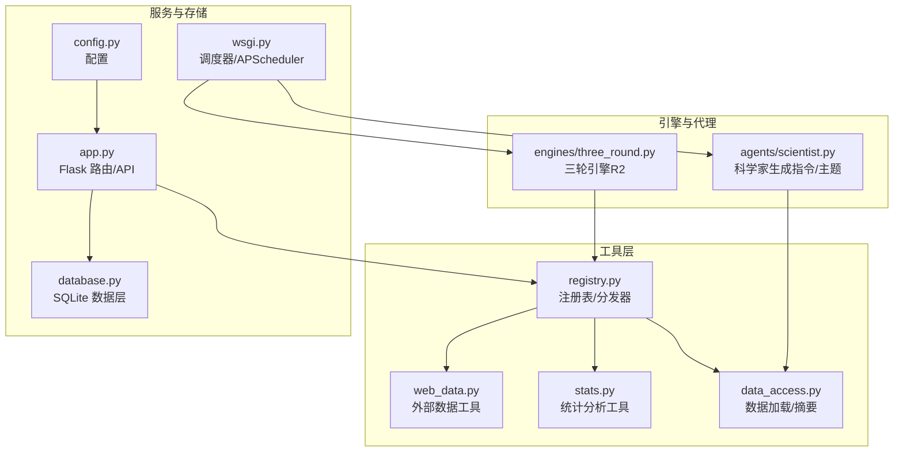
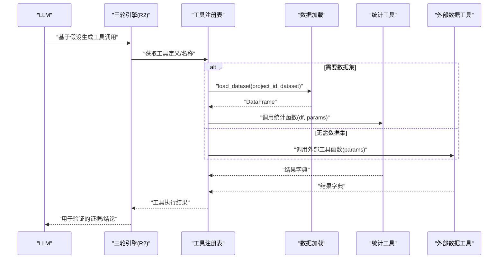
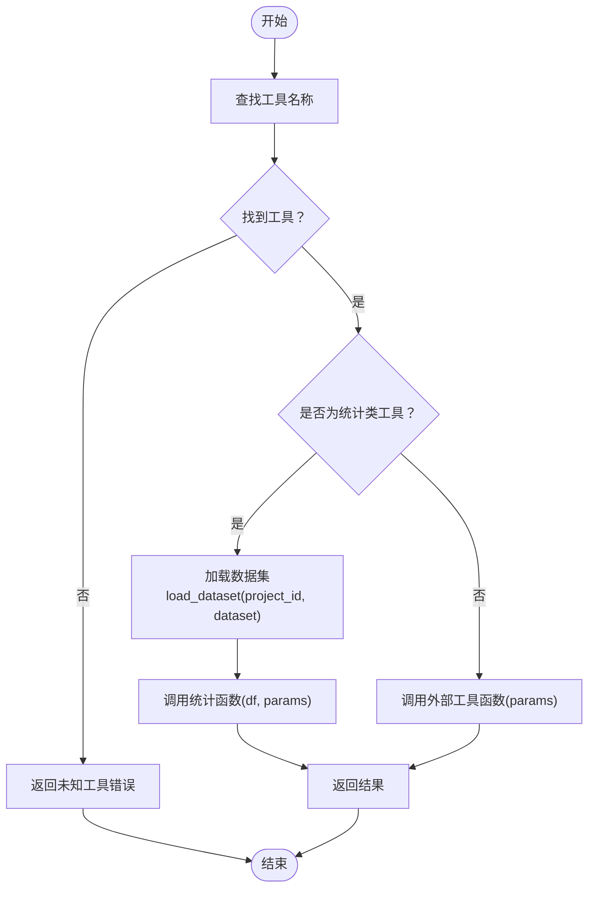
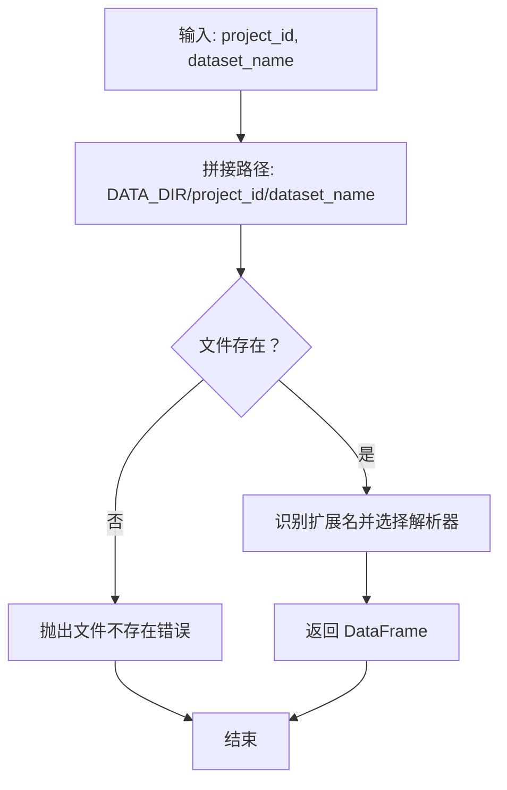
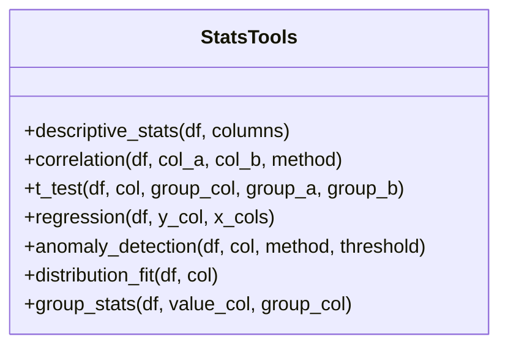
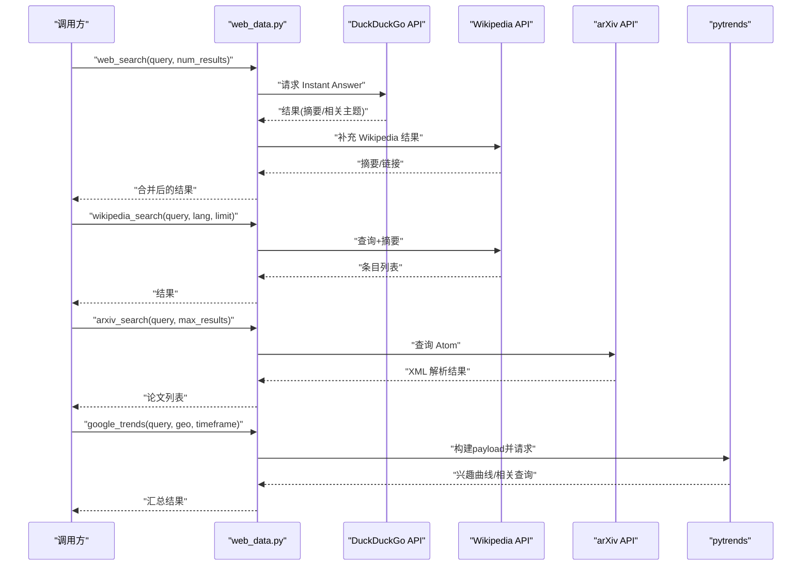
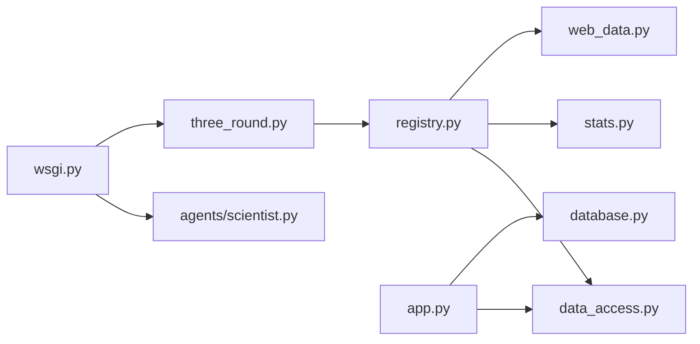

# 工具系统

<cite>
**本文引用的文件**
- [tools/registry.py](file://tools/registry.py)
- [tools/data_access.py](file://tools/data_access.py)
- [tools/stats.py](file://tools/stats.py)
- [tools/web_data.py](file://tools/web_data.py)
- [engines/three_round.py](file://engines/three_round.py)
- [agents/scientist.py](file://agents/scientist.py)
- [app.py](file://app.py)
- [database.py](file://database.py)
- [config.py](file://config.py)
- [wsgi.py](file://wsgi.py)
- [README.md](file://README.md)
</cite>

## 目录
1. [简介](#简介)
2. [项目结构](#项目结构)
3. [核心组件](#核心组件)
4. [架构总览](#架构总览)
5. [详细组件分析](#详细组件分析)
6. [依赖关系分析](#依赖关系分析)
7. [性能考虑](#性能考虑)
8. [故障排查指南](#故障排查指南)
9. [结论](#结论)
10. [附录](#附录)

## 简介
本文件系统性阐述工具系统的整体设计与实现，覆盖以下主题：
- 工具注册机制：注册流程、接口规范、扩展指南
- 数据访问工具：CSV/JSON/XLSX 加载、数据摘要生成
- 统计分析工具：7 种统计方法（描述性统计、相关性分析、回归分析、t 检验、异常检测、分布拟合、分组统计）的使用场景与参数配置
- 外部数据工具：Web Search、Wikipedia、arXiv、Google Trends 的集成与使用
- 工具开发指南与最佳实践

该系统以“工具即函数”的理念组织，通过统一的注册表将工具暴露给 LLM 使用；在研究会话的第二轮中，LLM 通过工具调用对数据进行验证与分析。

## 项目结构
工具系统位于 tools/ 目录，核心文件如下：
- registry.py：工具注册表与分发器，负责工具映射、LLM 工具定义导出、按名称执行工具
- data_access.py：数据集加载与摘要生成，支持 CSV/JSON/JSONL/XLSX
- stats.py：7 种统计分析工具的实现
- web_data.py：外部数据抓取工具（Web Search、Wikipedia、arXiv、Google Trends）

图表来源
- [tools/registry.py:1-181](file://tools/registry.py#L1-L181)
- [tools/data_access.py:1-43](file://tools/data_access.py#L1-L43)
- [tools/stats.py:1-120](file://tools/stats.py#L1-L120)
- [tools/web_data.py:1-164](file://tools/web_data.py#L1-L164)
- [engines/three_round.py:71-100](file://engines/three_round.py#L71-L100)
- [agents/scientist.py:14-74](file://agents/scientist.py#L14-L74)
- [app.py:117-177](file://app.py#L117-L177)
- [database.py:322-344](file://database.py#L322-L344)
- [config.py:1-11](file://config.py#L1-L11)
- [wsgi.py:41-82](file://wsgi.py#L41-L82)

章节来源
- [README.md:94-124](file://README.md#L94-L124)

## 核心组件
- 工具注册表与分发器：集中管理工具名称到实现与 JSON Schema 的映射，提供 LLM 工具定义导出与按名称执行能力
- 数据访问工具：从项目目录加载数据集，解析多种格式，生成数据集摘要供 LLM 上下文使用
- 统计分析工具：提供描述性统计、相关性分析、回归分析、t 检验、异常检测、分布拟合、分组统计
- 外部数据工具：Web 搜索、Wikipedia 检索、arXiv 学术搜索、Google Trends 获取趋势与相关查询

章节来源
- [tools/registry.py:12-42](file://tools/registry.py#L12-L42)
- [tools/data_access.py:10-42](file://tools/data_access.py#L10-L42)
- [tools/stats.py:10-120](file://tools/stats.py#L10-L120)
- [tools/web_data.py:13-164](file://tools/web_data.py#L13-L164)

## 架构总览
工具系统在“三轮引擎”的第二轮被调用，LLM 依据可用工具与数据集摘要生成工具调用请求，工具执行后返回结果，供后续验证与总结。

图表来源
- [engines/three_round.py:77-100](file://engines/three_round.py#L77-L100)
- [tools/registry.py:24-42](file://tools/registry.py#L24-L42)
- [tools/data_access.py:10-24](file://tools/data_access.py#L10-L24)
- [tools/stats.py:10-120](file://tools/stats.py#L10-L120)
- [tools/web_data.py:13-164](file://tools/web_data.py#L13-L164)

## 详细组件分析

### 工具注册机制
- 注册流程
  - 通过注册函数将工具名称、实现函数与输入 JSON Schema 绑定
  - 内置注册了 7 种统计工具与 4 种外部数据工具
- 接口规范
  - 工具函数签名：除统计类工具外，其余工具通常接收命名参数；统计类工具接收 DataFrame 与参数
  - 输入 JSON Schema：包含名称、描述、属性与必填字段，便于 LLM 正确构造调用
- 执行分发
  - 分发器根据工具名查找实现，必要时加载数据集后再调用
  - 统计类工具在执行前从上下文提取数据集名称，若未显式提供则使用第一个数据集
  - 错误处理：捕获异常并返回统一错误结构

图表来源
- [tools/registry.py:24-42](file://tools/registry.py#L24-L42)
- [tools/data_access.py:10-24](file://tools/data_access.py#L10-L24)

章节来源
- [tools/registry.py:12-42](file://tools/registry.py#L12-L42)
- [tools/registry.py:57-181](file://tools/registry.py#L57-L181)

### 数据访问工具
- 支持格式：CSV、JSON/JSONL、XLS/XLSX
- 加载策略：按项目 ID 组织的数据目录，定位文件后按扩展名选择解析器
- 数据摘要：将数据集的列名与类型拼接为可读文本，供 LLM 上下文使用

图表来源
- [tools/data_access.py:10-24](file://tools/data_access.py#L10-L24)

章节来源
- [tools/data_access.py:10-42](file://tools/data_access.py#L10-L42)
- [config.py:4-5](file://config.py#L4-L5)

### 统计分析工具（7 种）
- 描述性统计：对数值列生成均值、标准差、最小/最大、四分位数等
- 相关性分析：皮尔逊/斯皮尔曼相关系数与显著性检验
- 回归分析：多元线性回归，输出截距、回归系数与决定系数
- t 检验：独立样本 t 检验，比较两组均值差异
- 异常检测：基于 Z-Score 或 IQR 方法识别异常点
- 分布拟合：Shapiro-Wilk 正态性检验与偏度/峰度
- 分组统计：按分组列计算每组的计数、均值、标准差、中位数

图表来源
- [tools/stats.py:10-120](file://tools/stats.py#L10-L120)

章节来源
- [tools/stats.py:10-120](file://tools/stats.py#L10-L120)

### 外部数据工具
- Web Search：结合 DuckDuckGo Instant Answer 与 Wikipedia 补充结果
- Wikipedia：按语言与限制返回条目摘要与链接
- arXiv：学术论文检索，解析 Atom XML 输出标题、作者、摘要、时间等
- Google Trends：尝试使用 pytrends 获取兴趣曲线、趋势方向与相关查询（需安装依赖）

图表来源
- [tools/web_data.py:13-164](file://tools/web_data.py#L13-L164)

章节来源
- [tools/web_data.py:13-164](file://tools/web_data.py#L13-L164)

### 工具在引擎中的使用
- 三轮引擎第二轮：向 LLM 展示可用工具清单与数据集摘要，要求其以纯 JSON 形式输出工具调用
- 科学家代理：在生成指令与初始主题时，会将数据集摘要注入系统提示，帮助 LLM 更好地规划研究方向

章节来源
- [engines/three_round.py:77-100](file://engines/three_round.py#L77-L100)
- [agents/scientist.py:24-33](file://agents/scientist.py#L24-L33)

## 依赖关系分析
- 工具注册表依赖数据访问模块与统计/外部工具模块
- 三轮引擎在 R2 阶段依赖注册表导出的工具定义与数据集摘要
- 应用层提供数据上传与数据集列表接口，支撑工具执行所需的数据输入
- 调度器按计划触发科学家与主任任务，间接推动工具使用

图表来源
- [tools/registry.py:1-7](file://tools/registry.py#L1-L7)
- [engines/three_round.py:77-100](file://engines/three_round.py#L77-L100)
- [app.py:117-177](file://app.py#L117-L177)
- [database.py:322-344](file://database.py#L322-L344)
- [wsgi.py:41-82](file://wsgi.py#L41-L82)

章节来源
- [tools/registry.py:1-7](file://tools/registry.py#L1-L7)
- [engines/three_round.py:77-100](file://engines/three_round.py#L77-L100)
- [app.py:117-177](file://app.py#L117-L177)
- [database.py:322-344](file://database.py#L322-L344)
- [wsgi.py:41-82](file://wsgi.py#L41-L82)

## 性能考虑
- 数据加载
  - CSV/JSON/XLSX 解析在单次工具调用中进行，建议控制数据集大小与列数量，避免超大数据导致内存压力
- 统计分析
  - 相关性与回归分析对样本量有阈值要求；异常检测与正态性检验对观测数也有下限；应确保数据质量与规模满足算法需求
- 外部工具
  - Web 搜索与 arXiv 检索涉及网络请求，建议设置合理的超时与重试策略；Google Trends 需要额外依赖，缺失时会返回明确错误信息
- 并发与调度
  - 调度器按固定时间触发任务，注意避免同一时间大量外部请求造成限流或失败

## 故障排查指南
- 工具调用失败
  - 若返回“未知工具”错误，请确认工具名称是否在注册表中
  - 若返回“无数据集指定”，请在调用参数中提供 dataset 字段或确保上下文 datasets 列表非空
- 数据加载失败
  - 文件不存在或扩展名不受支持会导致错误；请检查项目数据目录与文件扩展名
- 统计工具报错
  - 样本量不足或数据类型不匹配会触发错误；请先运行描述性统计了解数据概况
- 外部工具报错
  - Google Trends 未安装依赖时会提示安装；网络异常或 API 返回非 200 也会产生错误
- 日志定位
  - 分发器与外部工具均记录错误日志，可通过日志快速定位问题

章节来源
- [tools/registry.py:24-42](file://tools/registry.py#L24-L42)
- [tools/data_access.py:10-24](file://tools/data_access.py#L10-L24)
- [tools/stats.py:19-32](file://tools/stats.py#L19-L32)
- [tools/web_data.py:125-164](file://tools/web_data.py#L125-L164)

## 结论
工具系统以“注册表 + 统一分发”的方式实现了对内统计与对外数据工具的统一接入，配合三轮引擎的第二轮验证，形成“假设—工具检验—验证总结”的闭环。通过清晰的 JSON Schema 与稳健的错误处理，系统既便于 LLM 使用，也便于开发者扩展新的工具。

## 附录

### 工具注册与扩展指南
- 新增工具步骤
  - 实现函数：遵循现有签名约定（统计类接收 DataFrame，其他接收命名参数）
  - 定义 JSON Schema：包含名称、描述、属性与必填字段
  - 注册：调用注册函数将工具加入注册表
- 最佳实践
  - 参数校验：在函数内部对关键参数进行校验与降级处理
  - 结果标准化：统一返回结构，便于上层消费
  - 文档化：为每个工具编写简要用途与参数说明

章节来源
- [tools/registry.py:12-42](file://tools/registry.py#L12-L42)
- [tools/registry.py:45-54](file://tools/registry.py#L45-L54)

### 统计工具使用场景与参数配置要点
- 描述性统计：用于探索性数据分析，可选列参数限定分析范围
- 相关性分析：选择皮尔逊或斯皮尔曼取决于数据分布与线性关系假设
- 回归分析：确保样本量大于变量数+1，关注共线性与异常值
- t 检验：确保两组样本量均≥2，注意方差齐性假设
- 异常检测：根据业务背景选择 Z-Score 或 IQR，合理设置阈值
- 分布拟合：正态性检验仅作参考，结合偏度/峰度综合判断
- 分组统计：适用于多分类变量的组间对比

章节来源
- [tools/stats.py:10-120](file://tools/stats.py#L10-L120)

### 外部数据工具使用建议
- Web Search：适合初步信息收集，建议结合 Wikipedia 与 arXiv 获取更权威内容
- Wikipedia：多语言支持，适合获取背景知识与术语解释
- arXiv：学术前沿检索，注意筛选关键词与时间范围
- Google Trends：关注趋势方向与相关查询，辅助市场/社会现象分析

章节来源
- [tools/web_data.py:13-164](file://tools/web_data.py#L13-L164)