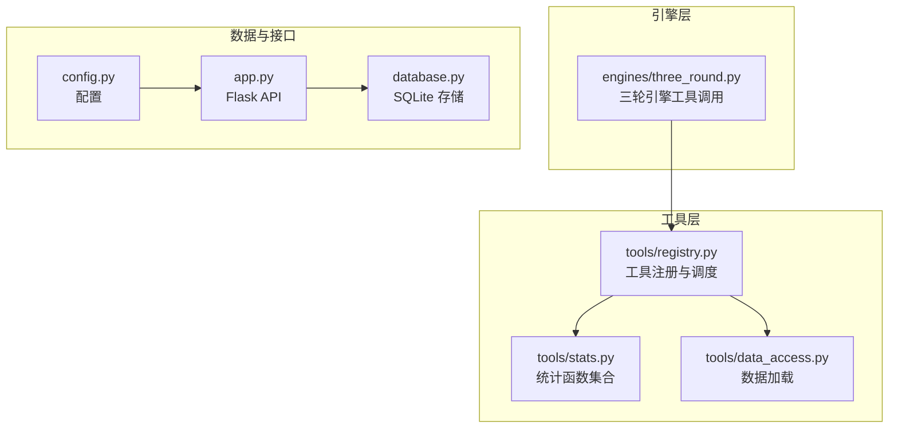
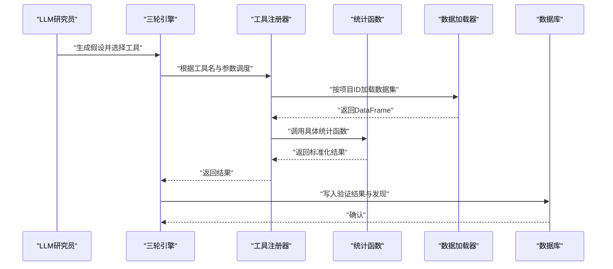
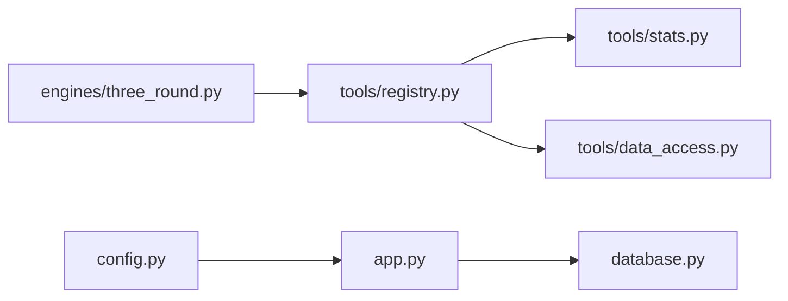

# 统计分析工具

<cite>
**本文引用的文件**
- [tools/stats.py](file://tools/stats.py)
- [tools/registry.py](file://tools/registry.py)
- [tools/data_access.py](file://tools/data_access.py)
- [engines/three_round.py](file://engines/three_round.py)
- [database.py](file://database.py)
- [app.py](file://app.py)
- [config.py](file://config.py)
- [docs/testing.md](file://docs/testing.md)
</cite>

## 目录
1. [简介](#简介)
2. [项目结构](#项目结构)
3. [核心组件](#核心组件)
4. [架构总览](#架构总览)
5. [详细组件分析](#详细组件分析)
6. [依赖关系分析](#依赖关系分析)
7. [性能考虑](#性能考虑)
8. [故障排除指南](#故障排除指南)
9. [结论](#结论)
10. [附录](#附录)

## 简介
本文件系统化梳理“统计分析工具”的7种内置方法：描述性统计、相关性分析、独立样本t检验、多元线性回归、异常检测、分布拟合与分组统计。文档覆盖每种方法的适用场景、算法原理、参数配置、输出结果解释，并结合项目中的工具注册与调用机制，给出在真实工作流中的使用路径与可视化建议。

## 项目结构
该工具位于 tools/stats.py 中，通过 tools/registry.py 将其注册为可被 LLM 调用的工具；数据通过 tools/data_access.py 从项目目录加载；在引擎层（engines/three_round.py）中，LLM 在第二轮以工具调用的方式进行假设检验；最终结果写入数据库（database.py），并通过 Flask 接口对外提供服务（app.py）。

图表来源
- [tools/stats.py:1-120](file://tools/stats.py#L1-L120)
- [tools/registry.py:24-43](file://tools/registry.py#L24-L43)
- [tools/data_access.py:10-24](file://tools/data_access.py#L10-L24)
- [engines/three_round.py:71-158](file://engines/three_round.py#L71-L158)
- [database.py:322-344](file://database.py#L322-L344)
- [app.py:119-152](file://app.py#L119-L152)
- [config.py:4-11](file://config.py#L4-L11)

章节来源
- [tools/stats.py:1-120](file://tools/stats.py#L1-L120)
- [tools/registry.py:24-43](file://tools/registry.py#L24-L43)
- [tools/data_access.py:10-24](file://tools/data_access.py#L10-L24)
- [engines/three_round.py:71-158](file://engines/three_round.py#L71-L158)
- [database.py:322-344](file://database.py#L322-L344)
- [app.py:119-152](file://app.py#L119-L152)
- [config.py:4-11](file://config.py#L4-L11)

## 核心组件
- 统计函数集合：提供7种统计方法的实现与统一返回格式。
- 工具注册与调度：将统计函数映射为 LLM 可用的工具定义，负责参数解析与数据加载。
- 数据访问：按项目维度加载 CSV/JSON/XLSX 等格式数据。
- 引擎集成：在三轮引擎第二阶段以工具调用方式执行统计分析。
- 数据持久化：将分析结果与中间状态写入 SQLite。
- API 接口：提供数据上传、查询等 REST 接口。

章节来源
- [tools/stats.py:10-120](file://tools/stats.py#L10-L120)
- [tools/registry.py:24-43](file://tools/registry.py#L24-L43)
- [tools/data_access.py:10-24](file://tools/data_access.py#L10-L24)
- [engines/three_round.py:71-158](file://engines/three_round.py#L71-L158)
- [database.py:322-344](file://database.py#L322-L344)
- [app.py:119-152](file://app.py#L119-L152)

## 架构总览
下图展示从 LLM 到工具、数据加载、计算与存储的整体流程。

图表来源
- [engines/three_round.py:71-158](file://engines/three_round.py#L71-L158)
- [tools/registry.py:24-43](file://tools/registry.py#L24-L43)
- [tools/data_access.py:10-24](file://tools/data_access.py#L10-L24)
- [database.py:266-295](file://database.py#L266-L295)

## 详细组件分析

### 描述性统计（descriptive_stats）
- 适用场景：快速掌握数值型变量的中心趋势、离散程度与分布形态。
- 算法原理：基于 pandas 的 describe() 计算计数、均值、标准差、最小值、四分位数与最大值。
- 参数配置
  - dataset：数据集文件名
  - columns：可选，指定列名数组；未指定则自动筛选数值型列
- 输出结果
  - stats：各列的描述性指标字典
  - columns：参与分析的列名列表
  - rows：原始行数
- 使用建议
  - 作为第一轮工具调用，帮助 LLM 了解数据概况
  - 结合分组统计与分布拟合进一步细化分析

章节来源
- [tools/stats.py:10-16](file://tools/stats.py#L10-L16)
- [tools/registry.py:59-67](file://tools/registry.py#L59-L67)

### 相关性分析（correlation）
- 适用场景：探索两连续变量之间的线性或单调关系。
- 算法原理
  - Pearson：线性相关系数
  - Spearman：秩相关系数，适用于单调关系
  - 自动对缺失值与非数值进行清洗并对齐
- 参数配置
  - dataset：数据集文件名
  - col_a / col_b：两列名称
  - method：'pearson' 或 'spearman'
- 输出结果
  - correlation：相关系数（保留4位小数）
  - p_value：显著性（保留6位小数）
  - n：有效样本量
  - method：所用方法
- 使用建议
  - 当数据不满足正态性或存在异常值时优先使用 Spearman
  - 结合散点图与残差分析进行综合判断

章节来源
- [tools/stats.py:19-32](file://tools/stats.py#L19-L32)
- [tools/registry.py:69-79](file://tools/registry.py#L69-L79)

### 独立样本 t 检验（t_test）
- 适用场景：比较两个独立组别在某连续变量上的均值是否存在显著差异。
- 算法原理：独立样本 t 检验（两样本方差相等假设下的 t 统计量与双尾 p 值）。
- 参数配置
  - dataset：数据集文件名
  - col：数值型变量
  - group_col：分组变量
  - group_a / group_b：两组标识
- 输出结果
  - t_statistic：t 统计量（保留4位小数）
  - p_value：p 值（保留6位小数）
  - mean_a / mean_b：两组均值
  - n_a / n_b：两组样本量
- 使用建议
  - 检查正态性与方差齐性；若不满足，考虑非参数检验（如 Mann-Whitney U）
  - 报告效应量（如 Cohen’s d）以补充显著性之外的信息

章节来源
- [tools/stats.py:35-46](file://tools/stats.py#L35-L46)
- [tools/registry.py:81-92](file://tools/registry.py#L81-L92)

### 多元线性回归（regression）
- 适用场景：预测连续目标变量，评估多个预测变量的联合影响。
- 算法原理：最小二乘法估计回归系数，计算截距与决定系数 R²。
- 参数配置
  - dataset：数据集文件名
  - y_col：目标变量
  - x_cols：预测变量列表
- 输出结果
  - intercept：截距
  - r_squared：决定系数
  - n：样本量
  - coef_<x>：各预测变量系数
- 使用建议
  - 关注多重共线性、异方差与异常值
  - 结合残差分析与交叉验证评估模型稳定性

章节来源
- [tools/stats.py:49-68](file://tools/stats.py#L49-L68)
- [tools/registry.py:94-103](file://tools/registry.py#L94-L103)

### 异常检测（anomaly_detection）
- 适用场景：识别数值列中的离群点或异常值。
- 算法原理
  - Z-score：基于均值与标准差的标准分数阈值
  - IQR：基于四分位距的边界规则
- 参数配置
  - dataset：数据集文件名
  - col：数值列
  - method：'zscore' 或 'iqr'
  - threshold：Z-score 阈值（默认3.0）
- 输出结果
  - total/anomalies/anomaly_pct：总数、异常数量与占比
  - mean/std：序列均值与标准差
  - anomaly_indices：前若干个异常值索引（最多20个）
- 使用建议
  - IQR 更稳健，适合偏态或厚尾分布
  - 结合业务背景判定是否剔除或进一步调查

章节来源
- [tools/stats.py:71-90](file://tools/stats.py#L71-L90)
- [tools/registry.py:105-115](file://tools/registry.py#L105-L115)

### 分布拟合（distribution_fit）
- 适用场景：检验数据是否近似正态分布，并给出偏度与峰度。
- 算法原理
  - Shapiro–Wilk 正态性检验（最多取前5000个观测）
  - 偏度（skewness）与峰度（kurtosis）用于描述分布对称性与尖锐度
- 参数配置
  - dataset：数据集文件名
  - col：数值列
- 输出结果
  - shapiro_statistic/p_value：W 统计量与 p 值
  - is_normal：基于显著性水平判断是否近似正态
  - n：样本量
  - skewness/kurtosis：偏度与峰度
- 使用建议
  - 正态性是许多 parametric 方法的前提；若不满足，考虑变换或非参数方法

章节来源
- [tools/stats.py:93-104](file://tools/stats.py#L93-L104)
- [tools/registry.py:117-125](file://tools/registry.py#L117-L125)

### 分组统计（group_stats）
- 适用场景：按分类变量对数值变量进行汇总统计。
- 算法原理：按组计算计数、均值、标准差与中位数。
- 参数配置
  - dataset：数据集文件名
  - value_col：数值列
  - group_col：分组列
- 输出结果
  - 每个分组的 count、mean、std、median
- 使用建议
  - 与 t 检验、方差分析等方法结合，形成更完整的组间比较

章节来源
- [tools/stats.py:107-119](file://tools/stats.py#L107-L119)
- [tools/registry.py:127-136](file://tools/registry.py#L127-L136)

## 依赖关系分析
- 工具注册器将统计函数与输入 schema 绑定，统一了参数校验与错误处理。
- 调度器在执行前加载数据集，确保统计函数仅接收清洗后的 DataFrame。
- 引擎在第二轮集中调用工具，形成闭环的数据驱动研究流程。
- 数据库保存会话、发现与队列状态，支撑后续验证与总结。

图表来源
- [tools/registry.py:24-43](file://tools/registry.py#L24-L43)
- [tools/stats.py:10-120](file://tools/stats.py#L10-L120)
- [tools/data_access.py:10-24](file://tools/data_access.py#L10-L24)
- [engines/three_round.py:71-158](file://engines/three_round.py#L71-L158)
- [database.py:322-344](file://database.py#L322-L344)
- [app.py:119-152](file://app.py#L119-L152)
- [config.py:4-11](file://config.py#L4-L11)

章节来源
- [tools/registry.py:24-43](file://tools/registry.py#L24-L43)
- [tools/stats.py:10-120](file://tools/stats.py#L10-L120)
- [tools/data_access.py:10-24](file://tools/data_access.py#L10-L24)
- [engines/three_round.py:71-158](file://engines/three_round.py#L71-L158)
- [database.py:322-344](file://database.py#L322-L344)
- [app.py:119-152](file://app.py#L119-L152)
- [config.py:4-11](file://config.py#L4-L11)

## 性能考虑
- 数据类型转换与缺失值处理：统计函数普遍采用数值转换与丢弃缺失值策略，建议在调用前进行预清洗以减少重复开销。
- 计算复杂度
  - 描述性统计与分组统计：O(n)
  - 相关性分析：O(n)
  - t 检验：O(n_a + n_b)
  - 回归：O(n·p²)（取决于最小二乘求解实现）
  - 异常检测：O(n)
  - 分布拟合：O(n)
- I/O 与内存
  - 数据加载支持 CSV/JSON/XLSX；建议控制单次分析的数据规模，避免过大数据集导致内存压力。
  - 数据库写入采用事务封装，保证一致性但需关注写入频率。

## 故障排除指南
- 数据不足
  - 相关性分析：当有效样本少于3时返回错误提示
  - t 检验：每组样本少于2时返回错误提示
  - 回归：样本数少于预测变量数+2时返回错误提示
  - 异常检测：样本少于5时返回错误提示
  - 分布拟合：样本少于8时返回错误提示
- 方法未知
  - 相关性分析与异常检测：method 不在枚举内时返回错误
- 线性代数异常
  - 回归：当矩阵求解失败时返回错误信息
- 工具调用失败
  - 注册器捕获异常并返回错误字符串，便于定位问题

章节来源
- [tools/stats.py:24-31](file://tools/stats.py#L24-L31)
- [tools/stats.py:39-40](file://tools/stats.py#L39-L40)
- [tools/stats.py:52-60](file://tools/stats.py#L52-L60)
- [tools/stats.py:74-75](file://tools/stats.py#L74-L75)
- [tools/stats.py:96-97](file://tools/stats.py#L96-L97)
- [tools/registry.py:40-42](file://tools/registry.py#L40-L42)

## 结论
该统计分析工具以简洁稳定的实现提供了7种常用统计方法，配合工具注册与调度机制，可在数据驱动的研究流程中高效执行假设检验与结果沉淀。建议在实际应用中结合数据特征选择合适方法，并辅以可视化与业务背景进行综合解读。

## 附录

### 统计假设检验的理论背景与实践要点
- 显著性水平与 p 值：p 值越小，拒绝原假设的证据越强；通常以 0.05 为阈值。
- 效应量：显著性仅说明差异存在与否，效应量（如相关系数、Cohen’s d、R²）反映实际意义大小。
- 正态性与稳健性：正态性检验与图形化诊断有助于判断 parametric 方法适用性。
- 多重比较：同时进行多次检验时需校正显著性水平（如 Bonferroni 校正）。

### 实际应用案例（基于测试用例思路）
- t 检验：比较两组分数均值差异，关注均值差与样本量平衡。
- 回归：预测目标变量，评估变量贡献度与模型拟合优度。
- 异常检测：识别极端值，结合业务规则决定处置策略。
- 分布拟合：判断数据是否近似正态，指导后续分析方法选择。

章节来源
- [docs/testing.md:59-129](file://docs/testing.md#L59-L129)

### 可视化建议与解读指南
- 描述性统计：箱线图、直方图、Q-Q 图辅助观察分布形态与离群点。
- 相关性分析：散点图与回归线展示线性/单调关系，标注相关系数与 p 值。
- t 检验：箱线图或误差条图对比组间均值与变异性。
- 回归：残差图、预测 vs 实际图、系数条形图评估模型拟合与变量重要性。
- 异常检测：带阈值的散点图或密度图高亮异常区间。
- 分布拟合：直方图叠加核密度曲线与正态曲线，结合 Q-Q 图与偏度/峰度解释分布特征。