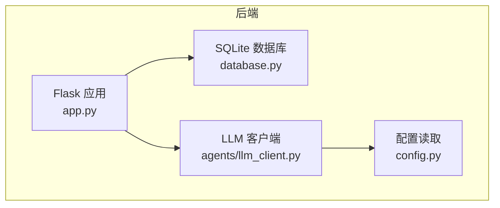
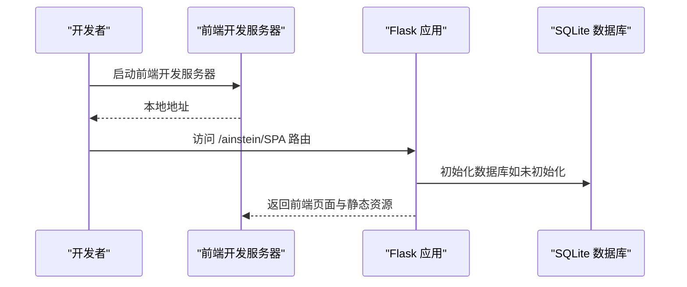
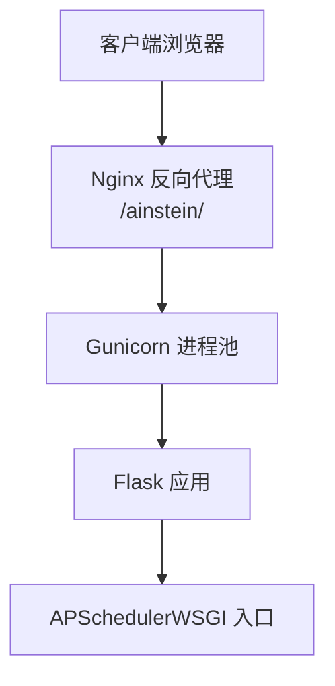
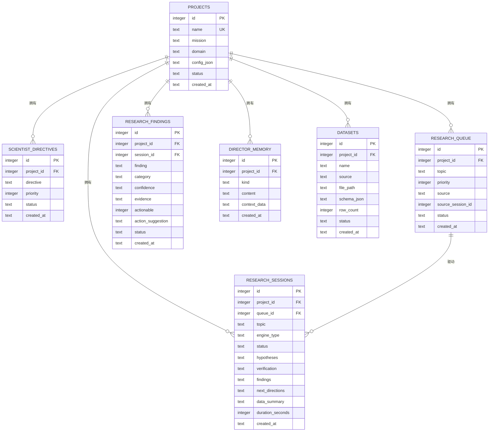
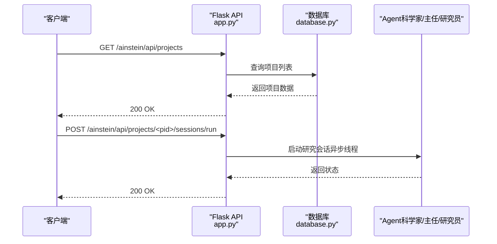
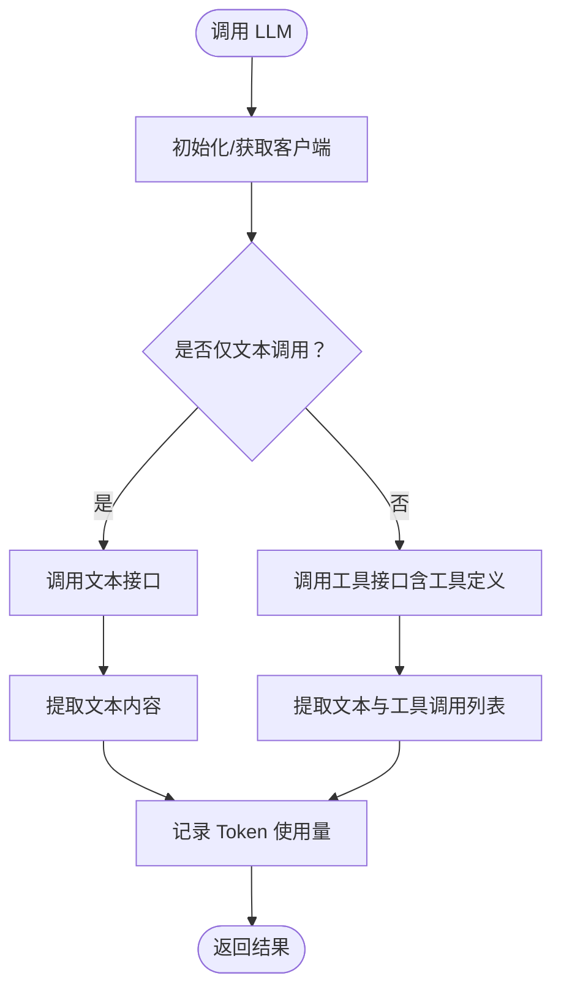

# 快速开始

<cite>
**本文引用的文件**
- [README.md](file://README.md)
- [app.py](file://app.py)
- [config.py](file://config.py)
- [database.py](file://database.py)
- [agents/llm_client.py](file://agents/llm_client.py)
- [frontend/package.json](file://frontend/package.json)
</cite>

## 目录
1. [简介](#简介)
2. [前置要求](#前置要求)
3. [项目克隆与基础准备](#项目克隆与基础准备)
4. [后端安装与配置](#后端安装与配置)
5. [前端安装与配置](#前端安装与配置)
6. [一体化生产环境启动](#一体化生产环境启动)
7. [常见问题排查](#常见问题排查)
8. [结语](#结语)

## 简介
本指南面向新手开发者，帮助你在本地快速搭建并运行 AInstein（爱因斯坦）项目。你将完成环境准备、项目克隆、后端与前端分别安装、数据库初始化、开发服务器启动，并掌握 .env 环境变量配置与生产模式一体化部署的基本流程。

## 前置要求
- Python 3.10 或更高版本
- Node.js 18 或更高版本
- 一个 DashScope（或兼容 Anthropic 协议）的 API Key

以上信息可在项目说明中找到对应要求与技术栈说明。

**章节来源**
- [README.md:19-23](file://README.md#L19-L23)
- [README.md:85-92](file://README.md#L85-L92)

## 项目克隆与基础准备
- 使用 Git 克隆仓库并进入项目目录
- 将示例环境变量文件复制为实际使用的 .env 文件
- 编辑 .env，填入你的 DashScope API Key（以及可选的其他配置）

上述步骤在项目说明中有明确指引，包括克隆命令、复制 .env 的命令及编辑说明。

**章节来源**
- [README.md:25-30](file://README.md#L25-L30)
- [README.md:40-42](file://README.md#L40-L42)

## 后端安装与配置
- 创建 Python 虚拟环境并激活
- 安装后端依赖（Flask、Gunicorn、APScheduler、pandas、scipy、numpy 等）
- 初始化数据库（首次启动会自动创建）
- 启动开发服务器

注意：开发服务器使用 Flask 内置调试模式；生产模式请参考“一体化生产环境启动”。

**章节来源**
- [README.md:32-50](file://README.md#L32-L50)

### 后端核心组件与职责
- 应用入口与路由：Flask 应用负责提供 REST API 与静态资源服务
- 数据层：SQLite 数据库，提供项目、队列、会话、发现、记忆与数据集等表的增删改查
- LLM 客户端：基于 DashScope Anthropic 兼容接口封装的 LLM 调用客户端
- 调度与集成：通过 WSGI 入口与 APScheduler 在生产环境中进行任务调度

**图示来源**
- [app.py:11](file://app.py#L11)
- [database.py:101](file://database.py#L101)
- [agents/llm_client.py:14](file://agents/llm_client.py#L14)
- [config.py:4](file://config.py#L4)

**章节来源**
- [app.py:11](file://app.py#L11)
- [database.py:101](file://database.py#L101)
- [agents/llm_client.py:14](file://agents/llm_client.py#L14)
- [config.py:4](file://config.py#L4)

## 前端安装与配置
- 进入前端目录，安装依赖
- 启动开发服务器
- 在浏览器访问提供的本地地址

前端使用 React + Vite + TypeScript 技术栈，构建产物位于 dist 目录，供后端统一托管。

**章节来源**
- [README.md:52-59](file://README.md#L52-L59)
- [frontend/package.json:6](file://frontend/package.json#L6-L10)

### 前端与后端交互概览
- 前端通过 API 路由访问后端提供的 REST 接口
- 后端在启动时自动初始化数据库，确保表结构存在
- 前端构建产物由后端以静态资源方式提供

**图示来源**
- [app.py:24](file://app.py#L24)
- [app.py:17](file://app.py#L17)
- [database.py:101](file://database.py#L101)

## 一体化生产环境启动
- 激活 Python 虚拟环境
- 导出 .env 中的环境变量
- 使用 Gunicorn 启动应用（WSGI 入口）

生产模式下，前端构建产物通常放置于 dist 目录，并通过 Nginx 反向代理统一对外提供服务。

**章节来源**
- [README.md:61-69](file://README.md#L61-L69)

### 生产部署架构示意
- Nginx 反代 /ainstein/ 请求至后端
- 后端使用 Gunicorn 托管 Flask 应用
- 应用内部集成 APScheduler（通过 WSGI 入口）进行定时任务调度

**图示来源**
- [README.md:71-83](file://README.md#L71-L83)

## 环境变量与配置说明
- 数据库路径：从环境变量读取，默认位于系统路径
- 数据集存储目录：固定为系统路径
- LLM API Key：DashScope API Key
- LLM Base URL：DashScope Anthropic 兼容接口地址
- 模型名称：研究、科学家、主任使用的模型名

建议在 .env 中设置上述键值，以便后端按需读取。

**章节来源**
- [config.py:4](file://config.py#L4)
- [config.py:5](file://config.py#L5)
- [config.py:6](file://config.py#L6)
- [config.py:7](file://config.py#L7)
- [config.py:8](file://config.py#L8)
- [config.py:9](file://config.py#L9)
- [config.py:10](file://config.py#L10)

## 数据库初始化与表结构
- 数据库初始化会在首次请求前自动执行，确保所有表结构存在
- 关键表包括：项目、科学家指令、研究队列、研究会话、研究发现、主任记忆、数据集
- 采用 WAL 日志模式与外键约束，保证并发与一致性

**图示来源**
- [database.py:10](file://database.py#L10)
- [database.py:101](file://database.py#L101)

**章节来源**
- [database.py:10](file://database.py#L10)
- [database.py:101](file://database.py#L101)

## API 路由与调用流程（后端）
- 健康检查、项目管理、队列管理、会话运行、发现查询、数据集上传、科学家与主任运行等接口均通过 /ainstein/api/* 路径暴露
- 会话运行接口支持异步线程启动，避免阻塞主进程
- 数据集上传接口解析 CSV/JSON 并返回结构化信息

**图示来源**
- [app.py:50](file://app.py#L50)
- [app.py:95](file://app.py#L95)
- [database.py:135](file://database.py#L135)

**章节来源**
- [app.py:43](file://app.py#L43)
- [app.py:50](file://app.py#L50)
- [app.py:95](file://app.py#L95)

## LLM 客户端与工具调用
- LLM 客户端封装了 DashScope Anthropic 兼容接口，支持文本与工具调用两种模式
- 支持从响应中提取 JSON（处理带代码块标记的情况）
- 错误日志记录便于定位问题

**图示来源**
- [agents/llm_client.py:14](file://agents/llm_client.py#L14)
- [agents/llm_client.py:24](file://agents/llm_client.py#L24)
- [agents/llm_client.py:47](file://agents/llm_client.py#L47)

**章节来源**
- [agents/llm_client.py:14](file://agents/llm_client.py#L14)
- [agents/llm_client.py:24](file://agents/llm_client.py#L24)
- [agents/llm_client.py:47](file://agents/llm_client.py#L47)

## 常见问题排查
- 端口占用：后端开发服务器默认端口为 9089，请确认未被占用
- 环境变量缺失：若未正确导出 .env，可能导致 LLM 调用失败或数据库路径错误
- 数据库权限：确保数据库文件所在目录具备写权限
- 前端构建：生产模式需先构建前端，再由后端统一托管静态资源

**章节来源**
- [README.md:48](file://README.md#L48)
- [config.py:4](file://config.py#L4)
- [database.py:101](file://database.py#L101)
- [README.md:69](file://README.md#L69)

## 结语
至此，你已完成了从环境准备到本地开发、再到生产模式的一体化部署全流程。建议在本地验证无误后再结合 Nginx 与 systemd 进行更稳定的线上部署。