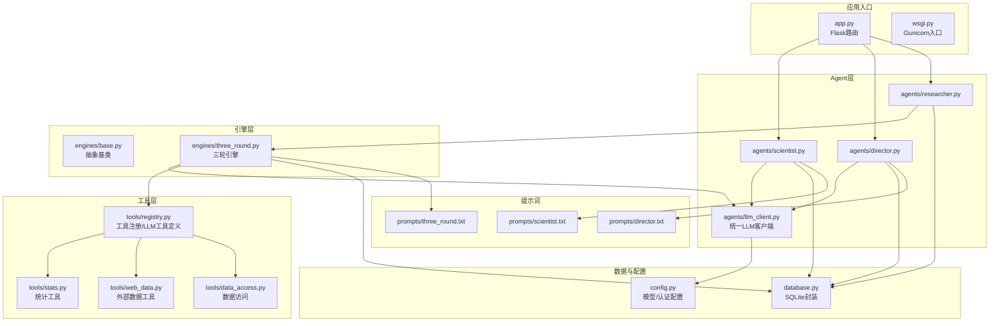
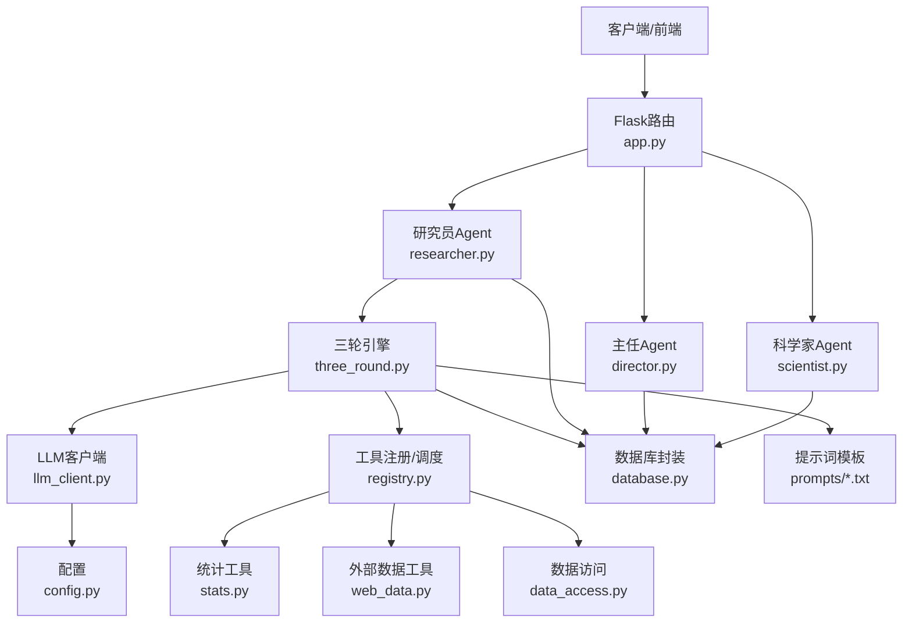
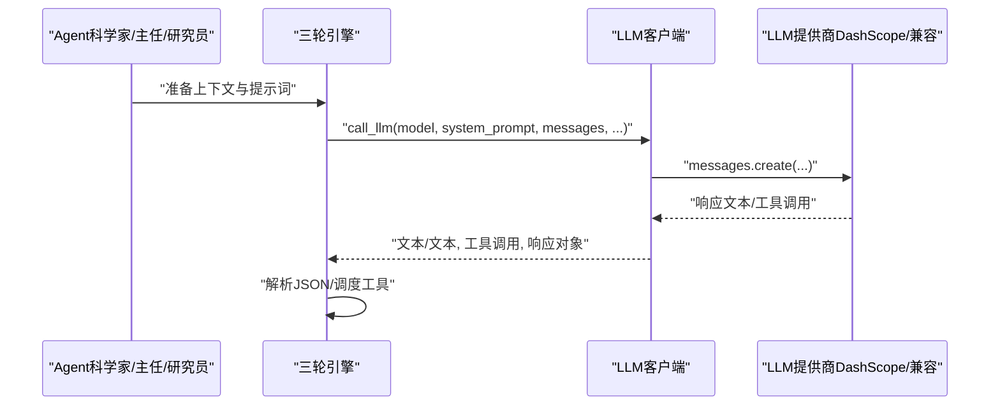
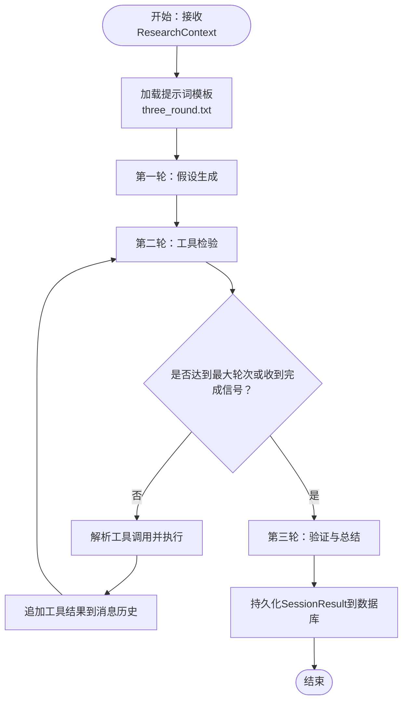
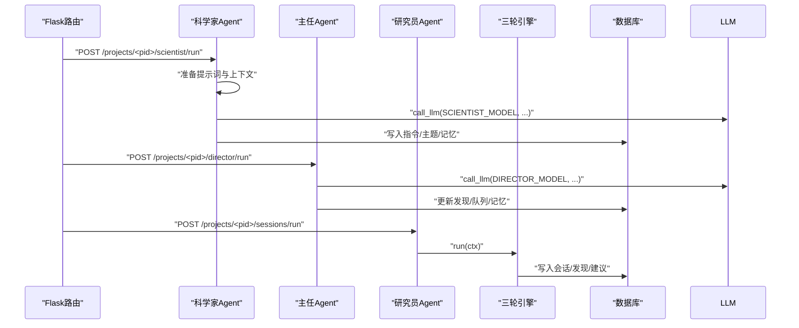
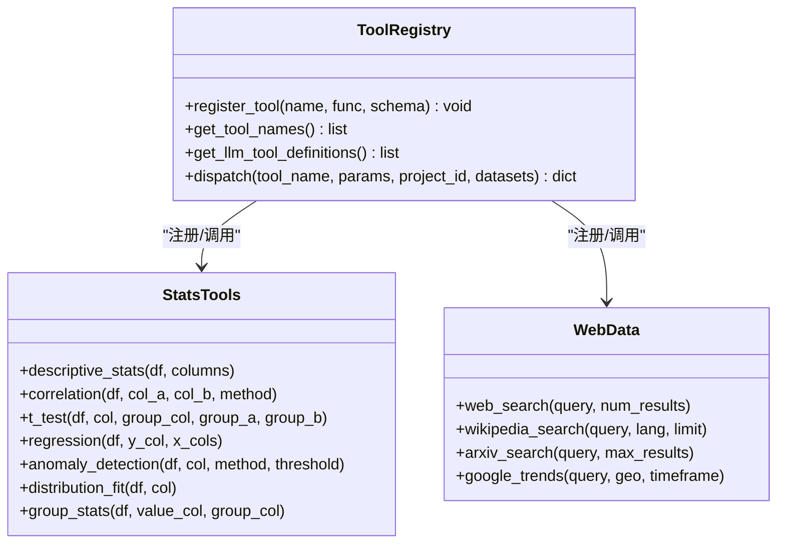
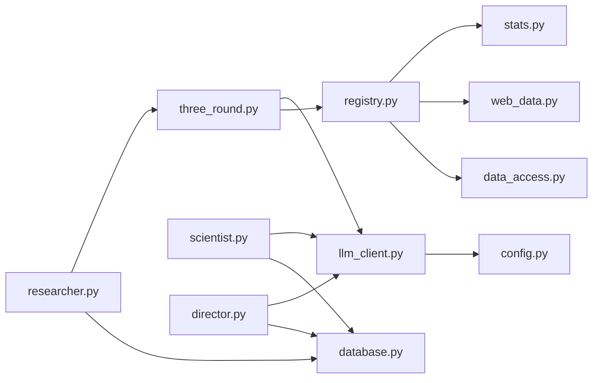

# LLM扩展

<cite>
**本文引用的文件**
- [agents/llm_client.py](file://agents/llm_client.py)
- [config.py](file://config.py)
- [engines/base.py](file://engines/base.py)
- [engines/three_round.py](file://engines/three_round.py)
- [agents/researcher.py](file://agents/researcher.py)
- [agents/scientist.py](file://agents/scientist.py)
- [agents/director.py](file://agents/director.py)
- [tools/registry.py](file://tools/registry.py)
- [tools/data_access.py](file://tools/data_access.py)
- [tools/web_data.py](file://tools/web_data.py)
- [tools/stats.py](file://tools/stats.py)
- [database.py](file://database.py)
- [app.py](file://app.py)
- [prompts/scientist.txt](file://prompts/scientist.txt)
- [prompts/director.txt](file://prompts/director.txt)
- [prompts/three_round.txt](file://prompts/three_round.txt)
- [README.md](file://README.md)
</cite>

## 目录
1. [简介](#简介)
2. [项目结构](#项目结构)
3. [核心组件](#核心组件)
4. [架构总览](#架构总览)
5. [详细组件分析](#详细组件分析)
6. [依赖关系分析](#依赖关系分析)
7. [性能考虑](#性能考虑)
8. [故障排除指南](#故障排除指南)
9. [结论](#结论)
10. [附录](#附录)

## 简介
本指南面向希望在AInstein中扩展大语言模型（LLM）能力的开发者，系统讲解如何接入新的大语言模型服务，包括API适配、认证配置与参数映射；解释LLM客户端的统一接口设计与多模型支持策略；提供从模型参数配置、请求格式转换到响应处理的完整示例；说明模型切换机制、性能优化与成本控制方法，并给出常见模型服务的集成方案与故障排除建议。

## 项目结构
AInstein采用“后端Flask + SQLite + 前端React”的分层架构，围绕三级Agent（科学家→主任→研究员）与三轮研究引擎组织业务逻辑。LLM扩展的关键位置集中在agents/llm_client.py（统一LLM客户端）、engines/three_round.py（引擎与提示词）、tools/registry.py（工具注册与LLM工具定义）以及config.py（模型与认证配置）。

图示来源
- [app.py:1-182](file://app.py#L1-L182)
- [agents/llm_client.py:1-114](file://agents/llm_client.py#L1-L114)
- [engines/base.py:1-49](file://engines/base.py#L1-L49)
- [engines/three_round.py:1-179](file://engines/three_round.py#L1-L179)
- [agents/researcher.py:1-114](file://agents/researcher.py#L1-L114)
- [agents/scientist.py:1-75](file://agents/scientist.py#L1-L75)
- [agents/director.py:1-124](file://agents/director.py#L1-L124)
- [tools/registry.py:1-181](file://tools/registry.py#L1-L181)
- [tools/stats.py:1-120](file://tools/stats.py#L1-L120)
- [tools/web_data.py:1-164](file://tools/web_data.py#L1-L164)
- [tools/data_access.py:1-43](file://tools/data_access.py#L1-L43)
- [config.py:1-11](file://config.py#L1-L11)
- [database.py:1-344](file://database.py#L1-L344)
- [prompts/scientist.txt:1-32](file://prompts/scientist.txt#L1-L32)
- [prompts/director.txt:1-43](file://prompts/director.txt#L1-L43)
- [prompts/three_round.txt:1-15](file://prompts/three_round.txt#L1-L15)

章节来源
- [README.md:71-124](file://README.md#L71-L124)
- [app.py:1-182](file://app.py#L1-L182)

## 核心组件
- 统一LLM客户端：封装Anthropic兼容客户端，提供基础调用、带工具调用与JSON提取等能力，集中管理认证与基础URL。
- 引擎与提示词：三轮引擎按阶段组织研究流程，提示词模板注入上下文与工具信息。
- 工具注册与调度：工具注册表将工具函数与LLM工具定义解耦，支持动态生成工具Schema并进行调用。
- 配置与模型选择：通过环境变量选择不同模型，便于在不修改代码的情况下切换模型。
- Agent编排：科学家/主任/研究员分别承担战略、审核与执行，串联引擎与数据库。

章节来源
- [agents/llm_client.py:14-114](file://agents/llm_client.py#L14-L114)
- [engines/three_round.py:22-179](file://engines/three_round.py#L22-L179)
- [tools/registry.py:12-43](file://tools/registry.py#L12-L43)
- [config.py:6-11](file://config.py#L6-L11)
- [agents/scientist.py:14-75](file://agents/scientist.py#L14-L75)
- [agents/director.py:14-124](file://agents/director.py#L14-L124)
- [agents/researcher.py:14-114](file://agents/researcher.py#L14-L114)

## 架构总览
AInstein通过Flask提供REST API，Agent层负责业务编排，引擎层负责研究流程，工具层提供数据分析与外部数据检索，统一LLM客户端屏蔽底层差异，配置层集中管理模型与认证。

图示来源
- [app.py:1-182](file://app.py#L1-L182)
- [agents/scientist.py:14-75](file://agents/scientist.py#L14-L75)
- [agents/director.py:14-124](file://agents/director.py#L14-L124)
- [agents/researcher.py:14-114](file://agents/researcher.py#L14-L114)
- [engines/three_round.py:22-179](file://engines/three_round.py#L22-L179)
- [agents/llm_client.py:14-114](file://agents/llm_client.py#L14-L114)
- [tools/registry.py:12-43](file://tools/registry.py#L12-L43)
- [tools/stats.py:1-120](file://tools/stats.py#L1-L120)
- [tools/web_data.py:1-164](file://tools/web_data.py#L1-164)
- [tools/data_access.py:1-43](file://tools/data_access.py#L1-L43)
- [database.py:1-344](file://database.py#L1-L344)
- [config.py:1-11](file://config.py#L1-L11)
- [prompts/scientist.txt:1-32](file://prompts/scientist.txt#L1-L32)
- [prompts/director.txt:1-43](file://prompts/director.txt#L1-L43)
- [prompts/three_round.txt:1-15](file://prompts/three_round.txt#L1-L15)

## 详细组件分析

### 统一LLM客户端（agents/llm_client.py）
- 角色与职责
  - 提供单例客户端初始化，集中管理API Key与基础URL。
  - 封装消息创建与响应解析，支持文本与工具调用两种模式。
  - 提供JSON提取工具，增强对LLM输出的鲁棒性。
- 关键点
  - 认证与基础URL来自配置模块，便于切换不同供应商或自建兼容服务。
  - 支持带工具定义的调用，返回文本与工具调用列表，便于引擎进一步调度。
  - 日志记录输入/输出token用量，便于成本与性能追踪。
- 参数映射
  - model：模型标识符（如kimi-k2.6）。
  - system_prompt：系统提示词。
  - messages：消息数组（role/content）。
  - max_tokens/temperature：推理参数。
  - tools：工具定义数组（用于工具调用版本）。

图示来源
- [agents/llm_client.py:24-71](file://agents/llm_client.py#L24-L71)
- [engines/three_round.py:66-136](file://engines/three_round.py#L66-L136)

章节来源
- [agents/llm_client.py:14-114](file://agents/llm_client.py#L14-L114)

### 三轮研究引擎（engines/three_round.py）
- 角色与职责
  - 以“假设生成→工具检验→验证总结”三阶段推进研究。
  - 通过提示词模板注入任务背景、可用工具与上下文。
  - 在工具检验阶段循环调用工具，收集证据并汇总。
- 关键点
  - 使用统一LLM客户端进行三次对话，分别承载三轮任务。
  - 工具调用遵循严格JSON协议，确保可解析性与一致性。
  - 结果持久化至数据库，形成可追溯的知识积累。
- 参数映射
  - 使用RESEARCH_MODEL作为引擎使用的模型标识。
  - 通过get_tool_names动态注入可用工具清单。

图示来源
- [engines/three_round.py:22-179](file://engines/three_round.py#L22-L179)
- [prompts/three_round.txt:1-15](file://prompts/three_round.txt#L1-L15)

章节来源
- [engines/three_round.py:22-179](file://engines/three_round.py#L22-L179)

### Agent编排（agents/scientist.py、agents/director.py、agents/researcher.py）
- 科学家Agent
  - 生成战略指令与初始研究主题，写入数据库队列。
  - 使用SCIENTIST_MODEL调用LLM，解析JSON并落库。
- 主任Agent
  - 汇总近期会话、开放发现、队列与记忆，进行质量审核与队列调整。
  - 使用DIRECTOR_MODEL调用LLM，解析JSON并更新状态。
- 研究员Agent
  - 从队列取任务，构造上下文，调用三轮引擎，回写结果与下一阶段建议。

图示来源
- [agents/scientist.py:14-75](file://agents/scientist.py#L14-L75)
- [agents/director.py:14-124](file://agents/director.py#L14-L124)
- [agents/researcher.py:14-114](file://agents/researcher.py#L14-L114)
- [engines/three_round.py:22-179](file://engines/three_round.py#L22-L179)

章节来源
- [agents/scientist.py:14-75](file://agents/scientist.py#L14-L75)
- [agents/director.py:14-124](file://agents/director.py#L14-L124)
- [agents/researcher.py:14-114](file://agents/researcher.py#L14-L114)

### 工具注册与调度（tools/registry.py）
- 角色与职责
  - 注册内置工具函数与其输入Schema，统一对外暴露LLM工具定义。
  - 提供工具分发函数，根据名称与参数执行对应工具。
- 关键点
  - Schema遵循OpenAI风格，便于LLM生成结构化调用。
  - 对统计工具进行特殊处理，自动加载项目数据集。
  - 错误捕获与日志记录，保证引擎流程稳定。

图示来源
- [tools/registry.py:12-43](file://tools/registry.py#L12-L43)
- [tools/stats.py:1-120](file://tools/stats.py#L1-120)
- [tools/web_data.py:1-164](file://tools/web_data.py#L1-L164)

章节来源
- [tools/registry.py:12-181](file://tools/registry.py#L12-L181)

### 配置与模型选择（config.py）
- 角色与职责
  - 统一管理数据库路径、数据目录、LLM API Key与Base URL，以及各Agent使用的模型标识。
- 关键点
  - 通过环境变量灵活切换模型与认证信息，无需修改代码。
  - 默认模型与兼容URL便于快速接入DashScope或其兼容服务。

章节来源
- [config.py:1-11](file://config.py#L1-L11)

### 数据访问与持久化（tools/data_access.py、database.py）
- 角色与职责
  - 提供数据集加载与摘要生成，支撑Agent与引擎的上下文注入。
  - 封装SQLite操作，提供项目、队列、会话、发现、记忆与数据集的CRUD。
- 关键点
  - 数据集支持CSV/JSON/XLS等格式，自动解析Schema与行数。
  - 数据库采用WAL模式与外键约束，提升并发与一致性。

章节来源
- [tools/data_access.py:10-43](file://tools/data_access.py#L10-L43)
- [database.py:101-344](file://database.py#L101-L344)

## 依赖关系分析
- 组件耦合
  - 引擎依赖LLM客户端与工具注册表，耦合度低，便于替换与扩展。
  - Agent层通过统一接口调用引擎，职责清晰。
  - 数据库封装向上提供稳定的领域模型接口。
- 外部依赖
  - LLM客户端依赖Anthropic兼容SDK与环境变量配置。
  - 工具层依赖pandas/scipy/numpy等科学计算生态。
  - 外部数据工具依赖网络请求与第三方API。
- 循环依赖
  - 未发现直接循环导入；工具注册表在顶层定义，避免循环引用。

图示来源
- [agents/llm_client.py:14-114](file://agents/llm_client.py#L14-L114)
- [engines/three_round.py:22-179](file://engines/three_round.py#L22-L179)
- [tools/registry.py:12-43](file://tools/registry.py#L12-L43)
- [tools/stats.py:1-120](file://tools/stats.py#L1-L120)
- [tools/web_data.py:1-164](file://tools/web_data.py#L1-L164)
- [tools/data_access.py:1-43](file://tools/data_access.py#L1-L43)
- [agents/scientist.py:14-75](file://agents/scientist.py#L14-L75)
- [agents/director.py:14-124](file://agents/director.py#L14-L124)
- [agents/researcher.py:14-114](file://agents/researcher.py#L14-L114)
- [database.py:101-344](file://database.py#L101-L344)
- [config.py:1-11](file://config.py#L1-L11)

章节来源
- [agents/llm_client.py:14-114](file://agents/llm_client.py#L14-L114)
- [engines/three_round.py:22-179](file://engines/three_round.py#L22-L179)
- [tools/registry.py:12-43](file://tools/registry.py#L12-L43)
- [database.py:101-344](file://database.py#L101-L344)

## 性能考虑
- Token与成本控制
  - LLM客户端记录输入/输出token用量，便于成本统计与阈值控制。
  - 建议在调用链路中设置max_tokens上限，避免长尾消耗。
- 并发与稳定性
  - 引擎内部使用较低温度与固定轮次，减少随机性带来的重复开销。
  - 工具调用采用循环与消息历史追加，避免一次性超长上下文。
- 存储与查询
  - 数据库启用WAL模式与索引，提升读写吞吐。
  - 对频繁查询的字段建立索引，减少慢查询风险。

章节来源
- [agents/llm_client.py:40-44](file://agents/llm_client.py#L40-L44)
- [database.py:92-98](file://database.py#L92-L98)

## 故障排除指南
- LLM调用失败
  - 检查API Key与Base URL是否正确配置。
  - 查看错误日志定位异常，确认模型标识是否可用。
- JSON解析失败
  - 使用JSON提取工具增强鲁棒性，必要时放宽容错范围。
- 工具调用异常
  - 确认工具Schema与参数类型一致，检查数据集是否存在。
  - 对统计工具增加最小样本量校验，避免无效结果。
- 数据加载失败
  - 检查文件扩展名与格式，确认数据目录权限。
- 数据库异常
  - 确认数据库初始化成功，检查外键约束与事务回滚。

章节来源
- [agents/llm_client.py:42-44](file://agents/llm_client.py#L42-L44)
- [tools/registry.py:24-42](file://tools/registry.py#L24-L42)
- [tools/data_access.py:10-24](file://tools/data_access.py#L10-L24)
- [database.py:101-123](file://database.py#L101-L123)

## 结论
AInstein通过统一LLM客户端与工具注册表实现了对多模型与多工具的灵活支持。借助提示词模板与Agent编排，系统能够稳定地执行复杂研究流程。扩展新模型或新工具的关键在于：保持LLM客户端接口不变、完善配置项与提示词、规范工具Schema与参数校验。结合成本与性能优化策略，可在保证质量的同时提升整体效率。

## 附录

### 新模型接入步骤（DashScope兼容）
- 准备环境变量
  - 设置API Key与Base URL，确保与DashScope或兼容服务一致。
- 修改模型标识
  - 在配置中设置RESEARCH_MODEL/SCIENTIST_MODEL/DIRECTOR_MODEL为目标模型。
- 验证调用
  - 通过Agent接口触发一次会话，观察日志与数据库落库情况。
- 成本与性能
  - 记录token用量，必要时调整max_tokens与温度参数。

章节来源
- [config.py:6-11](file://config.py#L6-L11)
- [agents/llm_client.py:14-21](file://agents/llm_client.py#L14-L21)
- [agents/scientist.py:47](file://agents/scientist.py#L47)
- [agents/director.py:77](file://agents/director.py#L77)
- [engines/three_round.py:66](file://engines/three_round.py#L66)

### 请求格式与响应处理要点
- 请求格式
  - system_prompt：系统提示词字符串。
  - messages：消息数组，每项含role与content。
  - tools：工具定义数组（仅工具调用版本）。
- 响应处理
  - 文本版本：直接返回LLM输出文本。
  - 工具调用版本：返回文本与工具调用列表，引擎据此调度工具。
  - JSON提取：支持Markdown围栏与裸JSON，自动寻找最大有效JSON块。

章节来源
- [agents/llm_client.py:24-71](file://agents/llm_client.py#L24-L71)
- [engines/three_round.py:105-136](file://engines/three_round.py#L105-L136)

### 常见模型服务集成方案
- DashScope（默认）
  - 使用官方提供的API Key与Base URL，模型标识与兼容性良好。
- 其他兼容服务
  - 保持Anthropic兼容的消息结构与工具调用协议，即可无缝接入。
- 自建服务
  - 确保支持messages.create接口与usage字段，以便成本统计。

章节来源
- [README.md:23](file://README.md#L23)
- [agents/llm_client.py:17-20](file://agents/llm_client.py#L17-L20)