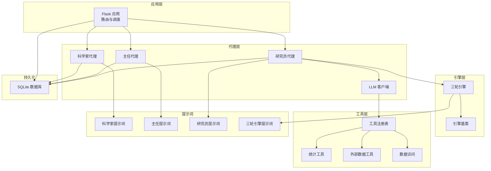
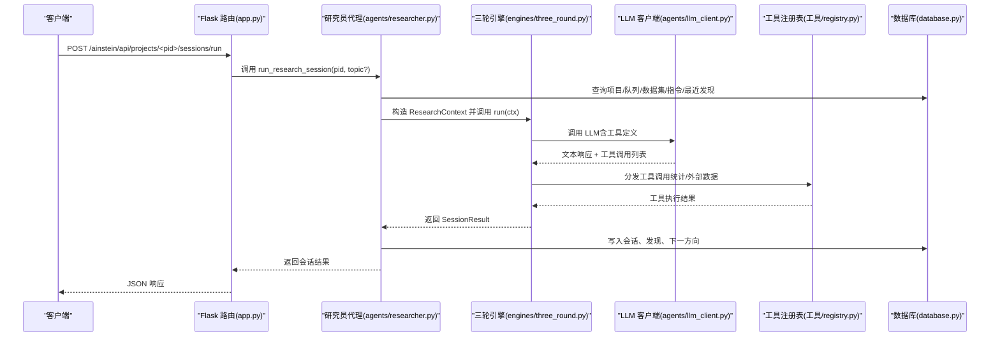
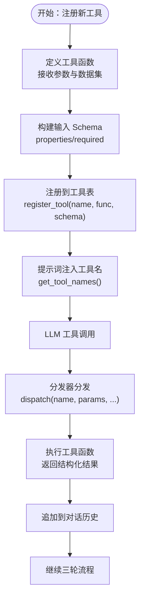
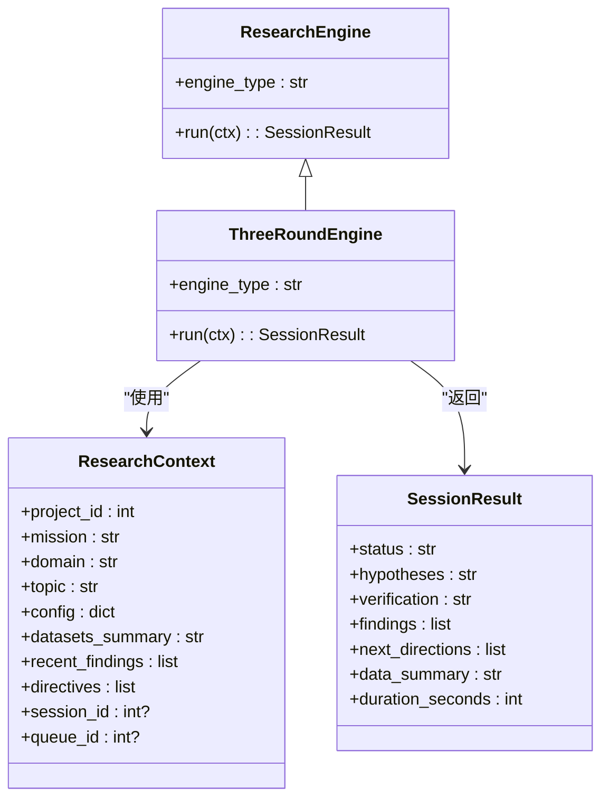
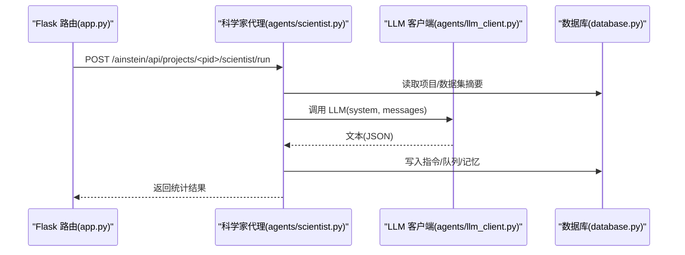
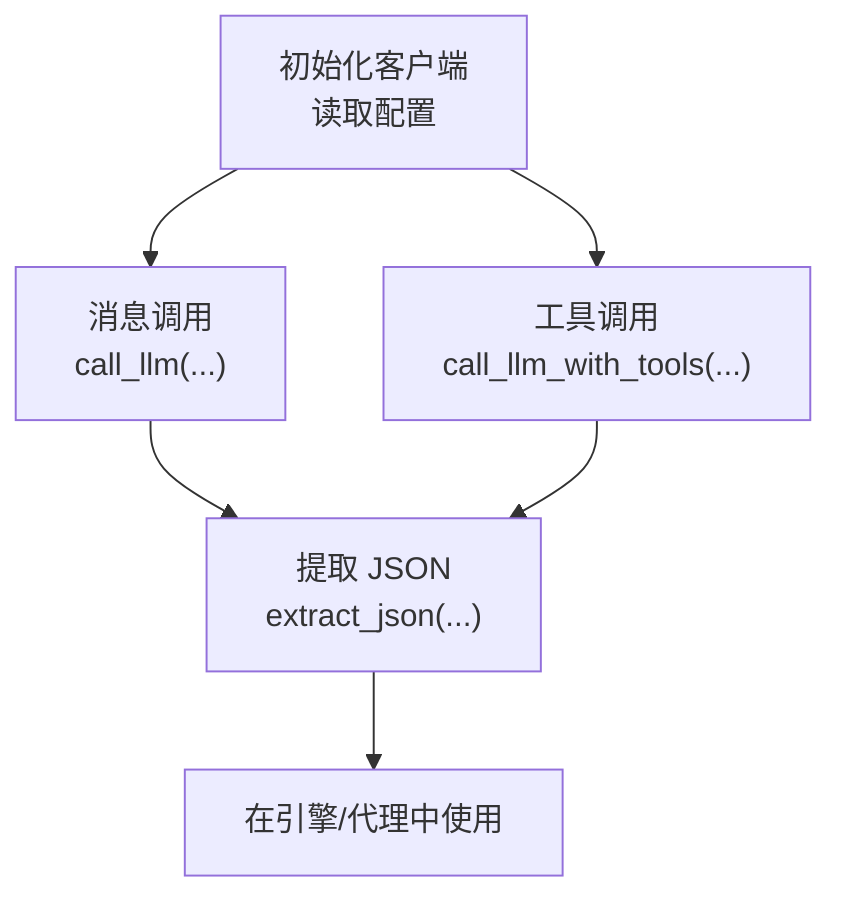
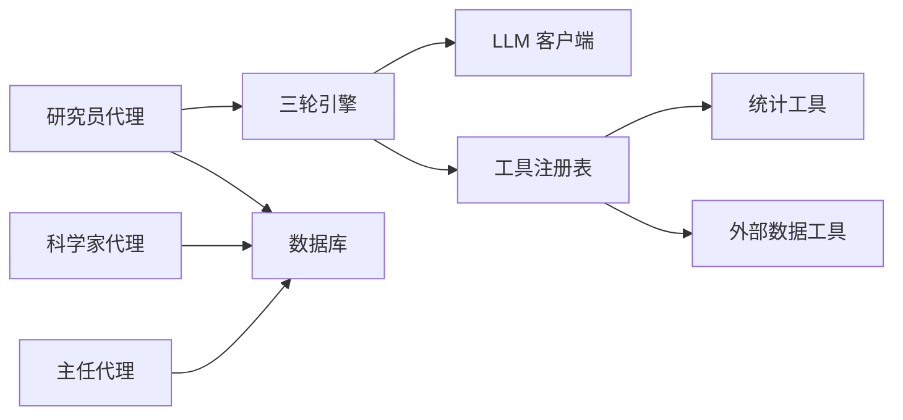

# 扩展开发

<cite>
**本文引用的文件**
- [README.md](file://README.md)
- [app.py](file://app.py)
- [config.py](file://config.py)
- [database.py](file://database.py)
- [engines/base.py](file://engines/base.py)
- [engines/three_round.py](file://engines/three_round.py)
- [tools/registry.py](file://tools/registry.py)
- [tools/stats.py](file://tools/stats.py)
- [tools/web_data.py](file://tools/web_data.py)
- [agents/llm_client.py](file://agents/llm_client.py)
- [agents/scientist.py](file://agents/scientist.py)
- [agents/director.py](file://agents/director.py)
- [agents/researcher.py](file://agents/researcher.py)
- [prompts/scientist.txt](file://prompts/scientist.txt)
- [prompts/director.txt](file://prompts/director.txt)
- [prompts/researcher.txt](file://prompts/researcher.txt)
- [prompts/three_round.txt](file://prompts/three_round.txt)
</cite>

## 目录
1. [简介](#简介)
2. [项目结构](#项目结构)
3. [核心组件](#核心组件)
4. [架构总览](#架构总览)
5. [详细组件分析](#详细组件分析)
6. [依赖关系分析](#依赖关系分析)
7. [性能考量](#性能考量)
8. [故障排查指南](#故障排查指南)
9. [结论](#结论)
10. [附录](#附录)

## 简介
本指南面向希望扩展与定制 AInstein 的开发者，系统讲解以下扩展主题：
- 新增分析工具：工具注册流程、接口规范与集成方法
- 自定义研究引擎：引擎基类继承、方法重写与配置扩展
- 新增 AI 代理：代理接口实现、提示词设计与工作流集成
- LLM 客户端扩展：新模型接入与 API 适配
- 最佳实践与示例路径

AInstein 采用三层 AI 团队（科学家→主任→研究员）与“假设生成→工具检验→验证总结”的三轮引擎，结合内置统计与外部数据工具，形成可扩展的研究自动化框架。

章节来源
- [README.md:1-146](file://README.md#L1-L146)

## 项目结构
后端采用 Flask + Gunicorn + SQLite + APScheduler，前端为 React + Vite + TypeScript。核心目录与职责如下：
- agents：AI 代理层（科学家、主任、研究员、LLM 客户端）
- engines：研究引擎层（基类与三轮引擎）
- tools：工具层（注册表、统计工具、数据访问、外部数据）
- prompts：提示词模板
- app.py：Flask 路由入口
- config.py：环境变量与全局配置
- database.py：SQLite 数据模型与 CRUD
- docs：设计/运维/测试文档

图表来源
- [app.py:1-182](file://app.py#L1-L182)
- [engines/base.py:1-49](file://engines/base.py#L1-L49)
- [engines/three_round.py:1-179](file://engines/three_round.py#L1-L179)
- [tools/registry.py:1-181](file://tools/registry.py#L1-L181)
- [tools/stats.py:1-120](file://tools/stats.py#L1-L120)
- [tools/web_data.py:1-164](file://tools/web_data.py#L1-L164)
- [agents/llm_client.py:1-114](file://agents/llm_client.py#L1-L114)
- [agents/scientist.py:1-75](file://agents/scientist.py#L1-L75)
- [agents/director.py:1-124](file://agents/director.py#L1-L124)
- [agents/researcher.py:1-114](file://agents/researcher.py#L1-L114)
- [database.py:1-344](file://database.py#L1-L344)

章节来源
- [README.md:94-124](file://README.md#L94-L124)
- [app.py:1-182](file://app.py#L1-L182)
- [database.py:10-98](file://database.py#L10-L98)

## 核心组件
- 引擎基类与会话结果
  - ResearchContext：封装单次研究会话所需上下文（项目、使命、领域、主题、配置、数据摘要、近期发现、指令等）
  - SessionResult：封装引擎输出（状态、假设、验证、发现、下一方向、数据摘要、耗时）
  - ResearchEngine：抽象引擎接口，要求实现 engine_type 与 run(ctx)

- 三轮引擎
  - 三阶段流程：假设生成 → 工具检验 → 验证总结
  - 通过提示词模板注入任务目标与工具清单
  - 使用 LLM 客户端与工具注册表进行工具调用与结果解析

- 工具注册与分发
  - 注册表维护工具名到实现函数与 JSON Schema 的映射
  - 分发器根据工具名与参数执行，并处理数据集加载与异常

- 代理层
  - 科学家：生成指令与初始主题，写入数据库
  - 主任：每日审查、队列管理、记忆积累与简报
  - 研究员：从队列取主题，调用引擎，持久化结果与下一方向

- LLM 客户端
  - 支持标准消息调用与工具调用，提供 JSON 提取与令牌用量日志

- 配置与数据库
  - 配置项包含数据库路径、数据目录、API Key、基础 URL 与模型名
  - 数据库定义项目、指令、队列、会话、发现、记忆、数据集等表

章节来源
- [engines/base.py:11-49](file://engines/base.py#L11-L49)
- [engines/three_round.py:22-179](file://engines/three_round.py#L22-L179)
- [tools/registry.py:12-43](file://tools/registry.py#L12-L43)
- [agents/scientist.py:14-75](file://agents/scientist.py#L14-L75)
- [agents/director.py:14-124](file://agents/director.py#L14-L124)
- [agents/researcher.py:14-114](file://agents/researcher.py#L14-L114)
- [agents/llm_client.py:24-114](file://agents/llm_client.py#L24-L114)
- [config.py:1-11](file://config.py#L1-L11)
- [database.py:10-98](file://database.py#L10-L98)

## 架构总览
下图展示从 HTTP 请求到引擎执行再到数据库落库的关键流程。

图表来源
- [app.py:95-104](file://app.py#L95-L104)
- [agents/researcher.py:14-114](file://agents/researcher.py#L14-L114)
- [engines/three_round.py:28-179](file://engines/three_round.py#L28-L179)
- [agents/llm_client.py:47-71](file://agents/llm_client.py#L47-L71)
- [tools/registry.py:24-43](file://tools/registry.py#L24-L43)
- [database.py:232-320](file://database.py#L232-L320)

## 详细组件分析

### 扩展分析工具：注册流程、接口规范与集成
- 注册流程
  - 在工具注册表中通过注册函数登记工具名、实现函数与输入 Schema
  - Schema 必须包含名称、描述与 JSON Schema 的 properties/required 字段
  - 注册完成后，引擎在提示词中注入可用工具名，LLM 可通过工具调用执行

- 接口规范
  - 工具函数签名需接受项目上下文与参数字典
  - 对于需要数据集的统计工具，函数内部应按约定加载数据集并返回结构化结果
  - 工具函数应返回可序列化的字典，包含统计指标、元信息与错误提示

- 集成方法
  - 在引擎中通过分发器调用工具，传入项目 ID、数据集列表与参数
  - 将工具结果拼接到对话历史，驱动后续推理与决策
  - 结果解析需健壮，避免因格式不匹配导致流程中断

图表来源
- [tools/registry.py:12-43](file://tools/registry.py#L12-L43)
- [tools/registry.py:57-181](file://tools/registry.py#L57-L181)
- [engines/three_round.py:32-136](file://engines/three_round.py#L32-L136)
- [tools/stats.py:10-120](file://tools/stats.py#L10-L120)
- [tools/web_data.py:13-164](file://tools/web_data.py#L13-L164)

章节来源
- [tools/registry.py:12-43](file://tools/registry.py#L12-L43)
- [tools/registry.py:57-181](file://tools/registry.py#L57-L181)
- [engines/three_round.py:32-136](file://engines/three_round.py#L32-L136)
- [tools/stats.py:10-120](file://tools/stats.py#L10-L120)
- [tools/web_data.py:13-164](file://tools/web_data.py#L13-L164)

### 开发自定义研究引擎：继承、重写与配置
- 继承与实现
  - 继承引擎基类，实现 engine_type 属性与 run(ctx) 方法
  - run(ctx) 中读取 ResearchContext 的字段，构造系统提示词与消息历史
  - 输出 SessionResult，包含状态、假设、验证、发现、下一方向与耗时

- 配置扩展
  - 引擎类型通过 engine_type 标识，便于路由与调度选择
  - 可通过配置模块读取模型名与提示词路径，支持多模型与多领域提示词

图表来源
- [engines/base.py:38-49](file://engines/base.py#L38-L49)
- [engines/base.py:11-36](file://engines/base.py#L11-L36)
- [engines/three_round.py:22-179](file://engines/three_round.py#L22-L179)

章节来源
- [engines/base.py:11-49](file://engines/base.py#L11-L49)
- [engines/three_round.py:22-179](file://engines/three_round.py#L22-L179)
- [config.py:1-11](file://config.py#L1-L11)

### 开发新的 AI 代理：接口实现、提示词设计与工作流集成
- 代理接口实现
  - 代理函数读取项目信息与数据库上下文（队列、会话、发现、记忆）
  - 调用 LLM 客户端生成结构化 JSON，再写回数据库
  - 返回统计信息（如新增指令数、话题数、记忆数）

- 提示词设计
  - 提示词模板包含角色定位、任务目标、上下文注入与 JSON 输出约束
  - 通过占位符注入 mission、domain、datasets_summary、recent/open/findings、queue、memory 等动态内容

- 工作流集成
  - 通过 Flask 路由触发代理执行
  - 代理执行结果写入数据库，供其他代理与前端展示

图表来源
- [app.py:161-166](file://app.py#L161-L166)
- [agents/scientist.py:14-75](file://agents/scientist.py#L14-L75)
- [agents/llm_client.py:24-45](file://agents/llm_client.py#L24-L45)
- [database.py:171-228](file://database.py#L171-L228)

章节来源
- [agents/scientist.py:14-75](file://agents/scientist.py#L14-L75)
- [agents/director.py:14-124](file://agents/director.py#L14-L124)
- [agents/researcher.py:14-114](file://agents/researcher.py#L14-L114)
- [prompts/scientist.txt:1-32](file://prompts/scientist.txt#L1-L32)
- [prompts/director.txt:1-43](file://prompts/director.txt#L1-L43)
- [prompts/researcher.txt:1-14](file://prompts/researcher.txt#L1-L14)

### LLM 客户端扩展：新模型接入与 API 适配
- 客户端适配
  - 通过统一的客户端初始化与调用接口，支持不同厂商的兼容协议
  - 支持标准消息调用与工具调用两种模式，返回文本与工具调用列表
  - 提供 JSON 提取工具，增强对 LLM 输出的鲁棒解析

- 模型接入
  - 通过配置模块读取模型名与基础 URL/API Key
  - 在代理与引擎中按需切换模型，实现多模型实验与灰度发布

图表来源
- [agents/llm_client.py:14-114](file://agents/llm_client.py#L14-L114)
- [config.py:6-11](file://config.py#L6-L11)
- [agents/scientist.py:47-48](file://agents/scientist.py#L47-L48)
- [agents/director.py:77-78](file://agents/director.py#L77-L78)
- [engines/three_round.py:66-68](file://engines/three_round.py#L66-L68)

章节来源
- [agents/llm_client.py:14-114](file://agents/llm_client.py#L14-L114)
- [config.py:6-11](file://config.py#L6-L11)

## 依赖关系分析
- 组件耦合
  - 研究员代理依赖引擎与数据库；引擎依赖 LLM 客户端与工具注册表；工具注册表依赖统计与外部数据工具
  - 代理层通过提示词模板与数据库上下文解耦，便于替换与扩展

- 外部依赖
  - LLM SDK（Anthropic 协议兼容）、第三方搜索与 arXiv 接口、SQLite

图表来源
- [agents/researcher.py:11-114](file://agents/researcher.py#L11-L114)
- [engines/three_round.py:6-9](file://engines/three_round.py#L6-L9)
- [agents/llm_client.py:1-114](file://agents/llm_client.py#L1-L114)
- [tools/registry.py:1-181](file://tools/registry.py#L1-L181)
- [tools/stats.py:1-120](file://tools/stats.py#L1-L120)
- [tools/web_data.py:1-164](file://tools/web_data.py#L1-L164)
- [database.py:1-344](file://database.py#L1-L344)

章节来源
- [agents/researcher.py:11-114](file://agents/researcher.py#L11-L114)
- [engines/three_round.py:6-9](file://engines/three_round.py#L6-L9)
- [tools/registry.py:1-181](file://tools/registry.py#L1-L181)

## 性能考量
- 数据加载与解析
  - CSV/JSON 解析仅读取少量行用于推断模式，避免全量扫描
  - 工具函数对数值列进行类型转换与缺失值处理，减少无效计算

- LLM 调用
  - 控制消息长度与工具调用次数，避免超长上下文
  - 使用较低温度与合理 max_tokens，平衡稳定性与创造性

- 数据库
  - WAL 模式提升并发写入性能；索引覆盖常用查询字段

章节来源
- [app.py:139-152](file://app.py#L139-L152)
- [tools/stats.py:10-120](file://tools/stats.py#L10-L120)
- [database.py:113-115](file://database.py#L113-L115)
- [database.py:92-98](file://database.py#L92-L98)

## 故障排查指南
- 工具调用失败
  - 检查工具名是否正确、Schema 是否完整、数据集是否存在
  - 查看分发器异常日志，确认参数传递与数据加载

- LLM 输出解析失败
  - 确认提示词约束 JSON 输出，启用严格解析
  - 使用 JSON 提取工具处理夹杂文本与 Markdown 包裹

- 会话执行异常
  - 检查引擎 run(ctx) 异常捕获与数据库状态更新
  - 关注队列状态与会话持久化逻辑

章节来源
- [tools/registry.py:24-43](file://tools/registry.py#L24-L43)
- [agents/llm_client.py:73-114](file://agents/llm_client.py#L73-L114)
- [agents/researcher.py:62-70](file://agents/researcher.py#L62-L70)

## 结论
通过以上扩展点与最佳实践，开发者可以：
- 以最小代价新增分析工具，统一接口与提示词注入
- 以基类继承方式快速实现自定义研究引擎，并与现有工作流无缝衔接
- 以代理接口与提示词模板扩展 AI 角色，完善研究流程
- 以 LLM 客户端适配新模型，满足多厂商与多协议需求

## 附录
- 示例路径（不直接展示代码内容）
  - 新增统计工具：参考统计工具模块的函数签名与返回结构
    - [tools/stats.py:10-120](file://tools/stats.py#L10-L120)
  - 新增外部数据工具：参考外部数据工具模块的请求与解析逻辑
    - [tools/web_data.py:13-164](file://tools/web_data.py#L13-L164)
  - 注册工具到注册表：参考注册表的注册与 Schema 构建
    - [tools/registry.py:57-181](file://tools/registry.py#L57-L181)
  - 实现自定义引擎：参考引擎基类与三轮引擎的实现方式
    - [engines/base.py:38-49](file://engines/base.py#L38-L49)
    - [engines/three_round.py:22-179](file://engines/three_round.py#L22-L179)
  - 新增代理：参考科学家/主任/研究员代理的实现与提示词模板
    - [agents/scientist.py:14-75](file://agents/scientist.py#L14-L75)
    - [agents/director.py:14-124](file://agents/director.py#L14-L124)
    - [agents/researcher.py:14-114](file://agents/researcher.py#L14-L114)
    - [prompts/scientist.txt:1-32](file://prompts/scientist.txt#L1-L32)
    - [prompts/director.txt:1-43](file://prompts/director.txt#L1-L43)
    - [prompts/researcher.txt:1-14](file://prompts/researcher.txt#L1-L14)
    - [prompts/three_round.txt:1-15](file://prompts/three_round.txt#L1-L15)
  - LLM 客户端适配：参考客户端初始化与调用接口
    - [agents/llm_client.py:14-114](file://agents/llm_client.py#L14-L114)
  - 数据库模型与 CRUD：参考数据库层的表结构与操作
    - [database.py:10-98](file://database.py#L10-L98)
    - [database.py:125-344](file://database.py#L125-L344)