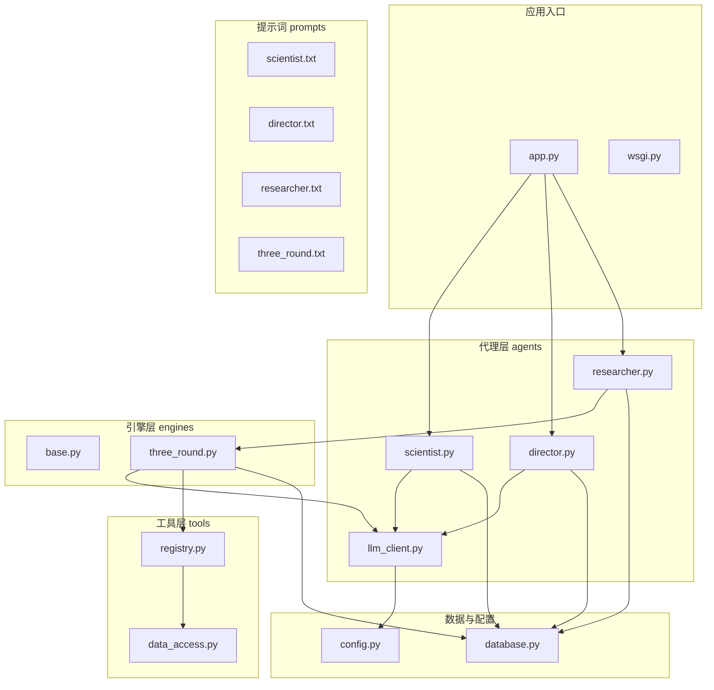
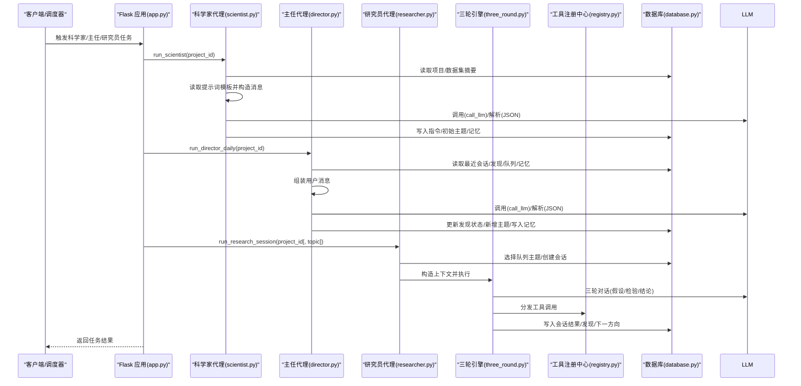
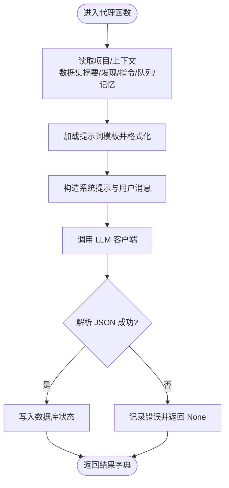
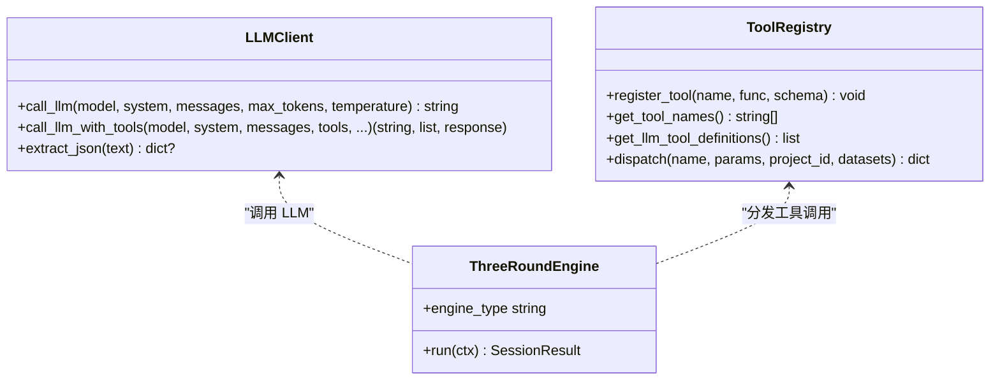
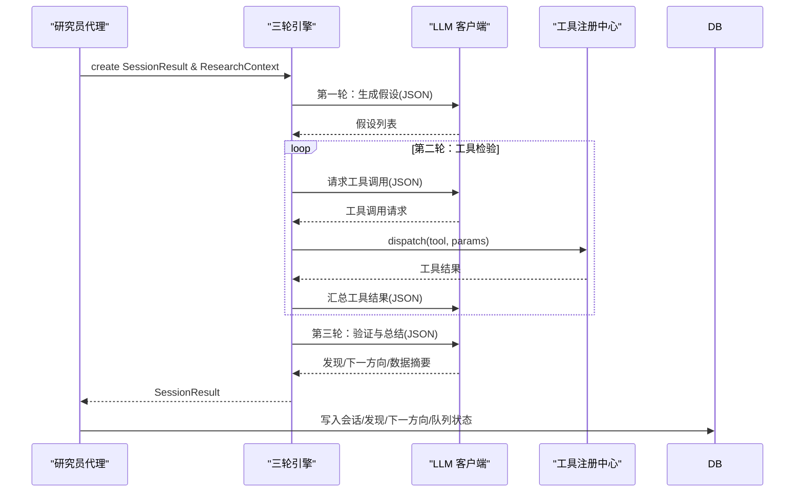
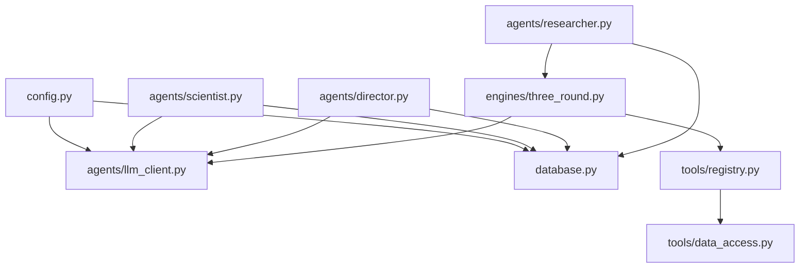

# 新代理开发

<cite>
**本文引用的文件**
- [README.md](file://README.md)
- [config.py](file://config.py)
- [database.py](file://database.py)
- [app.py](file://app.py)
- [wsgi.py](file://wsgi.py)
- [agents/llm_client.py](file://agents/llm_client.py)
- [agents/scientist.py](file://agents/scientist.py)
- [agents/director.py](file://agents/director.py)
- [agents/researcher.py](file://agents/researcher.py)
- [engines/base.py](file://engines/base.py)
- [engines/three_round.py](file://engines/three_round.py)
- [tools/registry.py](file://tools/registry.py)
- [tools/data_access.py](file://tools/data_access.py)
- [prompts/scientist.txt](file://prompts/scientist.txt)
- [prompts/director.txt](file://prompts/director.txt)
- [prompts/researcher.txt](file://prompts/researcher.txt)
- [prompts/three_round.txt](file://prompts/three_round.txt)
</cite>

## 目录
1. [简介](#简介)
2. [项目结构](#项目结构)
3. [核心组件](#核心组件)
4. [架构总览](#架构总览)
5. [详细组件分析](#详细组件分析)
6. [依赖关系分析](#依赖关系分析)
7. [性能考虑](#性能考虑)
8. [故障排查指南](#故障排查指南)
9. [结论](#结论)
10. [附录](#附录)

## 简介
本指南面向希望在 AInstein 平台上开发“新 AI 代理”的工程师与研究者。AInstein 是一个三层 AI 研究团队（科学家 → 主任 → 研究员）的自动化平台，采用“三轮研究引擎”（假设生成 → 工具检验 → 验证总结）进行数据驱动的深度研究。系统通过 LLM 客户端对接 DashScope（或兼容 Anthropic 协议）服务，结合工具注册中心与提示词模板，形成可扩展的代理体系。

本指南将从架构与扩展机制入手，详解如何实现新的 AI 代理、设计工作流程、管理提示词模板、定义代理间协作与通信、以及状态管理与错误处理策略，并给出科学家、研究员、主任三类代理的完整实现范式。

## 项目结构
AInstein 的目录组织采用“按职责分层 + 功能模块化”的方式：
- agents：代理层（科学家、主任、研究员、LLM 客户端）
- engines：研究引擎层（基类与三轮引擎）
- tools：工具层（统计工具、数据访问、网络数据工具、工具注册）
- prompts：提示词模板（科学家、主任、研究员、三轮引擎）
- frontend：React 前端（页面、API、类型）
- docs：设计/运维/测试文档
- 根目录：应用入口、WSGI、配置、数据库层



图表来源
- [app.py](file://app.py)
- [wsgi.py](file://wsgi.py)
- [agents/llm_client.py](file://agents/llm_client.py)
- [agents/scientist.py](file://agents/scientist.py)
- [agents/director.py](file://agents/director.py)
- [agents/researcher.py](file://agents/researcher.py)
- [engines/base.py](file://engines/base.py)
- [engines/three_round.py](file://engines/three_round.py)
- [tools/registry.py](file://tools/registry.py)
- [tools/data_access.py](file://tools/data_access.py)
- [prompts/scientist.txt](file://prompts/scientist.txt)
- [prompts/director.txt](file://prompts/director.txt)
- [prompts/researcher.txt](file://prompts/researcher.txt)
- [prompts/three_round.txt](file://prompts/three_round.txt)
- [database.py](file://database.py)
- [config.py](file://config.py)

章节来源
- [README.md:71-124](file://README.md#L71-L124)

## 核心组件
- LLM 客户端：封装 DashScope/Anthropic 兼容 API，提供基础调用与工具调用能力，并内置 JSON 提取器。
- 代理层：科学家（战略）、主任（审核/队列/记忆）、研究员（会话执行）。
- 研究引擎：引擎基类定义上下文与结果结构；三轮引擎实现“假设 → 工具检验 → 验证总结”的完整流程。
- 工具注册中心：集中注册统计与网络数据工具，提供 LLM 工具定义与分发执行。
- 数据访问：统一加载 CSV/JSON/XLSX 等格式数据，生成可用于 LLM 的数据摘要。
- 数据库层：项目、指令、队列、会话、发现、记忆、数据集等表结构与 CRUD。
- 配置层：集中管理数据库路径、数据目录、API Key、模型名等。

章节来源
- [agents/llm_client.py:1-114](file://agents/llm_client.py#L1-L114)
- [agents/scientist.py:1-75](file://agents/scientist.py#L1-L75)
- [agents/director.py:1-124](file://agents/director.py#L1-L124)
- [agents/researcher.py:1-114](file://agents/researcher.py#L1-L114)
- [engines/base.py:1-49](file://engines/base.py#L1-L49)
- [engines/three_round.py:1-179](file://engines/three_round.py#L1-L179)
- [tools/registry.py:1-181](file://tools/registry.py#L1-L181)
- [tools/data_access.py:1-43](file://tools/data_access.py#L1-L43)
- [database.py:1-344](file://database.py#L1-L344)
- [config.py:1-11](file://config.py#L1-L11)

## 架构总览
AInstein 的控制流自上而下分为三层：
- 应用入口（Flask + Gunicorn）：对外提供 API，调度各代理任务。
- 代理层：科学家生成指令与初始主题；主任每日复盘与队列治理；研究员执行三轮引擎并产出发现。
- 引擎层：三轮引擎串联 LLM 与工具，完成假设生成、工具检验与结论验证。
- 工具层：注册统计与网络工具，统一输入输出规范。
- 数据与提示词：数据库持久化状态，提示词模板注入上下文变量。



图表来源
- [app.py](file://app.py)
- [agents/scientist.py:14-75](file://agents/scientist.py#L14-L75)
- [agents/director.py:14-124](file://agents/director.py#L14-L124)
- [agents/researcher.py:14-114](file://agents/researcher.py#L14-L114)
- [engines/three_round.py:28-179](file://engines/three_round.py#L28-L179)
- [tools/registry.py:24-43](file://tools/registry.py#L24-L43)
- [database.py:127-344](file://database.py#L127-L344)

## 详细组件分析

### 代理接口与实现范式
- 代理职责
  - 科学家：将使命拆解为指令与初始主题，定义发现分类，沉淀战略记忆。
  - 主任：每日复盘，审核发现，治理队列，新增后续主题，积累记忆并撰写简报。
  - 研究员：从队列挑选主题，执行三轮引擎，产出发现与下一方向，更新会话与队列状态。
- 通用实现模式
  - 读取项目信息与上下文（数据集摘要、近期发现、指令、队列、记忆）。
  - 加载对应提示词模板，填充变量，构造系统提示与用户消息。
  - 调用 LLM 客户端，解析 JSON 结果，更新数据库状态。
  - 记录日志与指标，便于可观测性与排障。



图表来源
- [agents/scientist.py:28-52](file://agents/scientist.py#L28-L52)
- [agents/director.py:62-82](file://agents/director.py#L62-L82)
- [agents/researcher.py:52-80](file://agents/researcher.py#L52-L80)
- [agents/llm_client.py:73-114](file://agents/llm_client.py#L73-L114)

章节来源
- [agents/scientist.py:14-75](file://agents/scientist.py#L14-L75)
- [agents/director.py:14-124](file://agents/director.py#L14-L124)
- [agents/researcher.py:14-114](file://agents/researcher.py#L14-L114)
- [agents/llm_client.py:24-114](file://agents/llm_client.py#L24-L114)

### LLM 客户端与工具集成
- LLM 客户端
  - 支持基础文本调用与带工具定义的调用，返回文本与工具调用列表。
  - 内置 JSON 提取器，支持多种边界与嵌套场景，提升鲁棒性。
- 工具注册中心
  - 统一注册统计工具（描述性统计、相关性、t 检验、回归、异常检测、分布拟合、分组统计）与网络数据工具（Web Search、Wikipedia、arXiv、Google Trends）。
  - 提供工具 Schema 与分发执行逻辑，自动装载数据集并传参给工具函数。
- 与引擎协作
  - 三轮引擎在第二轮循环中根据 LLM 输出动态调用工具，收集结果并推进到第三轮。



图表来源
- [agents/llm_client.py:24-114](file://agents/llm_client.py#L24-L114)
- [tools/registry.py:12-43](file://tools/registry.py#L12-L43)
- [engines/three_round.py:28-179](file://engines/three_round.py#L28-L179)

章节来源
- [agents/llm_client.py:1-114](file://agents/llm_client.py#L1-L114)
- [tools/registry.py:1-181](file://tools/registry.py#L1-L181)
- [engines/three_round.py:1-179](file://engines/three_round.py#L1-L179)

### 研究引擎与工作流
- 引擎基类
  - 定义 ResearchContext（项目/使命/领域/主题/配置/数据摘要/近期发现/指令/会话ID/队列ID）与 SessionResult（状态/假设/验证/发现/下一方向/数据摘要/耗时）。
- 三轮引擎
  - 第一轮：生成可检验假设（2-4 个），返回 JSON。
  - 第二轮：基于工具清单与数据集，逐个假设进行工具检验，最多固定轮次，收集测试结果。
  - 第三轮：汇总证据，输出验证结论、关键发现、下一方向与数据摘要。
- 状态持久化
  - 会话创建与更新、发现入库、下一方向入队、队列项状态变更。



图表来源
- [engines/base.py:11-49](file://engines/base.py#L11-L49)
- [engines/three_round.py:28-179](file://engines/three_round.py#L28-L179)
- [agents/researcher.py:52-101](file://agents/researcher.py#L52-L101)

章节来源
- [engines/base.py:1-49](file://engines/base.py#L1-L49)
- [engines/three_round.py:1-179](file://engines/three_round.py#L1-L179)
- [agents/researcher.py:1-114](file://agents/researcher.py#L1-L114)

### 提示词模板与变量注入
- 模板位置：prompts/*.txt
- 变量注入点
  - 科学家：mission、domain、datasets_summary
  - 主任：mission、domain
  - 研究员：mission、domain
  - 三轮引擎：mission、domain、datasets_summary、tool_names
- 设计要点
  - 明确角色定位与约束（如仅输出单个 JSON 对象、限定字段结构）。
  - 在引擎侧拼接上下文（近期发现、指令、数据集摘要），减少 LLM 记忆负担。
  - 通过 JSON 提取器保证解析稳定性。

章节来源
- [prompts/scientist.txt:1-32](file://prompts/scientist.txt#L1-L32)
- [prompts/director.txt:1-43](file://prompts/director.txt#L1-L43)
- [prompts/researcher.txt:1-14](file://prompts/researcher.txt#L1-L14)
- [prompts/three_round.txt:1-15](file://prompts/three_round.txt#L1-L15)
- [engines/three_round.py:32-37](file://engines/three_round.py#L32-L37)
- [agents/scientist.py:28-33](file://agents/scientist.py#L28-L33)
- [agents/director.py:62-72](file://agents/director.py#L62-L72)

### 代理间通信与协作
- 数据库作为共享状态源：指令、队列、会话、发现、记忆均持久化，代理间通过 DB 读写实现无耦合协作。
- 研究员代理在执行会话时，会将“下一方向”写回队列，形成闭环反馈。
- 主任代理基于“近期会话/发现/队列/记忆”进行治理，再将“新增主题”写回队列，驱动后续研究员会话。

```mermaid
graph LR
DB["数据库"] <- --> SCI["科学家代理"]
DB <- --> DIR["主任代理"]
DB <- --> RES["研究员代理"]
RES --> |写入| DB
DIR --> |写入| DB
SCI --> |写入| DB
RES --> |读取| DB
DIR --> |读取| DB
SCI --> |读取| DB
```

图表来源
- [database.py:171-344](file://database.py#L171-L344)
- [agents/scientist.py:54-66](file://agents/scientist.py#L54-L66)
- [agents/director.py:84-115](file://agents/director.py#L84-L115)
- [agents/researcher.py:94-104](file://agents/researcher.py#L94-L104)

章节来源
- [database.py:1-344](file://database.py#L1-L344)
- [agents/scientist.py:1-75](file://agents/scientist.py#L1-L75)
- [agents/director.py:1-124](file://agents/director.py#L1-L124)
- [agents/researcher.py:1-114](file://agents/researcher.py#L1-L114)

### 错误处理策略
- LLM 调用失败：记录错误并抛出异常，避免静默失败。
- JSON 解析失败：尝试多种提取策略（Markdown 区块、直接解析、最大 JSON 片段），若仍失败则记录警告并返回空。
- 引擎执行异常：捕获异常并标记会话失败，同时更新队列项状态，确保状态一致性。
- 工具调用异常：捕获异常并返回错误信息，避免中断整个流程。

章节来源
- [agents/llm_client.py:42-44](file://agents/llm_client.py#L42-L44)
- [agents/llm_client.py:68-70](file://agents/llm_client.py#L68-L70)
- [agents/llm_client.py:112-114](file://agents/llm_client.py#L112-L114)
- [agents/researcher.py:64-69](file://agents/researcher.py#L64-L69)
- [tools/registry.py:40-42](file://tools/registry.py#L40-L42)

## 依赖关系分析
- 组件内聚与耦合
  - 代理层与引擎层通过上下文与结果对象解耦，仅依赖 LLM 客户端与数据库。
  - 引擎层与工具层通过注册中心解耦，工具调用通过名称与 Schema 解耦。
  - 数据库层提供统一的 CRUD 接口，屏蔽存储细节。
- 外部依赖
  - LLM 服务：DashScope（或兼容 Anthropic 协议）。
  - 存储：SQLite（WAL 模式）。
  - 前端：React/Vite，部署于 Nginx。
- 潜在环路
  - 未发现直接循环导入；代理与引擎通过函数调用与数据传递协作。



图表来源
- [config.py:1-11](file://config.py#L1-L11)
- [agents/llm_client.py:1-114](file://agents/llm_client.py#L1-L114)
- [agents/scientist.py:1-75](file://agents/scientist.py#L1-L75)
- [agents/director.py:1-124](file://agents/director.py#L1-L124)
- [agents/researcher.py:1-114](file://agents/researcher.py#L1-L114)
- [engines/three_round.py:1-179](file://engines/three_round.py#L1-L179)
- [tools/registry.py:1-181](file://tools/registry.py#L1-L181)
- [tools/data_access.py:1-43](file://tools/data_access.py#L1-L43)
- [database.py:1-344](file://database.py#L1-L344)

章节来源
- [config.py:1-11](file://config.py#L1-L11)
- [database.py:1-344](file://database.py#L1-L344)

## 性能考虑
- LLM 调用成本控制
  - 合理设置 max_tokens 与 temperature，避免不必要的长输出与高随机性。
  - 在引擎第二轮限制最大工具调用轮次，防止无限循环。
- 数据访问优化
  - 数据集摘要仅包含必要元信息，避免将大文本直接注入 LLM 上下文。
  - 工具调用前先读取数据集 Schema，减少无效调用。
- 数据库事务与索引
  - 使用 WAL 模式与外键约束，确保并发安全与一致性。
  - 为高频查询字段建立索引（队列、会话、发现、记忆、数据集）。
- 日志与可观测性
  - 记录输入/输出 token 数量与耗时，辅助成本与性能分析。

## 故障排查指南
- LLM 调用失败
  - 检查 API Key 与 Base URL 是否正确配置。
  - 查看日志中的错误堆栈，确认网络连通性与配额。
- JSON 解析失败
  - 确认提示词模板严格约束输出格式（例如仅输出单个 JSON 对象）。
  - 使用 JSON 提取器的多策略回退机制，必要时人工校验 LLM 输出。
- 引擎执行异常
  - 捕获异常并检查会话状态是否被标记为 failed。
  - 核对工具调用参数与数据集是否存在。
- 工具调用异常
  - 检查工具名称是否在注册中心存在，参数是否满足 Schema。
  - 确认数据集文件存在且格式受支持。

章节来源
- [agents/llm_client.py:24-44](file://agents/llm_client.py#L24-L44)
- [agents/llm_client.py:73-114](file://agents/llm_client.py#L73-L114)
- [agents/researcher.py:64-69](file://agents/researcher.py#L64-L69)
- [tools/registry.py:24-42](file://tools/registry.py#L24-L42)

## 结论
AInstein 通过“代理 + 引擎 + 工具 + 数据库”的清晰分层，提供了高度可扩展的 AI 研究框架。开发者可以基于现有代理实现范式快速扩展新的代理角色，利用提示词模板与工具注册中心实现一致的交互协议，并通过数据库实现跨代理的状态协同。建议在新增代理时遵循以下原则：
- 明确定义角色职责与输出结构；
- 严格约束提示词模板，确保可解析性；
- 通过工具注册中心统一接入外部能力；
- 以数据库为中心进行状态管理与持久化；
- 健全错误处理与可观测性。

## 附录

### 新代理开发步骤清单
- 定义角色与职责：明确输入上下文、输出结构、与数据库的交互点。
- 设计提示词模板：在 prompts 目录新增模板，注入必要的变量。
- 实现代理函数：读取上下文 → 加载模板 → 构造消息 → 调用 LLM → 解析 JSON → 更新数据库。
- 注册工具（如需）：在工具注册中心添加新工具的 Schema 与实现。
- 编写单元/集成测试：覆盖正常流程与异常路径。
- 集成调度：在应用入口或调度器中注册新代理的任务触发逻辑。
- 部署与监控：配置环境变量，观察日志与指标，持续优化。

### 三类代理实现要点速查
- 科学家代理
  - 输入：项目信息、数据集摘要
  - 输出：指令、初始主题、发现分类、战略记忆
  - 关键：将使命分解为可执行的指令与主题，定义可追踪的发现类别
- 主任代理
  - 输入：近期会话/发现、队列、记忆
  - 输出：发现审核、队列治理、新增主题、记忆条目、简报
  - 关键：质量把关与知识沉淀，形成闭环反馈
- 研究员代理
  - 输入：队列主题、指令、近期发现、数据集摘要
  - 输出：会话结果、发现、下一方向
  - 关键：严格执行三轮引擎，确保可重复与可验证