# 新工具开发

<cite>
**本文档中引用的文件**
- [README.md](file://README.md)
- [config.py](file://config.py)
- [database.py](file://database.py)
- [app.py](file://app.py)
- [tools/registry.py](file://tools/registry.py)
- [tools/stats.py](file://tools/stats.py)
- [tools/data_access.py](file://tools/data_access.py)
- [tools/web_data.py](file://tools/web_data.py)
- [engines/base.py](file://engines/base.py)
- [engines/three_round.py](file://engines/three_round.py)
- [agents/researcher.py](file://agents/researcher.py)
- [agents/llm_client.py](file://agents/llm_client.py)
- [prompts/three_round.txt](file://prompts/three_round.txt)
</cite>

## 目录
1. [简介](#简介)
2. [项目结构](#项目结构)
3. [核心组件](#核心组件)
4. [架构总览](#架构总览)
5. [详细组件分析](#详细组件分析)
6. [依赖关系分析](#依赖关系分析)
7. [性能考虑](#性能考虑)
8. [故障排除指南](#故障排除指南)
9. [结论](#结论)
10. [附录](#附录)

## 简介

AInstein是一个通用AI深度研究平台，采用三级AI团队协作模式（科学家→主任→研究员），通过三轮研究引擎实现假设生成→工具检验→验证总结的完整研究流程。该平台提供了完善的工具系统扩展机制，支持开发者创建自定义分析工具，涵盖统计分析、数据访问和外部数据获取等多个领域。

本指南将详细介绍AInstein工具系统的扩展机制，包括工具注册流程、接口规范和集成方法，帮助开发者快速上手新工具开发。

## 项目结构

AInstein采用模块化架构设计，主要目录结构如下：

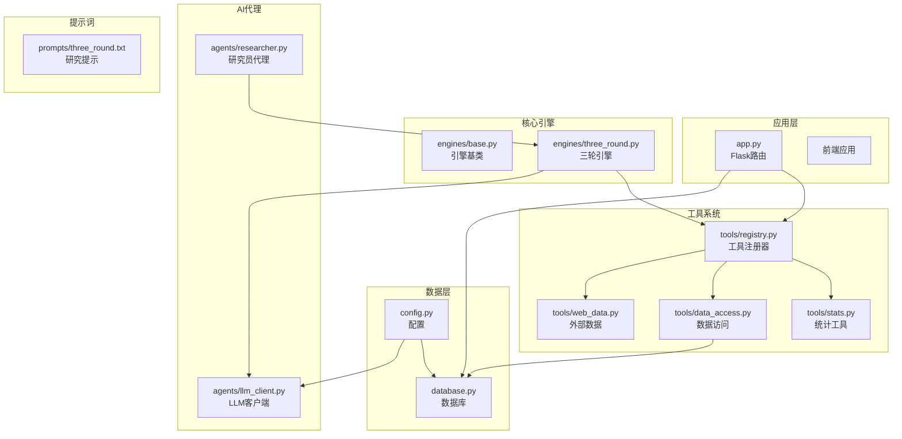

**图表来源**
- [app.py:1-182](file://app.py#L1-L182)
- [engines/base.py:1-49](file://engines/base.py#L1-L49)
- [engines/three_round.py:1-179](file://engines/three_round.py#L1-L179)
- [tools/registry.py:1-181](file://tools/registry.py#L1-L181)

**章节来源**
- [README.md:94-124](file://README.md#L94-L124)
- [app.py:1-182](file://app.py#L1-L182)

## 核心组件

### 工具注册系统

工具注册系统是AInstein的核心扩展机制，负责管理所有可用工具及其元数据定义。

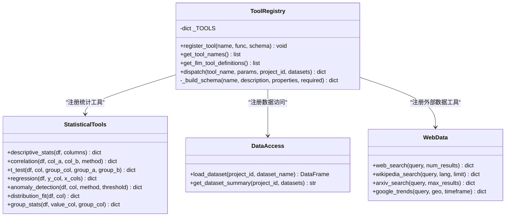

**图表来源**
- [tools/registry.py:12-54](file://tools/registry.py#L12-L54)
- [tools/stats.py:10-120](file://tools/stats.py#L10-L120)
- [tools/data_access.py:10-43](file://tools/data_access.py#L10-L43)
- [tools/web_data.py:13-164](file://tools/web_data.py#L13-L164)

### 研究引擎架构

三轮研究引擎实现了完整的AI研究流程，支持工具调用和结果处理。

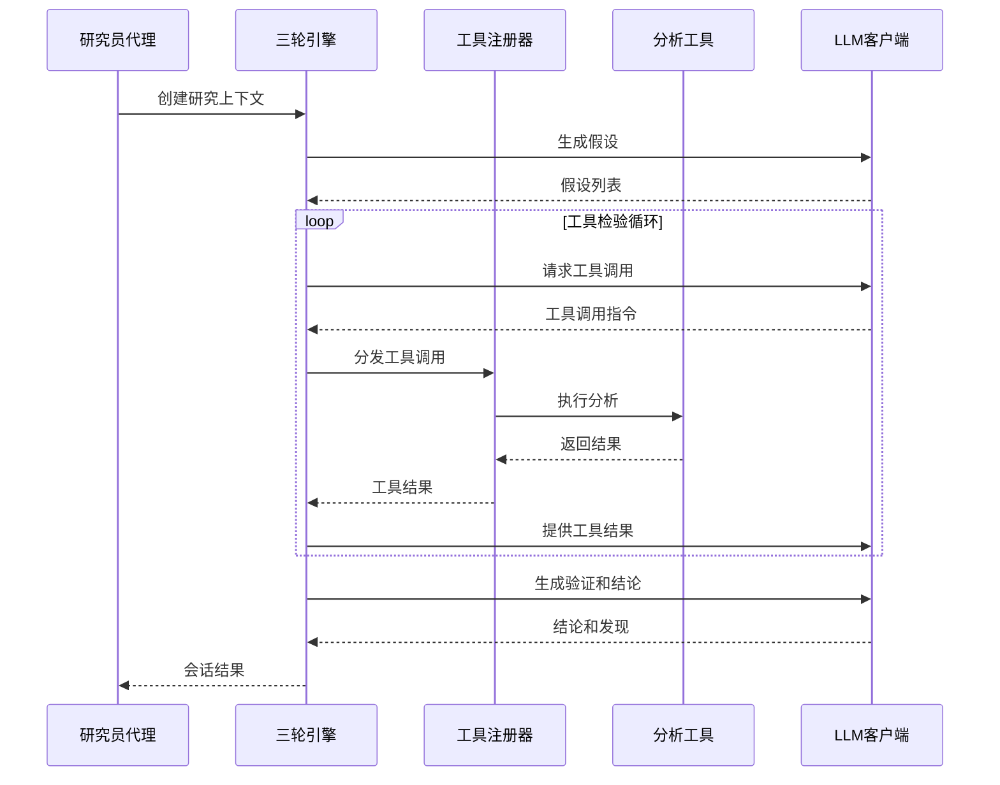

**图表来源**
- [engines/three_round.py:28-179](file://engines/three_round.py#L28-L179)
- [tools/registry.py:24-42](file://tools/registry.py#L24-L42)
- [agents/llm_client.py:24-71](file://agents/llm_client.py#L24-L71)

**章节来源**
- [tools/registry.py:1-181](file://tools/registry.py#L1-L181)
- [engines/three_round.py:1-179](file://engines/three_round.py#L1-L179)

## 架构总览

AInstein的整体架构采用分层设计，确保了良好的可扩展性和维护性。

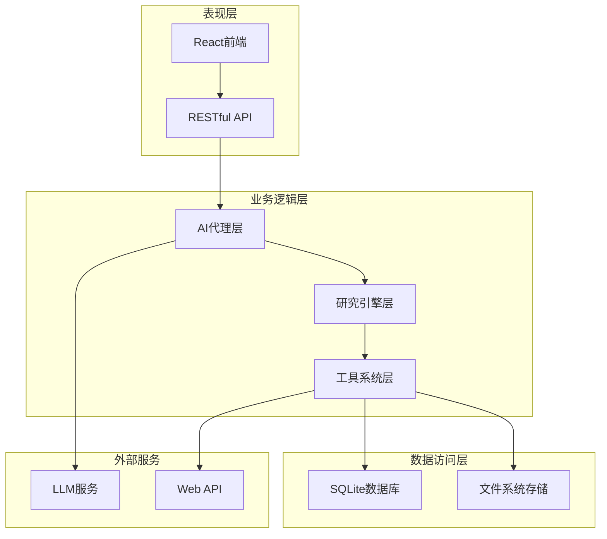

**图表来源**
- [app.py:1-182](file://app.py#L1-L182)
- [database.py:1-344](file://database.py#L1-L344)
- [agents/llm_client.py:1-114](file://agents/llm_client.py#L1-L114)

## 详细组件分析

### 工具注册器详解

工具注册器是整个工具系统的核心，负责工具的注册、管理和分发。

#### 注册流程

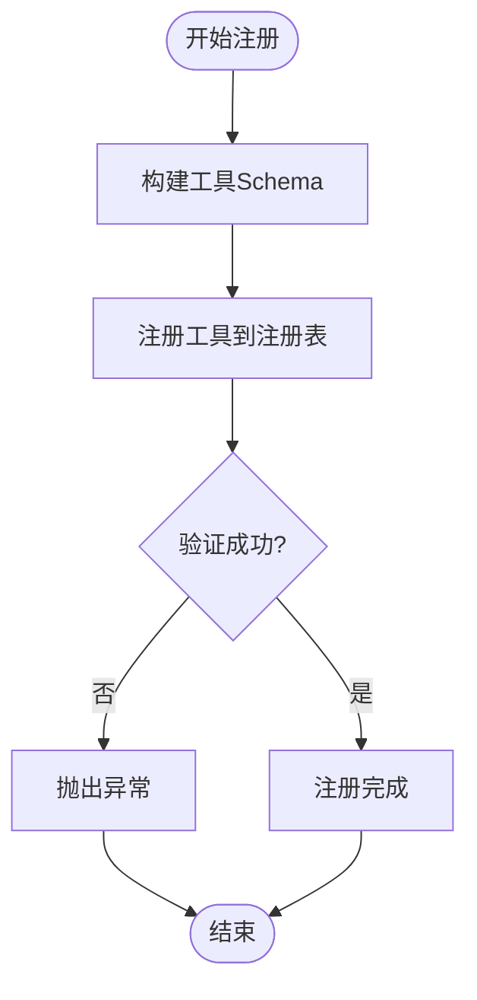

**图表来源**
- [tools/registry.py:12-14](file://tools/registry.py#L12-L14)
- [tools/registry.py:45-54](file://tools/registry.py#L45-L54)

#### 工具分发机制

工具分发器根据工具类型决定数据处理流程：

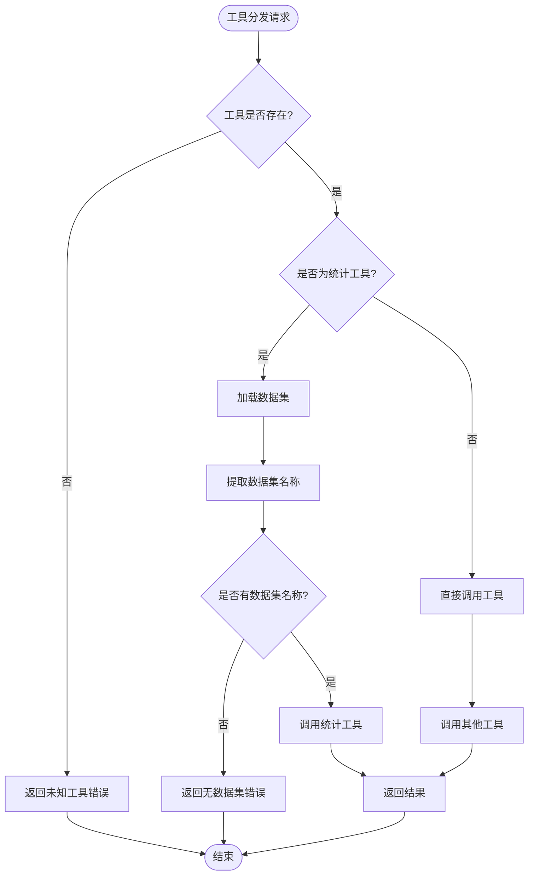

**图表来源**
- [tools/registry.py:24-42](file://tools/registry.py#L24-L42)
- [tools/data_access.py:10-24](file://tools/data_access.py#L10-L24)

**章节来源**
- [tools/registry.py:12-54](file://tools/registry.py#L12-L54)
- [tools/registry.py:24-42](file://tools/registry.py#L24-L42)

### 统计分析工具

统计分析工具提供了7种核心统计功能，每种工具都有明确的接口规范和参数验证。

#### 描述性统计工具

描述性统计工具用于计算数值列的基本统计信息：

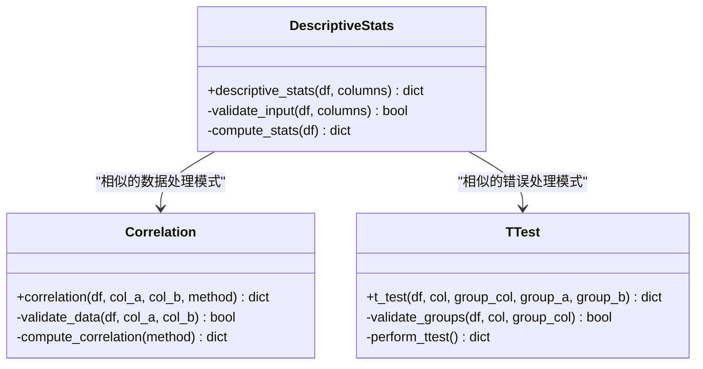

**图表来源**
- [tools/stats.py:10-17](file://tools/stats.py#L10-L17)
- [tools/stats.py:19-32](file://tools/stats.py#L19-L32)
- [tools/stats.py:35-46](file://tools/stats.py#L35-L46)

#### 参数验证和错误处理

统计工具普遍采用以下验证模式：

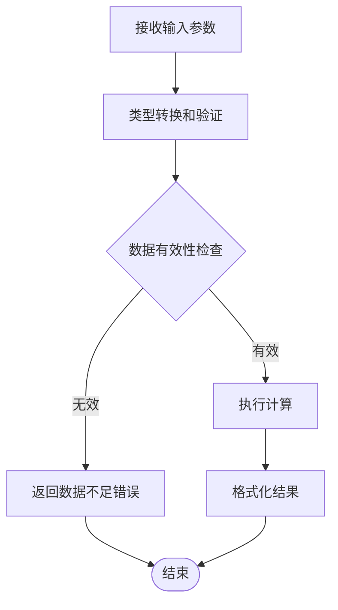

**图表来源**
- [tools/stats.py:24-25](file://tools/stats.py#L24-L25)
- [tools/stats.py:39-40](file://tools/stats.py#L39-L40)
- [tools/stats.py:52-60](file://tools/stats.py#L52-L60)

**章节来源**
- [tools/stats.py:10-120](file://tools/stats.py#L10-L120)

### 数据访问层

数据访问层提供了统一的数据加载接口，支持多种文件格式。

#### 支持的数据格式

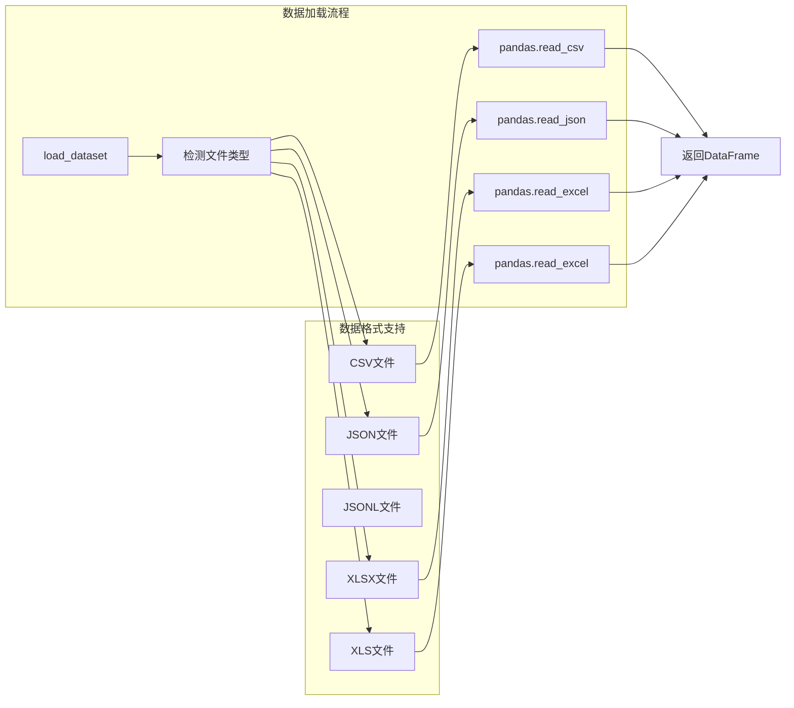

**图表来源**
- [tools/data_access.py:10-24](file://tools/data_access.py#L10-L24)

#### 数据集摘要生成

数据集摘要功能为LLM提供上下文信息：

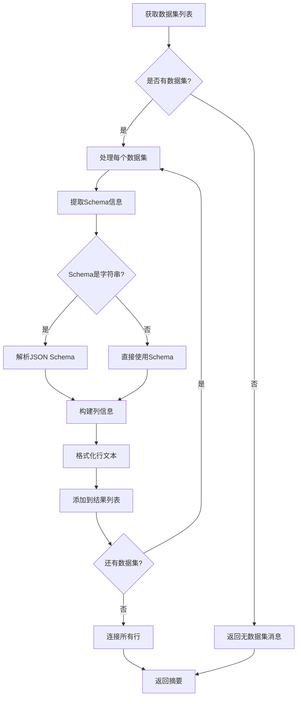

**图表来源**
- [tools/data_access.py:27-42](file://tools/data_access.py#L27-L42)

**章节来源**
- [tools/data_access.py:10-43](file://tools/data_access.py#L10-L43)

### 外部数据工具

外部数据工具提供了访问Web资源的能力，包括搜索引擎、学术数据库等。

#### Web搜索工具

Web搜索工具结合了多个数据源：

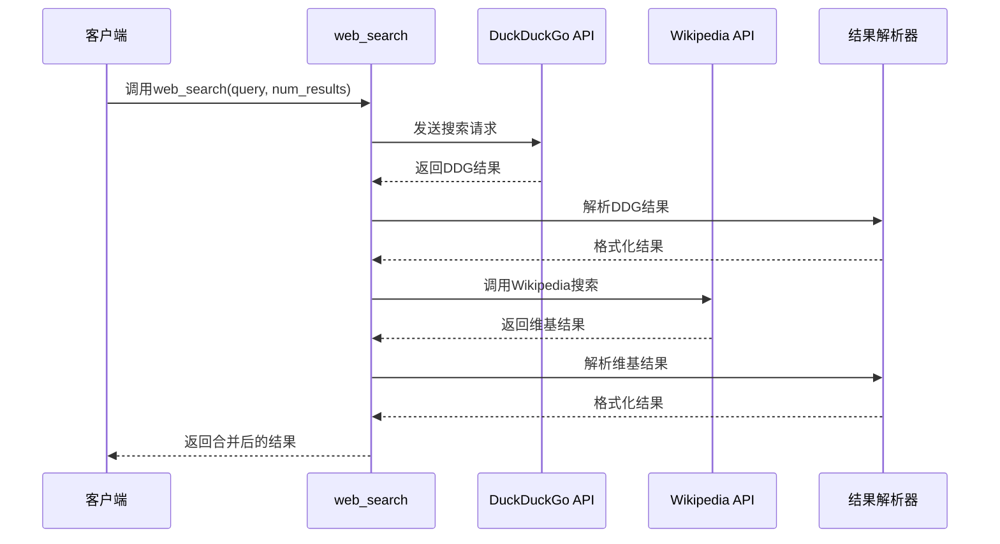

**图表来源**
- [tools/web_data.py:13-50](file://tools/web_data.py#L13-L50)

#### arXiv学术搜索

arXiv搜索工具展示了XML解析和数据提取的典型模式：

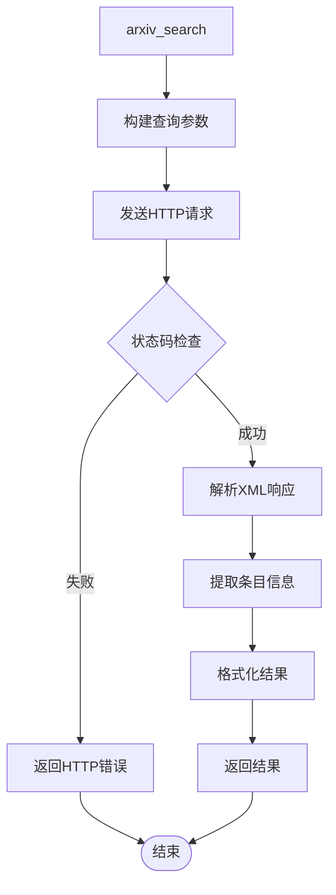

**图表来源**
- [tools/web_data.py:87-122](file://tools/web_data.py#L87-L122)

**章节来源**
- [tools/web_data.py:13-164](file://tools/web_data.py#L13-L164)

## 依赖关系分析

AInstein的依赖关系清晰且层次分明，确保了模块间的松耦合。

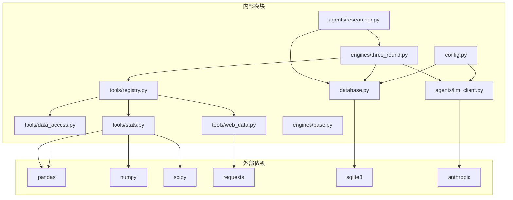

**图表来源**
- [tools/registry.py:1-8](file://tools/registry.py#L1-L8)
- [tools/stats.py:1-6](file://tools/stats.py#L1-L6)
- [tools/data_access.py:1-5](file://tools/data_access.py#L1-L5)
- [tools/web_data.py:1-5](file://tools/web_data.py#L1-L5)
- [engines/three_round.py:1-9](file://engines/three_round.py#L1-L9)
- [agents/llm_client.py:1-8](file://agents/llm_client.py#L1-L8)
- [database.py:1-7](file://database.py#L1-L7)
- [config.py:1-11](file://config.py#L1-L11)

**章节来源**
- [tools/registry.py:1-181](file://tools/registry.py#L1-L181)
- [engines/three_round.py:1-179](file://engines/three_round.py#L1-L179)

## 性能考虑

### 工具执行优化

1. **数据预处理缓存**：对于重复使用的数据集，可以考虑在内存中缓存DataFrame对象
2. **批量处理**：对于需要多次调用的工具，可以考虑批量处理以减少LLM调用次数
3. **异步执行**：长耗时的工具调用应该异步执行，避免阻塞主线程

### 内存管理

1. **数据类型优化**：使用适当的数据类型可以显著减少内存占用
2. **及时释放**：大型DataFrame使用完毕后应及时释放内存
3. **分块处理**：对于超大数据集，考虑分块处理策略

### 错误恢复

1. **重试机制**：网络请求失败时应具备合理的重试策略
2. **降级处理**：当某些功能不可用时，应提供降级方案
3. **日志记录**：详细的错误日志有助于问题诊断和性能优化

## 故障排除指南

### 常见问题及解决方案

#### 工具注册失败

**问题症状**：工具无法被识别或调用

**可能原因**：
1. 工具名称冲突
2. Schema定义不正确
3. 函数签名不匹配

**解决步骤**：
1. 检查工具名称唯一性
2. 验证Schema的required字段
3. 确认函数参数与Schema一致

#### 数据加载错误

**问题症状**：无法加载数据集文件

**可能原因**：
1. 文件路径不存在
2. 不支持的文件格式
3. 文件损坏或格式错误

**解决步骤**：
1. 验证文件路径和权限
2. 检查文件扩展名
3. 使用pandas手动验证文件格式

#### LLM调用失败

**问题症状**：工具调用过程中LLM响应异常

**可能原因**：
1. API密钥配置错误
2. 网络连接问题
3. 请求格式不符合预期

**解决步骤**：
1. 验证环境变量配置
2. 检查网络连接状态
3. 查看LLM客户端的日志输出

**章节来源**
- [tools/registry.py:26-42](file://tools/registry.py#L26-L42)
- [tools/data_access.py:14-24](file://tools/data_access.py#L14-L24)
- [agents/llm_client.py:42-44](file://agents/llm_client.py#L42-L44)

## 结论

AInstein的工具系统设计体现了良好的软件工程原则，具有以下特点：

1. **模块化设计**：工具注册器、数据访问层、外部数据工具等功能模块职责清晰
2. **扩展性强**：通过统一的注册机制，可以轻松添加新的分析工具
3. **接口规范**：标准化的工具接口和Schema定义确保了工具的一致性
4. **错误处理**：完善的错误处理机制提高了系统的稳定性
5. **性能优化**：合理的数据处理和缓存策略保证了系统的高效运行

开发者可以根据本文档提供的指导，快速开发符合AInstein标准的新工具，为平台的功能扩展做出贡献。

## 附录

### 开发最佳实践

1. **工具命名规范**：使用清晰、描述性的工具名称
2. **参数验证**：在工具函数中进行充分的参数验证
3. **错误处理**：提供有意义的错误信息和回退策略
4. **文档编写**：为每个工具编写详细的使用说明
5. **测试覆盖**：确保工具有充分的单元测试和集成测试

### 新工具开发流程

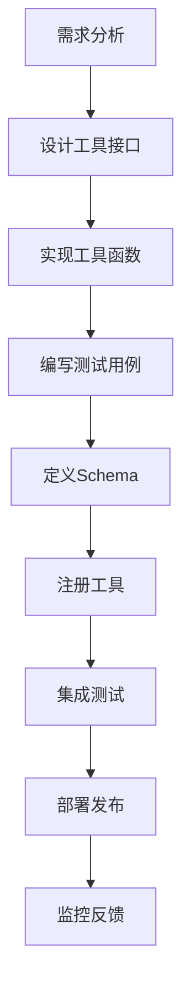

### 接口规范参考

- **函数签名**：`tool_function(df, **kwargs) -> dict`
- **返回格式**：统一的字典格式，包含结果数据和元信息
- **错误处理**：返回包含`error`键的字典
- **参数验证**：在函数内部进行类型和范围检查