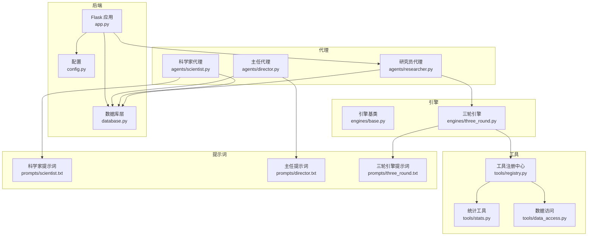
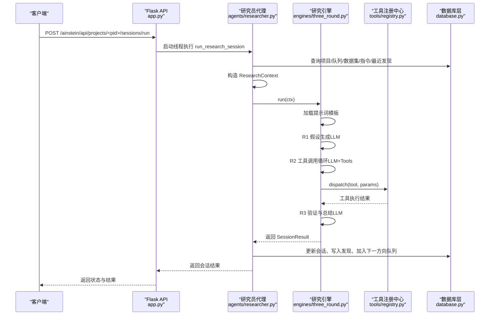
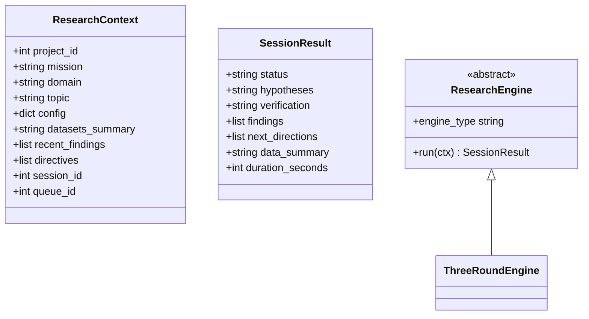
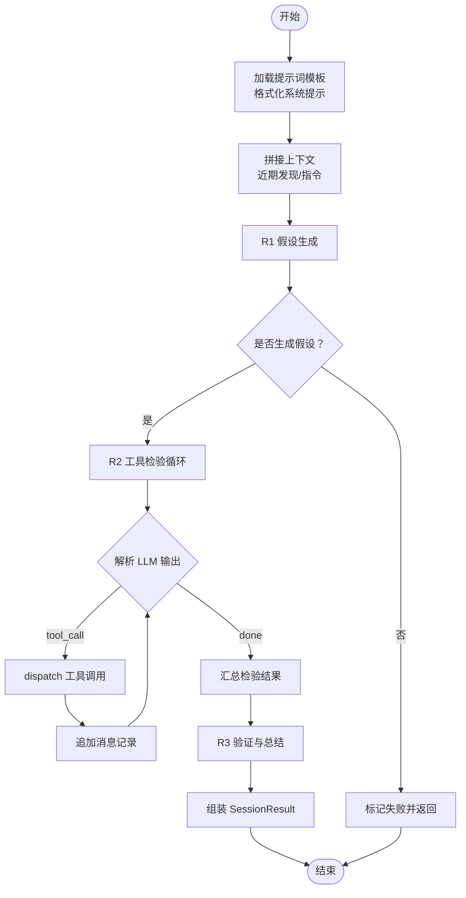
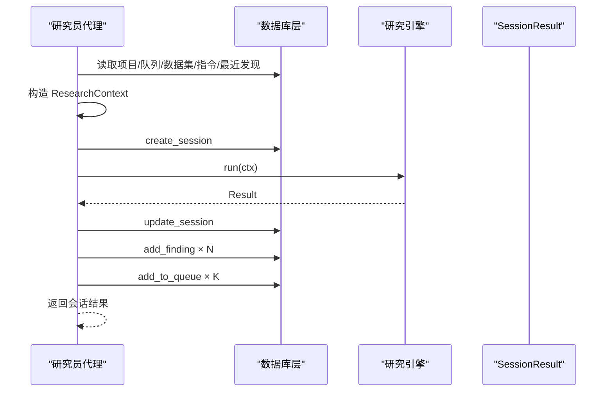
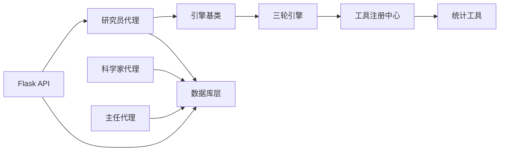

# 自定义引擎开发

<cite>
**本文引用的文件**
- [engines/base.py](file://engines/base.py)
- [engines/three_round.py](file://engines/three_round.py)
- [agents/researcher.py](file://agents/researcher.py)
- [agents/director.py](file://agents/director.py)
- [agents/scientist.py](file://agents/scientist.py)
- [tools/registry.py](file://tools/registry.py)
- [tools/data_access.py](file://tools/data_access.py)
- [tools/stats.py](file://tools/stats.py)
- [database.py](file://database.py)
- [config.py](file://config.py)
- [app.py](file://app.py)
- [prompts/three_round.txt](file://prompts/three_round.txt)
- [prompts/scientist.txt](file://prompts/scientist.txt)
- [prompts/director.txt](file://prompts/director.txt)
- [README.md](file://README.md)
</cite>

## 目录
1. [简介](#简介)
2. [项目结构](#项目结构)
3. [核心组件](#核心组件)
4. [架构总览](#架构总览)
5. [详细组件分析](#详细组件分析)
6. [依赖关系分析](#依赖关系分析)
7. [性能考虑](#性能考虑)
8. [故障排查指南](#故障排查指南)
9. [结论](#结论)
10. [附录](#附录)

## 简介
本指南面向希望在 AInstein 研究引擎基础上进行扩展与定制的开发者。AInstein 采用“三级 AI 团队 + 三轮研究引擎”的体系：科学家制定战略、主任进行质量把关、研究员执行研究；研究过程以“假设生成—工具检验—验证总结”三步法为核心。本文将从架构设计、扩展机制、工作流与状态管理、调度机制入手，给出自定义引擎的完整开发步骤、与 AI 代理的集成方式、与其他系统组件的交互模式，并提供性能优化与调试建议。

## 项目结构
AInstein 的核心目录与职责如下：
- engines：引擎基类与具体引擎实现（如三轮引擎）
- agents：AI 代理层（科学家、主任、研究员），负责编排与持久化
- tools：工具注册与实现（统计工具、外部数据工具、数据访问）
- prompts：各阶段提示词模板
- database.py：SQLite 数据模型与 CRUD
- config.py：全局配置（模型名、数据路径、API Key 等）
- app.py：Flask API 入口，提供项目、队列、会话、数据集等接口
- README.md：总体说明与技术栈

图表来源
- [app.py:1-182](file://app.py#L1-L182)
- [engines/base.py:1-49](file://engines/base.py#L1-L49)
- [engines/three_round.py:1-179](file://engines/three_round.py#L1-L179)
- [agents/researcher.py:1-114](file://agents/researcher.py#L1-L114)
- [agents/scientist.py:1-75](file://agents/scientist.py#L1-L75)
- [agents/director.py:1-124](file://agents/director.py#L1-L124)
- [tools/registry.py:1-181](file://tools/registry.py#L1-L181)
- [tools/stats.py:1-120](file://tools/stats.py#L1-L120)
- [tools/data_access.py:1-43](file://tools/data_access.py#L1-L43)
- [database.py:1-344](file://database.py#L1-L344)
- [config.py:1-11](file://config.py#L1-L11)
- [prompts/three_round.txt:1-15](file://prompts/three_round.txt#L1-L15)
- [prompts/scientist.txt:1-32](file://prompts/scientist.txt#L1-L32)
- [prompts/director.txt:1-43](file://prompts/director.txt#L1-L43)

章节来源
- [README.md:94-124](file://README.md#L94-L124)

## 核心组件
- 引擎基类与上下文
  - ResearchContext：单次研究会话的上下文，包含项目信息、主题、领域、任务使命、数据集摘要、近期发现、指令、会话与队列 ID 等
  - SessionResult：引擎返回的结果，包含状态、假设、验证、发现、下一方向、数据摘要与耗时
  - ResearchEngine：抽象基类，定义 engine_type 与 run(ctx) 接口
- 三轮引擎 ThreeRoundEngine：实现“假设生成—工具检验—验证总结”的完整流程
- 代理层
  - 科学家：根据项目使命与数据生成指令与初始课题
  - 主任：每日回顾、队列管理、记忆积累与质量把关
  - 研究员：挑选课题、构造上下文、调用引擎、持久化结果
- 工具层
  - 工具注册中心：集中注册工具、暴露 LLM 工具定义、分发执行
  - 统计工具：描述性统计、相关性、t 检验、回归、异常检测、分布拟合、分组统计
  - 数据访问：按项目加载数据集、生成数据集摘要
- 数据库层：项目、指令、队列、会话、发现、记忆、数据集等表与 CRUD
- 配置层：模型名、数据目录、API Key 等环境变量
- API 层：Flask 提供项目、队列、会话、发现、数据集、科学家/主任运行等接口

章节来源
- [engines/base.py:11-49](file://engines/base.py#L11-L49)
- [engines/three_round.py:22-179](file://engines/three_round.py#L22-L179)
- [agents/scientist.py:14-75](file://agents/scientist.py#L14-L75)
- [agents/director.py:14-124](file://agents/director.py#L14-L124)
- [agents/researcher.py:14-114](file://agents/researcher.py#L14-L114)
- [tools/registry.py:24-43](file://tools/registry.py#L24-L43)
- [tools/stats.py:10-120](file://tools/stats.py#L10-L120)
- [tools/data_access.py:10-43](file://tools/data_access.py#L10-L43)
- [database.py:101-344](file://database.py#L101-L344)
- [config.py:1-11](file://config.py#L1-L11)
- [app.py:15-177](file://app.py#L15-L177)

## 架构总览
AInstein 的运行链路如下：
- 科学家代理：基于项目使命与可用数据生成指令与初始课题，写入队列与记忆
- 研究员代理：从队列取任务，构造 ResearchContext，调用引擎 run(ctx)，持久化会话与发现
- 引擎：根据提示词模板与上下文，驱动 LLM 生成假设、调用工具、汇总验证与结论
- 工具注册中心：将工具函数与输入模式注册，支持 LLM 以 JSON 形式调用
- 数据库：统一存储项目、队列、会话、发现、记忆、数据集
- API 层：对外提供 REST 接口，支持异步运行研究会话

图表来源
- [app.py:95-104](file://app.py#L95-L104)
- [agents/researcher.py:14-114](file://agents/researcher.py#L14-L114)
- [engines/three_round.py:28-179](file://engines/three_round.py#L28-L179)
- [tools/registry.py:24-43](file://tools/registry.py#L24-L43)
- [database.py:232-295](file://database.py#L232-L295)

## 详细组件分析

### 引擎基类与上下文
- 设计要点
  - 使用数据类封装上下文与结果，便于传递与序列化
  - 抽象基类约束 engine_type 与 run(ctx) 方法，确保不同引擎的一致性
- 关键点
  - 上下文字段覆盖研究所需的关键要素：项目、使命、领域、主题、数据集摘要、近期发现、指令、会话与队列 ID
  - 结果字段覆盖状态、假设、验证、发现、下一方向、数据摘要与耗时，便于前端展示与后续处理

图表来源
- [engines/base.py:11-49](file://engines/base.py#L11-L49)
- [engines/three_round.py:22-26](file://engines/three_round.py#L22-L26)

章节来源
- [engines/base.py:11-49](file://engines/base.py#L11-L49)

### 三轮引擎 ThreeRoundEngine
- 工作流
  - R1：假设生成。基于上下文与提示词模板，生成若干可检验的假设
  - R2：工具检验。LLM 以 JSON 形式发出工具调用请求，引擎分发到工具注册中心执行，累积测试结果
  - R3：验证与总结。基于假设与测试结果，生成验证结论、关键发现与下一方向
- 关键实现细节
  - 提示词模板加载与格式化，结合上下文拼接
  - 工具调用循环：解析 LLM 输出的 JSON，调用 dispatch，将工具结果回传给 LLM 继续推理
  - 结果组装：将测试结果与验证结论合并到 SessionResult
- 性能与健壮性
  - 设置最大工具轮次，避免无限循环
  - 对 JSON 解析失败与工具执行异常进行降级处理

图表来源
- [engines/three_round.py:28-179](file://engines/three_round.py#L28-L179)
- [prompts/three_round.txt:1-15](file://prompts/three_round.txt#L1-L15)

章节来源
- [engines/three_round.py:28-179](file://engines/three_round.py#L28-L179)

### 研究员代理 run_research_session
- 职责
  - 从数据库读取项目、队列、数据集、指令与近期发现，构造 ResearchContext
  - 创建会话记录，调用引擎 run(ctx)，将结果持久化为会话与发现
  - 将引擎建议的下一方向加入队列
- 错误处理
  - 捕获引擎异常，更新会话状态为失败，必要时更新队列项状态

图表来源
- [agents/researcher.py:14-114](file://agents/researcher.py#L14-L114)
- [database.py:232-295](file://database.py#L232-L295)

章节来源
- [agents/researcher.py:14-114](file://agents/researcher.py#L14-L114)
- [database.py:232-295](file://database.py#L232-L295)

### 科学家代理 run_scientist
- 职责
  - 基于项目使命与可用数据，生成指令与初始课题，并写入数据库
  - 记录战略记忆，供主任与研究员参考
- 输出
  - 指令数量、初始课题数量、发现分类与战略备注

章节来源
- [agents/scientist.py:14-75](file://agents/scientist.py#L14-L75)
- [prompts/scientist.txt:13-32](file://prompts/scientist.txt#L13-L32)

### 主任代理 run_director_daily
- 职责
  - 汇总近期会话、开放发现、队列与记忆，进行每日回顾
  - 审核发现（验证/拒绝/保留）、调整队列、新增课题、积累记忆、生成简报
- 输出
  - 审核发现数、新增课题数、记忆条目数与简报内容

章节来源
- [agents/director.py:14-124](file://agents/director.py#L14-L124)
- [prompts/director.txt:19-43](file://prompts/director.txt#L19-L43)

### 工具注册中心与统计工具
- 工具注册中心
  - register_tool：注册工具函数与输入模式
  - dispatch：根据工具名与参数执行，自动加载数据集并传入工具
  - get_llm_tool_definitions：向 LLM 暴露工具清单
- 统计工具
  - 描述性统计、相关性、t 检验、回归、异常检测、分布拟合、分组统计
  - 输入参数严格校验，返回标准化结果，便于引擎与 LLM 使用

章节来源
- [tools/registry.py:12-43](file://tools/registry.py#L12-L43)
- [tools/stats.py:10-120](file://tools/stats.py#L10-L120)

### 数据访问与数据集摘要
- load_dataset：按项目与文件名加载 CSV/JSON/XLSX 等
- get_dataset_summary：将数据集的列与类型汇总为文本，供 LLM 上下文使用

章节来源
- [tools/data_access.py:10-43](file://tools/data_access.py#L10-L43)

### 数据库层
- 表结构
  - projects、scientist_directives、research_queue、research_sessions、research_findings、director_memory、datasets
- 关键操作
  - 项目 CRUD、指令 CRUD、队列管理（入队/出队/优先级）、会话 CRUD、发现 CRUD、记忆 CRUD、数据集 CRUD
  - 统计查询：项目统计、队列待办数、发现总数/可行动/已验证

章节来源
- [database.py:101-344](file://database.py#L101-L344)

### API 层
- 路由
  - 项目：列表、创建、详情、统计
  - 队列：列表、入队
  - 会话：列表、详情、运行（异步）
  - 发现：列表
  - 数据集：列表、上传（解析 schema 与行数）
  - 科学家/主任：运行
- 异步运行
  - 会话运行通过线程异步执行，避免阻塞请求

章节来源
- [app.py:50-177](file://app.py#L50-L177)

## 依赖关系分析
- 组件耦合
  - 研究员代理依赖引擎基类与具体引擎实现
  - 引擎依赖工具注册中心与提示词模板
  - 代理层依赖数据库层进行数据读写
  - API 层依赖代理层与数据库层
- 外部依赖
  - LLM 客户端（DashScope/Anthropic 协议）
  - SQLite（WAL 模式）
  - pandas/numpy/scipy（统计工具）

图表来源
- [agents/researcher.py:11-114](file://agents/researcher.py#L11-L114)
- [engines/base.py:38-49](file://engines/base.py#L38-L49)
- [engines/three_round.py:22-179](file://engines/three_round.py#L22-L179)
- [tools/registry.py:24-43](file://tools/registry.py#L24-L43)
- [tools/stats.py:10-120](file://tools/stats.py#L10-L120)
- [database.py:101-344](file://database.py#L101-L344)
- [app.py:95-104](file://app.py#L95-L104)

## 性能考虑
- 引擎层面
  - 控制工具调用轮次上限，避免长对话导致延迟与成本上升
  - 在 R2 循环中尽早终止（收到 done 标记）以减少不必要的交互
  - 对 LLM 输出进行严格 JSON 解析，失败时快速降级并记录日志
- 数据访问
  - 数据集加载仅在需要时进行，避免重复 IO
  - 对小样本场景返回明确错误，避免无效计算
- 数据库
  - 使用 WAL 模式提升并发写入性能
  - 合理索引（队列、会话、发现、记忆、数据集）提升查询效率
- API
  - 会话运行异步化，避免阻塞请求
  - 限制上传文件大小与解析范围，防止内存压力

## 故障排查指南
- 引擎无假设或解析失败
  - 检查提示词模板是否正确加载与格式化
  - 核对上下文拼接（近期发现/指令）是否为空或格式异常
  - 查看 R1 输出是否为有效 JSON
- 工具调用失败
  - 确认工具名存在且参数符合 schema
  - 检查数据集是否存在与可读
  - 观察工具执行异常日志
- 会话未持久化或状态异常
  - 研究员代理异常捕获与状态更新逻辑
  - 数据库事务与回滚机制
- API 无响应或超时
  - 确认异步线程已启动
  - 检查数据库初始化与连接池
- 日志定位
  - 使用 INFO/ERROR 级别日志输出关键节点与异常

章节来源
- [engines/three_round.py:66-75](file://engines/three_round.py#L66-L75)
- [engines/three_round.py:109-115](file://engines/three_round.py#L109-L115)
- [agents/researcher.py:62-69](file://agents/researcher.py#L62-L69)
- [database.py:101-123](file://database.py#L101-L123)
- [app.py:97-104](file://app.py#L97-L104)

## 结论
AInstein 通过清晰的引擎基类、可扩展的工具注册中心与三层代理协作，实现了可定制的研究流程。开发者可基于引擎基类快速实现新的研究方法，通过提示词模板与工具注册中心无缝接入现有能力，并借助数据库与 API 层完成端到端的闭环。遵循本文的扩展步骤与最佳实践，可在保证稳定性的同时高效迭代研究范式。

## 附录

### 自定义引擎开发步骤（完整示例）
- 步骤 1：继承引擎基类
  - 新建文件 engines/my_engine.py，定义类 MyEngine 并实现 engine_type 与 run(ctx)
  - 参考路径：[engines/base.py:38-49](file://engines/base.py#L38-L49)
- 步骤 2：实现 run(ctx) 核心逻辑
  - 读取上下文字段（项目、使命、领域、主题、数据集摘要、近期发现、指令）
  - 生成 SessionResult，填充状态、假设、验证、发现、下一方向、数据摘要与耗时
  - 参考路径：[engines/three_round.py:28-179](file://engines/three_round.py#L28-L179)
- 步骤 3：编写提示词模板
  - 在 prompts/ 下新增 my_engine.txt，定义系统提示与约束
  - 参考路径：[prompts/three_round.txt:1-15](file://prompts/three_round.txt#L1-L15)
- 步骤 4：注册工具与数据访问
  - 如需统计工具，参考 tools/stats.py 的实现风格，注册到 tools/registry.py
  - 参考路径：[tools/stats.py:10-120](file://tools/stats.py#L10-L120)，[tools/registry.py:57-181](file://tools/registry.py#L57-L181)
- 步骤 5：在研究员代理中使用新引擎
  - 替换 ENGINE 实例为 MyEngine，或在 run_research_session 中按项目选择引擎
  - 参考路径：[agents/researcher.py:11](file://agents/researcher.py#L11)
- 步骤 6：持久化与队列联动
  - 研究员代理会自动将 SessionResult 写入数据库并加入下一方向队列
  - 参考路径：[agents/researcher.py:71-101](file://agents/researcher.py#L71-L101)，[database.py:232-295](file://database.py#L232-L295)
- 步骤 7：API 集成与测试
  - 通过 /ainstein/api/projects/<pid>/sessions/run 触发新引擎
  - 参考路径：[app.py:95-104](file://app.py#L95-L104)

### 引擎与 AI 代理的集成方式
- 科学家/主任/研究员分别承担战略、质量与执行角色，引擎作为执行单元被研究员代理调用
- 代理负责上下文构造、状态管理与结果持久化，引擎专注推理与工具编排
- 参考路径：[agents/scientist.py:14-75](file://agents/scientist.py#L14-L75)，[agents/director.py:14-124](file://agents/director.py#L14-L124)，[agents/researcher.py:14-114](file://agents/researcher.py#L14-L114)

### 与其他系统组件的交互模式
- 数据库：统一的数据存储与查询，支撑项目、队列、会话、发现、记忆、数据集
- 配置：通过 config.py 读取模型名、数据目录、API Key 等
- API：对外提供 REST 接口，支持异步运行与资源上传
- 参考路径：[database.py:101-344](file://database.py#L101-L344)，[config.py:1-11](file://config.py#L1-L11)，[app.py:50-177](file://app.py#L50-L177)