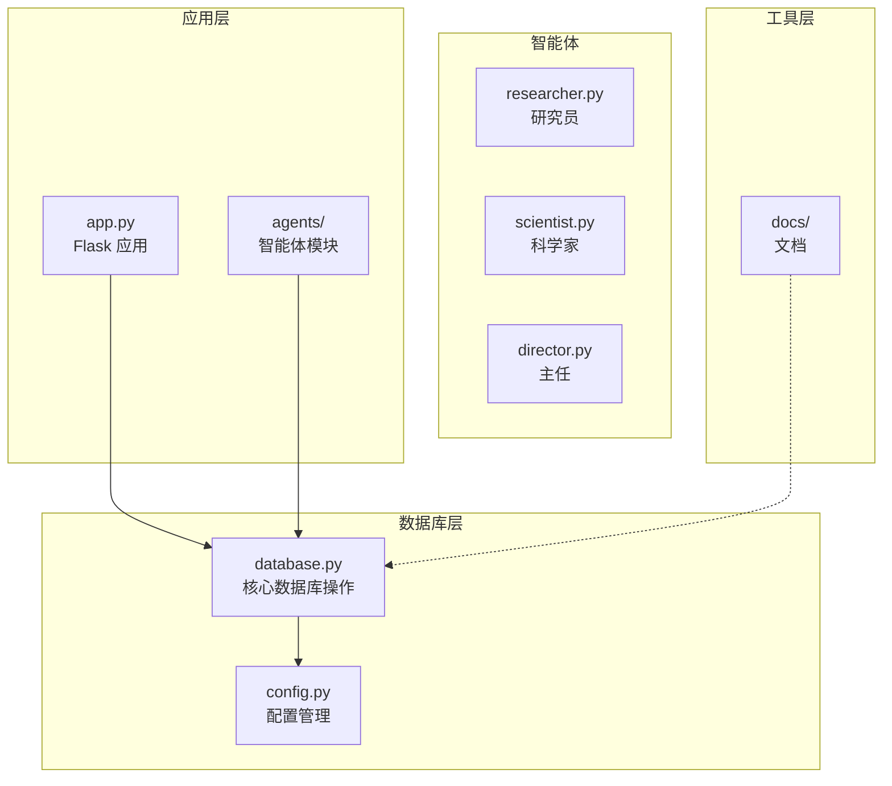
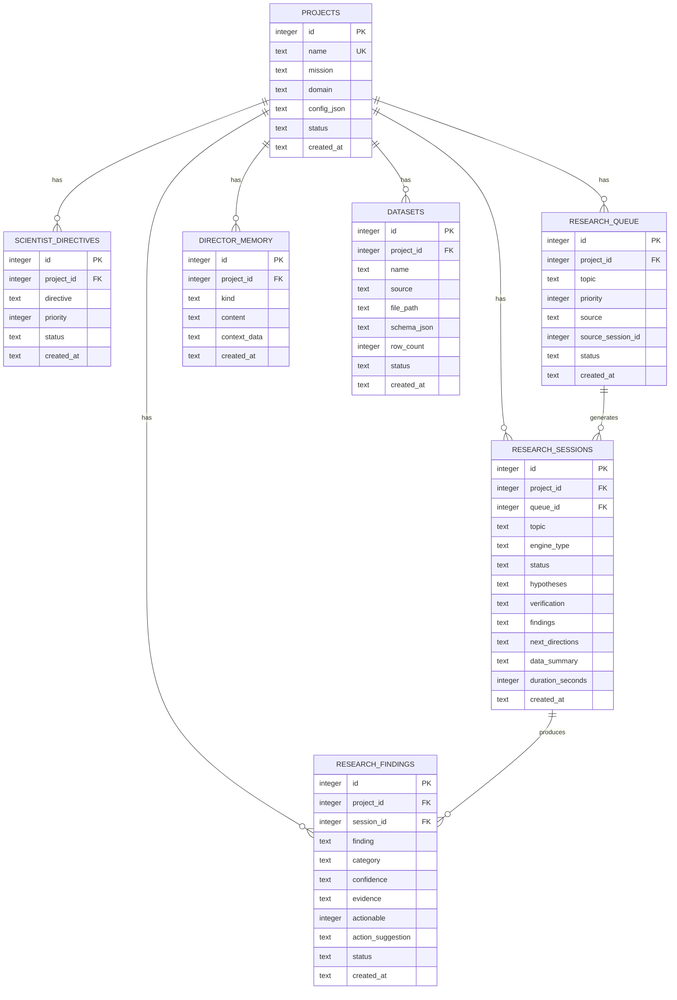
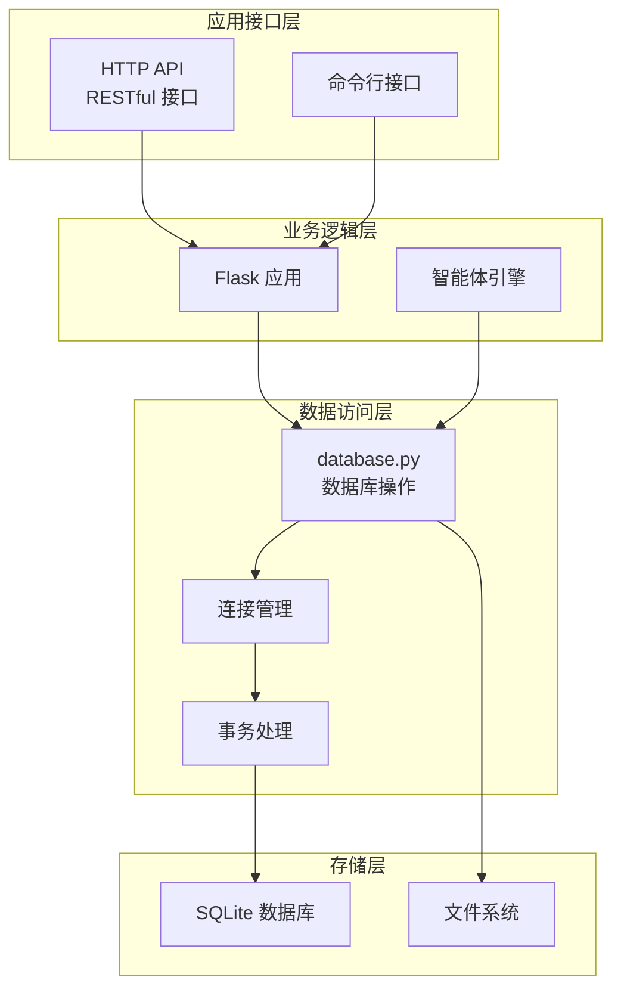
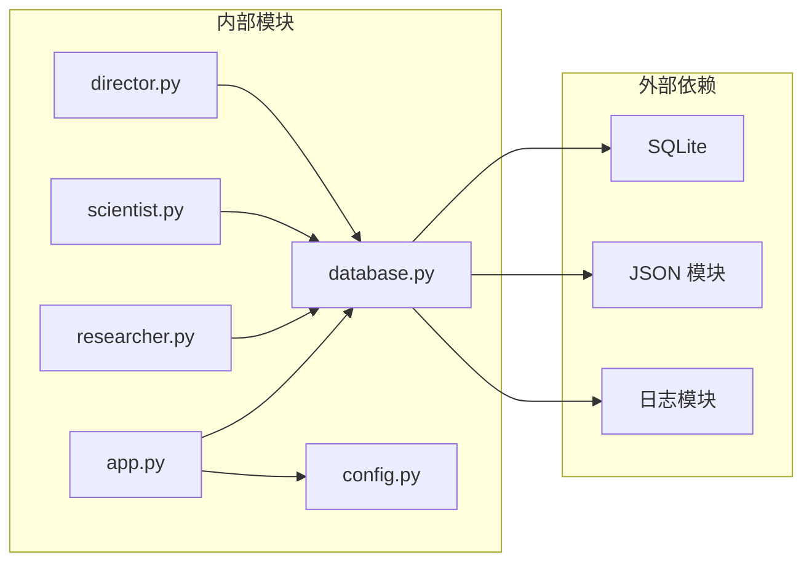
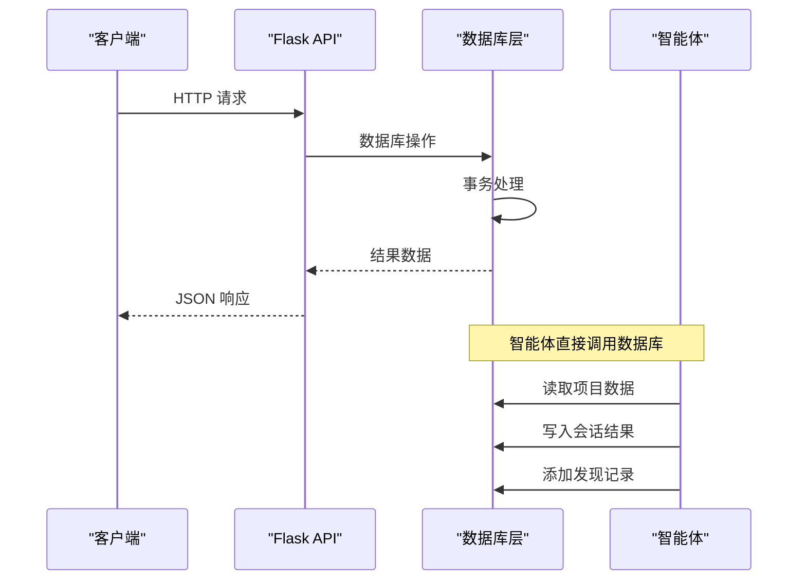
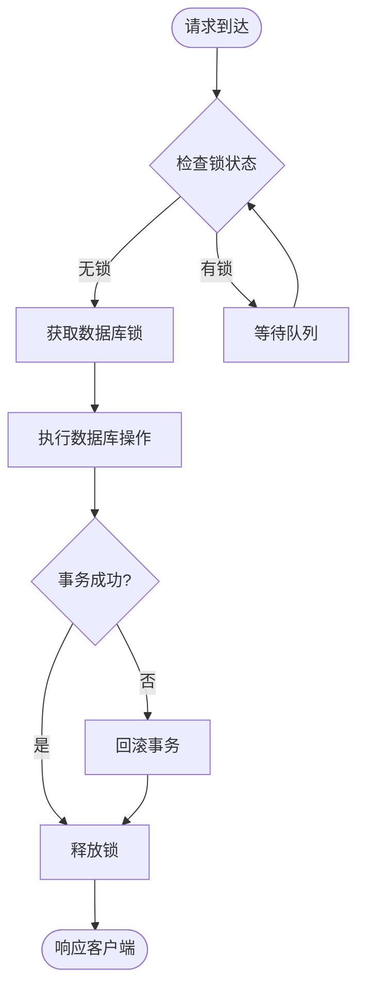
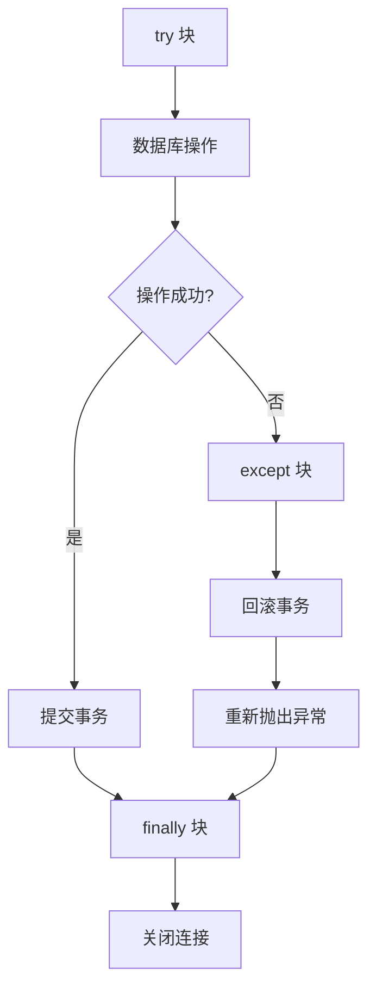

# 数据库操作接口

<cite>
**本文档引用的文件**
- [database.py](file://database.py)
- [app.py](file://app.py)
- [config.py](file://config.py)
- [researcher.py](file://agents/researcher.py)
- [scientist.py](file://agents/scientist.py)
- [director.py](file://agents/director.py)
- [ops-manual.md](file://docs/ops-manual.md)
</cite>

## 目录
1. [简介](#简介)
2. [项目结构](#项目结构)
3. [核心组件](#核心组件)
4. [架构概览](#架构概览)
5. [详细组件分析](#详细组件分析)
6. [依赖关系分析](#依赖关系分析)
7. [性能考虑](#性能考虑)
8. [故障排除指南](#故障排除指南)
9. [结论](#结论)

## 简介

AInstein 是一个基于 Flask 的研究项目管理系统，数据库层提供了完整的数据持久化能力。本文档详细介绍了 `database.py` 中提供的所有数据库操作函数，涵盖项目管理、队列管理、会话管理、发现管理、数据集管理和记忆管理等核心功能。

该数据库层采用 SQLite 作为后端存储，通过上下文管理器确保事务安全性和连接管理。系统设计支持并发访问，并提供了完善的错误处理和回滚机制。

## 项目结构

AInstein 项目的数据库相关文件组织如下：

**图表来源**
- [database.py:1-344](file://database.py#L1-L344)
- [app.py:1-182](file://app.py#L1-L182)
- [config.py:1-11](file://config.py#L1-L11)

**章节来源**
- [database.py:1-344](file://database.py#L1-L344)
- [app.py:1-182](file://app.py#L1-L182)
- [config.py:1-11](file://config.py#L1-L11)

## 核心组件

### 数据库连接管理

数据库连接通过 `get_db()` 上下文管理器进行统一管理，确保每个数据库操作都在事务范围内执行：

- **连接初始化**：设置行工厂、WAL 日志模式和外键约束
- **自动提交**：正常情况下自动提交事务
- **自动回滚**：异常发生时自动回滚事务
- **资源清理**：确保连接在 finally 块中正确关闭

### 数据库模式设计

系统采用关系型数据库设计，包含以下核心表：

**图表来源**
- [database.py:10-98](file://database.py#L10-L98)

**章节来源**
- [database.py:101-123](file://database.py#L101-L123)
- [database.py:10-98](file://database.py#L10-L98)

## 架构概览

AInstein 的数据库架构采用分层设计，实现了清晰的关注点分离：

**图表来源**
- [app.py:1-182](file://app.py#L1-L182)
- [database.py:101-123](file://database.py#L101-L123)

## 详细组件分析

### 项目管理模块

项目管理模块负责研究项目的全生命周期管理，包括创建、查询和统计分析。

#### 核心函数

**创建项目**
- **函数名**：`create_project(name, mission, domain, config=None)`
- **参数**：
  - `name`：项目名称（唯一标识）
  - `mission`：项目使命描述
  - `domain`：研究领域
  - `config`：项目配置对象（可选）
- **返回值**：新创建项目的 ID
- **异常处理**：数据库约束冲突时抛出异常
- **使用示例**：参见 [app.py:54-58](file://app.py#L54-L58)

**获取项目列表**
- **函数名**：`get_projects(status='active')`
- **参数**：
  - `status`：项目状态过滤（默认活跃）
- **返回值**：按创建时间倒序排列的项目列表
- **异常处理**：无特殊异常处理
- **使用示例**：参见 [app.py:50-52](file://app.py#L50-L52)

**获取单个项目**
- **函数名**：`get_project(project_id)`
- **参数**：`project_id`：项目 ID
- **返回值**：项目详情或 None
- **异常处理**：无特殊异常处理
- **使用示例**：参见 [app.py:60-66](file://app.py#L60-L66)

**项目统计分析**
- **函数名**：`get_project_stats(project_id)`
- **参数**：`project_id`：项目 ID
- **返回值**：包含会话总数、完成会话数、发现总数、可行动态等统计信息
- **异常处理**：无特殊异常处理

**章节来源**
- [database.py:127-168](file://database.py#L127-L168)
- [app.py:50-66](file://app.py#L50-L66)

### 队列管理模块

队列管理模块负责研究任务的排队和调度，支持优先级排序和状态跟踪。

#### 核心函数

**添加到队列**
- **函数名**：`add_to_queue(project_id, topic, priority=5, source='user', source_session_id=None)`
- **参数**：
  - `project_id`：所属项目 ID
  - `topic`：研究主题
  - `priority`：优先级（数值越小优先级越高）
  - `source`：来源类型（用户输入、AI生成等）
  - `source_session_id`：来源会话 ID（可选）
- **返回值**：队列项 ID
- **异常处理**：无特殊异常处理
- **使用示例**：参见 [app.py:75-79](file://app.py#L75-L79)

**获取队列内容**
- **函数名**：`get_queue(project_id, status=None)`
- **参数**：
  - `project_id`：项目 ID
  - `status`：状态过滤（可选）
- **返回值**：按优先级和创建时间排序的队列项列表
- **异常处理**：无特殊异常处理

**选择下一个主题**
- **函数名**：`pick_next_topic(project_id)`
- **参数**：`project_id`：项目 ID
- **返回值**：下一个待处理的主题或 None
- **异常处理**：无特殊异常处理
- **并发处理**：原子性更新队列状态

**更新队列项状态**
- **函数名**：`update_queue_item(queue_id, status)`
- **参数**：
  - `queue_id`：队列项 ID
  - `status`：新状态
- **返回值**：无
- **异常处理**：无特殊异常处理

**章节来源**
- [database.py:192-227](file://database.py#L192-L227)
- [app.py:71-79](file://app.py#L71-L79)

### 会话管理模块

会话管理模块负责研究会话的生命周期管理，包括创建、更新和查询。

#### 核心函数

**创建会话**
- **函数名**：`create_session(project_id, topic, engine_type='three_round', queue_id=None)`
- **参数**：
  - `project_id`：项目 ID
  - `topic`：研究主题
  - `engine_type`：引擎类型
  - `queue_id`：关联的队列 ID（可选）
- **返回值**：会话 ID
- **异常处理**：无特殊异常处理

**动态更新会话**
- **函数名**：`update_session(session_id, **kwargs)`
- **参数**：
  - `session_id`：会话 ID
  - `kwargs`：允许的字段包括 status、hypotheses、verification、findings、next_directions、data_summary、duration_seconds
- **返回值**：无
- **异常处理**：无特殊异常处理
- **使用示例**：参见 [researcher.py:71-80](file://agents/researcher.py#L71-L80)

**获取会话列表**
- **函数名**：`get_sessions(project_id, limit=20)`
- **参数**：
  - `project_id`：项目 ID
  - `limit`：限制数量
- **返回值**：按创建时间倒序排列的会话列表
- **异常处理**：无特殊异常处理

**获取单个会话**
- **函数名**：`get_session(session_id)`
- **参数**：`session_id`：会话 ID
- **返回值**：会话详情或 None
- **异常处理**：无特殊异常处理

**章节来源**
- [database.py:232-261](file://database.py#L232-L261)
- [researcher.py:52-80](file://agents/researcher.py#L52-L80)

### 发现管理模块

发现管理模块负责研究发现的记录、分类和状态管理。

#### 核心函数

**添加发现**
- **函数名**：`add_finding(project_id, session_id, finding, category='general', confidence='low', evidence='', actionable=0, action_suggestion='')`
- **参数**：
  - `project_id`：项目 ID
  - `session_id`：会话 ID
  - `finding`：发现内容
  - `category`：分类（默认一般）
  - `confidence`：置信度（默认低）
  - `evidence`：证据
  - `actionable`：是否可行动态（0/1）
  - `action_suggestion`：行动建议
- **返回值**：发现 ID
- **异常处理**：无特殊异常处理
- **使用示例**：参见 [researcher.py:82-92](file://agents/researcher.py#L82-L92)

**获取发现列表**
- **函数名**：`get_findings(project_id, limit=50, status=None, category=None)`
- **参数**：
  - `project_id`：项目 ID
  - `limit`：限制数量
  - `status`：状态过滤
  - `category`：分类过滤
- **返回值**：包含会话主题的发现列表
- **异常处理**：无特殊异常处理
- **使用示例**：参见 [app.py:109-114](file://app.py#L109-L114)

**更新发现状态**
- **函数名**：`update_finding(finding_id, status)`
- **参数**：
  - `finding_id`：发现 ID
  - `status`：新状态
- **返回值**：无
- **异常处理**：无特殊异常处理
- **使用示例**：参见 [director.py:85-91](file://agents/director.py#L85-L91)

**章节来源**
- [database.py:266-294](file://database.py#L266-L294)
- [researcher.py:82-92](file://agents/researcher.py#L82-L92)
- [director.py:85-91](file://agents/director.py#L85-L91)

### 记忆管理模块

记忆管理模块负责项目相关的知识积累和上下文维护。

#### 核心函数

**添加记忆**
- **函数名**：`add_director_memory(project_id, kind, content, context_data=None)`
- **参数**：
  - `project_id`：项目 ID
  - `kind`：记忆类型
  - `content`：记忆内容
  - `context_data`：上下文数据（JSON）
- **返回值**：记忆 ID
- **异常处理**：无特殊异常处理
- **使用示例**：参见 [scientist.py:65-66](file://agents/scientist.py#L65-L66)

**获取记忆列表**
- **函数名**：`get_director_memories(project_id, kind=None, limit=10)`
- **参数**：
  - `project_id`：项目 ID
  - `kind`：类型过滤
  - `limit`：限制数量
- **返回值**：按创建时间倒序的记忆列表
- **异常处理**：无特殊异常处理
- **使用示例**：参见 [app.py:167-170](file://app.py#L167-L170)

**章节来源**
- [database.py:299-319](file://database.py#L299-L319)
- [scientist.py:65-66](file://agents/scientist.py#L65-L66)
- [app.py:167-170](file://app.py#L167-L170)

### 数据集管理模块

数据集管理模块负责项目数据集的上传、存储和元数据管理。

#### 核心函数

**添加数据集**
- **函数名**：`add_dataset(project_id, name, source, file_path, schema_json=None, row_count=0)`
- **参数**：
  - `project_id`：项目 ID
  - `name`：数据集名称
  - `source`：来源类型
  - `file_path`：文件路径
  - `schema_json`：模式定义
  - `row_count`：行数统计
- **返回值**：数据集 ID
- **异常处理**：无特殊异常处理
- **使用示例**：参见 [app.py:151](file://app.py#L151)

**获取数据集列表**
- **函数名**：`get_datasets(project_id)`
- **参数**：`project_id`：项目 ID
- **返回值**：按创建时间倒序的数据集列表
- **异常处理**：无特殊异常处理
- **使用示例**：参见 [app.py:119-121](file://app.py#L119-L121)

**获取单个数据集**
- **函数名**：`get_dataset(dataset_id)`
- **参数**：`dataset_id`：数据集 ID
- **返回值**：数据集详情或 None
- **异常处理**：无特殊异常处理

**章节来源**
- [database.py:324-343](file://database.py#L324-L343)
- [app.py:151](file://app.py#L151)

## 依赖关系分析

### 组件耦合分析

**图表来源**
- [database.py:1-6](file://database.py#L1-L6)
- [app.py:1-6](file://app.py#L1-L6)

### 数据流分析

**图表来源**
- [app.py:50-176](file://app.py#L50-L176)
- [researcher.py:14-114](file://agents/researcher.py#L14-L114)

**章节来源**
- [app.py:50-176](file://app.py#L50-L176)
- [researcher.py:14-114](file://agents/researcher.py#L14-L114)

## 性能考虑

### 数据库优化策略

1. **索引优化**
   - 项目级索引：按项目 ID 和状态快速查询
   - 时间戳索引：按创建时间排序的高效查询
   - 复合索引：队列按优先级和状态的组合索引

2. **查询优化**
   - 使用 LIMIT 限制结果集大小
   - 条件查询避免全表扫描
   - 连接查询优化 JOIN 操作

3. **连接池管理**
   - 单连接模型：SQLite 适合单进程场景
   - WAL 模式：提高并发写入性能
   - 外键约束：保证数据一致性

### 并发访问处理

**图表来源**
- [database.py:109-123](file://database.py#L109-L123)

### 最佳实践建议

1. **事务边界控制**
   - 将相关操作封装在单个事务中
   - 避免长事务持有锁
   - 及时提交或回滚事务

2. **查询优化**
   - 使用适当的索引
   - 避免 SELECT *
   - 合理使用 LIMIT

3. **错误处理**
   - 捕获并处理数据库异常
   - 提供有意义的错误信息
   - 实现重试机制

**章节来源**
- [database.py:109-123](file://database.py#L109-L123)
- [ops-manual.md:100-163](file://docs/ops-manual.md#L100-L163)

## 故障排除指南

### 常见问题诊断

1. **数据库连接问题**
   - 检查 DB_PATH 环境变量
   - 验证文件权限
   - 确认磁盘空间充足

2. **事务失败**
   - 检查外键约束
   - 验证数据完整性
   - 查看回滚日志

3. **性能问题**
   - 分析慢查询
   - 检查索引使用
   - 监控数据库大小

### 错误处理机制

**图表来源**
- [database.py:115-122](file://database.py#L115-L122)

### 运维建议

1. **定期备份**
   - 手动备份：`cp /opt/ainstein/data/ainstein.db /opt/ainstein/data/ainstein.db.bak.$(date +%Y%m%d_%H%M%S)`
   - 定时备份：使用 cron 定时任务

2. **监控指标**
   - 数据库大小增长
   - 查询性能指标
   - 错误率统计

3. **容量规划**
   - 定期清理历史数据
   - 考虑数据库迁移方案
   - 准备灾难恢复计划

**章节来源**
- [ops-manual.md:108-163](file://docs/ops-manual.md#L108-L163)

## 结论

AInstein 的数据库层设计体现了现代应用开发的最佳实践：

1. **清晰的架构分离**：通过模块化设计实现了关注点分离
2. **强一致性的事务管理**：确保数据完整性和一致性
3. **高效的查询性能**：通过索引和优化查询提升性能
4. **完善的错误处理**：提供健壮的异常处理和回滚机制
5. **良好的可维护性**：清晰的代码结构和详细的文档

该数据库接口为研究项目管理提供了坚实的数据基础，支持从项目创建到发现管理的完整生命周期。通过合理的性能优化和运维策略，可以满足生产环境的高可用性要求。