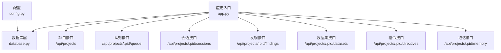
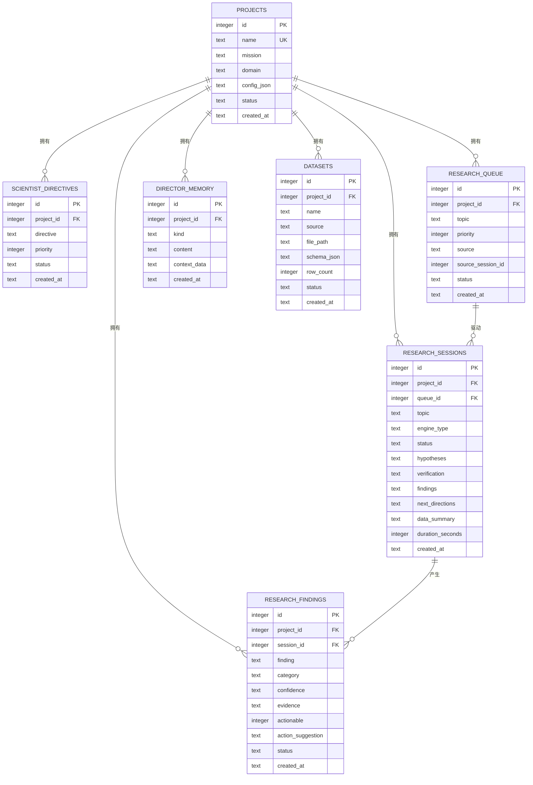
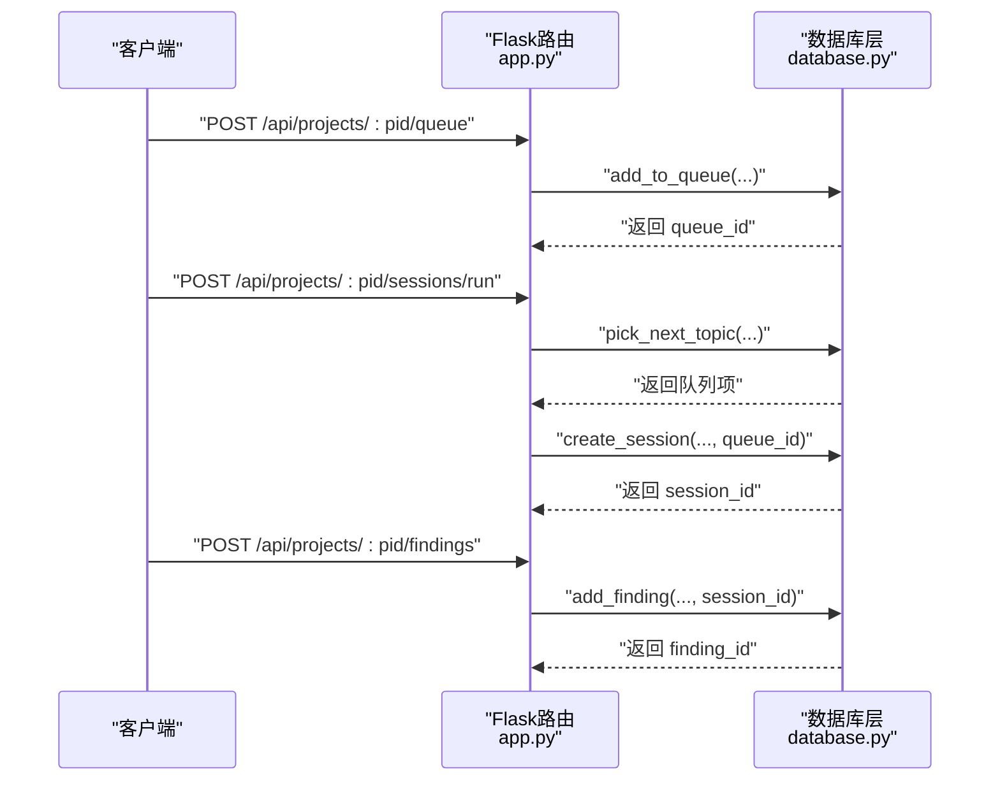
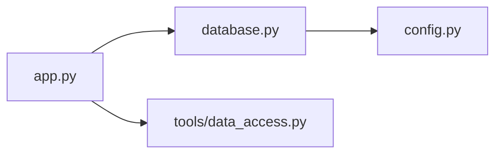

# 数据库设计

<cite>
**本文引用的文件**
- [database.py](file://database.py)
- [config.py](file://config.py)
- [app.py](file://app.py)
- [tools/data_access.py](file://tools/data_access.py)
- [docs/ops-manual.md](file://docs/ops-manual.md)
</cite>

## 目录
1. [简介](#简介)
2. [项目结构](#项目结构)
3. [核心组件](#核心组件)
4. [架构总览](#架构总览)
5. [详细组件分析](#详细组件分析)
6. [依赖关系分析](#依赖关系分析)
7. [性能考量](#性能考量)
8. [故障排查指南](#故障排查指南)
9. [结论](#结论)
10. [附录](#附录)

## 简介
本文件系统性梳理 AInstein 的数据库架构与数据模型设计，覆盖核心实体（Project、ResearchSession、Finding、Dataset、QueueItem、ScientistDirective、DirectorMemory）的表结构、主外键关系、索引设计与性能优化策略；并提供数据库初始化脚本、迁移指南、SQLite WAL 模式配置、数据访问模式、缓存策略以及备份恢复与维护最佳实践。

## 项目结构
数据库层由独立模块实现，通过上下文管理器统一连接生命周期，并在应用启动时自动初始化数据库。数据访问接口围绕项目维度进行组织，支持队列、会话、发现、数据集、指令与记忆等能力。

图表来源
- [app.py:15-182](file://app.py#L15-L182)
- [database.py:101-123](file://database.py#L101-L123)
- [config.py:1-11](file://config.py#L1-L11)

章节来源
- [app.py:15-182](file://app.py#L15-L182)
- [database.py:101-123](file://database.py#L101-L123)
- [config.py:1-11](file://config.py#L1-L11)

## 核心组件
- 数据库初始化与连接管理：自动创建目录与数据库文件，启用 WAL 日志模式与外键约束，使用上下文管理器保证事务提交/回滚与连接关闭。
- 实体与接口：围绕项目维度提供项目、队列、会话、发现、数据集、科学家指令、导演记忆等 CRUD 接口。
- 数据访问工具：提供数据集加载与摘要生成，用于向 LLM 提供上下文信息。

章节来源
- [database.py:101-123](file://database.py#L101-L123)
- [database.py:127-145](file://database.py#L127-L145)
- [database.py:192-228](file://database.py#L192-L228)
- [database.py:232-262](file://database.py#L232-L262)
- [database.py:266-295](file://database.py#L266-L295)
- [database.py:324-343](file://database.py#L324-L343)
- [tools/data_access.py:10-43](file://tools/data_access.py#L10-L43)

## 架构总览
下图展示数据库层与应用层的交互关系，以及各实体之间的外键关联。

图表来源
- [database.py:11-98](file://database.py#L11-L98)

## 详细组件分析

### 表结构与字段定义
- 项目（projects）
  - 主键：id（自增）
  - 唯一约束：name
  - 关键字段：mission、domain、config_json、status、created_at
- 科学家指令（scientist_directives）
  - 主键：id；外键：project_id → projects(id)
  - 字段：directive、priority、status、created_at
- 研究队列（research_queue）
  - 主键：id；外键：project_id → projects(id)
  - 字段：topic、priority、source、source_session_id、status、created_at
- 研究会话（research_sessions）
  - 主键：id；外键：project_id → projects(id)，queue_id → research_queue(id)
  - 字段：topic、engine_type、status、hypotheses、verification、findings、next_directions、data_summary、duration_seconds、created_at
- 研究发现（research_findings）
  - 主键：id；外键：project_id → projects(id)，session_id → research_sessions(id)
  - 字段：finding、category、confidence、evidence、actionable、action_suggestion、status、created_at
- 导演记忆（director_memory）
  - 主键：id；外键：project_id → projects(id)
  - 字段：kind、content、context_data、created_at
- 数据集（datasets）
  - 主键：id；外键：project_id → projects(id)
  - 字段：name、source、file_path、schema_json、row_count、status、created_at

章节来源
- [database.py:11-98](file://database.py#L11-L98)

### 主键、外键与索引设计
- 主键：所有表均采用自增整型主键，便于插入与排序。
- 外键：研究类实体严格引用项目；会话引用队列；发现引用会话；均启用外键约束以保证参照完整性。
- 索引：
  - idx_rq_project(project_id, status)：按项目+状态过滤队列项
  - idx_rs_project(project_id, created_at)：按项目+时间倒序列出会话
  - idx_rf_project(project_id, created_at)：按项目+时间倒序列出发现
  - idx_dm_project(project_id, created_at)：按项目+时间倒序列出记忆
  - idx_ds_project(project_id)：按项目列出数据集
  - idx_sd_project(project_id, status)：按项目+状态列出指令
- 设计考量：
  - 复合索引优先满足“按项目过滤 + 排序/分页”场景
  - 发现与会话列表默认按时间倒序，索引可直接支撑高效查询
  - 队列按优先级与创建时间排序，索引支持 O(1) 取最小优先级项

章节来源
- [database.py:92-97](file://database.py#L92-L97)

### 数据库初始化与连接管理
- 初始化流程：确保数据目录存在，执行建表脚本，自动创建所有表与索引。
- 连接管理：每个请求建立连接，设置行工厂、WAL 模式与外键约束；事务成功提交，异常回滚，最终关闭连接。
- 配置来源：DB_PATH 来自环境变量，缺省路径为 /opt/ainstein/data/ainstein.db。

章节来源
- [database.py:101-106](file://database.py#L101-L106)
- [database.py:109-122](file://database.py#L109-L122)
- [config.py:4](file://config.py#L4)

### 数据访问模式
- 项目：创建、列表、详情、统计
- 队列：新增、列表（支持按状态过滤）、选取下一个主题、更新状态
- 会话：创建、更新（多字段动态拼接）、列表、详情
- 发现：新增、列表（支持按状态/类别过滤）、更新状态
- 数据集：新增上传、列表、详情
- 记忆：新增、列表（支持按类型过滤）

章节来源
- [database.py:127-145](file://database.py#L127-L145)
- [database.py:192-228](file://database.py#L192-L228)
- [database.py:232-262](file://database.py#L232-L262)
- [database.py:266-295](file://database.py#L266-L295)
- [database.py:324-343](file://database.py#L324-L343)
- [database.py:299-319](file://database.py#L299-L319)

### 数据模型与序列交互
以下序列图展示“添加队列项 → 选取下一个主题 → 创建会话 → 新增发现”的典型流程。

图表来源
- [app.py:75-104](file://app.py#L75-L104)
- [database.py:192-198](file://database.py#L192-L198)
- [database.py:214-223](file://database.py#L214-L223)
- [database.py:232-238](file://database.py#L232-L238)
- [database.py:266-275](file://database.py#L266-L275)

## 依赖关系分析
- 应用层依赖数据库层提供的接口，通过路由封装业务参数并调用数据库函数。
- 数据库层依赖配置模块中的 DB_PATH，确保连接到正确的 SQLite 文件。
- 数据访问工具模块负责数据集文件读取与结构摘要生成，供上层检索与提示工程使用。

图表来源
- [app.py:15-182](file://app.py#L15-L182)
- [database.py:101-123](file://database.py#L101-L123)
- [config.py:1-11](file://config.py#L1-L11)
- [tools/data_access.py:10-43](file://tools/data_access.py#L10-L43)

章节来源
- [app.py:15-182](file://app.py#L15-L182)
- [database.py:101-123](file://database.py#L101-L123)
- [config.py:1-11](file://config.py#L1-L11)
- [tools/data_access.py:10-43](file://tools/data_access.py#L10-L43)

## 性能考量
- SQLite WAL 模式
  - 在连接建立时启用 WAL 日志模式与外键约束，提升并发读写性能与一致性保障。
  - 可选的进一步优化（如缓存大小与同步级别）可在运维手册中找到示例。
- 索引与查询
  - 列表查询默认按项目维度过滤并按时间倒序，复合索引可直接命中。
  - 队列取下一个主题采用优先级与时间排序，索引支持 O(1) 最小值定位。
- 缓存策略
  - 前端静态资源通过 Nginx 长缓存；数据库层未实现应用级缓存，建议在业务热点上增加内存缓存或连接池优化。
- 典型查询复杂度
  - 按项目+时间倒序列表：O(log n + k)，n 为索引节点数，k 为结果条数
  - 按项目+状态过滤：O(log n + k)
  - 插入与更新：受索引影响，单条写入近似 O(log n)

章节来源
- [database.py:113-114](file://database.py#L113-L114)
- [docs/ops-manual.md:425-440](file://docs/ops-manual.md#L425-L440)
- [database.py:92-97](file://database.py#L92-L97)

## 故障排查指南
- 数据库初始化失败
  - 检查 DB_PATH 所在目录权限与可用空间；确认环境变量是否正确设置。
- 连接异常或事务未提交
  - 确认连接上下文管理器是否正常执行 commit/rollback；检查外键约束冲突。
- 查询性能问题
  - 使用 EXPLAIN QUERY PLAN 分析慢查询；确认是否命中预期索引。
- 数据清理与维护
  - 定期清理过期会话与无效发现；执行 VACUUM 释放空间。
- 备份与恢复
  - 支持文件复制与 SQL 导出两种方式；恢复前停止服务并校验数据一致性。

章节来源
- [docs/ops-manual.md:108-163](file://docs/ops-manual.md#L108-L163)
- [database.py:101-123](file://database.py#L101-L123)

## 结论
AInstein 的数据库层以 SQLite 为核心，采用 WAL 模式与外键约束保障一致性与并发性能；围绕项目维度构建了研究工作流的完整数据模型，配合合理的索引设计满足高频查询需求。运维层面提供了完善的备份、恢复与清理策略，便于在生产环境中稳定运行。若业务规模扩大，可参考运维手册中的迁移方案平滑过渡至 PostgreSQL。

## 附录

### 数据库初始化脚本
- 初始化步骤
  - 确保数据目录存在
  - 执行建表与索引创建脚本
  - 记录初始化日志
- 参考路径
  - [database.py:101-106](file://database.py#L101-L106)

章节来源
- [database.py:101-106](file://database.py#L101-L106)

### SQLite WAL 模式配置与优势
- 配置方法
  - 在连接建立时执行 PRAGMA 语句启用 WAL 与外键约束
- 优势
  - 提升并发读写吞吐；降低写放大；改善崩溃恢复能力
- 参考路径
  - [database.py:113-114](file://database.py#L113-L114)
  - [docs/ops-manual.md:427-432](file://docs/ops-manual.md#L427-L432)

章节来源
- [database.py:113-114](file://database.py#L113-L114)
- [docs/ops-manual.md:427-432](file://docs/ops-manual.md#L427-L432)

### 数据迁移指南（SQLite → PostgreSQL）
- 步骤概要
  - 安装 PostgreSQL 并创建数据库
  - 使用 pgloader 将 SQLite 数据导入
  - 替换数据库驱动与 SQL 语法适配
  - 更新配置文件中的连接字符串
- 参考路径
  - [docs/ops-manual.md:484-505](file://docs/ops-manual.md#L484-L505)

章节来源
- [docs/ops-manual.md:484-505](file://docs/ops-manual.md#L484-L505)

### 数据访问模式与缓存策略
- 数据访问模式
  - 通过数据库层函数封装 CRUD；应用层路由负责参数解析与响应格式化
- 缓存策略
  - 前端静态资源长缓存；数据库层未内置应用缓存，建议在业务热点上增加缓存或连接池优化
- 参考路径
  - [app.py:50-177](file://app.py#L50-L177)
  - [tools/data_access.py:10-43](file://tools/data_access.py#L10-L43)
  - [docs/ops-manual.md:441-452](file://docs/ops-manual.md#L441-L452)

章节来源
- [app.py:50-177](file://app.py#L50-L177)
- [tools/data_access.py:10-43](file://tools/data_access.py#L10-L43)
- [docs/ops-manual.md:441-452](file://docs/ops-manual.md#L441-L452)

### 备份、恢复与维护最佳实践
- 备份
  - 文件复制与 SQL 导出两种方式；建议定时任务自动化
- 恢复
  - 停止服务后替换数据库文件或重新导入 SQL
- 维护
  - 清理过期会话与无效发现；定期执行 VACUUM 释放空间
- 参考路径
  - [docs/ops-manual.md:108-163](file://docs/ops-manual.md#L108-L163)

章节来源
- [docs/ops-manual.md:108-163](file://docs/ops-manual.md#L108-L163)