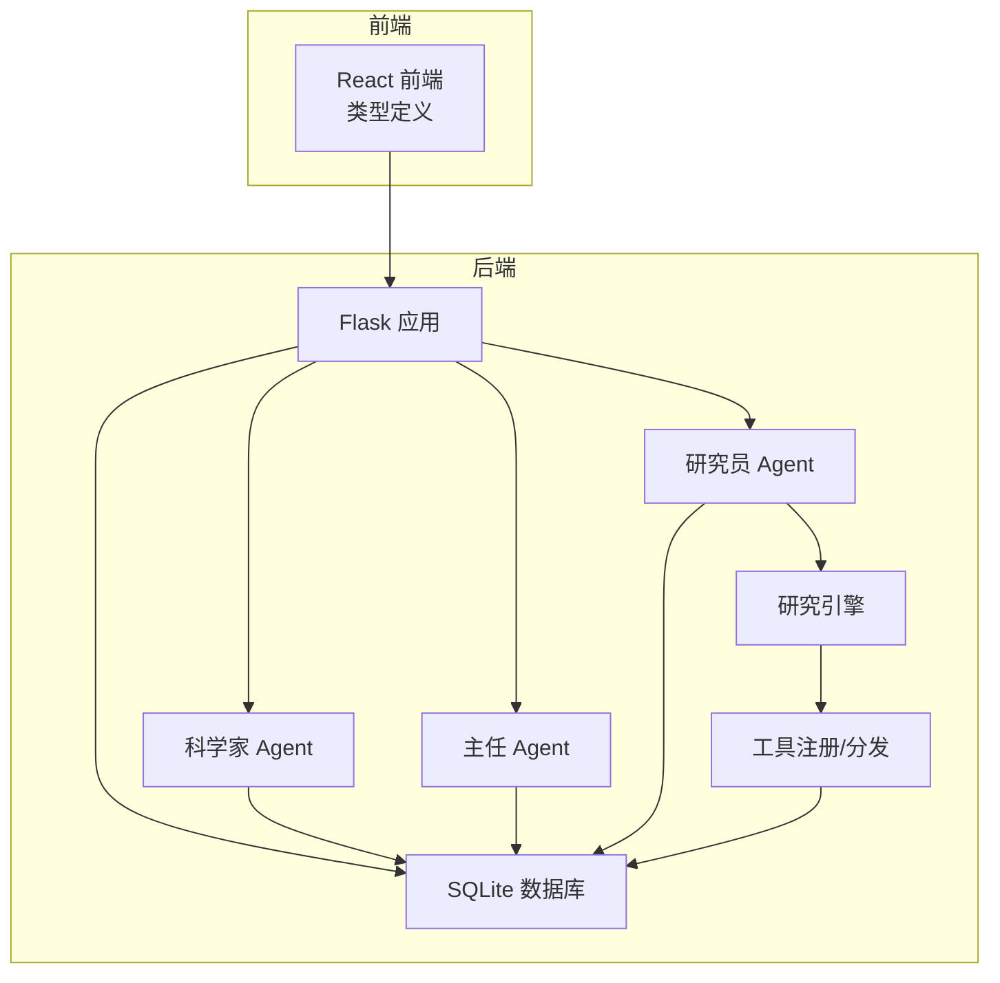
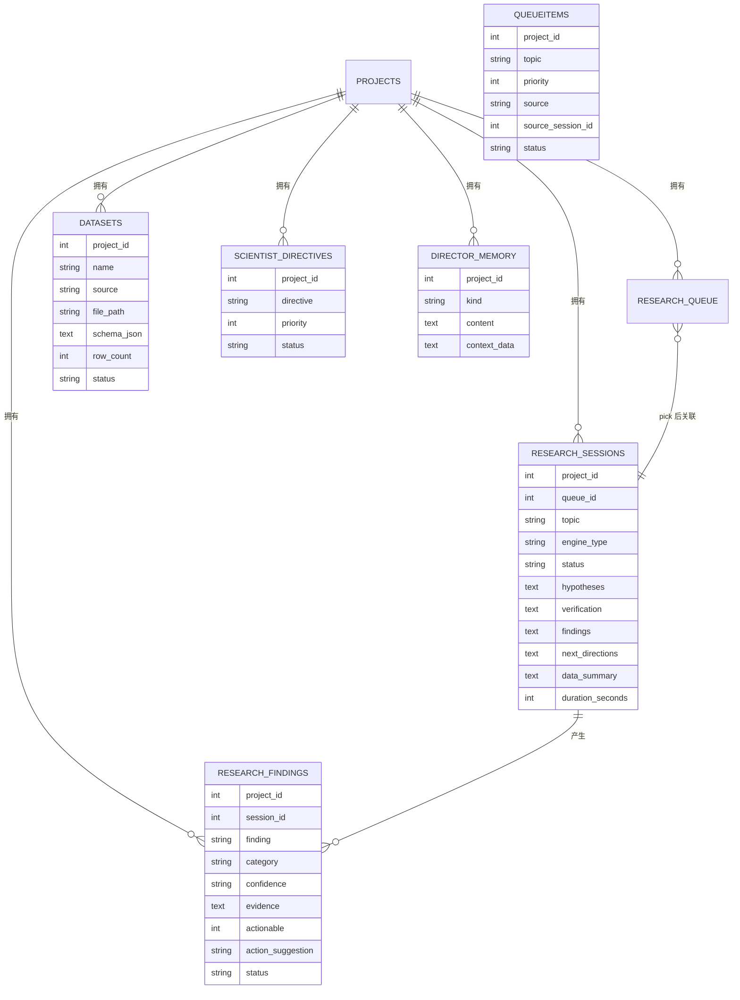
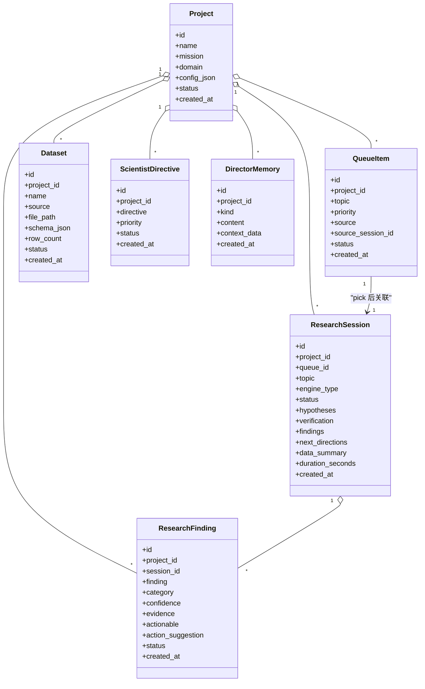
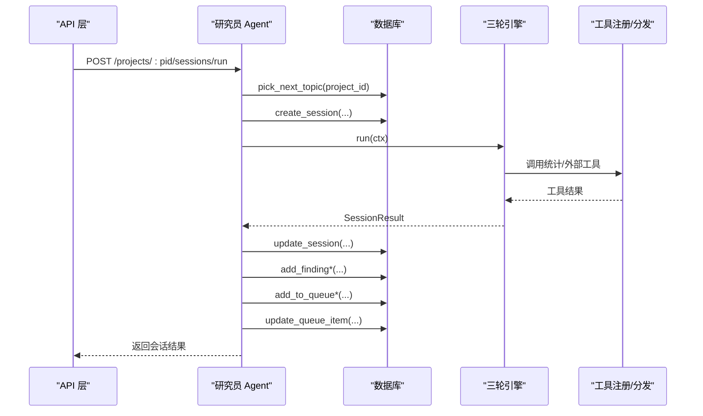
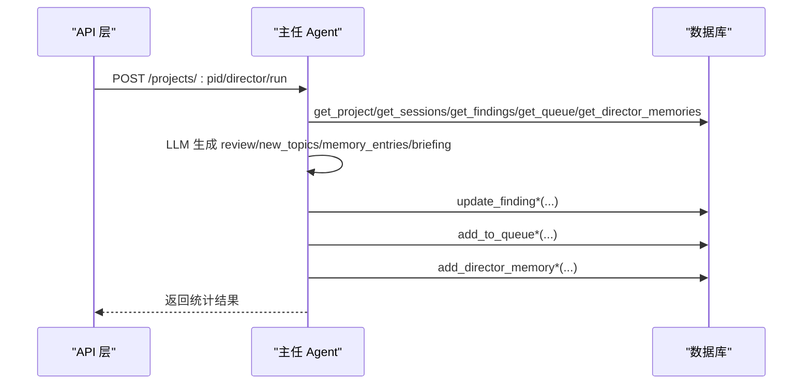
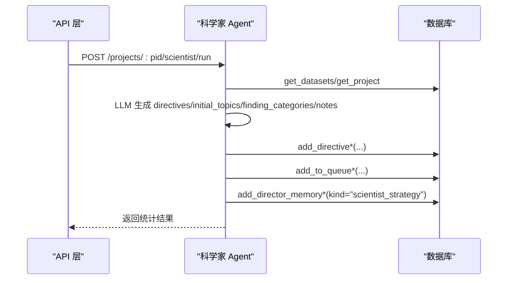
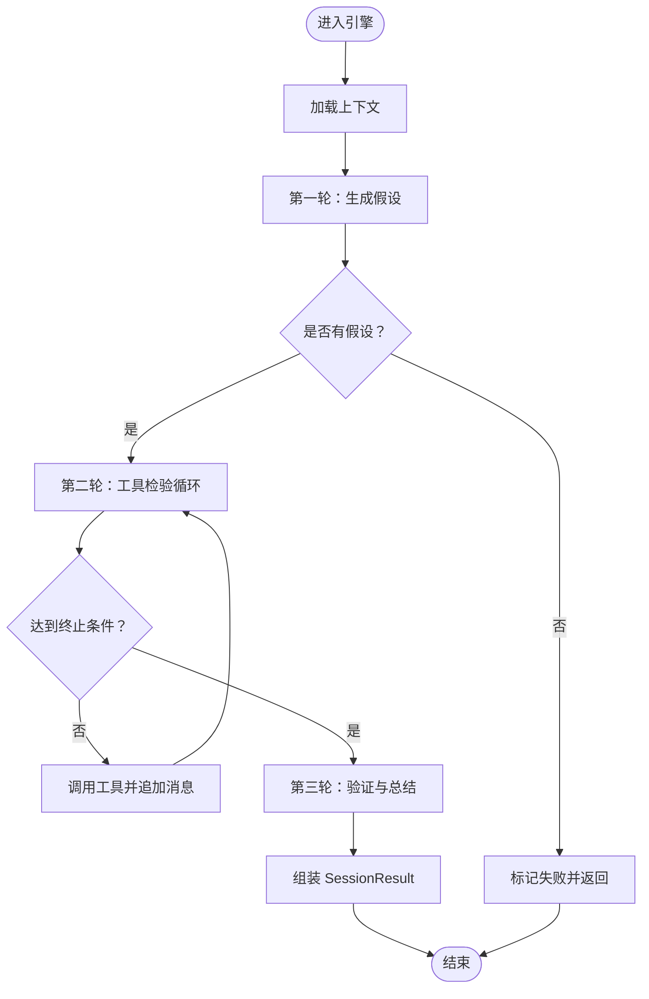
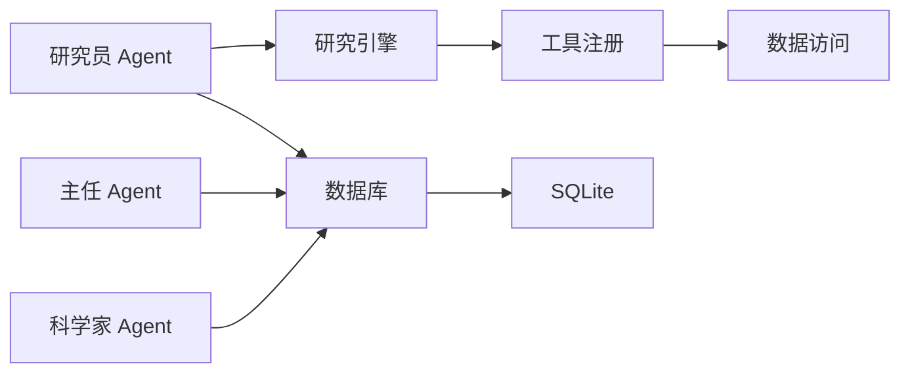

# 数据模型概览

<cite>
**本文引用的文件**
- [database.py](file://database.py)
- [app.py](file://app.py)
- [agents/director.py](file://agents/director.py)
- [agents/researcher.py](file://agents/researcher.py)
- [agents/scientist.py](file://agents/scientist.py)
- [engines/base.py](file://engines/base.py)
- [engines/three_round.py](file://engines/three_round.py)
- [tools/data_access.py](file://tools/data_access.py)
- [tools/registry.py](file://tools/registry.py)
- [frontend/src/types.ts](file://frontend/src/types.ts)
- [config.py](file://config.py)
- [README.md](file://README.md)
</cite>

## 目录
1. [简介](#简介)
2. [项目结构](#项目结构)
3. [核心数据实体](#核心数据实体)
4. [架构总览](#架构总览)
5. [详细组件分析](#详细组件分析)
6. [依赖关系分析](#依赖关系分析)
7. [性能考量](#性能考量)
8. [故障排查指南](#故障排查指南)
9. [结论](#结论)
10. [附录](#附录)

## 简介
本文件面向开发者与产品人员，系统化梳理 AInstein 的数据模型与实体关系，重点覆盖以下核心实体：Project、ResearchSession、Finding、Dataset、QueueItem、ScientistDirective、DirectorMemory。文档从设计理念、业务含义、关系建模、数据流到扩展性与演进方向进行完整阐述，并提供实体关系图与数据流图，帮助快速理解整体数据架构。

## 项目结构
AInstein 采用“Flask 应用 + SQLite 数据层 + 三层 AI Agent + 可插拔工具”的分层架构：
- 后端应用层：Flask 提供 REST API，统一入口与路由。
- 数据访问层：SQLite 表结构定义与 CRUD 封装。
- 业务逻辑层：科学家、主任、研究员三个 Agent 负责策略制定、质量控制与执行。
- 引擎层：研究引擎负责三轮推理与工具调用。
- 工具层：内置统计与外部数据工具注册与分发。
- 前端类型层：TypeScript 类型定义与 API 规范保持一致。

图表来源
- [app.py:1-182](file://app.py#L1-L182)
- [database.py:1-344](file://database.py#L1-L344)
- [agents/scientist.py:1-75](file://agents/scientist.py#L1-L75)
- [agents/director.py:1-124](file://agents/director.py#L1-L124)
- [agents/researcher.py:1-114](file://agents/researcher.py#L1-L114)
- [engines/three_round.py:1-179](file://engines/three_round.py#L1-L179)
- [tools/registry.py:1-181](file://tools/registry.py#L1-L181)

章节来源
- [README.md:71-124](file://README.md#L71-L124)
- [app.py:1-182](file://app.py#L1-L182)
- [database.py:1-344](file://database.py#L1-L344)

## 核心数据实体
本节从“业务含义 + 关系建模 + 字段要点 + 复杂度/性能”五个维度，系统介绍各实体。

- Project（项目）
  - 业务含义：承载研究目标、领域、配置与状态；是所有子实体的根容器。
  - 关键字段：名称、使命、领域、配置 JSON、状态、创建时间。
  - 复杂度/性能：按状态与时间排序查询，适合索引 idx_projects_status_created。
  - 与其他实体：一对多（ResearchSession、QueueItem、Finding、Dataset、ScientistDirective、DirectorMemory）。

- ResearchSession（研究会话）
  - 业务含义：一次完整的三轮研究过程产出，记录 hypotheses、verification、findings、next_directions、data_summary、耗时等。
  - 关键字段：所属项目、队列项关联、主题、引擎类型、状态、时间戳。
  - 复杂度/性能：按项目+时间倒序查询，适合索引 idx_rs_project_created。
  - 与其他实体：一对一（QueueItem，可空）、一对多（Finding）。

- Finding（研究发现）
  - 业务含义：单条可操作的研究结论，支持分类、置信度、证据、是否可行动、建议等。
  - 关键字段：所属项目、所属会话、内容、类别、置信度、证据、可行动标记、建议、状态。
  - 复杂度/性能：按项目+时间倒序查询，支持按状态/类别过滤，适合索引 idx_rf_project_created。
  - 与其他实体：多对一（ResearchSession）。

- Dataset（数据集）
  - 业务含义：项目内上传的数据文件，记录文件名、来源、路径、Schema、行数、状态。
  - 关键字段：项目、名称、来源、文件路径、Schema JSON、行数、状态。
  - 复杂度/性能：按项目+时间倒序查询，适合索引 idx_ds_project。
  - 与其他实体：多对一（Project），被引擎工具层引用。

- QueueItem（研究队列项）
  - 业务含义：待处理的研究主题，支持优先级、来源、状态流转。
  - 关键字段：项目、主题、优先级、来源、来源会话、状态、时间戳。
  - 复杂度/性能：按项目+状态/优先级/时间排序，适合索引 idx_rq_project。
  - 与其他实体：多对一（Project），一对一（ResearchSession，pick 后建立关联）。

- ScientistDirective（科学家指令）
  - 业务含义：科学家为项目制定的战略指令，影响后续研究方向与上下文。
  - 关键字段：项目、指令文本、优先级、状态、时间戳。
  - 复杂度/性能：按项目+状态排序，适合索引 idx_sd_project。
  - 与其他实体：多对一（Project）。

- DirectorMemory（主任记忆）
  - 业务含义：主任每日回顾产生的知识沉淀，含 kind/content/context_data。
  - 关键字段：项目、kind、content、context_data JSON、时间戳。
  - 复杂度/性能：按项目+时间倒序查询，适合索引 idx_dm_project。
  - 与其他实体：多对一（Project）。

章节来源
- [database.py:10-98](file://database.py#L10-L98)
- [engines/base.py:11-49](file://engines/base.py#L11-L49)
- [frontend/src/types.ts:1-89](file://frontend/src/types.ts#L1-L89)

## 架构总览
下图展示数据模型在系统中的位置与交互关系，以及与 Agent、引擎、工具层的耦合点。

图表来源
- [database.py:10-98](file://database.py#L10-L98)
- [engines/base.py:11-49](file://engines/base.py#L11-L49)

## 详细组件分析

### 实体关系与业务规则
- 一对一关系
  - QueueItem ↔ ResearchSession：研究员从队列 pick 主题后创建会话，二者建立一对一关联；若未 pick 则 queue_id 为空。
- 一对多关系
  - Project → ResearchSession、QueueItem、Finding、Dataset、ScientistDirective、DirectorMemory：项目作为根实体，承载所有子实体。
  - ResearchSession → ResearchFinding：一次会话可能产出多个发现。
- 多对一关系
  - ResearchFinding → ResearchSession：每条发现必须归属某次会话。
  - 所有实体均通过 project_id 归属于某个项目。

图表来源
- [database.py:10-98](file://database.py#L10-L98)
- [engines/base.py:11-49](file://engines/base.py#L11-L49)

章节来源
- [database.py:10-98](file://database.py#L10-L98)
- [engines/base.py:11-49](file://engines/base.py#L11-L49)

### 数据流与处理逻辑

#### 研究会话流程（序列图）

图表来源
- [agents/researcher.py:14-114](file://agents/researcher.py#L14-L114)
- [engines/three_round.py:28-179](file://engines/three_round.py#L28-L179)
- [tools/registry.py:24-43](file://tools/registry.py#L24-L43)
- [database.py:232-262](file://database.py#L232-L262)

章节来源
- [agents/researcher.py:14-114](file://agents/researcher.py#L14-L114)
- [engines/three_round.py:28-179](file://engines/three_round.py#L28-L179)
- [tools/registry.py:24-43](file://tools/registry.py#L24-L43)
- [database.py:232-262](file://database.py#L232-L262)

#### 主任每日回顾流程（序列图）

图表来源
- [agents/director.py:14-124](file://agents/director.py#L14-L124)
- [database.py:173-188](file://database.py#L173-L188)
- [database.py:214-228](file://database.py#L214-L228)
- [database.py:299-320](file://database.py#L299-L320)

章节来源
- [agents/director.py:14-124](file://agents/director.py#L14-L124)
- [database.py:173-188](file://database.py#L173-L188)
- [database.py:214-228](file://database.py#L214-L228)
- [database.py:299-320](file://database.py#L299-L320)

#### 科学家策略生成流程（序列图）

图表来源
- [agents/scientist.py:14-75](file://agents/scientist.py#L14-L75)
- [database.py:173-188](file://database.py#L173-L188)
- [database.py:192-228](file://database.py#L192-L228)
- [database.py:299-320](file://database.py#L299-L320)

章节来源
- [agents/scientist.py:14-75](file://agents/scientist.py#L14-L75)
- [database.py:173-188](file://database.py#L173-L188)
- [database.py:192-228](file://database.py#L192-L228)
- [database.py:299-320](file://database.py#L299-L320)

### 复杂算法与数据结构
- 三轮引擎（ThreeRoundEngine）
  - 输入：ResearchContext（项目上下文、主题、数据集摘要、近期发现、指令等）。
  - 输出：SessionResult（状态、假设、验证、发现、下一步方向、数据摘要、耗时）。
  - 关键流程：假设生成 → 工具检验（循环最多 N 轮）→ 验证与总结。
  - 时间复杂度：受工具调用次数与数据规模影响，典型 O(N×T)，其中 N 为工具调用轮次，T 为单次工具复杂度。
  - 空间复杂度：O(M)，M 为工具结果与验证日志大小。
  - 错误处理：当无法解析 JSON 或无假设时，返回失败/部分完成状态。

图表来源
- [engines/three_round.py:28-179](file://engines/three_round.py#L28-L179)
- [engines/base.py:11-49](file://engines/base.py#L11-L49)

章节来源
- [engines/three_round.py:28-179](file://engines/three_round.py#L28-L179)
- [engines/base.py:11-49](file://engines/base.py#L11-L49)

## 依赖关系分析
- 组件耦合
  - Agent 层依赖数据库层（CRUD）、引擎层（推理）、工具层（统计/外部数据）。
  - 引擎层依赖工具注册表与数据访问工具。
  - 数据库层提供统一的表结构与索引，支撑查询性能。
- 外部依赖
  - LLM API（DashScope Anthropic 协议），通过配置注入模型名与密钥。
  - 文件系统用于存储数据集文件。
- 潜在环路
  - 当前模块间为单向依赖（Agent→DB/Engine→Tools），无明显循环导入。

图表来源
- [agents/scientist.py:1-75](file://agents/scientist.py#L1-L75)
- [agents/director.py:1-124](file://agents/director.py#L1-L124)
- [agents/researcher.py:1-114](file://agents/researcher.py#L1-L114)
- [engines/three_round.py:1-179](file://engines/three_round.py#L1-L179)
- [tools/registry.py:1-181](file://tools/registry.py#L1-L181)
- [database.py:1-344](file://database.py#L1-L344)

章节来源
- [agents/scientist.py:1-75](file://agents/scientist.py#L1-L75)
- [agents/director.py:1-124](file://agents/director.py#L1-L124)
- [agents/researcher.py:1-114](file://agents/researcher.py#L1-L114)
- [engines/three_round.py:1-179](file://engines/three_round.py#L1-L179)
- [tools/registry.py:1-181](file://tools/registry.py#L1-L181)
- [database.py:1-344](file://database.py#L1-L344)

## 性能考量
- 索引策略
  - idx_rq_project：队列按项目+状态查询，提升 pick_next_topic 与列表查询效率。
  - idx_rs_project：会话按项目+时间倒序查询，满足仪表盘与历史列表。
  - idx_rf_project：发现按项目+时间倒序查询，支持筛选与分页。
  - idx_dm_project：主任记忆按项目+时间倒序查询，支持回顾与摘要。
  - idx_ds_project：数据集按项目查询，支持项目级数据浏览。
  - idx_sd_project：指令按项目+状态查询，支持策略管理。
- WAL 模式与外键约束
  - 使用 WAL 模式提升并发写入性能；开启外键约束保证参照完整性。
- 查询优化
  - 分页与限制：前端/接口侧限制返回数量，避免一次性拉取大量数据。
  - 条件过滤：按状态/类别/优先级过滤，减少扫描范围。
- 引擎与工具
  - 工具调用轮次上限（如 max_tool_rounds）防止无限循环。
  - 结果序列化与截断，避免超长 JSON 影响传输与解析。

章节来源
- [database.py:92-98](file://database.py#L92-L98)
- [database.py:109-123](file://database.py#L109-L123)
- [engines/three_round.py:103-104](file://engines/three_round.py#L103-L104)

## 故障排查指南
- 常见问题定位
  - 项目不存在：Agent 层在读取项目信息失败时会记录错误日志，检查项目 ID 是否正确。
  - 队列为空：pick_next_topic 返回 None，需确认队列中有状态为 pending 的项。
  - 引擎 JSON 解析失败：三轮引擎在第三轮无法解析 JSON 时返回 partial 状态，检查 LLM 输出格式与提示词。
  - 工具调用失败：工具分发返回 error，检查数据集文件是否存在、列名是否匹配、工具参数是否齐全。
- 日志与可观测性
  - 各 Agent 与引擎均输出 INFO/WARNING/ERROR 日志，便于定位阶段与原因。
  - 前端类型与后端 API 字段保持一致，便于前后端联调。
- 数据一致性
  - 事务封装在 get_db 上下文中，异常自动回滚，确保数据一致性。
  - 外键约束防止孤儿记录，保证引用完整性。

章节来源
- [agents/director.py:14-124](file://agents/director.py#L14-L124)
- [agents/researcher.py:62-70](file://agents/researcher.py#L62-L70)
- [engines/three_round.py:160-175](file://engines/three_round.py#L160-L175)
- [tools/registry.py:24-43](file://tools/registry.py#L24-L43)
- [database.py:109-123](file://database.py#L109-L123)

## 结论
AInstein 的数据模型以 Project 为核心，围绕“队列—会话—发现—记忆—指令—数据集”的闭环组织研究数据，通过 SQLite+WAL+索引保障性能与一致性，通过三层 Agent 与三轮引擎实现自动化研究流程。当前模型具备良好的扩展性：新增实体可通过外键与索引扩展；Agent/引擎/工具层解耦便于演进；前端类型与后端 API 保持一致，降低集成成本。建议在后续版本中引入审计日志、增量备份与更细粒度的权限控制，以进一步增强生产可用性。

## 附录
- API 与类型映射参考
  - 前端 TypeScript 类型与数据库字段一一对应，便于前后端协同开发与校验。
- 配置与部署
  - 通过环境变量控制数据库路径、数据目录、LLM 模型与 Base URL，便于不同环境部署。

章节来源
- [frontend/src/types.ts:1-89](file://frontend/src/types.ts#L1-L89)
- [config.py:1-11](file://config.py#L1-L11)
- [app.py:179-182](file://app.py#L179-L182)