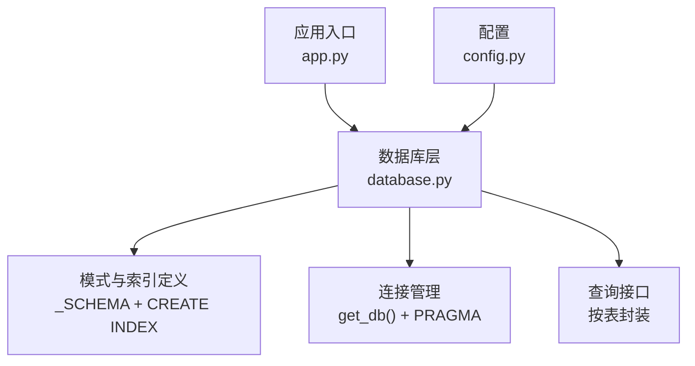
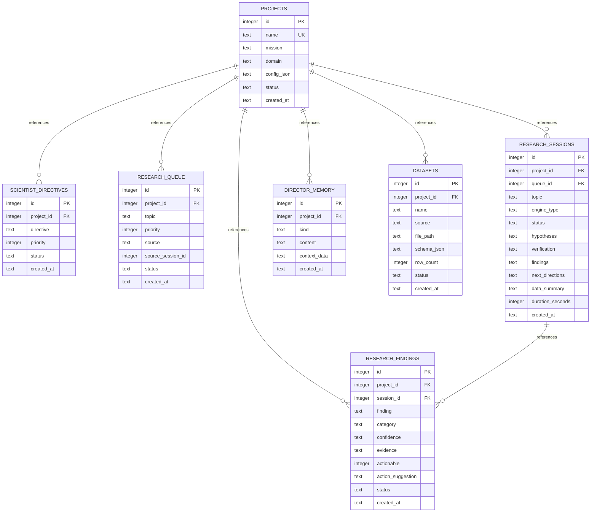
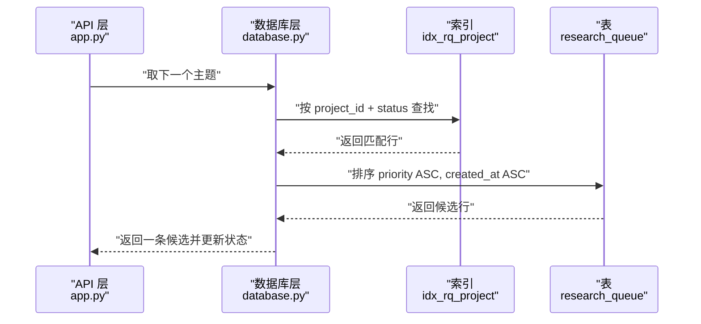
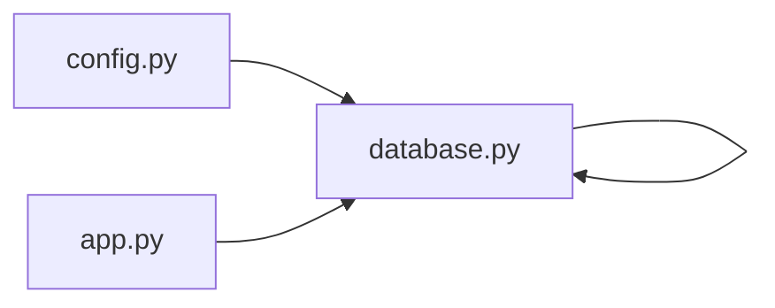

# 索引与约束

<cite>
**本文引用的文件**
- [database.py](file://database.py)
- [config.py](file://config.py)
- [app.py](file://app.py)
- [docs/testing.md](file://docs/testing.md)
</cite>

## 目录
1. [简介](#简介)
2. [项目结构](#项目结构)
3. [核心组件](#核心组件)
4. [架构总览](#架构总览)
5. [详细组件分析](#详细组件分析)
6. [依赖关系分析](#依赖关系分析)
7. [性能考量](#性能考量)
8. [故障排查指南](#故障排查指南)
9. [结论](#结论)
10. [附录](#附录)

## 简介
本文件聚焦于数据库层的索引与约束设计，系统性说明以下内容：
- 所有索引的设计目的与对查询性能的优化效果，重点覆盖 idx_rq_project、idx_rs_project、idx_rf_project 等关键索引
- 主键、外键约束的定义与作用机制
- SQLite 外键约束启用对数据完整性的影响与保障
- 索引使用建议与查询性能优化策略
- 索引维护与重建的最佳实践

## 项目结构
数据库层位于 Python 包中，核心为数据库初始化与连接管理、表结构与索引定义、以及围绕各业务实体的 CRUD 接口。应用启动时会确保数据库初始化，并在每个请求上下文中通过上下文管理器建立连接，设置 WAL 日志模式与开启外键约束。

图表来源
- [app.py:15-19](file://app.py#L15-L19)
- [database.py:101-123](file://database.py#L101-L123)
- [database.py:10-98](file://database.py#L10-L98)
- [config.py:4](file://config.py#L4)

章节来源
- [app.py:15-19](file://app.py#L15-L19)
- [database.py:101-123](file://database.py#L101-L123)
- [database.py:10-98](file://database.py#L10-L98)
- [config.py:4](file://config.py#L4)

## 核心组件
- 数据库初始化与连接管理：负责创建目录、执行模式脚本、设置 WAL 与外键约束、事务提交/回滚与连接关闭
- 模式与索引：定义所有表的主键、唯一约束、外键引用关系；定义多列与单列索引以支撑高频查询
- 查询接口：围绕 projects、scientist_directives、research_queue、research_sessions、research_findings、director_memory、datasets 提供 CRUD 与统计查询

章节来源
- [database.py:101-123](file://database.py#L101-L123)
- [database.py:10-98](file://database.py#L10-L98)
- [database.py:125-344](file://database.py#L125-L344)

## 架构总览
下图展示数据库层的表结构、主键/外键关系与关键索引，映射到实际的建表与索引语句。

图表来源
- [database.py:10-98](file://database.py#L10-L98)

## 详细组件分析

### 约束与完整性
- 主键约束
  - 所有表的主键均为自增整数，确保每条记录唯一标识，便于外键引用与索引组织
- 外键约束
  - 多个子表通过 project_id 引用 projects.id，确保项目维度的数据一致性
  - research_sessions 的 queue_id 引用 research_queue.id，形成队列-会话的关联
  - research_findings 的 session_id 引用 research_sessions.id，形成会话-发现的关联
- 唯一约束
  - projects.name 字段唯一，避免重复项目名称
- 外键约束启用
  - 连接建立时显式开启 PRAGMA foreign_keys=ON，使 SQLite 在插入/更新/删除时进行外键检查，防止产生悬挂引用，保障参照完整性

章节来源
- [database.py:10-98](file://database.py#L10-L98)
- [database.py:114](file://database.py#L114)

### 索引设计与性能目标
- idx_rq_project(project_id, status)
  - 设计目的：加速研究队列按项目过滤与状态筛选的查询，常用于“取下一个主题”和“列出队列项”
  - 性能影响：复合索引覆盖 project_id+status，避免全表扫描；配合 ORDER BY priority ASC, created_at ASC 可显著降低排序成本
- idx_rs_project(project_id, created_at)
  - 设计目的：支撑按项目检索最新会话列表，满足“最近会话”展示与统计
  - 性能影响：索引前缀命中 project_id，created_at 辅助降序排序，减少排序开销
- idx_rf_project(project_id, created_at)
  - 设计目的：支撑项目维度的发现列表与分页，按创建时间倒序展示
  - 性能影响：索引覆盖 project_id+created_at，避免额外排序与回表
- idx_dm_project(project_id, created_at)
  - 设计目的：支撑项目维度的记忆条目按时间倒序查看
  - 性能影响：同上，避免排序与回表
- idx_ds_project(project_id)
  - 设计目的：支撑项目维度的数据集列表
  - 性能影响：单列索引，快速定位项目下的数据集集合
- idx_sd_project(project_id, status)
  - 设计目的：支撑项目维度的科学家指令按状态筛选与优先级排序
  - 性能影响：索引前缀命中 project_id，status 辅助过滤，priority 用于排序

章节来源
- [database.py:92-97](file://database.py#L92-L97)
- [database.py:214-223](file://database.py#L214-L223)
- [database.py:250-256](file://database.py#L250-L256)
- [database.py:277-290](file://database.py#L277-L290)
- [database.py:307-319](file://database.py#L307-L319)
- [database.py:332-338](file://database.py#L332-L338)
- [database.py:181-187](file://database.py#L181-L187)

### 查询路径与索引使用示意
以下序列图展示典型查询如何利用索引提升性能。

图表来源
- [database.py:214-223](file://database.py#L214-L223)
- [database.py:92](file://database.py#L92)

### 典型查询流程与索引命中
- 研究队列查询
  - 通过 idx_rq_project(project_id, status) 快速定位项目下特定状态的队列项，随后按优先级与时间排序
- 会话列表查询
  - 通过 idx_rs_project(project_id, created_at) 快速定位项目下会话，并按时间倒序
- 发现列表查询
  - 通过 idx_rf_project(project_id, created_at) 快速定位项目下发现，并按时间倒序
- 记忆查询
  - 通过 idx_dm_project(project_id, created_at) 快速定位项目下记忆条目，并按时间倒序
- 数据集查询
  - 通过 idx_ds_project(project_id) 快速定位项目下数据集集合
- 科学家指令查询
  - 通过 idx_sd_project(project_id, status) 快速定位项目下指令，再按优先级排序

章节来源
- [database.py:200-223](file://database.py#L200-L223)
- [database.py:250-256](file://database.py#L250-L256)
- [database.py:277-290](file://database.py#L277-L290)
- [database.py:307-319](file://database.py#L307-L319)
- [database.py:332-338](file://database.py#L332-L338)
- [database.py:181-187](file://database.py#L181-L187)

### 索引维护与重建最佳实践
- 维护策略
  - 使用 WAL 模式提升并发读写性能，降低锁竞争
  - 在连接建立时启用外键约束，确保数据一致性
  - 定期备份数据库文件，保留历史快照以便回滚
- 重建建议
  - 当表结构或查询模式发生重大变化时，评估现有索引是否仍最优
  - 对于频繁的范围查询或排序场景，考虑调整索引顺序或增加复合索引
  - 对于低选择性的列（如 status），结合其他列组成复合索引以提高区分度
- 监控与验证
  - 结合应用日志与数据库性能指标，持续观察查询耗时与索引使用情况
  - 在测试环境中模拟生产负载，验证索引对关键路径查询的改善效果

章节来源
- [database.py:113-114](file://database.py#L113-L114)
- [docs/testing.md:575-584](file://docs/testing.md#L575-L584)

## 依赖关系分析
- 应用层依赖数据库层提供的初始化与查询接口
- 数据库层依赖配置模块中的 DB_PATH
- 查询接口直接依赖已定义的索引，以实现高效检索

图表来源
- [config.py:4](file://config.py#L4)
- [app.py:15-19](file://app.py#L15-L19)
- [database.py:101-123](file://database.py#L101-L123)

章节来源
- [config.py:4](file://config.py#L4)
- [app.py:15-19](file://app.py#L15-L19)
- [database.py:101-123](file://database.py#L101-L123)

## 性能考量
- 索引选择性
  - idx_rq_project、idx_rs_project、idx_rf_project、idx_dm_project、idx_sd_project 等复合索引通过前缀命中 project_id，有效降低扫描范围
- 排序与回表
  - 通过在索引中包含排序字段（如 created_at），减少额外排序与回表成本
- 外键约束与并发
  - 启用外键约束可能带来轻微的写入开销，但换来更强的一致性保障；结合 WAL 模式可平衡读写性能
- 实测参考
  - 测试文档记录了部分查询的平均耗时，可作为索引效果的参考基线

章节来源
- [database.py:92-97](file://database.py#L92-L97)
- [database.py:113-114](file://database.py#L113-L114)
- [docs/testing.md:575-584](file://docs/testing.md#L575-L584)

## 故障排查指南
- 外键约束相关错误
  - 插入或更新子表记录时若引用不存在的父表主键，将触发外键约束错误；需确保先创建父记录或修正引用值
  - 开启外键约束后，删除父记录可能导致违反外键约束；应先清理子表相关记录
- 索引未被使用
  - 若查询条件未命中索引前缀或排序字段不在索引中，可能导致全表扫描；可通过 EXPLAIN QUERY PLAN 分析执行计划
- 连接与事务
  - get_db() 上下文管理器负责提交/回滚与关闭连接；异常时自动回滚，避免脏状态

章节来源
- [database.py:114](file://database.py#L114)
- [database.py:115-122](file://database.py#L115-L122)

## 结论
本数据库层通过明确的主键/外键约束与精心设计的复合索引，有效支撑了项目维度的队列、会话、发现、记忆与数据集等核心业务查询。启用 SQLite 外键约束与 WAL 模式，在保证数据完整性的同时兼顾了并发性能。建议在变更表结构或查询模式时，重新评估索引策略并结合实测指标持续优化。

## 附录
- 关键索引清单
  - idx_rq_project(project_id, status)：队列按项目+状态查询
  - idx_rs_project(project_id, created_at)：会话按项目+时间查询
  - idx_rf_project(project_id, created_at)：发现按项目+时间查询
  - idx_dm_project(project_id, created_at)：记忆按项目+时间查询
  - idx_ds_project(project_id)：数据集按项目查询
  - idx_sd_project(project_id, status)：指令按项目+状态查询

章节来源
- [database.py:92-97](file://database.py#L92-L97)