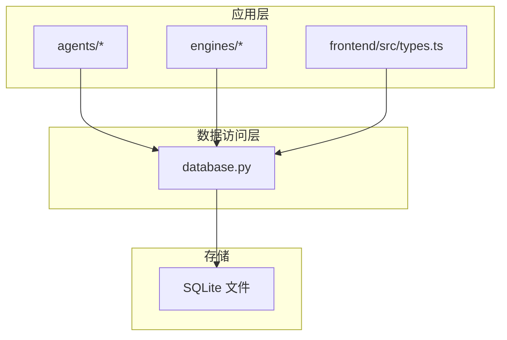
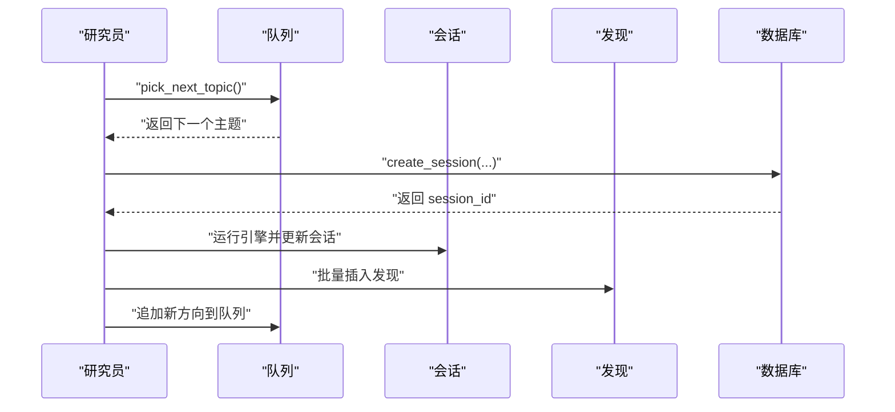
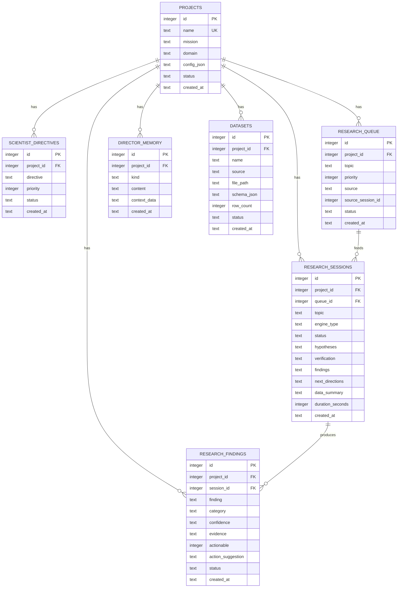

# 表结构说明

<cite>
**本文引用的文件列表**
- [database.py](file://database.py)
- [engines/base.py](file://engines/base.py)
- [engines/three_round.py](file://engines/three_round.py)
- [agents/director.py](file://agents/director.py)
- [agents/researcher.py](file://agents/researcher.py)
- [tools/data_access.py](file://tools/data_access.py)
- [config.py](file://config.py)
- [frontend/src/types.ts](file://frontend/src/types.ts)
- [README.md](file://README.md)
</cite>

## 目录
1. [简介](#简介)
2. [项目结构与数据库层定位](#项目结构与数据库层定位)
3. [核心表结构总览](#核心表结构总览)
4. [架构与数据流概览](#架构与数据流概览)
5. [详细表结构说明](#详细表结构说明)
   - [Projects 表](#projects-表)
   - [ScientistDirectives 表](#scientistdirectives-表)
   - [ResearchQueue 表](#researchqueue-表)
   - [ResearchSessions 表](#researchsessions-表)
   - [ResearchFindings 表](#researchfindings-表)
   - [DirectorMemory 表](#directormemory-表)
   - [Datasets 表](#datasets-表)
6. [字段命名规范与数据类型选择的技术考量](#字段命名规范与数据类型选择的技术考量)
7. [表关系与索引设计](#表关系与索引设计)
8. [历史变更与版本兼容性说明](#历史变更与版本兼容性说明)
9. [性能与可维护性建议](#性能与可维护性建议)
10. [故障排查与常见问题](#故障排查与常见问题)
11. [结论](#结论)

## 简介
本文件面向数据库与系统维护人员，系统化梳理 AInstein 平台的数据表结构，覆盖 Projects、ScientistDirectives、ResearchQueue、ResearchSessions、ResearchFindings、DirectorMemory、Datasets 等核心表。内容包括字段定义、数据类型、约束条件、默认值、业务含义、取值范围与验证规则，并结合实际代码调用点说明字段在系统中的使用方式与影响面，帮助读者快速理解与安全地进行表结构演进。

## 项目结构与数据库层定位
- 数据库层位于 database.py，负责建表、初始化、事务管理、索引以及各实体的增删改查接口。
- 引擎层（engines）定义了研究会话的结果数据结构，直接影响 Sessions 与 Findings 的持久化字段。
- Agent 层（agents）通过数据库接口读写数据，体现字段的实际业务用途。
- 前端类型定义（frontend/src/types.ts）用于前后端契约一致性校验，辅助理解字段语义与取值范围。

图表来源
- [database.py:101-123](file://database.py#L101-L123)
- [engines/base.py:11-49](file://engines/base.py#L11-L49)
- [engines/three_round.py:22-179](file://engines/three_round.py#L22-L179)
- [agents/director.py:14-124](file://agents/director.py#L14-L124)
- [agents/researcher.py:14-114](file://agents/researcher.py#L14-L114)
- [frontend/src/types.ts:1-88](file://frontend/src/types.ts#L1-L88)

章节来源
- [database.py:101-123](file://database.py#L101-L123)
- [engines/base.py:11-49](file://engines/base.py#L11-L49)
- [engines/three_round.py:22-179](file://engines/three_round.py#L22-L179)
- [agents/director.py:14-124](file://agents/director.py#L14-L124)
- [agents/researcher.py:14-114](file://agents/researcher.py#L14-L114)
- [frontend/src/types.ts:1-88](file://frontend/src/types.ts#L1-L88)

## 核心表结构总览
- Projects：项目元数据与配置。
- ScientistDirectives：项目级研究指令，支持优先级与状态。
- ResearchQueue：研究主题排队池，支持优先级、来源与状态。
- ResearchSessions：单次研究会话，承载引擎输出的假设、验证、发现、后续方向等。
- ResearchFindings：研究发现条目，支持分类、置信度、是否可行动、建议等。
- DirectorMemory：主任记忆片段，支持 kind/content/context_data。
- Datasets：项目数据集清单，记录名称、来源、路径、模式与行数。

章节来源
- [database.py:10-98](file://database.py#L10-L98)

## 架构与数据流概览
- 研究员（Researcher）从队列中取出主题，创建会话，运行引擎，回写会话与发现，并向队列追加新的方向。
- 主任（Director）汇总最近会话、开放发现、队列与记忆，产出审查、新增主题与记忆条目。
- 数据库层统一提供 CRUD 与统计查询，支撑上述流程。

图表来源
- [agents/researcher.py:14-114](file://agents/researcher.py#L14-L114)
- [database.py:232-261](file://database.py#L232-L261)
- [database.py:266-295](file://database.py#L266-L295)
- [database.py:192-228](file://database.py#L192-L228)

## 详细表结构说明

### Projects 表
- 字段与定义
  - id：整型，主键，自增。
  - name：文本，非空，唯一。
  - mission：文本，非空。
  - domain：文本，非空。
  - config_json：文本，默认空 JSON 字符串 '{}'，用于存放项目配置。
  - status：文本，默认 'active'。
  - created_at：文本，默认当前时间（函数表达式）。
- 约束与默认值
  - 唯一约束：name。
  - 默认值：status='active'；created_at 使用数据库函数生成。
- 业务含义与取值范围
  - name：项目标识，唯一；建议仅含字母数字与下划线，长度合理。
  - mission/domain：描述项目目标与领域，建议简洁明确。
  - config_json：JSON 字符串，建议遵循约定的键集合，避免冗余。
  - status：枚举值建议限定为 'active'、'inactive' 等，便于筛选。
- 验证规则
  - 插入时 name 必须唯一；mission、domain 必须非空。
  - 若未显式传入 config_json，则默认为空对象字符串。
- 使用点参考
  - 创建项目：[database.py:127-133](file://database.py#L127-L133)
  - 查询项目：[database.py:135-145](file://database.py#L135-L145)
  - 统计聚合：[database.py:147-168](file://database.py#L147-L168)

章节来源
- [database.py:10-19](file://database.py#L10-L19)
- [database.py:127-133](file://database.py#L127-L133)
- [database.py:135-145](file://database.py#L135-L145)
- [database.py:147-168](file://database.py#L147-L168)

### ScientistDirectives 表
- 字段与定义
  - id：整型，主键，自增。
  - project_id：整型，外键引用 projects(id)，非空。
  - directive：文本，非空。
  - priority：整型，默认 5。
  - status：文本，默认 'active'。
  - created_at：文本，默认当前时间。
- 约束与默认值
  - 外键：project_id 引用 projects(id)。
  - 默认值：priority=5；status='active'；created_at 使用函数表达式。
- 业务含义与取值范围
  - directive：具体的研究指令文本，建议清晰、可执行。
  - priority：数值越大越优先；建议在 1-10 区间内。
  - status：建议枚举值限定为 'active'、'inactive' 或 'archived'。
- 验证规则
  - 插入时 directive 必须非空；project_id 必须存在且有效。
- 使用点参考
  - 新增指令：[database.py:173-179](file://database.py#L173-L179)
  - 查询指令：[database.py:181-187](file://database.py#L181-L187)

章节来源
- [database.py:21-28](file://database.py#L21-L28)
- [database.py:173-179](file://database.py#L173-L179)
- [database.py:181-187](file://database.py#L181-L187)

### ResearchQueue 表
- 字段与定义
  - id：整型，主键，自增。
  - project_id：整型，外键引用 projects(id)，非空。
  - topic：文本，非空。
  - priority：整型，默认 5。
  - source：文本，默认 'user'；取值建议限定为 'user'、'ai_generated'、'director' 等。
  - source_session_id：整型，可空，用于回溯来源会话。
  - status：文本，默认 'pending'；取值建议限定为 'pending'、'picked'、'completed'、'failed'。
  - created_at：文本，默认当前时间。
- 约束与默认值
  - 外键：project_id 引用 projects(id)。
  - 默认值：priority=5；source='user'；status='pending'；created_at 使用函数表达式。
- 业务含义与取值范围
  - topic：研究主题，建议简洁明确。
  - priority/source/status：控制调度与可视化展示。
  - source_session_id：用于追踪由某次会话产生的后续方向。
- 验证规则
  - 插入时 topic 必须非空；project_id 必须存在。
- 使用点参考
  - 入队：[database.py:192-198](file://database.py#L192-L198)
  - 出队：[database.py:214-223](file://database.py#L214-L223)
  - 更新状态：[database.py:225-228](file://database.py#L225-L228)
  - 查询队列：[database.py:200-212](file://database.py#L200-L212)

章节来源
- [database.py:30-39](file://database.py#L30-L39)
- [database.py:192-198](file://database.py#L192-L198)
- [database.py:200-212](file://database.py#L200-L212)
- [database.py:214-223](file://database.py#L214-L223)
- [database.py:225-228](file://database.py#L225-L228)

### ResearchSessions 表
- 字段与定义
  - id：整型，主键，自增。
  - project_id：整型，外键引用 projects(id)，非空。
  - queue_id：整型，可空，外键引用 research_queue(id)。
  - topic：文本，非空。
  - engine_type：文本，默认 'three_round'。
  - status：文本，默认 'running'。
  - hypotheses：文本，可空，JSON 字符串，保存引擎第一轮生成的假设。
  - verification：文本，可空，JSON 字符串，保存工具调用与验证摘要。
  - findings：文本，可空，JSON 字符串，保存最终发现列表。
  - next_directions：文本，可空，JSON 字符串，保存后续研究方向。
  - data_summary：文本，可空，简要数据摘要。
  - duration_seconds：整型，可空，会话耗时秒数。
  - created_at：文本，默认当前时间。
- 约束与默认值
  - 外键：project_id 引用 projects(id)；queue_id 引用 research_queue(id)。
  - 默认值：engine_type='three_round'；status='running'；created_at 使用函数表达式。
- 业务含义与取值范围
  - hypotheses/verification/findings/next_directions/data_summary：均由引擎输出，采用 JSON 存储，便于灵活扩展。
  - duration_seconds：整型秒数，建议非负。
  - engine_type：建议与引擎实现一致，如 'three_round'。
  - status：建议枚举值限定为 'running'、'completed'、'failed' 等。
- 验证规则
  - 插入时 topic 必须非空；project_id 必须存在。
- 使用点参考
  - 创建会话：[database.py:232-238](file://database.py#L232-L238)
  - 更新会话：[database.py:240-248](file://database.py#L240-L248)
  - 查询会话：[database.py:250-261](file://database.py#L250-L261)

章节来源
- [database.py:41-55](file://database.py#L41-L55)
- [database.py:232-238](file://database.py#L232-L238)
- [database.py:240-248](file://database.py#L240-L248)
- [database.py:250-261](file://database.py#L250-L261)

### ResearchFindings 表
- 字段与定义
  - id：整型，主键，自增。
  - project_id：整型，外键引用 projects(id)，非空。
  - session_id：整型，可空，外键引用 research_sessions(id)。
  - finding：文本，非空。
  - category：文本，默认 'general'。
  - confidence：文本，默认 'low'；取值建议限定为 'low'、'medium'、'high'。
  - evidence：文本，可空。
  - actionable：整型，默认 0；建议使用 0/1 表示布尔。
  - action_suggestion：文本，可空。
  - status：文本，默认 'open'；取值建议限定为 'open'、'validated'、'rejected'。
  - created_at：文本，默认当前时间。
- 约束与默认值
  - 外键：project_id 引用 projects(id)；session_id 引用 research_sessions(id)。
  - 默认值：category='general'；confidence='low'；actionable=0；status='open'；created_at 使用函数表达式。
- 业务含义与取值范围
  - finding：发现文本，建议结构化或半结构化以便前端渲染。
  - category/confidence/status：用于分类、置信度与治理。
  - actionable/action_suggestion：支持可执行建议的提取与追踪。
- 验证规则
  - 插入时 finding 必须非空；project_id 必须存在。
- 使用点参考
  - 新增发现：[database.py:266-275](file://database.py#L266-L275)
  - 查询发现：[database.py:277-290](file://database.py#L277-L290)
  - 更新状态：[database.py:292-294](file://database.py#L292-L294)

章节来源
- [database.py:57-69](file://database.py#L57-L69)
- [database.py:266-275](file://database.py#L266-L275)
- [database.py:277-290](file://database.py#L277-L290)
- [database.py:292-294](file://database.py#L292-L294)

### DirectorMemory 表
- 字段与定义
  - id：整型，主键，自增。
  - project_id：整型，外键引用 projects(id)，非空。
  - kind：文本，非空。
  - content：文本，非空。
  - context_data：文本，可空，JSON 字符串，保存上下文数据。
  - created_at：文本，默认当前时间。
- 约束与默认值
  - 外键：project_id 引用 projects(id)。
  - 默认值：created_at 使用函数表达式。
- 业务含义与取值范围
  - kind：记忆类别，如 'insight'、'briefing' 等，建议统一枚举。
  - content：记忆正文，建议结构化或半结构化。
  - context_data：可选上下文，建议 JSON 结构。
- 验证规则
  - 插入时 kind、content 必须非空；project_id 必须存在。
- 使用点参考
  - 新增记忆：[database.py:299-305](file://database.py#L299-L305)
  - 查询记忆：[database.py:307-319](file://database.py#L307-L319)

章节来源
- [database.py:71-78](file://database.py#L71-L78)
- [database.py:299-305](file://database.py#L299-L305)
- [database.py:307-319](file://database.py#L307-L319)

### Datasets 表
- 字段与定义
  - id：整型，主键，自增。
  - project_id：整型，外键引用 projects(id)，非空。
  - name：文本，非空。
  - source：文本，非空；取值建议限定为 'upload'、'web' 等。
  - file_path：文本，可空，文件绝对路径或相对路径。
  - schema_json：文本，可空，JSON 字符串，描述列名与类型。
  - row_count：整型，默认 0。
  - status：文本，默认 'ready'；取值建议限定为 'ready'、'processing'、'error'。
  - created_at：文本，默认当前时间。
- 约束与默认值
  - 外键：project_id 引用 projects(id)。
  - 默认值：row_count=0；status='ready'；created_at 使用函数表达式。
- 业务含义与取值范围
  - name：数据集名称，建议唯一或具备区分度。
  - source：数据来源类型，便于审计与追踪。
  - schema_json：建议包含列名与数据类型映射。
  - row_count：建议非负整数。
- 验证规则
  - 插入时 name、source 必须非空；project_id 必须存在。
- 使用点参考
  - 新增数据集：[database.py:324-330](file://database.py#L324-L330)
  - 查询数据集：[database.py:332-338](file://database.py#L332-L338)
  - 获取单个数据集：[database.py:340-343](file://database.py#L340-L343)

章节来源
- [database.py:80-90](file://database.py#L80-L90)
- [database.py:324-330](file://database.py#L324-L330)
- [database.py:332-338](file://database.py#L332-L338)
- [database.py:340-343](file://database.py#L340-L343)

## 字段命名规范与数据类型选择的技术考量
- 命名规范
  - 采用小写下划线风格（snake_case），如 project_id、source_session_id。
  - 外键统一以被引用表名加 _id 结尾，如 project_id、queue_id、session_id。
  - JSON 字段统一以 _json 结尾，如 config_json、schema_json，便于识别与序列化。
- 数据类型选择
  - 文本字段（TEXT）用于存储自由文本与 JSON 字符串，满足灵活性与可扩展性。
  - 整型（INTEGER）用于 ID、计数、优先级、布尔标志位等，保证排序与比较效率。
  - 时间戳（TEXT）使用数据库函数表达式生成默认值，确保时序一致性。
- 可维护性
  - 将复杂结构（如 JSON）集中存储于单一字段，减少表结构频繁变更。
  - 通过枚举值限制（status、priority、confidence 等）提升数据质量与查询稳定性。

章节来源
- [database.py:10-98](file://database.py#L10-L98)
- [engines/base.py:11-49](file://engines/base.py#L11-L49)
- [engines/three_round.py:22-179](file://engines/three_round.py#L22-L179)
- [frontend/src/types.ts:1-88](file://frontend/src/types.ts#L1-L88)

## 表关系与索引设计
- 关系设计
  - projects 与 scientist_directives：一对多（1:N）。
  - projects 与 research_queue：一对多（1:N）。
  - projects 与 research_sessions：一对多（1:N）。
  - projects 与 research_findings：一对多（1:N）。
  - projects 与 datasets：一对多（1:N）。
  - research_sessions 与 research_findings：一对多（1:N）。
  - research_queue 与 research_sessions：一对一（1:1，queue_id 可空）。
- 索引设计
  - research_queue(project_id, status)：加速按项目与状态过滤。
  - research_sessions(project_id, created_at)：加速按项目与时间倒序查询。
  - research_findings(project_id, created_at)：加速按项目与时间倒序查询。
  - director_memory(project_id, created_at)：加速按项目与时间倒序查询。
  - datasets(project_id)：加速按项目查询。
  - scientist_directives(project_id, status)：加速按项目与状态过滤。

图表来源
- [database.py:10-98](file://database.py#L10-L98)

章节来源
- [database.py:92-97](file://database.py#L92-L97)

## 历史变更与版本兼容性说明
- 当前数据库层基于 SQLite 实现，使用 WAL 模式与外键开启，保证并发与一致性。
- 运维手册提供了从 SQLite 迁移到 PostgreSQL 的步骤，涉及：
  - 安装 PostgreSQL 并创建数据库。
  - 使用 pgloader 导入数据。
  - 修改 database.py 中的连接与 SQL 语法适配 PostgreSQL。
  - 修改 config.py 中的数据库连接字符串。
- 版本兼容性建议
  - 在 SQLite 到 PostgreSQL 迁移时，注意 SQL 方言差异（如日期函数、序列化语法）。
  - 保持字段命名与默认值一致，避免业务逻辑变更。
  - 迁移后重新创建索引，确保查询性能。

章节来源
- [database.py:101-123](file://database.py#L101-L123)
- [README.md:482-505](file://README.md#L482-L505)

## 性能与可维护性建议
- 索引优化
  - 按项目维度的高频查询（队列、会话、发现、记忆、数据集）已建立相应索引，建议持续监控慢查询并根据实际访问模式调整。
- JSON 字段处理
  - JSON 字段（如 config_json、schema_json、findings 等）便于扩展，但不利于复杂查询；建议在需要时引入派生列或物化视图（若升级到更强大的数据库）。
- 外键与约束
  - 外键启用保障参照完整性；删除或修改被引用记录前，应先清理子表关联。
- 默认值与枚举
  - 通过默认值与枚举值限制（status、priority、confidence 等）降低脏数据风险。

章节来源
- [database.py:92-97](file://database.py#L92-L97)
- [database.py:101-123](file://database.py#L101-L123)

## 故障排查与常见问题
- 无法插入重复项目名
  - 现象：插入 Projects 时提示唯一约束冲突。
  - 处理：检查 name 是否已存在，或修改为唯一值。
  - 参考：[database.py:127-133](file://database.py#L127-L133)
- 外键约束失败
  - 现象：插入或更新子表时提示外键不存在。
  - 处理：确认父表记录存在且 project_id 正确。
  - 参考：[database.py:173-179](file://database.py#L173-L179)、[database.py:192-198](file://database.py#L192-L198)
- 队列状态不一致
  - 现象：队列项状态未正确流转。
  - 处理：检查 pick_next_topic 与 update_queue_item 的调用顺序与参数。
  - 参考：[database.py:214-223](file://database.py#L214-L223)、[database.py:225-228](file://database.py#L225-L228)
- 发现状态未更新
  - 现象：发现状态未从 open 变更为 validated/rejected。
  - 处理：确认 update_finding 的调用与参数。
  - 参考：[database.py:292-294](file://database.py#L292-L294)
- 数据集模式解析失败
  - 现象：schema_json 解析异常导致列信息缺失。
  - 处理：检查 schema_json 的格式与编码。
  - 参考：[tools/data_access.py:27-42](file://tools/data_access.py#L27-L42)

章节来源
- [database.py:127-133](file://database.py#L127-L133)
- [database.py:173-179](file://database.py#L173-L179)
- [database.py:192-198](file://database.py#L192-L198)
- [database.py:214-223](file://database.py#L214-L223)
- [database.py:225-228](file://database.py#L225-L228)
- [database.py:292-294](file://database.py#L292-L294)
- [tools/data_access.py:27-42](file://tools/data_access.py#L27-L42)

## 结论
本文系统梳理了 AInstein 的核心数据表结构，明确了字段定义、约束与默认值，并结合实际代码调用点说明了业务含义与验证规则。建议在进行表结构演进时，严格遵循命名规范与数据类型选择原则，保持默认值与枚举值的一致性，并在迁移至更强大数据库时同步调整 SQL 语法与索引策略，以确保系统的稳定性与可维护性。