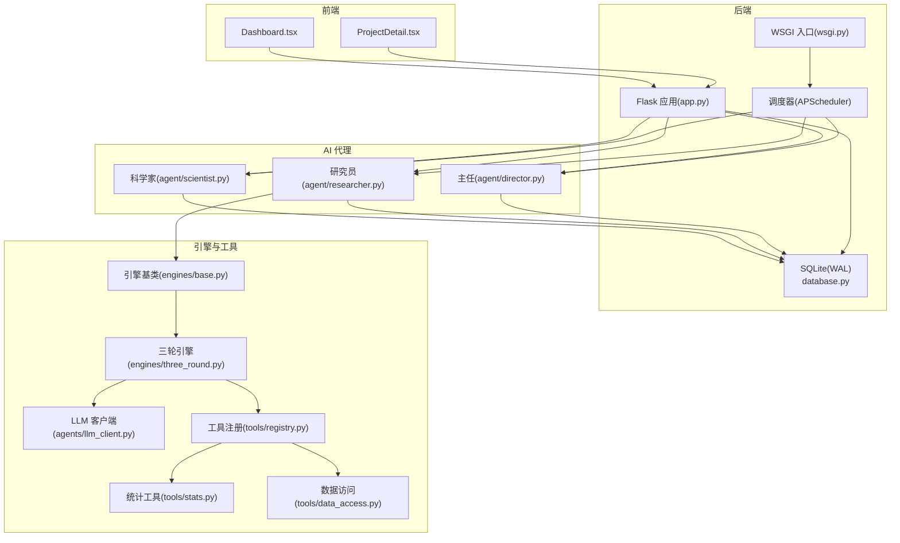
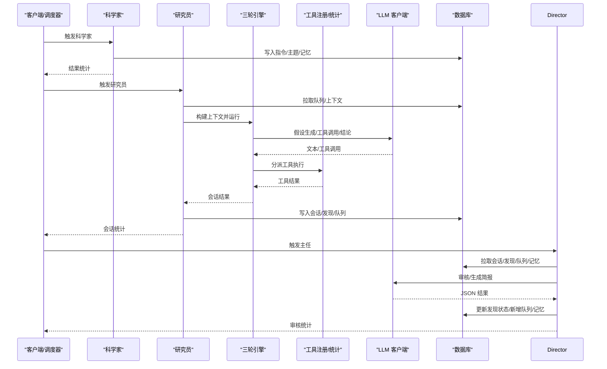
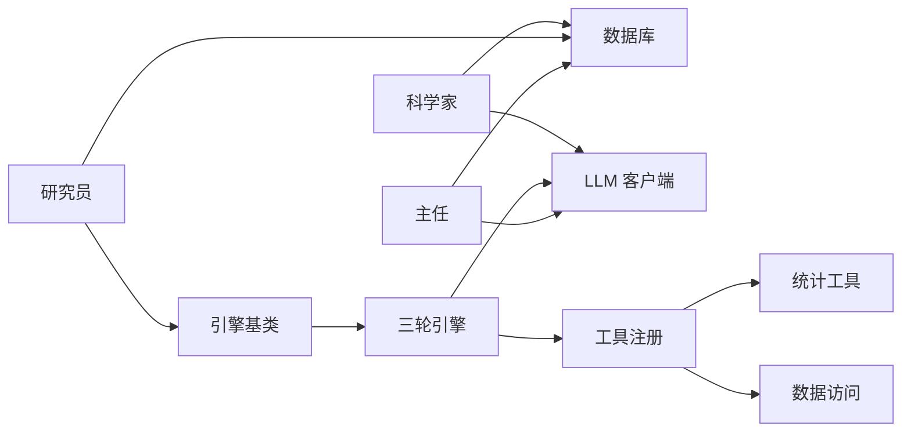

# 测试策略

<cite>
**本文引用的文件**
- [README.md](file://README.md)
- [docs/testing.md](file://docs/testing.md)
- [agents/llm_client.py](file://agents/llm_client.py)
- [tools/stats.py](file://tools/stats.py)
- [database.py](file://database.py)
- [engines/base.py](file://engines/base.py)
- [engines/three_round.py](file://engines/three_round.py)
- [agents/scientist.py](file://agents/scientist.py)
- [agents/researcher.py](file://agents/researcher.py)
- [agents/director.py](file://agents/director.py)
- [tools/registry.py](file://tools/registry.py)
- [tools/data_access.py](file://tools/data_access.py)
</cite>

## 目录
1. [引言](#引言)
2. [项目结构](#项目结构)
3. [核心组件](#核心组件)
4. [架构总览](#架构总览)
5. [详细组件分析](#详细组件分析)
6. [依赖分析](#依赖分析)
7. [性能考量](#性能考量)
8. [故障排查指南](#故障排查指南)
9. [结论](#结论)
10. [附录](#附录)

## 引言
本测试策略文档面向 AInstein 的测试体系与方法，覆盖单元测试、集成测试、端到端测试、API 测试与前端测试，并针对 AI 代理的特殊性（如 LLM 输出稳定性与结果验证）给出可操作的测试设计与执行建议。同时提供测试数据管理、持续集成与自动化测试配置思路、覆盖率与质量标准，以及测试环境搭建与执行步骤。

## 项目结构
AInstein 采用前后端分离与三层 AI 代理协作的架构：科学家负责战略与初始主题，研究员基于三轮引擎进行工具驱动的假设检验与验证，主任进行日常审核与记忆沉淀。数据层以 SQLite（WAL 模式）持久化，工具层提供统计与外部数据能力，LLM 客户端封装 DashScope/Anthropic 兼容接口。

图表来源
- [agents/scientist.py:14-75](file://agents/scientist.py#L14-L75)
- [agents/researcher.py:14-114](file://agents/researcher.py#L14-L114)
- [agents/director.py:14-124](file://agents/director.py#L14-L124)
- [engines/base.py:11-49](file://engines/base.py#L11-L49)
- [engines/three_round.py:22-179](file://engines/three_round.py#L22-L179)
- [agents/llm_client.py:24-114](file://agents/llm_client.py#L24-L114)
- [tools/registry.py:24-181](file://tools/registry.py#L24-L181)
- [tools/stats.py:10-120](file://tools/stats.py#L10-L120)
- [tools/data_access.py:10-43](file://tools/data_access.py#L10-L43)
- [database.py:101-344](file://database.py#L101-L344)
- [wsgi.py](file://wsgi.py)

章节来源
- [README.md:71-124](file://README.md#L71-L124)

## 核心组件
- LLM 客户端：封装 Anthropic 协议调用、工具调用与 JSON 提取，支持日志与异常上报。
- 统计工具：描述性统计、相关性、t 检验、回归、异常检测、分布拟合、分组统计。
- 数据访问：按项目目录加载 CSV/JSON/XLSX 等格式数据，构建 LLM 上下文摘要。
- 工具注册：将统计与外部数据工具映射为 LLM 可调用的工具定义。
- 引擎基类与三轮引擎：定义研究上下文与会话结果，实现“假设—检验—验证”的三轮流程。
- 代理：科学家生成指令与主题；研究员执行引擎并写回数据库；主任审核与沉淀记忆。
- 数据库：项目、指令、队列、会话、发现、记忆、数据集等表及索引。

章节来源
- [agents/llm_client.py:14-114](file://agents/llm_client.py#L14-L114)
- [tools/stats.py:10-120](file://tools/stats.py#L10-L120)
- [tools/data_access.py:10-43](file://tools/data_access.py#L10-L43)
- [tools/registry.py:24-181](file://tools/registry.py#L24-L181)
- [engines/base.py:11-49](file://engines/base.py#L11-L49)
- [engines/three_round.py:22-179](file://engines/three_round.py#L22-L179)
- [agents/scientist.py:14-75](file://agents/scientist.py#L14-L75)
- [agents/researcher.py:14-114](file://agents/researcher.py#L14-L114)
- [agents/director.py:14-124](file://agents/director.py#L14-L124)
- [database.py:101-344](file://database.py#L101-L344)

## 架构总览
以下序列图展示一次端到端工作流：科学家生成指令与主题，研究员执行三轮引擎并写回发现与后续方向，主任审核发现并沉淀记忆与简报。

图表来源
- [agents/scientist.py:14-75](file://agents/scientist.py#L14-L75)
- [agents/researcher.py:14-114](file://agents/researcher.py#L14-L114)
- [engines/three_round.py:28-179](file://engines/three_round.py#L28-L179)
- [tools/registry.py:24-181](file://tools/registry.py#L24-L181)
- [agents/llm_client.py:24-114](file://agents/llm_client.py#L24-L114)
- [database.py:127-344](file://database.py#L127-L344)

## 详细组件分析

### LLM 客户端测试策略
- 测试目标
  - 正常路径：系统提示 + 消息数组调用返回文本。
  - 工具调用路径：返回文本与工具调用列表，确保解析与日志记录。
  - JSON 提取：支持纯 JSON、Markdown Fence 包裹、混合文本中的 JSON，以及无效输入返回空。
  - 错误路径：捕获异常并上抛，便于上层统一处理。
- 测试用例设计要点
  - 使用最小化消息与系统提示，断言返回文本包含期望片段。
  - 构造包含工具调用的 LLM 响应，断言工具调用列表非空且字段完整。
  - 针对 extract_json：构造多种边界场景（空字符串、无 JSON、多段 JSON、非法 JSON）。
  - 依赖注入：在测试中替换真实客户端，避免网络调用。
- 覆盖度：建议至少 90% 的调用路径被覆盖，含异常分支。

章节来源
- [agents/llm_client.py:24-114](file://agents/llm_client.py#L24-L114)
- [docs/testing.md:199-231](file://docs/testing.md#L199-L231)

### 统计工具测试策略
- 测试目标
  - 描述性统计：返回统计矩阵、列名集合与行数。
  - 相关性：支持皮尔逊与斯皮尔曼，断言相关系数与显著性。
  - t 检验：断言均值、样本量与统计量。
  - 回归：断言截距、系数与 R²。
  - 异常检测：断言异常数量、比例与索引。
  - 分布拟合：断言正态性判断与偏度/峰度。
  - 分组统计：断言每组的计数、均值、方差与中位数。
- 边界与异常
  - 数据不足：断言返回错误信息而非崩溃。
  - 非数值列：断言被忽略或转换失败时的稳健行为。
- 覆盖度：建议对每个函数至少 3 个典型输入与 2 个边界输入。

章节来源
- [tools/stats.py:10-120](file://tools/stats.py#L10-L120)
- [docs/testing.md:22-148](file://docs/testing.md#L22-L148)

### 数据访问与工具注册测试策略
- 数据访问
  - 支持 CSV/JSON/JSONL/XLSX 加载，断言类型识别与异常抛出。
  - 构建数据集摘要用于 LLM 上下文，断言列名与类型拼接正确。
- 工具注册
  - 注册表包含统计工具与外部数据工具，断言工具名称、Schema 与分派逻辑。
  - 分派失败与未知工具返回错误对象，不中断流程。
- 覆盖度：建议覆盖所有已注册工具与文件类型分支。

章节来源
- [tools/data_access.py:10-43](file://tools/data_access.py#L10-L43)
- [tools/registry.py:24-181](file://tools/registry.py#L24-L181)
- [docs/testing.md:149-198](file://docs/testing.md#L149-L198)

### 三轮引擎测试策略
- 测试目标
  - 假设生成：断言输出 JSON 结构与假设数量。
  - 工具调用循环：断言最大轮次限制、工具调用与结果聚合。
  - 验证与总结：断言结论、发现、后续方向与数据摘要。
  - 异常路径：当 JSON 解析失败时，状态标记为部分完成。
- 输入准备
  - 构造最小化的 ResearchContext，包含项目、任务、指令与数据摘要。
  - 使用占位数据集与工具调用响应，避免真实 LLM 调用。
- 覆盖度：建议覆盖 R1/R2/R3 各阶段与异常分支。

章节来源
- [engines/base.py:11-49](file://engines/base.py#L11-L49)
- [engines/three_round.py:28-179](file://engines/three_round.py#L28-L179)
- [docs/testing.md:276-349](file://docs/testing.md#L276-L349)

### 科学家/研究员/主任代理测试策略
- 科学家
  - 断言生成指令数量、初始主题数量、类别与备注写入记忆。
  - 依赖数据库与 LLM 客户端，测试中替换为桩对象。
- 研究员
  - 断言会话创建、状态更新、发现写入、队列扩展与主题完成。
  - 引擎失败时断言会话与队列状态标记为失败。
- 主任
  - 断言发现审核（验证/拒绝）、新增队列主题、记忆条目与简报写入。
- 覆盖度：建议覆盖正常流程与关键异常路径。

章节来源
- [agents/scientist.py:14-75](file://agents/scientist.py#L14-L75)
- [agents/researcher.py:14-114](file://agents/researcher.py#L14-L114)
- [agents/director.py:14-124](file://agents/director.py#L14-L124)
- [docs/testing.md:234-349](file://docs/testing.md#L234-L349)

### 数据库 CRUD 测试策略
- 测试目标
  - 项目：创建、查询、统计。
  - 队列：添加、挑选、更新状态。
  - 会话：创建、更新、查询。
  - 发现：添加、查询、状态更新。
  - 记忆：添加、查询。
  - 数据集：添加、查询。
- 覆盖度：建议对每个表的关键字段与索引查询进行断言。

章节来源
- [database.py:127-344](file://database.py#L127-L344)
- [docs/testing.md:150-198](file://docs/testing.md#L150-L198)

### API 测试策略
- 健康检查、项目、队列、会话、发现、数据集、科学家/主任触发等端点。
- 断言响应码、JSON 结构与关键字段。
- 建议使用 curl 或自动化脚本批量验证。

章节来源
- [docs/testing.md:415-522](file://docs/testing.md#L415-L522)

### 前端测试策略
- 页面加载与全局统计、项目卡片、弹窗与跳转。
- 详情页标签切换、列表与筛选、表单提交、按钮交互。
- 建议结合 E2E 测试框架（如 Playwright/Cypress）与 Jest/Vitest。

章节来源
- [docs/testing.md:523-548](file://docs/testing.md#L523-L548)

## 依赖分析
- 组件耦合
  - 代理依赖数据库与 LLM 客户端；引擎依赖工具注册与数据访问；工具依赖 Pandas/NumPy/SciPy。
- 外部依赖
  - LLM API（DashScope/Anthropic 兼容）、SQLite、APScheduler。
- 潜在环路
  - 代理与引擎通过上下文解耦，避免直接循环依赖。
- 接口契约
  - 引擎基类定义统一的 run 接口；工具注册提供统一分派与 Schema。

图表来源
- [agents/scientist.py:14-75](file://agents/scientist.py#L14-L75)
- [agents/researcher.py:14-114](file://agents/researcher.py#L14-L114)
- [agents/director.py:14-124](file://agents/director.py#L14-L124)
- [engines/base.py:38-49](file://engines/base.py#L38-L49)
- [engines/three_round.py:22-179](file://engines/three_round.py#L22-L179)
- [tools/registry.py:24-181](file://tools/registry.py#L24-L181)
- [tools/stats.py:10-120](file://tools/stats.py#L10-L120)
- [tools/data_access.py:10-43](file://tools/data_access.py#L10-L43)
- [database.py:127-344](file://database.py#L127-L344)
- [agents/llm_client.py:24-114](file://agents/llm_client.py#L24-L114)

## 性能考量
- API 响应时间：建议 < 100ms。
- LLM 调用时间：三轮引擎单会话约 60–120s，需考虑并发与超时。
- 数据库查询：建议 < 20ms，注意索引命中与事务提交。
- 前端交互：建议增加加载态与错误提示，提升用户体验。

章节来源
- [docs/testing.md:549-584](file://docs/testing.md#L549-L584)

## 故障排查指南
- LLM 调用失败：检查 API Key、Base URL 与网络连通；查看日志中的错误堆栈。
- JSON 解析失败：确认 LLM 输出是否包含 JSON，必要时调整提示词与温度。
- 工具调用异常：检查工具名称与参数 Schema，确认数据集存在与格式正确。
- 数据库锁/并发：确认 WAL 模式与事务提交/回滚逻辑。
- 调度器竞争：参考已修复的锁竞争问题，避免截断导致的锁失效。

章节来源
- [docs/testing.md:586-600](file://docs/testing.md#L586-L600)
- [agents/llm_client.py:24-114](file://agents/llm_client.py#L24-L114)
- [tools/registry.py:24-181](file://tools/registry.py#L24-L181)
- [database.py:101-123](file://database.py#L101-L123)
- [wsgi.py](file://wsgi.py)

## 结论
AInstein 的测试体系以“单元—集成—端到端—API—前端”五层覆盖为主，重点围绕 LLM 输出稳定性与工具链可靠性。建议在 CI 中引入自动化测试与覆盖率报告，逐步提升前端 UX 与监控告警能力，保障上线质量与持续演进。

## 附录

### 测试数据管理方案
- 生成
  - 使用固定种子的随机数据生成器，确保可重复性。
  - 针对统计工具构造不同分布的数据集（正态、偏态、异常值）。
- 维护
  - 将测试数据置于独立目录，按功能模块划分子目录。
  - 为外部数据工具准备模拟服务或缓存响应。
- 清理
  - 在测试前/后执行数据库初始化与目录清理脚本。
  - 使用临时目录隔离每次测试的中间产物。

### 持续集成与自动化测试配置
- 触发条件
  - Push 与 Pull Request 触发流水线。
- 步骤建议
  - 安装依赖（Python/Node）。
  - 启动 SQLite 与 LLM Mock 服务。
  - 运行单元/集成/API/前端测试套件。
  - 生成覆盖率报告与测试结果归档。
- 质量门禁
  - 覆盖率阈值：建议单元测试覆盖率 ≥ 80%，整体 ≥ 70%。
  - 失败即停，失败用例截图/日志归档。

### 测试覆盖率与质量标准
- 覆盖率
  - 单元测试：工具函数 + DB CRUD + LLM 客户端。
  - 集成测试：科学家/研究员/主任流程。
  - 端到端测试：完整工作流。
  - API 测试：全部端点。
  - 前端测试：页面与交互。
- 质量评估
  - 功能完整性：≥ 95%。
  - 性能：API < 100ms，LLM 60–120s，DB < 20ms。
  - 稳定性：连续多次 E2E 测试通过。
  - 数据质量：产出符合预期，简报内容准确。

章节来源
- [docs/testing.md:601-628](file://docs/testing.md#L601-L628)

### 测试环境搭建与执行步骤
- 后端
  - 创建虚拟环境，安装依赖（Flask/Gunicorn/anthropic/APScheduler/pandas/scipy/numpy）。
  - 配置 .env（API Key、数据库路径、模型配置）。
  - 初始化数据库。
  - 启动开发服务器或生产服务器（Gunicorn）。
- 前端
  - 安装 Node.js 依赖，启动 Vite 开发服务器。
- 执行测试
  - 单元/集成/API/前端分别运行对应测试套件。
  - 端到端测试可通过 SSH 远程执行或本地脚本组合。

章节来源
- [README.md:17-69](file://README.md#L17-L69)
- [docs/testing.md:350-414](file://docs/testing.md#L350-L414)