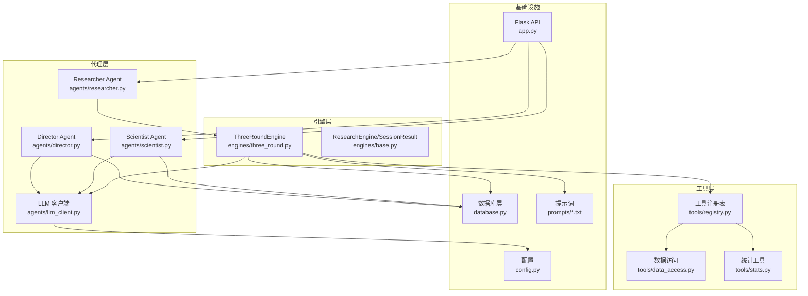
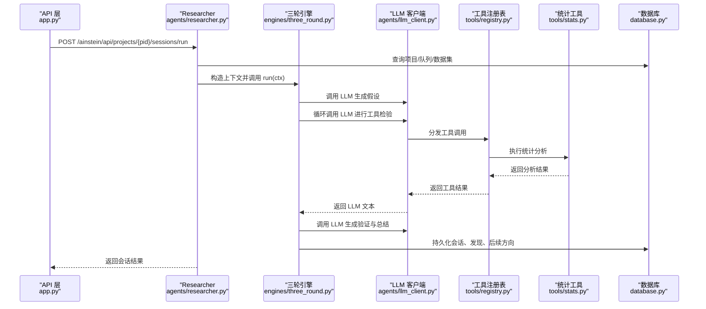
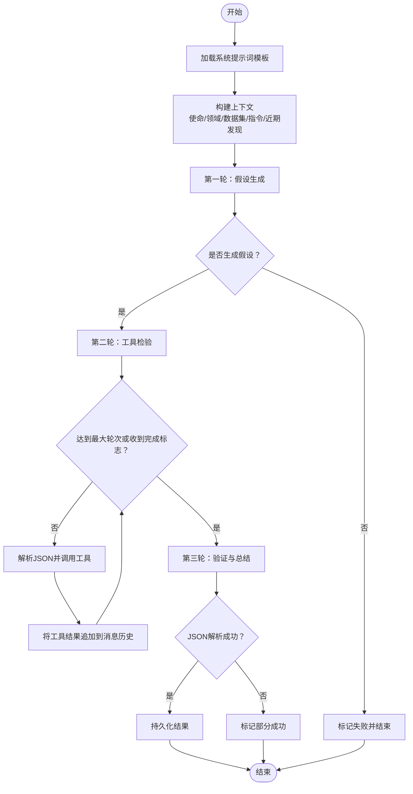
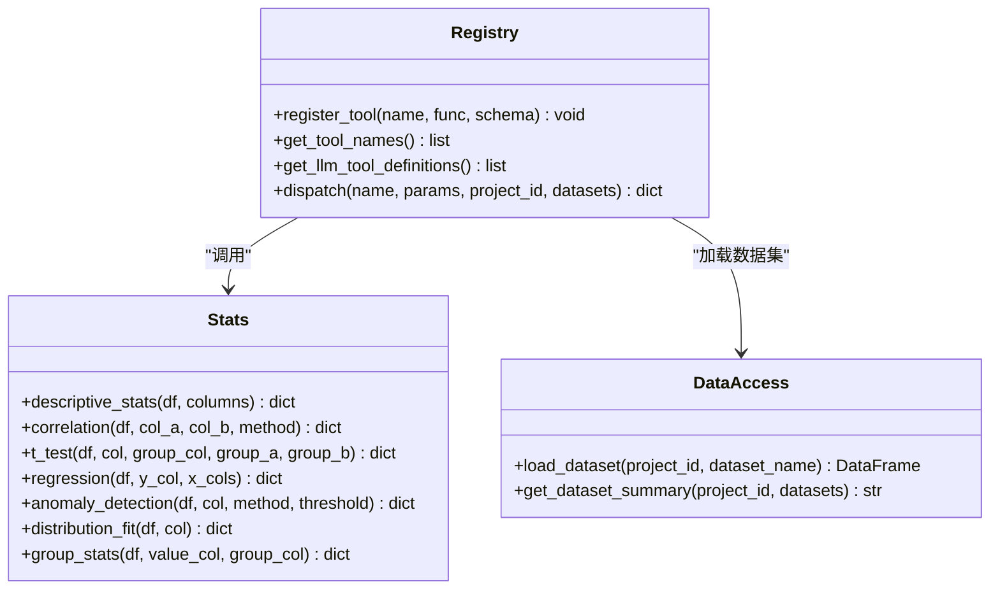
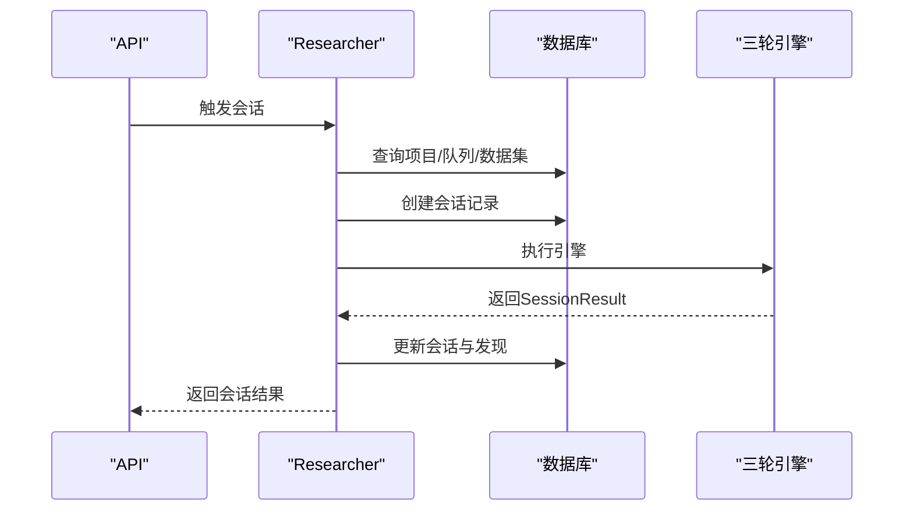
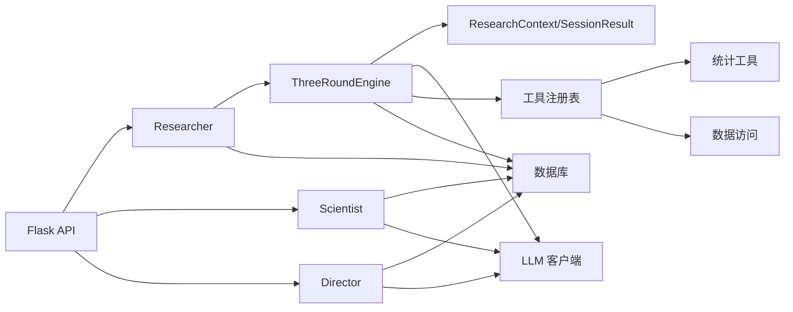

# 三轮研究流程引擎

<cite>
**本文档引用的文件**
- [engines/three_round.py](file://engines/three_round.py)
- [engines/base.py](file://engines/base.py)
- [agents/researcher.py](file://agents/researcher.py)
- [agents/director.py](file://agents/director.py)
- [agents/scientist.py](file://agents/scientist.py)
- [agents/llm_client.py](file://agents/llm_client.py)
- [tools/registry.py](file://tools/registry.py)
- [tools/data_access.py](file://tools/data_access.py)
- [tools/stats.py](file://tools/stats.py)
- [config.py](file://config.py)
- [database.py](file://database.py)
- [prompts/three_round.txt](file://prompts/three_round.txt)
- [prompts/director.txt](file://prompts/director.txt)
- [prompts/scientist.txt](file://prompts/scientist.txt)
- [app.py](file://app.py)
</cite>

## 目录
1. [简介](#简介)
2. [项目结构](#项目结构)
3. [核心组件](#核心组件)
4. [架构总览](#架构总览)
5. [详细组件分析](#详细组件分析)
6. [依赖关系分析](#依赖关系分析)
7. [性能考量](#性能考量)
8. [故障排除指南](#故障排除指南)
9. [结论](#结论)
10. [附录](#附录)

## 简介
本文件面向开发者与研究运营人员，系统化阐述“三轮研究流程引擎”的设计与实现，覆盖从假设生成、工具检验到验证总结的完整闭环。文档深入解析各阶段任务分配、数据流转与结果处理机制，给出流程控制、错误处理与异常恢复策略，并提供配置参数、性能调优与资源管理的最佳实践。同时包含使用示例、调试技巧与故障排除指南，帮助读者快速理解并定制三轮研究流程。

## 项目结构
该工程采用分层与功能模块化组织方式：
- 引擎层：定义统一接口与三轮引擎实现
- 代理层：封装研究、科学家、主任等角色的编排逻辑
- 工具层：注册与调度统计与网络检索类工具
- 数据访问层：提供数据集加载与摘要构建
- 配置与数据库：集中式配置与SQLite持久化
- 提示词：为不同角色与阶段提供系统提示
- 前端与API：Flask服务暴露REST接口与静态页面

图表来源
- [engines/three_round.py:1-179](file://engines/three_round.py#L1-L179)
- [engines/base.py:1-49](file://engines/base.py#L1-L49)
- [agents/researcher.py:1-114](file://agents/researcher.py#L1-L114)
- [agents/scientist.py:1-75](file://agents/scientist.py#L1-L75)
- [agents/director.py:1-124](file://agents/director.py#L1-L124)
- [agents/llm_client.py:1-114](file://agents/llm_client.py#L1-L114)
- [tools/registry.py:1-181](file://tools/registry.py#L1-L181)
- [tools/data_access.py:1-43](file://tools/data_access.py#L1-L43)
- [tools/stats.py:1-120](file://tools/stats.py#L1-L120)
- [config.py:1-11](file://config.py#L1-L11)
- [database.py:1-344](file://database.py#L1-L344)
- [prompts/three_round.txt:1-15](file://prompts/three_round.txt#L1-L15)
- [prompts/director.txt:1-43](file://prompts/director.txt#L1-L43)
- [prompts/scientist.txt:1-32](file://prompts/scientist.txt#L1-L32)
- [app.py:1-182](file://app.py#L1-L182)

章节来源
- [engines/three_round.py:1-179](file://engines/three_round.py#L1-L179)
- [engines/base.py:1-49](file://engines/base.py#L1-L49)
- [agents/researcher.py:1-114](file://agents/researcher.py#L1-L114)
- [agents/scientist.py:1-75](file://agents/scientist.py#L1-L75)
- [agents/director.py:1-124](file://agents/director.py#L1-L124)
- [agents/llm_client.py:1-114](file://agents/llm_client.py#L1-L114)
- [tools/registry.py:1-181](file://tools/registry.py#L1-L181)
- [tools/data_access.py:1-43](file://tools/data_access.py#L1-L43)
- [tools/stats.py:1-120](file://tools/stats.py#L1-L120)
- [config.py:1-11](file://config.py#L1-L11)
- [database.py:1-344](file://database.py#L1-L344)
- [prompts/three_round.txt:1-15](file://prompts/three_round.txt#L1-L15)
- [prompts/director.txt:1-43](file://prompts/director.txt#L1-L43)
- [prompts/scientist.txt:1-32](file://prompts/scientist.txt#L1-L32)
- [app.py:1-182](file://app.py#L1-L182)

## 核心组件
- 统一上下文与结果模型
  - ResearchContext：承载项目信息、主题、数据集摘要、近期发现与指令等
  - SessionResult：标准化返回结构，包含状态、假设、验证过程、发现、后续方向与耗时
- 三轮引擎 ThreeRoundEngine
  - 负责按阶段组织与编排：假设生成、工具检验、验证总结
  - 使用系统提示词模板与LLM交互，结合工具注册表进行数据驱动的假设检验
- 代理层
  - Researcher：选择主题、构造上下文、调用引擎、持久化结果
  - Scientist：生成战略指令与初始主题，沉淀策略记忆
  - Director：每日复盘，评审发现、调整队列、积累记忆、生成简报
- 工具层
  - 注册表：集中管理工具函数与Schema，支持动态分发与参数校验
  - 统计工具：描述性统计、相关性、t检验、回归、异常检测、分布拟合、分组统计
  - 数据访问：根据项目ID与文件名加载数据集，构建摘要文本
- LLM客户端
  - 封装DashScope/Anthropic兼容接口，提供JSON提取与工具调用能力
- 数据库层
  - SQLite建模研究项目、队列、会话、发现、指令与记忆，提供增删改查与统计接口
- 配置与提示词
  - 集中配置模型与API参数，提示词模板驱动角色行为

章节来源
- [engines/base.py:11-49](file://engines/base.py#L11-L49)
- [engines/three_round.py:22-179](file://engines/three_round.py#L22-L179)
- [agents/researcher.py:14-114](file://agents/researcher.py#L14-L114)
- [agents/scientist.py:14-75](file://agents/scientist.py#L14-L75)
- [agents/director.py:14-124](file://agents/director.py#L14-L124)
- [tools/registry.py:24-43](file://tools/registry.py#L24-L43)
- [tools/stats.py:10-120](file://tools/stats.py#L10-L120)
- [tools/data_access.py:10-43](file://tools/data_access.py#L10-L43)
- [agents/llm_client.py:24-114](file://agents/llm_client.py#L24-L114)
- [database.py:101-344](file://database.py#L101-L344)
- [config.py:1-11](file://config.py#L1-11)
- [prompts/three_round.txt:1-15](file://prompts/three_round.txt#L1-L15)
- [prompts/director.txt:1-43](file://prompts/director.txt#L1-L43)
- [prompts/scientist.txt:1-32](file://prompts/scientist.txt#L1-L32)

## 架构总览
三轮引擎通过“研究者”触发单次会话，依次进入三轮流程：假设生成、工具检验、验证总结。每一轮均以系统提示词与消息历史驱动LLM，结合工具注册表与数据访问层完成数据驱动的实证检验。最终将结果持久化至数据库，并由“科学家”与“主任”分别承担战略规划与日常治理。

图表来源
- [app.py:95-104](file://app.py#L95-L104)
- [agents/researcher.py:14-114](file://agents/researcher.py#L14-L114)
- [engines/three_round.py:28-179](file://engines/three_round.py#L28-L179)
- [agents/llm_client.py:24-114](file://agents/llm_client.py#L24-L114)
- [tools/registry.py:24-43](file://tools/registry.py#L24-L43)
- [tools/stats.py:10-120](file://tools/stats.py#L10-L120)
- [database.py:232-295](file://database.py#L232-L295)

## 详细组件分析

### 三轮引擎：假设生成 → 工具检验 → 验证总结
- 假设生成（Round 1）
  - 加载系统提示词模板，拼接使命、领域、数据集摘要与可用工具列表
  - 构造用户消息，要求生成2-4个可检验假设，返回JSON结构
  - 解析LLM输出为假设列表，若无假设则终止并标记失败
- 工具检验（Round 2）
  - 在系统提示词中强调“每次回复仅输出一个纯JSON对象”，并列出可用工具与数据集
  - 初始消息引导先运行描述性统计以了解数据
  - 循环执行：LLM输出JSON（包含工具调用或完成标志），引擎解析后调用工具注册表，将工具结果追加到消息历史
  - 设定最大轮次上限，避免无限循环；支持非JSON文本作为中间摘要
- 验证总结（Round 3）
  - 输入原始假设与测试结果，要求生成每个假设的判定（支持/反驳/不确定）、关键发现、建议方向与数据摘要
  - 解析JSON结构，若解析失败则标记部分成功
  - 合并测试结果与判定，形成最终验证字段

图表来源
- [engines/three_round.py:28-179](file://engines/three_round.py#L28-L179)
- [prompts/three_round.txt:1-15](file://prompts/three_round.txt#L1-L15)

章节来源
- [engines/three_round.py:28-179](file://engines/three_round.py#L28-L179)
- [prompts/three_round.txt:1-15](file://prompts/three_round.txt#L1-L15)

### 工具注册表与统计工具
- 工具注册表
  - 维护工具名称到实现与Schema的映射，提供工具名列表与LLM工具定义
  - 分发器根据工具类型自动加载数据集并执行分析，异常时返回错误信息
- 统计工具
  - 描述性统计、相关性（皮尔逊/斯皮尔曼）、独立样本t检验、多元线性回归、异常检测（Z-score/IQR）、分布拟合（Shapiro-Wilk）、分组统计
  - 对输入数据进行类型转换与缺失值处理，保证稳健性

图表来源
- [tools/registry.py:24-43](file://tools/registry.py#L24-L43)
- [tools/stats.py:10-120](file://tools/stats.py#L10-L120)
- [tools/data_access.py:10-43](file://tools/data_access.py#L10-L43)

章节来源
- [tools/registry.py:24-43](file://tools/registry.py#L24-L43)
- [tools/stats.py:10-120](file://tools/stats.py#L10-L120)
- [tools/data_access.py:10-43](file://tools/data_access.py#L10-L43)

### 研究者代理：主题选择、会话执行与结果持久化
- 主题选择：优先使用传入topic，否则从队列中挑选下一个待处理主题
- 上下文构建：聚合项目配置、使命、领域、数据集摘要、近期发现与指令
- 会话执行：创建会话记录，调用引擎，回写状态与结果
- 结果落地：将发现与后续方向写入数据库，并更新队列项状态

图表来源
- [agents/researcher.py:14-114](file://agents/researcher.py#L14-L114)
- [database.py:232-295](file://database.py#L232-L295)

章节来源
- [agents/researcher.py:14-114](file://agents/researcher.py#L14-L114)
- [database.py:232-295](file://database.py#L232-L295)

### 科学家代理：战略指令与初始主题
- 读取项目使命与领域，结合数据集摘要生成战略指令与初始研究主题
- 将指令与主题写入数据库，并记录策略记忆

章节来源
- [agents/scientist.py:14-75](file://agents/scientist.py#L14-L75)
- [prompts/scientist.txt:1-32](file://prompts/scientist.txt#L1-L32)

### 主任代理：每日复盘与治理
- 汇总最近会话、开放发现、队列与记忆，进行发现评审、队列调整、新增主题与记忆积累
- 生成简报并写入记忆

章节来源
- [agents/director.py:14-124](file://agents/director.py#L14-L124)
- [prompts/director.txt:1-43](file://prompts/director.txt#L1-L43)

### LLM客户端与提示词
- LLM客户端封装DashScope/Anthropic兼容接口，支持普通对话与工具调用两种模式
- JSON提取器具备鲁棒性，可从混合文本中抽取JSON块
- 提示词模板驱动角色行为，约束输出格式与语言风格

章节来源
- [agents/llm_client.py:24-114](file://agents/llm_client.py#L24-L114)
- [prompts/three_round.txt:1-15](file://prompts/three_round.txt#L1-L15)
- [prompts/director.txt:1-43](file://prompts/director.txt#L1-L43)
- [prompts/scientist.txt:1-32](file://prompts/scientist.txt#L1-L32)

## 依赖关系分析
- 引擎依赖
  - 引擎依赖基础上下文与结果模型、LLM客户端、工具注册表与数据访问层
  - 通过提示词模板注入领域知识与约束
- 代理依赖
  - 研究者依赖引擎与数据库；科学家/主任依赖数据库与LLM客户端
- 工具依赖
  - 统计工具依赖pandas/numpy/scipy；数据访问依赖pandas与文件系统
- 外部依赖
  - LLM服务（DashScope/Anthropic兼容）与SQLite

图表来源
- [engines/three_round.py:6-9](file://engines/three_round.py#L6-L9)
- [engines/base.py:11-49](file://engines/base.py#L11-L49)
- [agents/researcher.py:5-7](file://agents/researcher.py#L5-L7)
- [agents/scientist.py:6-7](file://agents/scientist.py#L6-L7)
- [agents/director.py:6-7](file://agents/director.py#L6-L7)
- [tools/registry.py:3-5](file://tools/registry.py#L3-L5)
- [tools/stats.py:3-5](file://tools/stats.py#L3-L5)
- [tools/data_access.py:4](file://tools/data_access.py#L4)
- [database.py:101-123](file://database.py#L101-L123)
- [app.py:95-104](file://app.py#L95-L104)

章节来源
- [engines/three_round.py:6-9](file://engines/three_round.py#L6-L9)
- [engines/base.py:11-49](file://engines/base.py#L11-L49)
- [agents/researcher.py:5-7](file://agents/researcher.py#L5-L7)
- [agents/scientist.py:6-7](file://agents/scientist.py#L6-L7)
- [agents/director.py:6-7](file://agents/director.py#L6-L7)
- [tools/registry.py:3-5](file://tools/registry.py#L3-L5)
- [tools/stats.py:3-5](file://tools/stats.py#L3-L5)
- [tools/data_access.py:4](file://tools/data_access.py#L4)
- [database.py:101-123](file://database.py#L101-L123)
- [app.py:95-104](file://app.py#L95-L104)

## 性能考量
- LLM调用优化
  - 合理设置温度与最大token，平衡创造性与稳定性
  - 在工具检验阶段降低温度以提升推理一致性
- 工具调用节流
  - 设置最大轮次上限，避免长链路阻塞
  - 对工具结果进行截断与摘要，减少消息长度
- 数据访问优化
  - 仅加载必要列，避免全表扫描
  - 缓存数据集摘要，减少重复构建
- 数据库事务
  - 使用上下文管理器确保事务提交/回滚
  - WAL模式与外键开启提升并发与一致性
- 并发与异步
  - API层使用线程池异步启动会话，避免阻塞请求

章节来源
- [engines/three_round.py:103-135](file://engines/three_round.py#L103-L135)
- [tools/data_access.py:27-42](file://tools/data_access.py#L27-L42)
- [database.py:113-122](file://database.py#L113-L122)
- [app.py:97-104](file://app.py#L97-L104)

## 故障排除指南
- LLM解析失败
  - 现象：Round 3解析JSON失败，标记为部分成功
  - 排查：检查提示词约束与输出格式；确认工具返回结构符合预期
- 工具调用异常
  - 现象：工具返回错误信息或抛出异常
  - 排查：确认数据集存在、列名正确、样本量充足；查看工具内部错误日志
- 数据集加载失败
  - 现象：找不到文件或不支持的文件类型
  - 排查：确认项目目录与文件路径；检查文件扩展名与格式
- 会话状态异常
  - 现象：会话未完成或状态不一致
  - 排查：检查数据库更新逻辑与异常捕获；核对队列项状态变更
- API调用超时
  - 现象：异步启动后无响应
  - 排查：检查线程池与守护线程设置；查看后端日志

章节来源
- [engines/three_round.py:172-175](file://engines/three_round.py#L172-L175)
- [tools/registry.py:40-42](file://tools/registry.py#L40-L42)
- [tools/data_access.py:14-24](file://tools/data_access.py#L14-L24)
- [database.py:240-248](file://database.py#L240-L248)
- [app.py:97-104](file://app.py#L97-L104)

## 结论
三轮研究流程引擎以明确的阶段划分与严格的工具驱动实证方法为核心，结合科学家的战略规划与主任的日常治理，形成从“生成—检验—总结”到“沉淀—评审—迭代”的闭环。通过统一的上下文模型、健壮的JSON解析与工具分发机制，以及完善的数据库持久化与API接口，该引擎既满足研究自动化需求，又便于扩展与定制。

## 附录

### 使用示例
- 初始化项目与数据集
  - 通过API创建项目与上传数据集，系统自动解析Schema并入库
- 启动科学家与主任
  - 生成战略指令与初始主题；执行每日复盘与队列治理
- 运行单次研究会话
  - 通过API触发会话，后台异步执行三轮流程，结果自动落库

章节来源
- [app.py:54-58](file://app.py#L54-L58)
- [app.py:123-152](file://app.py#L123-L152)
- [app.py:161-165](file://app.py#L161-L165)
- [app.py:172-176](file://app.py#L172-L176)
- [app.py:95-104](file://app.py#L95-L104)

### 调试技巧
- 开启详细日志：关注LLM调用的token用量与工具调用次数
- 检查消息历史：在工具检验阶段打印assistant与user消息，定位解析失败点
- 验证工具返回：对关键工具输出进行单元测试，确保字段完整性
- 核对数据库状态：查询会话、发现与队列状态，确认流程节点一致性

章节来源
- [agents/llm_client.py:40-44](file://agents/llm_client.py#L40-L44)
- [engines/three_round.py:125-134](file://engines/three_round.py#L125-L134)
- [database.py:232-295](file://database.py#L232-L295)

### 引擎配置参数与最佳实践
- 模型与API
  - RESEARCH_MODEL、SCIENTIST_MODEL、DIRECTOR_MODEL：指定不同角色使用的模型
  - DASHSCOPE_API_KEY、DASHSCOPE_BASE_URL：LLM服务凭证与地址
- 数据与存储
  - DATA_DIR：数据集根目录
  - DB_PATH：SQLite数据库路径
- 三轮引擎参数
  - 温度与最大token：在假设生成阶段提高创造性，在工具检验阶段降低温度
  - 最大工具轮次：根据数据规模与工具复杂度设定上限
- 工具参数
  - 相关性检验：优先使用稳健方法（如Spearman）
  - 异常检测：根据数据分布选择Z-score或IQR
  - 回归分析：注意多重共线性与样本量要求

章节来源
- [config.py:4-11](file://config.py#L4-L11)
- [engines/three_round.py:66-67](file://engines/three_round.py#L66-L67)
- [engines/three_round.py:106-107](file://engines/three_round.py#L106-L107)
- [tools/stats.py:26-32](file://tools/stats.py#L26-L32)
- [tools/stats.py:76-90](file://tools/stats.py#L76-L90)
- [tools/stats.py:58-68](file://tools/stats.py#L58-L68)