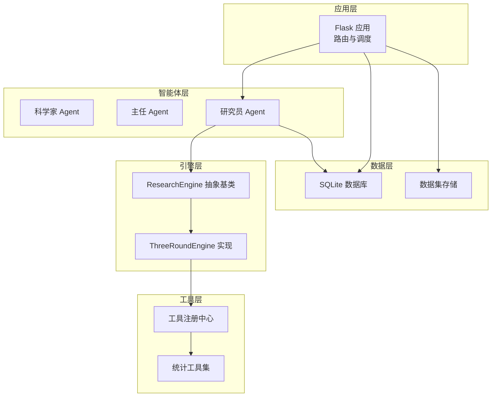
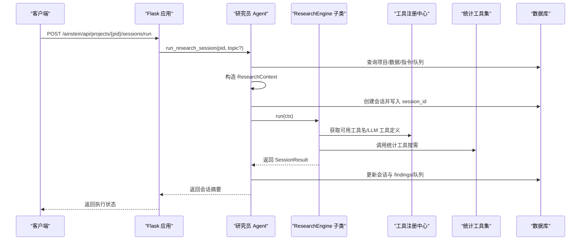
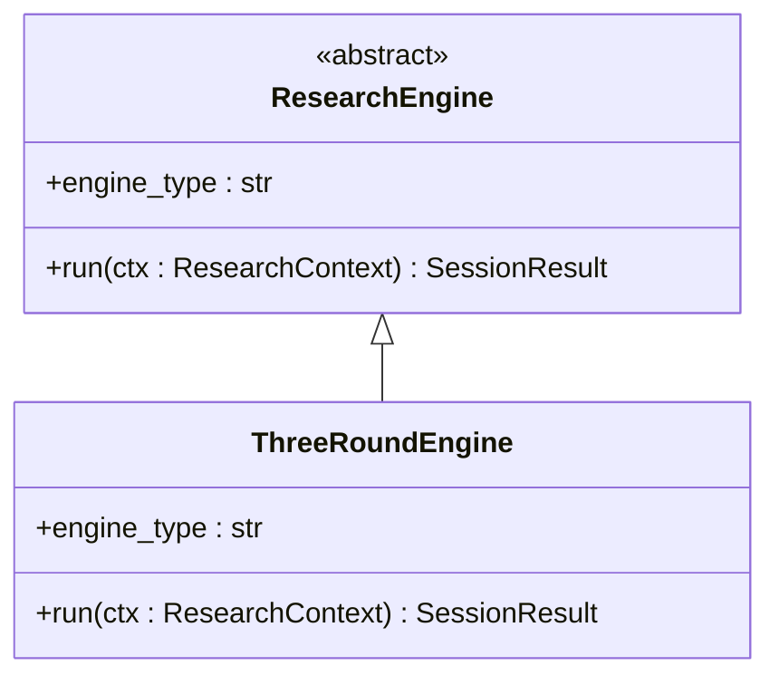
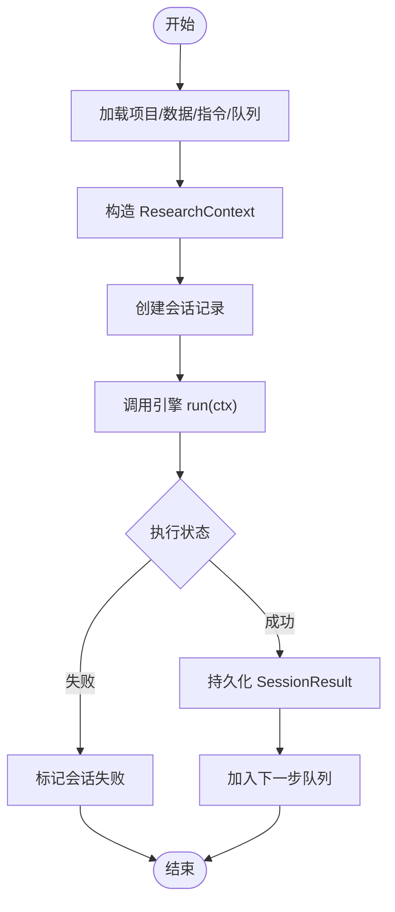
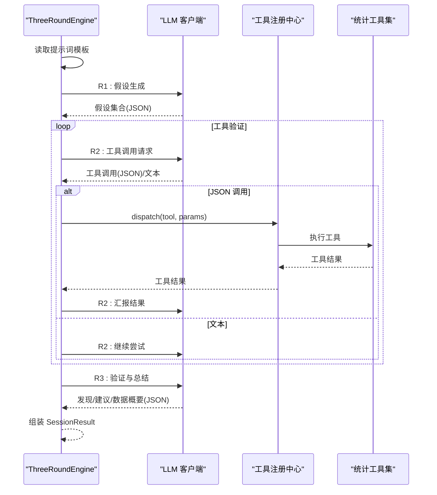
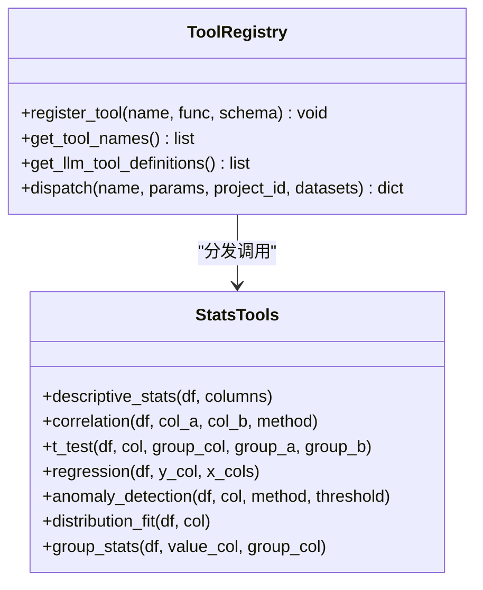
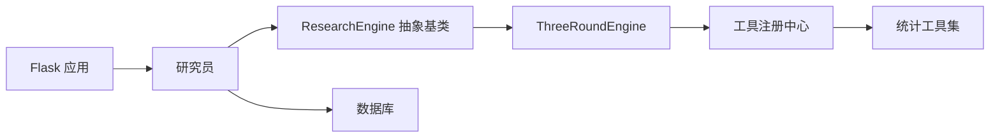

# 引擎抽象设计

<cite>
**本文档引用的文件**
- [engines/base.py](file://engines/base.py)
- [engines/three_round.py](file://engines/three_round.py)
- [agents/researcher.py](file://agents/researcher.py)
- [tools/registry.py](file://tools/registry.py)
- [tools/stats.py](file://tools/stats.py)
- [database.py](file://database.py)
- [app.py](file://app.py)
- [config.py](file://config.py)
- [prompts/three_round.txt](file://prompts/three_round.txt)
- [README.md](file://README.md)
</cite>

## 目录
1. [简介](#简介)
2. [项目结构](#项目结构)
3. [核心组件](#核心组件)
4. [架构总览](#架构总览)
5. [详细组件分析](#详细组件分析)
6. [依赖关系分析](#依赖关系分析)
7. [性能考量](#性能考量)
8. [故障排查指南](#故障排查指南)
9. [结论](#结论)
10. [附录](#附录)

## 简介
本文件聚焦于引擎抽象设计，系统化阐述 ResearchEngine 抽象基类的设计理念与架构原理，详解 ResearchContext 上下文数据结构与 SessionResult 结果数据结构的职责与字段语义，梳理引擎类型标识、会话管理与结果返回的标准流程，并给出继承指南与扩展方法，帮助开发者快速实现自定义引擎类，同时提供最佳实践建议与可视化图示，便于不同技术背景的读者理解与落地。

## 项目结构
该系统采用“三层 AI 团队 + 三轮研究引擎”的分层架构：科学家负责战略规划，主任负责质量审核与知识沉淀，研究员负责执行具体研究任务；引擎作为可插拔的研究执行器，通过统一的抽象接口与上下文/结果协议，实现灵活扩展与复用。

图表来源
- [app.py:1-182](file://app.py#L1-L182)
- [agents/researcher.py:1-114](file://agents/researcher.py#L1-L114)
- [engines/base.py:38-49](file://engines/base.py#L38-L49)
- [engines/three_round.py:22-179](file://engines/three_round.py#L22-L179)
- [tools/registry.py:1-181](file://tools/registry.py#L1-L181)
- [tools/stats.py:1-120](file://tools/stats.py#L1-L120)
- [database.py:1-344](file://database.py#L1-L344)

章节来源
- [README.md:71-124](file://README.md#L71-L124)
- [app.py:1-182](file://app.py#L1-L182)
- [database.py:100-123](file://database.py#L100-L123)

## 核心组件
本节从抽象到实现，系统讲解引擎抽象设计的关键构件。

- ResearchEngine 抽象基类
  - 角色定位：定义引擎的统一接口契约，约束子类必须实现的属性与方法，确保不同引擎在调用方式与返回格式上保持一致。
  - 关键要素：
    - 引擎类型标识：engine_type 属性用于标识具体引擎类型，便于会话记录与调度。
    - 执行入口：run(ctx: ResearchContext) -> SessionResult，接收上下文并返回标准化结果。
  - 设计意义：通过抽象基类隔离调用方与实现细节，支持多引擎并存与动态切换。

- ResearchContext 上下文数据结构
  - 作用：承载单次研究会话所需的全部输入信息，贯穿引擎执行全过程。
  - 字段语义：
    - project_id：所属项目 ID，用于会话与数据关联。
    - mission：项目使命，指导研究方向与语言风格。
    - domain：研究领域，限定专业术语与范式。
    - topic：当前研究主题。
    - config：项目配置字典，支持动态策略注入。
    - datasets_summary：数据集摘要，供引擎选择合适工具与分析路径。
    - recent_findings：历史发现列表，用于迭代增强与上下文记忆。
    - directives：研究指令（优先级），用于约束研究重点与范围。
    - session_id/queue_id：会话与队列项 ID，便于持久化与追踪。

- SessionResult 结果数据结构
  - 作用：标准化引擎执行后的输出，便于上层统一处理与持久化。
  - 字段语义：
    - status：会话状态（如 completed/partial/failed），反映执行完整性。
    - hypotheses：假设集合（JSON 字符串），供后续验证阶段使用。
    - verification：验证过程与结果（JSON 字符串），包含工具调用与证据链。
    - findings：关键发现列表，包含类别、置信度、证据与可操作性等。
    - next_directions：建议的下一步研究方向，形成闭环反馈。
    - data_summary：数据概要，提炼数据特征与趋势。
    - duration_seconds：本次会话耗时，用于性能监控与优化。

章节来源
- [engines/base.py:11-49](file://engines/base.py#L11-L49)

## 架构总览
引擎抽象设计贯穿“智能体编排—引擎执行—工具调用—结果持久化”的完整链路。下图展示从 API 请求到会话完成的端到端流程。

图表来源
- [app.py:95-104](file://app.py#L95-L104)
- [agents/researcher.py:14-114](file://agents/researcher.py#L14-L114)
- [engines/three_round.py:28-179](file://engines/three_round.py#L28-L179)
- [tools/registry.py:24-43](file://tools/registry.py#L24-L43)
- [tools/stats.py:10-120](file://tools/stats.py#L10-L120)
- [database.py:232-262](file://database.py#L232-L262)

## 详细组件分析

### ResearchEngine 抽象基类
- 设计要点
  - 使用 ABC 抽象基类确保子类必须实现 engine_type 与 run 方法。
  - 通过 dataclass 定义上下文与结果的数据结构，保证字段一致性与序列化便利性。
  - 日志记录贯穿执行过程，便于问题定位与审计。

图表来源
- [engines/base.py:38-49](file://engines/base.py#L38-L49)
- [engines/three_round.py:22-27](file://engines/three_round.py#L22-L27)

章节来源
- [engines/base.py:38-49](file://engines/base.py#L38-L49)

### ResearchContext 上下文数据结构
- 字段设计原则
  - 以“项目—主题—上下文”为主线，确保引擎在不同阶段能获得所需信息。
  - 支持可选字段（如 session_id/queue_id），便于非会话场景复用。
- 使用场景
  - 会话初始化：研究员根据项目配置与数据集摘要构造上下文。
  - 引擎执行：引擎基于上下文决定提示词、工具选择与分析策略。

章节来源
- [engines/base.py:11-24](file://engines/base.py#L11-L24)
- [agents/researcher.py:41-50](file://agents/researcher.py#L41-L50)

### SessionResult 结果数据结构
- 字段语义与用途
  - status：控制上层流程（失败回退、部分成功处理）。
  - hypotheses/verification/findings：支撑证据链与可解释性，便于主任审核与知识沉淀。
  - next_directions：形成闭环，驱动后续研究。
  - data_summary/duration_seconds：辅助评估与优化。
- 持久化策略
  - 研究员将 SessionResult 写入数据库，形成可查询的历史记录与统计指标。

章节来源
- [engines/base.py:26-36](file://engines/base.py#L26-L36)
- [agents/researcher.py:71-101](file://agents/researcher.py#L71-L101)
- [database.py:232-262](file://database.py#L232-L262)

### 会话管理与标准流程
- 会话生命周期
  - 初始化：研究员读取项目信息、数据集摘要、最近发现与指令，构造 ResearchContext 并创建会话记录。
  - 执行：引擎 run(ctx) 返回 SessionResult。
  - 归档：研究员更新会话状态与结果，持久化 findings，并将 next_directions 加入队列。
- 引擎类型标识
  - 通过 engine_type 字段记录引擎类型，便于查询与统计分析。
- 错误处理
  - 引擎异常捕获并标记会话失败，必要时更新队列项状态。

图表来源
- [agents/researcher.py:14-114](file://agents/researcher.py#L14-L114)
- [database.py:232-262](file://database.py#L232-L262)

章节来源
- [agents/researcher.py:14-114](file://agents/researcher.py#L14-L114)
- [database.py:232-262](file://database.py#L232-L262)

### ThreeRoundEngine 实现解析
- 三轮流程
  - 第一轮：假设生成，产出可测试的假设集合。
  - 第二轮：工具调用与验证，循环执行工具直至完成或达到上限。
  - 第三轮：综合验证与总结，产出发现、建议与数据概要。
- 工具集成
  - 通过工具注册中心动态分发工具调用，支持统计与外部数据工具。
- 提示词与上下文
  - 基于项目使命、领域、数据集摘要与可用工具生成系统提示词，结合近期发现与指令增强上下文。

图表来源
- [engines/three_round.py:28-179](file://engines/three_round.py#L28-L179)
- [tools/registry.py:24-43](file://tools/registry.py#L24-L43)
- [tools/stats.py:10-120](file://tools/stats.py#L10-L120)
- [prompts/three_round.txt:1-15](file://prompts/three_round.txt#L1-L15)

章节来源
- [engines/three_round.py:28-179](file://engines/three_round.py#L28-L179)
- [tools/registry.py:24-43](file://tools/registry.py#L24-L43)
- [tools/stats.py:10-120](file://tools/stats.py#L10-L120)
- [prompts/three_round.txt:1-15](file://prompts/three_round.txt#L1-L15)

### 工具注册与扩展机制
- 注册中心
  - 提供工具注册、名称枚举、LLM 工具定义导出与分发能力。
  - 支持内置统计工具与外部数据工具，统一错误处理与参数校验。
- 扩展点
  - 新增工具：定义函数与输入 schema，注册到注册中心。
  - 引擎侧：通过 get_tool_names 与 dispatch 动态调用，无需硬编码。

图表来源
- [tools/registry.py:12-43](file://tools/registry.py#L12-L43)
- [tools/stats.py:10-120](file://tools/stats.py#L10-L120)

章节来源
- [tools/registry.py:12-181](file://tools/registry.py#L12-L181)
- [tools/stats.py:10-120](file://tools/stats.py#L10-L120)

### 数据库与持久化
- 表结构要点
  - projects：项目元数据与配置。
  - research_sessions：会话记录，包含 hypotheses/verification/findings/next_directions/status/duration。
  - research_findings：发现条目，支持分类、置信度、证据与可操作性。
  - research_queue：研究队列，支持优先级与来源。
  - scientist_directives：研究指令。
  - datasets：数据集元数据。
- 更新策略
  - update_session 仅允许白名单字段更新，避免误写。
  - add_finding 与 add_to_queue 将引擎输出转化为结构化数据。

章节来源
- [database.py:10-98](file://database.py#L10-L98)
- [database.py:232-262](file://database.py#L232-L262)
- [database.py:266-295](file://database.py#L266-L295)
- [database.py:192-228](file://database.py#L192-L228)

## 依赖关系分析
- 组件耦合
  - 研究员与引擎：通过抽象基类解耦，支持多引擎并存。
  - 引擎与工具：通过注册中心弱耦合，便于新增工具与版本演进。
  - 引擎与数据库：通过 SessionResult 与 findings 的结构化输出，降低耦合度。
- 外部依赖
  - LLM 客户端：统一调用接口，屏蔽底层模型差异。
  - SQLite：轻量可靠，满足中小规模数据与高并发读写需求。

图表来源
- [agents/researcher.py:11](file://agents/researcher.py#L11)
- [engines/base.py:38-49](file://engines/base.py#L38-L49)
- [engines/three_round.py:22](file://engines/three_round.py#L22)
- [tools/registry.py:24-43](file://tools/registry.py#L24-L43)
- [tools/stats.py:10-120](file://tools/stats.py#L10-L120)
- [database.py:232-262](file://database.py#L232-L262)
- [app.py:95-104](file://app.py#L95-L104)

章节来源
- [agents/researcher.py:11-114](file://agents/researcher.py#L11-L114)
- [engines/three_round.py:22-179](file://engines/three_round.py#L22-L179)
- [tools/registry.py:24-43](file://tools/registry.py#L24-L43)
- [database.py:232-262](file://database.py#L232-L262)
- [app.py:95-104](file://app.py#L95-L104)

## 性能考量
- LLM 调用成本
  - 控制提示词长度与消息轮数，合理设置温度与最大 token，避免不必要的重复对话。
  - 在工具调用阶段，尽量一次性输出 JSON，减少往返次数。
- 工具调用效率
  - 优先使用描述性统计了解数据，再进行针对性检验，减少无效计算。
  - 对大数据集进行采样或分块处理，避免内存溢出。
- 数据库写入
  - 批量写入 findings 与队列项，减少事务开销。
  - 合理索引（如 idx_rs_project、idx_rf_project）提升查询性能。
- 并发与异步
  - 会话执行采用线程异步启动，避免阻塞 API 响应。

[本节为通用性能建议，不直接分析特定文件]

## 故障排查指南
- 常见问题与定位
  - 引擎未返回有效 JSON：检查提示词模板与 LLM 输出解析逻辑，确认 extract_json 的健壮性。
  - 工具调用失败：核对工具名称与参数 schema，查看注册中心日志与错误返回。
  - 会话状态异常：确认数据库 update_session 的字段白名单与调用时机。
- 日志与可观测性
  - 引擎各阶段均记录日志，便于定位问题节点。
  - 数据库层提供会话与发现查询接口，支持问题回溯。

章节来源
- [engines/three_round.py:66-76](file://engines/three_round.py#L66-L76)
- [engines/three_round.py:105-135](file://engines/three_round.py#L105-L135)
- [tools/registry.py:24-43](file://tools/registry.py#L24-L43)
- [database.py:240-249](file://database.py#L240-L249)

## 结论
引擎抽象设计通过 ResearchEngine 抽象基类实现了“统一接口 + 多种实现”的架构目标，配合 ResearchContext 与 SessionResult 的标准化数据结构，使研究流程具备高度可扩展性与可维护性。ThreeRoundEngine 作为首个实现，展示了三轮研究范式的完整闭环；工具注册中心与统计工具集进一步降低了扩展成本。遵循本文的继承指南与最佳实践，开发者可以快速实现自定义引擎，融入现有系统并持续演进。

[本节为总结性内容，不直接分析特定文件]

## 附录

### 引擎继承指南与扩展方法
- 继承步骤
  - 继承 ResearchEngine，实现 engine_type 属性与 run(ctx) 方法。
  - 在 run 中完成输入校验、流程编排与结果组装，确保返回 SessionResult。
  - 如需工具调用，通过工具注册中心 dispatch，统一处理错误与参数。
- 最佳实践
  - 明确状态码与错误处理策略，避免静默失败。
  - 控制提示词与消息轮数，提升稳定性与性能。
  - 将关键中间结果序列化保存，便于审计与复现。
  - 为新引擎提供对应的提示词模板与测试用例。

章节来源
- [engines/base.py:38-49](file://engines/base.py#L38-L49)
- [engines/three_round.py:22-179](file://engines/three_round.py#L22-L179)
- [tools/registry.py:24-43](file://tools/registry.py#L24-L43)

### API 与配置参考
- 配置项
  - 数据库路径、数据目录、LLM 模型名称与基础 URL，均通过环境变量注入。
- 关键 API
  - 会话运行接口：POST /ainstein/api/projects/{pid}/sessions/run
  - 会话查询接口：GET /ainstein/api/projects/{pid}/sessions
  - 会话详情接口：GET /ainstein/api/projects/{pid}/sessions/{sid}

章节来源
- [config.py:4-11](file://config.py#L4-L11)
- [app.py:95-104](file://app.py#L95-L104)
- [app.py:84-94](file://app.py#L84-L94)