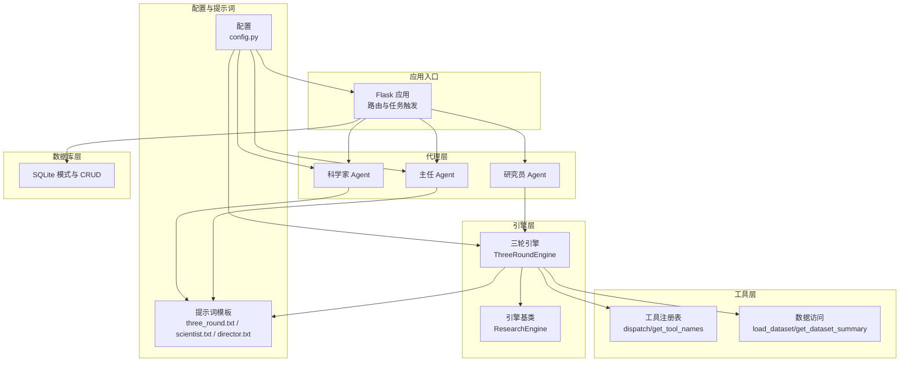
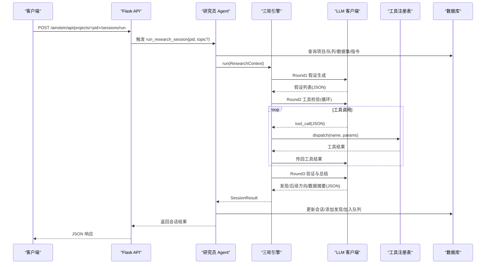
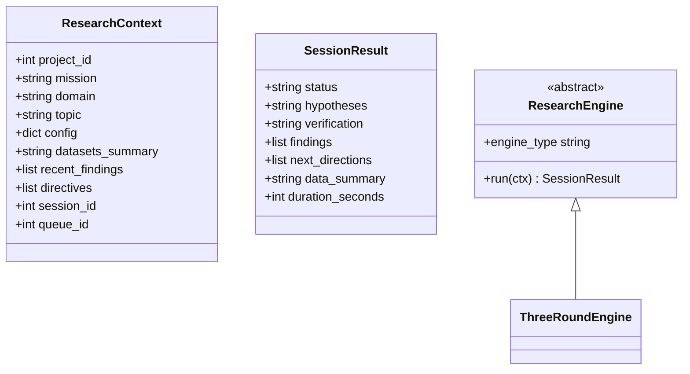
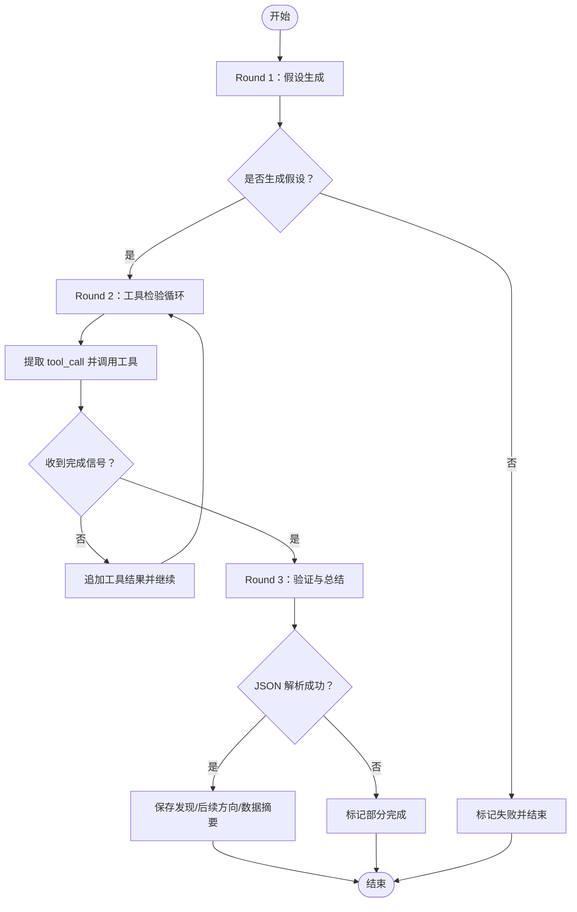
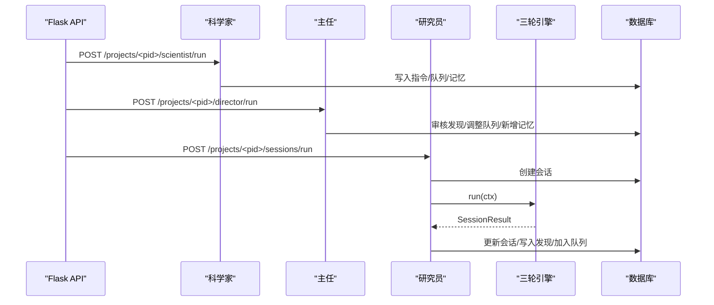
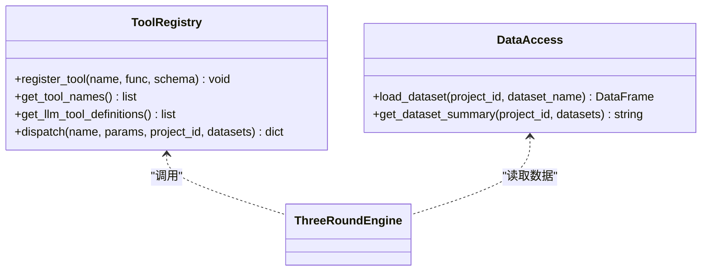
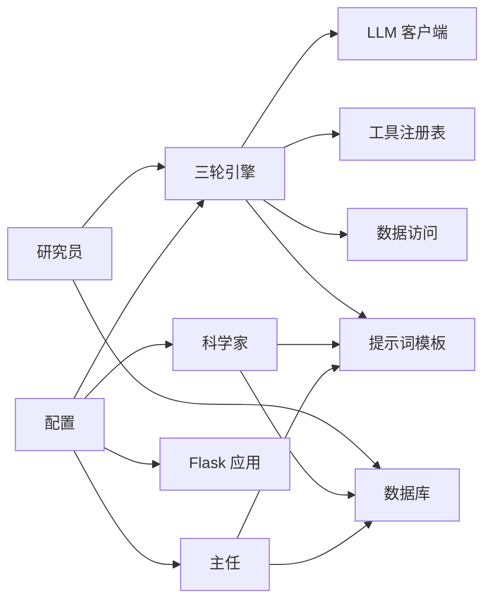

# 研究引擎

<cite>
**本文引用的文件**
- [engines/base.py](file://engines/base.py)
- [engines/three_round.py](file://engines/three_round.py)
- [agents/researcher.py](file://agents/researcher.py)
- [agents/director.py](file://agents/director.py)
- [agents/scientist.py](file://agents/scientist.py)
- [agents/llm_client.py](file://agents/llm_client.py)
- [tools/registry.py](file://tools/registry.py)
- [tools/data_access.py](file://tools/data_access.py)
- [config.py](file://config.py)
- [database.py](file://database.py)
- [prompts/three_round.txt](file://prompts/three_round.txt)
- [prompts/director.txt](file://prompts/director.txt)
- [prompts/scientist.txt](file://prompts/scientist.txt)
- [app.py](file://app.py)
- [README.md](file://README.md)
</cite>

## 目录
1. [简介](#简介)
2. [项目结构](#项目结构)
3. [核心组件](#核心组件)
4. [架构总览](#架构总览)
5. [详细组件分析](#详细组件分析)
6. [依赖关系分析](#依赖关系分析)
7. [性能与参数调优](#性能与参数调优)
8. [扩展指南：开发自定义研究引擎](#扩展指南开发自定义研究引擎)
9. [使用示例与最佳实践](#使用示例与最佳实践)
10. [故障排查](#故障排查)
11. [结论](#结论)

## 简介
本项目是一个通用的“数据驱动深度研究”平台，采用三级 AI 团队协作：科学家制定战略、主任进行质量监督与知识沉淀、研究员执行三轮研究流程（假设生成 → 工具检验 → 验证总结）。研究引擎作为核心抽象，提供统一的接口规范与上下文传递机制，当前内置了“三轮引擎”的完整实现，支持多种统计与外部数据工具，结合数据库层持久化研究过程与结果。

## 项目结构
- 引擎层：抽象基类与三轮引擎实现
- 代理层：科学家、主任、研究员编排器
- 工具层：工具注册表与数据访问
- 配置与提示词：模型与系统提示词
- 数据库层：SQLite 模式与 CRUD
- 应用入口：Flask API 与前端集成

图表来源
- [app.py:1-182](file://app.py#L1-L182)
- [engines/base.py:38-49](file://engines/base.py#L38-L49)
- [engines/three_round.py:22-179](file://engines/three_round.py#L22-L179)
- [agents/scientist.py:14-75](file://agents/scientist.py#L14-L75)
- [agents/director.py:14-124](file://agents/director.py#L14-L124)
- [agents/researcher.py:14-114](file://agents/researcher.py#L14-L114)
- [tools/registry.py:24-43](file://tools/registry.py#L24-L43)
- [tools/data_access.py:10-43](file://tools/data_access.py#L10-L43)
- [config.py:1-11](file://config.py#L1-L11)
- [prompts/three_round.txt:1-15](file://prompts/three_round.txt#L1-L15)
- [prompts/scientist.txt:1-32](file://prompts/scientist.txt#L1-L32)
- [prompts/director.txt:1-43](file://prompts/director.txt#L1-L43)
- [database.py:100-344](file://database.py#L100-L344)

章节来源
- [README.md:94-124](file://README.md#L94-L124)
- [app.py:1-182](file://app.py#L1-L182)

## 核心组件
- 引擎基类与上下文
  - ResearchContext：单次研究会话的上下文，包含项目信息、主题、配置、数据集摘要、近期发现、指令等。
  - SessionResult：引擎会话的输出结果，包含状态、假设、验证、发现、后续方向、数据摘要与耗时。
  - ResearchEngine：抽象基类，定义 engine_type 与 run(ctx) 接口。
- 三轮引擎 ThreeRoundEngine：实现完整的三轮研究流程，串联 LLM 推理与工具调用。
- 代理编排器
  - 科学家：生成战略指令与初始课题，沉淀策略记忆。
  - 主任：每日回顾，审核发现、调整队列、积累记忆、生成简报。
  - 研究员：从队列取题、构造上下文、调用引擎、持久化结果。
- 工具与数据
  - 工具注册表：集中管理工具函数与输入模式，支持按名称分发执行。
  - 数据访问：加载项目数据集为 DataFrame 并生成摘要文本。
- 配置与提示词
  - config.py：读取环境变量控制模型与服务端点。
  - prompts/*：系统提示词模板，注入 mission、domain、datasets_summary、tool_names 等上下文。
- 数据库层：统一的 SQLite 模式与 CRUD，支撑项目、队列、会话、发现、记忆、数据集等实体。

章节来源
- [engines/base.py:11-49](file://engines/base.py#L11-L49)
- [engines/three_round.py:22-179](file://engines/three_round.py#L22-L179)
- [agents/scientist.py:14-75](file://agents/scientist.py#L14-L75)
- [agents/director.py:14-124](file://agents/director.py#L14-L124)
- [agents/researcher.py:14-114](file://agents/researcher.py#L14-L114)
- [tools/registry.py:24-181](file://tools/registry.py#L24-L181)
- [tools/data_access.py:10-43](file://tools/data_access.py#L10-L43)
- [config.py:1-11](file://config.py#L1-L11)
- [prompts/three_round.txt:1-15](file://prompts/three_round.txt#L1-L15)
- [prompts/scientist.txt:1-32](file://prompts/scientist.txt#L1-L32)
- [prompts/director.txt:1-43](file://prompts/director.txt#L1-L43)
- [database.py:100-344](file://database.py#L100-L344)

## 架构总览
研究引擎采用“代理编排 + 引擎抽象 + 工具注册 + 数据持久化”的分层架构。Flask 提供 REST API，触发科学家/主任/研究员任务；研究员在单次会话中调用三轮引擎；引擎通过 LLM 与工具注册表协同完成假设生成、工具检验与验证总结；数据库层保存项目、队列、会话、发现与记忆。

图表来源
- [app.py:95-104](file://app.py#L95-L104)
- [agents/researcher.py:14-114](file://agents/researcher.py#L14-L114)
- [engines/three_round.py:28-179](file://engines/three_round.py#L28-L179)
- [agents/llm_client.py:24-114](file://agents/llm_client.py#L24-L114)
- [tools/registry.py:24-43](file://tools/registry.py#L24-L43)
- [database.py:232-295](file://database.py#L232-L295)

## 详细组件分析

### 引擎基类与接口规范
- 抽象属性 engine_type：标识引擎类型，便于路由与日志识别。
- 抽象方法 run(ctx)：接收 ResearchContext，返回 SessionResult。
- 上下文与结果的数据结构清晰，便于扩展与序列化。

图表来源
- [engines/base.py:11-49](file://engines/base.py#L11-L49)
- [engines/three_round.py:22-27](file://engines/three_round.py#L22-L27)

章节来源
- [engines/base.py:11-49](file://engines/base.py#L11-L49)

### 三轮研究流程实现
- Round 1：假设生成
  - 使用系统提示词与指令/近期发现上下文，要求 LLM 输出可测试的假设及测试计划。
  - 若未生成假设，直接失败并记录耗时。
- Round 2：工具检验
  - 限定温度与最大 token，要求 LLM 以纯 JSON 输出工具调用请求。
  - 循环最多固定轮次，逐次调用工具并把结果回传给 LLM，直至收到“完成”信号。
  - 支持统计工具与外部数据工具，自动加载数据集并执行。
- Round 3：验证与总结
  - 基于假设与检验结果，要求 LLM 输出验证结论、关键发现、后续方向与数据摘要。
  - 解析 JSON 结果，若解析失败则标记部分完成。

图表来源
- [engines/three_round.py:28-179](file://engines/three_round.py#L28-L179)
- [prompts/three_round.txt:1-15](file://prompts/three_round.txt#L1-L15)

章节来源
- [engines/three_round.py:28-179](file://engines/three_round.py#L28-L179)
- [prompts/three_round.txt:1-15](file://prompts/three_round.txt#L1-L15)

### 代理编排器
- 科学家
  - 读取项目与数据集摘要，生成战略指令与初始课题，沉淀策略记忆。
  - 通过提示词模板注入 mission/domain/datasets_summary。
- 主任
  - 汇总最近会话、开放发现、队列与记忆，进行发现审核、队列调整、新增课题与记忆积累。
  - 通过提示词模板定义工作流程与返回 JSON 的结构。
- 研究员
  - 从队列取下一个主题，构造 ResearchContext，创建会话并调用引擎。
  - 将 SessionResult 持久化为会话与发现，并将后续方向加入队列。

图表来源
- [agents/scientist.py:14-75](file://agents/scientist.py#L14-L75)
- [agents/director.py:14-124](file://agents/director.py#L14-L124)
- [agents/researcher.py:14-114](file://agents/researcher.py#L14-L114)
- [engines/three_round.py:28-179](file://engines/three_round.py#L28-L179)
- [database.py:173-295](file://database.py#L173-L295)

章节来源
- [agents/scientist.py:14-75](file://agents/scientist.py#L14-L75)
- [agents/director.py:14-124](file://agents/director.py#L14-L124)
- [agents/researcher.py:14-114](file://agents/researcher.py#L14-L114)

### 工具注册与数据访问
- 工具注册表
  - register_tool(name, func, schema)：注册工具函数与输入模式。
  - dispatch(name, params)：按名称分发执行，自动处理数据集加载与错误返回。
  - get_tool_names()/get_llm_tool_definitions()：提供工具清单与 LLM 工具定义。
- 数据访问
  - load_dataset(project_id, dataset_name)：根据扩展名加载 CSV/JSON/XLSX。
  - get_dataset_summary(project_id, datasets)：生成可用于 LLM 的数据集摘要文本。

图表来源
- [tools/registry.py:24-181](file://tools/registry.py#L24-L181)
- [tools/data_access.py:10-43](file://tools/data_access.py#L10-L43)
- [engines/three_round.py:126-134](file://engines/three_round.py#L126-L134)

章节来源
- [tools/registry.py:24-181](file://tools/registry.py#L24-L181)
- [tools/data_access.py:10-43](file://tools/data_access.py#L10-L43)

### 配置与提示词
- 配置项
  - DB_PATH、DATA_DIR：数据库路径与数据目录。
  - DASHSCOPE_API_KEY、DASHSCOPE_BASE_URL：DashScope API 凭据与基础地址。
  - RESEARCH_MODEL、SCIENTIST_MODEL、DIRECTOR_MODEL：不同角色使用的模型名称。
- 提示词模板
  - three_round.txt：三轮引擎系统提示词，强调数据依据、工具使用与语言规范。
  - scientist.txt：科学家提示词，定义指令、初始课题与分类。
  - director.txt：主任提示词，定义审核、调整与记忆积累流程。

章节来源
- [config.py:1-11](file://config.py#L1-L11)
- [prompts/three_round.txt:1-15](file://prompts/three_round.txt#L1-L15)
- [prompts/scientist.txt:1-32](file://prompts/scientist.txt#L1-L32)
- [prompts/director.txt:1-43](file://prompts/director.txt#L1-L43)

### 数据库层
- 表结构要点
  - projects、scientist_directives、research_queue、research_sessions、research_findings、director_memory、datasets。
  - 索引覆盖常用查询场景。
- 关键操作
  - 项目管理、指令与队列维护、会话创建与更新、发现增删改查、记忆累积、数据集元数据管理。

章节来源
- [database.py:100-344](file://database.py#L100-L344)

## 依赖关系分析
- 组件耦合
  - 三轮引擎依赖 LLM 客户端、工具注册表、数据访问与提示词模板。
  - 研究员编排器依赖数据库与引擎实例。
  - 科学家/主任依赖数据库与提示词模板。
- 外部依赖
  - LLM 客户端基于 Anthropic 兼容 API（DashScope），通过环境变量配置。
  - SQLite 用于本地存储，WAL 模式提升并发写入性能。
- 潜在循环依赖
  - 当前模块间无明显循环导入；引擎与工具通过注册表解耦。

图表来源
- [engines/three_round.py:6-9](file://engines/three_round.py#L6-L9)
- [agents/llm_client.py:14-21](file://agents/llm_client.py#L14-L21)
- [tools/registry.py:24-43](file://tools/registry.py#L24-L43)
- [tools/data_access.py:10-43](file://tools/data_access.py#L10-L43)
- [prompts/three_round.txt:1-15](file://prompts/three_round.txt#L1-L15)
- [agents/researcher.py:14-114](file://agents/researcher.py#L14-L114)
- [agents/scientist.py:14-75](file://agents/scientist.py#L14-L75)
- [agents/director.py:14-124](file://agents/director.py#L14-L124)
- [config.py:1-11](file://config.py#L1-L11)
- [app.py:1-182](file://app.py#L1-L182)

章节来源
- [engines/three_round.py:6-9](file://engines/three_round.py#L6-L9)
- [agents/llm_client.py:14-21](file://agents/llm_client.py#L14-L21)
- [tools/registry.py:24-43](file://tools/registry.py#L24-L43)
- [tools/data_access.py:10-43](file://tools/data_access.py#L10-L43)
- [prompts/three_round.txt:1-15](file://prompts/three_round.txt#L1-L15)
- [agents/researcher.py:14-114](file://agents/researcher.py#L14-L114)
- [agents/scientist.py:14-75](file://agents/scientist.py#L14-L75)
- [agents/director.py:14-124](file://agents/director.py#L14-L124)
- [config.py:1-11](file://config.py#L1-L11)
- [app.py:1-182](file://app.py#L1-L182)

## 性能与参数调优
- LLM 参数
  - 温度与最大 token：三轮引擎在不同阶段采用不同温度与 token 配置，平衡创造性与稳定性。
  - 工具调用循环上限：限制 Round 2 最大轮次，避免长对话与资源浪费。
- 工具执行
  - 统计工具自动加载数据集，注意数据规模对响应时间的影响。
  - 工具错误统一捕获并返回错误信息，便于快速失败与重试策略。
- 数据库
  - WAL 模式与外键约束开启，保证一致性与并发写入能力。
  - 索引覆盖队列、会话、发现、记忆与数据集查询，减少慢查询。
- 前端与部署
  - 前端构建产物由 Nginx 提供，Gunicorn 承载 Flask，适合生产部署。

章节来源
- [engines/three_round.py:105-135](file://engines/three_round.py#L105-L135)
- [agents/llm_client.py:24-114](file://agents/llm_client.py#L24-L114)
- [database.py:113-122](file://database.py#L113-L122)
- [database.py:92-97](file://database.py#L92-L97)
- [README.md:61-69](file://README.md#L61-L69)

## 扩展指南：开发自定义研究引擎
- 实现步骤
  - 新建类继承 ResearchEngine，实现 engine_type 与 run(ctx)。
  - 在 run(ctx) 中：
    - 读取 ResearchContext 字段（mission、domain、topic、config、datasets_summary、recent_findings、directives）。
    - 生成 SessionResult，填充 hypotheses、verification、findings、next_directions、data_summary、duration_seconds。
  - 在 agents/researcher.py 中替换 ENGINE 实例或通过路由选择新引擎。
- 接口契约
  - run(ctx) 必须返回 SessionResult，状态字段用于会话状态管理。
  - 假设与验证必须为可序列化的字符串（JSON 字符串），便于数据库持久化。
- 提示词与工具
  - 可复用 prompts/* 模板，或新增模板注入上下文。
  - 如需新工具，通过 tools/registry.py 注册并提供输入模式，三轮引擎即可在工具调用阶段使用。
- 最佳实践
  - 明确各阶段的输入输出格式，严格遵循 JSON 结构。
  - 控制工具调用轮次与超时，避免长时间占用。
  - 记录耗时与状态，便于监控与排障。

章节来源
- [engines/base.py:38-49](file://engines/base.py#L38-L49)
- [engines/three_round.py:28-179](file://engines/three_round.py#L28-L179)
- [tools/registry.py:24-181](file://tools/registry.py#L24-L181)
- [agents/researcher.py:11-11](file://agents/researcher.py#L11-L11)

## 使用示例与最佳实践
- 创建项目与上传数据
  - 通过 API 创建项目，上传数据集并生成 schema 与行数。
- 触发科学家与主任
  - 科学家：生成指令与初始队列，沉淀策略记忆。
  - 主任：每日回顾，审核发现、调整队列、新增记忆与简报。
- 启动研究会话
  - 通过 API 触发研究员执行会话，观察会话状态与发现数量。
- 最佳实践
  - 为每个项目设置明确 mission 与 domain，确保提示词模板有效。
  - 利用 recent_findings 与 directives 作为上下文，提升研究连贯性。
  - 对低置信度发现保持谨慎，必要时增加工具调用轮次或引入更多数据源。
  - 定期清理无效队列项，保持研究焦点。

章节来源
- [app.py:50-177](file://app.py#L50-L177)
- [agents/scientist.py:14-75](file://agents/scientist.py#L14-L75)
- [agents/director.py:14-124](file://agents/director.py#L14-L124)
- [agents/researcher.py:14-114](file://agents/researcher.py#L14-L114)
- [database.py:173-344](file://database.py#L173-L344)

## 故障排查
- LLM 调用失败
  - 检查 DASHSCOPE_API_KEY 与 DASHSCOPE_BASE_URL 是否正确配置。
  - 查看 LLM 客户端日志中的 token 使用情况与异常堆栈。
- 工具调用异常
  - 确认工具名称存在于注册表，参数满足输入模式。
  - 检查数据集是否存在且可被加载。
- JSON 解析失败
  - 三轮引擎在 Round 1/3 会尝试提取 JSON，失败时记录警告并可能标记部分完成。
- 数据库问题
  - 确保数据库初始化完成，WAL 模式启用，索引存在。
  - 检查外键约束导致的插入/更新失败。

章节来源
- [agents/llm_client.py:42-44](file://agents/llm_client.py#L42-L44)
- [tools/registry.py:40-42](file://tools/registry.py#L40-L42)
- [engines/three_round.py:66-75](file://engines/three_round.py#L66-L75)
- [engines/three_round.py:160-175](file://engines/three_round.py#L160-L175)
- [database.py:113-122](file://database.py#L113-L122)

## 结论
本研究引擎通过抽象基类与三轮流程实现了可扩展、可解释、可迭代的研究范式。借助工具注册表与数据访问层，引擎能够灵活组合统计与外部数据工具；通过数据库层持久化研究过程与结果，形成知识闭环。开发者可据此快速扩展新的引擎类型与工具，构建面向任意领域的数据驱动研究体系。