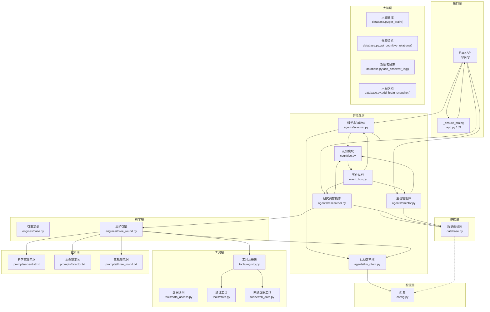
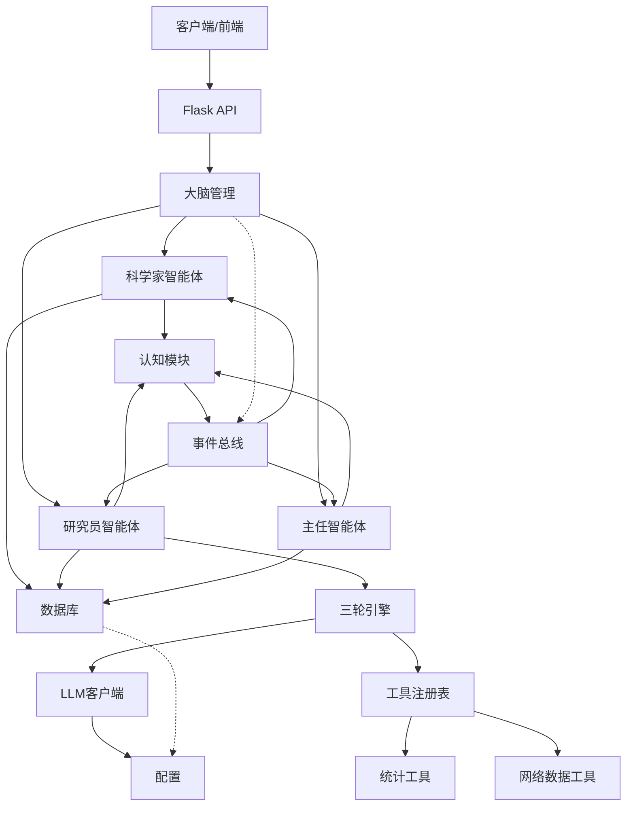
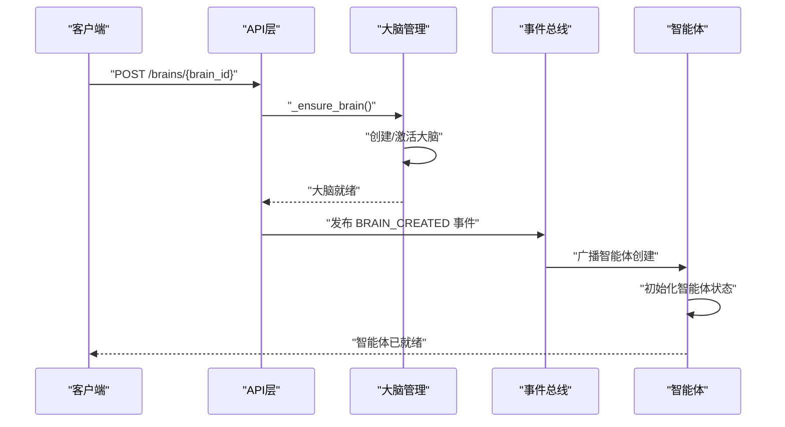
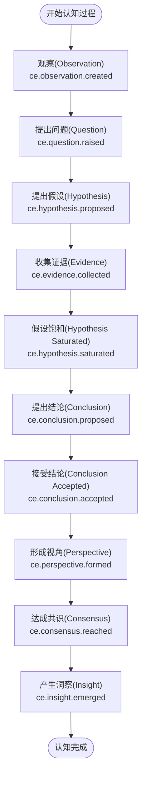
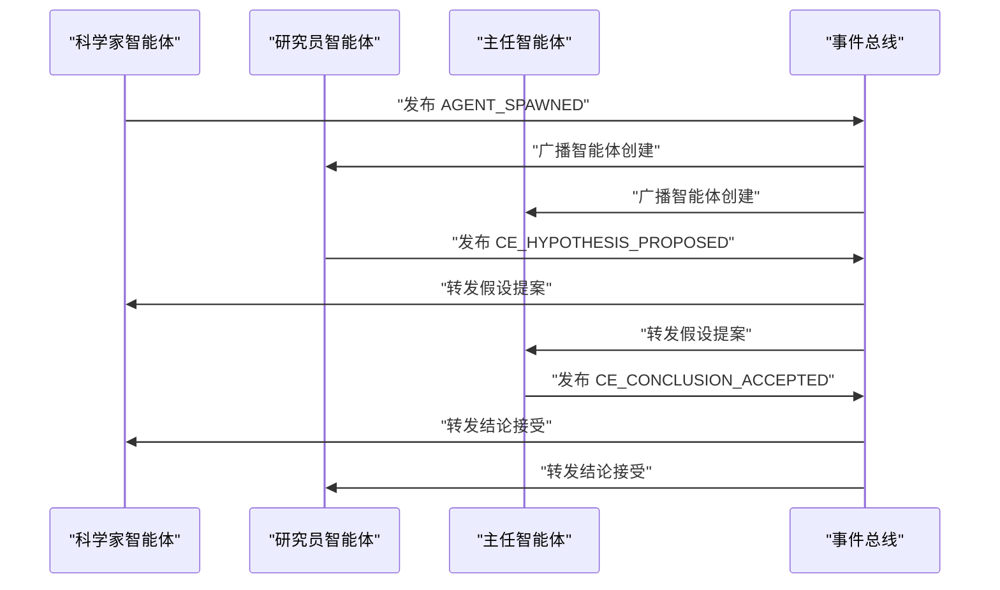
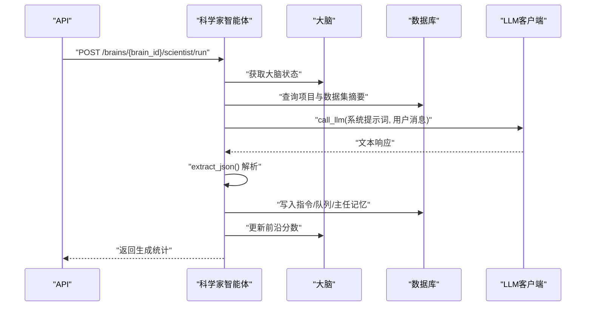
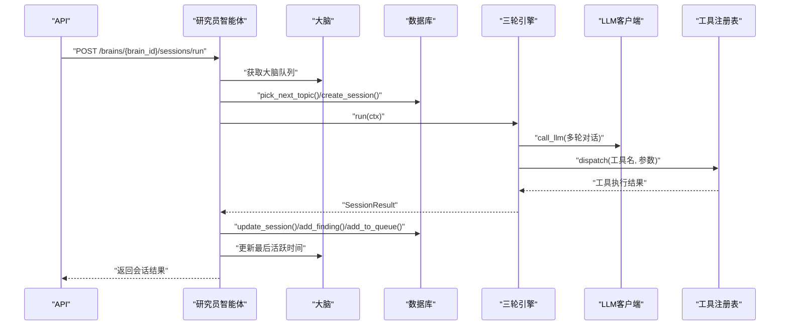
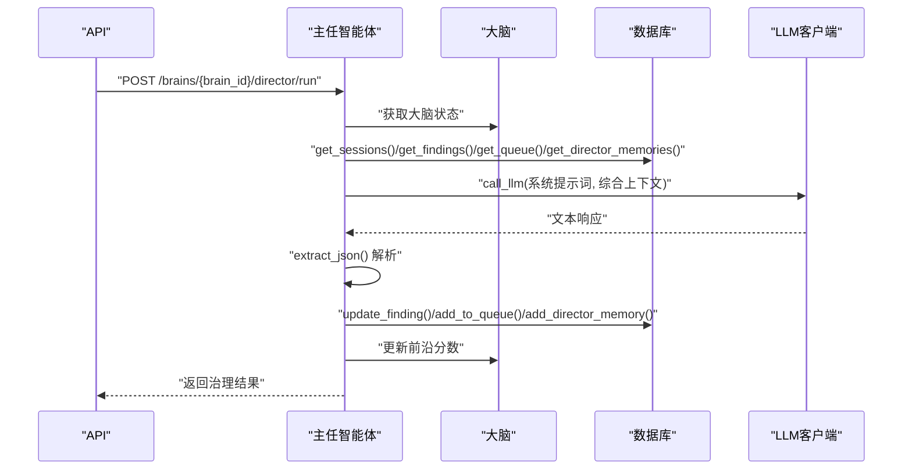
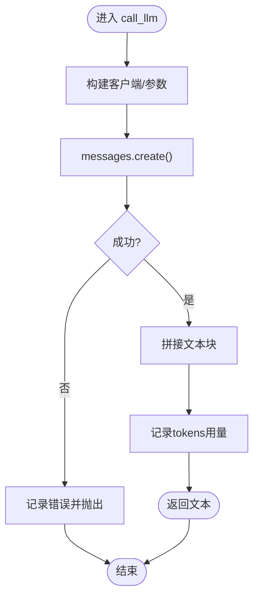
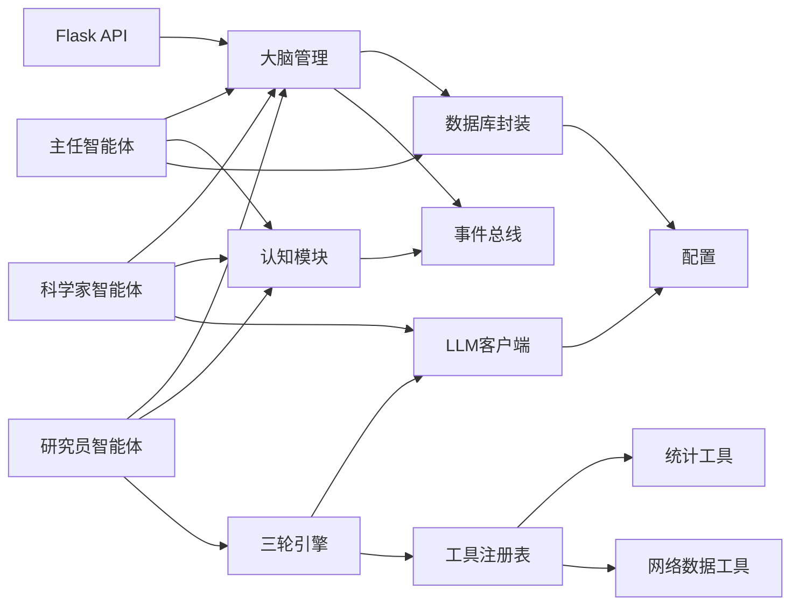

# AI代理架构

<cite>
**本文档引用的文件**
- [agents/scientist.py](file://agents/scientist.py)
- [agents/researcher.py](file://agents/researcher.py)
- [agents/director.py](file://agents/director.py)
- [agents/llm_client.py](file://agents/llm_client.py)
- [engines/base.py](file://engines/base.py)
- [engines/three_round.py](file://engines/three_round.py)
- [tools/registry.py](file://tools/registry.py)
- [tools/data_access.py](file://tools/data_access.py)
- [tools/stats.py](file://tools/stats.py)
- [tools/web_data.py](file://tools/web_data.py)
- [database.py](file://database.py)
- [config.py](file://config.py)
- [app.py](file://app.py)
- [event_bus.py](file://event_bus.py)
- [cognitive.py](file://cognitive.py)
- [prompts/scientist.txt](file://prompts/scientist.txt)
- [prompts/director.txt](file://prompts/director.txt)
- [prompts/three_round.txt](file://prompts/three_round.txt)
</cite>

## 更新摘要
**所做更改**
- 新增基于brain_id的智能体中心架构分析
- 更新代理协作模式以反映基于大脑的通信机制
- 新增认知元素和代理关系管理章节
- 更新架构图以体现新的智能体通信模式
- 新增事件总线和观察者日志机制

## 目录
1. [引言](#引言)
2. [项目结构](#项目结构)
3. [核心组件](#核心组件)
4. [架构总览](#架构总览)
5. [详细组件分析](#详细组件分析)
6. [依赖关系分析](#依赖关系分析)
7. [性能考虑](#性能考虑)
8. [故障排查指南](#故障排查指南)
9. [结论](#结论)
10. [附录](#附录)

## 引言
本文件面向"AI代理系统"的整体架构与运行机制，围绕基于brain_id的智能体中心架构展开，系统化阐述从传统项目角色模型向智能体通信模式的转变。该架构以大脑（Brain）为核心载体，通过认知元素（Cognitive Elements）和代理关系实现智能体间的动态协作，包括LLM客户端统一接口设计、智能体间通信机制、事件驱动的协作模式以及代理生命周期管理。同时提供架构图与交互序列图，帮助读者理解基于大脑的智能体通信机制和数据流转。

## 项目结构
该系统采用"大脑层-智能体层-引擎层-工具层-数据层-配置层-接口层"的分层组织方式：
- 大脑层：以brain_id为中心的智能体容器，管理智能体状态、认知元素和代理关系。
- 智能体层：科学家、研究员、主任智能体基于大脑进行协作，通过事件总线进行通信。
- 引擎层：抽象引擎接口与具体"三轮"引擎实现，定义研究流程与上下文。
- 工具层：内置统计与网络检索工具注册与分发，支持LLM驱动的工具调用。
- 数据层：SQLite数据库封装，提供大脑、认知元素、代理关系、观察者日志等CRUD能力。
- 配置层：集中管理模型名、API密钥、基础地址、数据目录等环境变量。
- 接口层：Flask REST API，暴露大脑、认知元素、代理关系、观察者日志等接口。

**图表来源**
- [app.py:183-189](file://app.py#L183-L189)
- [database.py:571-574](file://database.py#L571-L574)
- [database.py:664-666](file://database.py#L664-L666)
- [database.py:837-845](file://database.py#L837-L845)
- [database.py:858-868](file://database.py#L858-L868)
- [event_bus.py:69-104](file://event_bus.py#L69-L104)
- [cognitive.py](file://cognitive.py)

**章节来源**
- [app.py:183-189](file://app.py#L183-L189)
- [database.py:571-574](file://database.py#L571-L574)
- [database.py:664-666](file://database.py#L664-L666)
- [database.py:837-845](file://database.py#L837-L845)
- [database.py:858-868](file://database.py#L858-L868)
- [event_bus.py:69-104](file://event_bus.py#L69-L104)
- [cognitive.py](file://cognitive.py)

## 核心组件
- **大脑管理**：以brain_id为核心的智能体容器，管理智能体状态、前沿分数和活跃时间，提供大脑生命周期管理功能。
- **认知元素**：智能体思考过程的结构化表示，包括观察、问题、假设、证据、结论等认知阶段的元素化管理。
- **代理关系**：智能体间的连接关系，通过关系强度和类型描述智能体间的协作模式和知识传递。
- **观察者日志**：记录智能体的观察行为和认知过程，支持后续分析和审计。
- **大脑快照**：定期保存大脑状态，包括前沿分数、认知元素数量、关系数量和活跃智能体等指标。
- **事件总线**：基于blueprint格式的事件驱动通信机制，支持智能体间的异步协作和状态同步。
- **智能体层**：科学家、研究员、主任智能体基于大脑进行协作，通过事件总线实现松耦合的通信模式。
- **LLM客户端**：统一Anthropic兼容接口，封装模型调用、工具调用与JSON提取，提供稳定错误日志与异常抛出。
- **引擎基类与三轮引擎**：定义上下文与结果结构，实现"假设-检验-验证"的三阶段流程，结合工具注册表与数据访问。
- **工具注册表与工具集**：注册统计与网络检索工具，提供LLM工具定义与调度执行。
- **数据库封装**：提供大脑、认知元素、代理关系、观察者日志等实体的增删改查与索引优化。
- **配置模块**：集中管理数据库路径、数据目录、API密钥、模型名等。
- **提示词模板**：为科学家、主任与三轮引擎提供结构化系统提示，确保输出格式与任务目标一致。

**章节来源**
- [database.py:571-574](file://database.py#L571-L574)
- [database.py:664-666](file://database.py#L664-L666)
- [database.py:837-845](file://database.py#L837-L845)
- [database.py:858-868](file://database.py#L858-L868)
- [event_bus.py:69-104](file://event_bus.py#L69-L104)
- [agents/scientist.py:14-75](file://agents/scientist.py#L14-L75)
- [agents/researcher.py:14-114](file://agents/researcher.py#L14-L114)
- [agents/director.py:14-124](file://agents/director.py#L14-L124)
- [agents/llm_client.py:24-114](file://agents/llm_client.py#L24-L114)
- [engines/base.py:11-49](file://engines/base.py#L11-L49)
- [engines/three_round.py:22-179](file://engines/three_round.py#L22-L179)
- [tools/registry.py:24-181](file://tools/registry.py#L24-L181)
- [tools/stats.py:10-120](file://tools/stats.py#L10-L120)
- [tools/web_data.py:13-164](file://tools/web_data.py#L13-L164)
- [database.py:101-344](file://database.py#L101-L344)
- [config.py:4-11](file://config.py#L4-L11)
- [prompts/scientist.txt:1-32](file://prompts/scientist.txt#L1-L32)
- [prompts/director.txt:1-43](file://prompts/director.txt#L1-L43)
- [prompts/three_round.txt:1-15](file://prompts/three_round.txt#L1-L15)

## 架构总览
系统通过Flask API对外提供REST服务，内部以大脑为核心载体，智能体基于brain_id进行协作。通过事件总线实现智能体间的异步通信，数据库作为唯一事实源，贯穿智能体的状态流转与结果沉淀。认知元素和代理关系提供了智能体思考过程的结构化表示和协作机制。

**图表来源**
- [app.py:183-189](file://app.py#L183-L189)
- [database.py:571-574](file://database.py#L571-L574)
- [event_bus.py:69-104](file://event_bus.py#L69-L104)
- [cognitive.py](file://cognitive.py)

**章节来源**
- [app.py:183-189](file://app.py#L183-L189)
- [database.py:571-574](file://database.py#L571-L574)
- [event_bus.py:69-104](file://event_bus.py#L69-L104)
- [cognitive.py](file://cognitive.py)

## 详细组件分析

### 基于brain_id的智能体中心架构
- **大脑作为智能体容器**：每个brain_id代表一个独立的智能体空间，包含完整的认知状态和代理关系。
- **智能体生命周期**：通过大脑状态管理实现智能体的创建、激活、暂停和归档。
- **事件驱动通信**：智能体通过事件总线进行异步通信，实现松耦合的协作模式。
- **认知元素管理**：将智能体的思考过程结构化为认知元素，支持跨智能体的知识共享和推理。

**图表来源**
- [app.py:183-189](file://app.py#L183-L189)
- [database.py:571-574](file://database.py#L571-L574)
- [event_bus.py:99-104](file://event_bus.py#L99-L104)

**章节来源**
- [app.py:183-189](file://app.py#L183-L189)
- [database.py:571-574](file://database.py#L571-L574)
- [event_bus.py:99-104](file://event_bus.py#L99-L104)

### 认知元素与代理关系管理
- **认知元素生命周期**：从观察（observation）到洞察（insight）的完整认知过程，每个阶段对应特定的认知元素类型。
- **代理关系建模**：通过关系类型和强度描述智能体间的协作模式，支持复杂的知识传递和推理网络。
- **观察者日志系统**：记录智能体的观察行为和认知过程，支持后续分析和审计需求。
- **大脑快照机制**：定期保存大脑状态，用于监控智能体的前沿探索程度和认知活跃度。

**图表来源**
- [event_bus.py:74-88](file://event_bus.py#L74-L88)

**章节来源**
- [event_bus.py:74-88](file://event_bus.py#L74-L88)
- [database.py:664-666](file://database.py#L664-L666)
- [database.py:837-845](file://database.py#L837-L845)
- [database.py:858-868](file://database.py#L858-L868)

### 智能体协作模式与事件驱动机制
- **事件总线通信**：基于blueprint格式的命名约定，支持智能体间的异步事件通信和状态同步。
- **代理生命周期事件**：spawned、despawned、role_changed、completed等事件支持智能体状态管理。
- **博弈事件**：deliberation.requested和deliberation.concluded事件支持智能体间的协商和决策过程。
- **大脑生命周期事件**：created、paused、resumed、archived、cycle.tick等事件支持大脑级别的协调。

**图表来源**
- [event_bus.py:89-97](file://event_bus.py#L89-L97)
- [event_bus.py:99-104](file://event_bus.py#L99-L104)

**章节来源**
- [event_bus.py:89-97](file://event_bus.py#L89-L97)
- [event_bus.py:99-104](file://event_bus.py#L99-L104)

### 科学家智能体（基于大脑的协作）
- **职责**：基于大脑的使命与领域，生成战略指令、初始研究主题、发现分类与策略要点，通过事件总线通知其他智能体。
- **关键流程**：
  - 读取大脑信息与数据集摘要，构造系统提示词与用户消息。
  - 调用LLM生成结构化JSON，解析为指令、主题、分类与备注。
  - 通过事件总线发布认知元素，写入数据库：指令表、队列表、主任记忆表。
- **输出**：返回生成数量与分类信息，便于上层统计与可视化。

**图表来源**
- [agents/scientist.py:14-75](file://agents/scientist.py#L14-L75)
- [agents/llm_client.py:24-114](file://agents/llm_client.py#L24-L114)
- [database.py:571-574](file://database.py#L571-L574)

**章节来源**
- [agents/scientist.py:14-75](file://agents/scientist.py#L14-L75)
- [prompts/scientist.txt:1-32](file://prompts/scientist.txt#L1-L32)
- [database.py:571-574](file://database.py#L571-L574)

### 研究员智能体（基于大脑的协作）
- **职责**：从大脑队列中选取主题，构建研究上下文，驱动引擎完成研究会话，持久化会话结果与发现，向大脑队列追加新方向。
- **关键流程**：
  - 选择或接收主题，构建上下文对象。
  - 创建会话记录，调用引擎执行。
  - 将引擎结果写入数据库，更新队列状态。
- **输出**：返回会话ID、状态、发现数量、耗时等。

**图表来源**
- [agents/researcher.py:14-114](file://agents/researcher.py#L14-L114)
- [engines/three_round.py:28-179](file://engines/three_round.py#L28-L179)
- [tools/registry.py:24-181](file://tools/registry.py#L24-L181)
- [database.py:571-574](file://database.py#L571-L574)

**章节来源**
- [agents/researcher.py:14-114](file://agents/researcher.py#L14-L114)
- [engines/base.py:11-49](file://engines/base.py#L11-L49)
- [engines/three_round.py:28-179](file://engines/three_round.py#L28-L179)
- [database.py:571-574](file://database.py#L571-L574)

### 主任智能体（基于大脑的协作）
- **职责**：每日回顾大脑中的最近会话、开放发现、队列与记忆，进行发现审核、队列调整、新增主题与记忆沉淀。
- **关键流程**：
  - 汇总大脑中的最近会话、开放发现、队列与记忆。
  - 调用LLM生成结构化JSON，执行更新操作。
- **输出**：返回审核数量、新增主题数、记忆数与简报内容。

**图表来源**
- [agents/director.py:14-124](file://agents/director.py#L14-L124)
- [agents/llm_client.py:24-114](file://agents/llm_client.py#L24-L114)
- [database.py:571-574](file://database.py#L571-L574)

**章节来源**
- [agents/director.py:14-124](file://agents/director.py#L14-L124)
- [prompts/director.txt:1-43](file://prompts/director.txt#L1-L43)
- [database.py:571-574](file://database.py#L571-L574)

### LLM客户端统一接口设计
- **统一客户端**：基于Anthropic兼容SDK，延迟初始化，支持系统提示词与消息数组。
- **工具调用**：支持在单次调用中返回文本与工具调用列表，便于引擎与工具交互。
- **JSON提取**：增强鲁棒性，支持Markdown围栏、直接JSON与最大块匹配提取。
- **错误处理**：捕获异常并记录日志，向上抛出，便于上层重试或降级。

**图表来源**
- [agents/llm_client.py:24-114](file://agents/llm_client.py#L24-L114)

**章节来源**
- [agents/llm_client.py:24-114](file://agents/llm_client.py#L24-L114)

### 生命周期管理
- **大脑初始化**：应用启动时初始化数据库与索引，通过_ensure_brain函数确保大脑存在。
- **智能体执行**：科学家生成指令与主题；研究员执行会话并写入结果；主任每日治理与沉淀。
- **监控**：通过API列出大脑、认知元素、代理关系、观察者日志；支持分页与过滤。
- **清理**：数据库事务封装，异常回滚，保证一致性。

**章节来源**
- [app.py:15-19](file://app.py#L15-L19)
- [app.py:183-189](file://app.py#L183-L189)
- [database.py:101-123](file://database.py#L101-L123)

## 依赖关系分析
- **大脑对智能体**：所有智能体都依赖大脑管理；大脑依赖事件总线进行智能体间通信。
- **智能体对引擎**：研究员智能体依赖三轮引擎；引擎依赖LLM客户端与工具注册表。
- **认知模块**：智能体通过认知模块管理认知元素和代理关系。
- **数据依赖**：所有组件均依赖数据库封装；数据访问工具负责加载数据集并生成摘要。
- **配置依赖**：LLM客户端与API端点依赖配置模块提供的模型名与密钥。

**图表来源**
- [database.py:571-574](file://database.py#L571-L574)
- [event_bus.py:69-104](file://event_bus.py#L69-L104)
- [cognitive.py](file://cognitive.py)
- [agents/scientist.py:14-75](file://agents/scientist.py#L14-L75)
- [agents/researcher.py:14-114](file://agents/researcher.py#L14-L114)
- [agents/director.py:14-124](file://agents/director.py#L14-L124)
- [engines/three_round.py:28-179](file://engines/three_round.py#L28-L179)
- [tools/registry.py:24-181](file://tools/registry.py#L24-L181)
- [tools/stats.py:10-120](file://tools/stats.py#L10-L120)
- [tools/web_data.py:13-164](file://tools/web_data.py#L13-L164)
- [database.py:101-344](file://database.py#L101-L344)
- [config.py:4-11](file://config.py#L4-L11)

**章节来源**
- [database.py:571-574](file://database.py#L571-L574)
- [event_bus.py:69-104](file://event_bus.py#L69-L104)
- [cognitive.py](file://cognitive.py)
- [engines/three_round.py:28-179](file://engines/three_round.py#L28-L179)
- [tools/registry.py:24-181](file://tools/registry.py#L24-L181)
- [database.py:101-344](file://database.py#L101-L344)

## 性能考虑
- **大脑状态缓存**：通过大脑状态管理减少数据库查询频率，提高智能体响应速度。
- **事件总线优化**：使用异步事件处理机制，避免智能体间的同步阻塞。
- **认知元素批处理**：批量处理认知元素的创建和更新，减少数据库事务开销。
- **代理关系索引**：针对代理关系的src_id、dst_id、relation建立复合索引，提升查询效率。
- **观察者日志轮转**：定期清理历史观察者日志，控制数据库大小增长。
- **LLM调用成本**：通过记录输入/输出tokens，辅助成本控制与阈值设置。
- **工具调用限制**：三轮引擎在第二轮设置最大轮次，避免无限循环；工具执行失败时记录错误并继续流程。
- **数据库事务**：使用上下文管理器与回滚，减少锁竞争与不一致风险。
- **索引优化**：针对队列、会话、发现、记忆、数据集建立索引，提升查询效率。
- **并发执行**：API中会话执行使用守护线程异步启动，避免阻塞请求。

**章节来源**
- [database.py:590-600](file://database.py#L590-L600)
- [event_bus.py:69-104](file://event_bus.py#L69-L104)
- [database.py:675-689](file://database.py#L675-L689)
- [database.py:847-853](file://database.py#L847-L853)
- [agents/llm_client.py:24-44](file://agents/llm_client.py#L24-L44)
- [engines/three_round.py:103-135](file://engines/three_round.py#L103-L135)
- [database.py:110-123](file://database.py#L110-L123)
- [database.py:92-97](file://database.py#L92-L97)
- [app.py:97-104](file://app.py#L97-L104)

## 故障排查指南
- **大脑管理异常**：检查大脑是否存在和状态是否正确；查看大脑状态更新日志。
- **事件总线通信失败**：检查事件订阅和发布机制；确认事件格式符合blueprint规范。
- **认知元素创建失败**：确认认知元素类型和关系有效性；检查数据库约束。
- **代理关系查询异常**：核对src_id、dst_id、relation参数；检查索引完整性。
- **观察者日志缺失**：确认日志记录机制正常工作；检查数据库连接。
- **LLM调用失败**：检查API密钥与基础URL配置；查看日志中的错误堆栈；确认模型名正确。
- **JSON解析失败**：确认提示词模板返回结构化JSON；检查extract_json的边界情况。
- **工具执行异常**：检查工具参数是否完整；确认数据集存在且可读；查看工具返回的错误信息。
- **数据库异常**：确认数据库初始化完成；检查外键约束与事务回滚逻辑。
- **队列/会话状态异常**：核对状态转换逻辑（pending/picked/completed/failed/open/validated/rejected）。

**章节来源**
- [database.py:571-574](file://database.py#L571-L574)
- [event_bus.py:69-104](file://event_bus.py#L69-L104)
- [database.py:664-666](file://database.py#L664-L666)
- [database.py:675-689](file://database.py#L675-L689)
- [database.py:837-845](file://database.py#L837-L845)
- [agents/llm_client.py:42-44](file://agents/llm_client.py#L42-L44)
- [engines/three_round.py:109-111](file://engines/three_round.py#L109-L111)
- [tools/registry.py:40-42](file://tools/registry.py#L40-L42)
- [database.py:118-121](file://database.py#L118-L121)

## 结论
本架构以"基于brain_id的智能体中心架构"为核心，通过事件驱动的通信机制和认知元素管理系统，实现了从传统项目角色模型向智能体协作模式的转变。大脑作为智能体的容器，提供了统一的状态管理和知识存储；事件总线支持智能体间的异步协作；认知元素和代理关系为智能体的思考过程提供了结构化的表示。数据库作为统一事实源，保障了状态一致性与可观测性。建议在生产环境中进一步完善重试与熔断策略、引入指标采集与告警，并扩展更多外部数据源与分析工具。

## 附录
- **API端点概览（节选）**
  - 大脑：GET/POST /ainstein/api/brains
  - 认知元素：GET/POST /ainstein/api/brains/{brain_id}/cognitive-elements
  - 代理关系：GET /ainstein/api/brains/{brain_id}/cognitive-relations
  - 观察者日志：GET /ainstein/api/brains/{brain_id}/observer-logs
  - 智能体：POST /ainstein/api/brains/{brain_id}/scientist/run, POST /ainstein/api/brains/{brain_id}/director/run

**章节来源**
- [app.py:180-250](file://app.py#L180-L250)
- [database.py:571-574](file://database.py#L571-L574)
- [database.py:664-666](file://database.py#L664-L666)
- [database.py:837-845](file://database.py#L837-L845)
- [database.py:847-853](file://database.py#L847-L853)