# AI代理框架

<cite>
**本文档引用的文件**
- [README.md](file://README.md)
- [app.py](file://app.py)
- [agents/framework.py](file://agents/framework.py)
- [engines/base.py](file://engines/base.py)
- [engines/three_round.py](file://engines/three_round.py)
- [cognitive.py](file://cognitive.py)
- [database.py](file://database.py)
- [event_bus.py](file://event_bus.py)
- [deliberation.py](file://deliberation.py)
- [tools/registry.py](file://tools/registry.py)
- [tools/stats.py](file://tools/stats.py)
- [tools/web_data.py](file://tools/web_data.py)
- [tools/data_access.py](file://tools/data_access.py)
- [agents/scientist.py](file://agents/scientist.py)
- [agents/director.py](file://agents/director.py)
- [agents/researcher.py](file://agents/researcher.py)
- [frontend/src/App.tsx](file://frontend/src/App.tsx)
- [config.py](file://config.py)
- [orchestrator.py](file://orchestrator.py)
</cite>

## 更新摘要
**变更内容**
- 新增ThinkingContext类的research_topic字段，强化研究主题管理
- 增强Agent思维框架的一致性机制，确保所有思考围绕核心研究课题展开
- 优化事件上下文装配，自动从brains表读取seed_question作为研究课题
- 改进用户提示生成，确保Agent始终专注于核心研究主题

## 目录
1. [简介](#简介)
2. [项目结构](#项目结构)
3. [核心组件](#核心组件)
4. [架构概览](#架构概览)
5. [详细组件分析](#详细组件分析)
6. [依赖关系分析](#依赖关系分析)
7. [性能考虑](#性能考虑)
8. [故障排除指南](#故障排除指南)
9. [结论](#结论)

## 简介

AInstein（爱因斯坦）是一个开源的「硅基生命体」孵化器项目。这不是又一个AI研究工具，而是一次关于「机器能否独立思考」的长期实验。

### 项目愿景

AInstein的终极目标是创造一个**具备自主意识的硅基生命体（Silicon Brain）**——它不需要被人类一句一句地prompt，不是一个被动应答的Chatbot；而是从一颗「种子问题」出发，能够**自我提问、自我求证、自我修订**，逐步形成对世界的认知，并把它的思考过程毫无保留地展现给你看。

### 核心理念

我们相信：**单个LLM是计算单元，智能在协作思维链上涌现（Emergent Intelligence）**。所以这个系统的核心，不是把单一模型调到极致，而是构建一个由大量平等Agent组成的「认知群体」——它们提出假设、收集证据、彼此辩论、达成共识、又被新证据推翻——在这个永不停止的博弈中，知识图谱逐渐生长，洞察自然涌现。

### 当前状态（v1：Research Platform）

v1是这场实验的「胚胎期」。它已经实现的能力：

- **三级AI团队**：科学家（战略）→主任（审核）→研究员（执行）
- **三轮研究引擎（ThreeRoundEngine）**：假设生成 → 工具检验 → 验证总结
- **7种统计工具**：相关性、回归、t检验、异常检测、分布拟合、分组统计、描述性统计
- **外部数据工具**：Web Search、Wikipedia、arXiv、Google Trends
- **自动化调度**：研究员/主任/科学家分别按不同节奏自主运行
- **知识库积累**：Findings + Director Memory持续沉淀研究洞察
- **领域无关**：通过`config_json` + prompt模板变量实现任意领域研究

## 项目结构

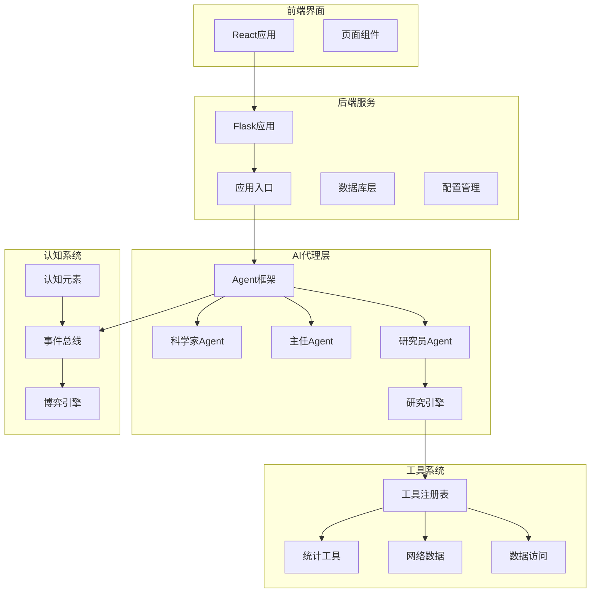
```mermaid
graph TB
subgraph "后端服务"
Flask[Flask应用]
App[应用入口]
DB[数据库层]
Config[配置管理]
end
subgraph "AI代理层"
Framework[Agent框架]
Scientist[科学家Agent]
Director[主任Agent]
Researcher[研究员Agent]
Engine[研究引擎]
end
subgraph "认知系统"
Cognitive[认知元素]
EventBus[事件总线]
Deliberation[博弈引擎]
end
subgraph "工具系统"
Registry[工具注册表]
Stats[统计工具]
WebData[网络数据]
DataAccess[数据访问]
end
subgraph "前端界面"
React[React应用]
Pages[页面组件]
end
Flask --> App
App --> Framework
Framework --> Scientist
Framework --> Director
Framework --> Researcher
Researcher --> Engine
Engine --> Registry
Registry --> Stats
Registry --> WebData
Registry --> DataAccess
Framework --> EventBus
EventBus --> Deliberation
Cognitive --> EventBus
React --> Flask
```

**图表来源**
- [app.py:1-1054](file://app.py#L1-L1054)
- [agents/framework.py:1-1258](file://agents/framework.py#L1-L1258)
- [engines/three_round.py:1-558](file://engines/three_round.py#L1-L558)

**章节来源**
- [README.md:186-211](file://README.md#L186-L211)
- [app.py:12-40](file://app.py#L12-L40)

## 核心组件

### Agent框架系统

AInstein实现了6种功能性角色的Agent框架，每个角色代表不同的思维偏好与专长：

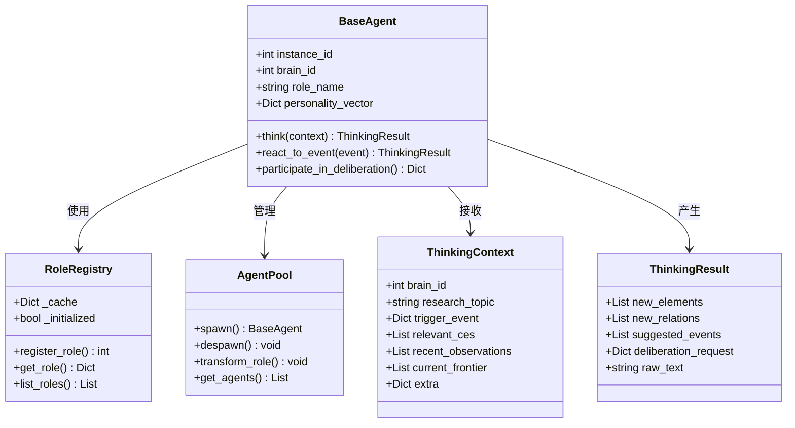
```mermaid
classDiagram
class BaseAgent {
+int instance_id
+int brain_id
+string role_name
+Dict personality_vector
+think(context) ThinkingResult
+react_to_event(event) ThinkingResult
+participate_in_deliberation() Dict
}
class RoleRegistry {
+Dict _cache
+bool _initialized
+register_role() int
+get_role() Dict
+list_roles() List
}
class AgentPool {
+spawn() BaseAgent
+despawn() void
+transform_role() void
+get_agents() List
}
class ThinkingContext {
+int brain_id
+string research_topic
+Dict trigger_event
+List relevant_ces
+List recent_observations
+List current_frontier
+Dict extra
}
class ThinkingResult {
+List new_elements
+List new_relations
+List suggested_events
+Dict deliberation_request
+string raw_text
}
BaseAgent --> RoleRegistry : 使用
BaseAgent --> AgentPool : 管理
BaseAgent --> ThinkingContext : 接收
BaseAgent --> ThinkingResult : 产生
```

**图表来源**
- [agents/framework.py:388-800](file://agents/framework.py#L388-L800)

### 认知元素体系

系统实现了完整的认知元素层次体系，包含12种类型和10种关系：

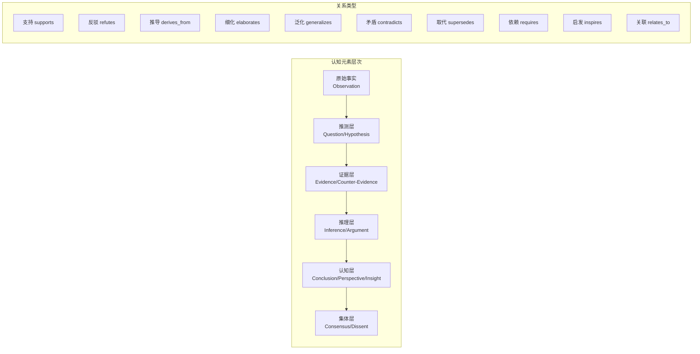
```mermaid
graph LR
subgraph "认知元素层次"
L0[原始事实<br/>Observation]
L1[推测层<br/>Question/Hypothesis]
L2[证据层<br/>Evidence/Counter-Evidence]
L3[推理层<br/>Inference/Argument]
L4[认知层<br/>Conclusion/Perspective/Insight]
L5[集体层<br/>Consensus/Dissent]
end
subgraph "关系类型"
R1[支持 supports]
R2[反驳 refutes]
R3[推导 derives_from]
R4[细化 elaborates]
R5[泛化 generalizes]
R6[矛盾 contradicts]
R7[取代 supersedes]
R8[依赖 requires]
R9[启发 inspires]
R10[关联 relates_to]
end
L0 --> L1
L1 --> L2
L2 --> L3
L3 --> L4
L4 --> L5
```

**图表来源**
- [cognitive.py:23-51](file://cognitive.py#L23-L51)

### 研究引擎系统

三轮研究引擎提供了完整的假设生成、验证和总结流程：

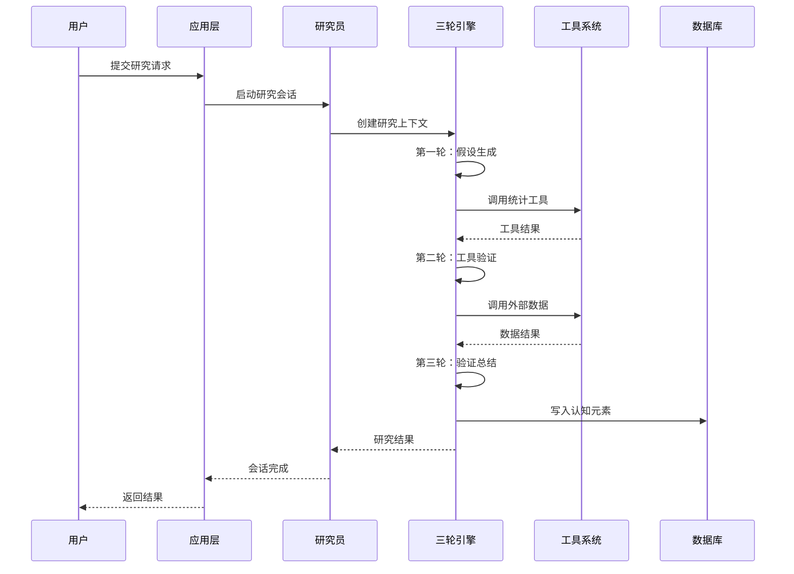
```mermaid
sequenceDiagram
participant User as 用户
participant App as 应用层
participant Researcher as 研究员
participant Engine as 三轮引擎
participant Tools as 工具系统
participant DB as 数据库
User->>App : 提交研究请求
App->>Researcher : 启动研究会话
Researcher->>Engine : 创建研究上下文
Engine->>Engine : 第一轮：假设生成
Engine->>Tools : 调用统计工具
Tools-->>Engine : 工具结果
Engine->>Engine : 第二轮：工具验证
Engine->>Tools : 调用外部数据
Tools-->>Engine : 数据结果
Engine->>Engine : 第三轮：验证总结
Engine->>DB : 写入认知元素
Engine-->>Researcher : 研究结果
Researcher-->>App : 会话完成
App-->>User : 返回结果
```

**图表来源**
- [engines/three_round.py:146-387](file://engines/three_round.py#L146-L387)

**章节来源**
- [agents/framework.py:57-106](file://agents/framework.py#L57-L106)
- [cognitive.py:23-51](file://cognitive.py#L23-L51)
- [engines/three_round.py:75-81](file://engines/three_round.py#L75-L81)

## 架构概览

AInstein采用事件驱动的架构模式，实现了从传统定时任务到AI-to-AI事件驱动的演进：

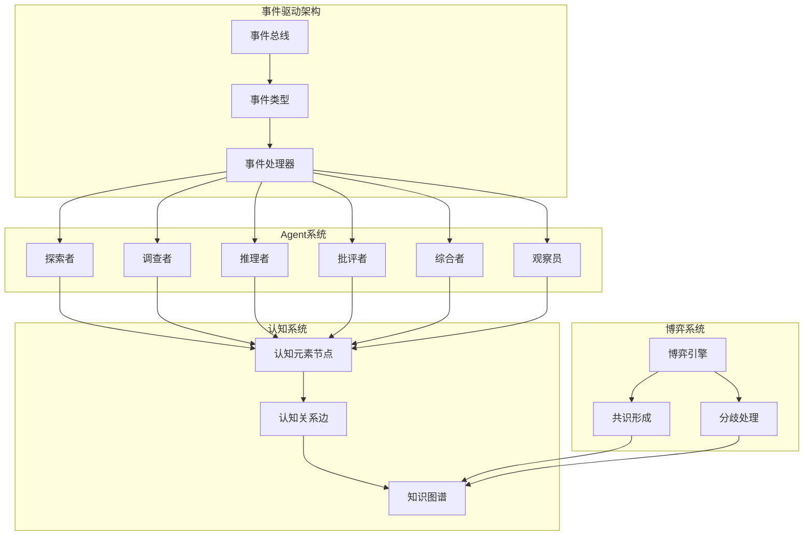
```mermaid
graph TB
subgraph "事件驱动架构"
EventBus[事件总线]
EventTypes[事件类型]
EventHandlers[事件处理器]
end
subgraph "Agent系统"
Explorer[探索者]
Investigator[调查者]
Reasoner[推理者]
Critic[批评者]
Synthesizer[综合者]
Observer[观察员]
end
subgraph "认知系统"
CENodes[认知元素节点]
CERelations[认知关系边]
KnowledgeGraph[知识图谱]
end
subgraph "博弈系统"
Deliberation[博弈引擎]
Consensus[共识形成]
Dissent[分歧处理]
end
EventBus --> EventTypes
EventTypes --> EventHandlers
EventHandlers --> Explorer
EventHandlers --> Investigator
EventHandlers --> Reasoner
EventHandlers --> Critic
EventHandlers --> Synthesizer
EventHandlers --> Observer
Explorer --> CENodes
Investigator --> CENodes
Reasoner --> CENodes
Critic --> CENodes
Synthesizer --> CENodes
Observer --> CENodes
CENodes --> CERelations
CERelations --> KnowledgeGraph
Deliberation --> Consensus
Deliberation --> Dissent
Consensus --> KnowledgeGraph
Dissent --> KnowledgeGraph
```

**图表来源**
- [event_bus.py:66-142](file://event_bus.py#L66-L142)
- [agents/framework.py:572-626](file://agents/framework.py#L572-L626)

### 数据流架构

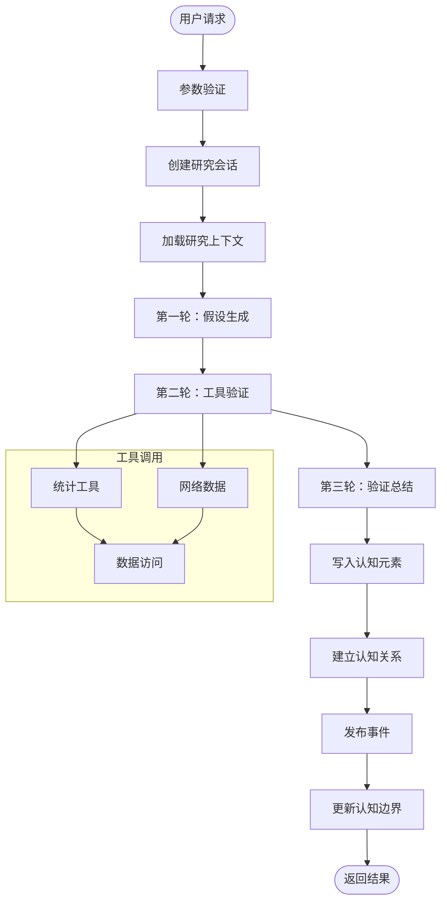
```mermaid
flowchart TD
Start([用户请求]) --> Validate[参数验证]
Validate --> CreateSession[创建研究会话]
CreateSession --> LoadContext[加载研究上下文]
LoadContext --> Round1[第一轮：假设生成]
Round1 --> Round2[第二轮：工具验证]
Round2 --> Round3[第三轮：验证总结]
Round3 --> WriteCE[写入认知元素]
WriteCE --> BuildRelations[建立认知关系]
BuildRelations --> PublishEvents[发布事件]
PublishEvents --> UpdateFrontier[更新认知边界]
UpdateFrontier --> End([返回结果])
subgraph "工具调用"
StatsTools[统计工具]
WebTools[网络数据]
DataAccess[数据访问]
end
Round2 --> StatsTools
Round2 --> WebTools
StatsTools --> DataAccess
WebTools --> DataAccess
```

**图表来源**
- [engines/three_round.py:189-387](file://engines/three_round.py#L189-L387)

**章节来源**
- [event_bus.py:162-294](file://event_bus.py#L162-L294)
- [app.py:512-688](file://app.py#L512-L688)

## 详细组件分析

### Agent框架组件

#### 角色系统设计

系统实现了6种核心角色，每种角色都有独特的思维偏好和专长：

| 角色 | 中文名称 | 核心职责 | 思维偏好 | 最擅长的CE类型 |
|------|----------|----------|----------|----------------|
| explorer | 探索者 | 发现新问题、提出新方向、拓展认知边界 | 好奇心驱动，偏向发散思维 | question, observation, hypothesis |
| investigator | 调查者 | 收集证据、验证假设、执行数据分析 | 严谨求证，偏向工具使用 | evidence, counter_evidence, observation |
| reasoner | 推理者 | 逻辑推导、构建论证、形成结论 | 逻辑优先，注重因果链 | inference, argument, conclusion |
| critic | 批评者 | 质疑假设、发现漏洞、提出反驳 | 怀疑论倾向，寻找反例 | counter_evidence, dissent |
| synthesizer | 综合者 | 整合多方观点、发现跨领域洞察 | 全局视角，寻找模式 | insight, perspective, consensus |
| observer | 观察员 | 监控大脑状态、总结思考进展 | 元认知视角，关注过程 | insight |

#### Agent生命周期管理

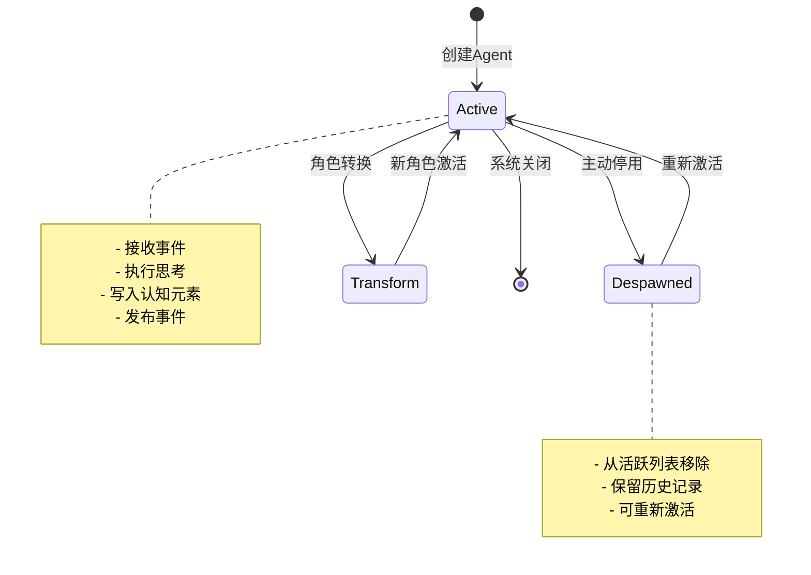
```mermaid
stateDiagram-v2
[*] --> Active : 创建Agent
Active --> Despawned : 主动停用
Active --> Transform : 角色转换
Transform --> Active : 新角色激活
Despawned --> Active : 重新激活
Active --> [*] : 系统关闭
note right of Active
- 接收事件
- 执行思考
- 写入认知元素
- 发布事件
end note
note right of Despawned
- 从活跃列表移除
- 保留历史记录
- 可重新激活
end note
```

**图表来源**
- [agents/framework.py:182-300](file://agents/framework.py#L182-L300)

**章节来源**
- [agents/framework.py:57-106](file://agents/framework.py#L57-L106)
- [agents/framework.py:182-300](file://agents/framework.py#L182-L300)

### 认知元素系统

#### 数据模型设计

认知元素系统采用了严格的层次化设计，确保知识的结构化存储和高效查询：

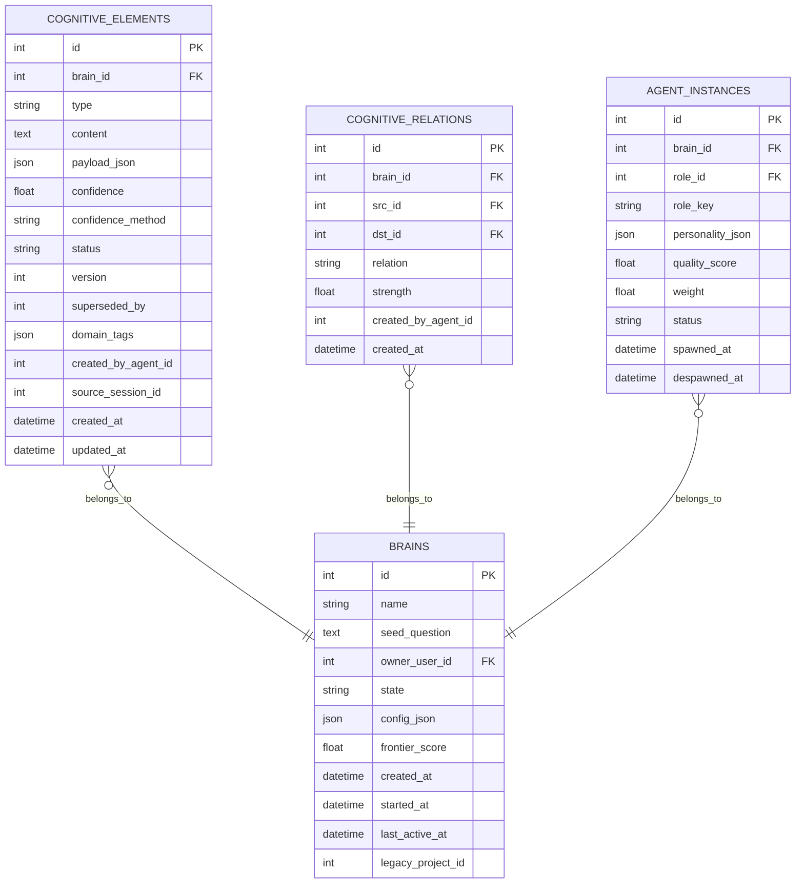
```mermaid
erDiagram
COGNITIVE_ELEMENTS {
int id PK
int brain_id FK
string type
text content
json payload_json
float confidence
string confidence_method
string status
int version
int superseded_by
json domain_tags
int created_by_agent_id
int source_session_id
datetime created_at
datetime updated_at
}
COGNITIVE_RELATIONS {
int id PK
int brain_id FK
int src_id FK
int dst_id FK
string relation
float strength
int created_by_agent_id
datetime created_at
}
AGENT_INSTANCES {
int id PK
int brain_id FK
int role_id FK
string role_key
json personality_json
float quality_score
float weight
string status
datetime spawned_at
datetime despawned_at
}
BRAINS {
int id PK
string name
text seed_question
int owner_user_id FK
string state
json config_json
float frontier_score
datetime created_at
datetime started_at
datetime last_active_at
int legacy_project_id
}
COGNITIVE_ELEMENTS }o--|| BRAINS : belongs_to
COGNITIVE_RELATIONS }o--|| BRAINS : belongs_to
AGENT_INSTANCES }o--|| BRAINS : belongs_to
```

**图表来源**
- [database.py:135-169](file://database.py#L135-L169)
- [database.py:181-194](file://database.py#L181-L194)

#### 置信度管理系统

系统实现了复杂的置信度更新机制，支持多种置信度来源和历史追踪：

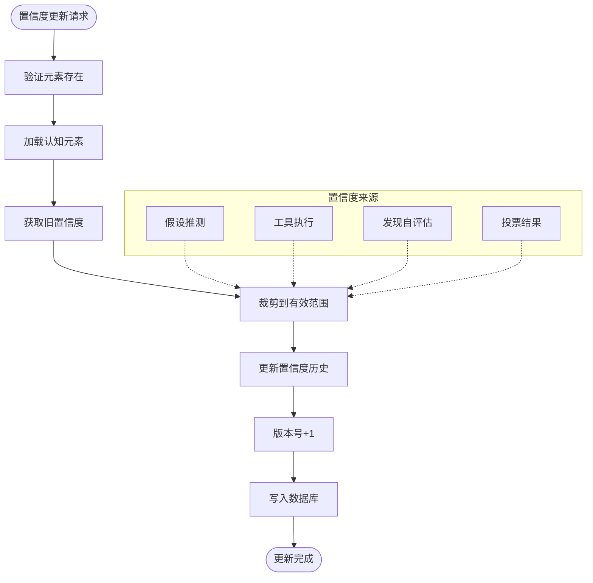
```mermaid
flowchart TD
Start([置信度更新请求]) --> Validate[验证元素存在]
Validate --> LoadCE[加载认知元素]
LoadCE --> GetOldConf[获取旧置信度]
GetOldConf --> ClampConf[裁剪到有效范围]
ClampConf --> UpdatePayload[更新置信度历史]
UpdatePayload --> IncrementVersion[版本号+1]
IncrementVersion --> WriteDB[写入数据库]
WriteDB --> End([更新完成])
subgraph "置信度来源"
Speculation[假设推测]
ToolExecution[工具执行]
FindingAssessment[发现自评估]
Vote[投票结果]
end
Speculation -.-> ClampConf
ToolExecution -.-> ClampConf
FindingAssessment -.-> ClampConf
Vote -.-> ClampConf
```

**图表来源**
- [cognitive.py:404-443](file://cognitive.py#L404-L443)

**章节来源**
- [cognitive.py:108-157](file://cognitive.py#L108-L157)
- [cognitive.py:404-443](file://cognitive.py#L404-L443)

### 研究引擎组件

#### 三轮引擎工作流程

三轮引擎实现了完整的假设驱动研究流程，每一轮都有明确的目标和输出：

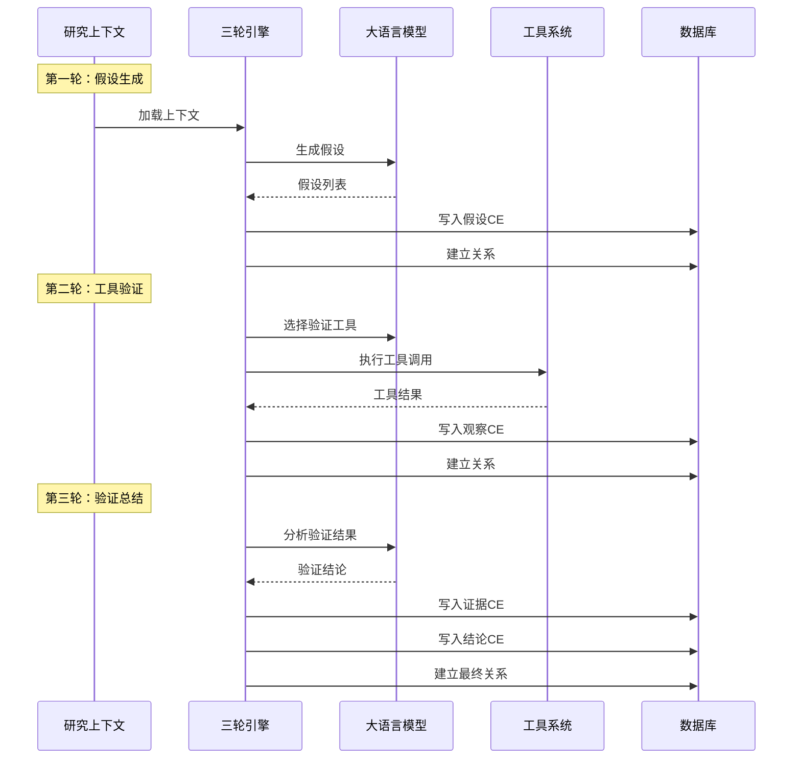
```mermaid
sequenceDiagram
participant Context as 研究上下文
participant Engine as 三轮引擎
participant LLM as 大语言模型
participant Tools as 工具系统
participant DB as 数据库
Note over Context : 第一轮：假设生成
Context->>Engine : 加载上下文
Engine->>LLM : 生成假设
LLM-->>Engine : 假设列表
Engine->>DB : 写入假设CE
Engine->>DB : 建立关系
Note over Context : 第二轮：工具验证
Engine->>LLM : 选择验证工具
Engine->>Tools : 执行工具调用
Tools-->>Engine : 工具结果
Engine->>DB : 写入观察CE
Engine->>DB : 建立关系
Note over Context : 第三轮：验证总结
Engine->>LLM : 分析验证结果
LLM-->>Engine : 验证结论
Engine->>DB : 写入证据CE
Engine->>DB : 写入结论CE
Engine->>DB : 建立最终关系
```

**图表来源**
- [engines/three_round.py:146-387](file://engines/three_round.py#L146-L387)

#### 工具系统集成

系统集成了丰富的工具生态系统，支持统计分析和外部数据获取：

| 工具类别 | 工具名称 | 功能描述 | 输入参数 |
|----------|----------|----------|----------|
| 统计分析 | descriptive_stats | 描述性统计分析 | dataset, columns |
| 统计分析 | correlation | 相关性分析 | dataset, col_a, col_b, method |
| 统计分析 | t_test | 独立样本t检验 | dataset, col, group_col, group_a, group_b |
| 统计分析 | regression | 多元线性回归 | dataset, y_col, x_cols |
| 统计分析 | anomaly_detection | 异常检测 | dataset, col, method, threshold |
| 统计分析 | distribution_fit | 分布拟合检验 | dataset, col |
| 统计分析 | group_stats | 分组统计 | dataset, value_col, group_col |
| 网络数据 | web_search | 网络搜索 | query, num_results |
| 网络数据 | wikipedia_search | 维基百科搜索 | query, lang, limit |
| 网络数据 | arxiv_search | arXiv论文搜索 | query, max_results |
| 网络数据 | google_trends | Google趋势分析 | query, geo, timeframe |

**章节来源**
- [engines/three_round.py:146-387](file://engines/three_round.py#L146-L387)
- [tools/registry.py:57-181](file://tools/registry.py#L57-L181)

### 博弈引擎组件

#### 博弈流程设计

博弈引擎实现了去中心化的观点博弈机制，支持多种结果状态：

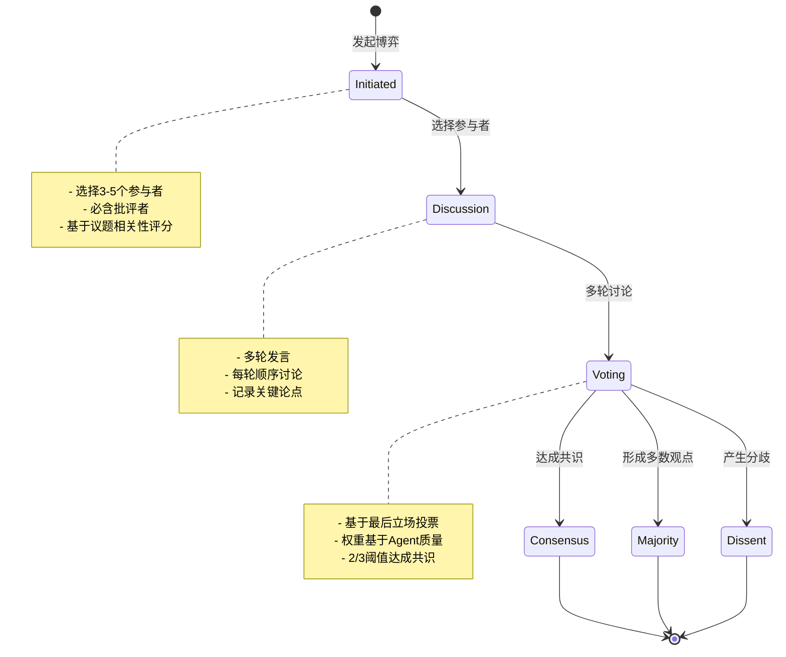
```mermaid
stateDiagram-v2
[*] --> Initiated : 发起博弈
Initiated --> Discussion : 选择参与者
Discussion --> Voting : 多轮讨论
Voting --> Consensus : 达成共识
Voting --> Majority : 形成多数观点
Voting --> Dissent : 产生分歧
Consensus --> [*]
Majority --> [*]
Dissent --> [*]
note right of Initiated
- 选择3-5个参与者
- 必含批评者
- 基于议题相关性评分
end note
note right of Discussion
- 多轮发言
- 每轮顺序讨论
- 记录关键论点
end note
note right of Voting
- 基于最后立场投票
- 权重基于Agent质量
- 2/3阈值达成共识
end note
```

**图表来源**
- [deliberation.py:121-543](file://deliberation.py#L121-L543)

#### 结果生成机制

博弈结束后会生成相应的认知元素来记录讨论结果：

| 结果类型 | CE类型 | 关系类型 | 置信度来源 | 描述 |
|----------|--------|----------|------------|------|
| Consensus | consensus | supports | 加权赞成比例 | 达成完全共识 |
| Majority | perspective | relates_to | 加权赞成比例 | 形成多数观点 |
| Dissent | dissent | contradicts | 0.5 | 产生分歧意见 |

**章节来源**
- [deliberation.py:121-543](file://deliberation.py#L121-L543)
- [deliberation.py:696-779](file://deliberation.py#L696-L779)

### ThinkingContext增强组件

#### 研究主题管理增强

**更新** 新增research_topic字段，强化AI代理思维框架的研究主题管理能力和一致性机制

系统在ThinkingContext类中新增了research_topic字段，确保所有Agent的思考都围绕核心研究主题展开：

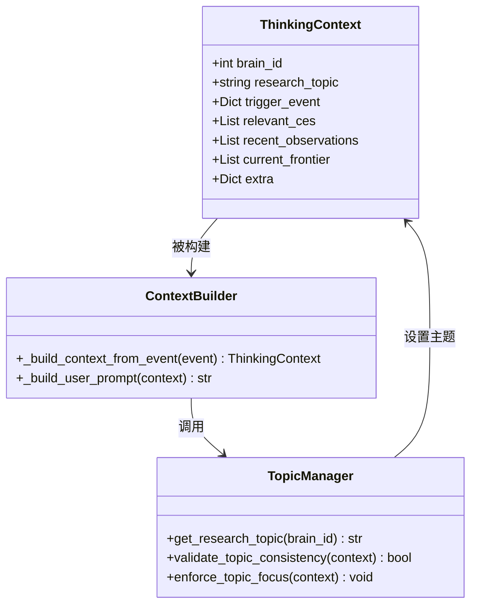
```mermaid
classDiagram
class ThinkingContext {
+int brain_id
+string research_topic
+Dict trigger_event
+List relevant_ces
+List recent_observations
+List current_frontier
+Dict extra
}
class ContextBuilder {
+_build_context_from_event(event) ThinkingContext
+_build_user_prompt(context) str
}
class TopicManager {
+get_research_topic(brain_id) str
+validate_topic_consistency(context) bool
+enforce_topic_focus(context) void
}
ThinkingContext --> ContextBuilder : 被构建
ContextBuilder --> TopicManager : 调用
TopicManager --> ThinkingContext : 设置主题
```

**图表来源**
- [agents/framework.py:114-140](file://agents/framework.py#L114-L140)
- [agents/framework.py:594-644](file://agents/framework.py#L594-L644)

#### 上下文装配增强

**更新** 优化事件上下文装配，自动从brains表读取seed_question作为研究课题

系统在事件上下文装配过程中，会自动从brains表读取seed_question作为研究课题（research_topic），确保Agent永远知道在研究什么：

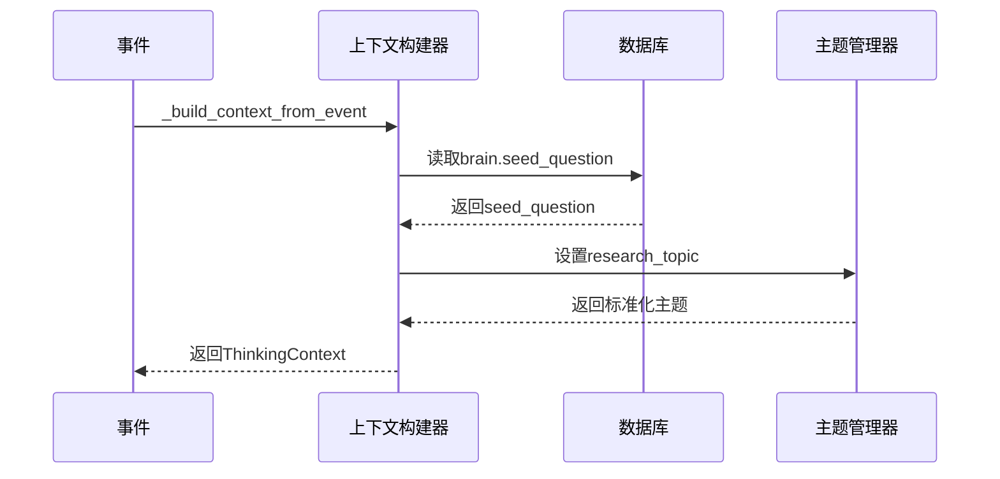
```mermaid
sequenceDiagram
participant Event as 事件
participant Builder as 上下文构建器
participant DB as 数据库
participant Topic as 主题管理器
Event->>Builder : _build_context_from_event
Builder->>DB : 读取brain.seed_question
DB-->>Builder : 返回seed_question
Builder->>Topic : 设置research_topic
Topic-->>Builder : 返回标准化主题
Builder-->>Event : 返回ThinkingContext
```

**图表来源**
- [agents/framework.py:628-644](file://agents/framework.py#L628-L644)

**章节来源**
- [agents/framework.py:114-140](file://agents/framework.py#L114-L140)
- [agents/framework.py:594-644](file://agents/framework.py#L594-L644)
- [agents/framework.py:646-654](file://agents/framework.py#L646-L654)

## 依赖关系分析

### 外部依赖

系统的主要外部依赖包括：

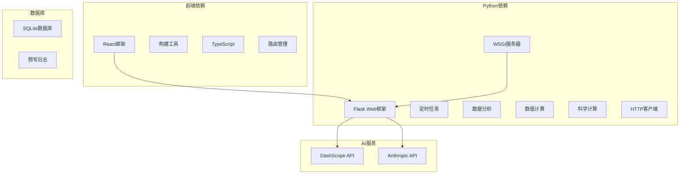
```mermaid
graph TB
subgraph "Python依赖"
Flask[Flask Web框架]
Gunicorn[WSGI服务器]
APScheduler[定时任务]
Pandas[数据分析]
Numpy[数值计算]
Scipy[科学计算]
Requests[HTTP客户端]
end
subgraph "前端依赖"
React[React框架]
Vite[构建工具]
TypeScript[TypeScript]
ReactRouter[路由管理]
end
subgraph "数据库"
SQLite[SQLite数据库]
WAL[预写日志]
end
subgraph "AI服务"
DashScope[DashScope API]
Anthropic[Anthropic API]
end
Flask --> DashScope
Flask --> Anthropic
React --> Flask
Gunicorn --> Flask
```

**图表来源**
- [README.md:117-127](file://README.md#L117-L127)

### 内部模块依赖

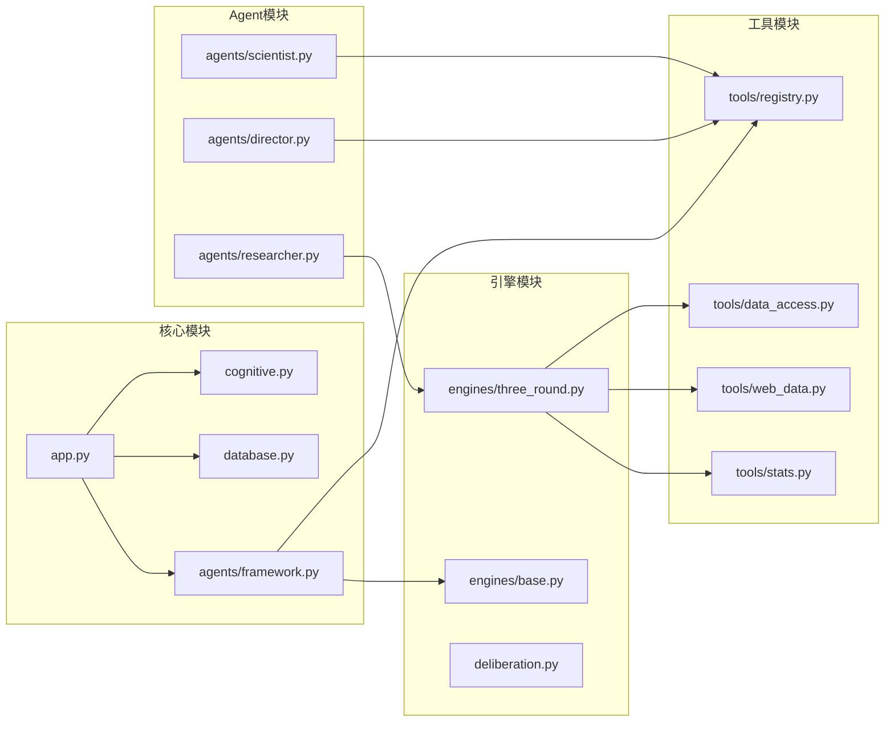
```mermaid
graph LR
subgraph "核心模块"
App[app.py]
Framework[agents/framework.py]
Database[database.py]
Cognitive[cognitive.py]
end
subgraph "引擎模块"
BaseEngine[engines/base.py]
ThreeRound[engines/three_round.py]
Deliberation[deliberation.py]
end
subgraph "工具模块"
Registry[tools/registry.py]
Stats[tools/stats.py]
WebData[tools/web_data.py]
DataAccess[tools/data_access.py]
end
subgraph "Agent模块"
Scientist[agents/scientist.py]
Director[agents/director.py]
Researcher[agents/researcher.py]
end
App --> Framework
App --> Database
App --> Cognitive
Framework --> BaseEngine
Framework --> Registry
Researcher --> ThreeRound
ThreeRound --> Stats
ThreeRound --> WebData
ThreeRound --> DataAccess
Scientist --> Registry
Director --> Registry
```

**图表来源**
- [app.py:16-40](file://app.py#L16-L40)
- [engines/base.py:42-53](file://engines/base.py#L42-L53)

**章节来源**
- [README.md:117-127](file://README.md#L117-L127)
- [app.py:16-40](file://app.py#L16-L40)

## 性能考虑

### 数据库性能优化

系统采用了SQLite作为主要存储引擎，通过以下方式优化性能：

1. **WAL模式**：启用预写日志模式提高并发性能
2. **索引优化**：为常用查询字段建立复合索引
3. **批量操作**：支持批量插入和更新减少IO开销
4. **连接池**：使用上下文管理器确保连接正确释放

### 事件处理性能

事件总线系统实现了高效的事件分发机制：

1. **内存缓存**：事件处理器注册表使用内存缓存
2. **异步处理**：支持多线程事件处理
3. **幂等消费**：避免重复处理提高可靠性
4. **批量重放**：支持事件丢失后的批量恢复

### Agent并发管理

系统支持多Agent并发执行：

1. **线程安全**：所有共享状态使用锁保护
2. **资源限制**：支持Agent配额控制防止资源耗尽
3. **健康检查**：监控Agent状态及时发现异常
4. **优雅降级**：单个Agent失败不影响整体系统

### 研究主题一致性优化

**新增** 优化研究主题一致性检查，提升系统稳定性

系统在上下文装配过程中增加了研究主题一致性检查机制：

1. **主题提取优化**：从brains表稳定提取seed_question
2. **空值处理**：提供默认主题占位符避免空主题
3. **一致性验证**：确保所有Agent围绕相同主题思考
4. **主题焦点强制**：在用户提示中强制强调主题重要性

**章节来源**
- [agents/framework.py:628-644](file://agents/framework.py#L628-L644)
- [agents/framework.py:646-654](file://agents/framework.py#L646-L654)

## 故障排除指南

### 常见问题诊断

#### 数据库连接问题

**症状**：应用启动时报数据库连接错误

**解决方案**：
1. 检查数据库文件路径配置
2. 验证数据库文件权限设置
3. 确认SQLite扩展已正确安装
4. 检查磁盘空间是否充足

#### Agent初始化失败

**症状**：Agent无法正常启动或频繁崩溃

**解决方案**：
1. 检查角色配置是否正确
2. 验证LLM API密钥有效性
3. 确认Agent内存配置合理
4. 查看Agent日志获取详细错误信息

#### 事件处理异常

**症状**：事件无法正常分发或重复处理

**解决方案**：
1. 检查事件类型注册情况
2. 验证事件处理器函数签名
3. 确认事件消费记录正常
4. 检查数据库事务状态

#### 研究主题缺失问题

**症状**：Agent无法确定研究主题或思考偏离主题

**解决方案**：
1. 检查brains表seed_question字段是否存在
2. 验证数据库连接和权限
3. 确认上下文装配逻辑正常执行
4. 查看日志中research_topic提取过程

### 调试技巧

1. **启用详细日志**：设置日志级别为DEBUG获取完整调用链
2. **使用测试模式**：在测试环境中模拟各种异常场景
3. **监控资源使用**：定期检查CPU、内存、磁盘使用情况
4. **性能基准测试**：对关键路径进行性能测试和优化

**章节来源**
- [database.py:288-311](file://database.py#L288-L311)
- [event_bus.py:315-361](file://event_bus.py#L315-L361)

## 结论

AInstein项目展现了构建自主思考AI系统的前沿探索。通过实现去中心化的Agent框架、事件驱动架构和认知元素系统，该项目为未来的智能体发展奠定了坚实基础。

### 技术成就

1. **架构创新**：从传统定时任务转向AI-to-AI事件驱动
2. **认知建模**：建立了完整的认知元素层次体系
3. **工具集成**：提供了丰富的数据分析和外部数据获取能力
4. **博弈机制**：实现了去中心化的观点博弈和共识形成
5. **主题一致性**：通过research_topic字段强化了研究主题管理能力

### 未来发展方向

根据项目路线图，未来将重点推进：

1. **Phase 0：基础设施** - 完善事件总线和认知元素体系
2. **Phase 1：知识图谱** - 构建思维网络和可视化系统
3. **Phase 2：Agent重构** - 实现完全去中心化的Agent交互
4. **Phase 3：博弈引擎** - 建立成熟的观点博弈和决策机制
5. **Phase 4：可视化** - 开发力导向图和上帝视角仪表盘
6. **Phase 5：用户系统** - 实现封闭观察模式

AInstein项目不仅是一个技术实验，更是对人工智能未来发展路径的重要探索。通过持续的迭代和改进，这个项目有望为构建真正具备自主意识的AI系统提供宝贵的实践经验。

**更新** 本次更新特别强化了AI代理思维框架的研究主题管理能力，通过新增research_topic字段和优化上下文装配机制，确保所有Agent的思考都围绕核心研究主题展开，为构建真正具备自主意识的硅基大脑奠定了更加坚实的基础。