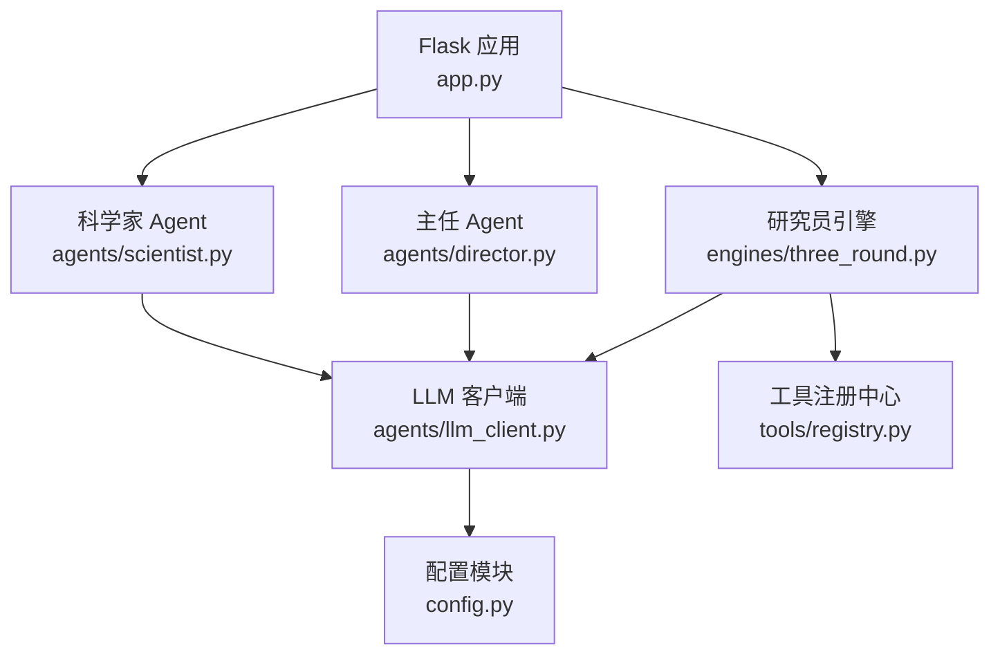
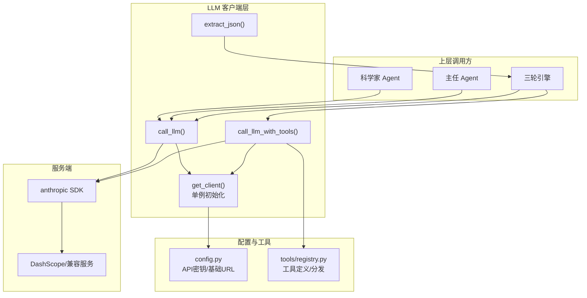
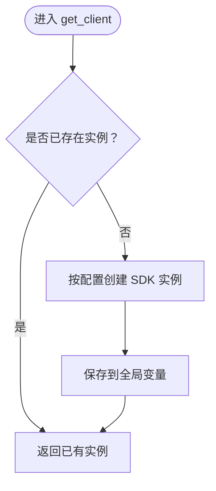
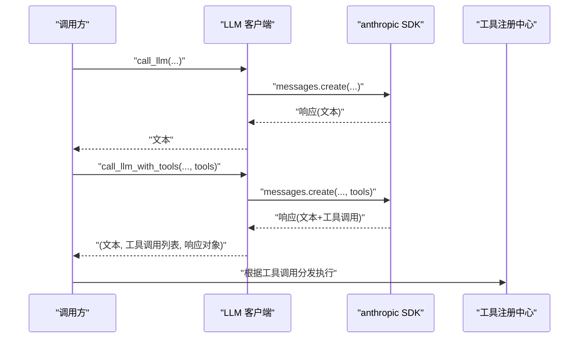
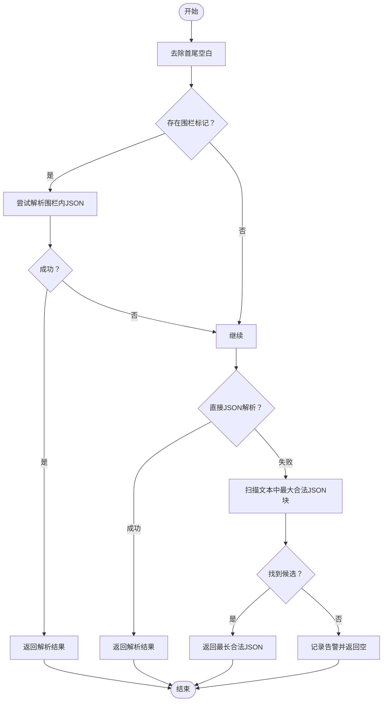
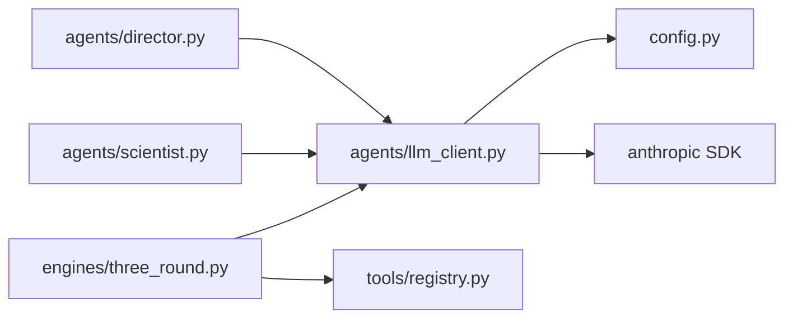

# LLM客户端设计

<cite>
**本文引用的文件**
- [agents/llm_client.py](file://agents/llm_client.py)
- [config.py](file://config.py)
- [agents/scientist.py](file://agents/scientist.py)
- [agents/director.py](file://agents/director.py)
- [engines/three_round.py](file://engines/three_round.py)
- [tools/registry.py](file://tools/registry.py)
- [README.md](file://README.md)
</cite>

## 目录
1. [引言](#引言)
2. [项目结构](#项目结构)
3. [核心组件](#核心组件)
4. [架构总览](#架构总览)
5. [详细组件分析](#详细组件分析)
6. [依赖分析](#依赖分析)
7. [性能考虑](#性能考虑)
8. [故障排除指南](#故障排除指南)
9. [结论](#结论)
10. [附录](#附录)

## 引言
本设计文档聚焦于DashScope（或兼容Anthropic协议）的LLM客户端实现，系统阐述其单例模式、初始化与配置、API密钥与基础URL管理、核心方法call_llm与call_llm_with_tools的差异与使用场景、JSON提取机制（含Markdown代码块处理、正则匹配与容错解析）、错误处理与日志记录，并给出使用示例与最佳实践。

## 项目结构
- 后端采用Flask应用入口，LLM客户端位于agents目录下，配置集中于config.py，研究引擎在engines目录，工具注册与实现位于tools目录。
- LLM客户端以DashScope兼容接口封装，底层基于anthropic SDK，通过单例模式复用连接，避免重复初始化带来的资源浪费。



图表来源
- [app.py:1-182](file://app.py#L1-L182)
- [agents/scientist.py:1-75](file://agents/scientist.py#L1-L75)
- [agents/director.py:1-124](file://agents/director.py#L1-L124)
- [engines/three_round.py:1-179](file://engines/three_round.py#L1-L179)
- [agents/llm_client.py:1-114](file://agents/llm_client.py#L1-L114)
- [config.py:1-11](file://config.py#L1-L11)
- [tools/registry.py:1-181](file://tools/registry.py#L1-L181)

章节来源
- [README.md:94-124](file://README.md#L94-L124)

## 核心组件
- 单例客户端：通过全局变量缓存SDK实例，首次调用时按配置初始化，后续直接复用。
- 基础配置：从环境变量读取API密钥与基础URL，支持默认值与可覆盖项。
- 核心方法：
  - call_llm：标准文本对话，返回纯文本响应。
  - call_llm_with_tools：启用工具调用能力，返回文本与工具调用列表。
- JSON提取：多策略解析，优先Markdown围栏，其次直解，最后在文本中寻找最大合法JSON块。

章节来源
- [agents/llm_client.py:14-21](file://agents/llm_client.py#L14-L21)
- [agents/llm_client.py:24-44](file://agents/llm_client.py#L24-L44)
- [agents/llm_client.py:47-70](file://agents/llm_client.py#L47-L70)
- [agents/llm_client.py:73-113](file://agents/llm_client.py#L73-L113)
- [config.py:6-7](file://config.py#L6-L7)

## 架构总览
LLM客户端作为统一抽象层，向上为Agent与引擎提供一致的调用接口；向下对接DashScope（或兼容Anthropic协议）服务端点。工具调用链路通过工具注册中心实现动态扩展。



图表来源
- [agents/llm_client.py:14-21](file://agents/llm_client.py#L14-L21)
- [agents/llm_client.py:24-44](file://agents/llm_client.py#L24-L44)
- [agents/llm_client.py:47-70](file://agents/llm_client.py#L47-L70)
- [agents/llm_client.py:73-113](file://agents/llm_client.py#L73-L113)
- [config.py:6-7](file://config.py#L6-L7)
- [tools/registry.py:20-43](file://tools/registry.py#L20-L43)
- [engines/three_round.py:105-134](file://engines/three_round.py#L105-L134)

## 详细组件分析

### 单例模式与初始化
- 单例逻辑：模块级私有变量保存SDK实例，首次调用get_client时按配置创建，后续直接返回。
- 初始化参数：从配置模块读取API密钥与基础URL，确保与DashScope兼容端点一致。
- 适用场景：避免频繁建立/销毁连接，降低网络开销与延迟抖动。



图表来源
- [agents/llm_client.py:14-21](file://agents/llm_client.py#L14-L21)
- [config.py:6-7](file://config.py#L6-L7)

章节来源
- [agents/llm_client.py:14-21](file://agents/llm_client.py#L14-L21)
- [config.py:6-7](file://config.py#L6-L7)

### 客户端初始化配置
- API密钥：从环境变量读取，若未设置则为空字符串，需在部署时注入。
- 基础URL：默认指向DashScope兼容端点，可按需覆盖。
- 模型选择：通过调用方传入model参数指定具体模型名称。

章节来源
- [config.py:6-7](file://config.py#L6-L7)
- [agents/scientist.py:7-7](file://agents/scientist.py#L7-L7)
- [agents/director.py:7-7](file://agents/director.py#L7-L7)
- [engines/three_round.py:9-9](file://engines/three_round.py#L9-L9)

### call_llm 与 call_llm_with_tools 的区别与使用场景
- call_llm
  - 输入：model、system_prompt、messages、max_tokens、temperature。
  - 输出：纯文本响应。
  - 使用场景：不需要工具调用的常规对话与推理任务。
- call_llm_with_tools
  - 输入：额外包含tools定义。
  - 输出：文本、工具调用列表（包含工具名与参数）、完整响应对象。
  - 使用场景：需要让模型按预定义工具签名进行调用的智能体流程（如三轮引擎的工具验证阶段）。



图表来源
- [agents/llm_client.py:24-44](file://agents/llm_client.py#L24-L44)
- [agents/llm_client.py:47-70](file://agents/llm_client.py#L47-L70)
- [tools/registry.py:24-43](file://tools/registry.py#L24-L43)

章节来源
- [agents/llm_client.py:24-44](file://agents/llm_client.py#L24-L44)
- [agents/llm_client.py:47-70](file://agents/llm_client.py#L47-L70)

### 参数配置：max_tokens 与 temperature
- max_tokens
  - 控制单次请求的最大输出长度，影响成本与上下文占用。
  - 在不同Agent与引擎中按任务复杂度设置不同上限（如科学家与主任较高，三轮引擎各阶段适中）。
- temperature
  - 控制采样多样性，越低越稳定，越高越发散。
  - 三轮引擎在工具调用阶段采用较低温度以提升JSON输出稳定性。

章节来源
- [agents/scientist.py:47-47](file://agents/scientist.py#L47-L47)
- [agents/director.py:77-77](file://agents/director.py#L77-L77)
- [engines/three_round.py:66-66](file://engines/three_round.py#L66-L66)
- [engines/three_round.py:106-106](file://engines/three_round.py#L106-L106)
- [engines/three_round.py:160-160](file://engines/three_round.py#L160-L160)

### JSON提取功能实现机制
- 处理流程
  1) 去除首尾空白；
  2) 尝试Markdown围栏（```json ... ```）提取；
  3) 直接尝试整体JSON解析；
  4) 在文本中扫描最大合法JSON对象/数组块，优先最长者；
  5) 若仍失败，记录告警并返回空。
- 容错策略
  - 多路径解析，提升鲁棒性；
  - 最长候选优先，避免误切片段；
  - 日志记录失败片段前缀，便于定位问题。



图表来源
- [agents/llm_client.py](file://agents/llm_client.py#L73-L113)

章节来源
- [agents/llm_client.py](file://agents/llm_client.py#L73-L113)

### 错误处理与日志记录
- 统一日志：INFO记录token用量，ERROR记录调用失败原因，WARNING记录JSON解析失败。
- 异常传播：捕获异常后记录日志并重新抛出，保证上层可观测性与可恢复性。
- 建议实践：结合Flask日志配置与服务端日志聚合，定位模型调用瓶颈与工具执行异常。

章节来源
- [agents/llm_client.py](file://agents/llm_client.py#L40-L44)
- [agents/llm_client.py](file://agents/llm_client.py#L66-L70)
- [agents/llm_client.py](file://agents/llm_client.py#L112-L113)

### 客户端使用示例与最佳实践
- 示例路径
  - 科学家Agent调用：[agents/scientist.py](file://agents/scientist.py#L47-L48)
  - 主任Agent调用：[agents/director.py](file://agents/director.py#L77-L78)
  - 三轮引擎工具调用循环：[engines/three_round.py](file://engines/three_round.py#L105-L134)
- 最佳实践
  - 明确区分文本对话与工具调用场景，合理设置max_tokens与temperature。
  - 在工具调用阶段固定较低temperature，减少JSON格式偏差。
  - 使用extract_json统一解析模型输出，确保健壮性。
  - 为不同角色与任务设置独立模型参数，平衡质量与成本。

章节来源
- [agents/scientist.py](file://agents/scientist.py#L47-L48)
- [agents/director.py](file://agents/director.py#L77-L78)
- [engines/three_round.py](file://engines/three_round.py#L105-L134)

## 依赖分析
- 组件耦合
  - LLM客户端依赖配置模块与anthropic SDK，耦合度低，便于替换服务端。
  - 引擎与Agent通过统一接口调用，保持高内聚低耦合。
  - 工具调用链通过注册中心解耦，新增工具仅需扩展注册表。
- 外部依赖
  - anthropic SDK用于消息创建与流式内容解析。
  - 工具实现来自tools包内的统计与网络检索等模块。



图表来源
- [agents/llm_client.py:1-8](file://agents/llm_client.py#L1-L8)
- [config.py:1-11](file://config.py#L1-L11)
- [engines/three_round.py:1-10](file://engines/three_round.py#L1-L10)
- [tools/registry.py:1-10](file://tools/registry.py#L1-L10)

章节来源
- [agents/llm_client.py:1-8](file://agents/llm_client.py#L1-L8)
- [engines/three_round.py:1-10](file://engines/three_round.py#L1-L10)
- [tools/registry.py:1-10](file://tools/registry.py#L1-L10)

## 性能考虑
- 单例复用：避免重复初始化，降低握手与鉴权开销。
- 温度与token：在工具调用阶段降低temperature，减少无效重试；按任务规模调整max_tokens，控制成本。
- JSON解析：优先围栏与直解，避免全量扫描；当文本较长时，建议在提示工程中约束输出格式，提高命中率。
- 并发与线程：Agent触发的研究会话通常在后台线程执行，避免阻塞主请求。

## 故障排除指南
- 无法连接服务端
  - 检查API密钥与基础URL是否正确注入环境变量。
  - 确认网络可达性与代理配置。
- JSON解析失败
  - 查看日志中的告警片段，确认模型是否遵循了严格的JSON输出约定。
  - 在提示工程中强化“只输出JSON”约束，或在工具调用阶段强制temperature更低。
- 工具调用异常
  - 检查工具注册表是否包含所需工具定义。
  - 核对工具输入schema与调用参数是否匹配。

章节来源
- [agents/llm_client.py:112-113](file://agents/llm_client.py#L112-L113)
- [engines/three_round.py:105-134](file://engines/three_round.py#L105-L134)
- [tools/registry.py:20-43](file://tools/registry.py#L20-L43)

## 结论
该LLM客户端以单例模式与清晰的接口抽象，实现了对DashScope（或兼容Anthropic协议）服务的高效访问。通过call_llm与call_llm_with_tools的差异化设计，满足从简单对话到工具驱动的复杂推理需求；通过多策略JSON提取与完善的日志/异常处理，提升了系统的鲁棒性与可观测性。建议在生产环境中严格管理配置、优化提示工程，并结合日志与监控体系持续改进性能与稳定性。

## 附录
- 环境变量与默认值
  - API密钥与基础URL：从环境变量读取，提供默认值以便快速启动。
  - 模型名称：分别针对科学家、主任、研究员与通用研究场景配置。
- 相关文件路径
  - LLM客户端：[agents/llm_client.py:1-114](file://agents/llm_client.py#L1-L114)
  - 配置模块：[config.py:1-11](file://config.py#L1-L11)
  - 科学家Agent：[agents/scientist.py:1-75](file://agents/scientist.py#L1-L75)
  - 主任Agent：[agents/director.py:1-124](file://agents/director.py#L1-L124)
  - 三轮引擎：[engines/three_round.py:1-179](file://engines/three_round.py#L1-L179)
  - 工具注册中心：[tools/registry.py:1-181](file://tools/registry.py#L1-L181)