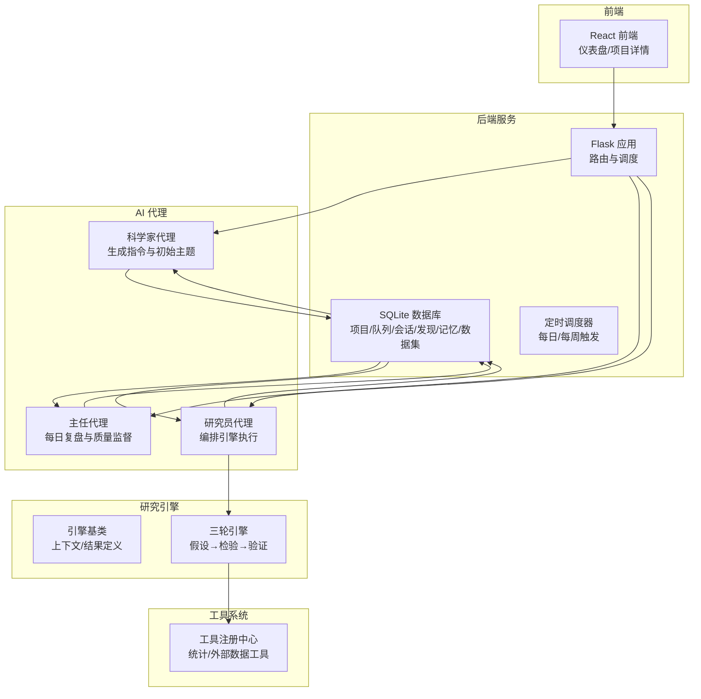
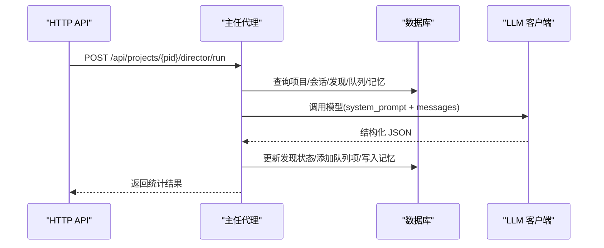
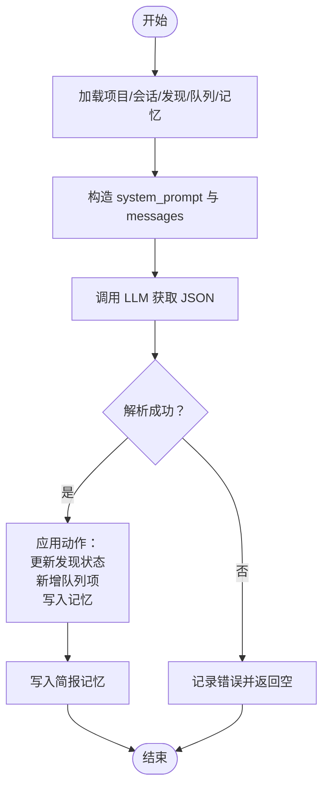
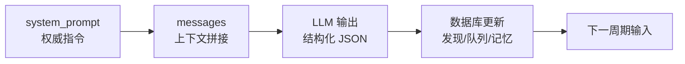
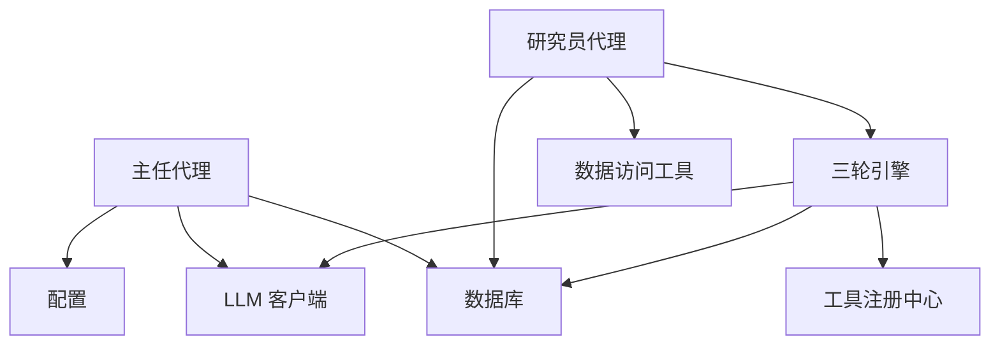

# 主任代理

<cite>
**本文引用的文件**
- [agents/director.py](file://agents/director.py)
- [prompts/director.txt](file://prompts/director.txt)
- [engines/base.py](file://engines/base.py)
- [engines/three_round.py](file://engines/three_round.py)
- [app.py](file://app.py)
- [agents/researcher.py](file://agents/researcher.py)
- [agents/scientist.py](file://agents/scientist.py)
- [config.py](file://config.py)
- [database.py](file://database.py)
- [tools/registry.py](file://tools/registry.py)
- [prompts/researcher.txt](file://prompts/researcher.txt)
- [prompts/three_round.txt](file://prompts/three_round.txt)
- [README.md](file://README.md)
</cite>

## 目录
1. [简介](#简介)
2. [项目结构](#项目结构)
3. [核心组件](#核心组件)
4. [架构总览](#架构总览)
5. [详细组件分析](#详细组件分析)
6. [依赖关系分析](#依赖关系分析)
7. [性能考量](#性能考量)
8. [故障排查指南](#故障排查指南)
9. [结论](#结论)
10. [附录](#附录)

## 简介
本文件面向“主任代理”的深入技术文档，围绕其在研究流程中的监督协调职能与管理机制展开，重点覆盖以下方面：
- 项目进度监控、质量控制、资源分配优化
- 决策算法与判断标准：研究质量评估、风险控制、优先级排序
- 提示词系统设计：system_prompt 的权威性、messages 的层级结构、跨代理协调策略
- 在整个研究流程中的关键作用：任务调度、结果审核、问题解决
- 配置选项与调优建议：不同场景下的最佳实践

## 项目结构
该系统采用三层 AI 团队协作：科学家制定战略、主任进行质量监督与日常调度、研究员执行三轮研究引擎。数据库层统一存储项目、队列、会话、发现与主任记忆等信息；工具注册中心提供统计与外部数据工具；前端通过 REST API 与后端交互。

图表来源
- [app.py:15-177](file://app.py#L15-L177)
- [agents/scientist.py:14-75](file://agents/scientist.py#L14-L75)
- [agents/director.py:14-124](file://agents/director.py#L14-L124)
- [agents/researcher.py:14-114](file://agents/researcher.py#L14-L114)
- [engines/base.py:11-49](file://engines/base.py#L11-L49)
- [engines/three_round.py:22-179](file://engines/three_round.py#L22-L179)
- [tools/registry.py:24-43](file://tools/registry.py#L24-L43)
- [database.py:101-344](file://database.py#L101-L344)

章节来源
- [README.md:71-124](file://README.md#L71-L124)
- [app.py:15-177](file://app.py#L15-L177)

## 核心组件
- 主任代理（agents/director.py）：每日对项目进行复盘，审核发现、调整队列、新增主题、积累记忆、撰写日报。
- 提示词系统（prompts/director.txt）：定义权威的系统角色、工作清单、返回格式与指导原则。
- 数据库接口（database.py）：提供项目、队列、会话、发现、主任记忆、数据集等 CRUD 与查询能力。
- 配置（config.py）：集中管理模型名称、API Key、基础 URL、数据目录等。
- 工具注册中心（tools/registry.py）：提供统计与外部数据工具的注册与分发。
- 研究引擎（engines/three_round.py）：三轮研究流程的具体实现，连接提示词、工具与数据库。
- 路由与调度（app.py）：对外暴露 REST API 并触发各代理与引擎。

章节来源
- [agents/director.py:14-124](file://agents/director.py#L14-L124)
- [prompts/director.txt:1-43](file://prompts/director.txt#L1-43)
- [database.py:101-344](file://database.py#L101-L344)
- [config.py:1-11](file://config.py#L1-L11)
- [tools/registry.py:24-43](file://tools/registry.py#L24-L43)
- [engines/three_round.py:22-179](file://engines/three_round.py#L22-L179)
- [app.py:15-177](file://app.py#L15-L177)

## 架构总览
主任代理在系统中的职责是“监督与协调”。它不直接执行数据分析，而是基于数据库中近期会话、开放发现、当前队列与主任记忆，通过 LLM 输出结构化 JSON，驱动对发现状态的变更、队列的增删改、新主题的生成以及知识记忆的积累。其输入来源于数据库聚合，输出驱动数据库更新，形成闭环。

图表来源
- [app.py:172-177](file://app.py#L172-L177)
- [agents/director.py:14-124](file://agents/director.py#L14-L124)
- [database.py:250-319](file://database.py#L250-L319)

## 详细组件分析

### 主任代理：监督与协调
- 输入数据聚合
  - 最近会话摘要（主题、状态、时长、发现）
  - 开放发现列表（ID、发现、置信度、类别、证据）
  - 当前研究队列（最多 20 条，含优先级、来源、状态）
  - 主任记忆（最近若干条，含类型与内容）
- 提示词与消息结构
  - system_prompt 来自 prompts/director.txt，包含使命与领域，强调审核、调整、更新指令、新增主题、积累记忆、撰写日报。
  - messages 为单条 user 内容，汇总上述输入，附加“执行每日复盘”的指令。
- 输出解析与数据库更新
  - findings_review：对发现进行验证/拒绝/保留，更新状态
  - new_topics：新增到队列，带优先级与来源
  - memory_entries：写入主任记忆，支持上下文数据
  - briefing：作为“简报”写入记忆
- 日志与返回
  - 记录处理数量与最终简报，便于审计与前端展示

图表来源
- [agents/director.py:14-124](file://agents/director.py#L14-L124)
- [prompts/director.txt:19-43](file://prompts/director.txt#L19-L43)
- [database.py:250-319](file://database.py#L250-L319)

章节来源
- [agents/director.py:14-124](file://agents/director.py#L14-L124)
- [prompts/director.txt:1-43](file://prompts/director.txt#L1-43)
- [database.py:250-319](file://database.py#L250-L319)

### 提示词系统设计：权威性、层级结构与跨代理协调
- system_prompt 的权威性
  - 明确角色定位（研究主任）、职责范围（审核、调整、更新、新增、记忆、简报），并给出严格返回格式与指导原则，确保输出可解析且可执行。
- messages 的层级结构
  - user 内容包含四部分：最近会话、开放发现、研究队列、主任记忆，最后附加“执行每日复盘”的指令，形成清晰的上下文边界。
- 跨代理协调策略
  - 主任代理依赖数据库中的“科学家指令”“研究员队列”“会话发现”“主任记忆”，通过统一的数据模型实现跨代理协同。
  - 与三轮引擎的衔接：研究员在会话中产生的发现与下一轮方向，成为主任复盘的重要输入。

图表来源
- [prompts/director.txt:19-43](file://prompts/director.txt#L19-L43)
- [agents/director.py:62-78](file://agents/director.py#L62-L78)
- [database.py:250-319](file://database.py#L250-L319)

章节来源
- [prompts/director.txt:1-43](file://prompts/director.txt#L1-L43)
- [agents/director.py:62-78](file://agents/director.py#L62-L78)
- [database.py:250-319](file://database.py#L250-L319)

### 决策算法与判断标准
- 发现质量评估
  - 指导原则强调对低置信度发现保持怀疑、验证强证据发现（如显著性阈值与效应量），并寻找跨会话的关联。
- 风险控制
  - 对持续无产出的主题降低优先级或移除，避免资源浪费。
- 优先级排序
  - 基于发现的置信度、类别、证据强度与跨会话一致性进行动态调整；新增主题时赋予合理优先级并标注来源。
- 新主题生成
  - 基于有趣发现生成后续研究问题，推动研究连续性与深度。

章节来源
- [prompts/director.txt:36-42](file://prompts/director.txt#L36-L42)
- [agents/director.py:84-111](file://agents/director.py#L84-L111)

### 在研究流程中的关键作用
- 任务调度
  - 通过队列管理淘汰过时主题、新增高价值主题、调整优先级，保障研究员聚焦有效方向。
- 结果审核
  - 对发现进行验证/拒绝/保留，提升整体研究质量与可信度。
- 问题解决
  - 通过主任记忆沉淀模式与决策依据，辅助后续会话与跨主题关联分析。

章节来源
- [agents/director.py:14-124](file://agents/director.py#L14-L124)
- [database.py:190-228](file://database.py#L190-L228)

### 与研究引擎的衔接
- 研究员代理在会话中产出 hypotheses、verification、findings、next_directions，这些数据被持久化到数据库，成为主任复盘的输入。
- 三轮引擎的提示词模板（three_round.txt）与研究员提示词（researcher.txt）共同定义了研究范式，保证输出具备可比性与可验证性。

章节来源
- [agents/researcher.py:14-114](file://agents/researcher.py#L14-L114)
- [engines/three_round.py:22-179](file://engines/three_round.py#L22-L179)
- [prompts/researcher.txt:1-14](file://prompts/researcher.txt#L1-L14)
- [prompts/three_round.txt:1-15](file://prompts/three_round.txt#L1-L15)

## 依赖关系分析
- 主任代理依赖
  - 数据库接口：查询项目、会话、发现、队列、记忆
  - LLM 客户端：调用模型并解析 JSON
  - 配置：选择模型名称
- 研究员代理依赖
  - 三轮引擎：执行研究流程
  - 数据访问工具：汇总数据集摘要
  - 数据库：创建会话、持久化结果
- 工具注册中心
  - 为引擎提供统计与外部数据工具的统一入口

图表来源
- [agents/director.py:6-7](file://agents/director.py#L6-L7)
- [agents/researcher.py:5-7](file://agents/researcher.py#L5-L7)
- [engines/three_round.py:6-9](file://engines/three_round.py#L6-L9)
- [tools/registry.py:24-43](file://tools/registry.py#L24-L43)
- [config.py:8-10](file://config.py#L8-L10)

章节来源
- [agents/director.py:6-7](file://agents/director.py#L6-L7)
- [agents/researcher.py:5-7](file://agents/researcher.py#L5-L7)
- [engines/three_round.py:6-9](file://engines/three_round.py#L6-L9)
- [tools/registry.py:24-43](file://tools/registry.py#L24-L43)
- [config.py:8-10](file://config.py#L8-L10)

## 性能考量
- 数据库查询限制
  - 会话与发现列表限制大小，避免一次性传输过多数据导致 LLM 上下文超限。
- 温度与令牌数
  - 主任代理使用适中温度与较大 max_tokens，平衡创造性与完整性。
- 工具调用循环
  - 三轮引擎对工具调用设置最大轮次，防止无限循环；同时在 R2/R3 中严格约束输出格式，提高解析成功率。
- 存储与索引
  - 数据库建立多处索引，加速队列、会话、发现、记忆、数据集等查询。

章节来源
- [agents/director.py:24-27](file://agents/director.py#L24-L27)
- [agents/director.py:77](file://agents/director.py#L77)
- [engines/three_round.py:103](file://engines/three_round.py#L103)
- [database.py:92-97](file://database.py#L92-L97)

## 故障排查指南
- LLM 输出解析失败
  - 现象：返回 JSON 为空或格式不符
  - 排查：检查 system_prompt 是否完整、messages 是否超出上下文、模型是否稳定
  - 影响：主任代理跳过本次复盘，返回 None
- 项目不存在
  - 现象：日志记录“项目未找到”
  - 排查：确认项目 ID 正确、数据库初始化正常
- 工具调用异常
  - 现象：工具返回 error 或抛出异常
  - 排查：确认工具名称正确、数据集存在、参数符合 schema
- 队列状态更新异常
  - 现象：队列项状态未按预期变化
  - 排查：核对 pick/update 逻辑与数据库事务

章节来源
- [agents/director.py:80-82](file://agents/director.py#L80-L82)
- [agents/director.py:17-19](file://agents/director.py#L17-L19)
- [tools/registry.py:24-43](file://tools/registry.py#L24-L43)
- [database.py:214-228](file://database.py#L214-L228)

## 结论
主任代理通过权威的提示词、严格的 JSON 输出规范与数据库驱动的闭环，实现了对研究流程的监督与协调。其在质量控制、资源分配优化与知识积累方面的贡献，使科学家的战略意图与研究员的执行成果得以有效衔接与持续演进。结合合理的配置与调优策略，可在不同研究场景下获得稳定、可解释且可扩展的产出。

## 附录

### 配置选项与调优建议
- 模型选择
  - DIRECTOR_MODEL：用于主任代理的模型名称，默认从环境变量读取
  - RESEARCH_MODEL、SCIENTIST_MODEL：分别用于研究员与科学家的模型名称
- 环境变量
  - DASHSCOPE_API_KEY、DASHSCOPE_BASE_URL：DashScope API 访问凭据与基础 URL
  - DATA_DIR：数据集存储目录
- 调优建议
  - 温度与 max_tokens：主任代理使用适中温度与较大 max_tokens，确保输出完整；研究员与科学家根据创造性需求微调
  - 上下文长度：控制会话/发现/队列的聚合规模，避免超过模型上下文上限
  - 工具调用轮次：根据数据复杂度与工具响应时间调整最大轮次，平衡成本与效果

章节来源
- [config.py:1-11](file://config.py#L1-L11)
- [agents/director.py:77](file://agents/director.py#L77)
- [engines/three_round.py:103](file://engines/three_round.py#L103)

### API 一览（与主任代理相关）
- GET /ainstein/api/projects/{pid}
- POST /ainstein/api/projects/{pid}/director/run
- GET /ainstein/api/projects/{pid}/findings
- GET /ainstein/api/projects/{pid}/queue
- GET /ainstein/api/projects/{pid}/memory

章节来源
- [app.py:60-66](file://app.py#L60-L66)
- [app.py:172-177](file://app.py#L172-L177)
- [app.py:109-114](file://app.py#L109-L114)
- [app.py:71-73](file://app.py#L71-L73)
- [app.py:167-170](file://app.py#L167-L170)