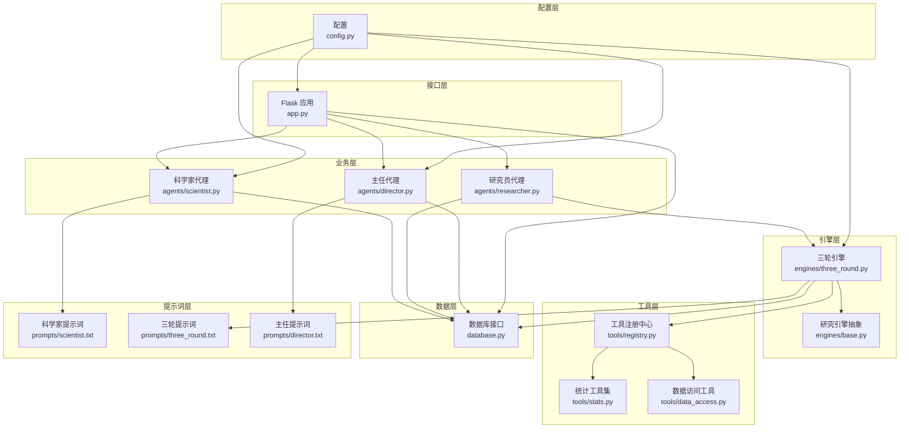
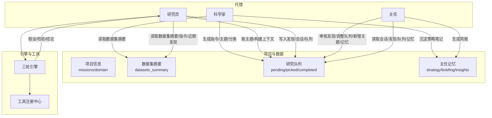
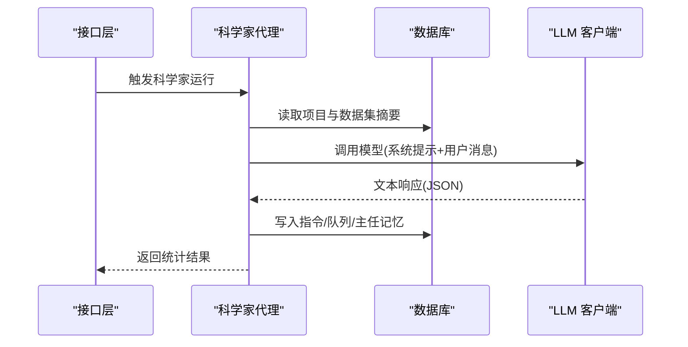
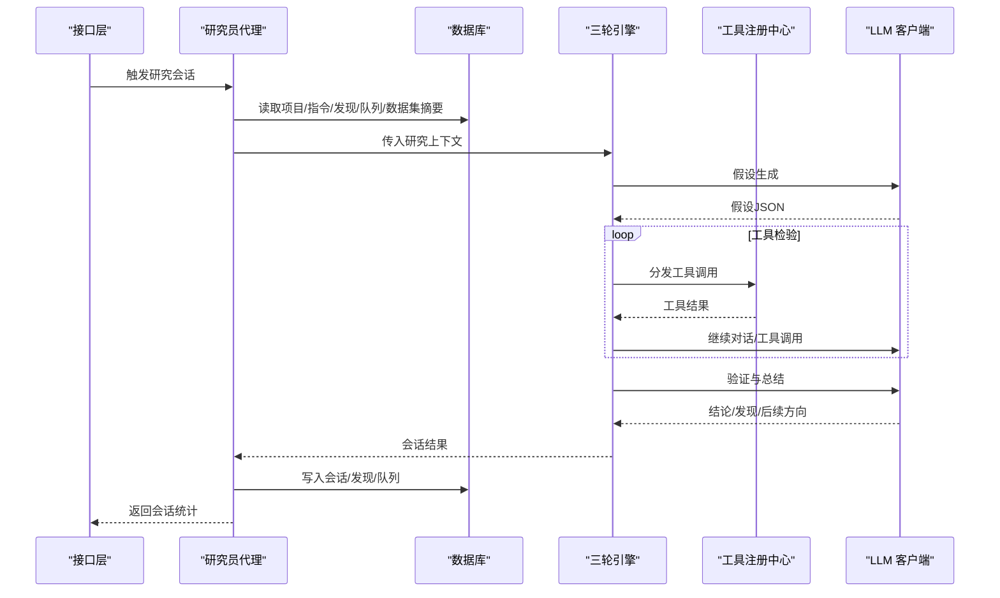
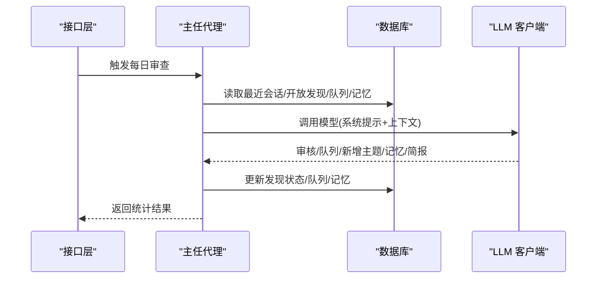
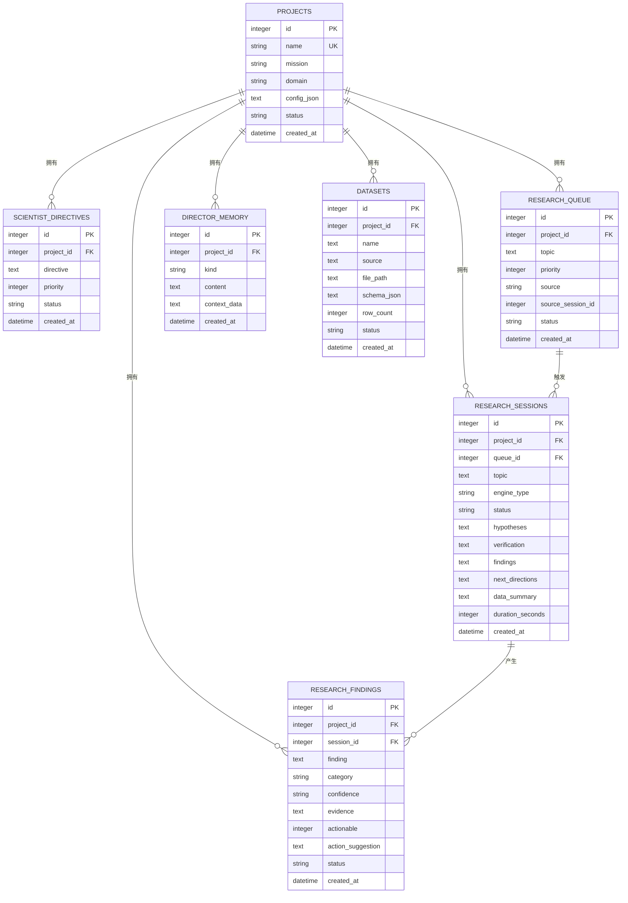
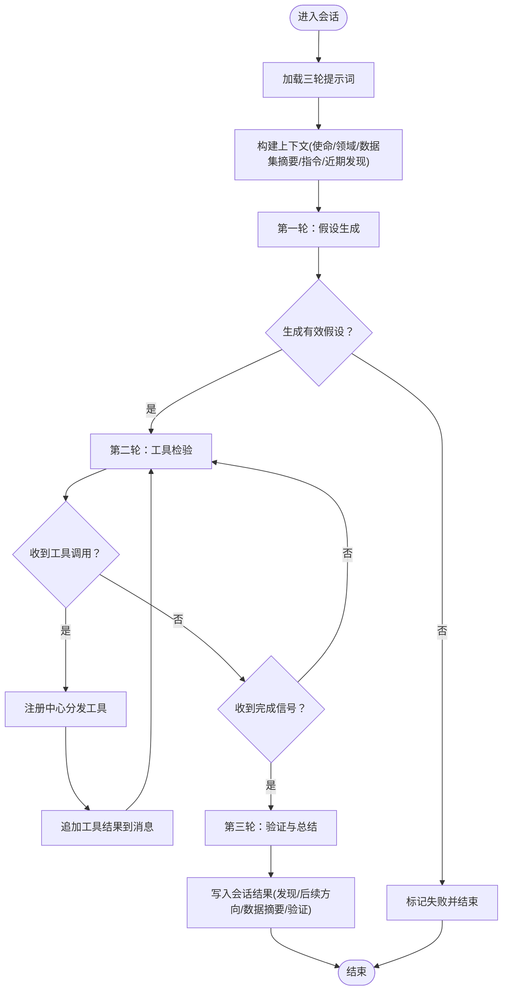
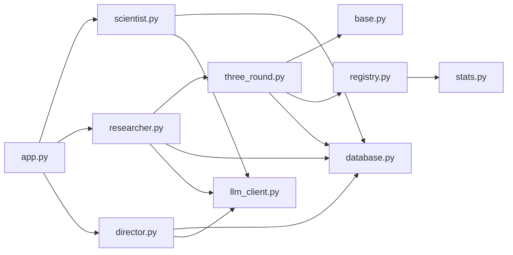
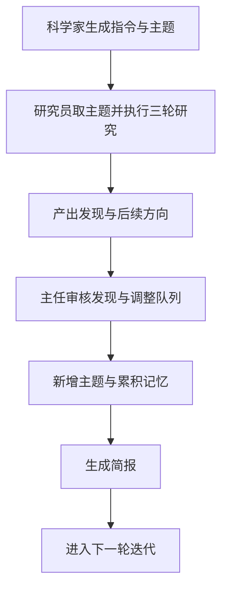

# 代理协作机制

<cite>
**本文档引用的文件**
- [agents/scientist.py](file://agents/scientist.py)
- [agents/researcher.py](file://agents/researcher.py)
- [agents/director.py](file://agents/director.py)
- [engines/base.py](file://engines/base.py)
- [engines/three_round.py](file://engines/three_round.py)
- [agents/llm_client.py](file://agents/llm_client.py)
- [tools/registry.py](file://tools/registry.py)
- [tools/data_access.py](file://tools/data_access.py)
- [database.py](file://database.py)
- [app.py](file://app.py)
- [prompts/scientist.txt](file://prompts/scientist.txt)
- [prompts/director.txt](file://prompts/director.txt)
- [prompts/three_round.txt](file://prompts/three_round.txt)
- [config.py](file://config.py)
- [tools/stats.py](file://tools/stats.py)
</cite>

## 目录
1. [引言](#引言)
2. [项目结构](#项目结构)
3. [核心组件](#核心组件)
4. [架构总览](#架构总览)
5. [详细组件分析](#详细组件分析)
6. [依赖关系分析](#依赖关系分析)
7. [性能考量](#性能考量)
8. [故障排查指南](#故障排查指南)
9. [结论](#结论)
10. [附录](#附录)

## 引言
本文件系统化阐述“代理协作机制”，聚焦科学家、研究员、主任三类代理在研究项目中的协作模式与通信协议。文档覆盖消息传递机制、状态同步策略、结果汇总流程；详述三轮研究流程中各代理的职责边界、执行顺序与依赖关系；说明代理间的数据共享与状态管理（上下文传递、历史记录、决策依据）；给出冲突解决与异常处理策略；并提供协作流程图与时序图，最后说明如何扩展新的代理类型与协作规则。

## 项目结构
该系统采用分层设计：
- 接口层：Flask 应用提供 REST API，驱动代理执行与前端交互。
- 业务层：科学家、研究员、主任代理分别承担战略规划、实证研究、质量监督与队列管理。
- 引擎层：研究引擎抽象与三轮引擎实现，定义研究流程与工具调度。
- 工具层：内置统计与网络检索工具注册与分发。
- 数据访问层：统一数据库接口，支撑项目、指令、队列、会话、发现、记忆等实体。
- 提示词层：针对不同角色与阶段的系统提示模板。

图表来源
- [app.py:1-182](file://app.py#L1-L182)
- [agents/scientist.py:1-75](file://agents/scientist.py#L1-L75)
- [agents/researcher.py:1-114](file://agents/researcher.py#L1-L114)
- [agents/director.py:1-124](file://agents/director.py#L1-L124)
- [engines/base.py:1-49](file://engines/base.py#L1-L49)
- [engines/three_round.py:1-179](file://engines/three_round.py#L1-L179)
- [tools/registry.py:1-181](file://tools/registry.py#L1-L181)
- [tools/stats.py:1-120](file://tools/stats.py#L1-L120)
- [tools/data_access.py:1-43](file://tools/data_access.py#L1-L43)
- [database.py:1-344](file://database.py#L1-L344)
- [prompts/scientist.txt:1-32](file://prompts/scientist.txt#L1-L32)
- [prompts/three_round.txt:1-15](file://prompts/three_round.txt#L1-L15)
- [prompts/director.txt:1-43](file://prompts/director.txt#L1-L43)
- [config.py:1-11](file://config.py#L1-L11)

章节来源
- [app.py:1-182](file://app.py#L1-L182)
- [database.py:1-344](file://database.py#L1-L344)

## 核心组件
- 科学家代理：负责将项目使命分解为战略指令与初始研究主题，沉淀发现分类与策略笔记至主任记忆。
- 研究员代理：从队列取主题，构建研究上下文，调用研究引擎进行三轮分析，持久化会话结果与新发现，向队列补充后续方向。
- 主任代理：每日回顾最近会话、开放发现、队列与记忆，进行发现审核、队列调整、新增主题与记忆积累，并生成简报。
- 研究引擎（抽象与三轮实现）：定义研究上下文与会话结果，三轮引擎按“假设生成—工具检验—验证与总结”流程执行。
- 工具注册中心：集中注册与分发统计与网络检索工具，支持引擎在测试阶段调用。
- 数据库接口：统一管理项目、指令、队列、会话、发现、记忆与数据集，提供 CRUD 与查询聚合。
- LLM 客户端：封装 DashScope/Anthropic 兼容客户端，提供文本与工具调用两类接口及 JSON 提取能力。
- 提示词模板：为三类角色与三轮流程提供系统提示，确保输出结构化 JSON。

章节来源
- [agents/scientist.py:14-75](file://agents/scientist.py#L14-L75)
- [agents/researcher.py:14-114](file://agents/researcher.py#L14-L114)
- [agents/director.py:14-124](file://agents/director.py#L14-L124)
- [engines/base.py:11-49](file://engines/base.py#L11-L49)
- [engines/three_round.py:22-179](file://engines/three_round.py#L22-L179)
- [tools/registry.py:24-43](file://tools/registry.py#L24-L43)
- [database.py:171-344](file://database.py#L171-L344)
- [agents/llm_client.py:24-114](file://agents/llm_client.py#L24-L114)
- [prompts/scientist.txt:1-32](file://prompts/scientist.txt#L1-L32)
- [prompts/three_round.txt:1-15](file://prompts/three_round.txt#L1-L15)
- [prompts/director.txt:1-43](file://prompts/director.txt#L1-L43)

## 架构总览
下图展示三类代理在研究生命周期中的协作关系与数据流：

图表来源
- [agents/scientist.py:14-75](file://agents/scientist.py#L14-L75)
- [agents/researcher.py:14-114](file://agents/researcher.py#L14-L114)
- [agents/director.py:14-124](file://agents/director.py#L14-L124)
- [engines/three_round.py:22-179](file://engines/three_round.py#L22-L179)
- [tools/registry.py:24-43](file://tools/registry.py#L24-L43)
- [database.py:171-344](file://database.py#L171-L344)

## 详细组件分析

### 科学家代理（职责边界与执行顺序）
- 输入：项目使命、领域、数据集摘要。
- 输出：战略指令、初始研究主题、发现分类、策略笔记。
- 关键步骤：
  - 读取项目与数据集摘要。
  - 加载提示词模板，构造系统提示与用户消息。
  - 调用 LLM 生成结构化 JSON。
  - 写入指令表、队列表（来源标记为“scientist”）、主任记忆（含分类与上下文）。
- 依赖：LLM 客户端、数据库、提示词模板。

图表来源
- [agents/scientist.py:14-75](file://agents/scientist.py#L14-L75)
- [agents/llm_client.py:24-114](file://agents/llm_client.py#L24-L114)
- [database.py:171-344](file://database.py#L171-L344)

章节来源
- [agents/scientist.py:14-75](file://agents/scientist.py#L14-L75)
- [prompts/scientist.txt:1-32](file://prompts/scientist.txt#L1-L32)
- [database.py:171-344](file://database.py#L171-L344)

### 研究员代理（三轮研究流程）
- 输入：项目上下文、队列项、指令、近期发现、数据集摘要。
- 流程：
  - 取队列主题或接收指定主题。
  - 构建研究上下文（包含最近发现与指令）。
  - 创建会话记录，调用三轮引擎执行。
  - 解析引擎结果，持久化会话、发现、后续方向。
  - 更新队列项状态。
- 三轮引擎要点：
  - 假设生成：基于指令与近期发现生成可检验假设。
  - 工具检验：循环调用工具（如描述性统计、相关性、t 检验、回归、异常检测、分布拟合、分组统计），最多限定轮次。
  - 验证与总结：根据证据生成验证结论、关键发现、后续方向与数据摘要。

图表来源
- [agents/researcher.py:14-114](file://agents/researcher.py#L14-L114)
- [engines/three_round.py:22-179](file://engines/three_round.py#L22-L179)
- [tools/registry.py:24-43](file://tools/registry.py#L24-L43)
- [agents/llm_client.py:24-114](file://agents/llm_client.py#L24-L114)
- [database.py:230-344](file://database.py#L230-L344)

章节来源
- [agents/researcher.py:14-114](file://agents/researcher.py#L14-L114)
- [engines/three_round.py:22-179](file://engines/three_round.py#L22-L179)
- [tools/registry.py:24-43](file://tools/registry.py#L24-L43)
- [tools/stats.py:10-120](file://tools/stats.py#L10-L120)
- [database.py:230-344](file://database.py#L230-L344)

### 主任代理（日常审查与队列治理）
- 输入：最近会话、开放发现、队列、主任记忆。
- 功能：
  - 审核发现：验证或拒绝，更新状态。
  - 调整队列：新增、移除或重排优先级。
  - 新增主题：基于发现生成后续研究方向。
  - 累积记忆：记录洞察、模式、警告与决策。
  - 撰写简报：形成项目日报告。
- 输出：结构化 JSON，数据库批量更新。

图表来源
- [agents/director.py:14-124](file://agents/director.py#L14-L124)
- [agents/llm_client.py:24-114](file://agents/llm_client.py#L24-L114)
- [database.py:171-344](file://database.py#L171-L344)

章节来源
- [agents/director.py:14-124](file://agents/director.py#L14-L124)
- [prompts/director.txt:1-43](file://prompts/director.txt#L1-L43)
- [database.py:171-344](file://database.py#L171-L344)

### 数据模型与状态管理
- 实体关系：
  - 项目：包含名称、使命、领域、配置与状态。
  - 指令：科学家生成的战略指令，带优先级与状态。
  - 队列：待研究主题，带来源（用户/代理生成）、关联会话 ID 与状态。
  - 会话：单次研究会话，记录引擎类型、状态、假设、验证、发现、后续方向、数据摘要与耗时。
  - 发现：研究产出，带分类、置信度、证据、可行动建议与状态。
  - 记忆：主任积累的洞察、模式、警告、决策与简报。
  - 数据集：项目数据文件与元信息。
- 状态流转：
  - 队列：pending → picked → completed/failed。
  - 会话：running → completed/partial/failed。
  - 发现：open → validated/rejected。
- 上下文传递：
  - 研究上下文包含项目信息、主题、配置、数据集摘要、近期发现与指令。
  - 三轮引擎在各轮之间复用系统提示与用户消息，形成连贯的推理链。

图表来源
- [database.py:10-98](file://database.py#L10-L98)

章节来源
- [database.py:10-344](file://database.py#L10-L344)
- [engines/base.py:11-49](file://engines/base.py#L11-L49)

### 三轮引擎算法流程

图表来源
- [engines/three_round.py:22-179](file://engines/three_round.py#L22-L179)
- [tools/registry.py:24-43](file://tools/registry.py#L24-L43)

章节来源
- [engines/three_round.py:22-179](file://engines/three_round.py#L22-L179)
- [tools/registry.py:24-43](file://tools/registry.py#L24-L43)

## 依赖关系分析
- 组件耦合：
  - 研究员代理依赖引擎抽象与三轮引擎实现，耦合于上下文与结果数据结构。
  - 三轮引擎依赖工具注册中心与 LLM 客户端，耦合于提示词模板与工具定义。
  - 三类代理均依赖数据库接口，耦合于实体模型与查询方法。
  - 接口层通过路由调度代理执行，耦合于线程与异步任务。
- 外部依赖：
  - LLM 客户端依赖 DashScope/Anthropic 兼容服务。
  - 工具实现依赖 pandas/numpy/scipy 进行统计计算。
- 循环依赖：
  - 未发现直接循环导入；代理与引擎通过函数调用解耦。

图表来源
- [app.py:1-182](file://app.py#L1-L182)
- [agents/scientist.py:1-75](file://agents/scientist.py#L1-L75)
- [agents/researcher.py:1-114](file://agents/researcher.py#L1-L114)
- [agents/director.py:1-124](file://agents/director.py#L1-L124)
- [engines/three_round.py:1-179](file://engines/three_round.py#L1-L179)
- [engines/base.py:1-49](file://engines/base.py#L1-L49)
- [tools/registry.py:1-181](file://tools/registry.py#L1-L181)
- [tools/stats.py:1-120](file://tools/stats.py#L1-L120)
- [database.py:1-344](file://database.py#L1-L344)
- [agents/llm_client.py:1-114](file://agents/llm_client.py#L1-L114)

章节来源
- [app.py:1-182](file://app.py#L1-L182)
- [engines/three_round.py:1-179](file://engines/three_round.py#L1-L179)
- [tools/registry.py:1-181](file://tools/registry.py#L1-L181)
- [database.py:1-344](file://database.py#L1-L344)

## 性能考量
- LLM 调用成本控制：
  - 使用温度与最大令牌限制，避免冗长对话。
  - 三轮引擎在工具调用阶段严格限制轮次，防止无限循环。
- 数据访问优化：
  - 数据集摘要仅包含列名与类型，减少上下文长度。
  - 查询索引覆盖队列、会话、发现、记忆与数据集，提升读取效率。
- 并发与异步：
  - 会话执行在后台线程启动，避免阻塞接口请求。
- 工具调用：
  - 统一注册与分发，减少重复初始化开销。

## 故障排查指南
- LLM 解析失败：
  - 现象：代理返回空结果或解析 JSON 失败。
  - 处理：检查提示词模板完整性与模型兼容性；确认 JSON 提取逻辑；查看 LLM 日志。
- 引擎执行异常：
  - 现象：会话状态为 failed/partial。
  - 处理：检查工具调用参数与数据集可用性；查看验证字段是否完整；回溯上一轮输出。
- 队列状态不一致：
  - 现象：主题被取走但未完成。
  - 处理：核查 pick/update 逻辑；确认会话完成后更新队列状态。
- 数据集加载错误：
  - 现象：工具调用报错或找不到文件。
  - 处理：确认文件路径与扩展名；检查数据类型解析。

章节来源
- [agents/llm_client.py:73-114](file://agents/llm_client.py#L73-L114)
- [engines/three_round.py:66-76](file://engines/three_round.py#L66-L76)
- [engines/three_round.py:172-178](file://engines/three_round.py#L172-L178)
- [database.py:214-228](file://database.py#L214-L228)
- [tools/data_access.py:10-24](file://tools/data_access.py#L10-L24)

## 结论
该协作机制通过“科学家—研究员—主任”的三层分工，结合三轮研究流程与工具化检验，实现了从战略到实证再到治理的闭环。代理间通过数据库共享状态与上下文，借助结构化提示词与 JSON 输出保证了可追踪、可审计与可扩展。建议在扩展新代理时遵循统一的上下文与结果数据结构，确保与现有引擎与数据库接口兼容。

## 附录

### 协作流程图（概念性）

### 扩展指南
- 新增代理类型：
  - 定义职责边界与输入输出规范。
  - 编写提示词模板与 JSON 结构约束。
  - 在数据库中新增必要的实体或字段。
  - 在接口层添加路由与调度逻辑。
- 新增协作规则：
  - 在引擎层扩展流程或引入新的轮次。
  - 在工具注册中心增加新工具并完善参数校验。
  - 在数据库层扩展实体或索引以支持新状态。
- 配置与部署：
  - 通过环境变量配置模型与服务地址。
  - 通过接口层暴露管理与监控端点。