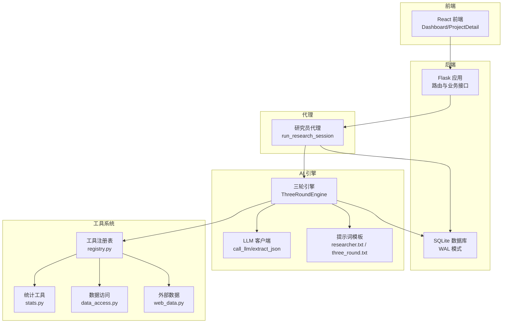
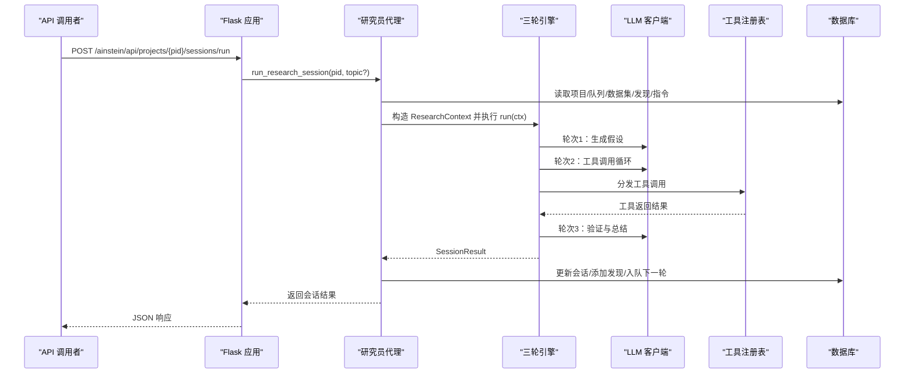
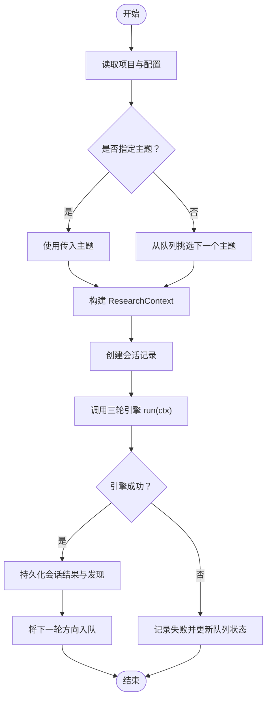
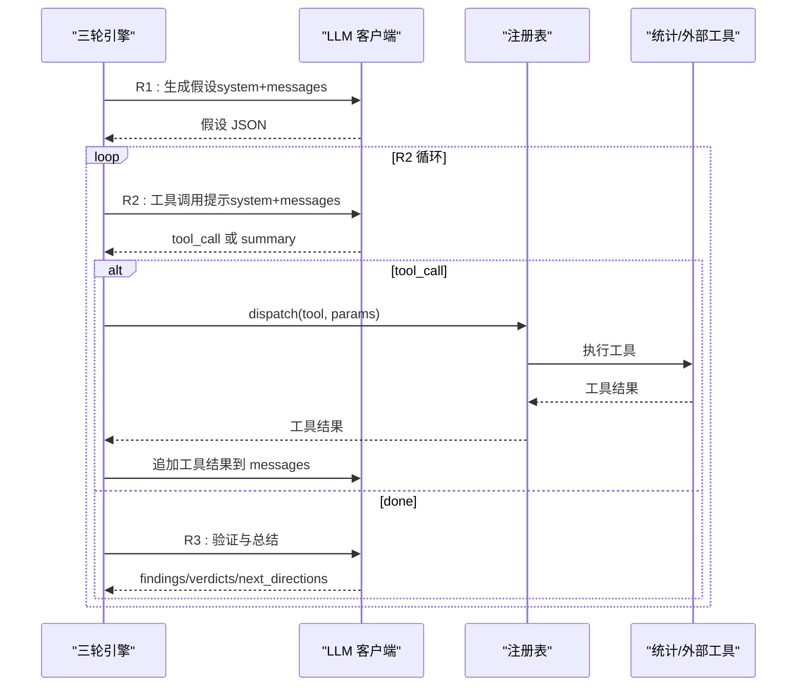
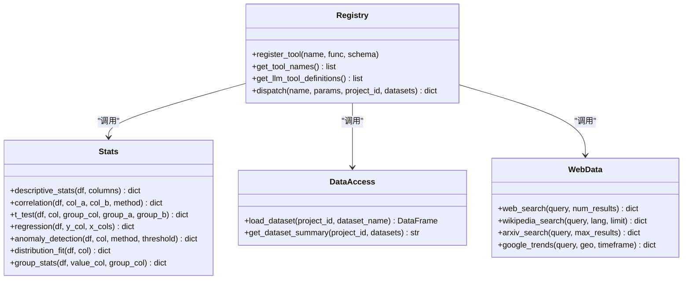
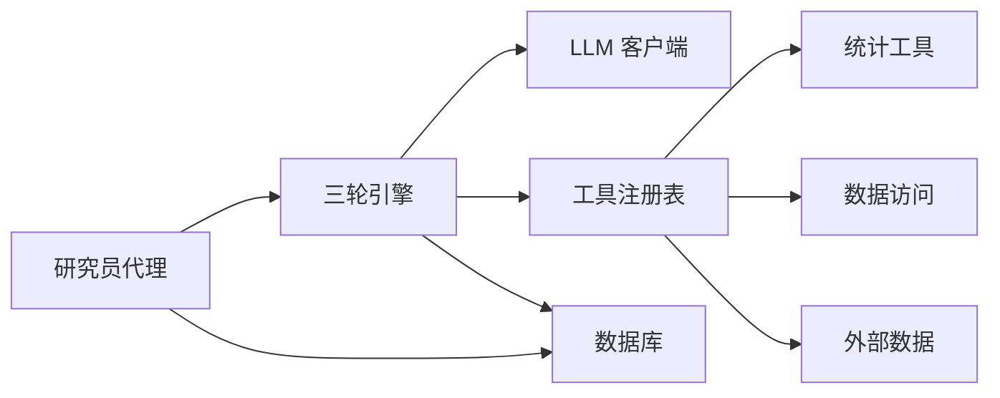

# 研究员代理

<cite>
**本文引用的文件**
- [agents/researcher.py](file://agents/researcher.py)
- [engines/base.py](file://engines/base.py)
- [engines/three_round.py](file://engines/three_round.py)
- [tools/registry.py](file://tools/registry.py)
- [tools/data_access.py](file://tools/data_access.py)
- [tools/stats.py](file://tools/stats.py)
- [tools/web_data.py](file://tools/web_data.py)
- [agents/llm_client.py](file://agents/llm_client.py)
- [prompts/researcher.txt](file://prompts/researcher.txt)
- [prompts/three_round.txt](file://prompts/three_round.txt)
- [database.py](file://database.py)
- [app.py](file://app.py)
- [config.py](file://config.py)
- [README.md](file://README.md)
</cite>

## 目录
1. [简介](#简介)
2. [项目结构](#项目结构)
3. [核心组件](#核心组件)
4. [架构总览](#架构总览)
5. [详细组件分析](#详细组件分析)
6. [依赖关系分析](#依赖关系分析)
7. [性能考量](#性能考量)
8. [故障排查指南](#故障排查指南)
9. [结论](#结论)
10. [附录](#附录)

## 简介
本文件系统化阐述“研究员代理”的专业职责与技术实现，覆盖研究任务执行、数据分析处理、实验设计实施等全流程。重点解析提示词模板的设计原理与应用场景，包括 messages 构建策略、工具调用流程、结果验证机制；说明研究员代理与工具系统的集成方式，涵盖数据访问、统计分析、报告生成等能力；并提供实际使用案例与代码示例路径，展示在不同研究场景下的应用模式，最后解释错误处理与异常恢复机制。

## 项目结构
项目采用模块化分层组织：前端、后端、提示词模板、引擎与工具、数据库层。后端通过 Flask 提供 REST API，连接 SQLite 数据库存储项目、队列、会话、发现与数据集信息；引擎负责三轮研究流程编排；工具系统提供数据访问与统计/外部数据能力；提示词模板定义研究员角色与流程约束。

图表来源
- [app.py:1-182](file://app.py#L1-L182)
- [agents/researcher.py:1-114](file://agents/researcher.py#L1-L114)
- [engines/three_round.py:1-179](file://engines/three_round.py#L1-L179)
- [agents/llm_client.py:1-114](file://agents/llm_client.py#L1-L114)
- [tools/registry.py:1-181](file://tools/registry.py#L1-L181)
- [tools/stats.py:1-120](file://tools/stats.py#L1-L120)
- [tools/data_access.py:1-43](file://tools/data_access.py#L1-L43)
- [tools/web_data.py:1-164](file://tools/web_data.py#L1-L164)
- [database.py:1-344](file://database.py#L1-L344)

章节来源
- [README.md:71-124](file://README.md#L71-L124)
- [app.py:1-182](file://app.py#L1-L182)
- [database.py:100-344](file://database.py#L100-L344)

## 核心组件
- 研究员代理：负责从项目队列中挑选主题、准备上下文、调用引擎执行三轮研究、持久化结果与后续方向。
- 三轮引擎：按“假设生成 → 工具检验 → 验证总结”顺序组织研究流程，协调 LLM 与工具调用。
- 工具注册表：统一管理内置统计工具与外部数据工具，提供工具定义、分发与参数校验。
- 数据访问与统计工具：支持 CSV/JSON/XLSX 加载、描述性统计、相关性、t 检验、回归、异常检测、分布拟合、分组统计。
- 外部数据工具：Web 搜索、Wikipedia、arXiv、Google Trends。
- LLM 客户端：封装 DashScope/Anthropic 兼容 API，提供文本与工具调用两种模式，以及 JSON 提取。
- 提示词模板：定义研究员角色、流程约束与工具使用规范。
- 数据库层：存储项目、指令、队列、会话、发现、数据集等实体与索引。

章节来源
- [agents/researcher.py:14-114](file://agents/researcher.py#L14-L114)
- [engines/three_round.py:22-179](file://engines/three_round.py#L22-L179)
- [tools/registry.py:24-181](file://tools/registry.py#L24-L181)
- [tools/data_access.py:10-43](file://tools/data_access.py#L10-L43)
- [tools/stats.py:10-120](file://tools/stats.py#L10-L120)
- [tools/web_data.py:13-164](file://tools/web_data.py#L13-L164)
- [agents/llm_client.py:24-114](file://agents/llm_client.py#L24-L114)
- [prompts/researcher.txt:1-14](file://prompts/researcher.txt#L1-L14)
- [prompts/three_round.txt:1-15](file://prompts/three_round.txt#L1-L15)
- [database.py:100-344](file://database.py#L100-L344)

## 架构总览
研究员代理位于后端服务与 AI 引擎之间，承担“编排者”角色：从数据库读取项目配置、数据集摘要、近期发现与指令，构造研究上下文，启动三轮引擎，捕获异常并回写状态，同时将发现与后续方向入库。三轮引擎通过 LLM 客户端与工具注册表协作，完成假设生成、工具检验与结论验证。

图表来源
- [app.py:95-105](file://app.py#L95-L105)
- [agents/researcher.py:14-114](file://agents/researcher.py#L14-L114)
- [engines/three_round.py:28-179](file://engines/three_round.py#L28-L179)
- [agents/llm_client.py:24-114](file://agents/llm_client.py#L24-L114)
- [tools/registry.py:24-43](file://tools/registry.py#L24-L43)
- [database.py:232-295](file://database.py#L232-L295)

## 详细组件分析

### 研究员代理（run_research_session）
- 职责
  - 读取项目配置与上下文（mission、domain、config）、数据集摘要、近期发现、指令。
  - 从队列挑选主题或接受显式 topic，创建会话记录。
  - 调用三轮引擎执行研究，捕获异常并更新会话状态。
  - 将发现持久化到数据库，并将下一轮方向加入队列。
- 关键流程
  - 上下文构建：ResearchContext 包含 project_id、mission、domain、topic、config、datasets_summary、recent_findings、directives、session_id 等。
  - 会话创建与状态更新：create_session、update_session。
  - 发现入库与队列入队：add_finding、add_to_queue。
- 错误处理
  - 引擎异常：记录错误日志，更新会话状态为 failed，必要时更新队列项状态。
  - 队列项完成/失败：根据是否来自队列进行相应状态更新。

图表来源
- [agents/researcher.py:14-114](file://agents/researcher.py#L14-L114)
- [database.py:232-295](file://database.py#L232-L295)

章节来源
- [agents/researcher.py:14-114](file://agents/researcher.py#L14-L114)
- [database.py:127-168](file://database.py#L127-L168)
- [database.py:190-228](file://database.py#L190-L228)
- [database.py:232-295](file://database.py#L232-L295)

### 三轮引擎（ThreeRoundEngine）
- 角色与流程
  - 第一轮：基于系统提示与上下文生成可检验假设，返回 JSON 结构。
  - 第二轮：循环工具调用，使用统计工具检验假设，收集测试结果。
  - 第三轮：汇总证据，生成验证结论、关键发现、建议方向与数据摘要。
- 提示词模板
  - three_round.txt：定义领域、使命、可用数据集与工具列表。
  - researcher.txt：定义研究员角色、流程与严谨性要求。
- messages 构建策略
  - R1/R3：用户消息包含主题、指令上下文、近期发现、JSON 输出约束。
  - R2：用户消息引导先运行描述性统计，随后工具调用循环，助手消息承载上一轮工具结果。
- 工具调用流程
  - LLM 输出 JSON，包含 tool_call 或 done 字段。
  - 注册表 dispatch 解析工具名与参数，加载数据集并执行对应函数。
  - 将工具返回结果追加到消息历史，继续下一轮。
- 结果验证机制
  - R3 输出 JSON 包含 veredicts/findings/next_directions/data_summary。
  - 若无法解析 JSON，标记为 partial 状态。

图表来源
- [engines/three_round.py:28-179](file://engines/three_round.py#L28-L179)
- [agents/llm_client.py:24-114](file://agents/llm_client.py#L24-L114)
- [tools/registry.py:24-43](file://tools/registry.py#L24-L43)
- [tools/stats.py:10-120](file://tools/stats.py#L10-L120)
- [tools/web_data.py:13-164](file://tools/web_data.py#L13-L164)

章节来源
- [engines/three_round.py:22-179](file://engines/three_round.py#L22-L179)
- [prompts/researcher.txt:1-14](file://prompts/researcher.txt#L1-L14)
- [prompts/three_round.txt:1-15](file://prompts/three_round.txt#L1-L15)

### 工具系统与数据访问
- 工具注册表
  - register_tool：注册工具名、实现函数与输入 schema。
  - dispatch：根据工具名与参数执行，自动加载数据集并传递给统计工具。
  - 内置统计工具：descriptive_stats、correlation、t_test、regression、anomaly_detection、distribution_fit、group_stats。
  - 外部数据工具：web_search、wikipedia_search、arxiv_search、google_trends。
- 数据访问
  - load_dataset：支持 CSV/JSON/JSONL/XLSX，按项目目录与文件名加载。
  - get_dataset_summary：将数据集 schema 转换为可读文本，用于 LLM 上下文。
- 统计工具
  - 描述性统计：数值列的 count/mean/std/min/max/四分位数。
  - 相关性：Pearson/Spearman，返回相关系数与 p 值。
  - t 检验：独立样本 t 检验，返回均值、t 统计量与 p 值。
  - 回归：多元线性回归，返回截距、R² 与各变量系数。
  - 异常检测：Z-score/IQR 方法，返回异常数量与比例。
  - 分布拟合：Shapiro-Wilk 正态性检验与偏度/峰度。
  - 分组统计：按分组列计算每组的 count/mean/std/median。

图表来源
- [tools/registry.py:24-181](file://tools/registry.py#L24-L181)
- [tools/stats.py:10-120](file://tools/stats.py#L10-L120)
- [tools/data_access.py:10-43](file://tools/data_access.py#L10-L43)
- [tools/web_data.py:13-164](file://tools/web_data.py#L13-L164)

章节来源
- [tools/registry.py:24-181](file://tools/registry.py#L24-L181)
- [tools/data_access.py:10-43](file://tools/data_access.py#L10-L43)
- [tools/stats.py:10-120](file://tools/stats.py#L10-L120)
- [tools/web_data.py:13-164](file://tools/web_data.py#L13-L164)

### 提示词模板与消息构建
- researcher.txt：定义研究员角色、流程与严谨性要求，强调引用具体数字、承认局限性、明确置信水平。
- three_round.txt：定义领域、使命、可用数据集与工具列表，指导以数据为依据、区分相关性与因果性、使用专业术语。
- messages 构建策略
  - R1：包含主题、指令上下文、近期发现，要求返回 JSON。
  - R2：引导先运行描述性统计，随后工具调用循环，每轮追加工具结果。
  - R3：汇总原始假设与测试结果，要求返回 veredicts/findings/next_directions/data_summary。

章节来源
- [prompts/researcher.txt:1-14](file://prompts/researcher.txt#L1-L14)
- [prompts/three_round.txt:1-15](file://prompts/three_round.txt#L1-L15)
- [engines/three_round.py:52-178](file://engines/three_round.py#L52-L178)

### 数据库与持久化
- 表结构要点
  - projects：项目基本信息与配置。
  - scientist_directives：研究指令与优先级。
  - research_queue：待研究主题队列。
  - research_sessions：研究会话与结果。
  - research_findings：研究发现与建议。
  - datasets：数据集元数据。
- 关键操作
  - create_session/update_session：记录会话状态与结果。
  - add_finding：保存发现、类别、置信度、证据与行动建议。
  - add_to_queue：将下一轮方向入队。
  - get_project_stats：聚合会话、发现与队列统计。

章节来源
- [database.py:100-344](file://database.py#L100-L344)
- [database.py:232-295](file://database.py#L232-L295)

## 依赖关系分析
- 组件耦合
  - 研究员代理依赖数据库层与三轮引擎；引擎依赖 LLM 客户端与工具注册表。
  - 工具注册表统一调度统计与外部数据工具，降低引擎与工具实现的耦合。
- 外部依赖
  - LLM API（DashScope/Anthropic 兼容），需配置 API Key 与基础地址。
  - pandas/numpy/scipy 用于统计分析。
  - requests/pytrends 用于外部数据抓取。
- 潜在循环依赖
  - 当前模块间为单向依赖，未见循环导入。

图表来源
- [agents/researcher.py:14-114](file://agents/researcher.py#L14-L114)
- [engines/three_round.py:28-179](file://engines/three_round.py#L28-L179)
- [agents/llm_client.py:24-114](file://agents/llm_client.py#L24-L114)
- [tools/registry.py:24-181](file://tools/registry.py#L24-L181)
- [database.py:232-295](file://database.py#L232-L295)

章节来源
- [agents/researcher.py:14-114](file://agents/researcher.py#L14-L114)
- [engines/three_round.py:28-179](file://engines/three_round.py#L28-L179)
- [tools/registry.py:24-181](file://tools/registry.py#L24-L181)

## 性能考量
- LLM 调用成本控制
  - 温度与最大 token 设置：R1/R3 较高温度促进创造性，R2 降低温度提升稳定性。
  - 工具调用循环限制：max_tool_rounds 控制最多轮次，避免无限循环。
- 数据加载与统计
  - load_dataset 支持多种格式，注意大文件内存占用；统计工具对缺失值与样本量有保护。
- 数据库事务
  - 使用 WAL 模式与外键约束，保证一致性；批量写入通过上下文管理器提交/回滚。

章节来源
- [engines/three_round.py:28-179](file://engines/three_round.py#L28-L179)
- [tools/data_access.py:10-43](file://tools/data_access.py#L10-L43)
- [database.py:100-123](file://database.py#L100-L123)

## 故障排查指南
- LLM 调用失败
  - 症状：日志报错、引擎抛出异常。
  - 排查：检查 API Key 与基础地址配置；确认模型名称正确；查看响应 usage 与错误信息。
  - 参考路径：[agents/llm_client.py:24-71](file://agents/llm_client.py#L24-L71)
- 工具调用异常
  - 症状：工具返回 error 字段或抛出异常。
  - 排查：确认工具名存在、参数满足 schema、数据集文件存在且可读。
  - 参考路径：[tools/registry.py:24-43](file://tools/registry.py#L24-L43)，[tools/data_access.py:10-24](file://tools/data_access.py#L10-L24)
- JSON 解析失败
  - 症状：R1/R3 无法提取 JSON。
  - 排查：检查输出格式是否符合 JSON 约束；必要时放宽温度或增加约束提示。
  - 参考路径：[agents/llm_client.py:73-114](file://agents/llm_client.py#L73-L114)
- 数据库问题
  - 症状：会话状态未更新、发现未入库。
  - 排查：确认数据库初始化、索引是否存在；检查事务是否提交。
  - 参考路径：[database.py:100-123](file://database.py#L100-L123)，[database.py:240-249](file://database.py#L240-L249)

章节来源
- [agents/llm_client.py:24-114](file://agents/llm_client.py#L24-L114)
- [tools/registry.py:24-43](file://tools/registry.py#L24-L43)
- [tools/data_access.py:10-24](file://tools/data_access.py#L10-L24)
- [database.py:100-123](file://database.py#L100-L123)
- [database.py:240-249](file://database.py#L240-L249)

## 结论
研究员代理通过标准化的三轮研究流程，将 LLM 的推理能力与统计/外部数据工具有效结合，形成可复用、可扩展的研究范式。其与数据库的紧密集成确保了研究过程的可观测性与可追溯性。提示词模板与 messages 构建策略保障了流程的确定性与结果的可解释性。通过完善的错误处理与异常恢复机制，系统在复杂场景下仍能保持稳健运行。

## 附录

### 实际使用案例与代码示例路径
- 启动后端服务并初始化数据库
  - 参考路径：[README.md:32-50](file://README.md#L32-L50)，[app.py:179-182](file://app.py#L179-L182)
- 创建项目与上传数据集
  - 参考路径：[app.py:54-59](file://app.py#L54-L59)，[app.py:123-152](file://app.py#L123-L152)
- 添加研究指令与主题队列
  - 参考路径：[app.py:75-79](file://app.py#L75-L79)，[app.py:157-160](file://app.py#L157-L160)
- 触发研究员会话
  - 参考路径：[app.py:95-105](file://app.py#L95-L105)，[agents/researcher.py:14-114](file://agents/researcher.py#L14-L114)
- 查看会话与发现
  - 参考路径：[app.py:84-94](file://app.py#L84-L94)，[app.py:109-115](file://app.py#L109-L115)

### 研究场景应用模式
- 场景一：探索性数据分析
  - 步骤：上传数据集 → 描述性统计 → 相关性/分组统计 → 异常检测 → 形成初步假设 → 下一轮验证。
  - 参考路径：[tools/stats.py:10-120](file://tools/stats.py#L10-L120)，[engines/three_round.py:77-136](file://engines/three_round.py#L77-L136)
- 场景二：对比实验设计
  - 步骤：定义分组变量 → t 检验 → 回归分析 → 结论验证 → 行动建议。
  - 参考路径：[tools/stats.py:35-68](file://tools/stats.py#L35-L68)，[engines/three_round.py:138-178](file://engines/three_round.py#L138-L178)
- 场景三：外部背景调研
  - 步骤：检索 Wikipedia/arXiv → 汇总摘要 → 与内部数据交叉验证 → 生成研究方向。
  - 参考路径：[tools/web_data.py:13-164](file://tools/web_data.py#L13-L164)，[engines/three_round.py:138-178](file://engines/three_round.py#L138-L178)