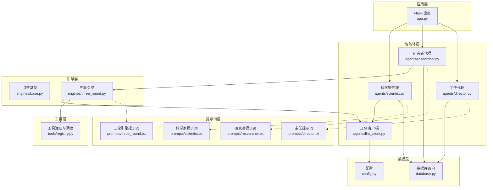
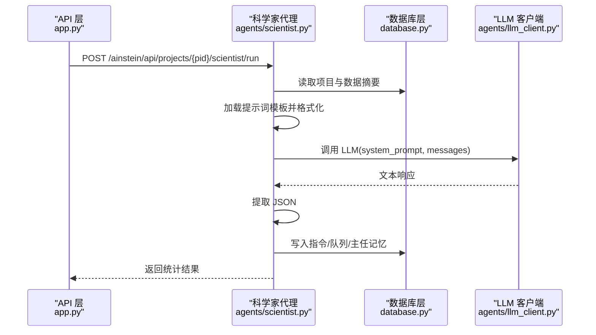
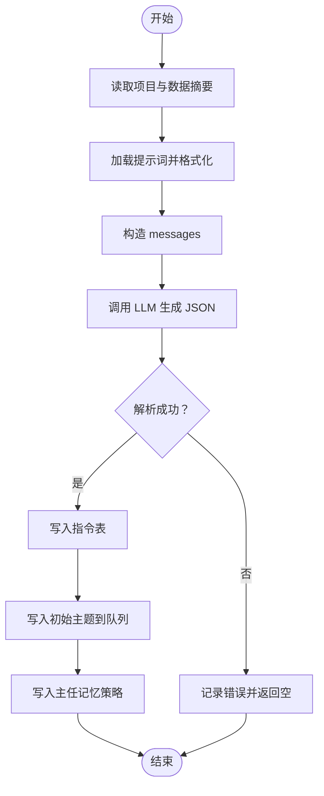
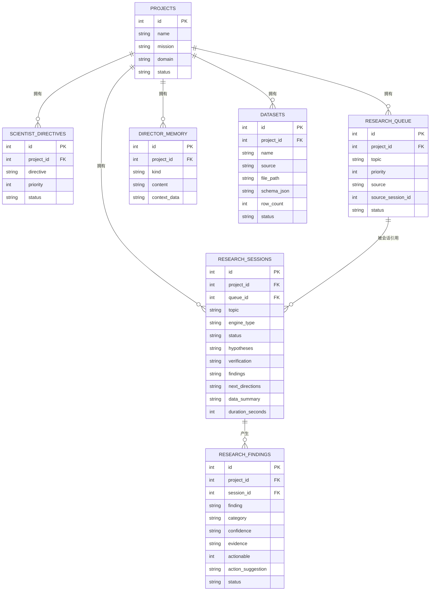
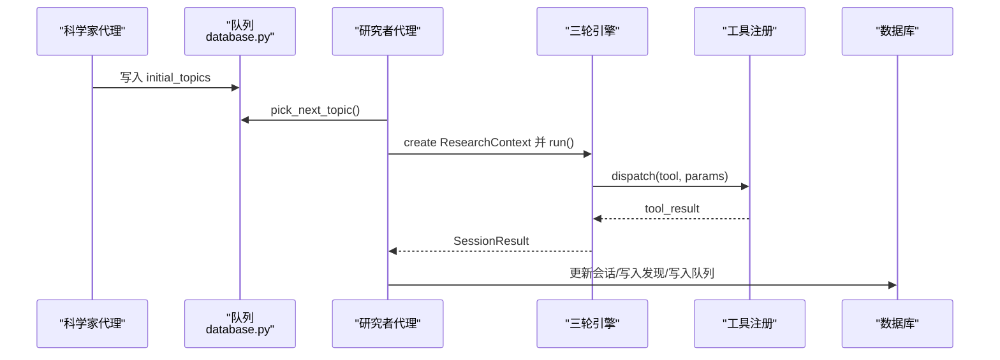
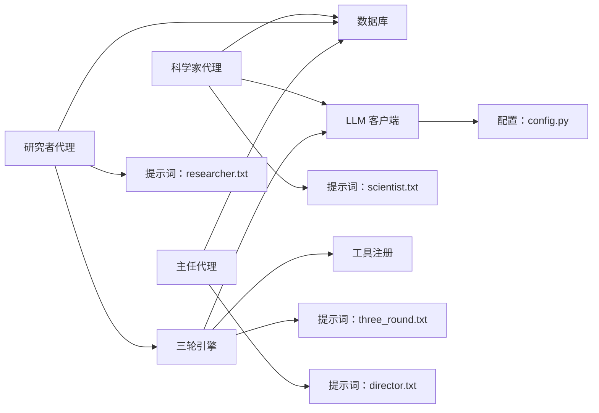

# 科学家代理

<cite>
**本文档引用的文件**
- [agents/scientist.py](file://agents/scientist.py)
- [agents/researcher.py](file://agents/researcher.py)
- [agents/director.py](file://agents/director.py)
- [agents/llm_client.py](file://agents/llm_client.py)
- [engines/base.py](file://engines/base.py)
- [engines/three_round.py](file://engines/three_round.py)
- [tools/registry.py](file://tools/registry.py)
- [database.py](file://database.py)
- [config.py](file://config.py)
- [app.py](file://app.py)
- [prompts/scientist.txt](file://prompts/scientist.txt)
- [prompts/three_round.txt](file://prompts/three_round.txt)
- [prompts/researcher.txt](file://prompts/researcher.txt)
- [prompts/director.txt](file://prompts/director.txt)
</cite>

## 目录
1. [简介](#简介)
2. [项目结构](#项目结构)
3. [核心组件](#核心组件)
4. [架构总览](#架构总览)
5. [详细组件分析](#详细组件分析)
6. [依赖分析](#依赖分析)
7. [性能考虑](#性能考虑)
8. [故障排查指南](#故障排查指南)
9. [结论](#结论)
10. [附录](#附录)

## 简介
本文件面向“科学家代理”的使用者与维护者，系统化阐述其在研究项目中的核心职责与工作机制，包括：
- 研究策略制定：将项目使命拆解为可执行的战略指令与优先级
- 主题选择算法：从数据与任务池中挑选初始研究主题
- 研究方向规划：定义发现分类体系与总体策略说明
- 提示词系统设计：system_prompt 构建、messages 组织、工具调用集成
- 状态管理：研究历史记录、决策过程追踪、结果评估机制
- 调用方式与参数配置：如何通过 API 触发科学家代理，以及返回结果处理
- 协作关系与数据流：与研究代理、主任代理及引擎的协同

## 项目结构
该项目采用按功能分层的模块化组织方式：
- agents：智能体层，包含科学家、研究者、主任代理与通用 LLM 客户端
- engines：研究引擎层，抽象出引擎接口与三轮研究流程实现
- tools：工具注册与调度层，提供统计与网络检索等工具
- prompts：提示词模板，分别用于科学家、研究者、主任与引擎
- database：数据库访问层，封装项目、指令、队列、会话、发现、记忆与数据集等实体
- config：全局配置，包括模型与服务端点
- app：Flask 应用，提供 REST API 以触发各代理与引擎

图表来源
- [app.py:155-177](file://app.py#L155-L177)
- [agents/scientist.py:14-75](file://agents/scientist.py#L14-L75)
- [agents/researcher.py:14-114](file://agents/researcher.py#L14-L114)
- [agents/director.py:14-124](file://agents/director.py#L14-L124)
- [agents/llm_client.py:24-114](file://agents/llm_client.py#L24-L114)
- [engines/base.py:11-49](file://engines/base.py#L11-L49)
- [engines/three_round.py:22-179](file://engines/three_round.py#L22-L179)
- [tools/registry.py:24-43](file://tools/registry.py#L24-L43)
- [database.py:101-344](file://database.py#L101-L344)
- [config.py:1-11](file://config.py#L1-L11)

章节来源
- [app.py:155-177](file://app.py#L155-L177)
- [agents/scientist.py:14-75](file://agents/scientist.py#L14-L75)
- [agents/researcher.py:14-114](file://agents/researcher.py#L14-L114)
- [agents/director.py:14-124](file://agents/director.py#L14-L124)
- [engines/base.py:11-49](file://engines/base.py#L11-L49)
- [engines/three_round.py:22-179](file://engines/three_round.py#L22-L179)
- [tools/registry.py:24-43](file://tools/registry.py#L24-L43)
- [database.py:101-344](file://database.py#L101-L344)
- [config.py:1-11](file://config.py#L1-L11)

## 核心组件
- 科学家代理：负责将项目使命转化为战略指令与初始研究主题，定义发现分类与总体策略说明，并写入数据库的历史记忆中
- 研究者代理：从队列中选取主题，驱动三轮引擎进行假设生成、工具检验与验证总结，持久化会话结果与后续方向
- 主任代理：每日回顾最近会话、开放发现、队列与记忆，进行发现审核、队列调整、新增主题与记忆积累
- 引擎层：抽象出研究上下文与会话结果，三轮引擎实现“假设→检验→验证”闭环
- 工具注册：集中注册内置统计与网络检索工具，支持引擎在检验阶段调用
- 数据库层：统一管理项目、指令、队列、会话、发现、记忆与数据集，提供状态变更与查询能力
- LLM 客户端：封装 DashScope/Anthropic 兼容客户端，提供文本与工具调用两种模式，以及 JSON 提取能力

章节来源
- [agents/scientist.py:14-75](file://agents/scientist.py#L14-L75)
- [agents/researcher.py:14-114](file://agents/researcher.py#L14-L114)
- [agents/director.py:14-124](file://agents/director.py#L14-L124)
- [engines/base.py:11-49](file://engines/base.py#L11-L49)
- [engines/three_round.py:22-179](file://engines/three_round.py#L22-L179)
- [tools/registry.py:24-43](file://tools/registry.py#L24-L43)
- [database.py:101-344](file://database.py#L101-L344)
- [agents/llm_client.py:24-114](file://agents/llm_client.py#L24-L114)

## 架构总览
科学家代理位于研究流程的起点，负责“战略制定”。其工作流如下：
- 读取项目信息与可用数据摘要
- 加载科学家提示词模板，构造 system_prompt
- 组织 messages（用户输入），调用 LLM 生成 JSON 结果
- 解析 JSON，写入指令表、初始主题到队列、并把总体策略写入主任记忆

图表来源
- [app.py:161-166](file://app.py#L161-L166)
- [agents/scientist.py:28-47](file://agents/scientist.py#L28-L47)
- [agents/llm_client.py:24-44](file://agents/llm_client.py#L24-L44)
- [database.py:173-305](file://database.py#L173-L305)

## 详细组件分析

### 科学家代理：职责与机制
- 职责
  - 将项目使命与领域分解为若干战略指令（宏观方向与优先级）
  - 生成初始研究主题（具体、可验证、可由现有数据支撑）
  - 定义发现分类体系，形成总体研究策略说明
- 输入
  - 项目 mission、domain
  - 可用数据摘要（来自数据集）
- 处理
  - 读取提示词模板，填充 mission/domain/datasets_summary
  - 组织 messages，调用 LLM，提取 JSON
  - 将 directives/priority 写入指令表
  - 将 initial_topics/priority 写入队列（source=scientist）
  - 将 finding_categories 与 strategic_notes 写入主任记忆（kind=scientist_strategy）
- 输出
  - 返回 directives/topics 数量、分类与策略说明摘要

图表来源
- [agents/scientist.py:14-75](file://agents/scientist.py#L14-L75)
- [prompts/scientist.txt:13-23](file://prompts/scientist.txt#L13-L23)
- [database.py:173-305](file://database.py#L173-L305)

章节来源
- [agents/scientist.py:14-75](file://agents/scientist.py#L14-L75)
- [prompts/scientist.txt:13-23](file://prompts/scientist.txt#L13-L23)
- [database.py:173-305](file://database.py#L173-L305)

### 提示词系统设计
- system_prompt 的构建
  - 科学家：从 templates 中读取模板，注入 mission、domain、datasets_summary
  - 三轮引擎：注入 mission、domain、datasets_summary、可用工具名列表
  - 研究者/主任：分别注入 mission、domain 并给出角色与职责约束
- messages 的组织结构
  - 用户消息包含项目背景、可用数据摘要与明确的指令（如“生成指令与初始主题”）
- 工具调用的集成
  - 三轮引擎在第二轮中通过 LLM 的工具调用能力发起统计工具请求
  - 工具注册层提供工具名、Schema 与分发逻辑，引擎将工具调用结果回填至对话历史

章节来源
- [agents/scientist.py:28-44](file://agents/scientist.py#L28-L44)
- [engines/three_round.py:32-100](file://engines/three_round.py#L32-L100)
- [prompts/scientist.txt:8-11](file://prompts/scientist.txt#L8-L11)
- [prompts/three_round.txt:1-15](file://prompts/three_round.txt#L1-L15)
- [prompts/researcher.txt:1-14](file://prompts/researcher.txt#L1-L14)
- [prompts/director.txt:1-43](file://prompts/director.txt#L1-L43)
- [tools/registry.py:24-43](file://tools/registry.py#L24-L43)

### 状态管理：历史记录、追踪与评估
- 研究历史记录
  - 会话表记录 hypotheses、verification、findings、next_directions、data_summary、duration_seconds
  - 发现表记录 finding、category、confidence、evidence、actionable、action_suggestion、status
- 决策过程追踪
  - 队列表记录 topic、priority、source、status、关联的会话 ID
  - 主任记忆表记录 kind（如 briefing、scientist_strategy）、content、context_data
- 结果评估机制
  - 主任代理每日对 open 发现进行审核（validate/reject/keep_open），并根据发现生成新的主题与记忆
  - 会话完成后，研究者代理将 findings 与 next_directions 写入数据库，并更新队列

图表来源
- [database.py:10-98](file://database.py#L10-L98)

章节来源
- [database.py:101-344](file://database.py#L101-L344)
- [agents/researcher.py:71-101](file://agents/researcher.py#L71-L101)
- [agents/director.py:84-116](file://agents/director.py#L84-L116)

### 与研究代理、引擎与工具的协作
- 科学家代理 → 研究者代理
  - 科学家生成的 initial_topics 被写入队列，研究者代理从中挑选下一个主题
- 研究者代理 → 三轮引擎
  - 研究者代理构建 ResearchContext（包含 mission、domain、topic、config、datasets_summary、recent_findings、directives），交由引擎执行
- 三轮引擎 → 工具注册
  - 引擎在第二轮中根据 LLM 的工具调用指令，通过工具注册层分发到具体函数执行
- 三轮引擎 → 数据库
  - 引擎将 hypotheses、verification、findings、next_directions、data_summary、duration_seconds 写回会话表
  - 研究者代理进一步将 findings 与 next_directions 写入发现表与队列

图表来源
- [agents/scientist.py:58-61](file://agents/scientist.py#L58-L61)
- [database.py:214-228](file://database.py#L214-L228)
- [agents/researcher.py:41-101](file://agents/researcher.py#L41-L101)
- [engines/three_round.py:126-134](file://engines/three_round.py#L126-L134)
- [tools/registry.py:24-43](file://tools/registry.py#L24-L43)
- [database.py:240-295](file://database.py#L240-L295)

章节来源
- [agents/scientist.py:58-61](file://agents/scientist.py#L58-L61)
- [agents/researcher.py:41-101](file://agents/researcher.py#L41-L101)
- [engines/three_round.py:126-134](file://engines/three_round.py#L126-L134)
- [tools/registry.py:24-43](file://tools/registry.py#L24-L43)
- [database.py:214-295](file://database.py#L214-L295)

### 与主任代理的协作
- 主任代理每日回顾
  - 读取最近会话、开放发现、队列与主任记忆
  - 审核发现（validate/reject/keep_open）、调整队列、新增主题、积累记忆、撰写日报
- 科学家代理的策略记忆
  - 将 finding_categories 与 strategic_notes 写入 kind=scientist_strategy 的主任记忆，供主任代理在回顾时参考

章节来源
- [agents/director.py:14-124](file://agents/director.py#L14-L124)
- [agents/scientist.py:62-67](file://agents/scientist.py#L62-L67)
- [database.py:299-319](file://database.py#L299-L319)

### 调用方式、参数配置与返回结果处理
- API 触发科学家代理
  - 方法：POST /ainstein/api/projects/{pid}/scientist/run
  - 参数：无（内部读取项目与数据摘要）
  - 返回：包含 directives、topics、categories、notes 的统计对象
- API 触发主任代理
  - 方法：POST /ainstein/api/projects/{pid}/director/run
  - 返回：包含 findings_reviewed、new_topics、memories、briefing 的统计对象
- 研究会话运行
  - 方法：POST /ainstein/api/projects/{pid}/sessions/run
  - 返回：启动状态（异步执行）

章节来源
- [app.py:161-166](file://app.py#L161-L166)
- [app.py:172-176](file://app.py#L172-L176)
- [app.py:95-104](file://app.py#L95-L104)

## 依赖分析
- 组件耦合
  - 科学家代理依赖数据库读取项目与数据摘要，依赖 LLM 客户端生成 JSON，依赖提示词模板
  - 研究者代理依赖引擎层与数据库层，负责状态推进与结果持久化
  - 三轮引擎依赖 LLM 客户端与工具注册层，负责工具调用与结果解析
  - 主任代理依赖数据库层聚合近期会话、发现、队列与记忆
- 外部依赖
  - LLM 客户端封装 DashScope/Anthropic 兼容接口，配置项来自环境变量
  - SQLite 数据库存储所有业务实体，索引覆盖常用查询路径

图表来源
- [agents/scientist.py:14-75](file://agents/scientist.py#L14-L75)
- [agents/researcher.py:14-114](file://agents/researcher.py#L14-L114)
- [engines/three_round.py:22-179](file://engines/three_round.py#L22-L179)
- [agents/director.py:14-124](file://agents/director.py#L14-L124)
- [agents/llm_client.py:24-114](file://agents/llm_client.py#L24-L114)
- [config.py:1-11](file://config.py#L1-L11)

章节来源
- [agents/scientist.py:14-75](file://agents/scientist.py#L14-L75)
- [agents/researcher.py:14-114](file://agents/researcher.py#L14-L114)
- [engines/three_round.py:22-179](file://engines/three_round.py#L22-L179)
- [agents/director.py:14-124](file://agents/director.py#L14-L124)
- [agents/llm_client.py:24-114](file://agents/llm_client.py#L24-L114)
- [config.py:1-11](file://config.py#L1-L11)

## 性能考虑
- LLM 调用成本控制
  - 通过温度与 max_tokens 控制输出长度与多样性，避免不必要的长对话
  - 在工具调用阶段限制最大轮次，防止无限循环
- 数据库写入批量化
  - 会话完成后一次性写入 findings 与 next_directions，减少多次往返
- 查询优化
  - 利用索引（队列、会话、发现、记忆、数据集）提升高频查询性能
- 异步执行
  - 会话运行通过线程异步启动，避免阻塞 API 响应

## 故障排查指南
- LLM 响应解析失败
  - 现象：科学家/主任/引擎返回 JSON 解析失败
  - 排查：检查提示词是否要求严格 JSON 输出；确认 LLM 输出包裹在代码块内或可被 JSON 提取器识别
- 工具调用异常
  - 现象：引擎在工具调用阶段中断或返回错误
  - 排查：确认工具名与参数 Schema 匹配；检查数据集名称与列名是否存在
- 项目不存在或队列为空
  - 现象：科学家/研究者返回空结果或日志报错
  - 排查：确认项目 ID 正确；确保科学家已生成初始主题并写入队列
- 数据库连接与事务
  - 现象：写入失败或数据不一致
  - 排查：检查 WAL 模式与外键约束是否启用；查看事务回滚日志

章节来源
- [agents/llm_client.py:73-114](file://agents/llm_client.py#L73-L114)
- [engines/three_round.py:105-135](file://engines/three_round.py#L105-L135)
- [agents/scientist.py:17-19](file://agents/scientist.py#L17-L19)
- [agents/researcher.py:17-33](file://agents/researcher.py#L17-L33)
- [database.py:101-123](file://database.py#L101-L123)

## 结论
科学家代理作为研究流程的“战略入口”，通过结构化的提示词与严格的 JSON 输出，将高层使命转化为可执行的指令与主题，并为后续研究与主任监督奠定基础。其与研究者代理、三轮引擎、工具注册与数据库的协作形成了清晰、可扩展的研究自动化流水线。

## 附录
- 关键提示词模板位置
  - 科学家：prompts/scientist.txt
  - 三轮引擎：prompts/three_round.txt
  - 研究者：prompts/researcher.txt
  - 主任：prompts/director.txt
- 配置项
  - 模型与服务端点：config.py
- API 端点
  - 科学家运行：/ainstein/api/projects/{pid}/scientist/run
  - 主任运行：/ainstein/api/projects/{pid}/director/run
  - 会话运行：/ainstein/api/projects/{pid}/sessions/run