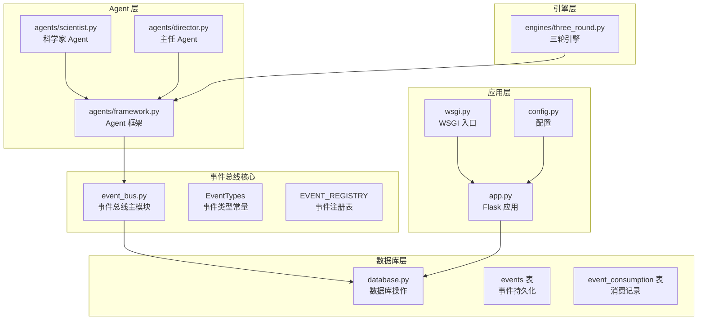
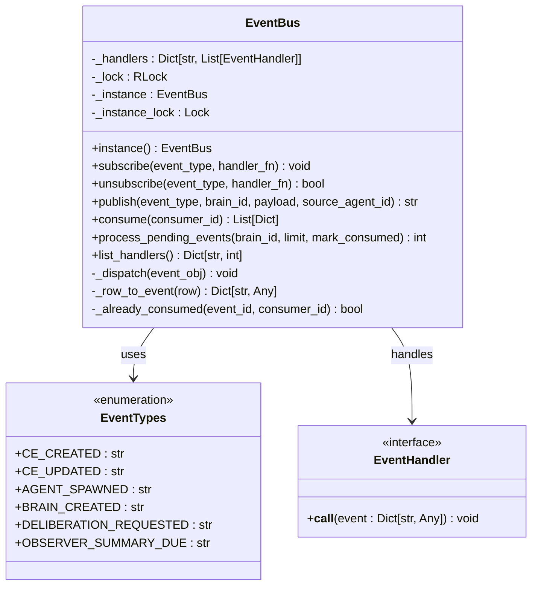
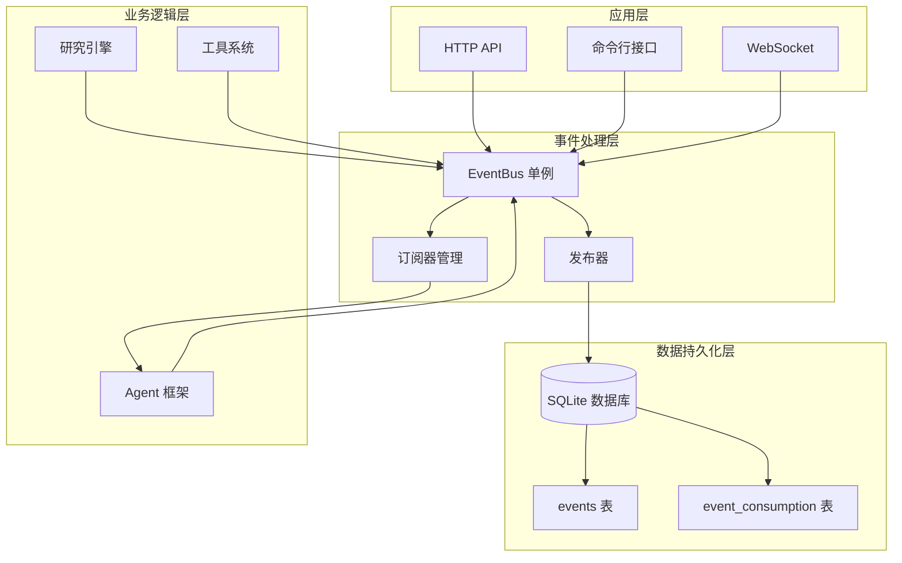
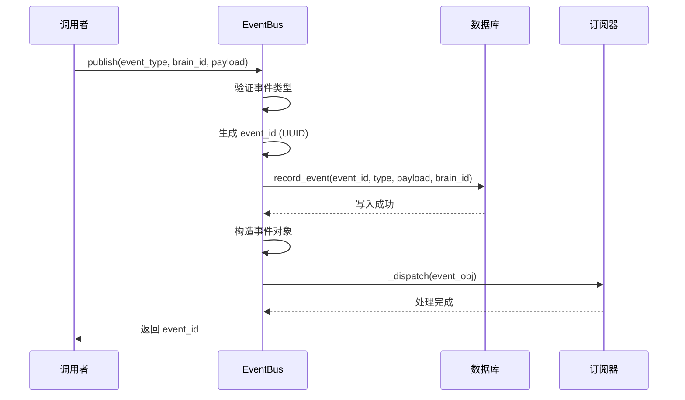
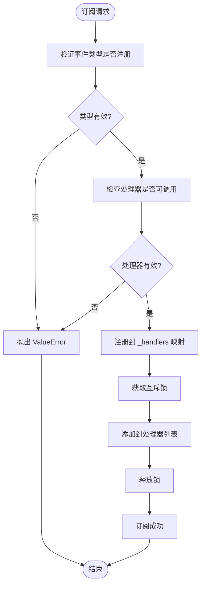
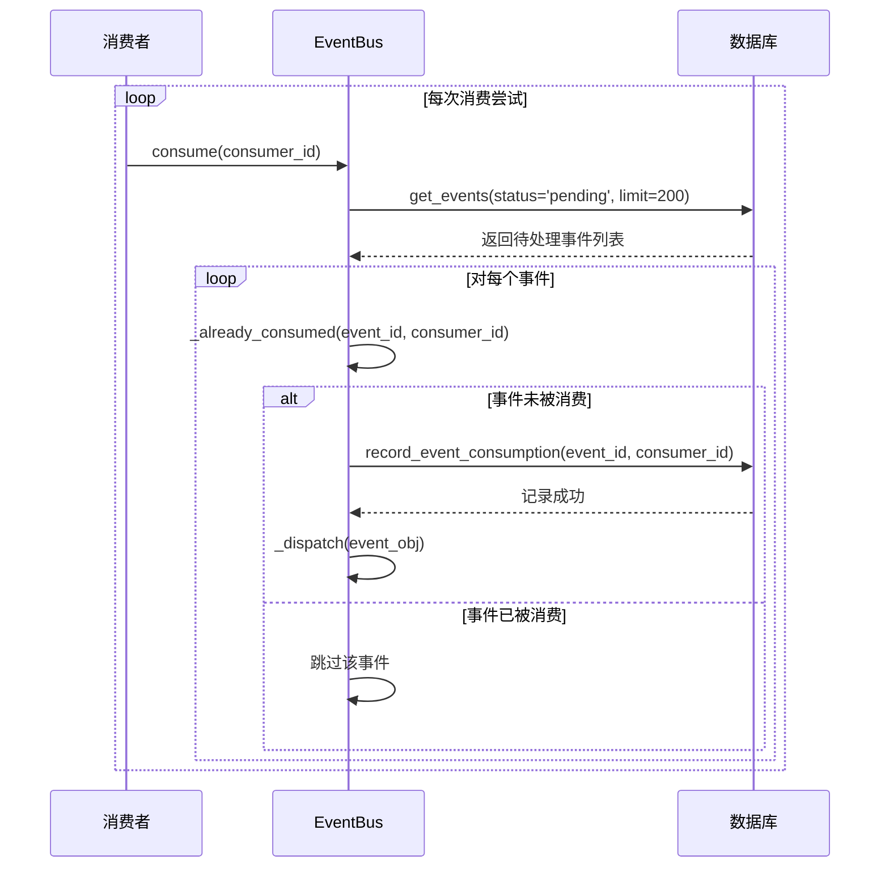
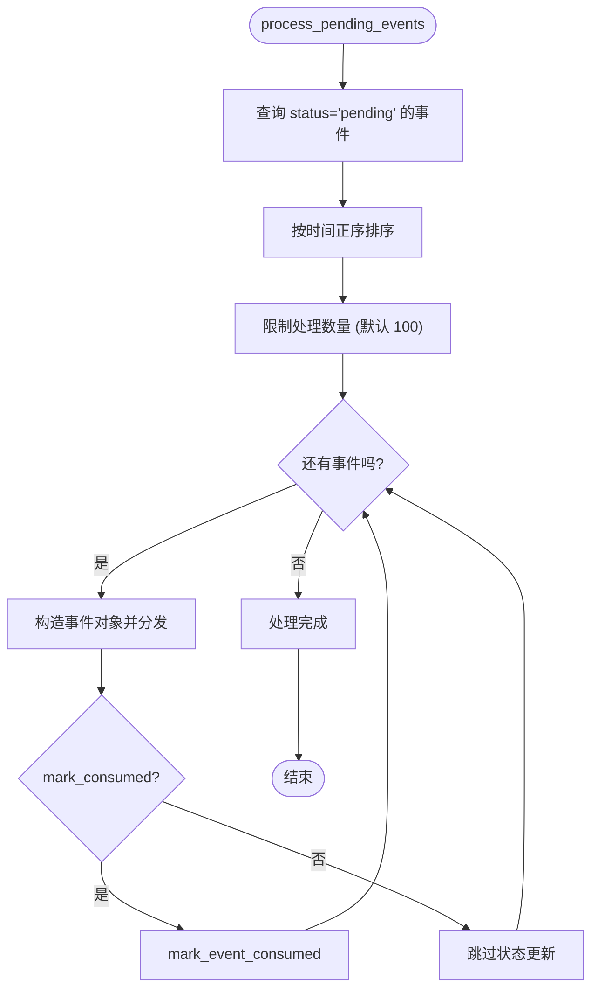
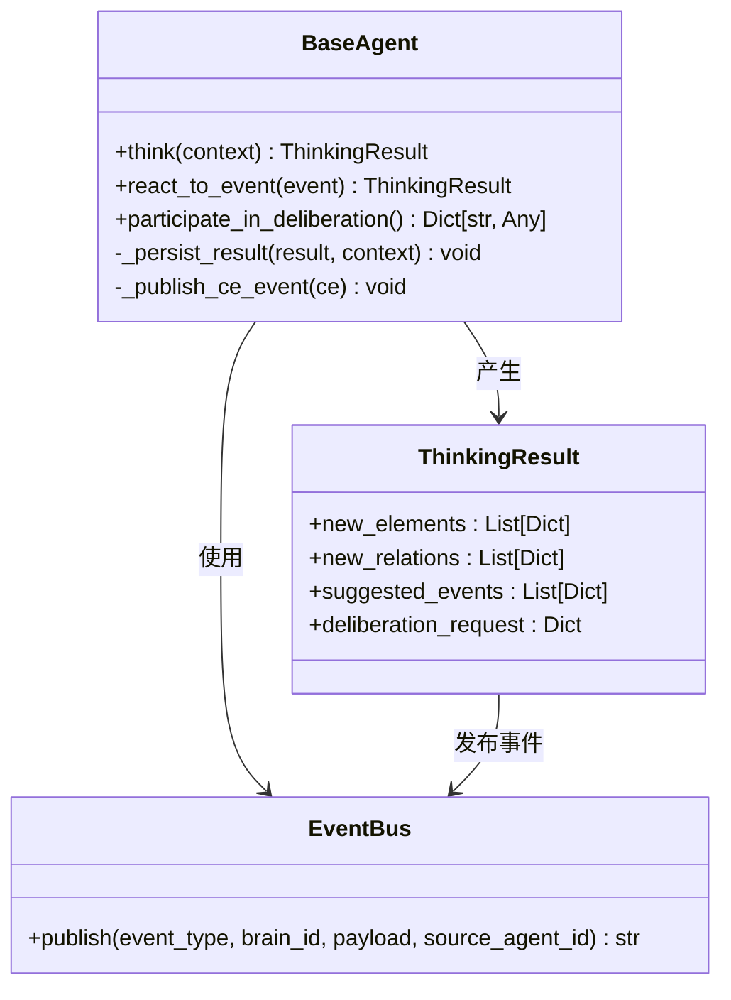
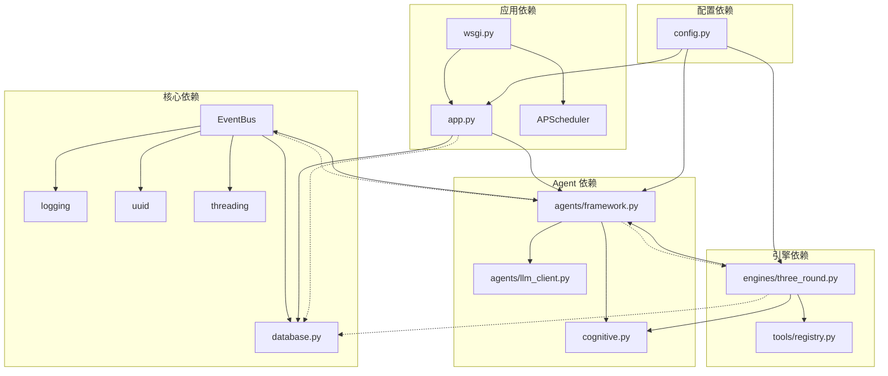

# 事件总线系统

<cite>
**本文档引用的文件**
- [event_bus.py](file://event_bus.py)
- [database.py](file://database.py)
- [agents/framework.py](file://agents/framework.py)
- [agents/scientist.py](file://agents/scientist.py)
- [agents/director.py](file://agents/director.py)
- [engines/three_round.py](file://engines/three_round.py)
- [wsgi.py](file://wsgi.py)
- [app.py](file://app.py)
- [config.py](file://config.py)
</cite>

## 目录
1. [简介](#简介)
2. [项目结构](#项目结构)
3. [核心组件](#核心组件)
4. [架构概览](#架构概览)
5. [详细组件分析](#详细组件分析)
6. [依赖关系分析](#依赖关系分析)
7. [性能考虑](#性能考虑)
8. [故障排除指南](#故障排除指南)
9. [结论](#结论)

## 简介

事件总线系统是 AInstein 项目的核心基础设施，为整个硅基大脑（Silicon Brain）提供事件驱动的通信机制。该系统实现了进程内的事件发布-订阅模式，结合数据库持久化，确保事件的可靠传递和可回放性。

系统采用"双写"架构：事件首先持久化到数据库，然后同步分发给内存中的订阅器。这种设计保证了即使在系统崩溃的情况下，事件也不会丢失，可以通过待处理事件处理机制进行恢复。

## 项目结构

AInstein 项目的事件总线系统主要分布在以下几个核心文件中：

**图表来源**
- [event_bus.py:1-473](file://event_bus.py#L1-L473)
- [database.py:237-285](file://database.py#L237-L285)
- [agents/framework.py:47-48](file://agents/framework.py#L47-L48)

**章节来源**
- [event_bus.py:1-473](file://event_bus.py#L1-L473)
- [database.py:1-877](file://database.py#L1-L877)

## 核心组件

### 事件总线核心类

EventBus 是整个系统的核心类，实现了单例模式和完整的事件管理功能：

**图表来源**
- [event_bus.py:162-463](file://event_bus.py#L162-L463)
- [event_bus.py:66-142](file://event_bus.py#L66-L142)

### 事件类型系统

系统定义了丰富的事件类型常量，涵盖认知事件、Agent 生命周期事件、博弈事件、大脑生命周期事件等多个维度：

| 事件类别 | 事件类型 | 描述 |
|---------|----------|------|
| 认知事件 | ce.created | 认知元素创建 |
| 认知事件 | ce.observation.created | 观察事件创建 |
| 认知事件 | ce.question.raised | 问题提出 |
| 认知事件 | ce.hypothesis.proposed | 假设提出 |
| 认知事件 | ce.evidence.collected | 证据收集 |
| 认知事件 | ce.conclusion.proposed | 结论提出 |
| Agent 事件 | agent.spawned | Agent 启动 |
| Agent 事件 | agent.despawned | Agent 销毁 |
| Agent 事件 | agent.completed | Agent 完成任务 |
| 大脑事件 | brain.created | 大脑创建 |
| 大脑事件 | brain.cycle.tick | 大脑周期 tick |
| 博弈事件 | deliberation.requested | 博弈请求 |
| 博弈事件 | deliberation.concluded | 博弈结束 |

**章节来源**
- [event_bus.py:66-142](file://event_bus.py#L66-L142)

## 架构概览

事件总线系统采用分层架构设计，确保了系统的可扩展性和可靠性：

**图表来源**
- [event_bus.py:162-463](file://event_bus.py#L162-L463)
- [database.py:237-285](file://database.py#L237-L285)

## 详细组件分析

### 事件发布流程

事件发布是系统中最核心的操作之一，涉及多个步骤以确保数据的一致性和可靠性：

**图表来源**
- [event_bus.py:234-293](file://event_bus.py#L234-L293)
- [database.py:795-800](file://database.py#L795-L800)

### 事件订阅机制

订阅机制提供了灵活的事件监听能力，支持动态注册和注销：

**图表来源**
- [event_bus.py:198-227](file://event_bus.py#L198-L227)

### 幂等消费机制

系统实现了严格的幂等消费机制，确保每个事件只会被每个消费者处理一次：

**图表来源**
- [event_bus.py:316-360](file://event_bus.py#L316-L360)
- [event_bus.py:362-378](file://event_bus.py#L362-L378)

### 待处理事件处理

系统提供了强大的待处理事件处理能力，用于系统重启后的事件恢复：

**图表来源**
- [event_bus.py:381-434](file://event_bus.py#L381-L434)

**章节来源**
- [event_bus.py:198-434](file://event_bus.py#L198-L434)

### Agent 集成

Agent 框架与事件总线深度集成，实现了真正的 ATA（Agent-to-Agent）事件驱动：

**图表来源**
- [agents/framework.py:388-800](file://agents/framework.py#L388-L800)
- [agents/framework.py:47-48](file://agents/framework.py#L47-L48)

**章节来源**
- [agents/framework.py:388-800](file://agents/framework.py#L388-L800)

## 依赖关系分析

事件总线系统与其他组件的依赖关系如下：

**图表来源**
- [event_bus.py:49-59](file://event_bus.py#L49-L59)
- [agents/framework.py:44-47](file://agents/framework.py#L44-L47)
- [engines/three_round.py:20-26](file://engines/three_round.py#L20-L26)

**章节来源**
- [event_bus.py:49-59](file://event_bus.py#L49-L59)
- [agents/framework.py:44-47](file://agents/framework.py#L44-L47)
- [engines/three_round.py:20-26](file://engines/three_round.py#L20-L26)

## 性能考虑

事件总线系统在设计时充分考虑了性能和可扩展性：

### 线程安全性
- 使用可重入锁（RLock）保护所有可变状态
- 订阅器注册和事件分发都是线程安全的
- 消费机制通过数据库主键约束保证幂等性

### 内存管理
- 事件处理器存储在内存中，避免频繁的磁盘 I/O
- 支持动态订阅和注销，减少不必要的处理器数量
- 提供调试接口 `list_handlers()` 查看订阅器数量

### 数据库优化
- 事件表和消费记录表都有适当的索引
- 支持批量处理待处理事件，避免长时间占用线程
- 使用 WAL 模式提高并发性能

### 扩展性设计
- 支持运行时注册新的事件类型
- 订阅器可以按需注册，不影响系统性能
- 可以轻松扩展为异步处理模式

## 故障排除指南

### 常见问题及解决方案

**问题 1：事件类型未注册**
- 现象：发布事件时报 ValueError
- 解决方案：使用 `register_event_type()` 注册事件类型，或在 `EventTypes` 中添加常量

**问题 2：事件未被消费**
- 现象：调用 `consume()` 返回空列表
- 解决方案：检查 `event_consumption` 表中是否存在重复记录，确认消费者 ID 正确

**问题 3：事件重复处理**
- 现象：同一个事件被多次处理
- 解决方案：检查数据库主键约束是否正常工作，确认幂等消费逻辑

**问题 4：性能问题**
- 现象：事件处理延迟较高
- 解决方案：增加订阅器数量限制，使用异步处理，优化数据库索引

**章节来源**
- [event_bus.py:207-211](file://event_bus.py#L207-L211)
- [event_bus.py:362-378](file://event_bus.py#L362-L378)

### 调试技巧

1. **启用详细日志**：设置日志级别为 DEBUG 查看事件处理详情
2. **使用调试接口**：调用 `list_handlers()` 查看当前订阅器数量
3. **检查数据库状态**：直接查询 `events` 和 `event_consumption` 表验证状态
4. **监控性能指标**：关注事件处理延迟和吞吐量

## 结论

AInstein 的事件总线系统为整个硅基大脑项目提供了坚实的基础架构。通过采用进程内事件总线与数据库持久化相结合的设计，系统既保证了事件处理的实时性，又确保了数据的可靠性和可回放性。

系统的主要优势包括：

1. **可靠性**：双写机制确保事件不会丢失
2. **可扩展性**：支持动态订阅和运行时扩展
3. **线程安全**：完善的并发控制机制
4. **可观测性**：丰富的调试接口和日志记录
5. **性能优化**：内存中的订阅器和数据库索引优化

随着项目的演进，事件总线系统将继续发挥核心作用，为 Phase 1-5 的各个阶段提供可靠的事件驱动基础设施，最终实现真正的 ATA（Agent-to-Agent）智能协作。